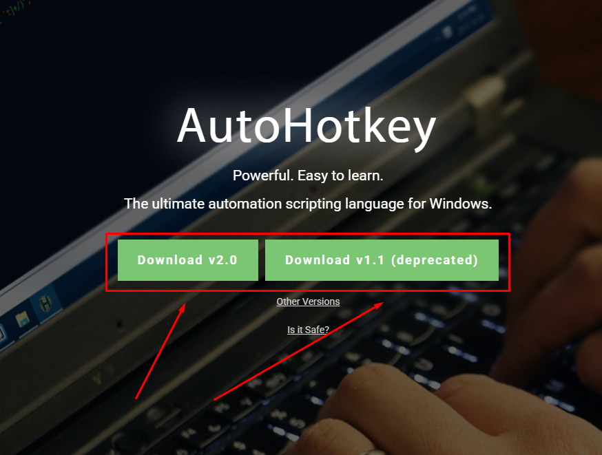
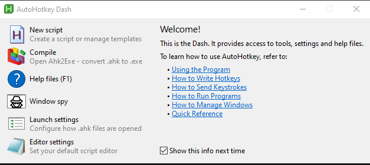
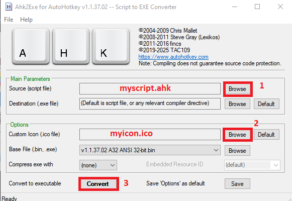
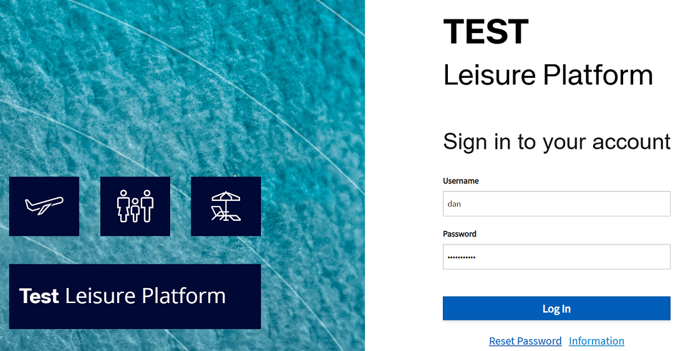

---
title: "AutoHotKey"
discription: How to programmatically connect to a complex website
date: 2025-01-22T21:29:01+08:00 
draft: false
type: post
tags: ["AutoHotKey","Scripts","Windows"]
showTableOfContents: true
--- 

For complex sites with redirects to another site, where each user has a unique token in the GET request metadata, making it impossible to store credentials in the browser cache since the page is different each time.


### Download AutoHotkey

First, we need to download it from the website. https://www.autohotkey.com (My script works on version 1.1, but you can download all versions.)



### Simple Script 

create simple script for autoconnect for website

First, open new text document and copy & past `dan` and `pasword` replace it with yours and save it like `myscript.ahk`
```ahk
Run, "C:\Program Files (x86)\Microsoft\Edge\Application\msedge.exe" "https://*****.co.il/*****/default.php"
Sleep, 5000 ; We will wait 5 sec for the site to load (you can increase the time if necessary)

; Automatic input
Send, dan ; Enter your username
Send, {Tab} ; Switching to the password entry field
Send, Mypassword ; Enter your password
Send, {Enter} ; Press Enter to enter
```


### .ahk to .exe 

Now we want to run it where there is no AutoHotKey program. so we need to turn it into an .exe file.

Open `AutoHotKey Dash` > `Compile`



First, take your script.ahk after take icon from internet or create it from png file and cover it 



Run it 

