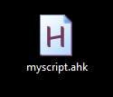
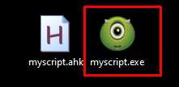

---
title: "AutoHotKey"
discription: How to programmatically connect to a complex website
date: 2025-01-22T21:29:01+08:00 
draft: false
type: post
tags: ["AutoHotKey","Scripts","Windows"]
showTableOfContents: true
--- 

For complex sites with redirects to another site, where each user has a unique token in the GET request metadata, making it impossible to store credentials in the browser cache since the page is different each time.


### Download AutoHotkey

1. we need to download it from the website. https://www.autohotkey.com (download all versions.)


### Simple Script 

create simple script for autoconnect for website

1. Open new text document and copy & past `dan` and `pasword` replace it with yours and save it like `myscript.ahk`
```ahk
Run, "C:\Program Files (x86)\Microsoft\Edge\Application\msedge.exe" "https://*****.co.il/*****/default.php"
Sleep, 5000 ; We will wait 5 sec for the site to load (you can increase the time if necessary)

; Automatic input
Send, dan ; Enter your username
Send, {Tab} ; Switching to the password entry field
Send, Mypassword ; Enter your password
Send, {Enter} ; Press Enter to enter
```
2. Save it like `myscript.ahk` or your custom name 



### Convert file.ahk to file.exe 

Now we want to run it where there is no AutoHotKey program. so we need to turn it into an `.exe` file.

1. Open `AutoHotKey Dash` > `Compile`


2. Take your script `script.ahk`, then find an icon from the internet or create one from a PNG file, and assign it to your script.


3. This should look like this :



4. Done

