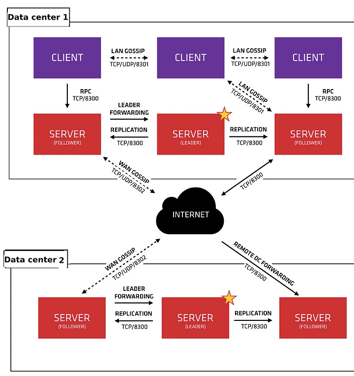
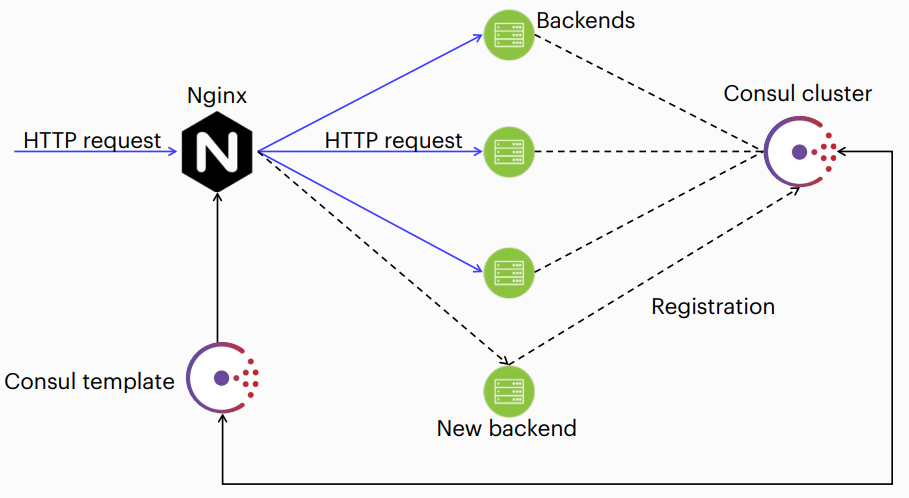
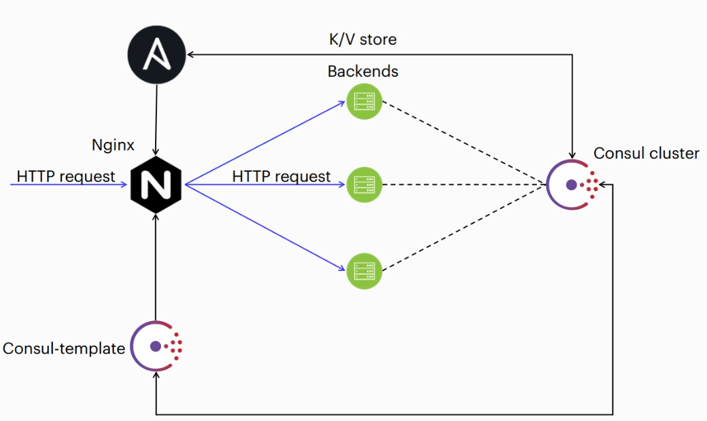

Consul provides feature such as:

- Service discovery

- Tagging

- Health checks

- Secure Service Communication

- Multi Datacenter

- System-wide key/value storage





## Server vs Client

Server: 

running on individual machine

form a failsafe cluster

communicating with client machine

Client:

working on machine were running service

checking health of server

sending information on server

example config registration service
```json
`{ "service":{"name": "web", "tags":["be"], "port": 80,"check":{"args": ["curl", "localhost"], "interval": "10s" }}}`
```
## Instal consul 

create account consul
```
useradd -s /bin/false -m consul
```
download binar file https://developer.hashicorp.com/consul/downloads for ubuntu 

for example
```
https://releases.hashicorp.com/consul/1.10.3/consul_1.10.3_linux_amd64.zip

```
unzip
```
unzip consul_1.10.3_linux_amd64.zip.
```
Then move the file to `~/bin.`
```
cp consul ~/bin/
```

After this, add the directory with the binary file to `$PATH`. For this you need
open `~/.bashrc` and add the line
```
export PATH=$PATH:~/bin.
```
As a result, you will be able to call Consul from the command line by typing
```
consul
```
Option2:
```
 wget -O- https://apt.releases.hashicorp.com/gpg | sudo gpg --dearmor -o /usr/share/keyrings/hashicorp-archive-keyring.gpg
 echo "deb [signed-by=/usr/share/keyrings/hashicorp-archive-keyring.gpg] https://apt.releases.hashicorp.com $(lsb_release -cs) main" | sudo tee /etc/apt/sources.list.d/hashicorp.list
 sudo apt update && sudo apt install consul
```

for fix
```
sudo apt install software-properties-common

curl -fsSL https://apt.releases.hashicorp.com/gpg | sudo apt-key add -

sudo apt-add-repository "deb [arch=amd64] https://apt.releases.hashicorp.com $(lsb_release -cs) main"

sudo apt-get update && sudo apt-get install consul
```
test:
```
consul
```


see status of service
```
systemctl status consul
```
see config of consul service
```
cat /lib/systemd/system/consul.service
```

Agents Configuration File Reference
```
cd /etc/consul.d 

nano consul.hcl
```
```
datacenter = "dc"
server = true
data_dir = "/opt/consul"
client_addr = "192.168.0.1 127.0.0.1"
bootstrap_expect = 3
bind_addr = "192.168.0.1"
encrypt = "8kKJSxjc6Hs7w5Qi/1ojxs2OPeZTnGskAIpZ2GRw4Eo="

```
`server = true` -work like server false work like client

`client_addr = "192.168.0.1 127.0.0.1"` ip of server and 127.0.0.1 need for cli 

`bind_addr` my ip address

`bootstrap_expect = 3` min 3 servers
`encrypt = "8kKJSxjc6Hs7w5Qi/1ojxs2OPeZTnGskAIpZ2GRw4Eo="` its key for consul need generate first 

## Generate key consul

```
consul keygen
```


## Useful commands

`consul validate /etc/consul.d/consul.hcl` - checking the agent config

`consul join <IP address or node name>` — join to cluster, new member

`consul leave` — exclude a node from the cluster

`consul maint -enable` — enable service mode on the node

`consul maint -disable` — return to working mode from maintenance mode

`consul members` — show cluster members

`consul info` — general information about the cluster

`consul reload` — reread the agent configuration

`consul catalog services` — show a list of registered services in the cluster

`consul register backend.json` — register the service described in the fe.json file

`consul deregister backend.json` — deregister the service described in the fe.json file


## Configuratin Client of Consul


`nano /etc/consul.d/consul.hcl`
```
data_dir = "/opt/consul"
client_addr = "192.168.0.4 127.0.0.1"
bind_addr = "192.168.0.4"
encrypt = "8kKJSxjc6Hs7w5Qi/1ojxs2OPeZTnGskAIpZ2GRw4Eo="
enable_local_script_checks = true
```

`enable_local_script_checks = true` enable check scripts to work service online

start consul
```
systemctl start consul
```

### Config json script 

in `/etc/consul.d` create new file `backend.json` 
```json
"service":
  { "name": "be",
    "tags": [ "be" ],
    "check":
      {
         "id": "NGINX",
         "name": "Test check",
         "http": "http://localhost",
         "method": "GET",
         "interval": "10s",
         "timeout": "1s"
      }
  }
}
```

for test
```
{ "service": { "name": "be", "tags": [ "be" ], "port":
80, "check": { "args": [ "curl", "localhost" ],
"interval": "10s" } } }
```

## DNS Interface

Get information about a node:
```
dig @127.0.0.1 -p 8600 client.node.consul  # <node>.node[.datacenter].<domain>
```
```
dig @127.0.0.1 -p 8600 vm-9918226g.node.consul
```

Get information about a services:
```
dig @127.0.0.1 -p8600 be.service.consul # [tag.]<service>.service[.datacenter].<domain>
```

More details about the service:
```
dig @127.0.0.1 -p8600 be.service.consul SRV
```

## HTTP API

Show nodes in cluster"
```bash
curl http://localhost:8500/v1/catalog/nodes?pretty
```
Show services in cluster
```bash
curl http://127.0.0.1:8500/v1/catalog/services
```
Show node vm-cb4c04f2 status
```bash
curl http://127.0.0.1:8500/v1/health/node/vm-cb4c04f2?pretty
```
Show status serivce on local node `backend` 
```bash
curl http://localhost:8500/v1/agent/health/service/name/backend?pretty
```

`?pretty` format json


## UI Config enable

graphic interface

`nano /etc/consul.d/consul.hcl`
```
ui_config{
  enabled=true
}
```

need create tunnel for virtual machine
```
ssh -L 8500:localhost:8500 root@<ip_of_machine>
```

after goto `127.0.0.1:8500/ui`


## Consul Template

install on new machine
```bash
apt install software-properties-common
```
```bash
curl -fsSL https://apt.releases.hashicorp.com/gpg | sudo apt-key add -
```
```bash
apt-add-repository "deb [arch=amd64] https://apt.releases.hashicorp.com $(lsb_release -cs) main"
```
```bash
apt-get update && sudo apt-get install consul-template
```
```bash
mkdir /etc/consul-template.d/
```
```bash
 chown -R consul:consul /etc/consul-template.d
```


## Create for Consul Template Systemd Unit




The deb package does not have a consul template start/stop service, need to create it in yourself.

create service file
```
nano /usr/lib/systemd/system/consul-template.service
```
copy && past
```
[Unit]
Description=Consul-Template Daemon
Documentation=https://github.com/hashicorp/consul-template/
Wants=basic.target
After=network.target

[Service]
User=consul
Group=consul
ExecStart=/usr/bin/consul-template -config=/etc/consul-template.d/
SuccessExitStatus=12
ExecReload=/bin/kill -HUP $MAINPID
KillSignal=SIGINT
KillMode=process
Restart=on-failure
RestartSec=42s
LimitNOFILE=4096

[Install]
WantedBy=multi-user.target
```


## Work with key-value storage

add mykey value 5
```
curl -X PUT -d 5 http://127.0.0.1:8500/v1/kv/mykey
```
or
```
consul kv put mykey 5
```

get value mykey (get in base64 crypt)
```
curl -X GET http://127.0.0.1:8500/v1/kv/mykey
```
uncrypt key
```
echo '<base64>' | base65 -d
```

or
```
consul kv get mykey
```


### Requests to the consul from the Consul-template

requests in catalog
```
{{ service "<TAG>.<NAME>@<DATACENTER>~<NEAR>|<FILTER>" }}
```
- TAG - tag of service, optional parametr

- NAME - name of service, required parameter

- DATACENTER - name of data server, optional parametr

- NEAR - order output by shortest path to the specified node, if not specified, the result will be
in lexicographic order, optional parameter.

- FILTER — filtering nodes by state, optional
parameter. Possible values: any, passing, warning
```
{{ services "@<DATACENTER>" }}
```
- DATACENTER — data center where the requested all services in catalog

### Language constructs for templates

template

```
{{ range service "be" }}
server {{ .Name }} {{ .Address }}:{{ .Port }}
{{ end }}
```
```
server be01 192.168.0.4
{{range service “be”}}
       server {{ .Name }} {{ .Address }}:{{ .Port }}
       {{else}}
       server 192.168.0.100
       {{end}}
```

### Requests to Requests to KV storage
```
{{ key "<PATH>@<DATACENTER>" }}
```
```
{{ keyExists "<PATH>@<DATACENTER>" }}
```
```
{{ keyOrDefault "<PATH>@<DATACENTER>" "<DEFAULT>" }}
```
- PATH - path to the key, for example, service/redis/maxconns

- DATACENTER - data center, if not specified, the local one will be used

- DEFAULT - default value if key does not exist


### language constructs for templates
```
{{ if keyExists "nginx/mykey" }}
# ...
{{ else }}
# ...
{{ end }}
```
```
location /location/ {
{{ if keyExists (printf "balancer/internal/%s" (env "HOST")) }}
proxy_pass http://{{ keyOrDefault "mapping/internal" "internal" }}/;
{{ end }}
}
```


## Inventory files



on ansible machine edit `consul.inv`

consul.inv
```
[consul_instances]
192.168.0.1 consul_bind_address=192.168.0.1 consul_client_address="192.168.0.1 127.0.0.1" \
consul_node_role=server consul_bootstrap_expect=true
192.168.0.2 consul_bind_address=192.168.0.2 consul_client_address="192.168.0.2 127.0.0.1" \
consul_node_role=server consul_bootstrap_expect=true
192.168.0.3 consul_bind_address=192.168.0.3 consul_client_address="192.168.0.3 127.0.0.1" \
consul_node_role=server consul_bootstrap_expect=true
192.168.0.4 consul_bind_address=192.168.0.4 consul_client_address="192.168.0.4 127.0.0.1" \
consul_node_role=client consul_enable_local_script_checks=true
192.168.0.6 consul_bind_address=192.168.0.6 consul_client_address="192.168.0.6 127.0.0.1" \
consul_node_role=client

[nginx]
192.168.0.4
192.168.0.6

```
ansible file edit `site.yml`
```yaml
- name: Assemble Consul cluster
  hosts: consul_instances
  any_errors_fatal: true
  become: true
  become_user: root
  roles:
    - ansible-consul

- name: Consul client and service
  hosts: 192.168.0.4
  vars_files:
    - consul_services.yaml
  any_errors_fatal: true
  become: true
  become_user: root
  roles:
    - ansible-consul

- name: Install Nginx
  hosts: nginx
  become: true
  become_user: root
  roles:
    - ansible-role-nginx
```
run
```
ansible-playbook -i consul.inv site.yaml
```


after need install on consul-template machine file `consul-template-config.json`

configurate file consul-template-config.json for consul-template

need add to  `/etc/consul-template.d/consul-template-config.json` 
```bash
nano `consul-template-config.json`
```

in file:
```json 
consul {
  address = "localhost:8500"
  retry {
  enabled = true
  attempts = 12
  backoff = "250ms"
  }
}
template {
  source = "/etc/nginx/conf.d/load-balancer.conf.ctmpl"
  destination = "/etc/nginx/conf.d/load-balancer.conf"
  perms = 0600
  command = "nginx -s reload"
}
```


### Template Jinja2 Nginx for Ansible

on ansible machine need download in `./asnisble_playbook/roles/`
```
clone https://github.com/nginxinc/ansible-role-nginx.git
```
```bash
cd ansible-role-nginx-config
```
need add  to`/roles/ansible-role-nginx-config/templates/stream/load-balancer.conf.ctmpl.j2.`
```bash
nano /templates/stream/load-balancer.conf.ctmpl.j2
```
template jinja2
```

upstream {{ backend }} {
  server 127.0.0.1:8080;
}

upstream python {
{{'{{'}}- range service "{{ servicename }}" {{'}}'}}
  server {{'{{'}} .Address {{'}}'}};
{{'{{'}}- end {{'}}'}}
}

server {
  listen 80;
  location / {

       proxy_pass http://{{ backend }};

       proxy_pass http://python;

  }
}
```

### Algorithm generate template


Create playbook for ansible `nginx-consul-template-ansible.yaml` in directory `~/asnible_playbooks/roles`

```
nano nginx-consul-template-ansible.yaml
```
```
---
# Playbook for configuring Nginx as a load balancer for consul-template
- name: Configuring Nginx
  hosts: 192.168.0.6
  become: true
  become_user: root
  tasks:
  - name: Getting backend name from consul KV storage
    delegate_to: 127.0.0.1
    ignore_errors: yes
    set_fact:
      backend: "{{ lookup('consul_kv', 'backend', host='192.168.0.6') }}"
    when: backend | length > 0
  - name: Configure Nginx for consul-template
  include_role: 
    name: ansible-role-nginx-config
  vars:
    servicename: backend
    nginx_config_stream_template_enable: true
    nginx_config_stream_template:
       - template_file: stream/load-balancer.conf.ctmpl.j2
         conf_file_name: load-balancer.conf.ctmpl
         conf_file_location: /etc/nginx/conf.d
    nginx_config_cleanup: true
    nginx_config_cleanup_paths:
    - directory:
      - /etc/nginx/conf.d
      - /etc/nginx/sites-enabled
      recurse: false
    nginx_config_cleanup_files: 
      - /etc/nginx/conf.d/default.conf
      - /etc/nginx/sites-enabled/000-default
```
run 
```
ansible-playbook -i consul.inv nginx-consul-template-ansible.yaml
```


in consul-template machine `/`etc/nginx/conf.d/load-balance.conf.ctmpl`
see if automatic create template file
```
cat load-balance.conf.ctmpl
```
run consul temlate
```
systemctl start consul-temlate
```
after it you can see automaticly create file for nginx `/etc/nginx/loadbalance.conf`

see if Nginx run
```bash
systemcl status nginx
```
test if nginx running
```bash
curl 127.0.0.1 
```

see logs on client if all running 
```
tail /var/logs/nginx/access.log 
```


## cluster 3 


on ansible machine 

init consul (create role consul)
```
ansible-galaxy init consul
```
after go to `cd roles/consul/tasks/` and create new file `main.yml`

```
nano main.yml
```
copy && past:
```
---
# tasks file for consul
- name: Install auxiliary applications
  apt:
   name:
     - software-properties-common
     - python3
     - python3-pip
     - python-setuptools
  update_cache: yes
- name: install python-consul for ansible searching plugin
  run_once: true
  delegate_to: 192.168.0.4
  pip:
    name: python_consul
    executable: pip3
- name: Install consul GPG key
  apt_key:
    url: https://apt.release.hashicorp.com/gpg
    keyring: /etc/apt/trusted.gpg.d/hashicorp.gpg
    state: present
- name: add consul official repository
  apt_repository:
    repo: deb [arc=amd64 signed-by=/etc/apt/trusted.gpg.d/hashicorp.gpg] https://apt.releases.hasicorp.com focal main
- name: Install consul
  apt:
    name: consul
    update_cache: yes
- name: Install consul-template
  run_once: true
  delegate_to: 192.168.0.4
  apt:
    name: consule-template
- name: Copy systemd file or consul-template
  run_once: true
  delegate_to: 192.168.0.4
  copy:
    scr: consul-template.service
    dest: /usr/lib/systemd/system/
    owner: root
    group: root
- name: create directory for consul-template config
  run_once: true
  delegate_to: 192.168.0.4
  file:
    path: /etc/consul-template.d/
    owner: consul
    group: consul
    state: directory
- name: copy consul-template config
  run_once: true
  delegate_to: 192.168.0.4
  copy:
    scr: consul-template.json
    dest: /etc/consul-template.d/
    owner: consul
    group: consul
```
 

 after create new file `site.yml`

 ```bash
nano site.yml
 ```
 copy && past\
 ```
---
# File: site.yml - Example Consul site playbook

- name: Install consul
  hosts: consul_instances
  roles:
     - consul
- name: Assemble Consul cluster
  hosts: consul instances
  any_errors_fatal: true
  become: true
  become_user: root
  roles:
    - ansible-consul

- name: Install Nginx
  hosts: 192.168.0.5
  vars_files:
    - consul_services_v1.yaml
  any_errors_fatal: true
  become: true
  become_user: root
  roles:
    - ansible-consul

- name: Install Nginx
  hosts: 192.168.0.6
  vars_files:
    - consul_services_v2.yaml
  any_errors_fatal: true
  become: true
  become_user: root
  roles:
    - ansible-consul
```

### Clone Ansible-console to Ansible

clone to /ansible_playbooks/roles/
```
git clone https://github.com/ansible-community/ansible-consul.git
```


### Create Services 

create `consule_services_v1.yaml`
```yaml
---
consul_services:
  - name: "be_version_v1"
    id: "web server v1"
    tags: ['bev1']
    checks:
        - { name: 'Check Nginx availability', id: 'Nginx'. http://127.0.0.1', method: 'GET', interval: '10s', timeout: '1s' }
    
```

create `consule_services_v2.yaml`
```yaml
---
consul_services:
  - name: "be_version_v2"
    id: "web server v2"
    tags: ['bev2']
    checks:
        - { name: 'Check Nginx availability', id: 'Nginx'. http://127.0.0.1', method: 'GET', interval: '10s', timeout: '1s' }
    
```

### consule-template.json config

https://github.com/hashicorp/consul-template/blob/main/docs/templating-language.md#service


need create `consul-template.json` and `consul-template.service` in `/ansible-playbooks/roles/consul/files/`

consul-template.json
```
consul {
  address: = "localhost:8500"

  retry {
    enable = true
    attempts = 12
    backoff = "250ms"
  }
}
template {
  source        = "/etc/nginx/conf.d/load-balancer.conf.tmp"
  destination   = "/etc/nginx/conf.d/load-balancer.conf"
  perms         = 0600
  command       = "nginx -s reload"
}
```
consule-template.service
```
[Unit]
Description=Consul-Template Daemon
Documentation=https://github.com/hashicorp/consul-template/
Wants=basic.target
After=network.target

[Service]
User=consul
Group=consul
ExecStart=/usr/bin/consul-template -config=/etc/consul-template.d/
SuccessExitStatus=12
ExecReload=/bin/kill -HUP $MAINPID
KillSignal=SIGINT
KillMode=process
Restart=on-failure
RestartSec=42s
LimitNOFILE=4096

[Install]
WantedBy=multi-user.target
```

### Inventory File

now need inventory file `consul.inv` create in directory `/ansibe-playbooks/`

consul.inv
```
[consul_instances]

192.168.0.1 consul_bind_address=192.168.0.1 consul_client_address="192.168.0.1 127.0.0.1" consul_node_role=server consul_bootstrap_expect=true
192.168.0.2 consul_bind_address=192.168.0.2 consul_client_address="192.168.0.2 127.0.0.1" consul_node_role=server consul_bootstrap_expect=true
192.168.0.3 consul_bind_address=192.168.0.3 consul_client_address="192.168.0.3127.0.0.1" consul_node_role=server consul_bootstrap_expect=true
192.168.0.4 consul_bind_address=192.168.0.4 consul_client_address="192.168.0.4 127.0.0.1" consul_node_role=client consul_enable_local_script_checks=false
192.168.0.5 consul_bind_address=192.168.0.4 consul_client_address="192.168.0.5 127.0.0.1" consul_node_role=client consul_enable_local_script_checks=true
192.168.0.6 consul_bind_address=192.168.0.4 consul_client_address="192.168.0.6 127.0.0.1" consul_node_role=client consul_enable_local_script_checks=true

[consul_template]
192.168.0.4
[nginx]
192.168.0.4
192.168.0.5
192.168.0.6
[backend]
192.168.0.5
192.168.0.6
```

now run playbook
```
ansible-playbook -i consul.inv site.yml
```


### Configuration Nginx

download role to `/ansible-playbooks/roles/`

clone
```
git clone https://github.com/nginxinc/ansible-role-nginx.git
```

create new file `config_nginx.yml`

```yaml

---
-name: Configuring Nginx
 hosts: consul_template
 become: true
 become_user: root
 tasks:
   - name: Getting backend name from consul KV storage
     set_fact:
     version: "{{ lookup('consul_kv', 'version', host='192.168.0.4') | default('v2', true) }}" 
   - name: print version
     debug:
       msg: "version= {{ version }}"
   - name: Configure Nginx for consul-template
     include_role:
       name: ansible-role-nginx-config
     vars:
       nginx_config_stream_template_enable: true
       nginx_config_stream_template:
          - template_file: stream/load-balancer.conf.tmp.j2        
            conf_file_name: load-balancer.conf.tmp
            conf_file_location:: /etc/nginx/conf.d
       ngnix_config_cleanup: true
       ngnix_config_cleanup_paths:
          - directory:
              - /etc/nginx/conf.d
              - /etc/nginx/sites-enabled
            recurse: false
       ngnix_config_cleanup_files:
          - /etc/nginx/conf.d/default.conf
          - /etc/nginx/sites-enabled/000-default
```


### Ansible Role Ngnix Config

`/roles/ansible-role-nginx-config/templates/stream/load-balancer.conf.tmp.js`

```j2

  
   upsteam be_version_v1 {
     {{'{{'}}- range service "be_version_v1" {{'}}'}}
       server {{'{{'}} .Address {{'}}'}};
     {{'{{'}}- end {{'}}'}}
}

  upsteam be_version_v2 {
    {{'{{'}}- range service "be_version_v2 {{'}}'}}
       server {{'{{'}} .Address {{'}}'}};
    {{'{{'}}- end {{'}}'}}
  }
  


server {
   listen 80;


  
   location /v1/ {
       proxy_pass http://be_version_v1;
}


   location /v2/ {
       proxy_pass http://be_version_v2;
 }
}

  

```
run   
```bash
ansible-playbook -i consul.inv configure-nginx.yml 
```

