## IPv6 Neighbor Discovery Protocol

As we already mentioned a couple of times in this course - there is no Address Resolution Protocol (ARP) in IPv6. But then you may be wondering, how does IPv6-to-MAC resolution is done. How does a node find the physical address of a know IPv6 address? The answer is - using the **IPv6 Neighbor Discovery Protocol**. It is a **more secure and efficient** way of handling the Layer 3 to Layer 2 resolution process **using multicast messages instead of broadcast** like in IPv4.

The term **Neighbor** or **Neighbor node** refers to IPv6 nodes that are on the same local segment or in the same layer 2 domain. 

## Message Types
IPv6 Neighbor Discovery Protocol defines 5 types of messages that use ICMPv6 encapsulation:

- Router Solicitation (ICMPv6 type 133)

- Router Advertisement (ICMPv6 type 134)

- Neighbor Solicitation (ICMPv6 type 135)

- Neighbor Advertisement (ICMPv6 type 136)

- Redirect Message (ICMPv6 type 137)

In comparison, ARP messages such as ARP Request and ARP Reply are encapsulated directly in an Ethernet frame. 

Let's examine each message in detail and see what is its role in the process.

### Neighbor Solicitation (NS)

When a node needs to resolve the physical address of a known IPv6 address, it sends a Neighbor Solicitation (NS) message on the network segment. ***This message is the IPv6 alternative to the ARP Request***. There are few changes in comparing to ARP though that makes the Neighbour Solicitation **more secure and efficient**.

Let's look at the example shown in figure 1 where PC1 wants to resolve the physical address of PC3 - FE80::20C:CFF:FECC: CCCC.  PC1 needs to send a Neighbour Solicitation message for this IPv6 address so it creates a new ICMPv6 packet type 135. Type 135 explicitly tells the receiving side that this is an NS packet. In the target field of the ICMPv6, PC1 puts the IPv6 address that it wants to find the MAC of. In our example, it would be one of PC3 -  FE80::20C:CFF:FECC:CCCC.

This ICMPv6 message is then encapsulated in an IPv6 packet. For source address at layer 3, PC1 sets its own link-local address FE80:20A:AFF:FEAA:AAAA. ***The destination address is key in the improved security and efficiency comparing to the ARP protocol in IPv4***. For destination address in the IPv6 packet, PC1 set a special type of multicast address called **solicited-node** multicast.  For each configured IPv6 address, every node joins a multicast group identified by the address FF02::1:FFXX:XXXX where XX:XXXX are the last 6 hexadecimal values in the IPv6 unicast address. Therefore, for each configured unicast address, no matter if it is link-local or global, the host joins the respective auto-generated **solicited-node** multicast group.

In our example, PC1 wants to send the NS message to the node with IP address FE80::20C:CFF:FECC: CCCC. Having the above logic in mind, the node that has that IPv6 address must have joint the solicited-node group generated from that address - FF02::1:FFCC:CCCC.

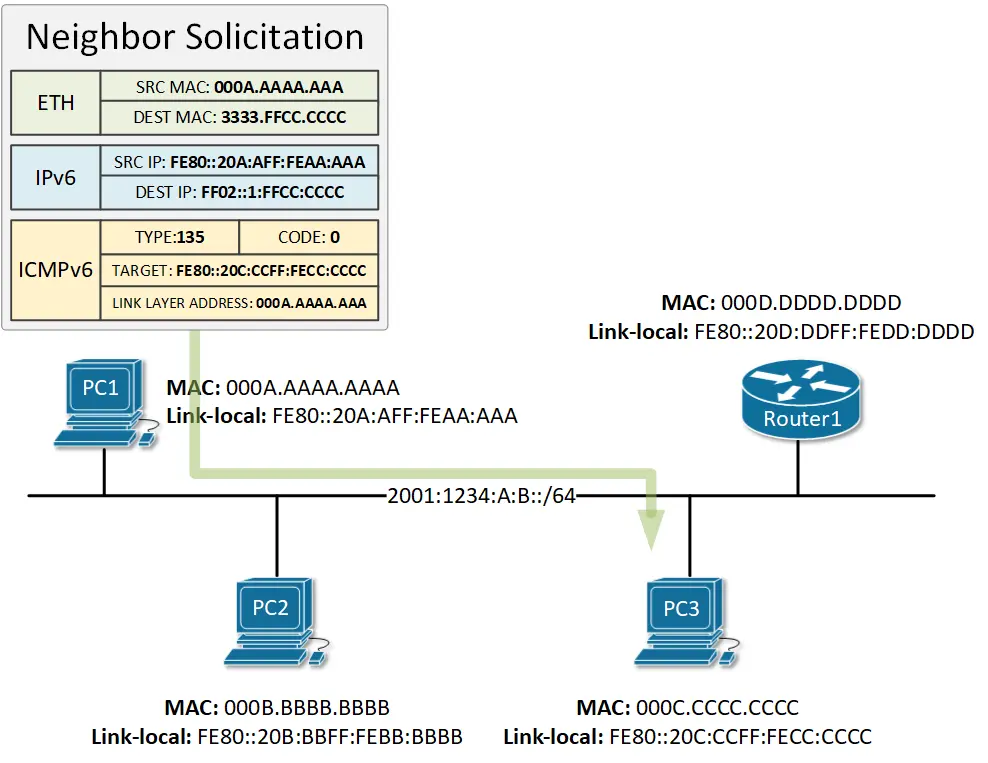
***Figure 1. IPv6 Neighbor Solicitation Message***

After the IPv6 header is filled, the packet is encapsulated in an Ethernet frame. For source MAC address, PC1 sets its own burnt-in physical address. The destination MAC address is set to a multicast MAC generated from the multicast IPv6 address in the layer 3 header using the following formula. 3333.XXXX.XXXX where XXXX:XXXX are the last 8 hex digits in the multicast IPv6 address. In our example, this will result in the physical address of 3333.FFCC.CCCC because are the last 8 hex digits in the destination address FF02::1:FFCC:CCC.

When PC1 sends this Neighbor Solicitation message on the network, there are two possible scenarios:

- If switches in the local segment are running a protocol called IPv6 Multicast Listener Discovery Snooping (MLD), they will know that only PC3 is subscribed to the multicast group FF02::1:FFCC:CCC and will switch the frame only to PC3.

- If the switches in the local segment are not running MLD, they will broadcast the frame to every node in the segment in the same way as an ARP frame in IPv4. However, only PC3 will process the packet, because only PC3 is subscribed to this multicast group. All other nodes that get this NS packet will discard it, because they do not listen to this solicited-node address FF02::1:FFCC:CCC.

### Neighbor Advertisement (NA)

When PC3 gets the Neighbor Solicitation message from PC1, it will look at the Target field in the ICMPv6 header and will compare it against its own configured IPv6 addresses. The target address matches PC3's link-local address, so PC3 will reply back to PC1 with a message called Neighbor Advertisement.***This message is the IPv6 alternative to the ARP Reply in IPv4***.

Let's examine in detail all values in the message. In the ICMPv6 header, PC3 sets the Type field to 136, which means that this is a NA message. In the Target field, P3 sets the IPv6 address and in the ***Link-local Address*** field, it sets the physical address of the interface configured with this IPv6.

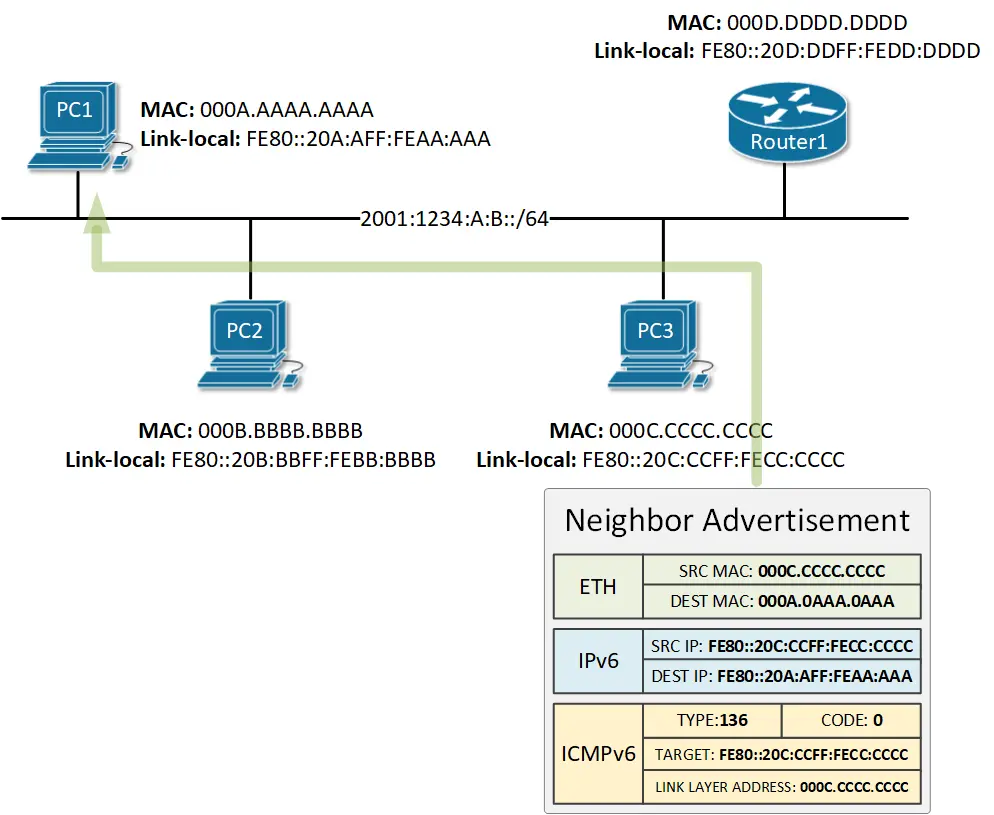
***Figure 2. IPv6 Neighbor Advertisement Message***

In the IPv6 header, PC3 sets the source IPv6 address to be its link-local address and the destination to be the link-local address of PC1.

In the Ethernet header, PC3 sets its own physical address as source MAC and the physical address of PC3 as destination MAC. 
> Note that the Neighbor Advertisement is a**unicast message**. 

### Router Advertisement (RA)

IPv6 routers attached to a local segment advertise their presence periodically via an ICMPv6 message called **Router Advertisement (RA)**. The message is destined to the **all-nodes** multicast address FF02::1 which means that every node on the segment receives and processes it. RA messages contain the ***prefix*** and the ***prefix length*** used on this segment as well as other parameters such as MTU. Cisco routers advertise their presence on a segment every 200 seconds by default. 

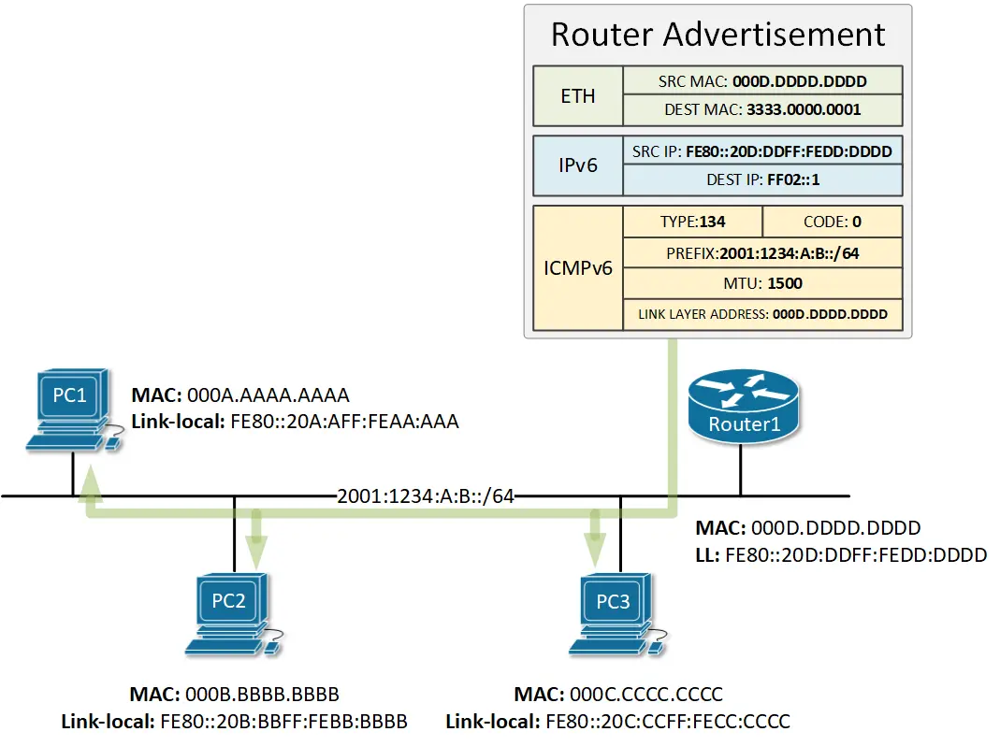
***Figure 3. IPv6 Router Advertisement Message***

Nodes use these messages for services such as Stateless Autoconfiguring (SLAAC) which we explain in detail in this lesson.

### Router Solicitation (RS)

As we said above, Cisco routers send Router Advertisement messages every 200 seconds by default. However, when a node is connected to a local segment, it sends out a message called Neighbor Solicitation that requests that routers generate Router Advertisements (RA) immediately rather than at their next scheduled time.

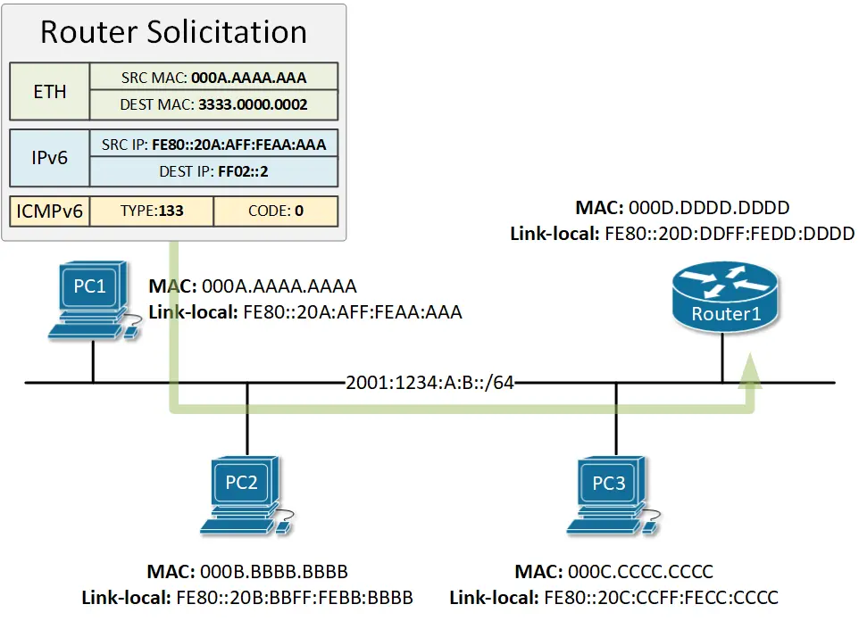
***Figure 4. IPv6 Router Solicitation Message***

As you can see in the example in figure 4, the Router Solicitation message is destined to the **all-routers** multicast address, which means that only the routers on the local segment will process these RS messages.

### Summary

IPv6 Neighbor Discovery Protocol works by using 5 types of messages encapsulated in ICMPv6. Each message has the following purpose:

- **Router Solicitation** - Hosts use Router Solicitation messages to locate routers in their local segment. Upon receipt of an RS message, routers generate Router Advertisements immediately rather than at their next scheduled time. The RS message uses ICMPv6 type 133 and is destined to the **all-routers** multicast address FF02::2.

- **Router Advertisement** - IPv6 routers advertise their presence in the local segments either periodically, or in response to a Router Solicitation. The RA message uses ICMPv6 type 134 and is destined to the **all-nodes** multicast address FF02::1. Cisco router sent RA messages every 200 seconds by default.

- **Neighbor Solicitation** - The Neighbor Solicitation message is used by nodes to resolve the physical address of a known IPv6 address (target address). The NS message is encapsulated in ICMPv6 type 135 and is destined to the **solicited-node multicast group** that is auto-generated from the targeted IPv6 address. Only the owner of the targeted IP must have subscribed to this solicited-node group. The message has a similar function to the IPv4 ARP Request but is **more secure and efficient** because it is not broadcasted to all nodes. 

- **Neighbor Advertisement** - Neighbor advertisements are used by nodes to respond to a Neighbor Solicitation message. The NA message is encapsulated in ICMPv6 type 136 and is destined for the **unicast address** in the Neighbor Solicitation message. 

- **Redirect Message** -  Routers informs hosts of a better first-hop router for a destination.

## IPv6 Stateless Address Auto-configuration (SLAAC)

Each IPv6 node on the network needs a globally unique address to communicate outside its local segment. But where a node get such an address from? There are a few options:

- **Manual assignment** - Every node can be configured with an IPv6 address manually by an administrator. It is not a scalable approach and is prone to human error.  

- **DHCPv6** (The Dynamic Host Configuration Protocol version 6) - The most widely adopted protocol for dynamically assigning addresses to hosts. Requires a DHCP server on the network and additional configuration.

- **SLAAC** (Stateless Address Autoconfiguration) -  It was designed to be a simpler and more straight-forward approach to IPv6 auto-addressing. In its current implementation as defined in RFC 4862, SLAAC does not provide DNS server addresses to hosts and that is why it is not widely adopted at the moment. 

In this lesson, we are going to learn how SLAAC works and what are the pros and cons of using it in comparison to DHCPv6.

### What is SLAAC?

**SLAAC** stands for Stateless Address Autoconfiguration and the name pretty much explains what it does. It is a mechanism that enables each host on the network to auto-configure a unique IPv6 address without any device keeping track of which address is assigned to which node.

Stateless and Stateful in the context of address assignment mean the following:


- **A stateful address assignment** involves a server or other device that keeps track of the state of each assignment. It tracks the address pool availability and resolves duplicated address conflicts. It also logs every assignment and keeps track of the expiration times.

- **Stateless address assignment** means that no server keeps track of what addresses have been assigned and what addresses are still available for an assignment. Also in the stateless assignment scenario, nodes are responsible to resolve any duplicated address conflicts following the logic: Generate an IPv6 address, run the Duplicate Address Detection (DAD), if the address happens to be in use, generate another one and run DAD again, etc.

### How does SLAAC work?

To fully understand how the IPv6 auto-addressing work, let's follow the steps an IPv6 node takes from the moment it gets connect to the network to the moment it has a unique global unicast address.

**Step 1: The node configures itself with a link-local address**

When an IPv6 node is connected to an IPv6 enabled network, the first thing it typically does is to auto-configure itself with a link-local address. The purpose of this local address is to enable the node to communicate at Layer 3 with other IPv6 devices in the local segment. The most widely adopted way of auto-configuring a link-local address is by combining the link-local prefix FE80::/64 and the EUI-64 interface identifier, generated from the interface's MAC address. 

Figure 1 shows a step by step example of how a local address is generated from MAC address 7007.1234.5678.

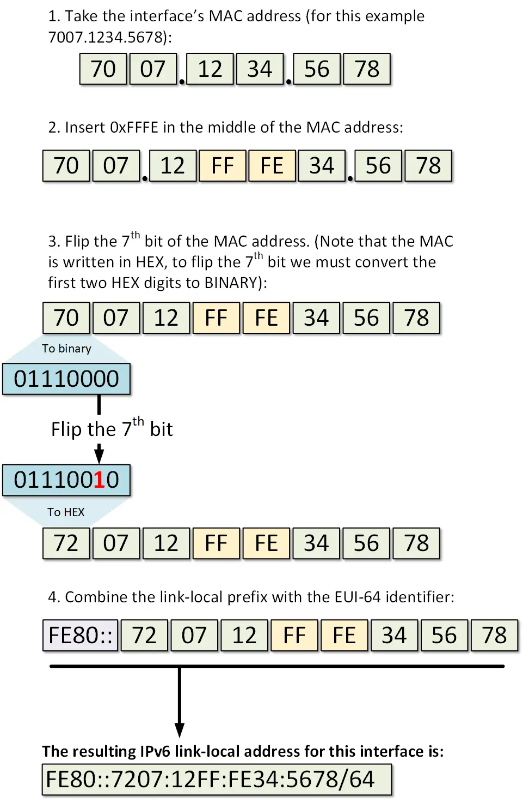
***Figure 1. Generating a link-local address from interface's MAC address***

Once the above steps are completed, the node has a fully functional EUI-64 format link-local address as shown below:

```
C:\>ipconfig /all

Ethernet adapter Ethernet0:

   Connection-specific DNS Suffix..: 
   Physical Address................: 7007.1234.5678
   Link-local IPv6 Address.........: FE80::7207:12FF:FE34:5678
   IP Address......................: 0.0.0.0
   Subnet Mask.....................: 0.0.0.0
   Default Gateway.................: 0.0.0.0
   DNS Servers.....................: 0.0.0.0
   DHCP Servers....................: 0.0.0.0
   DHCPv6 Client DUID..............: 00-01-00-01-C4-35-08-8E-70-07-12-34-56-78
```
**Step 2: The node performs Duplicate Address Detection (DAD)**

After the IPv6 host has its link-local address auto-configured, it has to make sure that the address is actually unique in the local segment. Even though the chances that another node has the same exact address are very slim. It has to perform a process called Duplicate Address Detection (DAD).

DAD is a mechanism that involves a special type of address called solicited-node multicast. Upon configuring an IPv6 address, every node joins a multicast group identified by the address FF02::1:FFxx:xxxx where xx:xxxx are the last 6 hexadecimal values in the IPv6 unicast address. Therefore, for each configured unicast address, no matter if it is link-local or global, the host joins the respective auto-generated solicited-node multicast group.

In our example, the last 6 hexadecimal values of the link-local address are 34:5678 so the node joins the multicast group FF02::1:FF34:5678. As PC1 is running a Windows 10 operating system, we can verify that with the following command:

```
C:\>netsh interface ipv6 show joins

Interface 8: Ethernet0

Scope       References  Last  Address
----------  ----------  ----  ---------------------------------
0                    0  Yes   ff01::1
0                    0  Yes   ff02::1
0                    1  Yes   ff02::c
0                    2  Yes   ff02::fb
0                    1  Yes   ff02::1:3
0                    2  Yes   ff02::1:ff34:5678
```
Having this logic in mind, we know that if another host has the same exact link-local address, it will also be listening for messages on the solicited-node multicast group auto-generated from this address - FF02::1:FF34:5678. In order for PC1 to check that, it sends an ICMPv6 message with a destination address set to this group, and the source address set to the IPv6 unspecified address. In the ICMPv6 portion of the packet, PC1 puts the whole address in the Target Address field. Figure 2 illustrates that process. PC1 then sends the packet on the network. Only nodes that are listening to this exact auto-generated multicast group will open the packet, all other nodes will discard it. If any node has an IPv6 address that has the same last 6 hex digits, will look in the ICMPv6 portion and check if the target address matches any of its own addresses. If there is a match, the host will reply back that this IPv6 address is already in use. If nobody replies back, PC1 will conclude that this address is unique and available to be used, and will assign it.

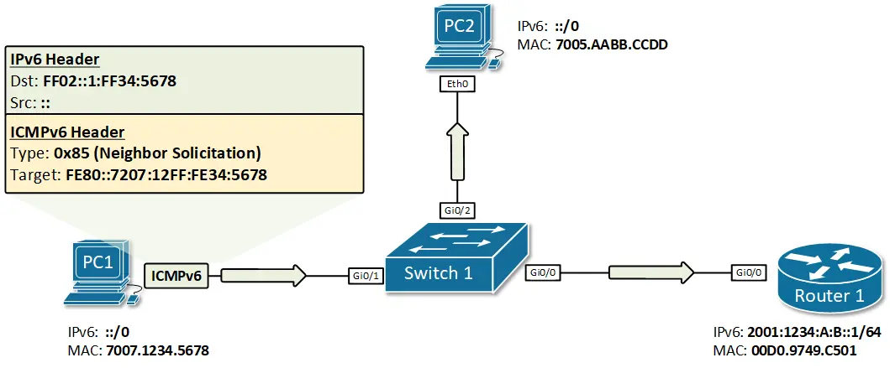
***Figure 2. PC1 performs IPv6 DAD for its link-local address***

This process is called Duplicate Address Detection (DAD) and is done upon every new address assignment. In our example, PC1 sends the ICMPv6 Neighbor Solicitation message as shown in figure 2, and nobody replies back. PC1 will then know for sure that this link-local address is unique in this local segment.

***Step 3: The node sends a Router Solicitation message***

Step 1 and 2 in this example depict the process of generating and assigning a unique link-local address. This process is not exactly part of the Stateless Autoconfiguration feature but without a link-local address, PC1 won't be able to communicate at layer 3 with any other IPv6 node. Thus, it is a pre-requisite for the SLAAC to work and that's why we have included it in our example.

After PC1 has a link-local address, it can now start the process of auto-configuring a global unicast address using SLAAC. The first step of this process is to send an ICMPv6 message called **Router Solicitation (RS)**. The purpose of this message is to 'ask' all IPv6 routers attached to this segment about the global unicast prefix that is used. The destination address is the all-routers multicast address FF02::2 and for source, PC1 uses its link-local address. Note that only routers are subscribed to multicast group FF02::2, which means that only Router 1 will process this message, and all other nodes on the local segment will discard it.

After Router 1 gets the Router Solicitation message, it responds back with an ICMPv6 message called **Router Advertisement (RA)**. The RA message includes the global IPv6 prefix on the link and the prefix length. In our example, these would be the prefix 2001:1234:A:b:: and the prefix length of /64. For the source of this RA packet, Router 1 uses its own link-local address and destination is the all-nodes multicast address FF02::1. The process is illustrated in figure 3.

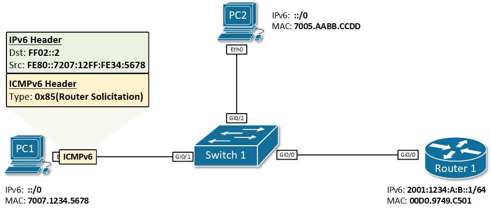
***Figure 3. IPv6 Stateless Address Autoconfiguration example***

**Step 4: The node configures its global unicast address**
Once PC1 gets back the Router Advertisement from  Router 1, it combines the prefix 2001:1234:A:B::/64 with its EUI-64 interface identifier (7207:12FF:FE34:5678) resulting in the global unicast address 2001:1234:A:B:7207:12FF:FE34:5678/64. Because the Router Advertisement came from Router 1, PC1 sets its IPv6 default gateway to the link-local address of R1.

Now PC1 has a global unicast address and a default gateway. But the SLAAC process is not completed. PC1 must know for sure this auto-generated address is unique in the local segment. Thus, PC1 performs the Duplicate Address Detection (DAD) process. 

**Step 5: The node performs Duplicate Address Detection (DAD)**

We have already explained the DAD process in detail in step 2. When PC1 auto-generate its global unicast address, it immediately joins the auto-generated **solicited-node multicast group** FF02::1:FF34:5678. To be sure that nobody else is using this address, PC1 then sends an ICMPv6 message called **Neighbor Solicitation** to the solicited-node address FF02::1:FF34:5678 and waits to see if a node replies back. If no reply is received back, PC1 knows that this address is unique and can start using it for communication outside its local segment including on the Internet.

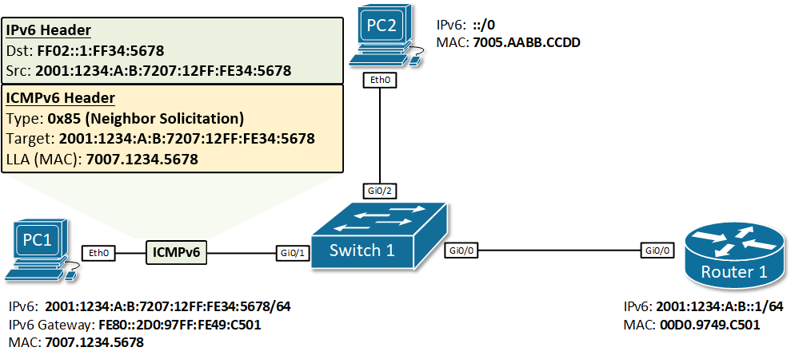
***Figure 4. IPv6 Duplicate Address Detection***

### The problem with SLAAC

So far so good. We have seen how a node can auto-configure a globally unique IPv6 address and a default gateway.

> However, SLAAC does not provide DNS information and without DNS, many services such as surfing the Internet are not possible.  

There is a field in the Router Advertisement header, that is designed to solve this problem.

### Router Advertisement Flags

As we said above, by default, SLAAC does not provide DNS. And without DNS, many services that require resolution from URL addresses to IP won't work. There is a field in the RA message that helps nodes understand where to get an IPv6 address and DNS information from. 

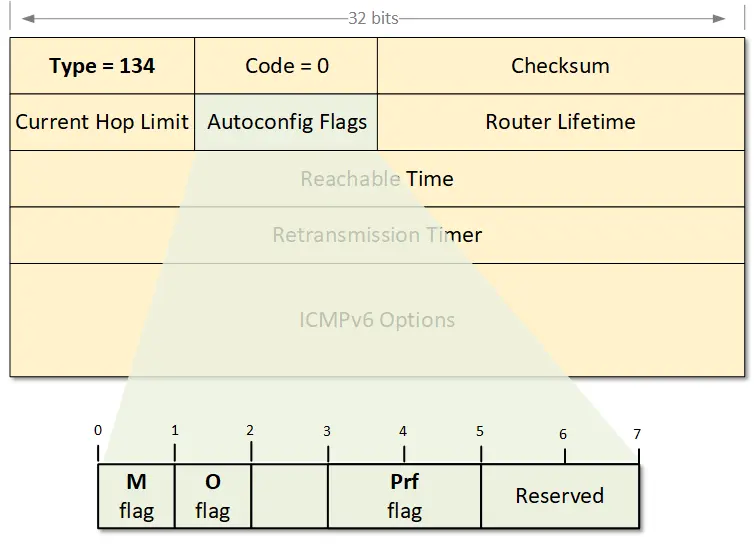
***Figure 5. Examining the Router Advertisement Flags***

If the **M-flag** is set to 1, it indicates that addresses are available via DHCPv6. The router is basically telling the nodes to ask the DHCP server for addresses and DNS information. If the M flag is set, the O flag can be ignored because DHCPv6 will return all available information.

If the **O-flag** is set to 1, it indicates that DNS information is available via DHCPv6. The router is basically telling the nodes to auto-configure an address via SLAAC and ask the DHCP server for DNS information1

If neither M nor O flags are set, this indicates that no DHCPv6 server is available on the segment.

The **Prf-flag** (Default Router Preference) can be set to Low (1), Medium (0), or High(3). When a node receives Router Advertisement messages from multiple routers, the Default Router Preference (DRP) is used to determine which router to prefer as a default gateway.

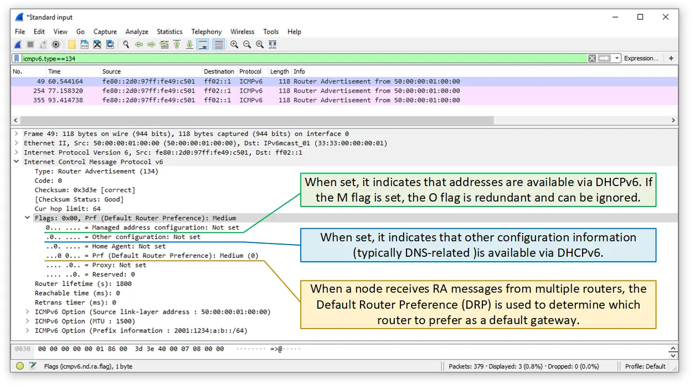
**Figure 6. Examining the Router Advertisement Flags with Wireshark**

## IPv6 on Windows

### Windows and EUI-64

Prior to Windows Vista and Windows Server 2008, Windows hosts used only MAC addresses to create Interface Identifiers (EUI-64). Globally unique addresses and Link-local ones were created using the segment's prefix plus the EUI-64 identifier which is generated from the physical address of the host. With the rise of network security, this was found to be a **security vulnerability** because an IPv6 address can be easily tied to a MAC address, which uniquely identifies physical equipment.

For example, imagine a user with a laptop connecting to an IPv6 network with global prefix X:X:X:X::/64. Via SLAAC, the user's laptop will generate a globally unique address X:X:X:X:EUI-64. Let's say the user goes to another place and connects to another IPv6 network with a global prefix Y:Y:Y:Y::/64. Well, the user's laptop will generate a global unicast address Y:Y:Y:Y:EUI-64, if the user connects to a network Z:Z:Z:Z::/64 it will get IPv6 address Z:Z:Z:Z::EUI-64 and so on. You can clearly see that this creates an opportunity to track the user, because wherever he goes and to whichever network he connects, the second half of the globally unique IPv6 address his laptop generates is always the same. The user can not connect anonymously to any network if someone knows the EUI-64 interface identifier of his laptop. This can be easily exploited in many different ways, for example, websites and apps associating different IPv6 addresses to a particular device or user.

Companies realized that and introduced two concepts that help to improve user's privacy - **Random Interface Identifiers** and **Temporary IPv6 addresses**. Let's start by looking at what the first term is.

### Randomize Identifiers

Randomize Identifiers feature has been introduced as a part of the privacy extension for SLAAC (Stateless Address Auto-configuration). After Windows Vista, this feature is enabled by default, so wherever a Windows host generates an IPv6 address with SLAAC, it always uses a Random Interface ID.

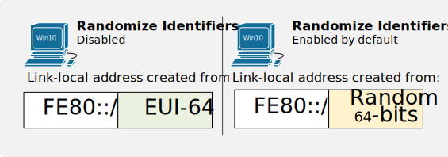
***Figure 1. How Windows 10 creates a link-local address***

Let's look at part of the output of `ipconfig /all` command that displays the Physical address and the Link-local address of a Windows 10 host. You can see that the MAC address is 00-0A-12-34-56-78 and therefore if PC1 uses EUI-64 to generate a link-local address, it should have been fe80::20a:12ff:fe34:5678. 

```
PS C:\Users\Administrator> ipconfig /all

Ethernet adapter Eth0:
   Description . . . . . . . . . . . : Intel(R) PRO/1000 MT Network Connection
   Physical Address. . . . . . . . . : 00-0A-12-34-56-78
   Link-local IPv6 Address . . . . . : fe80::ec94:3519:1f19:711f%8(Preferred)
```
Well, obviously the current link-local address is not created using the MAC address but rather a Random Interface Identifier. This is because the Randomize Identifiers feature is enabled by default. We can check this using the PowerShell command `get-netipv6protocol` or using `netsh interface ipv6 show global` in the Windows Command Prompt

```
PS C:\Users\Administrator> get-netipv6protocol

DefaultHopLimit               : 128
NeighborCacheLimit(Entries)   : 256
RouteCacheLimit(Entries)      : 4096
ReassemblyLimit(Bytes)        : 67105632
IcmpRedirects                 : Enabled
SourceRoutingBehavior         : DontForward
DhcpMediaSense                : Enabled
MediaSenseEventLog            : Disabled
MldLevel                      : All
MldVersion                    : Version2
MulticastForwarding           : Disabled
GroupForwardedFragments       : Disabled
RandomizeIdentifiers          : Enabled
AddressMaskReply              : Disabled
UseTemporaryAddresses         : Enabled
MaxTemporaryDadAttempts       : 3
MaxTemporaryValidLifetime     : 7.00:00:00
MaxTemporaryPreferredLifetime : 1.00:00:00
TemporaryRegenerateTime       : 00:00:05
MaxTemporaryDesyncTime        : 00:10:00
DeadGatewayDetection          : Enabled
```

We can use the following command in PowerShell to change the default behavior of a Windows host and disable the Randomize Identifiers. Disabling this feature forces Windows to use EUI-64 for Interface ID as you can see in the following example.

```
PS C:\Users\Administrator> set-netipv6protocol -RandomizeIdentifiers Disabled
PS C:\Users\Administrator>
PS C:\Users\Administrator> ipconfig /all

   Description . . . . . . . . . . . : Intel(R) PRO/1000 MT Network Connection
   Physical Address. . . . . . . . . : 00-0A-12-34-56-78
   Link-local IPv6 Address . . . . . : fe80::20a:12ff:fe34:5678%8(Preferred)
```
> Note that now the link-local address is generated from the MAC address and is exactly the value we expected.

### Temporary IPv6 addresses

Another important concept, part of the Privacy Extension for SLAAC, is the use of Temporary IPv6 addresses. The idea behind temporary addresses is to have a public randomized IPv6 address that has a relatively short lifetime and can be used for anonymous outgoing connections. At every reboot, or IPv6 stack on/off, or when the Preferred-Lifetime expires this temporary address is re-generated using a Random Interface Identifier. Therefore, different outgoing connections can be initiated from different Temporary IPv6 addresses which minimize the risk of someone tracking the user by associating the global IPv6 address to physical equipment/user.

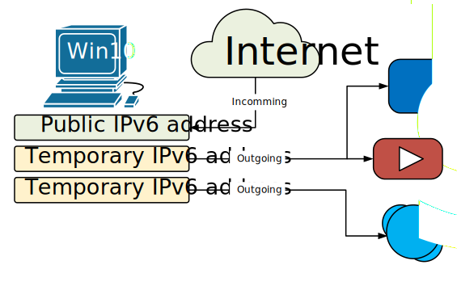
***Figure 2. Windows 10 usage of Temporary IPv6 addresses***

Of course, the incoming connections are made to the real Public IPv6 address that doesn't change. However, in a typical Internet user scenario, all connections are initiated by the user's machine towards an Internet service (client-server communication).
```
PS C:\Users\Administrator> get-netipv6protocol

DefaultHopLimit               : 128
NeighborCacheLimit(Entries)   : 256
RouteCacheLimit(Entries)      : 4096
ReassemblyLimit(Bytes)        : 67105632
IcmpRedirects                 : Enabled
SourceRoutingBehavior         : DontForward
DhcpMediaSense                : Enabled
MediaSenseEventLog            : Disabled
MldLevel                      : All
MldVersion                    : Version2
MulticastForwarding           : Disabled
GroupForwardedFragments       : Disabled
RandomizeIdentifiers          : Enabled
AddressMaskReply              : Disabled
UseTemporaryAddresses         : Enabled
MaxTemporaryDadAttempts       : 3
MaxTemporaryValidLifetime     : 7.00:00:00
MaxTemporaryPreferredLifetime : 1.00:00:00
TemporaryRegenerateTime       : 00:00:05
MaxTemporaryDesyncTime        : 00:10:00
DeadGatewayDetection          : Enabled
```

You can verify that this feature is enabled by default using either PowerShell's command `get-netipv6protocol` or Command Prompt netsh interface ipv6 show privacy command.
```
C:\Users\Administrator>netsh interface ipv6 show privacy
Querying active state...

Temporary Address Parameters
---------------------------------------------
Use Temporary Addresses             : enabled
Duplicate Address Detection Attempts: 3
Maximum Valid Lifetime              : 7d
Maximum Preferred Lifetime          : 1d
Regenerate Time                     : 5s
Maximum Random Time                 : 10m
Random Time                         : 6s
```
In some cases, you will see **multiple Temporary IPv6 Addresses** at a time (could be hundreds). This happens when the Maximum Preferred Lifetime of an address expires but there is a connection still opened using this particular address. In this case, another Temporary IPv6 address is created but the old one is not deleted until all opened connections are closed. More information on what the different lifetimes means can be seen in figure 3.

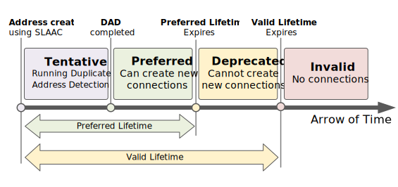
***Figure 3. An IPv6 address States and Lifetimes***

