duration_mins - float
week - int
month - varchar(160)
year - int
park_name - varchar(160)
city_name - varchar(160)
distance_km - float
route_name - varchar(160)
```

After learning about dimensional modeling, you decide to restructure the schema for the database. Runs has been pre-loaded for you.
```sql
-- Create a route dimension table
CREATE TABLE route(
	route_id INTEGER PRIMARY KEY,
    park_name VARCHAR(160) NOT NULL,
    city_name VARCHAR(160) NOT NULL,
    distance_km FLOAT NOT NULL,
    route_name VARCHAR(160) NOT NULL
);
-- Create a week dimension table
CREATE TABLE week(
	week_id INTEGER PRIMARY KEY,
    week INTEGER NOT NULL,
    month VARCHAR(160) NOT NULL,
    year INTEGER NOT NULL
);
```

&nbsp;&nbsp;&nbsp;

&nbsp;&nbsp;&nbsp;

#### Querying the dimensional model

Here it is! The schema reorganized using the dimensional model:

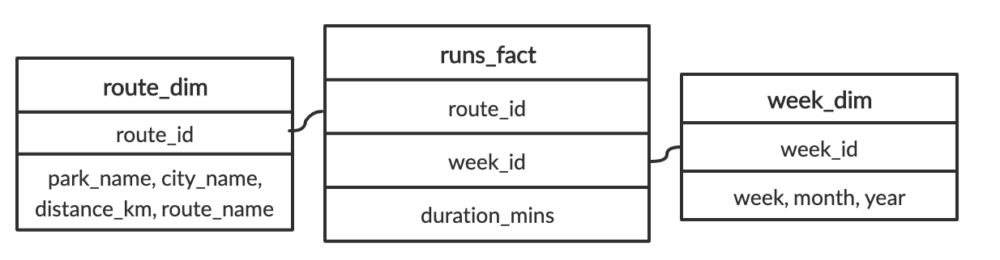

Let's try to run a query based on this schema. How about we try to find the number of minutes we ran in July, 2019? We'll break this up in two steps. First, we'll get the total number of minutes recorded in the database. Second, we'll narrow down that query to week_id's from July, 2019.

```sql
SELECT 
	-- Select the sum of the duration of all runs
	SUM(duration_mins)
FROM 
	runs_fact;
```

Join week_dim and runs_fact.
Get all the week_id's from July, 2019.
```sql
SELECT 
	-- Get the total duration of all runs
	SUM(duration_mins)
FROM 
	runs_fact
-- Get all the week_id's that are from July, 2019
INNER JOIN week_dim ON runs_fact.week_id = week_dim.week_id
WHERE month = 'July' and year = '2019';
```
&nbsp;&nbsp;&nbsp;

&nbsp;&nbsp;&nbsp;

&nbsp;&nbsp;&nbsp;

&nbsp;&nbsp;&nbsp;

## Star and snowflake schema

### Star schema

#### Dimensional modeling: star schema  

**Fact tables**

- Holds records of a metric  

- Changes regularly  

- Connects to dimensions via foreign keys  

#### Dimension tables

- Holds descriptions of attributes  

- Does not change as often  

#### Example:

- Supply books to stores in USA and Canada  

- Keep track of book sales

&nbsp;&nbsp;&nbsp;

#### Star schema example

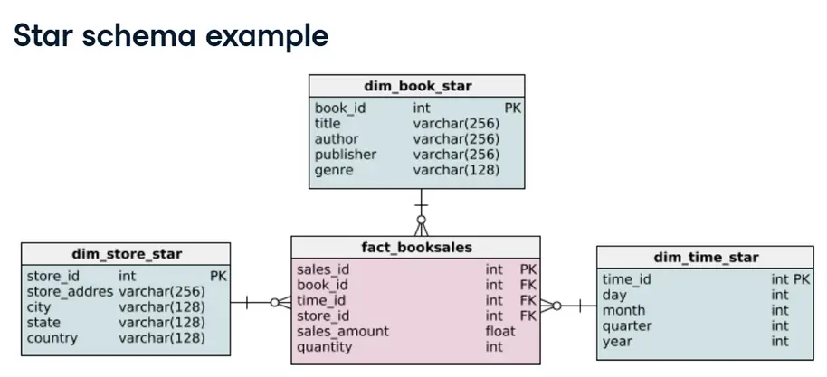

&nbsp;&nbsp;&nbsp;

### Snowfake schema (an extension)

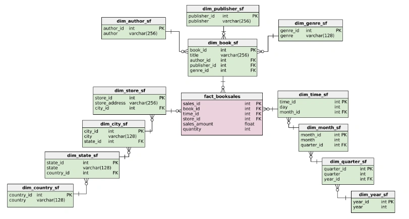

&nbsp;&nbsp;&nbsp;

&nbsp;&nbsp;&nbsp;

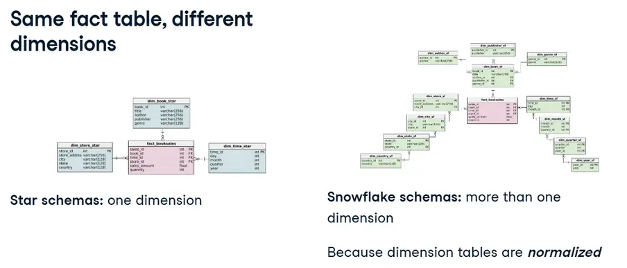

What is normalization?

- Database design technique 

- Divides tables into smaller tables and connects them via relationships  

- Goal: reduce redundancy and increase data integrity  

Identify repeating groups of data and create new tables for them

&nbsp;&nbsp;&nbsp;

&nbsp;&nbsp;&nbsp;

### Book dimension of the star schema

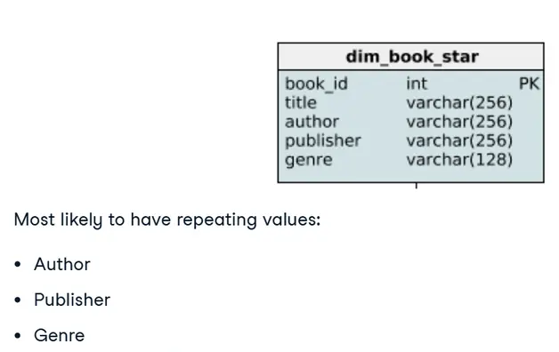

&nbsp;&nbsp;&nbsp;

### Book dimension of snowflake schema

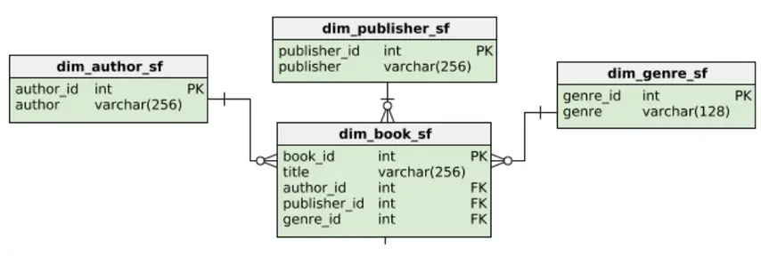

&nbsp;&nbsp;&nbsp;

#### Book dimension of the star schema

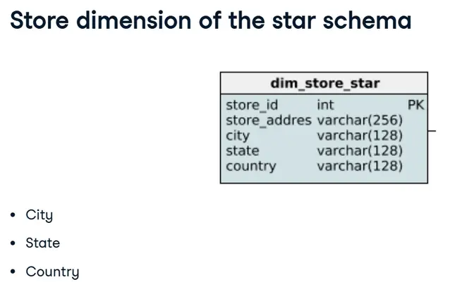

&nbsp;&nbsp;&nbsp;

#### Store dimension of the snowflake schema 

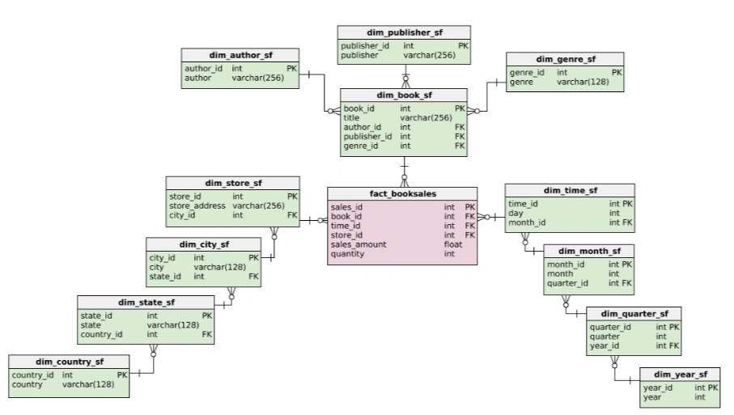

&nbsp;&nbsp;&nbsp;

&nbsp;&nbsp;&nbsp;

&nbsp;&nbsp;&nbsp;

#### Adding foreign keys

Foreign key references are essential to both the snowflake and star schema. When creating either of these schemas, correctly setting up the foreign keys is vital because they connect dimensions to the fact table. They also enforce a one-to-many relationship, because unless otherwise specified, a foreign key can appear more than once in a table and primary key can appear only once.

The `fact_booksales` table has three foreign keys: `book_id`, `time_id`, and `store_id`. In this exercise, the four tables that make up the star schema below have been loaded. However, the foreign keys still need to be added.

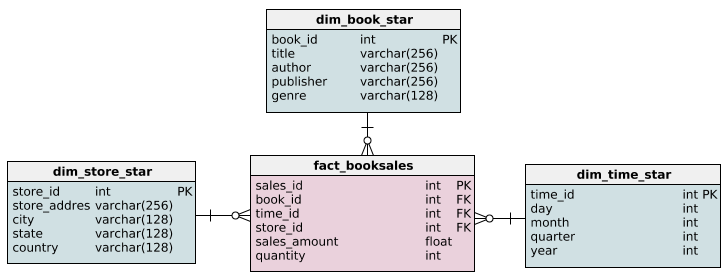

In the constraint called `sales_book`, set `book_id` as a foreign key.

In the constraint called `sales_time`, set `time_id` as a foreign key.

In the constraint called `sales_store`, set `store_id` as a foreign key.
```sql
-- Add the book_id foreign key
ALTER TABLE fact_booksales ADD CONSTRAINT sales_book
    FOREIGN KEY (book_id) REFERENCES dim_book_star (book_id);
    
-- Add the time_id foreign key
ALTER TABLE fact_booksales ADD CONSTRAINT sales_time
    FOREIGN KEY (time_id) REFERENCES dim_time_star (time_id);
    
-- Add the store_id foreign key
ALTER TABLE fact_booksales ADD CONSTRAINT sales_store
    FOREIGN KEY (store_id) REFERENCES dim_store_star (store_id);
```

&nbsp;&nbsp;&nbsp;

&nbsp;&nbsp;&nbsp;


#### Extending the book dimension

In the video, we saw how the book dimension differed between the star and snowflake schema. The star schema's dimension table for books, `dim_book_star`, has been loaded and below is the snowflake schema of the book dimension.

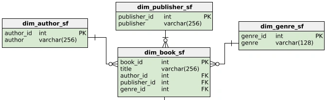

In this exercise, you are going to extend the star schema to meet part of the snowflake schema's criteria. Specifically, you will create `dim_author` from the data provided in `dim_book_star`.


Create `dim_author` with a column for `author`.

Insert all the distinct authors from `dim_book_star` into `dim_author`.

```sql
-- Create dim_author with an author column
CREATE TABLE dim_author (
    author varchar(256) NOT NULL
);

-- Insert distinct authors 
INSERT INTO dim_author
SELECT DISTINCT author FROM dim_book_star;
```

Alter `dim_author` to have a primary key called `author_id`.

Output all the columns of `dim_author`.

```sql
-- Create a new table for dim_author with an author column
CREATE TABLE dim_author (
    author varchar(256)  NOT NULL
);

-- Insert authors 
INSERT INTO dim_author
SELECT DISTINCT author FROM dim_book_star;

-- Add a primary key 
ALTER TABLE dim_author ADD COLUMN author_id SERIAL PRIMARY KEY;

-- Output the new table
SELECT * FROM dim_author;
```
&nbsp;&nbsp;&nbsp;

1. Creating the `dim_author` Table:
```sql
CREATE TABLE dim_author (
    author varchar(256) NOT NULL
);
```
> This line creates a new table named `dim_author` with a single column author of type `varchar(256)`. The `NOT NULL` constraint ensures that every entry in this column must have a value, which is important for maintaining data integrity.

&nbsp;&nbsp;&nbsp;

2.Inserting Distinct Authors:
```sql
INSERT INTO dim_author
SELECT DISTINCT author FROM dim_book_star;
```
&nbsp;&nbsp;&nbsp;

> Here, we are populating the `dim_author` table with unique author names. The `SELECT DISTINCT` statement retrieves all unique authors from the `dim_book_star` table, ensuring that each author appears only once in the dim_author table. This step is crucial for normalizing the data and avoiding duplicate entries.

&nbsp;&nbsp;&nbsp;

3. Adding a Primary Key:
```sql
ALTER TABLE dim_author ADD COLUMN author_id SERIAL PRIMARY KEY;
```
> This line alters the `dim_author` table by adding a new column named `author_id`. The SERIAL keyword automatically generates a unique integer for each row, which serves as the primary key. The primary key uniquely identifies each record in the table, which is essential for efficient data retrieval and maintaining relationships with other tables.

&nbsp;&nbsp;&nbsp;

4. Outputting the Table:
```sql
SELECT * FROM dim_author;
```
> Finally, this statement retrieves and displays all the columns and rows from the `dim_author` table. It allows you to verify that the table has been correctly populated and structured, with the `author_id` serving as the primary key and each author listed only once.

&nbsp;&nbsp;&nbsp;

&nbsp;&nbsp;&nbsp;

&nbsp;&nbsp;&nbsp;

&nbsp;&nbsp;&nbsp;

## Normalized and denormalized databases

&nbsp;&nbsp;&nbsp;

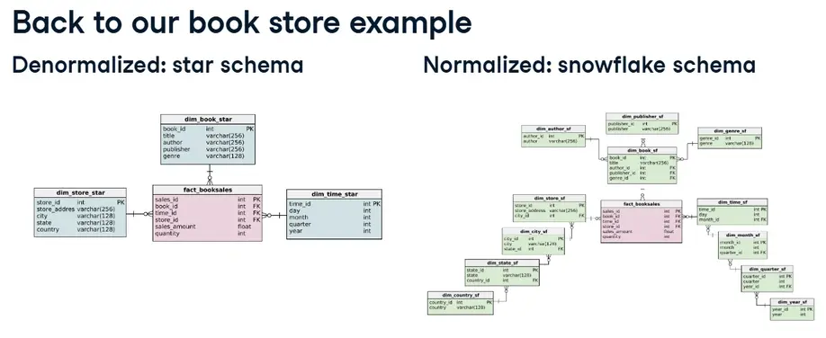

&nbsp;&nbsp;&nbsp;

### Denormalized Query

- Goal: get quantity of all Octavia E. Butler books sold in Vancouver in Q4 of 2018
```sql
SELECT SUM(quantity) 
FROM fact_booksales
-- Join to get city  
INNER JOIN dim_store_star ON fact_booksales.store_id = dim_store_star.store_id
-- Join to get author  
INNER JOIN dim_book_star ON fact_booksales.book_id = dim_book_star.book_id
-- Join to get year and quarter  
INNER JOIN dim_time_star ON fact_booksales.time_id = dim_time_star.time_id
-- WHERE conditions
WHERE dim_store_star.city = 'Vancouver' 
  AND dim_book_star.author = 'Octavia E. Butler' 
  AND dim_time_star.year = 2018 
  AND dim_time_star.quarter = 4;
```
```
7600
```
&nbsp;&nbsp;&nbsp;

#### Normalized query

```asl
SELECT
    SUM(fact_booksales.quantity)
FROM
    fact_booksales
    -- Join to get city
    INNER JOIN dim_store_sf ON fact_booksales.store_id = dim_store_sf.store_id
    INNER JOIN dim_city_sf ON dim_store_sf.city_id = dim_city_sf.city_id
    -- Join to get author
    INNER JOIN dim_book_sf ON fact_booksales.book_id = dim_book_sf.book_id
    INNER JOIN dim_author_sf ON dim_book_sf.author_id = dim_author_sf.author_id
    -- Join to get year and quarter
    INNER JOIN dim_time_sf ON fact_booksales.time_id = dim_time_sf.time_id
    INNER JOIN dim_month_sf ON dim_time_sf.month_id = dim_month_sf.month_id
    INNER JOIN dim_quarter_sf ON dim_month_sf.quarter_id = dim_quarter_sf.quarter_id
    INNER JOIN dim_year_sf ON dim_quarter_sf.year_id = dim_year_sf.year_id
-- WHERE conditions
WHERE dim_city_sf.city = 'Vancouver'
    AND dim_author_sf.author_name = 'Octavia E. Butler'
    AND dim_year_sf.year = 2018
    AND dim_quarter_sf.quarter = 4;
```
```
7600
```
Total of 8 joins

***So, why would we want to normalize a databases?***

&nbsp;&nbsp;&nbsp;

### Normalization saves space 

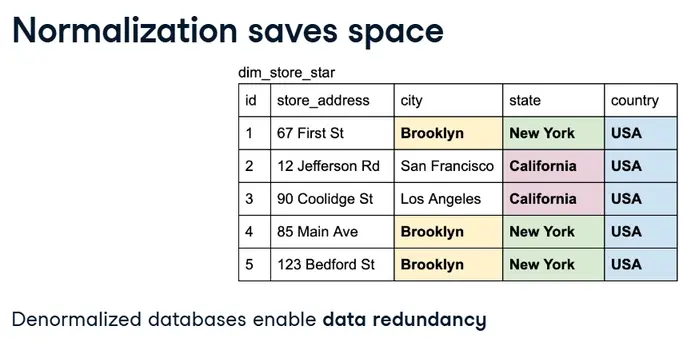

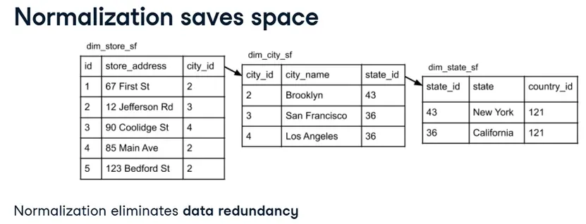

&nbsp;&nbsp;&nbsp;

### Normalization ensures better data integrity

#### 1. Enforces data consistency
Must respect naming conventions because of referential integrity, e.g., 'California', not 'CA' or 'california'

#### 2. Safer updating, removing, and inserting
Less data redundancy = less records to alter

#### 3. Easier to redesign by extending
Smaller tables are easier to extend than larger tables

&nbsp;&nbsp;&nbsp;

### Database normalization

#### Advantages
- Normalization eliminates data redundancy: save on storage

- Better data integrity: accurate and consistent data

&nbsp;&nbsp;&nbsp;

#### Disadvantages
- Complex queries require more CPU

&nbsp;&nbsp;&nbsp;

&nbsp;&nbsp;&nbsp;

### Remember OLTP and OLAP?

| OLTP | OLAP |  
|------|------|
| e.g., Operational databases | e.g., Operational databases |
| **Typically highly normalized** | **Typically less normalized** | 
| - Write-intensive           | - Read-intensive          |
| - Prioritize quicker and safer insertion of data | - Prioritize quicker queries for analytics |

&nbsp;&nbsp;&nbsp;

&nbsp;&nbsp;&nbsp;

#### Querying the star schema

The novel genre hasn't been selling as well as your company predicted. To help remedy this, you've been tasked to run some analytics on the novel genre to find which areas the Sales team should target. To begin, you want to look at the total amount of sales made in each state from books in the novel genre.
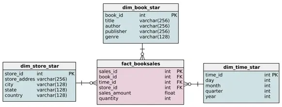
Luckily, you've just finished setting up a data warehouse with the following star schem


Select `state` from the appropriate table and the total `sales_amount`.

Complete the JOIN on `book_id`.

Complete the JOIN to connect the `dim_store_star` table

Conditionally select for books with the `genre` `novel`.

Group the results by state.

```sql
-- Output each state and their total sales_amount
SELECT dim_store_star.state, SUM(sales_amount)
FROM fact_booksales
	-- Join to get book information
    JOIN dim_book_star ON fact_booksales.book_id = dim_book_star.book_id
	-- Join to get store information
    JOIN dim_store_star ON fact_booksales.store_id = dim_store_star.store_id
-- Get all books with in the novel genre
WHERE  
    dim_book_star.genre = 'novel'
-- Group results by state
GROUP BY
    dim_store_star.state;
```

&nbsp;&nbsp;&nbsp;

&nbsp;&nbsp;&nbsp;

#### Querying the snowflake schema
Imagine that you didn't have the data warehouse set up. Instead, you'll have to run this query on the company's operational database, which means you'll have to rewrite the previous query with the following snowflake schema:

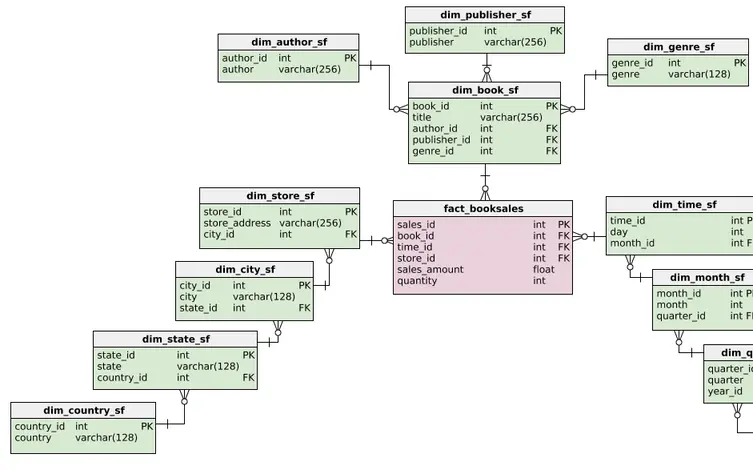

The tables in this schema have been loaded. Remember, our goal is to find the amount of money made from the novel genre in each state.

&nbsp;&nbsp;&nbsp;

Select `state` from the appropriate table and the total `sales_amount`.

Complete the two JOINS to get the `genre_id`'s.

Complete the three JOINS to get the `state_id`'s.

Conditionally select for books with the `genre` `novel`.

Group the results by state.

```sql
-- Output each state and their total sales_amount
SELECT dim_state_sf.state, SUM(sales_amount)
FROM fact_booksales
    -- Joins for genre
    JOIN dim_book_sf on fact_booksales.book_id = dim_book_sf.book_id
    JOIN dim_genre_sf on dim_book_sf.genre_id = dim_genre_sf.genre_id
    -- Joins for state 
    JOIN dim_store_sf on fact_booksales.store_id = dim_store_sf.store_id 
    JOIN dim_city_sf on dim_store_sf.city_id = dim_city_sf.city_id
	JOIN dim_state_sf on  dim_city_sf.state_id = dim_state_sf.state_id
-- Get all books with in the novel genre and group the results by state
WHERE  
    dim_genre_sf.genre = 'novel'
GROUP BY
    dim_state_sf.state;
```

&nbsp;&nbsp;&nbsp;

&nbsp;&nbsp;&nbsp;


#### Extending the snowflake schema

The company is thinking about extending their business beyond bookstores in Canada and the US. Particularly, they want to expand to a new continent. In preparation, you decide a `continent` field is needed when storing the addresses of stores.

Luckily, you have a snowflake schema in this scenario. As we discussed in the video, the snowflake schema is typically faster to extend while ensuring data consistency. Along with `dim_country_sf`, a table called `dim_continent_sf` has been loaded. It contains the only continent currently needed, North America, and a primary key. In this exercise, you'll need to extend `dim_country_sf` to reference `dim_continent_sf`.

Add a `continent_id` column to `dim_country_sf` with a default value of 1. Note that `NOT NULL DEFAULT(1)` constrains a value from being null and defaults its value to `1`.

Make that new column a foreign key reference to `dim_continent_sf`'s `continent_id`.

```sql
-- Add a continent_id column with default value of 1
ALTER TABLE dim_country_sf
ADD continent_id int NOT NULL DEFAULT(1);

-- Add the foreign key constraint
ALTER TABLE dim_country_sf ADD CONSTRAINT country_continent
   FOREIGN KEY (continent_id) REFERENCES dim_continent_sf(continent_id);
   
-- Output updated table
SELECT * FROM dim_country_sf;
```
&nbsp;&nbsp;&nbsp;

&nbsp;&nbsp;&nbsp;

&nbsp;&nbsp;&nbsp;

## Normal forms

### Normalization

Identify repeating groups of data and create new tables for them

A more formal definition:

The goals of normalization are to:

- Be able to characterize the level of redundancy in a relational schema  

- Provide mechanisms for transforming schemas in order to remove redundancy

&nbsp;&nbsp;&nbsp;

&nbsp;&nbsp;&nbsp;

&nbsp;&nbsp;&nbsp;

### Normal forms (NF)

- Ordered from least to most normalized:

- First normal form (1NF)

- Second normal form (2NF)

- Third normal form (3NF)

- Elementary key normal form (EKNF)

- Boyce-Codd normal form (BCNF)

- Fourth normal form (4NF)

- Essential tuple normal form (ETNF)

- Fifth normal form (5NF)

- Domain-key Normal Form (DKNF)

- Sixth normal form (6NF)

&nbsp;&nbsp;&nbsp;

&nbsp;&nbsp;&nbsp;

### 1NF 

- Each record must be unique - no duplicate rows  

- Each cell must hold one value  

- 

#### Initial data
```
| Student_id | Student_Email    | Courses_Completed                                 |
|------------|------------------|---------------------------------------------------|
| 235        | jim@gmail.com    | Introduction to Python, Intermediate Python       |
| 455        | kelly@yahoo.com  | Cleaning Data in R                                |
| 767        | amy@hotmail.com  | Machine Learning Toolbox, Deep Learning in Python |
```
&nbsp;&nbsp;&nbsp;

#### In 1NF form
```
+------------+------------------+
| Student_id | Student_Email    |
+------------+------------------+
| 235        | jim@gmail.com    |
| 455        | kelly@yahoo.com  |
| 767        | amy@hotmail.com  |
+------------+------------------+

+------------+---------------------------+
| Student_id | Completed                 |
+------------+---------------------------+
| 235        | Introduction to Python    |
| 235        | Intermediate Python       |
| 455        | Cleaning Data in R        |
| 767        | Machine Learning Toolbox  |
| 767        | Deep Learning in Python   |
+------------+---------------------------+
```

&nbsp;&nbsp;&nbsp;

### 2NF

- Must satisfy 1NF AND
  - If primary key is one column
    - then automatically satisfies 2NF
  - If there is a composite primary key
    - then each non-key column must be dependent on all the keys

#### Initial data
```
+------------+-----------+---------------+----------------+----------+
| Student_id | Course_id | Instructor_id | Instructor     | Progress |
+------------+-----------+---------------+----------------+----------+
| 235        | 2001      | 560           | Nick Carchedi  | 0.55     |
| 455        | 2345      | 658           | Ginger Grant   | 0.10     |
| 767        | 6584      | 999           | Chester Ismay  | 1.00     |
+------------+-----------+---------------+----------------+----------+
```

&nbsp;&nbsp;&nbsp;

#### In 2NF form
```
+------------+-----------+-------------------+
| Student_id | Course_id | Percent_Completed |
+------------+-----------+-------------------+
| 235        | 2001      | 0.55              |
| 455        | 2345      | 0.10              |
| 767        | 6584      | 1.00              |
+------------+-----------+-------------------+

+-----------+---------------+----------------+
| Course_id | Instructor_id | Instructor     |
+-----------+---------------+----------------+
| 2001      | 560           | Nick Carchedi  |
| 2345      | 658           | Ginger Grant   |
| 6584      | 999           | Chester Ismay  |
+-----------+---------------+----------------+
```
&nbsp;&nbsp;&nbsp;

### 3NF

- Satisfies 2NF  
- No transitive dependencies: non-key columns can't depend on other non-key columns  

#### Initial Data
```
+-----------+---------------+----------------+--------+
| Course_id | Instructor_id | Instructor     | Tech   |
+-----------+---------------+----------------+--------+
| 2001      | 560           | Nick Carchedi  | Python |
| 2345      | 658           | Ginger Grant   | SQL    |
| 6584      | 999           | Chester Ismay  | R      |
+-----------+---------------+----------------+--------+
```

#### In 3NF
```
+-----------+----------------+--------+
| Course_id | Instructor     | Tech   |
+-----------+----------------+--------+
| 2001      | Nick Carchedi  | Python |
| 2345      | Ginger Grant   | SQL    |
| 6584      | Chester Ismay  | R      |
+-----------+----------------+--------+

+---------------+----------------+
| Instructor_id | Instructor     |
+---------------+----------------+
| 560           | Nick Carchedi  |
| 658           | Ginger Grant   |
| 999           | Chester Ismay  |
+---------------+----------------+
```
&nbsp;&nbsp;&nbsp;

### Data anomalies

What is risked if we don't normalize enough?

1. Update anomaly  

2. Insertion anomaly  

3. Deletion anomaly  

&nbsp;&nbsp;&nbsp;

### Update anomaly

Data inconsistency caused by data redundancy when updating

```
+------------+-----------------+--------------------------+------------------------+
| Student_ID | Student_Email   | Enrolled_in              | Taught_by              |
+------------+-----------------+--------------------------+------------------------+
| 230        | lisa@gmail.com  | Cleaning Data in R       | Maggie Matsui          |
| 367        | bob@hotmail.com | Data Visualization in R  | Ronald Pearson         |
| 520        | ken@yahoo.com   | Introduction to Python   | Hugo Bowne-Anderson    |
| 520        | ken@yahoo.com   | Arima Models in R        | David Stoffer          |
+------------+-----------------+--------------------------+------------------------+
```
To update student `520`'s email:

- Need to update more than one record, otherwise, there will be inconsistency

- User updating needs to know about redundancy

&nbsp;&nbsp;&nbsp;

### Insertion anomaly

Unable to add a record due to missing attributes

```
+------------+-----------------+--------------------------+------------------------+
| Student_ID | Student_Email   | Enrolled_in              | Taught_by              |
+------------+-----------------+--------------------------+------------------------+
| 230        | lisa@gmail.com  | Cleaning Data in R       | Maggie Matsui          |
| 367        | bob@hotmail.com | Data Visualization in R  | Ronald Pearson         |
| 521        | ken@yahoo.com   | Introduction to Python   | Hugo Bowne-Anderson    |
| 521        | ken@yahoo.com   | Arima Models in R        | David Stoffer          |
+------------+-----------------+--------------------------+------------------------+
```
Unable to insert a student who has signed up but not enrolled in any courses

&nbsp;&nbsp;&nbsp;

### Deletion anomaly

Deletion of record(s) causes unintentional loss of data

```
+------------+-----------------+--------------------------+------------------------+
| Student_ID | Student_Email   | Enrolled_in              | Taught_by              |
+------------+-----------------+--------------------------+------------------------+
| 230        | lisa@gmail.com  | Cleaning Data in R       | Maggie Matsui          |
| 367        | bob@hotmail.com | Data Visualization in R  | Ronald Pearson         |
| 520        | ken@yahoo.com   | Introduction to Python   | Hugo Bowne-Anderson    |
| 520        | ken@yahoo.com   | Arima Models in R        | David Stoffer          |
+------------+-----------------+--------------------------+------------------------+

```

If we delete Student `230`, what happens to the data on `Cleaning Data in R`?

&nbsp;&nbsp;&nbsp;

&nbsp;&nbsp;&nbsp;

#### Converting to 1NF

In the next three exercises, you'll be working through different tables belonging to a car rental company. Your job is to explore different schemas and gradually increase the normalization of these schemas through the different normal forms. At this stage, we're not worried about relocating the data, but rearranging the tables.

A table called customers has been loaded, which holds information about customers and the cars they have rented.

```sql
-- Create a new table to hold the cars rented by customers
CREATE TABLE cust_rentals (
  customer_id INT NOT NULL,
  car_id VARCHAR(128) NULL,
  invoice_id VARCHAR(128) NULL
);

-- Drop two columns from customers table to satisfy 1NF
ALTER TABLE customers
DROP COLUMN cars_rented,
DROP COLUMN invoice_id;
```
&nbsp;&nbsp;&nbsp;

&nbsp;&nbsp;&nbsp;

#### Converting to 2NF

Let's try normalizing a bit more. In the last exercise, you created a table holding `customer_ids` and `car_ids`. This has been expanded upon and the resulting table, `customer_rentals`, has been loaded for you. Since you've got 1NF down, it's time for 2NF.


Create a new table for the non-key columns that were conflicting with 2NF criteria.

Drop those non-key columns from `customer_rentals`.

```sql
-- Create a new table to satisfy 2NF
CREATE TABLE cars (
  car_id VARCHAR(256) NULL,
  model VARCHAR(128),
  manufacturer VARCHAR(128),
  type_car VARCHAR(128),
  condition VARCHAR(128),
  color VARCHAR(128)
);

-- Insert data into the new table
INSERT INTO cars
SELECT DISTINCT
  car_id,
  model,
  manufacturer,
  type_car,
  condition,
  color
FROM customer_rentals;

-- Drop columns in customer_rentals to satisfy 2NF
ALTER TABLE customer_rentals
DROP COLUMN model,
DROP COLUMN manufacturer, 
DROP COLUMN type_car,
DROP COLUMN condition,
DROP COLUMN color;
```

&nbsp;&nbsp;&nbsp;

&nbsp;&nbsp;&nbsp;

#### Converting to 3NF

Last, but not least, we are at 3NF. In the last exercise, you created a table holding car_idss and car attributes. This has been expanded upon. For example, `car_id` is now a primary key. The resulting table, `rental_cars`, has been loaded for you.


```sql
-- Create a new table to satisfy 3NF
CREATE TABLE car_model(
  model VARCHAR(128),
  manufacturer VARCHAR(128),
  type_car VARCHAR(128)
);

-- Drop columns in rental_cars to satisfy 3NF
ALTER TABLE rental_cars
DROP COLUMN manufacturer, 
DROP COLUMN type_car;
```
&nbsp;&nbsp;&nbsp;

&nbsp;&nbsp;&nbsp;

&nbsp;&nbsp;&nbsp;

&nbsp;&nbsp;&nbsp;


## Database views

In a database, a view is the result set of a stored query on the data, which the database users can query just as they would in a persistent database collection object (Wikipedia)

### Virtual table that is not part of the physical schema

- Query, not data, is stored in memory  

- Data is aggregated from data in tables  

- Can be queried like a regular database table  

- No need to retype common queries or alter schemas

&nbsp;&nbsp;&nbsp;

&nbsp;&nbsp;&nbsp;

### Creating a view (syntax)


```sql
CREATE VIEW view_name AS
SELECT col1, col2
FROM table_name
WHERE condition;
```
&nbsp;&nbsp;&nbsp;

#### Creating a view (example)

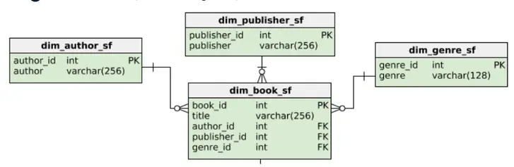

Goal: Return titles and authors of the science fiction genre

