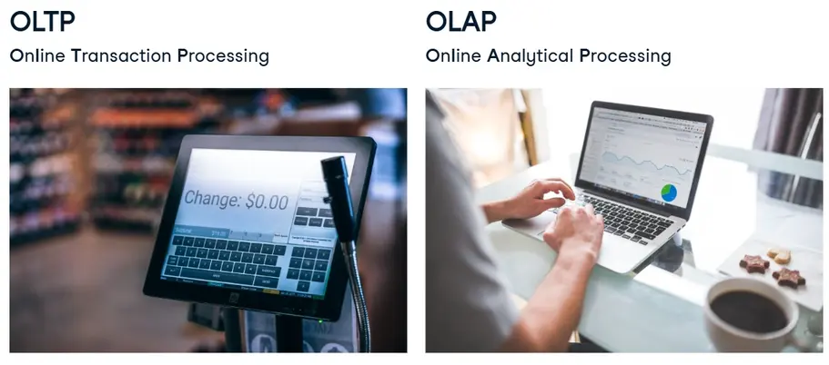
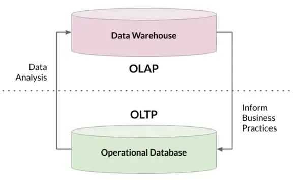

---
title: "Database Design"
discription: Database 
date: 2025-10-10T21:29:01+08:00 
draft: false
type: post
tags: ["PostgreSQL","Database"]
showTableOfContents: true
--- 

&nbsp;&nbsp;&nbsp;

&nbsp;&nbsp;&nbsp;

&nbsp;&nbsp;&nbsp;

&nbsp;&nbsp;&nbsp;

## Database Design

### OLTP and OLAP

- How should we organize and manage data?

- Schemas: How should my data be logically organized?

- Normalization: Should my data have minimal dependency and redundancy?

- Views: What joins will be done most often?

- Access control: Should all users of the data have the same level of access?

- DBMS: How do I pick between all the SQL and NoSQL options?

- and more!

It depends on the intended use the date

&nbsp;&nbsp;&nbsp;

#### Approaches to processing data

&nbsp;&nbsp;&nbsp;

#### Some concrete examples

| OLTP tasks | OLAP tasks |
|------------|------------|
| - Find the price of a book | - Calculate books with best profit margin |
| - Update latest customer transaction | - Find most loyal customers |
| - Keep track of employee hours | - Decide employee of the month |

&nbsp;&nbsp;&nbsp;

#### OLAP vs. OLTP

|         | OLTP                          | OLAP                        |
|---------|-------------------------------|-----------------------------|
| Purpose | support daily transactions    | report and analyze data     |
| Design  | application-oriented          | subject-oriented           |
| Data    | up-to-date, operational       | consolidated, historical   |
| Size    | snapshot, gigabytes           | archive, terabytes         |
| Queries | simple transactions & frequent updates | complex, aggregate queries & limited updates |
| Users   | thousands                     | hundreds                   |

#### Working  together

&nbsp;&nbsp;&nbsp;

#### Takeaways

- Step back and figure out business requirements  

- Difference between OLAP and OLTP  

- OLAP? OLTP? Or something else?