duration_mins - float
week - int
month - varchar(160)
year - int
park_name - varchar(160)
city_name - varchar(160)
distance_km - float
route_name - varchar(160)
```

After learning about dimensional modeling, you decide to restructure the schema for the database. Runs has been pre-loaded for you.
```sql
-- Create a route dimension table
CREATE TABLE route(
	route_id INTEGER PRIMARY KEY,
    park_name VARCHAR(160) NOT NULL,
    city_name VARCHAR(160) NOT NULL,
    distance_km FLOAT NOT NULL,
    route_name VARCHAR(160) NOT NULL
);
-- Create a week dimension table
CREATE TABLE week(
	week_id INTEGER PRIMARY KEY,
    week INTEGER NOT NULL,
    month VARCHAR(160) NOT NULL,
    year INTEGER NOT NULL
);
```

&nbsp;&nbsp;&nbsp;

&nbsp;&nbsp;&nbsp;

#### Querying the dimensional model

Here it is! The schema reorganized using the dimensional model:

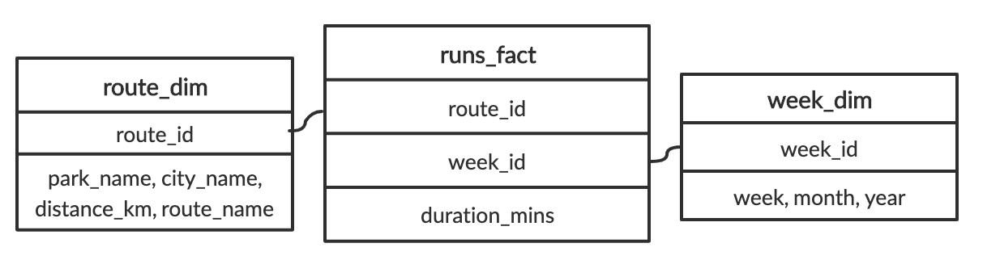

Let's try to run a query based on this schema. How about we try to find the number of minutes we ran in July, 2019? We'll break this up in two steps. First, we'll get the total number of minutes recorded in the database. Second, we'll narrow down that query to week_id's from July, 2019.

```sql
SELECT 
	-- Select the sum of the duration of all runs
	SUM(duration_mins)
FROM 
	runs_fact;
```

Join week_dim and runs_fact.
Get all the week_id's from July, 2019.
```sql
SELECT 
	-- Get the total duration of all runs
	SUM(duration_mins)
FROM 
	runs_fact
-- Get all the week_id's that are from July, 2019
INNER JOIN week_dim ON runs_fact.week_id = week_dim.week_id
WHERE month = 'July' and year = '2019';
```
&nbsp;&nbsp;&nbsp;

&nbsp;&nbsp;&nbsp;

&nbsp;&nbsp;&nbsp;

&nbsp;&nbsp;&nbsp;

## Star and snowflake schema

### Star schema

#### Dimensional modeling: star schema  

**Fact tables**

- Holds records of a metric  

- Changes regularly  

- Connects to dimensions via foreign keys  

#### Dimension tables

- Holds descriptions of attributes  

- Does not change as often  

#### Example:

- Supply books to stores in USA and Canada  

- Keep track of book sales

&nbsp;&nbsp;&nbsp;

#### Star schema example

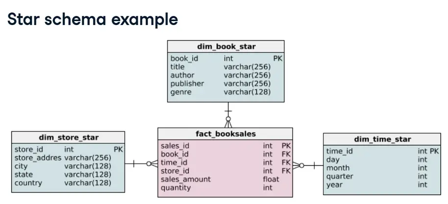

&nbsp;&nbsp;&nbsp;

### Snowfake schema (an extension)

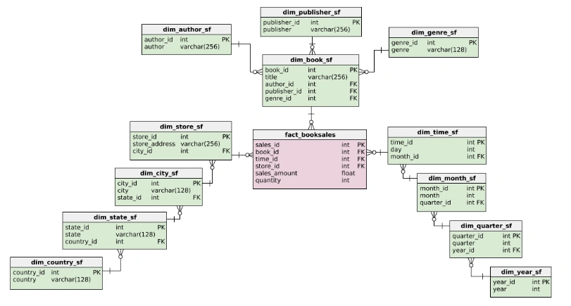

&nbsp;&nbsp;&nbsp;

&nbsp;&nbsp;&nbsp;

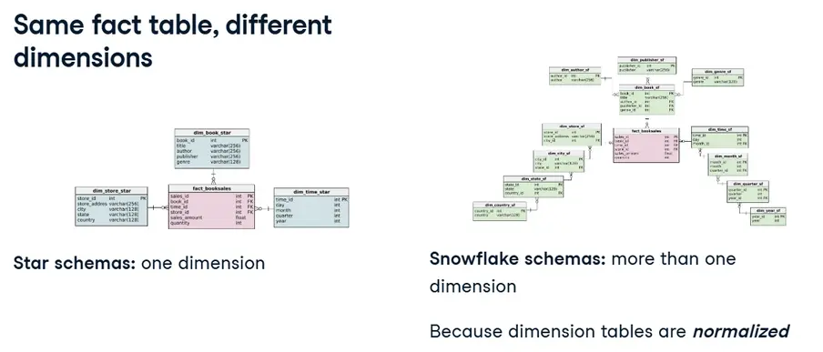

What is normalization?

- Database design technique 

- Divides tables into smaller tables and connects them via relationships  

- Goal: reduce redundancy and increase data integrity  

Identify repeating groups of data and create new tables for them

&nbsp;&nbsp;&nbsp;

&nbsp;&nbsp;&nbsp;

### Book dimension of the star schema

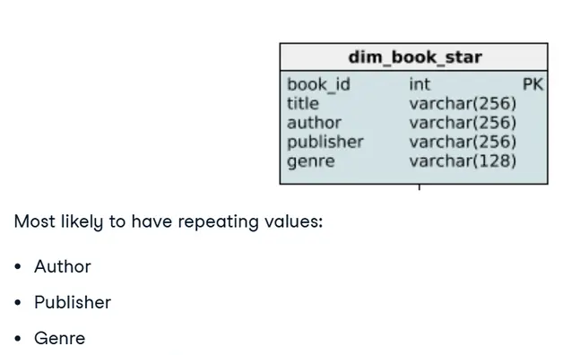

&nbsp;&nbsp;&nbsp;

### Book dimension of snowflake schema

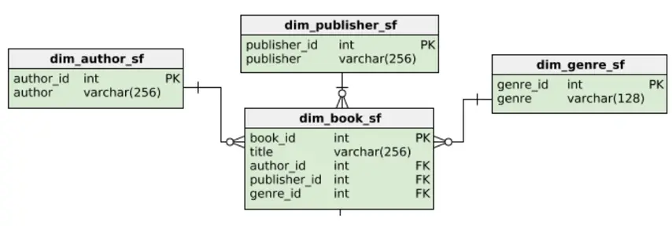

&nbsp;&nbsp;&nbsp;

#### Book dimension of the star schema

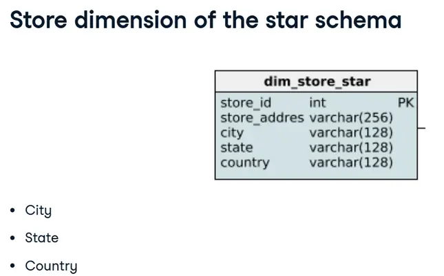

&nbsp;&nbsp;&nbsp;

#### Store dimension of the snowflake schema 

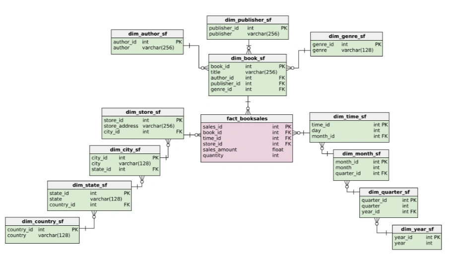

&nbsp;&nbsp;&nbsp;

&nbsp;&nbsp;&nbsp;

&nbsp;&nbsp;&nbsp;

#### Adding foreign keys

Foreign key references are essential to both the snowflake and star schema. When creating either of these schemas, correctly setting up the foreign keys is vital because they connect dimensions to the fact table. They also enforce a one-to-many relationship, because unless otherwise specified, a foreign key can appear more than once in a table and primary key can appear only once.

The `fact_booksales` table has three foreign keys: `book_id`, `time_id`, and `store_id`. In this exercise, the four tables that make up the star schema below have been loaded. However, the foreign keys still need to be added.


In the constraint called `sales_book`, set `book_id` as a foreign key.

In the constraint called `sales_time`, set `time_id` as a foreign key.

In the constraint called `sales_store`, set `store_id` as a foreign key.
```sql
-- Add the book_id foreign key
ALTER TABLE fact_booksales ADD CONSTRAINT sales_book
    FOREIGN KEY (book_id) REFERENCES dim_book_star (book_id);
    
-- Add the time_id foreign key
ALTER TABLE fact_booksales ADD CONSTRAINT sales_time
    FOREIGN KEY (time_id) REFERENCES dim_time_star (time_id);
    
-- Add the store_id foreign key
ALTER TABLE fact_booksales ADD CONSTRAINT sales_store
    FOREIGN KEY (store_id) REFERENCES dim_store_star (store_id);
```

&nbsp;&nbsp;&nbsp;

&nbsp;&nbsp;&nbsp;


#### Extending the book dimension

In the video, we saw how the book dimension differed between the star and snowflake schema. The star schema's dimension table for books, `dim_book_star`, has been loaded and below is the snowflake schema of the book dimension.

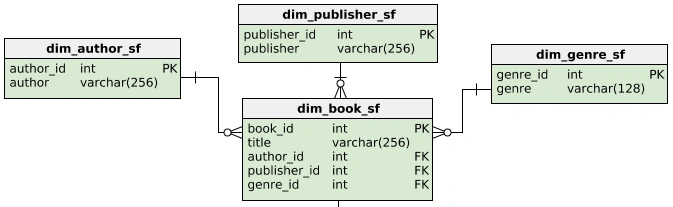

In this exercise, you are going to extend the star schema to meet part of the snowflake schema's criteria. Specifically, you will create `dim_author` from the data provided in `dim_book_star`.


Create `dim_author` with a column for `author`.

Insert all the distinct authors from `dim_book_star` into `dim_author`.

```sql
-- Create dim_author with an author column
CREATE TABLE dim_author (
    author varchar(256) NOT NULL
);

-- Insert distinct authors 
INSERT INTO dim_author
SELECT DISTINCT author FROM dim_book_star;
```

Alter `dim_author` to have a primary key called `author_id`.

Output all the columns of `dim_author`.

```sql
-- Create a new table for dim_author with an author column
CREATE TABLE dim_author (
    author varchar(256)  NOT NULL
);

-- Insert authors 
INSERT INTO dim_author
SELECT DISTINCT author FROM dim_book_star;

-- Add a primary key 
ALTER TABLE dim_author ADD COLUMN author_id SERIAL PRIMARY KEY;

-- Output the new table
SELECT * FROM dim_author;
```
&nbsp;&nbsp;&nbsp;

1. Creating the `dim_author` Table:
```sql
CREATE TABLE dim_author (
    author varchar(256) NOT NULL
);
```
> This line creates a new table named `dim_author` with a single column author of type `varchar(256)`. The `NOT NULL` constraint ensures that every entry in this column must have a value, which is important for maintaining data integrity.

&nbsp;&nbsp;&nbsp;

2.Inserting Distinct Authors:
```sql
INSERT INTO dim_author
SELECT DISTINCT author FROM dim_book_star;
```
&nbsp;&nbsp;&nbsp;

> Here, we are populating the `dim_author` table with unique author names. The `SELECT DISTINCT` statement retrieves all unique authors from the `dim_book_star` table, ensuring that each author appears only once in the dim_author table. This step is crucial for normalizing the data and avoiding duplicate entries.

&nbsp;&nbsp;&nbsp;

3. Adding a Primary Key:
```sql
ALTER TABLE dim_author ADD COLUMN author_id SERIAL PRIMARY KEY;
```
> This line alters the `dim_author` table by adding a new column named `author_id`. The SERIAL keyword automatically generates a unique integer for each row, which serves as the primary key. The primary key uniquely identifies each record in the table, which is essential for efficient data retrieval and maintaining relationships with other tables.

&nbsp;&nbsp;&nbsp;

4. Outputting the Table:
```sql
SELECT * FROM dim_author;
```
> Finally, this statement retrieves and displays all the columns and rows from the `dim_author` table. It allows you to verify that the table has been correctly populated and structured, with the `author_id` serving as the primary key and each author listed only once.

&nbsp;&nbsp;&nbsp;

&nbsp;&nbsp;&nbsp;

&nbsp;&nbsp;&nbsp;

&nbsp;&nbsp;&nbsp;

## Normalized and denormalized databases

&nbsp;&nbsp;&nbsp;

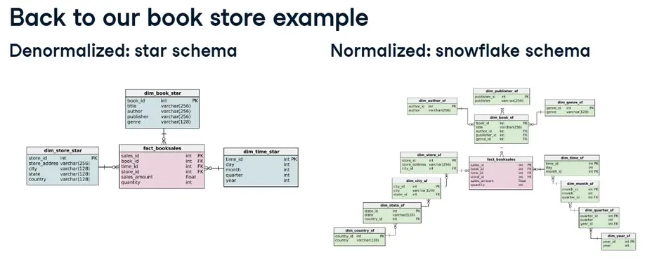

&nbsp;&nbsp;&nbsp;

### Denormalized Query

- Goal: get quantity of all Octavia E. Butler books sold in Vancouver in Q4 of 2018
```sql
SELECT SUM(quantity) 
FROM fact_booksales
-- Join to get city  
INNER JOIN dim_store_star ON fact_booksales.store_id = dim_store_star.store_id
-- Join to get author  
INNER JOIN dim_book_star ON fact_booksales.book_id = dim_book_star.book_id
-- Join to get year and quarter  
INNER JOIN dim_time_star ON fact_booksales.time_id = dim_time_star.time_id
-- WHERE conditions
WHERE dim_store_star.city = 'Vancouver' 
  AND dim_book_star.author = 'Octavia E. Butler' 
  AND dim_time_star.year = 2018 
  AND dim_time_star.quarter = 4;
```
```
7600
```
&nbsp;&nbsp;&nbsp;

#### Normalized query

```asl
SELECT
    SUM(fact_booksales.quantity)
FROM
    fact_booksales
    -- Join to get city
    INNER JOIN dim_store_sf ON fact_booksales.store_id = dim_store_sf.store_id
    INNER JOIN dim_city_sf ON dim_store_sf.city_id = dim_city_sf.city_id
    -- Join to get author
    INNER JOIN dim_book_sf ON fact_booksales.book_id = dim_book_sf.book_id
    INNER JOIN dim_author_sf ON dim_book_sf.author_id = dim_author_sf.author_id
    -- Join to get year and quarter
    INNER JOIN dim_time_sf ON fact_booksales.time_id = dim_time_sf.time_id
    INNER JOIN dim_month_sf ON dim_time_sf.month_id = dim_month_sf.month_id
    INNER JOIN dim_quarter_sf ON dim_month_sf.quarter_id = dim_quarter_sf.quarter_id
    INNER JOIN dim_year_sf ON dim_quarter_sf.year_id = dim_year_sf.year_id
-- WHERE conditions
WHERE dim_city_sf.city = 'Vancouver'
    AND dim_author_sf.author_name = 'Octavia E. Butler'
    AND dim_year_sf.year = 2018
    AND dim_quarter_sf.quarter = 4;
```
```
7600
```
Total of 8 joins

***So, why would we want to normalize a databases?***

&nbsp;&nbsp;&nbsp;

### Normalization saves space 

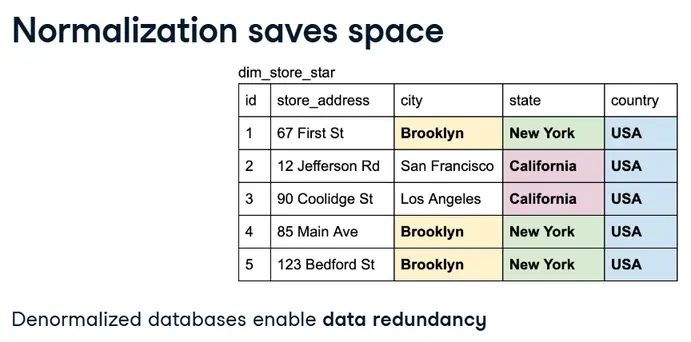

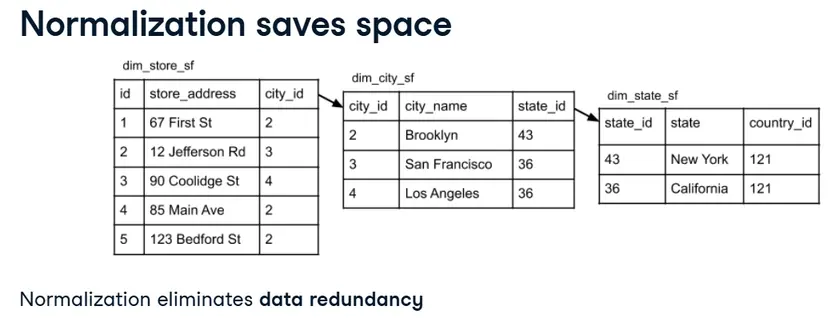

&nbsp;&nbsp;&nbsp;

### Normalization ensures better data integrity

#### 1. Enforces data consistency
Must respect naming conventions because of referential integrity, e.g., 'California', not 'CA' or 'california'

#### 2. Safer updating, removing, and inserting
Less data redundancy = less records to alter

#### 3. Easier to redesign by extending
Smaller tables are easier to extend than larger tables

&nbsp;&nbsp;&nbsp;

### Database normalization

#### Advantages
- Normalization eliminates data redundancy: save on storage

- Better data integrity: accurate and consistent data

&nbsp;&nbsp;&nbsp;

#### Disadvantages
- Complex queries require more CPU

&nbsp;&nbsp;&nbsp;

&nbsp;&nbsp;&nbsp;

### Remember OLTP and OLAP?

| OLTP | OLAP |  
|------|------|
| e.g., Operational databases | e.g., Operational databases |
| **Typically highly normalized** | **Typically less normalized** | 
| - Write-intensive           | - Read-intensive          |
| - Prioritize quicker and safer insertion of data | - Prioritize quicker queries for analytics |

&nbsp;&nbsp;&nbsp;

&nbsp;&nbsp;&nbsp;

#### Querying the star schema

The novel genre hasn't been selling as well as your company predicted. To help remedy this, you've been tasked to run some analytics on the novel genre to find which areas the Sales team should target. To begin, you want to look at the total amount of sales made in each state from books in the novel genre.
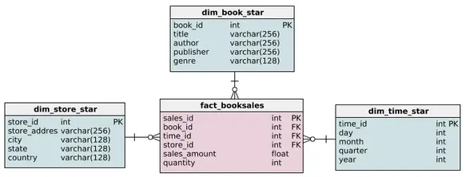
Luckily, you've just finished setting up a data warehouse with the following star schem


Select `state` from the appropriate table and the total `sales_amount`.

Complete the JOIN on `book_id`.

Complete the JOIN to connect the `dim_store_star` table

Conditionally select for books with the `genre` `novel`.

Group the results by state.

```sql
-- Output each state and their total sales_amount
SELECT dim_store_star.state, SUM(sales_amount)
FROM fact_booksales
	-- Join to get book information
    JOIN dim_book_star ON fact_booksales.book_id = dim_book_star.book_id
	-- Join to get store information
    JOIN dim_store_star ON fact_booksales.store_id = dim_store_star.store_id
-- Get all books with in the novel genre
WHERE  
    dim_book_star.genre = 'novel'
-- Group results by state
GROUP BY
    dim_store_star.state;
```

&nbsp;&nbsp;&nbsp;

&nbsp;&nbsp;&nbsp;

#### Querying the snowflake schema
Imagine that you didn't have the data warehouse set up. Instead, you'll have to run this query on the company's operational database, which means you'll have to rewrite the previous query with the following snowflake schema:

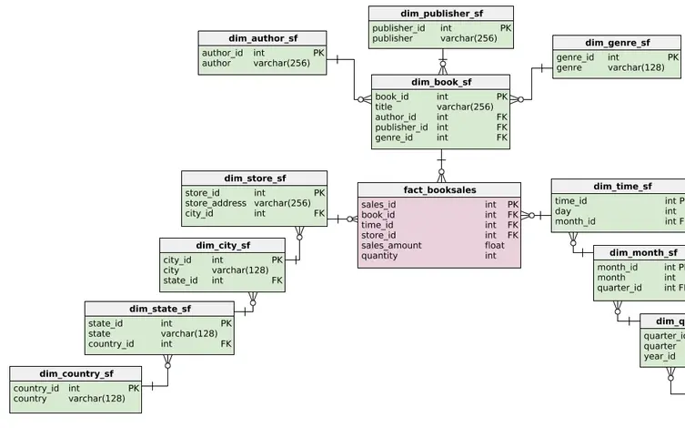

The tables in this schema have been loaded. Remember, our goal is to find the amount of money made from the novel genre in each state.

&nbsp;&nbsp;&nbsp;

Select `state` from the appropriate table and the total `sales_amount`.

Complete the two JOINS to get the `genre_id`'s.

Complete the three JOINS to get the `state_id`'s.

Conditionally select for books with the `genre` `novel`.

Group the results by state.

```sql
-- Output each state and their total sales_amount
SELECT dim_state_sf.state, SUM(sales_amount)
FROM fact_booksales
    -- Joins for genre
    JOIN dim_book_sf on fact_booksales.book_id = dim_book_sf.book_id
    JOIN dim_genre_sf on dim_book_sf.genre_id = dim_genre_sf.genre_id
    -- Joins for state 
    JOIN dim_store_sf on fact_booksales.store_id = dim_store_sf.store_id 
    JOIN dim_city_sf on dim_store_sf.city_id = dim_city_sf.city_id
	JOIN dim_state_sf on  dim_city_sf.state_id = dim_state_sf.state_id
-- Get all books with in the novel genre and group the results by state
WHERE  
    dim_genre_sf.genre = 'novel'
GROUP BY
    dim_state_sf.state;
```

&nbsp;&nbsp;&nbsp;

&nbsp;&nbsp;&nbsp;


#### Extending the snowflake schema

The company is thinking about extending their business beyond bookstores in Canada and the US. Particularly, they want to expand to a new continent. In preparation, you decide a `continent` field is needed when storing the addresses of stores.

Luckily, you have a snowflake schema in this scenario. As we discussed in the video, the snowflake schema is typically faster to extend while ensuring data consistency. Along with `dim_country_sf`, a table called `dim_continent_sf` has been loaded. It contains the only continent currently needed, North America, and a primary key. In this exercise, you'll need to extend `dim_country_sf` to reference `dim_continent_sf`.

Add a `continent_id` column to `dim_country_sf` with a default value of 1. Note that `NOT NULL DEFAULT(1)` constrains a value from being null and defaults its value to `1`.

Make that new column a foreign key reference to `dim_continent_sf`'s `continent_id`.

```sql
-- Add a continent_id column with default value of 1
ALTER TABLE dim_country_sf
ADD continent_id int NOT NULL DEFAULT(1);

-- Add the foreign key constraint
ALTER TABLE dim_country_sf ADD CONSTRAINT country_continent
   FOREIGN KEY (continent_id) REFERENCES dim_continent_sf(continent_id);
   
-- Output updated table
SELECT * FROM dim_country_sf;
```
&nbsp;&nbsp;&nbsp;

&nbsp;&nbsp;&nbsp;

&nbsp;&nbsp;&nbsp;

## Normal forms

### Normalization

Identify repeating groups of data and create new tables for them

A more formal definition:

The goals of normalization are to:

- Be able to characterize the level of redundancy in a relational schema  

- Provide mechanisms for transforming schemas in order to remove redundancy

&nbsp;&nbsp;&nbsp;

&nbsp;&nbsp;&nbsp;

&nbsp;&nbsp;&nbsp;

### Normal forms (NF)

- Ordered from least to most normalized:

- First normal form (1NF)

- Second normal form (2NF)

- Third normal form (3NF)

- Elementary key normal form (EKNF)

- Boyce-Codd normal form (BCNF)

- Fourth normal form (4NF)

- Essential tuple normal form (ETNF)

- Fifth normal form (5NF)

- Domain-key Normal Form (DKNF)

- Sixth normal form (6NF)

&nbsp;&nbsp;&nbsp;

&nbsp;&nbsp;&nbsp;

### 1NF 

- Each record must be unique - no duplicate rows  

- Each cell must hold one value  

- 

#### Initial data
```
| Student_id | Student_Email    | Courses_Completed                                 |
|------------|------------------|---------------------------------------------------|
| 235        | jim@gmail.com    | Introduction to Python, Intermediate Python       |
| 455        | kelly@yahoo.com  | Cleaning Data in R                                |
| 767        | amy@hotmail.com  | Machine Learning Toolbox, Deep Learning in Python |
```
&nbsp;&nbsp;&nbsp;

#### In 1NF form
```
+------------+------------------+
| Student_id | Student_Email    |
+------------+------------------+
| 235        | jim@gmail.com    |
| 455        | kelly@yahoo.com  |
| 767        | amy@hotmail.com  |
+------------+------------------+

+------------+---------------------------+
| Student_id | Completed                 |
+------------+---------------------------+
| 235        | Introduction to Python    |
| 235        | Intermediate Python       |
| 455        | Cleaning Data in R        |
| 767        | Machine Learning Toolbox  |
| 767        | Deep Learning in Python   |
+------------+---------------------------+
```

&nbsp;&nbsp;&nbsp;

### 2NF

- Must satisfy 1NF AND
  - If primary key is one column
    - then automatically satisfies 2NF
  - If there is a composite primary key
    - then each non-key column must be dependent on all the keys

#### Initial data
```
+------------+-----------+---------------+----------------+----------+
| Student_id | Course_id | Instructor_id | Instructor     | Progress |
+------------+-----------+---------------+----------------+----------+
| 235        | 2001      | 560           | Nick Carchedi  | 0.55     |
| 455        | 2345      | 658           | Ginger Grant   | 0.10     |
| 767        | 6584      | 999           | Chester Ismay  | 1.00     |
+------------+-----------+---------------+----------------+----------+
```

&nbsp;&nbsp;&nbsp;

#### In 2NF form
```
+------------+-----------+-------------------+
| Student_id | Course_id | Percent_Completed |
+------------+-----------+-------------------+
| 235        | 2001      | 0.55              |
| 455        | 2345      | 0.10              |
| 767        | 6584      | 1.00              |
+------------+-----------+-------------------+

+-----------+---------------+----------------+
| Course_id | Instructor_id | Instructor     |
+-----------+---------------+----------------+
| 2001      | 560           | Nick Carchedi  |
| 2345      | 658           | Ginger Grant   |
| 6584      | 999           | Chester Ismay  |
+-----------+---------------+----------------+
```
&nbsp;&nbsp;&nbsp;

### 3NF

- Satisfies 2NF  
- No transitive dependencies: non-key columns can't depend on other non-key columns  

#### Initial Data
```
+-----------+---------------+----------------+--------+
| Course_id | Instructor_id | Instructor     | Tech   |
+-----------+---------------+----------------+--------+
| 2001      | 560           | Nick Carchedi  | Python |
| 2345      | 658           | Ginger Grant   | SQL    |
| 6584      | 999           | Chester Ismay  | R      |
+-----------+---------------+----------------+--------+
```

#### In 3NF
```
+-----------+----------------+--------+
| Course_id | Instructor     | Tech   |
+-----------+----------------+--------+
| 2001      | Nick Carchedi  | Python |
| 2345      | Ginger Grant   | SQL    |
| 6584      | Chester Ismay  | R      |
+-----------+----------------+--------+

+---------------+----------------+
| Instructor_id | Instructor     |
+---------------+----------------+
| 560           | Nick Carchedi  |
| 658           | Ginger Grant   |
| 999           | Chester Ismay  |
+---------------+----------------+
```
&nbsp;&nbsp;&nbsp;

### Data anomalies

What is risked if we don't normalize enough?

1. Update anomaly  

2. Insertion anomaly  

3. Deletion anomaly  

&nbsp;&nbsp;&nbsp;

### Update anomaly

Data inconsistency caused by data redundancy when updating

```
+------------+-----------------+--------------------------+------------------------+
| Student_ID | Student_Email   | Enrolled_in              | Taught_by              |
+------------+-----------------+--------------------------+------------------------+
| 230        | lisa@gmail.com  | Cleaning Data in R       | Maggie Matsui          |
| 367        | bob@hotmail.com | Data Visualization in R  | Ronald Pearson         |
| 520        | ken@yahoo.com   | Introduction to Python   | Hugo Bowne-Anderson    |
| 520        | ken@yahoo.com   | Arima Models in R        | David Stoffer          |
+------------+-----------------+--------------------------+------------------------+
```
To update student `520`'s email:

- Need to update more than one record, otherwise, there will be inconsistency

- User updating needs to know about redundancy

&nbsp;&nbsp;&nbsp;

### Insertion anomaly

Unable to add a record due to missing attributes

```
+------------+-----------------+--------------------------+------------------------+
| Student_ID | Student_Email   | Enrolled_in              | Taught_by              |
+------------+-----------------+--------------------------+------------------------+
| 230        | lisa@gmail.com  | Cleaning Data in R       | Maggie Matsui          |
| 367        | bob@hotmail.com | Data Visualization in R  | Ronald Pearson         |
| 521        | ken@yahoo.com   | Introduction to Python   | Hugo Bowne-Anderson    |
| 521        | ken@yahoo.com   | Arima Models in R        | David Stoffer          |
+------------+-----------------+--------------------------+------------------------+
```
Unable to insert a student who has signed up but not enrolled in any courses

&nbsp;&nbsp;&nbsp;

### Deletion anomaly

Deletion of record(s) causes unintentional loss of data

```
+------------+-----------------+--------------------------+------------------------+
| Student_ID | Student_Email   | Enrolled_in              | Taught_by              |
+------------+-----------------+--------------------------+------------------------+
| 230        | lisa@gmail.com  | Cleaning Data in R       | Maggie Matsui          |
| 367        | bob@hotmail.com | Data Visualization in R  | Ronald Pearson         |
| 520        | ken@yahoo.com   | Introduction to Python   | Hugo Bowne-Anderson    |
| 520        | ken@yahoo.com   | Arima Models in R        | David Stoffer          |
+------------+-----------------+--------------------------+------------------------+

```

If we delete Student `230`, what happens to the data on `Cleaning Data in R`?

&nbsp;&nbsp;&nbsp;

&nbsp;&nbsp;&nbsp;

#### Converting to 1NF

In the next three exercises, you'll be working through different tables belonging to a car rental company. Your job is to explore different schemas and gradually increase the normalization of these schemas through the different normal forms. At this stage, we're not worried about relocating the data, but rearranging the tables.

A table called customers has been loaded, which holds information about customers and the cars they have rented.

```sql
-- Create a new table to hold the cars rented by customers
CREATE TABLE cust_rentals (
  customer_id INT NOT NULL,
  car_id VARCHAR(128) NULL,
  invoice_id VARCHAR(128) NULL
);

-- Drop two columns from customers table to satisfy 1NF
ALTER TABLE customers
DROP COLUMN cars_rented,
DROP COLUMN invoice_id;
```
&nbsp;&nbsp;&nbsp;

&nbsp;&nbsp;&nbsp;

#### Converting to 2NF

Let's try normalizing a bit more. In the last exercise, you created a table holding `customer_ids` and `car_ids`. This has been expanded upon and the resulting table, `customer_rentals`, has been loaded for you. Since you've got 1NF down, it's time for 2NF.


Create a new table for the non-key columns that were conflicting with 2NF criteria.

Drop those non-key columns from `customer_rentals`.

```sql
-- Create a new table to satisfy 2NF
CREATE TABLE cars (
  car_id VARCHAR(256) NULL,
  model VARCHAR(128),
  manufacturer VARCHAR(128),
  type_car VARCHAR(128),
  condition VARCHAR(128),
  color VARCHAR(128)
);

-- Insert data into the new table
INSERT INTO cars
SELECT DISTINCT
  car_id,
  model,
  manufacturer,
  type_car,
  condition,
  color
FROM customer_rentals;

-- Drop columns in customer_rentals to satisfy 2NF
ALTER TABLE customer_rentals
DROP COLUMN model,
DROP COLUMN manufacturer, 
DROP COLUMN type_car,
DROP COLUMN condition,
DROP COLUMN color;
```

&nbsp;&nbsp;&nbsp;

&nbsp;&nbsp;&nbsp;

#### Converting to 3NF

Last, but not least, we are at 3NF. In the last exercise, you created a table holding car_idss and car attributes. This has been expanded upon. For example, `car_id` is now a primary key. The resulting table, `rental_cars`, has been loaded for you.


```sql
-- Create a new table to satisfy 3NF
CREATE TABLE car_model(
  model VARCHAR(128),
  manufacturer VARCHAR(128),
  type_car VARCHAR(128)
);

-- Drop columns in rental_cars to satisfy 3NF
ALTER TABLE rental_cars
DROP COLUMN manufacturer, 
DROP COLUMN type_car;
```
&nbsp;&nbsp;&nbsp;

&nbsp;&nbsp;&nbsp;

&nbsp;&nbsp;&nbsp;

&nbsp;&nbsp;&nbsp;


## Database views

In a database, a view is the result set of a stored query on the data, which the database users can query just as they would in a persistent database collection object (Wikipedia)

### Virtual table that is not part of the physical schema

- Query, not data, is stored in memory  

- Data is aggregated from data in tables  

- Can be queried like a regular database table  

- No need to retype common queries or alter schemas

&nbsp;&nbsp;&nbsp;

&nbsp;&nbsp;&nbsp;

### Creating a view (syntax)


```sql
CREATE VIEW view_name AS
SELECT col1, col2
FROM table_name
WHERE condition;
```
&nbsp;&nbsp;&nbsp;

#### Creating a view (example)

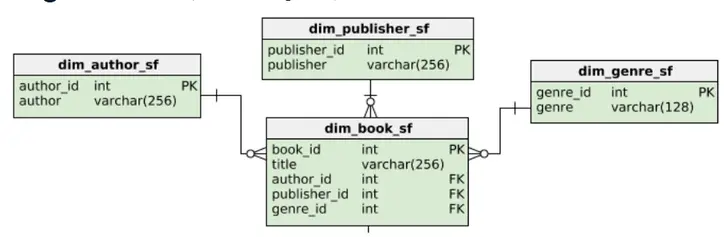

Goal: Return titles and authors of the `science fiction` genre

&nbsp;&nbsp;&nbsp;

```sql
CREATE VIEW scifi_books AS
SELECT title, author, genre
FROM dim_book_sf
JOIN dim_genre_sf ON dim_genre_sf.genre_id = dim_book_sf.genre_id
JOIN dim_author_sf ON dim_author_sf.author_id = dim_book_sf.author_id
WHERE dim_genre_sf.genre = 'science fiction';
```

&nbsp;&nbsp;&nbsp;

#### Querying a view (example)

SELECT * FROM scifi_books
```
| title                          | author           | genre          |
+--------------------------------+------------------+----------------+
| The Naked Sun                  | Isaac Asimov     | science fiction|
| The Robots of Dawn             | Isaac Asimov     | science fiction|
| The Time Machine               | H.G. Wells       | science fiction|
| The Invisible Man              | H.G. Wells       | science fiction|
| The War of the Worlds          | H.G. Wells       | science fiction|
| Wild Seed (Patternmaster, #1)  | Octavia E. Butler| science fiction|
| ...                            | ...              | ...            |
```

&nbsp;&nbsp;&nbsp;

#### Simple view query

Behind the scenes: What happens when you query the view

```
SELECT * FROM scifi_books;
```
=
```
-- Is equivalent to this complex query:
SELECT * FROM (
    SELECT 
        title, 
        author, 
        genre
    FROM dim_book_sf
    JOIN dim_genre_sf ON dim_genre_sf.genre_id = dim_book_sf.genre_id
    JOIN dim_author_sf ON dim_author_sf.author_id = dim_book_sf.author_id
    WHERE dim_genre_sf.genre = 'science fiction'
);
```

&nbsp;&nbsp;&nbsp;

#### Viewing views
(in PostgreSQL)

including system views
```sql
SELECT * FROM INFORMATION_SCHEMA.views;
```

exclude system views
```
SELECT * FROM information_schema.views  
WHERE table_schema NOT IN ('pg_catalog', 'information_schema');
```

&nbsp;&nbsp;&nbsp;

#### Benefits of views

- Doesn't take up storage

- A form of access control

  - Hide sensitive columns and restrict what user can see

- Masks complexity of queries

  - Useful for highly normalized schemas

&nbsp;&nbsp;&nbsp;

&nbsp;&nbsp;&nbsp;

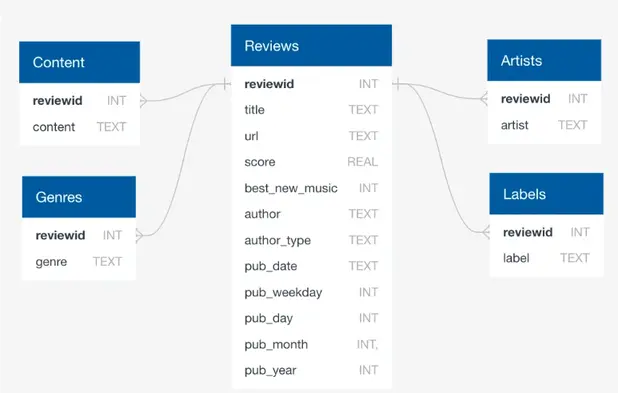

&nbsp;&nbsp;&nbsp;

&nbsp;&nbsp;&nbsp;

#### Viewing views

Because views are very useful, it's common to end up with many of them in your database. It's important to keep track of them so that database users know what is available to them.

The goal of this exercise is to get familiar with viewing views within a database and interpreting their purpose. This is a skill needed when writing database documentation or organizing views.

- Query the information schema to get views.

- Exclude system views in the results.

```sql
-- Get all non-systems views
SELECT * FROM information.schem.views
WHERE table_schema NOT IN ('pg_catalog', 'information_schema');
```

&nbsp;&nbsp;&nbsp;

&nbsp;&nbsp;&nbsp;

#### Creating and querying a view

Have you ever found yourself running the same query over and over again? Maybe, you used to keep a text copy of the query in your desktop notes app, but that was all before you knew about views!

In these Pitchfork reviews, we're particularly interested in high-scoring reviews and if there's a common thread between the works that get high scores. In this exercise, you'll make a view to help with this analysis so that we don't have to type out the same query often to get these high-scoring reviews.


Create a view called `high_scores` that holds reviews with `score`s above a `9`.
```sql
-- Create a view for reviews with a score above 9
CREATE VIEW high_scores AS
SELECT * FROM REVIEWS
WHERE score > 9;
```
Count the number of records in `high_scores` that are `self-released` in the `label` field of the `labels` table.
```sql
-- Create a view for reviews with a score above 9
CREATE VIEW high_scores AS
SELECT * FROM REVIEWS
WHERE score > 9;

-- Count the number of self-released works in high_scores
SELECT COUNT(*) FROM high_scores
INNER JOIN labels ON high_scores.reviewid = labels.reviewid
WHERE label = 'self-released';
```
&nbsp;&nbsp;&nbsp;

&nbsp;&nbsp;&nbsp;

&nbsp;&nbsp;&nbsp;

### Managing views

#### Creating more complex views

- **Aggregation**: `SUM()`, `AVG()`, `COUNT()`, `MIN()`, `MAX()`, `GROUP BY`, etc

- **Joins**: `INNER JOIN`, `LEFT JOIN`, `RIGHT JOIN`, `FULL JOIN`

- **Conditionals**: `WHERE`, `HAVING`, `UNIQUE`, `NOT NULL`, `AND`, `OR`, `>`, `<`, etc

&nbsp;&nbsp;&nbsp;

&nbsp;&nbsp;&nbsp;

#### Granting and revoking access to a view

GRANT privilege(s) or REVOKE privilege(s)

**ON object**

TO role or FROM role

- **Privileges:** SELECT, INSERT, UPDATE, DELETE, etc  

- **Objects:** table, view, schema, etc  

- **Roles:** a database user or a group of database users

&nbsp;&nbsp;&nbsp;

&nbsp;&nbsp;&nbsp;

#### Granting and revoking example

```sql
GRANT UPDATE ON ratings TO PUBLIC;
```

```sql
REVOKE INSERT ON films FROM db_user;
```
&nbsp;&nbsp;&nbsp;

&nbsp;&nbsp;&nbsp;

#### Updating a view

```sql
UPDATE films SET kind = 'Dramatic' WHERE kind = 'Drama';
```
Not all views are updatable

- View is made up of one table

- Doesn't use a window or aggregate function

&nbsp;&nbsp;&nbsp;

&nbsp;&nbsp;&nbsp;

#### Inserting into a view

```sql
INSERT INTO films (code, title, did, date_prod, kind)
VALUES ('T_601', 'Yojimbo', 106, '1961-06-16', 'Drama');
```
Not all views are insertable

Takeaway: avoid modifying data through views


&nbsp;&nbsp;&nbsp;

&nbsp;&nbsp;&nbsp;

#### Dropping a view
```sql
DROP VIEW view_name [ CASCADE | RESTRICT ];
```

- `RESTRICT` (default): returns an error if there are objects that depend on the view

- `CASCADE`: drops view and any object that depends on that view

&nbsp;&nbsp;&nbsp;

&nbsp;&nbsp;&nbsp;

#### Redefining a view

```sql
CREATE OR REPLACE VIEW view_name AS new_query
```

- If a view with view_name exists, it is replaced  

- new_query must generate the same column names, order, and data types as the old query  

- The column output may be different  

- New columns may be added at the end  

**If these criteria can't be met, drop the existing view and create a new one**
&nbsp;&nbsp;&nbsp;

&nbsp;&nbsp;&nbsp;

#### Altering a view
```sql
ALTER VIEW [ IF EXISTS ] name ALTER [ COLUMN ] column_name SET DEFAULT expression
ALTER VIEW [ IF EXISTS ] name ALTER [ COLUMN ] column_name DROP DEFAULT
ALTER VIEW [ IF EXISTS ] name OWNER TO new_owner
ALTER VIEW [ IF EXISTS ] name RENAME TO new_name
ALTER VIEW [ IF EXISTS ] name SET SCHEMA new_schema
ALTER VIEW [ IF EXISTS ] name SET ( view_option_name [= view_option_value] [, ... ] )
ALTER VIEW [ IF EXISTS ] name RESET ( view_option_name [, ... ] )
```
&nbsp;&nbsp;&nbsp;

&nbsp;&nbsp;&nbsp;

---

#### Creating a view from other views
Views can be created from queries that include other views. This is useful when you have a complex schema, potentially due to normalization, because it helps reduce the `JOINS` needed. The biggest concern is keeping track of dependencies, specifically how any modifying or dropping of a view may affect other views.

In the next few exercises, we'll continue using the Pitchfork reviews data. There are two views of interest in this exercise. `top_15_2017` holds the top 15 highest scored reviews published in 2017 with columns `reviewid`,`title`, and `score`. `artist_title` returns a list of all reviewed titles and their respective artists with columns `reviewid`, `title`, and `artist`. From these views, we want to create a new view that gets the highest scoring artists of 2017.

Create a view called `top_artists_2017` with `artist` from `artist_title`.

To only return the highest scoring artists of 2017, join the views `top_15_2017` and `artist_title` on `reviewid`.

Output `top_artists_2017`

```sql
-- Create a view with the top artists in 2017
CREATE VIEW top_artists_2017 AS
-- with only one column holding the artist field
SELECT artist_title.artist FROM artist_title
INNER JOIN top_15_2017
ON artist_title.reviewid = top_15_2017.reviewid;

-- Output the new view
SELECT * FROM top_artists_2017;
```
&nbsp;&nbsp;&nbsp;

&nbsp;&nbsp;&nbsp;

---

#### Granting and revoking access

Access control is a key aspect of database management. Not all database users have the same needs and goals, from analysts, clerks, data scientists, to data engineers. As a general rule of thumb, write access should never be the default and only be given when necessary.

In the case of our Pitchfork reviews, we don't want all database users to be able to write into the long_reviews view. Instead, the editor should be the only user able to edit this view.

Revoke all database users' update and insert privileges on the `long_reviews` view.

Grant the `editor` user update and insert privileges on the `long_reviews` view.

```sql
-- Revoke everyone's update and insert privileges
REVOKE UPDATE, INSERT ON long_reviews FROM PUBLIC; 

-- Grant the editor update and insert privileges 
GRANT UPDATE, INSERT ON long_reviews TO editor; 
```
&nbsp;&nbsp;&nbsp;

&nbsp;&nbsp;&nbsp;

---

#### Redefining a view

Unlike inserting and updating, redefining a view doesn't mean modifying the actual data a view holds. Rather, it means modifying the underlying query that makes the view. In the last video, we learned of two ways to redefine a view: (1) `CREATE OR REPLACE` and (2) `DROP` then `CREATE`. `CREATE` OR `REPLACE` can only be used under certain conditions.

The `artist_title` view needs to be appended to include a column for the `label` field from the `labels` table

Use `CREATE OR REPLACE` to redefine the `artist_title` view.

Respecting `artist_title`'s original columns of `reviewid`, `title`, and `artist`, add a `label` column from the `labels` table.

Join the labels table using the `reviewid` field.


```sql
-- Redefine the artist_title view to have a label column
CREATE OR REPLACE VIEW artist_title AS
SELECT reviews.reviewid, reviews.title, artists.artist, labels.label
FROM reviews
INNER JOIN artists
ON artists.reviewid = reviews.reviewid
INNER JOIN labels
ON labels.reviewid = reviews.reviewid;

SELECT * FROM artist_title;
```
---

&nbsp;&nbsp;&nbsp;

&nbsp;&nbsp;&nbsp;

&nbsp;&nbsp;&nbsp;

&nbsp;&nbsp;&nbsp;

### Materialized views

- Stores the ***query results***, not the **query**

- Querying a materialized view means accessing the stored query results  

  - Not running the query like a non-materialized view  

- Refreshed or rematerialized when prompted or scheduled

&nbsp;&nbsp;&nbsp;

#### Two types of views

| **Views** | **Materialized views** |
|-----------|------------------------|
| - Also known as non-materialized views |  - Physically materialized |
| - How we've defined views so far | |

&nbsp;&nbsp;&nbsp;

#### When to use materialized views

- Long running queries  

- Underlying query results don't change often  

- Data warehouses because OLAP is not write-intensive  

  - Save on computational cost of frequent queries

&nbsp;&nbsp;&nbsp;

&nbsp;&nbsp;&nbsp;

#### Implementing materialized views  

**(in PostgreSQL)**

```sql
CREATE MATERIALIZED VIEW my_mv AS SELECT * FROM existing_table;
```

```sql
REFRESH MATERIALIZED VIEW my_mv;
```
&nbsp;&nbsp;&nbsp;

####  Managing dependencies

- Materialized views often depend on other materialized views

&nbsp;&nbsp;&nbsp;

&nbsp;&nbsp;&nbsp;

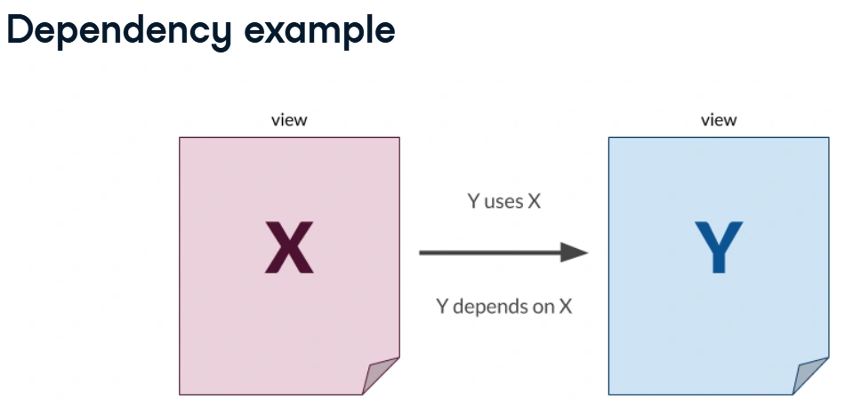

&nbsp;&nbsp;&nbsp;

&nbsp;&nbsp;&nbsp;

#### Managing dependencies

- Materialized views often depend on other materialized views

- Creates a **dependency chain** when refreshing views

- Not the most efficient to refresh all views at the same time


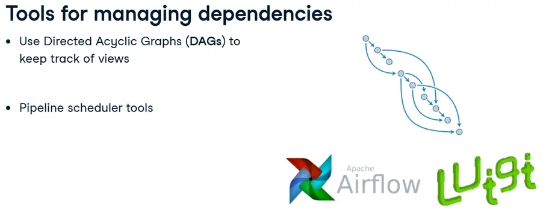

&nbsp;&nbsp;&nbsp;

&nbsp;&nbsp;&nbsp;

#### Creating and refreshing a materialized view

The syntax for creating materialized and non-materialized views are quite similar because they are both defined by a query. One key difference is that we can refresh materialized views, while no such concept exists for non-materialized views. It's important to know how to refresh a materialized view, otherwise the view will remain a snapshot of the time the view was created.

In this exercise, you will create a materialized view from the table `genres`. A new record will then be inserted into `genres`. To make sure the view has the latest data, it will have to be refreshed.

- Create a materialized view called `genre_count` that holds the number of reviews for each genre.


- Refresh `genre_count` so that the view is up-to-date.

```sql
-- Create a materialized view called genre_count 
CREATE MATERIALIZED  VIEW genre_count AS
SELECT genre, COUNT(*) 
FROM genres
GROUP BY genre;

INSERT INTO genres
VALUES (50000, 'classical');

-- Refresh genre_count
REFRESH MATERIALIZED VIEW genre_count;

SELECT * FROM genre_count;
```
&nbsp;&nbsp;&nbsp;

&nbsp;&nbsp;&nbsp;

## Database roles and access control

### Granting and revoking access to a view

`GRANT privilege(s)` or `REVOKE privilege(s)`

`ON object`

`TO role` or `FROM role`

- Privileges: `SELECT`, `INSERT`, `UPDATE`, `DELETE`, etc.

- Objects: table, view, schema, etc.

- Roles: a database user or a group of database users

```sql
GRANT UPDATE ON ratings TO PUBLIC;
REVOKE INSERT ON films FROM db_user;
```
&nbsp;&nbsp;&nbsp;

&nbsp;&nbsp;&nbsp;

#### Database roles

- Manage database access permissions

- A database role is an entity that contains information that:

  - Define the role's privileges

    - Can you login?

    - Can you create databases?

    - Can you write to tables?

  - Interact with the client authentication system

    - Password

- Roles can be assigned to one or more users

- Roles are global across a database cluster installation

&nbsp;&nbsp;&nbsp;

&nbsp;&nbsp;&nbsp;

#### Create a role

- Empty role
```sql
  **CREATE** ROLE data_analyst;
```
- Roles with some attributes set
```sql
  **CREATE** ROLE intern WITH PASSWORD 'PasswordForIntern' VALID UNTIL '2020-01-01';
```
```sql
  **CREATE** ROLE admin CREATEDB;
```
```sql
  **ALTER** ROLE admin CREATEROLE;
```
&nbsp;&nbsp;&nbsp;

&nbsp;&nbsp;&nbsp;

#### GRANT and REVOKE privileges from roles

grants UPDATE permission on the "ratings" table to the "data_analyst" role.
```sql
GRANT UPDATE ON ratings TO data_analyst;
```
Revokes UPDATE permission on the "ratings" table from the "data_analyst" role.
```sql
REVOKE UPDATE ON ratings FROM data_analyst;
```
&nbsp;&nbsp;&nbsp;

The available privileges in PostgreSQL are:

`SELECT`, `INSERT`, `UPDATE`, `DELETE`, `TRUNCATE`, `REFERENCES`, `TRIGGER`, `CREATE`, `CONNECT`, `TEMPORARY`, `EXECUTE`, and `USAGE`

&nbsp;&nbsp;&nbsp;

#### Users and groups (are both roles)

A role is an entity that can function as a user and/or a group

- User roles

- Group roles

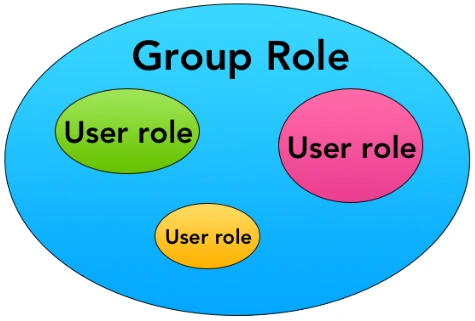

&nbsp;&nbsp;&nbsp;

&nbsp;&nbsp;&nbsp;

#### Users and groups (are both roles)

Group role
```sql
CREATE ROLE data_analyst;
```
User role
```sql
CREATE ROLE intern WITH PASSWORD 'PasswordForIntern' VALID UNTIL '2020-01-01';
```
&nbsp;&nbsp;&nbsp;

&nbsp;&nbsp;&nbsp;


Group role
```sql
CREATE ROLE data_analyst;
```

User role
```sql
CREATE ROLE alex WITH PASSWORD 'PasswordForIntern' VALID UNTIL '2020-01-01';
```

```sql
GRANT data_analyst TO alex;
```

```sql
REVOKE data_analyst FROM alex;
```

&nbsp;&nbsp;&nbsp;

&nbsp;&nbsp;&nbsp;

#### Common PostgreSQL roles

| Role | Allowed access |
|---|---|
| pg_read_all_settings | Read all configuration variables, even those normally visible only to superusers. |
| pg_read_all_stats | Read all pg_stat_* views and use various statistics related extensions, even those normally visible only to superusers. |
| pg_signal_backend | Send signals to other backends (eg: cancel query, terminate). |
| More... | More... |

&nbsp;&nbsp;&nbsp;

&nbsp;&nbsp;&nbsp;

#### Benefits and pitfalls of roles

Benefits
- Roles live on after users are deleted

- Roles can be created before user accounts

- Save DBAs time

Pitfalls

- Sometimes a role gives a specific user too much access

  - You need to pay attention

&nbsp;&nbsp;&nbsp;

&nbsp;&nbsp;&nbsp;

#### Create a role

A database role is an entity that contains information that define the role's privileges and interact with the client authentication system. Roles allow you to give different people (and often groups of people) that interact with your data different levels of access.

Imagine you founded a startup. You are about to hire a group of data scientists. You also hired someone named Marta who needs to be able to login to your database. You're also about to hire a database administrator. In this exercise, you will create these roles.


Create a role called `marta` that has one attribute: the ability to login (`LOGIN`).


Create a role called `admin` with the ability to create databases (`CREATEDB`) and to create roles (`CREATEROLE`).


Create a role called data_scientist.
```sql
-- Create a data scientist role
CREATE ROLE data_scientist;
```
Create a role called marta that has one attribute: the ability to login (LOGIN).
```sql
-- Create a role for Marta
CREATE ROLE marta LOGIN;
```
Create a role called admin with the ability to create databases (CREATEDB) and to create roles (CREATEROLE).
```sql
CREATE ROLE admin WITH CREATEDB CREATEROLE;
```
&nbsp;&nbsp;&nbsp;

&nbsp;&nbsp;&nbsp;

#### GRANT privileges and ALTER attributes

Once roles are created, you grant them specific access control privileges on objects, like tables and views. Common privileges being `SELECT`, `INSERT`, `UPDATE`, etc.

Imagine you're a cofounder of that startup and you want all of your data scientists to be able to update and insert data in the `long_reviews` view. In this exercise, you will enable those soon-to-be-hired data scientists by granting their role (`data_scientist`) those privileges. Also, you'll give Marta's role a password.

Grant the `data_scientist` role update and insert privileges on the `long_reviews` view.

Alter Marta's role to give her the provided password.
```sql
-- Grant data_scientist update and insert privileges
GRANT UPDATE, INSERT ON long_reviews TO data_scientist;

-- Give Marta's role a password
ALTER ROLE marta WITH PASSWORD 's3cur3p@ssw0rd';
```
&nbsp;&nbsp;&nbsp;

&nbsp;&nbsp;&nbsp;


####  Add a user role to a group role

There are two types of roles: user roles and group roles. By assigning a user role to a group role, a database administrator can add complicated levels of access to their databases with one simple command.

For your startup, your search for data scientist hires is taking longer than expected. Fortunately, it turns out that Marta, your recent hire, has previous data science experience and she's willing to chip in the interim. In this exercise, you'll add Marta's user role to the data scientist group role. You'll then remove her after you complete your hiring process.

Add Marta's user role to the data scientist group role.

Celebrate! You hired multiple data scientists.

Remove Marta's user role from the data scientist group role.
```sql
-- Add Marta to the data scientist group
GRANT data_scientist TO marta;

-- Celebrate! You hired data scientists.

-- Remove Marta from the data scientist group
REVOKE data_scientist FROM marta;

```
&nbsp;&nbsp;&nbsp;

&nbsp;&nbsp;&nbsp;

&nbsp;&nbsp;&nbsp;

&nbsp;&nbsp;&nbsp;

## Table partitioning

#### Why partition?

**Tables grow (100s Gb / Tb)**

**Problem:** queries/updates become slower

**Because:** e.g., indices don't fit memory

**Solution:** split table into smaller parts (= partitioning)


&nbsp;&nbsp;&nbsp;

&nbsp;&nbsp;&nbsp;

### Data modeling refresher

1. Conceptual data model 

2. Logical data model  

   *For partitioning, logical data model is the same*  

3. **Physical data model**  

   Partitioning is part of physical data model

&nbsp;&nbsp;&nbsp;

&nbsp;&nbsp;&nbsp;

### Vertical partitioning 

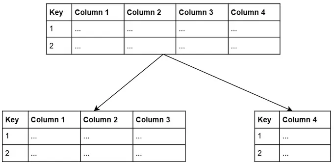

> split table even then fully **normalized**

&nbsp;&nbsp;&nbsp;

#### Vertical partitioning: an example

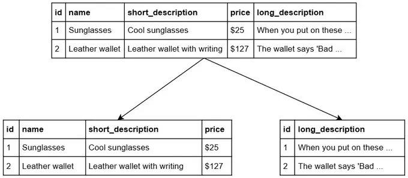
> E.g., store `Long_description` on slower medium

&nbsp;&nbsp;&nbsp;

&nbsp;&nbsp;&nbsp;

### Horizontal partitioning 

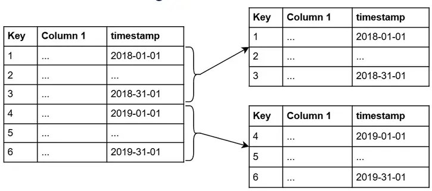

&nbsp;&nbsp;&nbsp;

#### Horizontal partitioning: an example

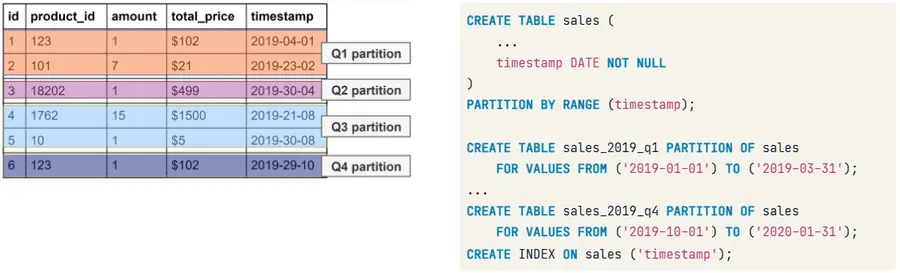

&nbsp;&nbsp;&nbsp;

#### Pros/cons of horizontal partitioning

**Pros**

- Indices of **heavily-used partitions** fit in memory  

- Move to **specific medium**: slower vs. faster  

- Used for both OLAP and OLTP  

**Cons**

- Partitioning **existing table** can be a **hassle**  

- Some **constraints** can not be set

&nbsp;&nbsp;&nbsp;

&nbsp;&nbsp;&nbsp;

### Relation to sharding 

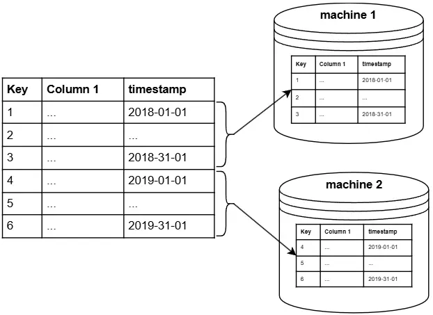

&nbsp;&nbsp;&nbsp;

&nbsp;&nbsp;&nbsp;

#### Creating vertical partitions

In the video, you learned about vertical partitioning and saw an example.

For vertical partitioning, there is no specific syntax in PostgreSQL. You have to create a new table with particular columns and copy the data there. Afterward, you can drop the columns you want in the separate partition. If you need to access the full table, you can do so by using a `JOIN` clause.

In this exercise and the next one, you'll be working with the example database called pagila. It's a database that is often used to showcase PostgreSQL features. The database contains several tables. We'll be working with the film table. In this exercise, we'll use the following columns:

- `film_id`: the unique identifier of the film

- `long_description`: a lengthy description of the film

&nbsp;&nbsp;&nbsp;

Create a new table `film_descriptions` containing 2 fields: `film_id`, which is of type `INT`, and `long_description`, which is of type `TEXT`.

Occupy the new table with values from the `film` table.

```sql
-- Create a new table called film_descriptions
CREATE TABLE film_descriptions (
    film_id INT,
    long_description TEXT
);

-- Copy the descriptions from the film table
INSERT INTO film_descriptions
SELECT film_id, long_description FROM film;
```
Drop the field `long_description` from the film table.

Join the two resulting tables to view the original table.
```sql
-- Create a new table called film_descriptions
CREATE TABLE film_descriptions (
    film_id INT,
    long_description TEXT
);

-- Copy the descriptions from the film table
INSERT INTO film_descriptions
SELECT film_id, long_description FROM film;
    
-- Drop the descriptions from the original table
ALTER TABLE film_descriptions DROP COLUMN long_description;

-- Join to view the original table
SELECT * FROM film 
JOIN film_descriptions USING(film_id);
```
&nbsp;&nbsp;&nbsp;

&nbsp;&nbsp;&nbsp;

#### Creating horizontal partitions

In the video, you also learned about horizontal partitioning.

The example of horizontal partitioning showed the syntax necessary to create horizontal partitions in PostgreSQL. If you need a reminder, you can have a look at the slides.

In this exercise, however, you'll be using a list partition instead of a range partition. For list partitions, you form partitions by checking whether the partition key is in a list of values or not.

To do this, we partition by `LIST` instead of `RANGE`. When creating the partitions, you should check if the values are `IN` a list of values.

`film_id`: the unique identifier of the film

`title`: the title of the film

`release_year`: the year it's released

&nbsp;&nbsp;&nbsp;

&nbsp;&nbsp;&nbsp;

Create the table `film_partitioned`, partitioned on the field `release_year`.
```sql
-- Create a new table called film_partitioned
CREATE TABLE film_partitioned (
  film_id INT,
  title TEXT NOT NULL,
  release_year TEXT
)
PARTITION BY LIST (release_year);
```
Create three partitions: one for each release year: 2017, 2018, and 2019. Call the partition for 2019 film_2019, etc.
```sql
-- Create a new table called film_partitioned
CREATE TABLE film_partitioned (
  film_id INT,
  title TEXT NOT NULL,
  release_year TEXT
)
PARTITION BY LIST (release_year);

-- Create the partitions for 2019, 2018, and 2017
CREATE TABLE film_2019
	PARTITION OF film_partitioned FOR VALUES IN ('2019');
    
CREATE TABLE film_2018
	PARTITION OF film_partitioned FOR VALUES IN ('2018');
    
CREATE TABLE film_2017
	PARTITION OF film_partitioned FOR VALUES IN ('2017');
```
Occupy the new table, film_partitioned, with the three fields required from the film table.
```sql
-- Create a new table called film_partitioned
CREATE TABLE film_partitioned (
  film_id INT,
  title TEXT NOT NULL,
  release_year TEXT
)
PARTITION BY LIST (release_year);

-- Create the partitions for 2019, 2018, and 2017
CREATE TABLE film_2019
	PARTITION OF film_partitioned FOR VALUES IN ('2019');

CREATE TABLE film_2018
	PARTITION OF film_partitioned FOR VALUES IN ('2018');

CREATE TABLE film_2017
	PARTITION OF film_partitioned FOR VALUES IN ('2017');

-- Insert the data into film_partitioned
INSERT INTO film_partitioned
SELECT film_id, title, release_year FROM film;

-- View film_partitioned
SELECT * FROM film_partitioned;
```
&nbsp;&nbsp;&nbsp;

&nbsp;&nbsp;&nbsp;

&nbsp;&nbsp;&nbsp;

&nbsp;&nbsp;&nbsp;

## Data integration

### What is Data Integration

Data Integration combines data from different sources, formats, and technologies to provide users with a translated and unified view of that data

#### Business Case Examples

- 360-degree customer view

- Acquisition

- Legacy systems


#### Unified data model

There are a few things to consider when integrating data. What is your final goal? Your unified data model could be used to create dashboards, like graphs of daily sales, or data products, such as a recommendation engine. The final data model needs to be fast enough for your use-case.


#### Data sources

The necessary information is held in these data sources.

#### Data sources format

Which formats is each data source stored in? For example, it could be PostgreSQL, MongoDB or a CSV. 

#### Unified data model format

Which format should the unified data model take? For example, Redshift, a data warehouse service offered by AWS.

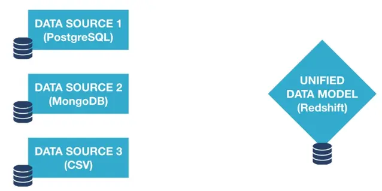


#### Example 

Marketing wants to know which customers to target. They need information from sales, stored in PostgreSQL, to see which customers can afford the new product. They also need information from the product department, stored in MongoDB to identify potential early adopters.

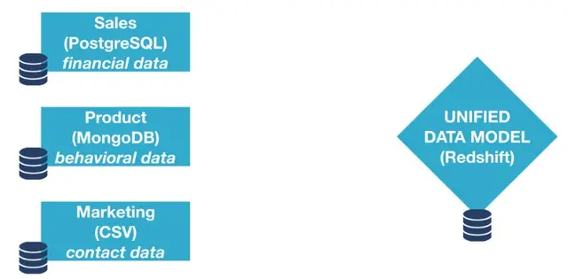

#### Update cadence - sales

Next, how often do you want to update the data? Updating daily would probably be sufficient for sales data.
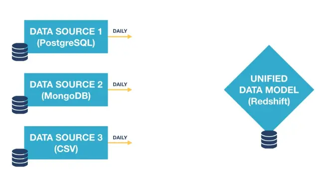


####  Update cadence - air traffic
For a scenario like air traffic, you want real time updates.
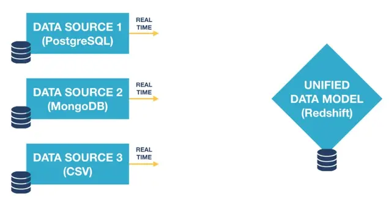


#### Different update cadences
Your data sources can have different update cadences.
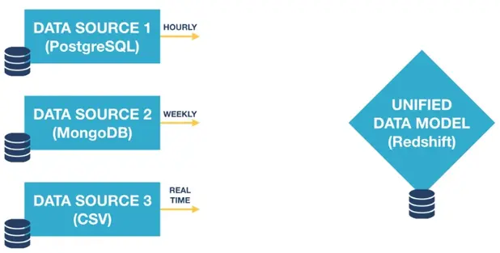

#### So simple?

So that’s it? You just plug your sources to the unified data model?
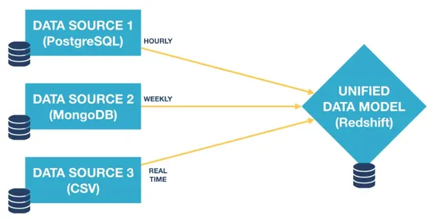


#### Not really
Not really. Your sources are in different formats, you need to make sure they can be assembled together.

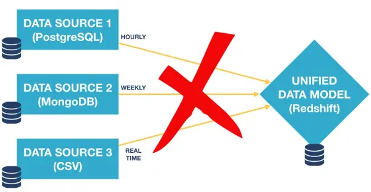

### Transformations

Enter transformations. A transformation is a program that extracts content from the table and transforms it into the chosen format for the unified model. These transformations can be hand-coded, but you would have to make and maintain a transformation for each data source.

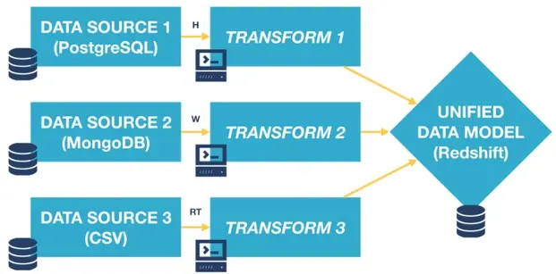

#### Transformation - tools
You can also use a data integration tool, which provides the needed ETL. For example Apache Airflow or Scriptella.

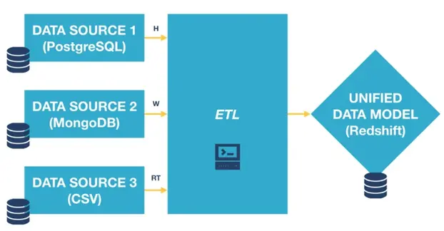

#### Choosing a Data Integration Tool

- Flexible

- Reliable

- Scalable

#### Automated testing and proactive alerts

You should have automated testing and proactive alerts. If any data gets corrupted on its way to the unified data model, the system lets you know. For example, you could aggregate sales data after each transformation and ensure that the total amount remains the same.

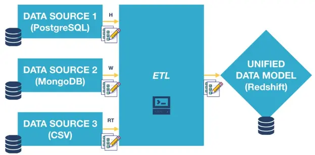

####  Security

Security is also a concern: if data access was originally restricted, it should remain restricted in the unified data model.

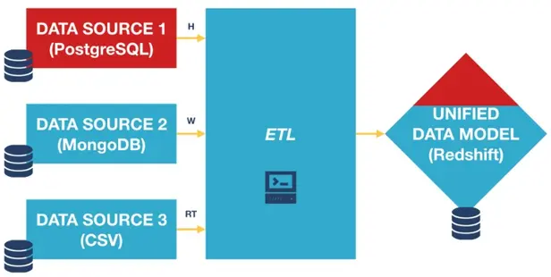

#### Security - credit card anonymization
For example, business analysts using the unified data model should not have access to the credit card numbers. You should anonymize the data during ETL so that analysts can only access the first four numbers, to identify the type of card being used.

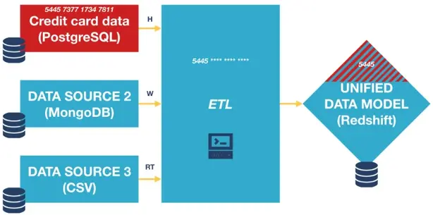

#### Data governance - lineage
For data governance purposes, you need to consider lineage: for effective auditing, you should know where the data originated and where it is used at all times.

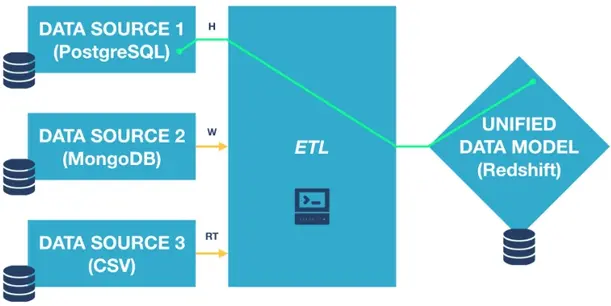

&nbsp;&nbsp;&nbsp;

&nbsp;&nbsp;&nbsp;

&nbsp;&nbsp;&nbsp;

&nbsp;&nbsp;&nbsp;

## Picking a Database Management System (DBMS)

### DBMS

DBMS stands for Database Management System. A DBMS is a system software for creating and maintaining databases. The DBMS manages three important aspects: the data, the database schema which defines the database’s logical structure, and the database engine that allows data to be accessed, locked and modified. Essentially, the DBMS serves as an interface between the database and end users or application programs.

- DBMS: DataBase Management System

- Create and maintain databases

  - Data

  - Database schema
  
  - Database engine
  
 - Interface between database and end users

 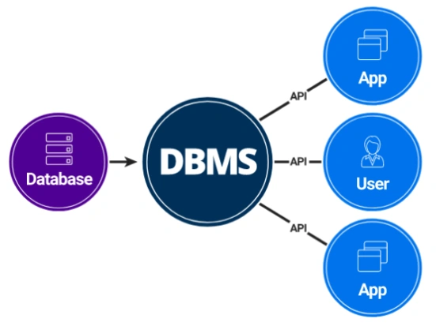

 #### SQL DBMS

A SQL DBMS, also called a Relational DataBase Management System, is a kind of DBMS based on the relational data model. This is what's been used in the course so far. RDBMSs typically employ SQL for managing and accessing data. Some examples of RDBMSs include SQL Server, PostgreSQL, and Oracle SQL. There are two reasons why you might consider an RDBMS. It's a good option when working with structured, unchanging data that will benefit from a predefined schema. Or if all data must be consistent without leaving room for error, such as with accounting systems for example.

- Relational DataBase Management System (RDBMS)

- Based on the relational model of data

- Query language: SQL

- Best option when:

  - Data is structured and unchanging

  - Data must be consistent

Microsoft SQL Server, PostgreSQL, Oracle..

&nbsp;&nbsp;&nbsp;

&nbsp;&nbsp;&nbsp;

#### NoSQL DBMS

Non-relational DBMSs are called NoSQL DBMSs. They’re much less structured than relational databases, and are document-centered, rather than table-centered. Data in NoSQL databases don’t have to fit into well-defined rows and columns. NoSQL is a good choice for those companies experiencing rapid data growth with no clear schema definitions. NoSQL offers much more flexibility than a SQL DBMS and is a solid option for companies who must analyze large quantities of data or manage data structures that vary. NoSQL DBMSs are generally classified as one of four types: key-value store, document store, columnar, or graph databases.

- Less structured

- Document-centered rather than table-centered

- Data doesn't have to fit into well-defined rows and columns

- Best option when:

  - Rapid growth

  - No clear schema definitions

  - Large quantities of data

- Types: key-value store, document store, columnar database, graph database

&nbsp;&nbsp;&nbsp;

&nbsp;&nbsp;&nbsp;

#### NoSQL DBMS - key-value store

A key-value database stores combinations of keys and values. The key serves as a unique identifier to retrieve an associated value. Values can be anything from simple objects, like integers or strings, to more complex objects, like JSON structures. They are most frequently used for managing session information in web applications. For example, managing shopping carts for online buyers. An example DBMS is Redis.

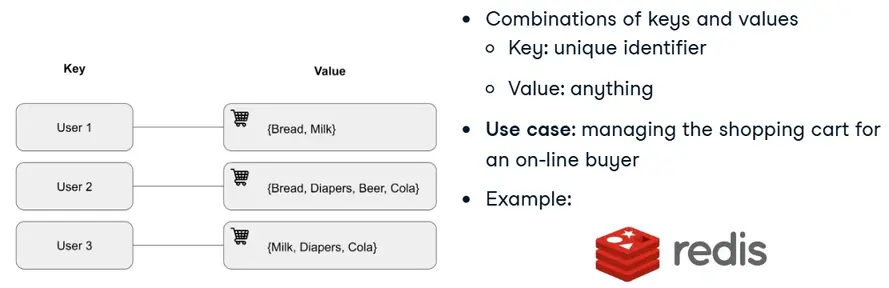

&nbsp;&nbsp;&nbsp;

#### NoSQL DBMS - document store

Document stores are similar to key-value in that they consist of keys, each corresponding to a value. The difference is that the stored values, referred to as documents, provide some structure and encoding of the managed data. That structure can be used to do more advanced queries on the data instead of just value retrieval. A document database is a great choice for content management applications such as blogs and video platforms. Each entity that the application tracks can be stored as a single document. An example of a document store DBMS is mongoDB.

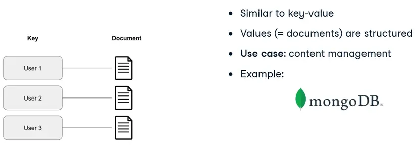

&nbsp;&nbsp;&nbsp;

#### NoSQL DBMS - columnar database

Rather than grouping columns together into tables, columnar databases store each column in a separate file in the system’s storage. This allows for databases that are more scalable, and faster at scale. Use a columnar database for big data analytics where speed is important. An example is Cassandra.

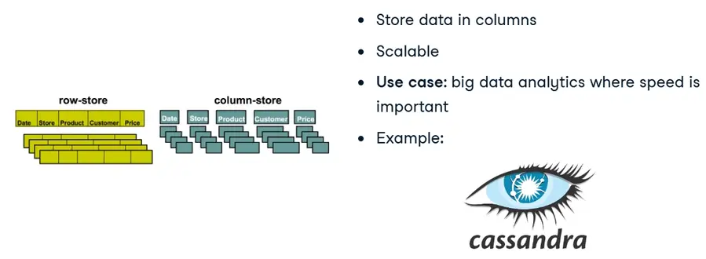


#### NoSQL DBMS - graph database

Here, the data is interconnected and best represented as a graph. This method is capable of lots of complexity. Graph databases are used by most social networks and pretty much any website that recommends anything based on your behavior. An example of a graph DBMS is Neo4j.

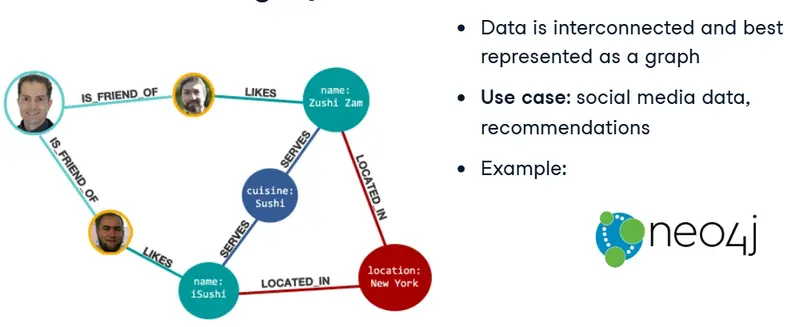


#### Choosing a DBMS

So, the choice of the database depends on the business need. If your application has a fixed structure and doesn’t need frequent modifications, a SQL DBMS is preferable. Conversely, if you have applications where data is changing frequently and growing rapidly, like in big data analytics, NoSQL is the best option for you.

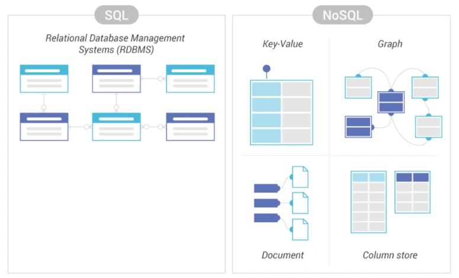

&nbsp;&nbsp;&nbsp;

&nbsp;&nbsp;&nbsp;

&nbsp;&nbsp;&nbsp;

&nbsp;&nbsp;&nbsp;

# Introduction to Relational Databases in SQL

## Introduction to relational databases

### Your first duty: Have a look at the PostgreSQL database

A relational database:

- real-life entities become tables

- reduced redundancy

- data integrity by relationships

- e.g. `professors`, `universities`, `companies`

- e.g. only one entry in `companies` for the bank "Credit Suisse"

- e.g. a `professor` can work at multiple `universities` and `companies`, a `company` can employ multiple `professors`

&nbsp;&nbsp;&nbsp;

&nbsp;&nbsp;&nbsp;

Your first duty: Have a look at the PostgreSQL database
```sql
SELECT table_schema, table_name
FROM information_schema.tables;
```
```
table_schema    |    table_name
----------------+--------------------
pg_catalog      | pg_statistic
pg_catalog      | pg_type
pg_catalog      | pg_policy
pg_catalog      | pg_authid
pg_catalog      | pg_shadow
public          | university_professors
pg_catalog      | pg_settings
...
```
&nbsp;&nbsp;&nbsp;

&nbsp;&nbsp;&nbsp;

Have a look at the columns of a certain table
```sql
SELECT table_name, column_name, data_type
FROM information_schema.columns
WHERE table_name = 'pg_config';
```
```
table_name | column_name | data_type
------------+-------------+-----------
pg_config  | name        | text
pg_config  | setting     | text
```
&nbsp;&nbsp;&nbsp;

&nbsp;&nbsp;&nbsp;

#### Query information_schema with SELECT

`information_schema` is a meta-database that holds information about your current database. `information_schema` has multiple tables you can query with the known `SELECT * FROM` syntax:

- `tables`: information about all tables in your current database

- `columns`: information about all columns in all of the tables in your current database
…
In this exercise, you'll only need information from the '`public`' schema, which is specified as the column `table_schema` of the `tables` and `columns` `tables`. The '`public`' schema holds information about user-defined tables and databases. The other types of `table_schema` hold system information – for this course, you're only interested in user-defined stuff.


Get information on all table names in the current database, while limiting your query to the '`public`' `table_schema`.
```sql
-- Query the right table in information_schema
SELECT table_name 
FROM information_schema.tables
-- Specify the correct table_schema value
WHERE table_schema = 'public';
```
Now have a look at the columns in `university_professors` by selecting all entries in `information_schema.columns` that correspond to that table.


```sql
-- Query the right table in information_schema to get columns
SELECT column_name, data_type 
FROM information_schema.columns
WHERE table_name = 'university_professors' AND table_schema = 'public';
```
&nbsp;&nbsp;&nbsp;

&nbsp;&nbsp;&nbsp;

&nbsp;&nbsp;&nbsp;

&nbsp;&nbsp;&nbsp;

### Tables: At the core of every database

#### Redundancy in the university_professors table

```sql
SELECT *
FROM university_professors
LIMIT 3;
```
```sql
-[ RECORD 1 ]----------+--------------------------------
firstname              | Karl
lastname               | Aberer
university             | ETH Lausanne
university_shortname   | EPF
university_city        | Lausanne
function               | Chairman of L3S Advisory Board
organization           | L3S Advisory Board
organization_sector    | Education & research
-[ RECORD 2 ]----------+---------------------------------
firstname              | Karl
lastname               | Aberer
university             | ETH Lausanne
university_shortname   | EPF
university_city        | Lausanne
function               | Member Conseil of Zeno-Karl Schindler Foundation
organization           | Zeno-Karl Schindler Foundation
organization_sector    | Education & research
-[ RECORD 3 ]----------+--------------------------------------------------
firstname              | Karl
lastname               | Aberer
(truncated)
function               | Member of Conseil Fondation IDIAP
organization           | Fondation IDIAP
(truncated)
```
&nbsp;&nbsp;&nbsp;

#### Currently: One "entity type" in the database

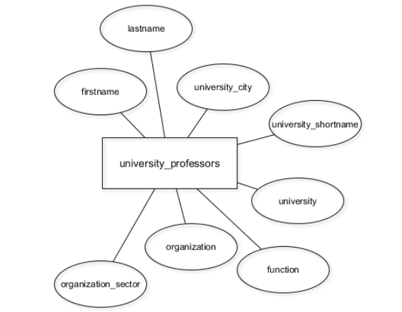

&nbsp;&nbsp;&nbsp;

#### A better database model with three entity types
```
Old structure:                       
┌───────────────────────┐
│ university_professors │
├───────────────────────┤
│ lastname              │
│ firstname             │
│ university_city       │
│ university_shortname  │
│ university            │
│ function              │
│ organization          │
│ organization_sector   │
└───────────────────────┘
New structure:
┌──────────────────────┐   ┌──────────────────────┐   ┌───────────────────────┐
│ professors           │   │ universities         │   │ organizations         │
├──────────────────────┤   ├──────────────────────┤   ├───────────────────────┤
│ lastname             │   │ university_shortname │   │ organization          │
│ firstname            │   | university_city      │   │ organizations_sector  │
│ university_shortname │   │ university           │   └───────────────────────┘
└──────────────────────┘   └──────────────────────┘
```
&nbsp;&nbsp;&nbsp;

#### A better database model with four entity types

```
┌──────────────────────┐  ┌──────────────────────┐   ┌──────────────────────┐   ┌───────────────────────┐
|  affiliations        |  │ professors           │   │ universities         │   │ organizations         │
├──────────────────────┤  ├──────────────────────┤   ├──────────────────────┤   ├───────────────────────┤
│ furstname            │  │ lastname             │   │ university_shortname │   │ organization          │
│ lastname             │  │ firstname            │   | university_city      │   │ organizations_sector  │
│ university_shortname │  │ university_shortname │   │ university           │   └───────────────────────┘
| function             |  └──────────────────────┘   └──────────────────────┘
| organization         |
└──────────────────────┘
```
&nbsp;&nbsp;&nbsp;

&nbsp;&nbsp;&nbsp;

**Create new tables with CREATE TABLE**
```sql
CREATE TABLE table_name (
    column_a data_type,
    column_b data_type,
    column_c data_type
);
```
&nbsp;&nbsp;&nbsp;

```sql
CREATE TABLE weather (
    clouds text,
    temperature numeric,
    weather_station char(5)
);
```
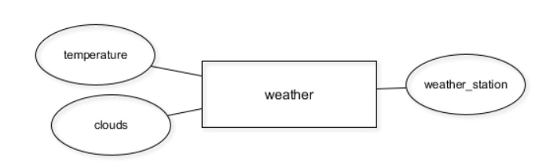

&nbsp;&nbsp;&nbsp;

&nbsp;&nbsp;&nbsp;

&nbsp;&nbsp;&nbsp;

***CREATE your first few TABLEs***
You'll now start implementing a better database model. For this, you'll create tables for the `professors` and `universities` entity types. The other tables will be created for you.

The syntax for creating simple tables is as follows:
```sql
CREATE TABLE table_name (
 column_a data_type,
 column_b data_type,
 column_c data_type
);
```
***Attention***: Table and columns names, as well as data types, don't need to be surrounded by quotation marks.

Create a table `professors` with two `text` columns: `firstname` and `lastname`.
```sql
-- Create a table for the professors entity type
CREATE TABLE professors (
 firstname text,
 lastname text
);

-- Print the contents of this table
SELECT * 
FROM professors
```
Create a table `universities` with three text columns: `university_shortname`, `university`, and `university_city`.
```sql
-- Create a table for the universities entity type
CREATE TABLE universities (
university_shortname TEXT,
university TEXT,
university_city TEXT
);

-- Print the contents of this table
SELECT * 
FROM universities
```
&nbsp;&nbsp;&nbsp;

&nbsp;&nbsp;&nbsp;

&nbsp;&nbsp;&nbsp;

**ADD a COLUMN with ALTER TABLE**
Oops! We forgot to add the `university_shortname` column to the `professors` table. You've probably already noticed


In chapter 4 of this course, you'll need this column for connecting the `professors` table with the `universities` table.

However, adding columns to existing tables is easy, especially if they're still empty.

To add columns you can use the following SQL query:
```sql
ALTER TABLE table_name
ADD COLUMN column_name data_type;
```
Alter `professors` to add the text column `university_shortname`.
```sql
-- Add the university_shortname column
ALTER TABLE professors
ADD COLUMN university_shortname TEXT;

-- Print the contents of this table
SELECT * 
FROM professors
```
&nbsp;&nbsp;&nbsp;

&nbsp;&nbsp;&nbsp;

&nbsp;&nbsp;&nbsp;

&nbsp;&nbsp;&nbsp;

### Update your database as the structure changes

**The current database model**

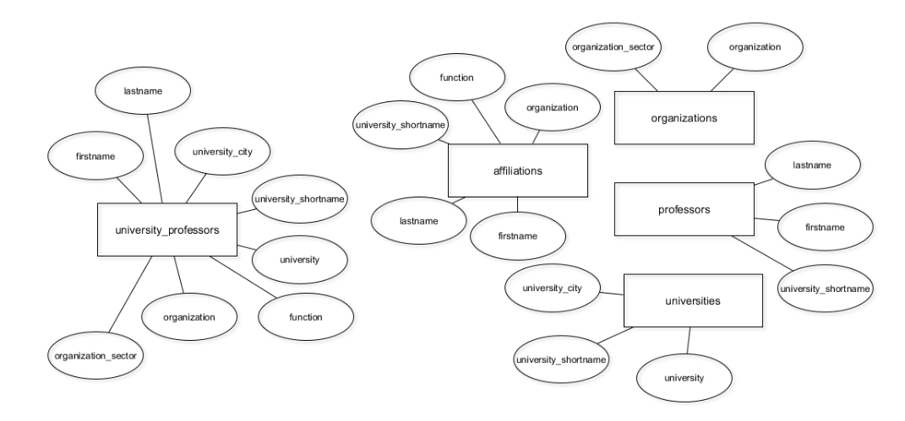

&nbsp;&nbsp;&nbsp;

&nbsp;&nbsp;&nbsp;

**Only store DISTINCT data in the new tables**

```sql
SELECT COUNT(*)
FROM university_professors;
```
```
count
-----
1377
```
&nbsp;&nbsp;&nbsp;


```sql
SELECT COUNT(DISTINCT organization)
FROM university_professors;
```
```
count
-----
1287
```
&nbsp;&nbsp;&nbsp;

&nbsp;&nbsp;&nbsp;

**INSERT DISTINCT records INTO the new tables**


```sql
INSERT INTO organizations
SELECT DISTINCT organization,
    organization_sector
FROM university_professors;
```
```
OUTPUT: INSERT 0 1287
```
&nbsp;&nbsp;&nbsp;

```sql
INSERT INTO organizations
SELECT organization,
    organization_sector
FROM university_professors;
```
```
OUTPUT: INSERT 0 1377
```
&nbsp;&nbsp;&nbsp;

&nbsp;&nbsp;&nbsp;

**The INSERT INTO statement**
```sql
INSERT INTO table_name (column_a, column_b)
VALUES ("value_a", "value_b");
```
&nbsp;&nbsp;&nbsp;

&nbsp;&nbsp;&nbsp;

**RENAME a COLUMN in affiliations**
```sql
CREATE TABLE affiliations (
    firstname text,
    lastname text,
    university_shortname text,
    function text,
    organisation text
);
```
```sql
ALTER TABLE table_name
RENAME COLUMN old_name TO new_name;
```
&nbsp;&nbsp;&nbsp;

&nbsp;&nbsp;&nbsp;

**DROP a COLUMN in affiliations** 
```sql
CREATE TABLE affiliations (
    firstname text,
    lastname text,
    university_shortname text,
    function text,
    organization text
);
```
```sql
ALTER TABLE table_name  
DROP COLUMN column_name;
```
&nbsp;&nbsp;&nbsp;

```sql
SELECT DISTINCT firstname, lastname,
    university_shortname
FROM university_professors
ORDER BY lastname;
```
```
-[ RECORD 1 ]--------+---------------
firstname            | Karl
lastname             | Aberer
university_shortname | EPF
-[ RECORD 2 ]--------+---------------
firstname            | Reza Shokrollah
lastname             | Abhari
university_shortname | ETH
-[ RECORD 3 ]--------+---------------
firstname            | Georges
lastname             | Abou Jaoudé
university_shortname | EPF
(truncated)

(551 records)
````

```sql
SELECT DISTINCT firstname, lastname
FROM university_professors
ORDER BY lastname;
```
```
-[ RECORD 1 ]---+------------
firstname       | Karl
lastname        | Aberer
-[ RECORD 2 ]---+------------
firstname       | Reza Shokrollah
lastname        | Abhari
-[ RECORD 3 ]---+
firstname       | Georges
lastname        | Abou Jaoudé
(truncated)

(551 records)
```
&nbsp;&nbsp;&nbsp;

**A professor is uniquely identified by firstname, lastname only**
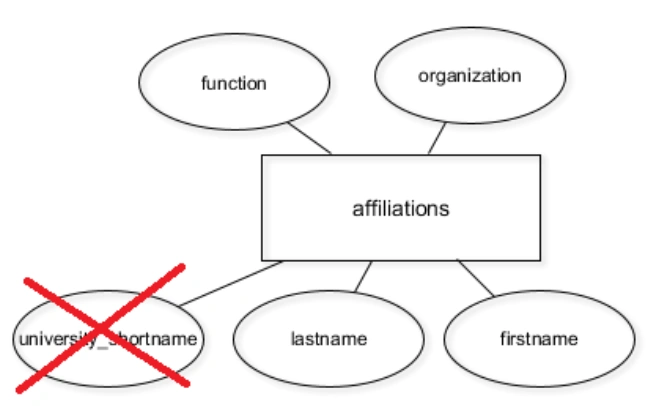

&nbsp;&nbsp;&nbsp;

&nbsp;&nbsp;&nbsp;

**RENAME and DROP COLUMNs in affiliations**

As mentioned in the video, the still empty affiliations table has some flaws. In this exercise, you'll correct them as outlined in the video.

You'll use the following queries:

- To rename columns:
```sql
ALTER TABLE table_name
RENAME COLUMN old_name TO new_name;
```

- To delete columns:
```sql
ALTER TABLE table_name
DROP COLUMN column_name;
```
- Rename the organisation column to `organization` in `affiliations`.
```sql
-- Rename the organisation column
ALTER TABLE affiliations
RENAME COLUMN organisation TO organization;
```
- Delete the `university_shortname` column in `affiliations`.
```sql
-- Rename the organisation column
ALTER TABLE affiliations
RENAME COLUMN organisation TO organization;

-- Delete the university_shortname column
ALTER TABLE affiliations
DROP COLUMN university_shortname;
```
&nbsp;&nbsp;&nbsp;

&nbsp;&nbsp;&nbsp;

**Migrate data with INSERT INTO SELECT DISTINCT**

Now it's finally time to migrate the data into the new tables. You'll use the following pattern:

```sql
INSERT INTO ... 
SELECT DISTINCT ... 
FROM ...;
```

It can be broken up into two parts:

***First*** part:

```
SELECT DISTINCT column_name1, column_name2, ... 
FROM table_a;
```
This selects all distinct values in table `table_a` – nothing new for you.

***Second*** part:
```sql
INSERT INTO table_b ...;
```
Take this part and append it to the first, so it inserts all distinct rows from `table_a` into `table_b`.

**One last thing**: It is important that you run all of the code at the same time once you have filled out the blanks.

- Insert all `DISTINCT` professors from `university_professors` into `professors`.
Print all the rows in `professors`.
```sql
-- Insert unique professors into the new table
INSERT INTO professors 
SELECT DISTINCT firstname, lastname, university_shortname 
FROM university_professors;

-- Doublecheck the contents of professors
SELECT * 
FROM professors;
```
- Insert all `DISTINCT` affiliations into `affiliations` from `university_professors`.
```sql
-- Insert unique professors into the new table
INSERT INTO professors 
SELECT DISTINCT firstname, lastname, university_shortname 
FROM university_professors;

-- Doublecheck the contents of professors
SELECT * 
FROM professors;
```
&nbsp;&nbsp;&nbsp;

&nbsp;&nbsp;&nbsp;

**Delete tables with DROP TABLE**

Obviously, the `university_professors` table is now no longer needed and can safely be deleted.

For table deletion, you can use the simple command:
```sql
DROP TABLE table_name;
```

- Delete the `university_professors` table.
```sql
-- Delete the university_professors table
DROP TABLE university_professors;
```
&nbsp;&nbsp;&nbsp;

&nbsp;&nbsp;&nbsp;

&nbsp;&nbsp;&nbsp;

&nbsp;&nbsp;&nbsp;


## Better data quality with constraints


**Why constraints?**

- Constraints give the data structure  

- Constraints help with consistency, and thus data quality  

- Data quality is a business advantage / data science prerequisite  

- Enforcing is difficult, but PostgreSQL helps

&nbsp;&nbsp;&nbsp;

&nbsp;&nbsp;&nbsp;

**Data types as attribute constraints**

| Name    | Aliases    | Description    |
|---------|------------|----------------|
| bigint    | int8    | signed eight-byte integer    |
| bigserial    | serial8    | autoincrementing eight-byte integer    |
| bit [ (n) ]   |    | fixed-length bit string    |
| bit varying [ (n) ]  | varbit [ (n) ] | variable-length bit string    |
| boolean    | bool    | logical Boolean (true/false)    |
| box    |    | rectangular box on a plane    |
| bytes    |    | binary data ("byte array")    |
| character [ (n) ]   | char [ (n) ] | fixed-length character string    |
| character varying [ (n) ] | varchar [ (n) ] | variable-length character string    |
| cidr    |    | IPv4 or IPv6 network address    |

From the PostgreSQL documentation.

&nbsp;&nbsp;&nbsp;

&nbsp;&nbsp;&nbsp;

**Dealing with data types (casting)**
```sql
CREATE TABLE weather (
    temperature integer,
    wind_speed text);

SELECT temperature * wind_speed AS wind_child
FROM weather;
```
```
operator does not exist: integer * text
HINT: No operator matches the given name and argument type(s).
You might need to add explicit type casts.
```
```sql
SELECT temperature * CAST(wind_speed AS integer) AS wind_child
FROM weather;
```

&nbsp;&nbsp;&nbsp;

&nbsp;&nbsp;&nbsp;

&nbsp;&nbsp;&nbsp;

**Conforming with data types**

For demonstration purposes, I created a fictional database table that only holds three records. The columns have the data types `date`, `integer`, and `text`, respectively.
```sql
CREATE TABLE transactions (
 transaction_date date, 
 amount integer,
 fee text
);
```

Have a look at the contents of the `transactions` table.

The `transaction_date` accepts `date` values. According to the PostgreSQL documentation, it accepts values in the form of `YYYY-MM-DD`, `DD/MM/YY`, and so forth.

Both columns `amount` and `fee` appear to be numeric, however, the latter is modeled as `text` – which you will account for in the next exercise.

***Instructions***

- Execute the given sample code.

- As it doesn't work, have a look at the error message and correct the statement accordingly – then execute it again.
```sql
-- Let's add a record to the table
INSERT INTO transactions (transaction_date, amount, fee) 
VALUES ('2018-09-24', '5454', '30');

-- Doublecheck the contents
SELECT *
FROM transactions;
```
&nbsp;&nbsp;&nbsp;

&nbsp;&nbsp;&nbsp;

&nbsp;&nbsp;&nbsp;

**Type CASTs**

In the video, you saw that type casts are a possible solution for data type issues. If you know that a certain column stores numbers as `text`, you can cast the column to a numeric form, i.e. to `integer`.

```sql
SELECT CAST(some_column AS integer)
FROM table;
```

Now, the `some_column` column is temporarily represented as `integer` instead of `text`, meaning that you can perform numeric calculations on the column.

***Instructions***
- Execute the given sample code.

- As it doesn't work, add an integer type cast at the right place and execute it again.


```sql
-- Calculate the net amount as amount + fee
SELECT transaction_date, amount + CAST(fee AS integer) net_amount 
FROM transactions;
```


&nbsp;&nbsp;&nbsp;

&nbsp;&nbsp;&nbsp;

&nbsp;&nbsp;&nbsp;

&nbsp;&nbsp;&nbsp;

## Working with data types

- Enforced on columns (i.e. attributes)

- Define the so-called "domain" of a column

- Define what operations are possible

- Enforce consistent storage of values

&nbsp;&nbsp;&nbsp;

&nbsp;&nbsp;&nbsp;

### The most common types

- `text` : character strings of any length

- `varchar [ (x) ]` : a maximum of `x` characters

- `char [ (x) ]` : a fixed-length string of `x` characters

- `boolean` : can only take three states, e.g. `TRUE` , `FALSE` and `NULL` (unknown)

- `date`, `time` and `timestamp` : various formats for date and time calculations

- `numeric` : arbitrary precision numbers, e.g. `3.1457`

- `integer` : whole numbers in the range of `-2147483648` and `+2147483647`

From the PostgreSQL documentation.

&nbsp;&nbsp;&nbsp;

&nbsp;&nbsp;&nbsp;

### Specifying types upon table creation

```sql
CREATE TABLE students (
ssn integer,
name varchar(64),
dob date,
average_grade numeric(3, 2), -- e.g. 5.54
tuition_paid boolean
); 
```
&nbsp;&nbsp;&nbsp;

&nbsp;&nbsp;&nbsp;

### Alter types after table creation

```sql
ALTER TABLE students
ALTER COLUMN name
TYPE varchar(128);
```
```sql
ALTER TABLE students
ALTER COLUMN average_grade
TYPE integer
-- Turns 5.54 into 6, not 5, before type conversion
USING ROUND(average_grade);
```
&nbsp;&nbsp;&nbsp;

&nbsp;&nbsp;&nbsp;

&nbsp;&nbsp;&nbsp;

&nbsp;&nbsp;&nbsp;

#### Change types with ALTER COLUMN

The syntax for changing the data type of a column is straightforward. The following code changes the data type of the `column_name` column in `table_name` to `varchar(10)`:
```sql
ALTER TABLE table_name
ALTER COLUMN column_name
TYPE varchar(10)
```
Now it's time to start adding constraints to your database.

Have a look at the distinct `university_shortname` values in the `professors` table and take note of the length of the strings.
```sql
-- Select the university_shortname column
SELECT DISTINCT(university_shortname) 
FROM professors;
```
Now specify a fixed-length character type with the correct length for `university_shortname`.
```sql
-- Specify the correct fixed-length character type
ALTER TABLE professors
ALTER COLUMN university_shortname
TYPE char(3);
```
Change the type of the `firstname` column to `varchar(64)`.
```sql
-- Change the type of firstname
ALTER TABLE professors
ALTER COLUMN firstname
TYPE varchar(64);
```
&nbsp;&nbsp;&nbsp;

&nbsp;&nbsp;&nbsp;

#### Convert types USING a function

If you don't want to reserve too much space for a certain `varchar` column, you can ***truncate*** the values before converting its type.

For this, you can use the following syntax:
```
ALTER TABLE table_name
ALTER COLUMN column_name
TYPE varchar(x)
USING SUBSTRING(column_name FROM 1 FOR x)

```
You should read it like this: Because you want to reserve only `x` characters for `column_name`, you have to retain a `SUBSTRING` of every value, i.e. the first `x` characters of it, and throw away the rest. This way, the values will fit the `varchar(x)` requirement.

Run the sample code as is and take note of the error.

Now use `SUBSTRING()` to reduce `firstname` to 16 characters so its type can be altered to `varchar(16)`.
```sql
-- Convert the values in firstname to a max. of 16 characters
ALTER TABLE professors 
ALTER COLUMN firstname 
TYPE varchar(16)
USING SUBSTRING(firstname FROM 1 FOR 16)
```
&nbsp;&nbsp;&nbsp;

&nbsp;&nbsp;&nbsp;

&nbsp;&nbsp;&nbsp;

&nbsp;&nbsp;&nbsp;

## The not-null and unique constraints

### The not-null constraint

- Disallow `NULL` values in a certain column

- Must hold true for the current state

- Must hold true for any future state


#### What does NULL mean?

- unknown

- does not exist

- does not apply

- ...

&nbsp;&nbsp;&nbsp;

&nbsp;&nbsp;&nbsp;

#### What does NULL mean? An example
```sql
CREATE TABLE students (
    ssn integer not null,
    lastname varchar(64) not null,
    home_phone integer,
    office_phone integer
);
```
```
NULL != NULL 
```
&nbsp;&nbsp;&nbsp;

&nbsp;&nbsp;&nbsp;


### How to add or remove a not-null constraint

When creating a table...
```sql
CREATE TABLE students (
    ssn integer **not null**,
    lastname varchar(64) **not null**,
    home_phone integer,
    office_phone integer
);
```

After the table has been created...
```sql
ALTER TABLE students  
ALTER COLUMN home_phone  
SET NOT NULL;
```
```sql
ALTER TABLE students  
ALTER COLUMN ssn  
DROP NOT NULL;
```
&nbsp;&nbsp;&nbsp;

&nbsp;&nbsp;&nbsp;

#### The unique constraint

- Disallow duplicate values in a column

- Must hold true for the current state

- Must hold true for any future state

#### Adding unique constraints
```sql
CREATE TABLE table_name (
    column_name UNIQUE
);
```
```sql
ALTER TABLE table_name
ADD CONSTRAINT some_name UNIQUE(column_name);
```
&nbsp;&nbsp;&nbsp;

&nbsp;&nbsp;&nbsp;

#### Disallow NULL values with SET NOT NULL

The `professors` table is almost ready now. However, it still allows for `NULL`s to be entered. Although some information might be missing about some professors, there's certainly columns that always need to be specified.

Add a not-null constraint for the `firstname` column.
```sql
-- Disallow NULL values in firstname
ALTER TABLE professors 
ALTER COLUMN firstname SET NOT NULL;
```
Add a not-null constraint for the `lastname` column.

```sql
-- Disallow NULL values in lastname
ALTER TABLE professors 
ALTER COLUMN lastname SET NOT NULL;
```

&nbsp;&nbsp;&nbsp;

&nbsp;&nbsp;&nbsp;

#### Make your columns UNIQUE with ADD CONSTRAINT

As seen in the video, you add the `UNIQUE` keyword after the `column_name` that should be unique. This, of course, only works for ***new*** tables:
```sql
CREATE TABLE table_name (
 column_name UNIQUE
);
```
If you want to add a unique constraint to an existing table, you do it like that:
```sql
ALTER TABLE table_name
ADD CONSTRAINT some_name UNIQUE(column_name);
```
Note that this is different from the `ALTER COLUMN` syntax for the not-null constraint. Also, you have to give the constraint a name `some_name`

- Add a unique constraint to the `university_shortname` column in `universities`. Give it the name `university_shortname_unq`.
```sql
-- Make universities.university_shortname unique
ALTER TABLE universities
ADD CONSTRAINT university_shortname_unq UNIQUE(university_shortname);
```

Add a unique constraint to the `organization` column in `organizations`. Give it the name `organization_unq`.
```sql
-- Make organizations.organization unique
ALTER TABLE organizations
ADD CONSTRAINT organization_unq UNIQUE(organization);
```

&nbsp;&nbsp;&nbsp;

&nbsp;&nbsp;&nbsp;

&nbsp;&nbsp;&nbsp;

&nbsp;&nbsp;&nbsp;

### Keys and superkeys


#### The current database model 

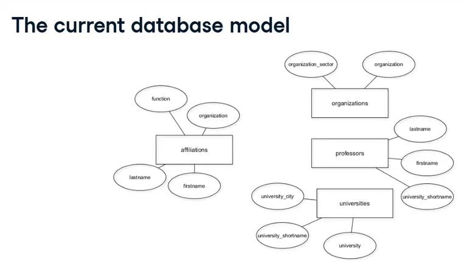

#### The database model with primary keys

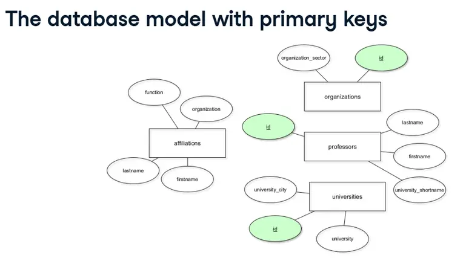

#### What is a key?

- Attribute(s) that identify a record uniquely  

- As long as attributes can be removed: **superkey**  

- If no more attributes can be removed: minimal superkey or **key**

&nbsp;&nbsp;&nbsp;

&nbsp;&nbsp;&nbsp;

```
License_no         | serial_no | make       | model   | year
-------------------|-----------|------------|---------|-----
Texas ABC-739      | A69352    | Ford       | Mustang | 2
Florida TVP-347    | B43696    | Oldsmobile | Cutlass | 5
New York MP0-22    | X83554    | Oldsmobile | Delta   | 1
California 432-TFY | C43742    | Mercedes   | 190-D   | 99
California RSK-629 | Y82935    | Toyota     | Camry   | 4
Texas RSK-629      | U028365   | Jaguar     | XJS     | 4
```
***SK = super key***

- SK1 = {license_no, serial_no, make, model, year}

- SK2 = {license_no, serial_no, make, model}

&nbsp;&nbsp;&nbsp;

&nbsp;&nbsp;&nbsp;

```
License_no         | serial_no | make       | model   | year
-------------------|-----------|------------|---------|-----
Texas ABC-739      | A69352    | Ford       | Mustang | 2
Florida TVP-347    | B43696    | Oldsmobile | Cutlass | 5
New York MP0-22    | X83554    | Oldsmobile | Delta   | 1
California 432-TFY | C43742    | Mercedes   | 190-D   | 99
California RSK-629 | Y82935    | Toyota     | Camry   | 4
Texas RSK-629      | U028365   | Jaguar     | XJS     | 4
```
K1 = {license_no}; K2 = {serial_no}; K3 = {model}; K4 = {make, year}

- K1 to 3 only consist of one attribute

- Removing either "make" or "year" from K4 would result in duplicates

- Only one candidate key can be the ***chosen key***

&nbsp;&nbsp;&nbsp;

&nbsp;&nbsp;&nbsp;


#### Get to know SELECT COUNT DISTINCT

Your database doesn't have any defined keys so far, and you don't know which columns or combinations of columns are suited as keys.

There's a simple way of finding out whether a certain column (or a combination) contains only unique values – and thus identifies the records in the table.

You already know the `SELECT DISTINCT` query from the first chapter. Now you just have to wrap everything within the `COUNT()` function and PostgreSQL will return the number of unique rows for the given columns:
```
SELECT COUNT(DISTINCT(column_a, column_b, ...))
FROM table;
```
First, find out the number of rows in `universities`.
```sql
-- Count the number of rows in universities
SELECT Count(*) 
FROM universities;
```
Then, find out how many unique values there are in the `university_city` column.
```sql
-- Count the number of distinct values in the university_city column
SELECT COUNT(DISTINCT(university_city)) 
FROM universities;
```
&nbsp;&nbsp;&nbsp;

&nbsp;&nbsp;&nbsp;


#### Identify keys with SELECT COUNT DISTINCT

There's a very basic way of finding out what qualifies for a key in an existing, populated table:

1.Count the distinct records for all possible combinations of columns. If the resulting number `x` equals the number of all rows in the table for a combination, you have discovered a superkey.

2.Then remove one column after another until you can no longer remove columns without seeing the number `x` decrease. If that is the case, you have discovered a (candidate) key.

The table `professors` has 551 rows. It has only one possible candidate key, which is a combination of two attributes. You might want to try different combinations using the "Run code" button. Once you have found the solution, you can submit your answer.


- Using the above steps, identify the ***candidate key*** by trying out different combination of columns.
```sql
-- Try out different combinations
SELECT COUNT(DISTINCT(firstname, lastname)) 
FROM professors;
```


### Primary keys

- One primary key per database table, chosen from candidate keys  

- Uniquely identifies records, e.g. for referencing in other tables  

- Unique and not-null constraints both apply  

- Primary keys are time-invariant: choose columns wisely!


#### Specifying primary keys
```
CREATE TABLE products (
    product_no integer UNIQUE NOT NULL,  
    name text,  
    price numeric  
);
```
```
CREATE TABLE products (
    product_no integer PRIMARY KEY,  
    name text,  
    price numeric  
);
```
```
CREATE TABLE example (
    a integer,
    b integer,
    c integer,
    PRIMARY KEY (a, c)
);
```
```
ALTER TABLE table_name  
ADD CONSTRAINT some_name PRIMARY KEY (column_name)
```