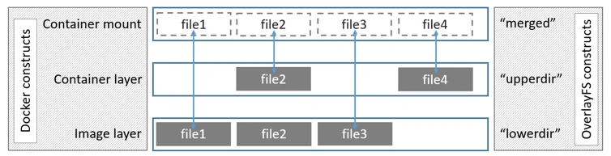

---
title: "Docker"
discription: docker 
date: 2023-09-03T21:29:01+08:00 
draft: false
type: post
tags: ["Linux, Container"]
showTableOfContents: true
--- 


## Install using the Apt repository


```bash
# Add Docker's official GPG key:
sudo apt-get update
sudo apt-get install ca-certificates curl gnupg
sudo install -m 0755 -d /etc/apt/keyrings
curl -fsSL https://download.docker.com/linux/ubuntu/gpg | sudo gpg --dearmor -o /etc/apt/keyrings/docker.gpg
sudo chmod a+r /etc/apt/keyrings/docker.gpg


# Add the repository to Apt sources:
echo \
  "deb [arch="$(dpkg --print-architecture)" signed-by=/etc/apt/keyrings/docker.gpg] https://download.docker.com/linux/ubuntu \
  "$(. /etc/os-release && echo "$VERSION_CODENAME")" stable" | \
  sudo tee /etc/apt/sources.list.d/docker.list > /dev/null
sudo apt-get update

```

## Simple commands

watch version
```
docker --version
```
for see if all ok
```
docker run hello-world
```
docker list
```
docker ps
```


```
docker run -d -p 80:80 docker/getting-started
```
`-d` run docker in detached mode
`-p` ports


`docker images` see all imgaes `-a` see all images and no running

`docker ps` see all containers `-a` see all containers and no running


### Delete Image

```
docker rmi -f <IMAGE ID>
```

### Stop and Delete all Containers

```
docker rm -f $(docker ps -a -q)
```

### Delete image
```
docker image rm <name_of_image>
```

### Login to hub.docker.com

```
docker login username <My_user> --password <your_password>
```

### Push to Repository

before need tag `IMAGE ID` 
```
docker push dan/dotnet
```

### Save image from image to archive

```
docker image -o busybox busybox:lates
```

### Import from archive

command import do new image from arhive with mew hash
```
docker image import -m "test" busybox
```

### load from archive

command load old image with old hash just as his is 

```
docker load -i busybox
```


### Save docker to tar

```
docker <CONTAINER_ID> > start.tar
```

### Load Container from tar

```
docker load < start.tar
```

### Tag Image

```
docker tag <IMAGE ID> ngnix:alpine 

```

### Enter in Docker

```
docker exec -it <CONTAINER_ID> sh
```
````
docker exec -it <CONTAINER_ID> /bin/bash/
````
```
docker run --rm -it --entrypoint /usr/bin/bash <Container_Name>
```

see version in container `cat /etc/os-release`


### Enter in Docker and Create File (one command)
```
docker exec <CONTAINER_ID> sh touch file.txt
```


### Enter in Docker and Watch processes

```
docker exec <CONTAINER_ID> ps -ef
```


### Rename Container

```
docker rename <CONTAINER ID> <YOUR_NAME> 
```
### Commit and Create New Container

```
docker container commit -m "add Your commit" <Name_of_your_container> <New_Name>
```

### Copy Files from Container 
```
docker cp <Container ID>:/file.txt .
```

### Copy Files in Container

```
docker cp busybox.txt <CONTANER ID>:/busybox.txt
```

### Monitoring Containers

```
docker container stats
```


### Docker port

```
docker port <CONTAINER_ID>
```

### Docker logs

command not be work if container be stop
```
docker logs <CONTAINER ID>
```

### Search images

```
docker search <name_of_image> 
```

### Download images for hub

```
docker pull <name_of_image>
```
### View details in image

```
docker image inspect <name_of_image>
```


## Mount and Volume

```
docker run it -v /home/dan/mount/:/mount ubuntu
```
command mount
```
docker run -it --mount type=bind,source=/home/dan/mount,destination=/mount ubuntu
```

### Create Volume
```
docker volume create --name myvolume
```
### Volume list

```
docker volume list
```

### Watch Details of Volume
```
docker volume inspect <Name_of_Volume>
```

### Mount Volume to Container

```
docker run -it --mount type=volume,source=<Name_of_Volume>,destination=/<Name_of_Volume> ubuntu
```
### Mount Temp Volume to Container

`--mount type=tmpfs,destination=/mount,tmpfs-size=1000` you can add fix disk space
```
docker run -it --mount type=tmpfs,destination=/mount ubuntu
```
or
```
docker run -it --tmpfs /mount ubuntu
```


## Network 

### watch all Network in Docker
```
docker network ls
```

### Create Network in Docker
```
docker network create -d bridge <Your_Name_Network>
```

### Attach Network to Container
```
docker run -it --network=<Your_Name_Network> <Name_of_Container>
```

### Attach Network to Running Container
```
Docker network connect none <Name_of_Container>
```
for disconnect 
```
docker network disconnect <Name_of_Container>
```

### Forward Ports from Host to Docker

```
docker run -d -p 2000:80 ngnix
```
first port Host second Container 


## Context 


### List Context

```
docker context ls
```

### Create context 
```
docker context create test-test --default-stack-orchestrator=swarm --docker host=unix:///var/run/docker.sock
```

### View in Context
```
docker context inspect test-test
```

### Export Context

```
docker context export test-test
```

### Import Context

```
docker context import test-test test-test.dockercontext
```
### Switch between Context

`*` - your context used now
```
docker use <Name_of_Context>
```


## Dockerfile

```
|Dockerfile| =Build==> |Docker Image| =Run==> |Docker Container| 
```
```
FROM > RUN > ENTRYPOINT > CMD
```
!! CONTEINER WORK IF PID 1 WORK !!

COPY OR ADD = COPY !

```
FROM ubuntu
RUN apt update && apt install iputils-ping
COPY docker-entrypoint.sh /docker-entrypoint.sh
ENTRYPOINT ["ping"]
CMD ["127.0.0.1"]
```

all be copy in `/var/www`
```
WORKDIR /var/www
COPY file1 file2
```

```
EXPOSE <port> [<port>/<protocol>...]
EXPOSE 80
EXPOSE 80/tcp
```


build from archive to docker
```
FROM ubuntu
ENV NODE_VERSION=v16.8.0
ENV NODE_DISTRO=linux-x64
RUN apt update && apt install curl -xz-utils
WORKDIR /tmp
RUN curl https://nodejs.org/dist/$NODE_VERSION/node-$NODE_VERSION-$NODE_DISTRO.tar.xz -o node-$NODE_VERSION-$NODE_DISTRO.tar.xz
RUN mkdir -p /usr/local/lib/nodejs && tar -xJvf node-$NODE_VERSION-$NODE_DISTRO.tar.xz -C /usr/local/lib/nodejs
RUN ln -s /usr/local/lib/nodejs/node-$NODE_VERSION-$NODE_DISTRO/bin/node /usr/bin/node && \
    ln -s /usr/local/lib/nodejs/node-$NODE_VERSION-$NODE_DISTRO/bin/npm /usr/bin/npm && \
    ln -s /usr/local/lib/nodejs/node-$NODE_VERSION-$NODE_DISTRO/bin/npx /usr/bin/npx && \
    node -v && npm version && npx -v
RUN npx create-react-app my-app
WORKDIR /tmp/my-app
EXPOSE 3000
ENTRYPOINT ["npm", "start"]
```


### Docker Builder

from .dockerfile
```
docker build .
```
from file
```
docker build -t <Name_of_NEW_Image> -f <Name_of_Dockerfile>
```
 
### OverlayFS and Overlay2




### Docker Trust

```
docker trust key generate
```


### Docker Registry

its docker hub but local

```
docker run -d p 6666:6666 --name local_registry registry:2
```

push to registry
```
docker tag test:boi localhost:5000/testboi

docker push local:5000/test_boi
```

pull from registry
```
docker pull local:5000/test_boi
```

redhut query or harbor


## DockerD

```
cat daemon.json 
```
```
{
  "debug":true
}
```
```
journalctl -xu docker.service
```
### Change driver for docker `daemon.json`
```
{
  "storage-driver":"aufs"
}
```


## Docker-Compose

to add docker rootgroup
```
sudo usermod -aG docker administrator
```
Test 
```
docker run -d  --name ng1 -p 8080:80
```

### See logs 
```
docker logs -f ng1
```

### Create Root folder
```
sudo mkdir /opt/nginx-compose-example 
sudo chown $USER. /opt/nginx-compose-example 
```

### Example Compose file 

```
service:
  ng1:
    image: ngnix
    port: 
      - "8080:80"
```

### Run Docker-Compose 
```
docker-compose up
```
to stop `down`


### Compose. Profile

example:
```
services:
  foo:
    image: foo
  bar:
    image: bar
    depends_on:
      - bar
    profiles:
      - test
  baz:
    images: baz
    depends_on:
      - bar
    profiles:
      - test
  zot:
     image: zot
     depends_on:
       - bar
     profile:
       - debug
```
```
$ docker compose --profile test up
$ COMPOSE_PROFILES=test docker compose up
$
$ docker compose --profile test  --profile debug up
$ COMPOSE_PROFILES=test, debug docker compose up
$
$ # profile test activated
$ docker compose up baz
$ 
$ # profle test and service bar
$ docker compose up baz
$ 
$ # invalid model
$ docker compose up zot
$
$ zor bar and baz activated
$ docker compose --profile test up zot
```

### Compose. Environment

Map syntex:
```
environment:
  RACK_ENV: development
  SHOW: "true"
  USER_INPUT:  
```
Array syntex:
```
environment:
  - RACK_ENV: development
  - SHOW=true
  - USER_INPUT
``` 
### Compose. File .env


```
$ head .env
##### NGNIX ##################

NGNIX_SSL_PATH=./ngnix/ssl/
###### TO-DO APP CONFIG ##############
NGNIX_TODO_HOST_HTTP_PORT=8081
NGNIX_TODO_HOST_HTTPS_PORT=8081
NGNIX_TODO_SITE_PATH=./ngnix/sites/todo.conf
NGNIX_TODO_HOST_LOG_PATH=./../logs/ngnix_todo
APP_CODE_TODO_PATH_HOST=./../todo
APP_CODE_TODO_PATH_CONTAINER=/var/www/todo

$ head docker-compose.yml
version: '2'

service: 
  env_file .env
  nginx_todo:
    build:
      context: ./ngnix
    volumes:
      - ${APP_CODE_TODO_PATH_HOST}:${APP_CODE_TODO_PATH_CONTAINER}
      - ${NGNIX_TODO_HOST_LOG_PATH}:/var/log/ngnix
      - ${NGNIX_TODO_SITE_PATH}:/etc/ngnix/site-available/todo.conf

```

### Compose. Ntwork 

```
services:
  frontend:
    image: awesome/webapp
    network:
      - front-tier
      - back-tier

networks:
  front-tier:
  back-tier:
```
```
network
  outside:
    external: true
```

### Compose. Secrets
```
services:
  frontend:
  image: awesome/webapp
  sercets:
    - server-certificate
secrets:
  server-certificate:
    file: ./server.cert
```

### Compose. Healtchecks
```
test: ["CMD","curl", "-f" "http://localhost"]
interval: 1m30s
timeout: 1m30s
retries: 3
start_period: 40s 
```

### Compose. Volumes

```
services:
  ng1:
    images: ngnix
    volumes:
      - type: bind
        source: /tmp
        target: /tmp/ng1_tmp
  ng2:
    image: nginx
    volumes:
      - type: bind
        source: /tmp
        target: /tmp/ng2_tmp
```

### Compose. Full Example
```
version "3.1"

services:
  reverse_proxy:
    build: ./reverse_proxy
     user: ngnix
    ports: 
      - "433:433"
  networks:
    - front-tier
  secrets:
    - revprox_cert
    - revprox_key

database:
  build: 
    context: ./database
  image: atsea_db
  user: postgres
  environment:
    POSTGRES_USER: dordonuser
    POSTGRES_PASSWORD_FILE: /run/secrets/postgres_password
    POSTGRES_DB: atsea
  ports:
    - "5432:5432"
  network:
    - back-tier
  secrets:
    - postgres_password
  

  appserver:
    build:
      context: app
      dockerfile: Dockerfile
    image: atsea_app
    user: gordon
    ports:
      - "8080:8080"
      - "5005:5005"
  networks:
    - front-tier
    - back-tier
  secrets:
    - postgres_password

networks:
  front-tier:
  back-tier:
  payment:
#     driver: overlay

secrets:
  postgres_password:
    file: ./debsecrets/postgres_password
  payment_token:
    file: ./devsecrets/payment_token
  revprox_cert:
    file: ./certs/domain.crt
  revprox_key:
    file: ./certs/domain.key
```


```


## Docker Swarm

do add to group root user docker
```
sudo usermod -aG docker administrator
```

to change name 
```
nano /etc/hostname
```


to create master node
```
docker swarm init
```
Docker Node List
```
docker node ls
```

after create master сreated link copy past to other machine to add workernode master
```
docker swarm join --tokern <Token> <IP>:<Port>
```

for other docker node pull containers need local repository
```
docker service create --name registry --publish publish=5000,target=5000 registry:2
```

for tag image
```
docker tag sw1 192.168.88.113:5000/sw1
```

For push to local repository
```
docker image push 192.168.88.113:5000/sw1
```

### For disable SSL Cetificates in local repository
```bash
sudo nano /etc/docker/daemon.json
```
```bash
{"insecure-registries": ["192.168.88.113:5000"]} 
```
After in need restart docker daemon and push image 
```
sudo systemctl restart docker 
```

to run docker swarm container 
```
docker service create --replicas 1 --publish 8000:8000 --name sw1 192.168.88.113/sw1
```

This command lists services are running in the swarm
```
docker service ls
```
Lists the tasks that are running as part of the specified services. 
```
docker service ps sw1 
```
### To Scale containers

```
docker service scale SERVICE=REPLICAS
docker service scale sw1=4
```

### for update containers 
```
docker service update --image 192.168.88.113/sw1 sw1
```

### to remove all service
```
docker service rm sw1
```

### Like docker-compose for docker swarm (stack.yml)

file `stack.yml` 

for example:
```
version: "3.9"
services:
  web:
    image: 192.168.88.113:5000/sw1
    ports:
      - "8000:8000"
    network:
      - "back-tier"
    deploy:
      mode: replicated
      replicas: 2
  redis:
    images: redis:alphane
    network:
      - back-tier
networks:
  back-tier:
    driver: overlay
```

```
docker stack deploy --compose-file stack.yml sw1 
```
to stop all 

```
docker stack rm sw1
```

## Docker Network

for connect to network 
```
docker network connect <my-net> my-ngnix
```
for disconnect
```
docker network connect <my-net> my-ngnix
```

### Overlay

create `overlay` lan for use with service Swarm 
```
docker network create -d overlay my-overlay
```

To create an overlay network which can be used by swarm services or standalone containers to communicate with other standalone containers running on other Docker daemons, add the `--attachable`  flag:
```
docker network create -d overlay --attachable my-attachable-overlay
```
You can use the overlay network feature with both `--opt encrypted --attachable`  and attach unmanaged containers to that network:
```
docker network create -d --opt encrypted --driver overlay --attachable my-attachable-multi-host-network
```
```

```
### MacVlan

To create a `macvlan` network which bridges with a given physical network interface, use `--driver macvlan`  with the docker network create command. You also need to specify the parent, which is the interface the traffic will physically go through on the Docker host.
```
$ docker network create -d macvlan \
  --subnet=172.16.86.0/24 \
  --gateway=172.16.86.1 \
  -o parent=eth0 pub_net
```

**Bridge mode**

If you need to exclude IP addresses from being used in the `macvlan`  network, such as when a given IP address is already in use, use `--aux-addresses`:
```
$ docker network create -d macvlan \
  --subnet=192.168.32.0/24 \
  --ip-range=192.168.32.128/25 \
  --gateway=192.168.32.254 \
  --aux-address="my-router=192.168.32.129" \
  -o parent=eth0 macnet32
```

**802.1Q trunk bridge mode**

If you specify a parent interface name with a dot included, such as eth0.50, Docker interprets that as a sub-interface of `eth0` and creates the sub-interface automatically.

```
$ docker network create -d macvlan \
    --subnet=192.168.50.0/24 \
    --gateway=192.168.50.1 \
    -o parent=eth0.50 macvlan50
```

**Use an IPvlan instead of Macvlan**

In the above example, you are still using a L3 bridge. You can use ipvlan instead, and get an L2 bridge. Specify `-o ipvlan_mode=l2` .
```
$ docker network create -d ipvlan \
    --subnet=192.168.210.0/24 \
    --subnet=192.168.212.0/24 \
    --gateway=192.168.210.254 \
    --gateway=192.168.212.254 \
     -o ipvlan_mode=l2 -o parent=eth0 ipvlan210
```

**Use IPv6**

If you have configured the Docker daemon to allow IPv6, you can use dual-stack IPv4/IPv6 macvlan networks.
```
$ docker network create -d macvlan \
    --subnet=192.168.216.0/24 --subnet=192.168.218.0/24 \
    --gateway=192.168.216.1 --gateway=192.168.218.1 \
    --subnet=2001:db8:abc8::/64 --gateway=2001:db8:abc8::10 \
     -o parent=eth0.218 \
     -o macvlan_mode=bridge macvlan216
```