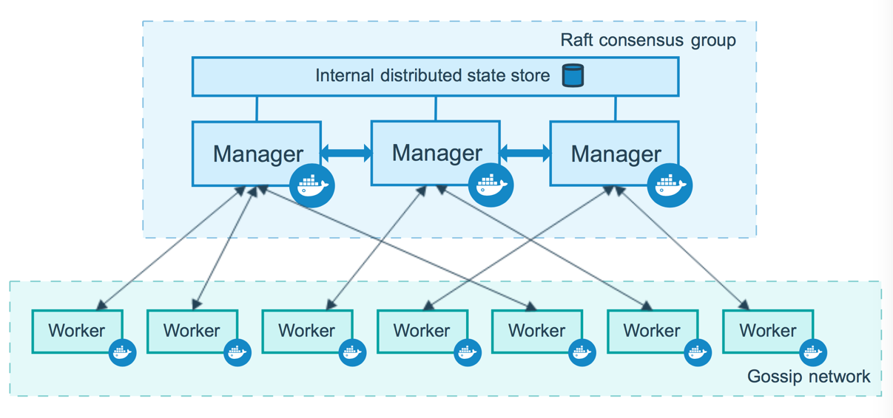
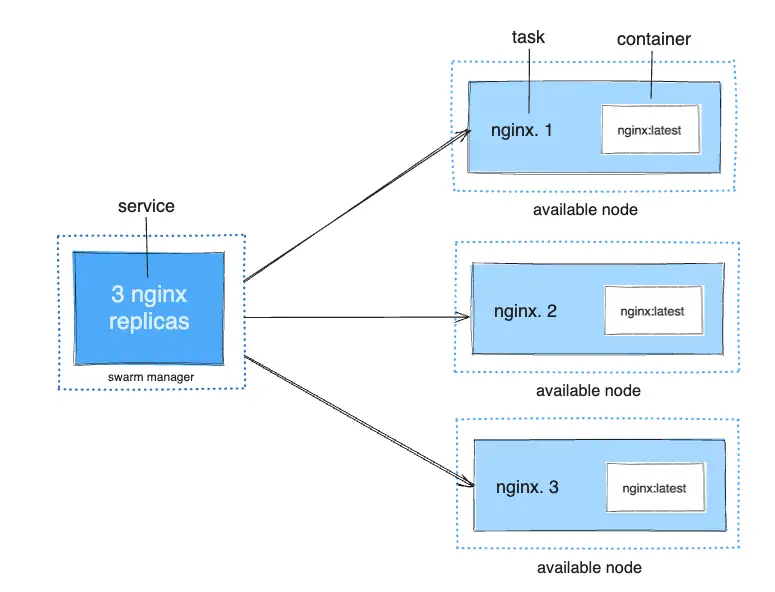

to add docker rootgroup
```
sudo usermod -aG docker administrator
```
Test 
```
docker run -d  --name ng1 -p 8080:80
```

### See logs 
```
docker logs -f ng1
```

### Create Root folder
```
sudo mkdir /opt/nginx-compose-example 
sudo chown $USER. /opt/nginx-compose-example 
```

### Example Compose file 

```
service:
  ng1:
    image: nginx
    port: 
      - "8080:80"
```

### Run Docker-Compose 

```bash
docker-compose up
```
to stop `down`

logs service
```bash
docker-compose logs -f [sevice name]
```
list of running container
```bash
docker-compose ps 
```
list of docker images used docker-compose
```bash
docker-compose images
```
running service command
```bash
docker-compose exec [service name] [command]
```

### Compose. Profile

example:
```
services:
  foo:
    image: foo
  bar:
    image: bar
    depends_on:
      - bar
    profiles:
      - test
  baz:
    images: baz
    depends_on:
      - bar
    profiles:
      - test
  zot:
     image: zot
     depends_on:
       - bar
     profile:
       - debug
```
```
$ docker compose --profile test up
$ COMPOSE_PROFILES=test docker compose up
$
$ docker compose --profile test  --profile debug up
$ COMPOSE_PROFILES=test, debug docker compose up
$
$ # profile test activated
$ docker compose up baz
$ 
$ # profle test and service bar
$ docker compose up baz
$ 
$ # invalid model
$ docker compose up zot
$
$ zor bar and baz activated
$ docker compose --profile test up zot
```

### Compose. Environment

Map syntex:
```
environment:
  RACK_ENV: development
  SHOW: "true"
  USER_INPUT:  
```
Array syntex:
```
environment:
  - RACK_ENV: development
  - SHOW=true
  - USER_INPUT
``` 
### Compose. File .env


```
$ head .env
##### NGiNX ##################

NGINX_SSL_PATH=./nginx/ssl/
###### TO-DO APP CONFIG ##############
NGINX_TODO_HOST_HTTP_PORT=8081
NGINX_TODO_HOST_HTTPS_PORT=8081
NGINX_TODO_SITE_PATH=./nginx/sites/todo.conf
NGINX_TODO_HOST_LOG_PATH=./../logs/nginx_todo
APP_CODE_TODO_PATH_HOST=./../todo
APP_CODE_TODO_PATH_CONTAINER=/var/www/todo

$ head docker-compose.yml
version: '2'

service: 
  env_file .env
  nginx_todo:
    build:
      context: ./nginx
    volumes:
      - ${APP_CODE_TODO_PATH_HOST}:${APP_CODE_TODO_PATH_CONTAINER}
      - ${NGINX_TODO_HOST_LOG_PATH}:/var/log/nginx
      - ${NGINX_TODO_SITE_PATH}:/etc/nginx/site-available/todo.conf

```

### Compose. Nеtwork 

```
services:
  frontend:
    image: awesome/webapp
    network:
      - front-tier
      - back-tier

networks:
  front-tier:
  back-tier:
```
```
network
  outside:
    external: true
```

### Compose. Secrets
```
services:
  frontend:
  image: awesome/webapp
  sercets:
    - server-certificate
secrets:
  server-certificate:
    file: ./server.cert
```

### Compose. Healtchecks
```
test: ["CMD","curl", "-f" "http://localhost"]
interval: 1m30s
timeout: 1m30s
retries: 3
start_period: 40s 
```

### Compose. Volumes

```
services:
  ng1:
    images: nginx
    volumes:
      - type: bind
        source: /tmp
        target: /tmp/ng1_tmp
  ng2:
    image: nginx
    volumes:
      - type: bind
        source: /tmp
        target: /tmp/ng2_tmp
```

### Compose. Full Example
```
version "3.1"

services:
  reverse_proxy:
    build: ./reverse_proxy
     user: nginx
    ports: 
      - "433:433"
  networks:
    - front-tier
  secrets:
    - revprox_cert
    - revprox_key

database:
  build: 
    context: ./database
  image: atsea_db
  user: postgres
  environment:
    POSTGRES_USER: dordonuser
    POSTGRES_PASSWORD_FILE: /run/secrets/postgres_password
    POSTGRES_DB: atsea
  ports:
    - "5432:5432"
  network:
    - back-tier
  secrets:
    - postgres_password
  

  appserver:
    build:
      context: app
      dockerfile: Dockerfile
    image: atsea_app
    user: gordon
    ports:
      - "8080:8080"
      - "5005:5005"
  networks:
    - front-tier
    - back-tier
  secrets:
    - postgres_password

networks:
  front-tier:
  back-tier:
  payment:
#     driver: overlay

secrets:
  postgres_password:
    file: ./debsecrets/postgres_password
  payment_token:
    file: ./devsecrets/payment_token
  revprox_cert:
    file: ./certs/domain.crt
  revprox_key:
    file: ./certs/domain.key
```


## Docker Swarm

min need 2 node



Services, tasks, and containers
When you deploy the service to the swarm, the swarm manager accepts your service definition as the desired state for the service. Then it schedules the service on nodes in the swarm as one or more replica tasks. The tasks run independently of each other on nodes in the swarm.

For example, imagine you want to load balance between three instances of an HTTP listener. The diagram below shows an HTTP listener service with three replicas. Each of the three instances of the listener is a task in the swarm.




### Docker Swarm Stack

example:
```yml
version: 'v3'

services: 
  application:
     depends_on:
      - postgresql
     restart: always
     image: docker.example.com/tcpserver
     ports:
      - "127.0.0.1:8080:8080"
    deploy:
      mode: replicated
      replicas: 2

  postqresql:
      image: postgress
      environment:
         POSTGRES_USER: dan
         POSTGRES_PASSWORD: strongpass
         POSTGRES_DB: test
      ports:
       - "127.0.0.1:5432:5432"
      volumes:
       - ./postgresql_data:/var/lib/postgresql/data
      deploy:
        mode: replicated
        replicas: 2
```
```bash
docker stack deploy -c docker-compose.yml --with-registry-auth application 
```


do add to group root user docker
```bash
sudo usermod -aG docker administrator
```

to change name 
```bash
nano /etc/hostname
```


to create master node, key `--advertise-addr` `192.168.0.1`

```bash
docker swarm init
```
after Create Master сreated link copy past to other machine to add Worker or Manager
```
docker swarm join --tokern <Token> <IP>:<Port>
```

Docker Node List
```
docker node ls
```

add replication to hosts
```bash
docker update --replicas 5 [image:latest]
```
remove services
```bash
docker service rm tcpserver
```


for other docker node pull containers need local repository
```
docker service create --name registry --publish publish=5000,target=5000 registry:2
```

for tag image
```
docker tag sw1 192.168.88.113:5000/sw1
```

For push to local repository
```
docker image push 192.168.88.113:5000/sw1
```

### For disable SSL Cetificates in local repository
```bash
sudo nano /etc/docker/daemon.json
```
```bash
{"insecure-registries": ["192.168.88.113:5000"]} 
```
After in need restart docker daemon and push image 
```bash
sudo systemctl restart docker 
```

to run docker swarm container 
```bash
docker service create --replicas 1 --publish 8000:8000 --name sw1 192.168.88.113/sw1
```

This command lists services are running in the swarm
```bash
docker service ls
```
Lists the tasks that are running as part of the specified services. 
```bash
docker service ps sw1 
```
### To Scale containers

```bash
docker service scale SERVICE=REPLICAS
docker service scale sw1=4
```

### for update containers 
```bash
docker service update --image 192.168.88.113/sw1 sw1
```

### to remove all service
```bash
docker service rm sw1
```

### Like docker-compose for docker swarm (stack.yml)

file `stack.yml` 

for example:
```bash
version: "3.9"
services:
  web:
    image: 192.168.88.113:5000/sw1
    ports:
      - "8000:8000"
    network:
      - "back-tier"
    deploy:
      mode: replicated
      replicas: 2
  redis:
    images: redis:alphane
    network:
      - back-tier
networks:
  back-tier:
    driver: overlay
```

```
docker stack deploy --compose-file stack.yml sw1 
```
to stop all 

```
docker stack rm sw1
```

## Docker Network

for connect to network 
```
docker network connect <my-net> my-nginx
```
for disconnect
```
docker network connect <my-net> my-nginx
```

### Overlay

create `overlay` lan for use with service Swarm 
```
docker network create -d overlay my-overlay
```

To create an overlay network which can be used by swarm services or standalone containers to communicate with other standalone containers running on other Docker daemons, add the `--attachable`  flag:
```
docker network create -d overlay --attachable my-attachable-overlay
```
You can use the overlay network feature with both `--opt encrypted --attachable`  and attach unmanaged containers to that network:
```
docker network create -d --opt encrypted --driver overlay --attachable my-attachable-multi-host-network
```
```

```
### MacVlan

To create a `macvlan` network which bridges with a given physical network interface, use `--driver macvlan`  with the docker network create command. You also need to specify the parent, which is the interface the traffic will physically go through on the Docker host.
```
$ docker network create -d macvlan \
  --subnet=172.16.86.0/24 \
  --gateway=172.16.86.1 \
  -o parent=eth0 pub_net
```

**Bridge mode**

If you need to exclude IP addresses from being used in the `macvlan`  network, such as when a given IP address is already in use, use `--aux-addresses`:
```
$ docker network create -d macvlan \
  --subnet=192.168.32.0/24 \
  --ip-range=192.168.32.128/25 \
  --gateway=192.168.32.254 \
  --aux-address="my-router=192.168.32.129" \
  -o parent=eth0 macnet32
```

**802.1Q trunk bridge mode**

If you specify a parent interface name with a dot included, such as eth0.50, Docker interprets that as a sub-interface of `eth0` and creates the sub-interface automatically.

```
$ docker network create -d macvlan \
    --subnet=192.168.50.0/24 \
    --gateway=192.168.50.1 \
    -o parent=eth0.50 macvlan50
```

**Use an IPvlan instead of Macvlan**

In the above example, you are still using a L3 bridge. You can use ipvlan instead, and get an L2 bridge. Specify `-o ipvlan_mode=l2` .
```
$ docker network create -d ipvlan \
    --subnet=192.168.210.0/24 \
    --subnet=192.168.212.0/24 \
    --gateway=192.168.210.254 \
    --gateway=192.168.212.254 \
     -o ipvlan_mode=l2 -o parent=eth0 ipvlan210
```

**Use IPv6**

If you have configured the Docker daemon to allow IPv6, you can use dual-stack IPv4/IPv6 macvlan networks.
```
$ docker network create -d macvlan \
    --subnet=192.168.216.0/24 --subnet=192.168.218.0/24 \
    --gateway=192.168.216.1 --gateway=192.168.218.1 \
    --subnet=2001:db8:abc8::/64 --gateway=2001:db8:abc8::10 \
     -o parent=eth0.218 \
     -o macvlan_mode=bridge macvlan216
```


Generate SSL certificat for docker

```bash
mkdir ssl

cd ssl
```

```bash
nano /etc/ssl/openssl.cnf
```

add ip your IP
```bash
[ v3_ca ] 

subjectAltName = IP:85.41.11.8
```

generate ssl key

```bash
openssl req -x509  -nodes -days 365 -newkey rsa:2048 -keyout selfsigned.key -out selfsigned.crt
```

```bash
openssl dhparam -out dhparam.pem  2048
```

mkdir site-available

```conf
  server {
    # listen 443 default deferred; # for Linux
    # listen 443 default accept_filter=httpready; # for FreeBSD
    listen 443 http2; # for OSX
    server_name docker.example.com;
    client_max_body_size 4G;
    
    access_log /var/log/nginx/docker.example.com.access.log;
    error_log /var/log/nginx/docker.examlpe.matveev.com.error.log error;

    server_tokens off;

    ssl_session_cache shared:SSL:50m;
    ssl-session_tickets off;
    ssl_stapling on;
    ssl_stapling_verify on;
    ssl_protocols TLSv1.3 TLSv1.2;
    ssl_prefer_server_ciphers on;

    add