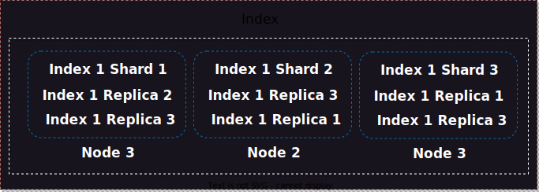

## ELK Stack


## Elasticsearch 


is search and analytics engine that is widely used for full-text search, log and event data analysis

 - storage

 - analytics

 - search


Shard - shard is a basic unit of storage and search 

Indexer - logical space for storing shards




Logstach

Kibana


Download and install the Debian package manually

```bash
wget https://artifacts.elastic.co/downloads/elasticsearch/elasticsearch-8.11.1-amd64.deb
wget https://artifacts.elastic.co/downloads/elasticsearch/elasticsearch-8.11.1-amd64.deb.sha512
shasum -a 512 -c elasticsearch-8.11.1-amd64.deb.sha512 
sudo dpkg -i elasticsearch-8.11.1-amd64.deb
```

after install take password from cli 

```yml
sudo systemctl daemon-reload
```
```bash
systemctl start elasticsearch.service
```

```bash
systemctl status elasticsearch.service
```
GUI work only on protocol https https://127.0.0.1:9200


### Add Node to Elastic 
```bash 
sudo /etc/elasticsearch/elasticsearch.yml
```
```yml
cluster.name: elasticsearch

node.name: node-1
```


## filebeat 

**harvester** proccess read specific file

1 harvester = 1 proccess

**Input** harvester tracking mechanism

have many

stdin, syslog, tcp, udp, aws


```bash
curl -L -O https://artifacts.elastic.co/downloads/beats/filebeat/filebeat-8.11.1-amd64.deb
```
```bash
sudo dpkg -i filebeat-8.11.1-amd64.deb
```
```bash
sudo nano /etc/filebeat/filebeat.yml 
```
edit file
```yml

enabled: true

output.elasticsearch:
  hosts: [https://127.0.0.1:9200]

  username: "elastic"
  password: "8-UIKFdgtdgDdgsHfsd"

``` 
restart daemons 
```bash
systemctl daemons-reload 
```
and check status
```yml
systemctl status filebeat.service
```

### add certs from elastic to filebeat

```bash
sudo ls /etc/elastic/search/certs
```
edit file 
```bash
sudo nano /etc/filebeat/filebeat.yml 
```
```yml

enabled: true

output.elasticsearch:
  hosts: [https://127.0.0.1:9200]
  ssl.certificate_authorities:
    - /etc/elasticsearch/certs/http_ca.crt
  username: "elastic"
  password: "8-UIKFdgtdgDdgsHfsd"

``` 
restart daemons 
```bash
systemctl daemons-reload 
```
and check status
```yml
systemctl status filebeat.service
```

## filebeat.yml vs logstash.yml

in loglash have filters addon

in **Filebeat** reads line by line, **Logstash** generates a document using a filter


**What, Where, When...**


## Logstash

As mentioned earlier, Logstash is the data processing component. It collects and processes logs and other event data from various sources, then transforms and sends it to Elasticsearch or other destinations.
Filters, transforms and enriches data according to your requirements. For example, you can extract fields from text logs, convert date formats and time stamps, and perform other manipulations with data.


install logstash from binary
```bash
curl -L -O https://artifacts.elastic.co/downloads/logstash/logstash-8.1.1-linux-x86_64.tar.gz
```
```bash
sudo dpkg -i logstash-8.1.1-amd64.deb
```
```bash
sudo nano example.conf
```json
input  {
  file  {
    path => "/var/log/*.log"
  }
}

# filter {}

output {
  file  { path => "/etc/logstash/result.log" }
}
```
copy file to directory logstash

```bash
sudo cp example.conf /etc/logstash/conf.d/main.conf
```

run and reload config after any edit

```bash
sudo /usr/share/logstash/bin/logstash -f /etc/logstash/conf.d/main.conf --config.reload.automatic
```


## Kibana

```bash
wget https://artifacts.elastic.co/downloads/kibana/kibana-8.11.1-amd64.deb
hasum -a 512 kibana-8.11.1-amd64.deb 
```
```bash
sudo dpkg -i kinana-8.1.1-amd64.deb
```

### Run Kibana with systemd

```bash
sudo /bin/systemctl daemon-reload
sudo /bin/systemctl enable kibana.service
```

Kibana can be started and stopped as follows:

```bash
sudo systemctl start kibana.service
sudo systemctl stop kibana.service
```