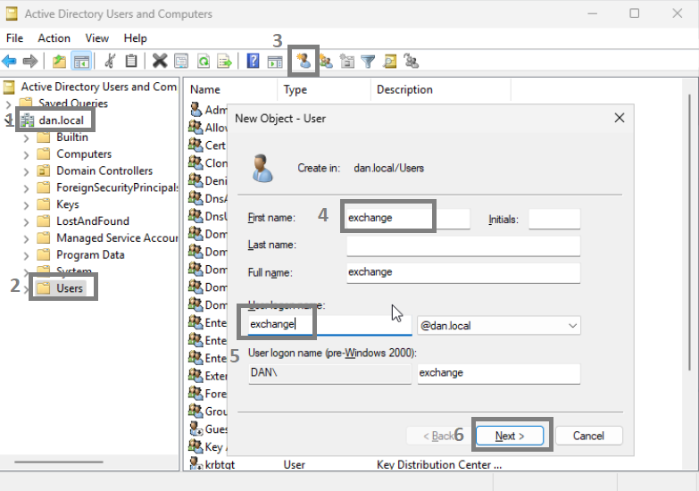
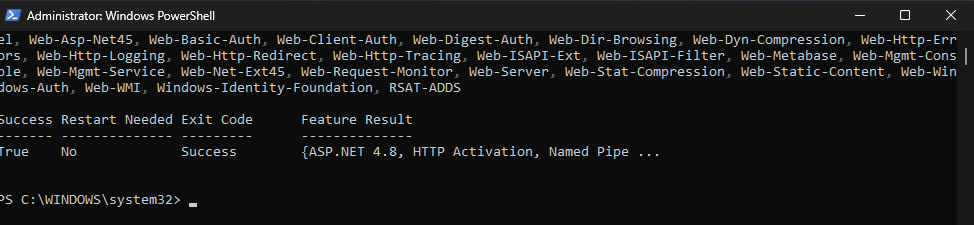
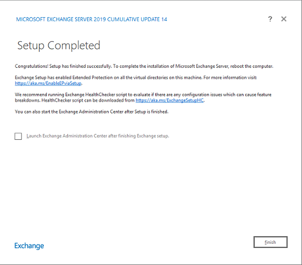
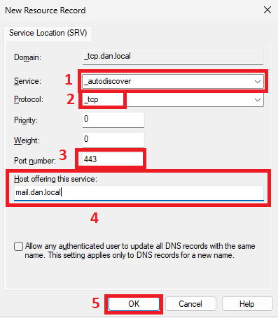
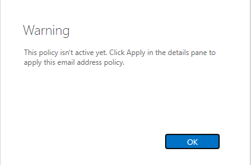

---
title: "Exchange 2019"
discription: Windows Server Exchange
date: 2024-12-13T21:29:01+08:00 
draft: false
type: post
tags: ["Windows Server"]
showTableOfContents: true
--- 

## Add New User to AD for Exchange

1. Tools > Active Directory Users and Computers


2. Create New User `exchange`


3. Password never expires


4. Users > exchange > Right click >  Member of > Add `Domain Admins`, `Schema Admins`, `Enterprise Admins`> OK


## On Echange 2019 Server 


1. Add to DNS DC to server for me its 192.168.1.220


2. Dont forget disable dhcpv6 and join to domain 


3. Download and Install Net Framework 4.8 
```   
https://support.microsoft.com/en-us/topic/microsoft-net-framework-4-8-offline-installer-for-windows-9d23f658-3b97-68ab-d013-aa3c3e7495e0
```


4. Download and Install Visual C++ Redistributable Package for Visual Studio 2012
```
https://www.microsoft.com/en-us/download/details.aspx?id=30679
```

5. Download and Install Visual C++ Redistributable Package for Visual Studio 2013
```
https://support.microsoft.com/en-us/topic/update-for-visual-c-2013-redistributable-package-d8ccd6a5-4e26-c290-517b-8da6cfdf4f10
```


6. Download and Install Microsoft Unified Communications Managed API 4.0
```
https://www.microsoft.com/en-us/download/details.aspx?id=34992
```


6. Restart machine


## Install components in Powershell 

1. Next step is to install the Remote Tools Administration Pack. Open Windows PowerShell and run below command.


2. Open Powershell with Administrator

```
Install-WindowsFeature Server-Media-Foundation, NET-Framework-45-Core, NET-Framework-45-ASPNET, NET-WCF-HTTP-Activation45, NET-WCF-Pipe-Activation45, NET-WCF-TCP-Activation45, NET-WCF-TCP-PortSharing45, RPC-over-HTTP-proxy, RSAT-Clustering, RSAT-Clustering-CmdInterface, RSAT-Clustering-Mgmt, RSAT-Clustering-PowerShell, WAS-Process-Model, Web-Asp-Net45, Web-Basic-Auth, Web-Client-Auth, Web-Digest-Auth, Web-Dir-Browsing, Web-Dyn-Compression, Web-Http-Errors, Web-Http-Logging, Web-Http-Redirect, Web-Http-Tracing, Web-ISAPI-Ext, Web-ISAPI-Filter, Web-Metabase, Web-Mgmt-Console, Web-Mgmt-Service, Web-Net-Ext45, Web-Request-Monitor, Web-Server, Web-Stat-Compression, Web-Static-Content, Web-Windows-Auth, Web-WMI, Windows-Identity-Foundation, RSAT-ADDS
```



3. Download and Install IIS URL Rewrite.
```
https://www.iis.net/downloads/microsoft/url-rewrite
```


2. Install from disk go to `f:\` iso file : 

```
cd f:
.\Setup.EXE /IAcceptExchangeServerLicenseTerms_DiagnosticDataON /PrepareSchema

```


### DC sync 

if you have many DC servers you need sync  
```
repadmin /syncall 
```


### Back to Exchange Server
```
.\Setup.EXE /IAcceptExchangeServerLicenseTerms_DiagnosticDataON /PrepareAD /OrganizationName:"dan"
```


its my site domain `641514.cc` for other domain add command :
```
.\Setup.exe /IAcceptExchangeServerLicenseTerms_DiagnosticDataON /PrepareDomain:641514.cc
```


### Back to DC 

1. you can see change:


2. resync now 
```
repadmin /syncall 
```


### Install ISO

Back to Exchange Server and Install iso 

now i can run `setup.exe` > Next :


Error its OK (i dont have connect to internet)

Done


Now test if all ok


all ok "true"


## On DC Add DNS Records

1. DNS > Server > Forward Lookup Zones > dan.local > New Hosts (A or AAAA) > Add `192.168.1.169` (IP Exchange server) > Add Host


2. Add autodiscover for Outlook 


3. DNS > Server > Forward Lookup Zones > dan.local > _tcp > Other New Records > SRV > Create Record


4. Service: `_autodiscover` > Protocol: `_tcp` > Port `443` > Host `mail.dan.local` > Done

5. Done


6. Need Add MX record: 


### Login on Web Admin Exchange Center

1. Open web browser and write
```
https://mail.dan.local/ecp
```
2. login with exchange account:


3. Set time:


4. Now Need Create address mail policies:


5. mailflow > email address policies > +


6. Click on plus 


7. Select your fotmat and click on Save


8. Give to police name `local` and click Save 


9. Warning say i need apply police


10. Apply police 


11. Done


### Move the DB to another disk 

1. First i need create folders `DB` after in folder `LOGS`, `EDB`


2. First I need unmount database


3. Dismount it


4. Done


5. Open Exchange Management Shell > write `Get-MailboxDatabase`


6. Move database to disk d:
```
Move-DatabasePath -Identity DB -EdbFilePath d:\DB\EDB\db01.edb -LogFolderPath d:\DB\LOGS
```


Key for EX2019
```
YCQY7-BNTF6-R337H-69FGX-P39TY
```
7. Watch if all OK


8. Now Mount and Done


### Add Mail to AD User 

1. recipients > + > Alies: `test` > Browser > Save


2. Go to Outlook and send  
```
https://mail.dan.local/owa
```
Test to send messege , all ok 
