Create a repository in an existing directory:

Linux:
```
cd home user my_project
```
MacOS:
```
cd Users user my_project
```
Windows:
```
cd C:/Users/user/my_project
```
then run the command:
```
git init
```
Add existing files under version control:
```
git add *.c
git add LICENSE
git commit -m ‘Initial project version’
```

Clone an existing repository
```
git clone https://github.com/libgit2/libgit2
```

Clone the repository to a directory named mylibgit:
$ git clone https://github.com/libgit2/libgit2 mylibgit

## Working with Git

### Git Add 

Add existing files under version control:
```
$ git status

On branch main
Your branch is up to date with 'origin/main'.

nothing to commit, working tree clean  
```
Adding README + status:
```
$ echo ‘My project’ > README
$ git status
On the master branch
Your branch is updated with ‘origin/master’.
Untraceable files:
(use ‘git add <file>...’ to include them in what will be committed)
README
nothing added to the commit, but untracked files are present (use ‘git add’ to
track)
```
Tracking new files:
```
$ git add README
$ git status
On the master branch
Your branch has been updated to ‘origin/master’.
The changes should be committed:
(use ‘git restore --staged <file>...’ to uncommit)
new file: README
```

### Git Status

Indexing the modified files:
```
$ git status
On the master branch
Your branch has been updated to ‘origin/master’.
The changes should be committed:
(use ‘git reset HEAD <file>...’ to uncommit)
new file: README
Changes not placed to commit:
(use ‘git add <file>...’ to update what will be committed)
(use ‘git checkout -- <file>...’ to remove changes in the working directory)
modified: CONTRIBUTING.md
```
Add this content to the next commit:
```
$ git add CONTRIBUTING.md
$ git status
On branch master
Your branch is up-to-date with ‘origin/master’.
Changes to be committed:
new file: README
modified: CONTRIBUTING.md
```
Let's make changes to the file via `vim` and request a new status:
```
$ git status
On branch master
Your branch is up-to-date with 'origin/master'.
Changes to be committed:
new file: README
modified: CONTRIBUTING.md
Changes not staged for commit:
(use "git add <file>..." to update what will be committed)
(use "git checkout -- <file>..." to discard changes in working directory)
modified: CONTRIBUTING.md
```
A shorter status output:
```
$ git status -s
```
```
M README
MM Rakefile
A lib/git.rb
M lib/simplegit.rb
?? LICENSE.txt
```
### Git Ignore

Ignore files:
```
$ cat .gitignore
```
```
*.[oa].
*~
```

The following rules apply to templates in the `.gitignore` file:
- Blank lines, as well as lines beginning with #, are ignored
- Default templates are global and are applied recursively
for the entire directory tree
- To avoid recursion, use a slash (/) at the beginning of the template.
- To exclude a directory, add a slash (/) at the end of the template
- You can invert the template by using an exclamation mark (!) as the first character in the template.
as the first character

Example `.gitignore`:
Exclude all files with the extension `.a`
```
*.a
```
But keep track of the lib.a file even if it falls under the rules listed
```
!lib.a
```
Exclude the TODO file in the root directory, but not the file in subdir/TODO
```
/TODO
```
Ignore all files in the `build/` directory
```
build/
```
Ignore the file `doc/notes.txt`, but not the file `doc/server/arch.txt`
```
doc/*.txt
```
Ignore all `.txt` files in the `doc/` directory.
```
doc/**/*.txt
```
for more details `.gitignore` are available in manual
```
$ man gitignore.
```
### Git Diff

View indexed and unindexed changes:
```
$ git diff
```
```
diff --git a/CONTRIBUTING.md b/CONTRIBUTING.md
index 8ebb991..643e24f 100644
--- a/CONTRIBUTING.md
+++ b/CONTRIBUTING.md
@@ -65,7 +65,8 @@ branches directly, things can get confusing.
Please include a nice description of the changes when submitting PRs;
If we have to read the entire diff to understand why you are contributing
in the first place, you'll be less likely to get feedback and get your changes
-included.
+included. Also, break your changes into extensive chunks if your patch is
+longer than a dozen lines.
If you start working on a specific area, feel free to send a PR
describing your work (and mention in the title of the PR that it's 
```
See what you've indexed and what will go into the next commit:
```
$ git diff --staged
```
```
diff --git a/README b/README
new file mode 100644
index 0000000..03902a1
--- /dev/null
+++ b/README
@@ -0,0 +1 @@
+My Project
```

View changes to the file in different programs:
```
$ git difftool
```
Difftool Help:
```
$ git difftool --tool-help
```
### Git Commit

Commit changes:
```
$ git commit
```
VIM window example:
```
# Please enter a message to commit your changes. Lines starting
# with ‘#’ will be ignored, and an empty message will abort the commit.
# On the master branch
# Your branch is updated at ‘origin/master’.
# Changes that will be committed:
# new file: README
# changed: CONTRIBUTING.md
‘.git/COMMIT_EDITMSG’ 9L, 283C
```
Detailed changes:
```
$ git commit -v
```
Add your comment to the commit:
```
$ git commit -m ‘Story 182: fix benchmarks for speed’
```
```
[master 463dc4f] Story 182: fix benchmarks for speed
2 files modified, 2 inserts(+)
creation mode 100644 README
```
Ignoring indexing:
```
$ git status
```
```
On the master branch
Your branch has been updated to ‘origin/master’.
The changes have not been put on commit:
(use ‘git add <file>...’ to update what will be committed)
(use ‘git checkout -- <file>...’ to remove changes in the working directory)
changed: CONTRIBUTING.md
changes not added to commit (use ‘git add’ and/or ‘git commit -a’)
```
- `-a` automatic add all changed files to commit

- `-m` its need to add quotes commit ’new cicd'
f
```
$ git commit -a -m ‘Add new benchmarks’
```
```
[master 83e38c7] Add new benchmarks
1 file modified, 5 inserts(+), 0 deletes(-)
```

### Git Remove

Deleting files:
```
$ rm PROJECTS.md.
```
```
$ git status
```
```
On the master branch.
Your branch is updated with ‘origin/master’.
Changes are not put on commit:
(use ‘git add/rm <file>...’ to update what will be committed)
(use ‘git checkout -- <file>...’ to remove changes in the working directory)
removed: PROJECTS.md
changes not added to commit (use ‘git add’ and/or ‘git commit -a’)
```

If you run the git rm command:
```
$ git rm PROJECTS.md
rm ‘PROJECTS.md’
```
```
$ git status
```
```
On the master branch.
Your branch has been updated to ‘origin/master’.
The changes should be committed:
deleted: PROJECTS.md
```
Removing wrongly indexed files:
```
$ git rm --cached README
```
Delete files mistakenly indexed with files, directories:
```
$ git rm log/\**.log # or you can do it this way $ git rm \*~
```
### Gi Moving

Moving files:
```
$ git mv file_from file_to
```
Example:
```
$ git mv README.md README
```
```
$ git status
```
```
On branch master
Your branch is up-to-date with ‘origin/master’.
Changes to be committed:
renamed: README.md -> README
```
Similarly:
```
$ mv README.md README
```
```
$ git rm README.md
$ git add README
```

### Git Amend

Cancellation operation:
```
$ git commit --amend
```
Example:
```
$ git commit -m ‘Initial commit’
$ git add forgotten_file
$ git commit --amend
```
Similarly:
```
$ mv README.md README
$ git rm README.md
$ git add README
```
Cancelling the indexing of the file:
```
$ git add *
```
```
$ git status
```
```
On the master branch.
Changes should be committed:
(use ‘git reset HEAD <file>...’ to uncommit)
renamed: README.md -> README
changed: CONTRIBUTING.md
```
Let's unindex the 'CONTRIBUTING.md' file:
```
$ git reset HEAD CONTRIBUTING.md
```
```
Uninstalled changes after reset:
CONTRIBUTING.md
```
```
$ git status
```
```
On the master branch.
Changes to be committed:
renamed: README.md -> README
Changes not submitted for committing:
changed: CONTRIBUTING.md.
```
<br>
Cancelling changes to a file how do I do it?
```
The changes are not put on commit:
(use ‘git add <file>...’ to update what will be committed)
(use ‘git checkout -- <file>...’ to remove changes in the working directory)
changed: CONTRIBUTING.md
```
Let's do this:
```
$ git checkout -- CONTRIBUTING.md
```
```
$ git status
```
```
On the master branch.
The changes should be committed:
(use ‘git reset HEAD <file>...’ to uncommit)
renamed: README.md -> README
```
Undo actions with git restore:
```
$ git reset <file> # = $ git restore <file> from git 2.23.0
```


### Git Remote 

View deleted repositories:
```
$ git clone https://github.com/schacon/ticgit
```
```
Cloning into ‘ticgit’...
remote: Reusing existing pack: 1857, done.
remote: Total 1857 (delta 0), reused 0 (delta 0)
Receiving objects: 100% (1857/1857), 374.35 KiB | 268.00 KiB/s, done.
Resolving deltas: 100% (772/772), done.
Checking connectivity... done.
```
```
$ cd ticgit
```
```
$ git remote
```
```
origin
```
View the addresses bound to the repository:
```
$ git remote -v
```
```
origin https://github.com/schacon/ticgit (fetch)
origin https://github.com/schacon/ticgit (push)
```

Adding remote repositories:
```
$ git remote
origin
```
```
$ git remote add pb https://github.com/paulboone/ticgit
```
view status:
```
$ git remote -v
```
```
origin https://github.com/schacon/ticgit (fetch)
origin https://github.com/schacon/ticgit (push)
pb https://github.com/paulboone/ticgit (fetch)
pb https://github.com/paulboone/ticgit (push)
```
Get the changes that Paul has:
```
$ git fetch pb
```
```
remote: Counting objects: 43, done.
remote: Compressing objects: 100% (36/36), done.
remote: Total 43 (delta 10), reused 31 (delta 5)
Unpacking objects: 100% (43/43), done.
From https://github.com/paulboone/ticgit
* [new branch] master -> pb/master
* [new branch] ticgit -> pb/ticgit
```

### Git Fetch

Getting changes from a remote repository - Fetch and Pull:
```
$ git fetch [remote-name])
```
Send changes to the remote repository (Push):
```
$ git push origin master
```
View remote repository:
```
$ git remote show origin
```
```
* remote origin
Fetch URL: https://github.com/schacon/ticgit
Push URL: https://github.com/schacon/ticgit
HEAD branch: master
Remote branches:
master                        tracked
dev-branch                    tracked
Local branch configured for 'git pull':
   master merges with remote master
Local ref configured for 'git push':
   gmaster pushes to master (up to date)
```

### Git rename repository

Delete and rename remote repositories:
```
$ git remote rename pb paul
```
```
$ git remote
```
```
origin
paul
```
Remove a deleted repository:
```
$ git remote remove paul
```
View Status:
```
$ git remote
```
```
origin
```

### Git Tag

View tag list:
```
$ git tag
```
```
v1.0
v2.0
```
Searching for a tag by pattern:
```
$ git tag -l ‘v1.8.5*’
```
```
v1.8.5
v1.8.5-rc0
v1.8.5-rc1
```
Creating tags with annotation:
```
$ git tag -a v1.4 -m "my version 1.4"
```
View tag:
```
$ git tag
```
```
v0.1
v1.3
v1.4
````
View tag information:
```
$ git show v1.4
```
```
tag v1.4
Tagger: Ben Straub <ben@straub.cc>
Date: Sat May 3 20:19:12 2014 -0700
my version 1.4
commit ca82a6dff817ec66f44342007202690a93763949
Author: Scott Chacon <schacon@gee-mail.com>
Date: Mon Mar 17 21:52:11 2008 -0700
    Change version number
```
Creating a lightweight tag:
```
$ git tag v1.4-lw
```
View tags
```
$ git tag
```
```
v0.1
v1.3
v1.4
v1.4-lw
```
Deferred tagging:
```
$ git log --pretty=oneline
```
```
15027957951b64cf874c3557a0f3547bd83b3b3ff6 Merge branch ‘experiment’
a6b4c97498bd301d84096da251c98a07c7723e65 Create write support
0d52aaab4479697da7686c15f77a3d64d9165190 One more thing
```
Commit tag:
```
$ git tag -a v1.2 9fceb02
```
#### Tag Exchange:
```
$ git push origin v1.5
```
```
Object count: 14, done.
Delta compression using up to 8 threads.
Object compression: 100% (12/12), done.
Recording objects: 100% (14/14), 2.05 KiB | 0 bytes/sec, done.
Total 14 (delta 3), reused 0 (delta 0)
From git@github.com:schacon/simplegit.git
* [new tag]               v1.5 -> v1.5
Send to remote server:
```
```
$ git push origin --tags
```
```
Object count: 1, done.
Recording objects: 100% (1/1), 160 bytes | 0 bytes/sec, done.
Total 1 (delta 0), reused 0 (delta 0)
From git@github.com:schacon/simplegit.git
* [new tag]             v1.4 -> v1.4
* [new tag]             v1.4-lw -> v1.4-lw
```
#### Tag delete:
```
$ git tag -d v1.4-lw
```
```
Removed tag ‘v1.4-lw’ (was e7d5add)
```
Remove tag on external resource:
```
$ git push origin :refs/tags/v1.4-lw # 1 method
```
```
$ git push origin --delete <tagname> # 2nd way
```
#### Tag checkout:
```
$ git checkout v2.0.0.
```
```
Note: switching to 'v2.0.0'.
Example:
git switch -c <new-branch-name>
Or undo this operation with:
git switch -
```
```
$ git checkout v2.0-beta-0.1
```
```
Previous HEAD position was 99ada87... Merge pull request #89 from
schacon/appendix-final
HEAD is now at df3f601... Add atlas.json and cover image
```

### Tag Alies
Example aliases:
```
$ git config --global alias.co checkout
$ git config --global alias.br branch
$ git config --global alias.ci commit
$ git config --global alias.st status
```
Exclude the file from the index:
```
$ git config --global alias.unstage ‘reset HEAD --’
```
Equivalent to:
```
$ git unstage fileA
```
```
$ git reset HEAD -- fileA
```
With the addition of last:
```
$ git config --global alias.last ‘log -1 HEAD’
```
View last commit:
```
$ git last
```
```
commit 66938dae3329c7aebe598c2246a8e6af90d04646
```

### About branching 

Suppose you have a catalogue with three files, and you
add them all to the index and create a commit
```
$ git add README test.rb LICENSE
```
```
$ git commit -m 'Initial commit
```
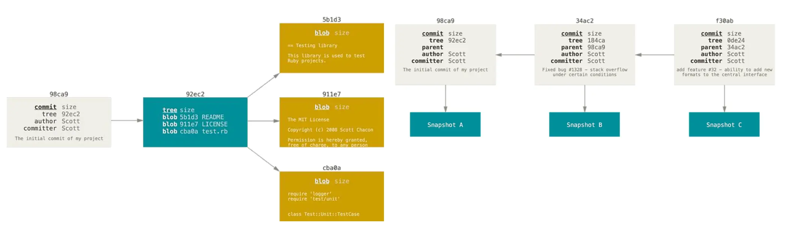


### Creating a new branch

A new branch is created by the command:

```
$ git branch testing
```
You can easily see this with a simple git log, which will show you where the branch pointers are pointing. This
option is called --decorate.
```
$ git log --oneline --decorate
```
```
f30ab (HEAD -> master, testing) Add feature #32 - ability to
add new formats to the central interface
34ac2 Fix bug #1328 - stack overflow under certain conditions
98ca9 Initial commit
```
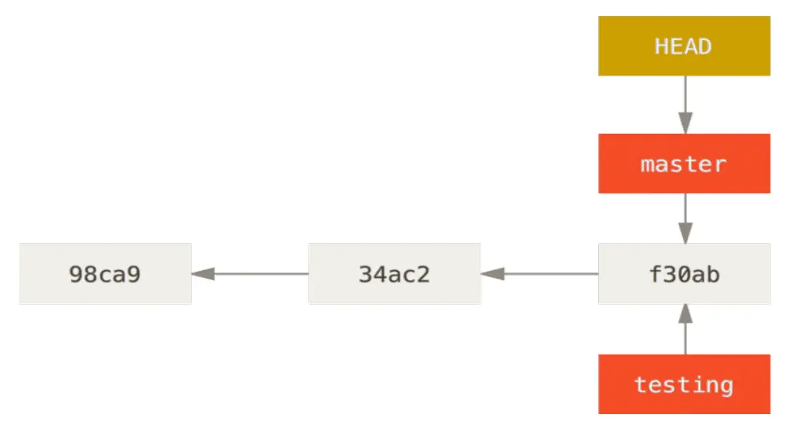


### Switching branches

To switch to an existing branch, run the git checkout command:
```
$ git checkout testing
```
Let's do one more commit:
```
$ git commit -a -m 'made a change'
```
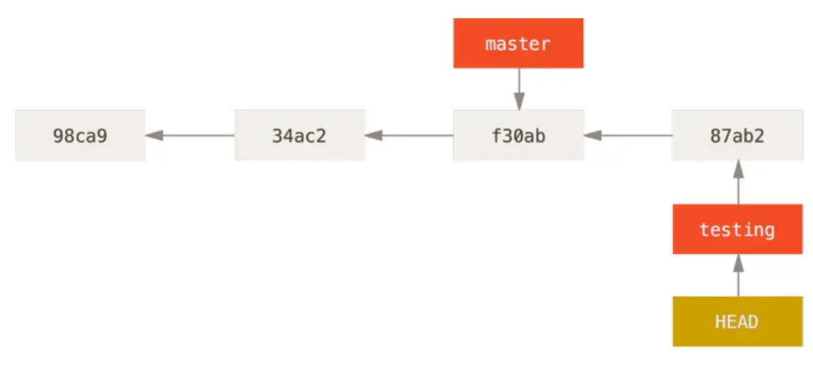

### Branching basics
Create a new branch and switch to it with the git checkout command with the
`-b` parameter:
```
$ git checkout -b iss53
```
```
Switched to a new branch "iss53"
```
Commit:
```
$ vim index.html
```
```
$ git commit -a -m ‘Create new footer [issue 53]’
```
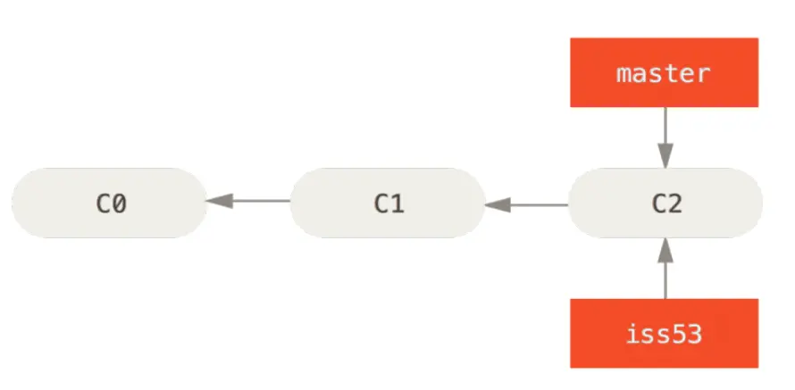

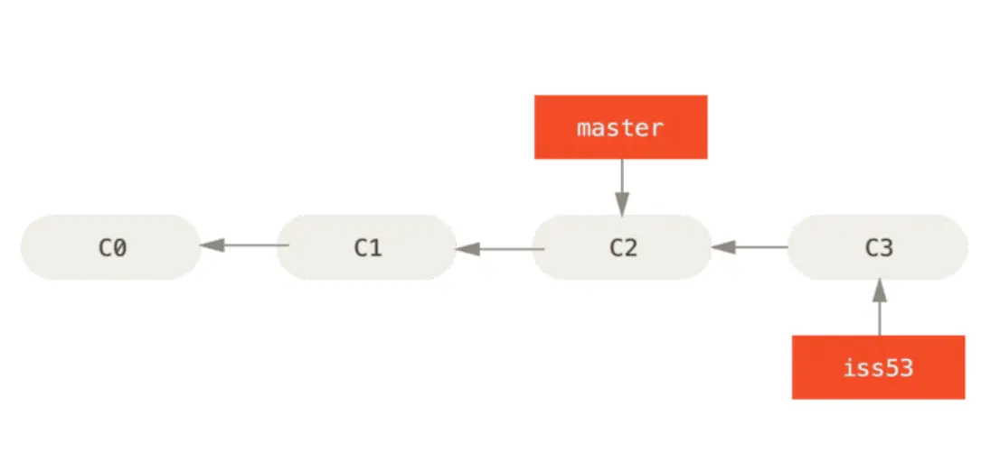

Now suppose you have committed all your changes and can
switch to the master branch:
```
$ git checkout master
```
```
Switched to branch 'master'
```
Create a new branch:
```
$ git checkout -b hotfix
```
```
Switched to a new branch 'hotfix'
```

```
$ git commit -a -m 'Fix broken email address'
```
```
[hotfix 1fb7853] Fix broken email address
1 file changed, 2 insertions(+)
```
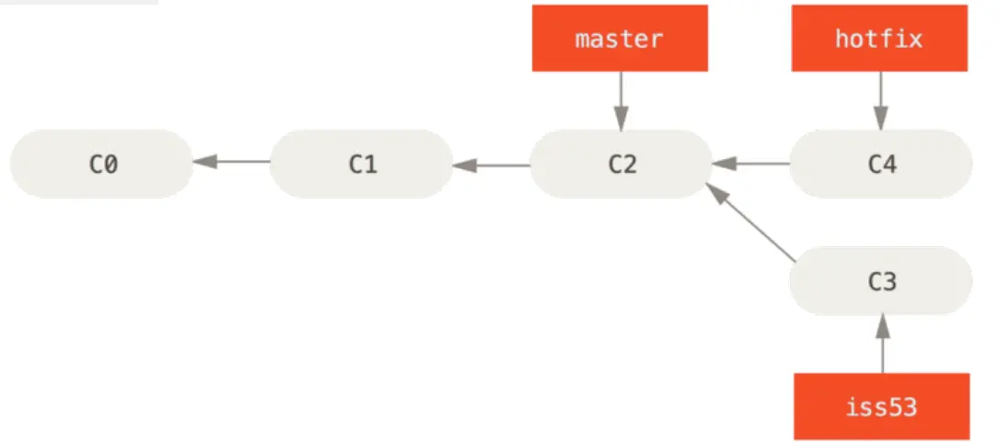

### Merge Basics
To merge a branch, you need to switch to the branch to which you
you want to include changes to, and run the git merge command:
```
$ git checkout master
```
```
Switched to branch 'master'
```
```
$ git merge iss53
```
```
Merge made by the 'recursive' strategy.
index.html | 1 +
1 file changed, 1 insertion(+)
```
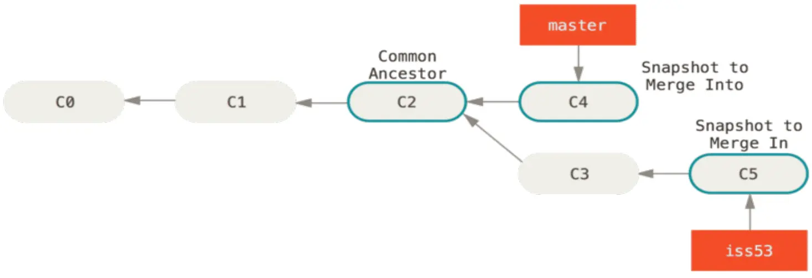

#### The Basic conflicts of the merger

Sometimes the merger process doesn't go smoothly:

```
$ git merge iss53
```
```
Auto-merging index.html
CONFLICT (content): Merge conflict in index.html
Automatic merge failed; fix conflicts and then commit the result.
```
Special markers are added:
```
<<<<<<< HEAD:index.html
<div id="footer">contact : email.support@github.com</div>
=======
<div id="footer">
please contact us at support@github.com
</div>
>>>>>>> iss53:index.html
```

### Deleted branches

Deleted links are links (pointers) in your deleted
repositories, including branches, tags, and so on. A complete list of
of remote links can be obtained by using the `git lsremote <remote>` command or the `git remote show <remote>` command to retrieve remote branches and information.to get deleted branches and more information

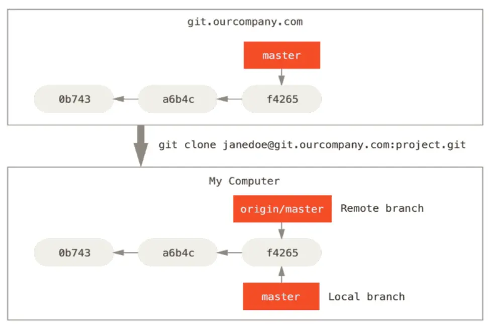

If you do something in your local master branch, and in the meantime someone sends the changes to the git.ourcompany.com server and
Meanwhile, someone sends the changes to the git.ourcompany.com server and
update the master branch there, your stories will continue in different ways.
As long as you don't contact the origin server, your origin/master pointer
pointer will remain in place.

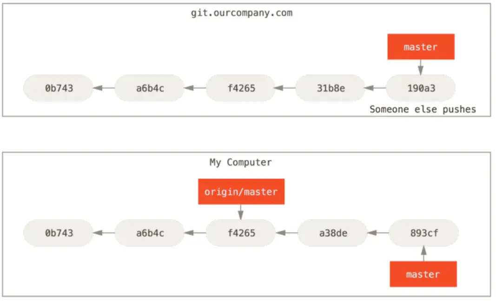

To synchronise your changes with the remote server, run the
`git fetch <remote>` command (in our case git fetch origin). This command
determines which server ‘origin’ corresponds to (in our case it is
git.ourcompany.com), fetches data from there that you don't already have, and
updates the local database by shifting the origin/master pointer to a new
position.

### Sending changes

If you have a `serverfix` branch that you want someone else to work on.
you can submit it the same way you submitted your first branch.
branch. Run the `git push <remote> <branch>` command:

```
$ git push origin serverfix
```
```
Counting objects: 24, done.
Delta compression using up to 8 threads.
Compressing objects: 100% (15/15), done.
Writing objects: 100% (24/24), 1.91 KiB | 0 bytes/s, done.
Total 24 (delta 2), reused 0 (delta 0)
To https://github.com/schacon/simplegit
* [new branch] serverfix -> serverfix
```
### Tracking branches

Tracking branches are local branches that are directly connected to a
a remote branch. If you perform a git pull while on a tracking branch, git will already know which server to pull data from and which branch to pull from.
Git will already know which server to pull data from and which branch to use for merging.
```
$ git push origin serverfix
```
```
Counting objects: 24, done.
Delta compression using up to 8 threads.
Compressing objects: 100% (15/15), done.
Writing objects: 100% (24/24), 1.91 KiB | 0 bytes/s, done.
Total 24 (delta 2), reused 0 (delta 0)
To https://github.com/schacon/simplegit
* [new branch] serverfix -> serverfix
```
### Fetching changes

The `git fetch` command fetches any changes from the server that you don't already have.
but will not change the state of your working copy. This command
just fetches the data and allows you to do the merge yourself.
merge. However, there is a `git pull` command, which is in most cases
most of the time is the `git fetch` command, which is followed
directly followed by the git merge command.

### Git Tools


#### Revision Selection
```
$ git log
```
```
commit 734713bc047d87bf7eac9674765ae793478c50d3
Author: Scott Chacon <schacon@gmail.com>
Date:   Fri Jan 2 18:32:33 2009 -0800

    Fix refs handling, add gc auto, update tests

commit d921970aadf03b3cf0e71becdaab3147ba71cdef
Merge: 1c002dd... 35cfb2b...
Author: Scott Chacon <schacon@gmail.com>
Date:   Thu Dec 11 15:08:43 2008 -0800

    Merge commit 'phedders/rdocs'

commit 1c002dd4b536e7479fe34593e72e6c6c1819e53b
Author: Scott Chacon <schacon@gmail.com>
Date:   Thu Dec 11 14:58:32 2008 -0800

    Add some blame and merge stuff
```
In this case, say you’re interested in the commit whose hash begins with `1c002dd…​`. You can inspect that commit with any of the following variations of `git show` (assuming the shorter versions are unambiguous):
```
$ git show 1c002dd4b536e7479fe34593e72e6c6c1819e53b
$ git show 1c002dd4b536e7479f
$ git show 1c002d
```

#### Branch References
One straightforward way to refer to a particular commit is if it’s the commit at the tip of a branch; in that case, you can simply use the branch name in any Git command that expects a reference to a commit. For instance, if you want to examine the last commit object on a branch, the following commands are equivalent, assuming that the `topic1` branch points to commit `ca82a6d`…​
```
$ git show ca82a6dff817ec66f44342007202690a93763949
$ git show topic1
```
View the SHA-1 of the object pointed to by the branch:
```
$ git rev-parse topic1
ca82a6dff817ec66f44342007202690a93763949
```

### Git Stashing and Cleaning

The stash operation takes the changed state of your working directory, that is, changed tracked files and indexed changes,
and saves them to the pending changes repository, which you can apply back at any time.
```
$ git stash
```
```
Saved working directory and index state \
"WIP on master: 049d078 Create index file"
HEAD is now at 049d078 Create index file
(To restore them type "git stash apply")
```
To see a list of stashed changes, you can use `git stash list`:
```
$ git stash list
```
```
stash@{0}: WIP on master: 049d078 Create index file
stash@{1}: WIP on master: c264051 Revert "Add file_size"
stash@{2}: WIP on master: 21d80a5 Add number to log
```
 To apply the changes you just stashed, you need to use the
the command specified in the output of the original command: `git stash apply`.

### Creating a branch from stashed changes

```
$ git stash branch testchanges
```
```
M index.html
M lib/simplegit.rb
Switched to a new branch 'testchanges'
On branch testchanges
Changes to be committed:
(use "git reset HEAD <file>..." to unstage)
modified: index.html
Changes not staged for commit:
(use "git add <file>..." to update what will be committed)
(use "git checkout -- <file>..." to discard changes in working directory)
modified: lib/simplegit.rb
Dropped refs/stash@{0} (29d385a81d163dfd45a452a2ce816487a6b8b014)
```

### Cleaning up the working directory


Clearing the working directory of some changes and files:
```
git clean
```
A safer option is to use the command:
```
git stash --all
```

To delete all untraceable files in the working directory
```
git clean -f -d
```
To see what will be done, you need to run the command with the `-n` option
```
$ git clean -d -n
```
```
Would remove test.o
Would remove tmp/
```


### Search the Git log
For example, if you want to find when the constant
`ZLIB_BUF_MAX`, you can use the `-S` option to ask Git to
only show commits in which this string was added or removed.
this string.

```
$ git log -S ZLIB_BUF_MAX --oneline
```
```
e01503b zlib: allow feeding more than 4GB in one go
ef49a7a zlib: zlib can only process 4GB at a time
```

### Change last commit
```
$ git commit --amend
```


### Deleting a commit

If you want to get rid of a commit, you can remove it during `rebase -i`.
during the rebase -i interactive rebase. Type the word
“drop” in front of the commit you want to remove, or simply remove it
from the list:
```
pick 461cb2a This commit is OK
drop 5aecc10 This commit is broken
```

### Merge Conflicts

```
$ git checkout -b whitespace
```
```
Switched to a new branch 'whitespace'
```
```
$ unix2dos hello.rb
```
```
unix2dos: converting file hello.rb to DOS format ...
```
```
$ git commit -am 'Convert hello.rb to DOS'
```
```
[whitespace 3270f76] Convert hello.rb to DOS
1 file changed, 7 insertions(+), 7 deletions(-)
```
```
$ git diff -b
```
```
diff --git a/hello.rb b/hello.rb
index ac51efd..e85207e 100755
--- a/hello.rb
+++ b/hello.rb
@@ -1,7 +1,7 @@
- puts 'hello world'
+ puts 'hello mundo'^M
end
```
```
$ git commit -am 'Use Spanish instead of English'
```
```
[whitespace 6d338d2] Use Spanish instead of English
1 file changed, 1 insertion(+), 1 deletion(-)
```
```
$ git checkout master
```
```
Switched to branch 'master'
```
```
$ git diff
```
```
diff --git a/hello.rb b/hello.rb
index ac51efd..36c06c8 100755
--- a/hello.rb
+++ b/hello.rb
@@ -1,5 +1,6 @@
#! /usr/bin/env ruby
+# prints out a greeting
def hello
puts 'hello world'
end
```
```
$ git commit -am 'Add comment documenting the function'
```
```
[master bec6336] Add comment documenting the function
1 file changed, 1 insertion(+)
$ git merge whitespace
Auto-merging hello.rb
CONFLICT (content): Merge conflict in hello.rb
Automatic merge failed; fix conflicts and then commit the result.
```
#### Canceling a merge attempt

Option to resolve merge conflict:
```
$ git status -sb
```
```
## master
UU hello.rb
```
```
$ git merge --abort
```
```
$ git status -sb
```
```
## master
```
### Using checkout in conflicts

Let's look at the reason for the conflict:
```
$ git log --graph --oneline --decorate --all
```
```
* f1270f7 (HEAD, master) Update README
* 9af9d3b Create README
* 694971d Update phrase to 'hola world'
| * e3eb223 (mundo) Add more tests
| * 7cff591 Create initial testing script
| * c3ffff1 Change text to 'hello mundo'
|/
* b7dcc89 Initial hello world code
```
Checkout:
```
$ git checkout --conflict=diff3 hello.rb
```
Use it as default for future merge conflicts:
```
$ git config --global merge.conflictstyle diff3
```


### Undo commit 

Recovery:
```
$ git revert -m 1 HEAD
```


### Credential storage
Git out-of-the-box has several options:

- By default, Git does not cache credentials at all. Each
connection will ask you for your username and password.

- In “cache” mode, the credentials are stored in memory for a
for a certain period of time.

- In “store” mode, the credentials are stored indefinitely in an open file on a disk.
for an indefinite period of time in an open file on disk.

- In case you're using a Mac, Git has an “osxkeychain” mode,
which stores credentials in a secure
storage tied to your system account.

- In case you are using Windows, you can install a
a helper called “Git Credential Manager for Windows”. 


<br>


</br>


clone repository:
```
git clone git@lab.com:danpoznanski/example.git
```


take commit from outsorce need be in directory folder of project
```
git remote add out git@github.com:danpoznanski/pythonrobotics.git
```

see if all add you can :
```
git remove -v 
```

to get commit from outsource
```
git fetch out
```
to create new branch to secure project 
```
git branch develop out/master
```
to choice other branch for example `develop` 
```
git checkout develop
```

to get code from remote repository
```
git pull 
```

to transfer code to your repository
```
git push -u origin -o merge_request.create
```

`-u origin` - this option sets upsteam for your current branch contact to remote branch, this allows in the future use `git push` and `git pull` without indication remote repository and branch

`-o merge_request.create` its command for gitlab merge request create 


create script auto push and pull 
```
sudo nano autogit.sh
```
```
#!/bin/bash
cd ./folder/
git checkout develop
git pull 
git push -u origin -o merge_request.create
cd .. 
```
after add rules `chmod +x autorun.sh`

to run ./autogit.sh

to automatic i use cron 
crontab -e

every 5 minute to run
```
5 * * * * /home/admin/scripts/autogit.sh
```

commit 
```bash
git commit -am 'new cicd'
```
`-a` automatic add all changed files to commit 

`-m` its need to add quotes commit 'new cicd'

or

```
git add .; git commit -m "Update website"; git push
```


### Git Commit


no need do `git add .` 
```
git commit -a 
```
no need open texteditor
```
git commit -m
```
(--no-edit) open commit through reset and do new commit
```
git commit --amend  
```

### Git Reset

Mixed Reset: `git reset <commit>` resets the staging area to match the specified commit but it doesn't affect the working directory. Your changes are unstaged but not lost, allowing you review you changes before committing again
```
git reset
```

Soft Reset: `git reset --soft <commit>` keeps  you changes in the staging area. it means you can re-commit the changes after the reset. 
```
git reset --soft HEAD-1
````
Hard Reset: `git reset --hard <commit>` resets the staging area and the working directory to match the specified commit. Be careful with this option as it discards all changes in the working directory 

`HEAD-1` delete 1 commit

```bash
git reset --hard  
```

### Git rebase 

Assume the following history exists and the current branch is "topic":
```
          A---B---C topic
         /
    D---E---F---G master
```
From this point, the result of either of the following commands:
```
git rebase master
git rebase master topic
```
would be:
```
                  A'--B'--C' topic
                 /
    D---E---F---G master
```

### Git Merge 


```
	  A---B---C topic
	 /
    D---E---F---G master
```
```
git merge topicg
```
```
	  A---B---C topic
	 /         \
    D---E---F---G---H master
```


### Git cherry-pick 

With the "cherry-pick" command, Git allows you to integrate selected, individual commits from any branch into your current HEAD branch.

Contrast this with the way commit integration normally works in Git: when performing a Merge or Rebase, all commits from one branch are integrated.

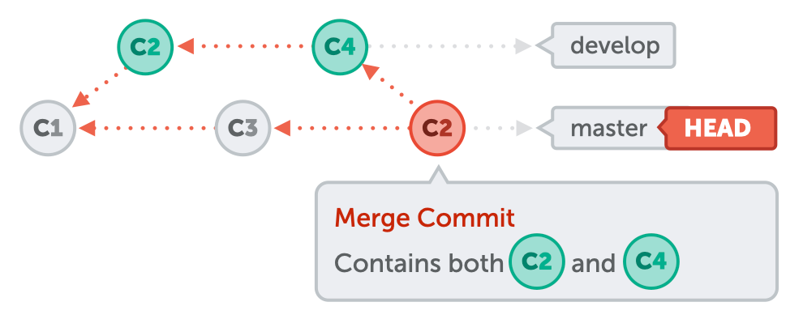

Cherry-pick, on the other hand, allows you to select individual commits for integration. In this example, only C2 is integrated into the master branch, but not C4.

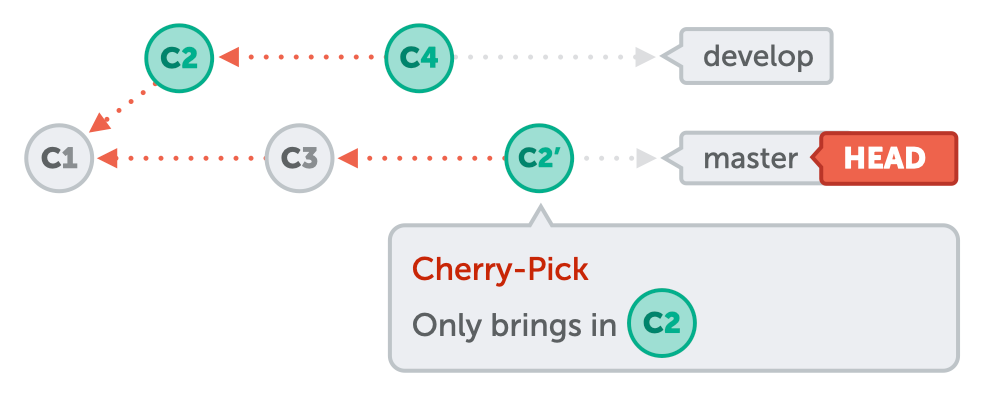

for example :
```
git cherry-pick af02e0b
```

### git rebase 2 commit

```
git rebase -i HEAD~2
```
in commit
```
squash or fixup
```
```
git rebase --continue
```


```
git rebase -i HEAD~3
```
in commit
```
edit
```
```
git rebase --continue
```

### git revert


```
git revert <hash commit>
```


### How restor git commit

`git reflog` or `git log -g` 

```
git reset --hard master@{"15 minutes ago"}
```

```
git fsck --full 
```


git besect
```
git besert <hash-commit>
```
git besert good or bad

git besert reset


git slash

git slash list 

git slash pop 

git slash apply


```
git slash drop slash@{1}
```
clear all git slash
```
git slash clear

```


git diff


```
git diff master <hash-commit1> 
```


git blame
```
git blame index.html
```
