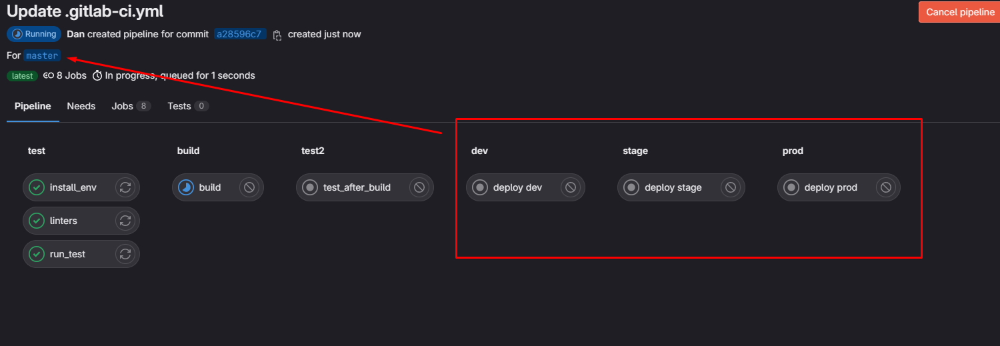
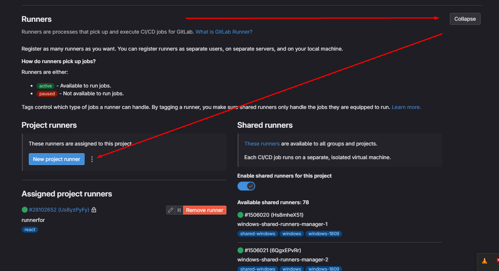
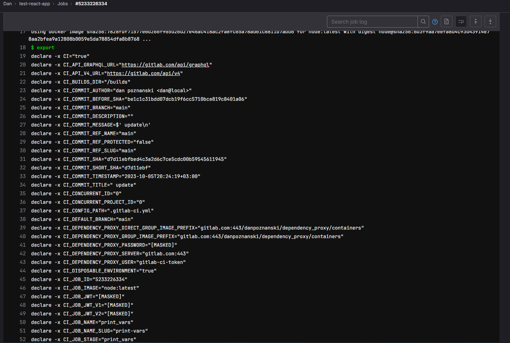
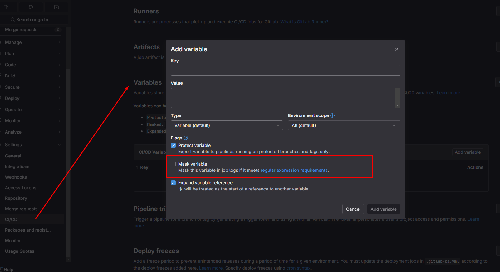

---
title: "Gitlab"
discription: simple command to routing
date: 2022-09-01T21:29:01+08:00 
draft: false
type: post
tags: ["Git","Linux"]
showTableOfContents: true
--- 


https://gitlab.com/rluna-gitlab/gitlab-ce

For Ubuntu 20.04 and 22.04, `arm64` packages are also available and will be automatically used on that platform when using the GitLab repository for installation.

```sh
sudo apt-get update
sudo apt-get install -y curl openssh-server ca-certificates tzdata perl
```

Next, install Postfix (or Sendmail) to send notification emails. If you want to use another solution to send emails please skip this step and configure an external SMTP server after GitLab has been installed
```sh
sudo apt-get install -y postfix
```
During Postfix installation a configuration screen may appear. Select 'Internet Site' and press enter. Use your server's external DNS for 'mail name' and press enter. If additional screens appear, continue to press enter to accept the defaults.
```sh
curl https://packages.gitlab.com/install/repositories/gitlab/gitlab-ee/script.deb.sh | sudo bash
```
Next, install the GitLab package. Make sure you have correctly set up your DNS, and change https://gitlab.example.com to the URL at which you want to access your GitLab instance. Installation will automatically configure and start GitLab at that URL.

For https:// URLs, GitLab will automatically request a certificate with Let's Encrypt, which requires inbound HTTP access and a valid hostname. You can also use your own certificate or just use http:// (without the s ).

If you would like to specify a custom password for the initial administrator user ( root ), check the documentation. If a password is not specified, a random password will be automatically generated
```
sudo EXTERNAL_URL="https://gitlab.example.com" apt-get install gitlab-ee
# List available versions: apt-cache madison gitlab-ee
# Specifiy version: sudo EXTERNAL_URL="https://gitlab.example.com" apt-get install gitlab-ee=16.2.3-ee.0
# Pin the version to limit auto-updates: sudo apt-mark hold gitlab-ee
# Show what packages are held back: sudo apt-mark showhold
```
Set up your communication preferences
Visit our email subscription preference center to let us know when to communicate with you. We have an explicit email opt-in policy so you have complete control over what and how often we send you emails.
Twice a month, we send out the GitLab news you need to know, including new features, integrations, docs, and behind the scenes stories from our dev teams. For critical security updates related to bugs and system performance, sign up for our dedicated security newsletter.

Important Note If you do not opt-in to the security newsletter, you will not receive security alerts.


## .gitlab-ci.yml


for example .gitlab-ci.yml
```yaml
stages:
  - build
  - test

test-code-job1:
  stage: test
  script:
    - echo "test1"

test-code-job2:
  stage: test
  script:
    - echo "test2"

build-code-job:
  stage: build
  script:
    - ./build.sh
```

## Trigger Event

for trriger can add `when manual` its stop befor build job
```
build-code-job:
  stage: build
  script:
    - ./build.sh
  when: manual
```

Trigger to run on special branch

```
build-code-job:
  stage: build
  script:
    - ./build.sh
  only:
    - master
    - /^release_[0-9]+(?:.[0-9]+)+$/
```


## Run Only

```
stages:
  - test
  - build
  - test2
  - dev
  - stage 
  - prod

install_env:
  stage: test
  script:
    - echo " test1 ---------------------- "

run_test:
  stage: test
  script:
    - echo "test2 ---------------------- "

linters:
  stage: test
  script:
    - echo "test linter ---------------- "

build:
  stage: build
  script:
    - echo 'running ./build.sh'

test_after_build:
  stage: test2
  script:
    - echo " test after build ---------------- "

deploy dev:
  stage: dev
  script:
    - echo 'running ./build.sh'
  when: manual
  only:
    refs:
      - tags
      - master
      - /^release.*$/

deploy stage:
  stage: stage
  script:
    - echo 'running ./deploy.sh'
  when: manual
  only:
    refs:
      - tags
      - master
      - /^release.*$/

deploy prod:
  stage: prod
  script:
    - echo 'running ./deploy.sh'
  when: manual 
  only:
    refs:
      - tags
      - master
      - /^release.*$/
```

only work on master 




example job 

copy from `var/www/html` to `./html/*` 

remove from `/var/www/html/site.zip`  zip from`zip -r /var/www/html/site.zip` and copy to `./html` 
```
stages:
  - deploy

deploy_prod_job:
  stage: deploy 
  script:
    - cp -r ./html/* /var/wwww/html
    - rm -f /var/www/html/site.zip; zip -r /var/www/html/site.zip ./html
    tags:
    - stage-shell
     only:
      refs:
        - master
```
&nbsp;️ 


### Gitlab Runner on Docker

need gitlab runner for test in local machine and you can used runners SaaS on gitlab 


```
docker run -d --name gitlab-runner --restart always \
  -v /srv/gitlab-runner/config:/etc/gitlab-runner \
  -v /var/run/docker.sock:/var/run/docker.sock \
  gitlab/gitlab-runner:latest

```
Registering runners 

```
docker run --rm -it -v /srv/gitlab-runner/config:/etc/gitlab-runner gitlab/gitlab-runner register
```


Gitlab => Setting => CI/CD => 




## Connect to Git Repository

```
git remote add origin https://gitlab.com/Danpoznanski/test-react-app.git
git branch -M main
```


git fetch origin main:tmp


git init

git add -A

git commit -m 'add your commit'

git branch -m main

git push origin main --force


## Disable ptotect on main branch

open you project -> Settings -> Repository and go to "Protected Pranches" find master branch into the list and click "Unprotect"


### Yaml exemple to .gitlab-ci.yml

```
image: node:latest
stages:
  - build
  - test
  - deploy
  - revert

install_dependencies:
  stage: build
  script: 
  - yarn install
  - yarn build
  artifacts:                         
    paths:
      - node_modules
      - build
  cache: 
    key:
      files:
        - yarn.lock
    paths:
      - node_modules
      
test:
  stage: deploy
  script:
    - cp -r build /www/test-app/$CI_COMMIT_SHA    
    - ln -fsnv /var/www/test-app/$CI_COMMIT_SHA /www/html 

```

## Mount Volume in Docker

```
nano /srv/gitlab-runner/config/config.toml
```

need add volume to docker `/var/www/test-app`

```
volume = ["cache", "/var/www/:/www:rw"]
```

### Revert 
```
image: node:latest
stages:
  - build
  - test
  - deploy
  - revert

install_dependencies:
  stage: build
  script: 
  - yarn install
  - yarn build
  artifacts:                         
    paths:
      - node_modules
      - build
  cache: 
    key:
      files:
        - yarn.lock
    paths:
      - node_modules
      
test:
  stage: deploy
  script:
    - cp -r build /www/test-app/$CI_COMMIT_SHA
    - cp -Pv /www/html /www/test-app/$CI_COMMIT_SHA/prev-version   
    - ln -fsnv /var/www/test-app/$CI_COMMIT_SHA /www/html 

revert:
  stage: revert
  when: manual
  script:
    - cp -Pv --remove-destination /www/test-app/$CI_COMMIT_SHA/prev-version /www/html

```

`-P`&nbsp;&nbsp;&nbsp; **--no-dereference** &nbsp;&nbsp;&nbsp; never follow symbolic links in SOURCE

**- - remove-destination**  &nbsp;&nbsp; remove each existing destination file before attempting to open it (contrast with --force)


  ## Variables Gitlab

  https://docs.gitlab.com/ee/ci/variables/


print_vars:

```
image: node:latest
stages:
  - print_vars
  - build
  - test
  - deploy
  - revert

print_vars:
  stage: print_vars
  script:
    - export

install_dependencies:
  stage: build
  script: 
  - yarn install
  - yarn build
  artifacts:                         
    paths:
      - node_modules
      - build
  cache: 
    key:
      files:
        - yarn.lock
    paths:
      - node_modules
      
test:
  stage: deploy
  script:
    - cp -r build /www/test-app/$CI_COMMIT_SHA
    - cp -Pv /www/html /www/test-app/$CI_COMMIT_SHA/prev-version   
    - ln -fsnv /var/www/test-app/$CI_COMMIT_SHA /www/html 

revert:
  stage: revert
  when: manual
  script:
    - cp -Pv --remove-destination /www/test-app/$CI_COMMIT_SHA/prev-version /www/html

```

export all variables 



### User Variables

 Settings > CI/CD > Variables



`Mask a CI/CD variable` &nbsp;&nbsp; Masking a CI/CD variable is not a guaranteed way to prevent malicious users from accessing variable values. The masking feature is “best-effort” and there to help when a variable is accidentally revealed. To make variables more secure, consider using external secrets and file type variables to prevent commands such as env/printenv from printing secret variables.


### Other Way

in .gitlab-ci.yml create variables and `docker_html_path: "/www"` docker_html_path = www

```
image: node:latest
stages:
  - build
  - test
  - deploy
  - revert

variables:
  docker_html_path: "/www"

install_dependencies:
  stage: build
  script: 
  - yarn install
  - yarn build
  artifacts:                         
    paths:
      - node_modules
      - build
  cache: 
    key:
      files:
        - yarn.lock
    paths:
      - node_modules
      
test:
  stage: deploy
  script:
    - cp -r build docker_html_path/test-app/$CI_COMMIT_SHA
    - cp -Pv $docker_html_path/html /www/test-app/$CI_COMMIT_SHA/prev-version   
    - ln -fsnv /var/www/test-app/$CI_COMMIT_SHA docker_html_path/html 

revert:
  stage: revert
  when: manual
  script:
    - cp -Pv --remove-destination docker_html_path/test-app/$CI_COMMIT_SHA/prev-version docker_html_path/html

```

&nbsp;

&nbsp;


### Ngnix and 2 deploys for prod and for dev

copy 
```
cp /etc/ngnix/sites-enabled/default /etc/ngnix/sites-enabled/staging

```

```
nano /etc/ngnix/sites-enabled/staging
```
port from 80 to 81
```
listen 81;

root /var/www/staging;
autoindex on; 
```
create folder `staging`
```
mkdir /var/www/staging
```

test configuration ngnix
```
/etc/init.d/ngnix configtest
```
reload ngnix
```
/etc/init.d/ngnix reload
```

```
nano public/index.html
```
```
<title>%REACT_APP_WEBSITE_PREFIX%React app </title>
```
```yaml
image: node:latest
stages:  
  - build
  - test
  - deploy
  - revert

variables:
  docker_html_path: "/www"
  env: prod
  deploy_subfolder: html

install_dependencies:
  stage: build
  script: 
  - yarn install
  - yarn build
  - mv build build_$env
  artifacts:                         
    paths:
      - node_modules
      - build_$env
  cache: 
    key:
      files:
        - yarn.lock
    paths:
      - node_modules

    
build_staging
  extends: insttall_dependencies
  variables:
    env: staging
    REACT_APP_WEBSITE_PREFIX:"[staging] "
    PUBLIC_URL: "/$CI_COMMIT_BRANCH"


deploy_staging:
  extends: deploy_prod
  variables:
    deploy_subfolder: staging/$CI_COMMIT_BRANCH
    env: staging
  when: always
  allow_failure: true
  only:
    - master
    - feature-.*

deploy_prod:
  stage: deploy
  script:
    - cp -r build_$env $docker_html_path/test-app/${env}_$CI_COMMIT_SHA
    - cp -Pv $docker_html_path/$deploy_subfolder $docker_html_path/test-app/${env}$CI_COMMIT_SHA/prev-version  
  only:
    - master
   


activate_staging:
  extends: active_prod
  variables:
    deploy_subfolder: staging/$CI_COMMIT_BRANCH
    env: staging
  when: always
  only:
    - master
    - feature.*

active_prod:
  stage: deploy
  script:
    - ln -fsnv /var/www/test-app/${env}_$CI_COMMIT_SHA $docker_html_path/$deploy_subfolder
  when: manual
  only:
    - master
    
```
push to feature branch 
```
git push origin master:feature-test
```
