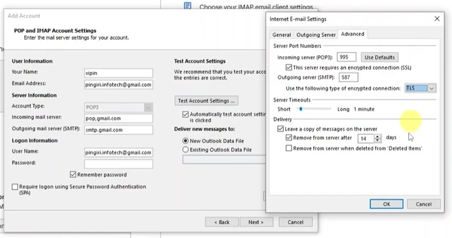
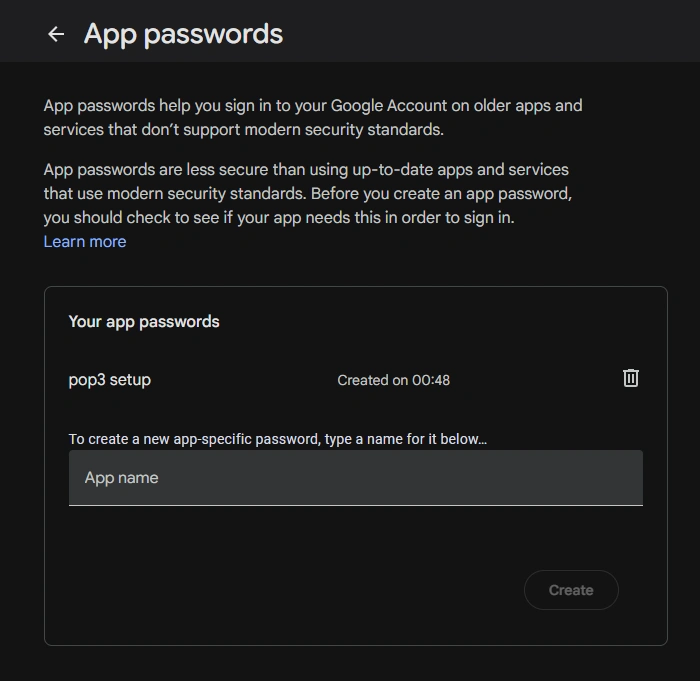

---
title: "Gmail"
discription: gmail fucks
date: 2024-07-10T20:29:01+08:00 
draft: false
type: post
tags: ["mail","gmail"]
showTableOfContents: true
--- 


Settings :




```
pop.gmail.com
```
```
smtp.gmail.com
```
```
POP3 = 995 
SMTP = 587
```
WEB:
```
https://myaccount.google.com/apppasswords
```



