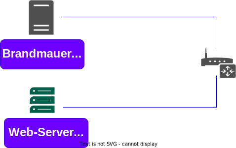

### Process

all process `ps -auxf` 


see all zombie process `ps -aux | grep 'Z'` 

see systemd
`ps -p 1`


SIGKILL --9 
SIGKILL --15

kill -9 PID

### Symlink & Hardlink


Symlink example: 

`ln original_file symlink1`

for Read: `readlink symlink1`  

for search `find . -type l` 

for see inode `stat original_file` 

Hardlink example:

`ln original_file hardlink1`

see number of **inode** 'stat original_file' 


see how many hardlinks `find . -inum 672135`

inode - inode is a data structure that stores information about a file or directory in a file system.

Hardlink its like original file


**Hardlink -> inode <- file <- Symlink**


### Password

`etc/password` and `etc/shadow`

change password 

`passwd username`

### Group

were can find group `etc/group`and password of groups `etc/gshadow`

```bash
sudo groupadd devops

sudo usermod -a -G devops username
```

delete group `delgroup` 


name

### Add users 

`useradd username -b /home/username -c "Username Usernamov" -g usergroup -p password`

new command 

`adduser  username`

change home directory to user:

`sudo usermod -d /home/evil -m username`

delete `userdel username`


### find someting..

`whereis passwd`

`ls -la /usr/bin/passwd


### SUID GSID Sticky

**USER + S(pecial)**

Commonly noted as **SUID**, the special permission for the user access level has a single function: A file with **SUID** always executes as the user who owns the file, regardless of the user passing the command. If the file owner doesn't have execute permissions, then use an uppercase **S** here.

Now, to see this in a practical light, let's look at the `/usr/bin/passwd` command. This command, by default, has the **SUID** permission set:

```bash
[tcarrigan@server ~]$ ls -l /usr/bin/passwd 
-rwsr-xr-x. 1 root root 33544 Dec 13  2019 /usr/bin/passwd

```
Note: the **s** where **x** would usually indicate execute permissions for the user.\

command 
`chmod u+s file`

**Group + S(pecial)**

Commonly noted as **SGID**, this special permission has a couple of functions:

- If set on a file, it allows the file to be executed as the **group** that owns the file (similar to **SUID**)

- If set on a directory, any files created in the directory will have their **group** ownership set to that of the directory owner

```bash
[tcarrigan@server article_submissions]$ ls -l 
total 0
drwxrws---. 2 tcarrigan tcarrigan  69 Apr  7 11:31 my_articles
```

This permission set is noted by a lowercase **s** where the **x** would normally indicate **execute** privileges for the **group**. It is also especially useful for directories that are often used in collaborative efforts between members of a group. Any member of the group can access any new file. This applies to the execution of files, as well. **SGID** is very powerful when utilized properly.

As noted previously for SUID, if the owning group does not have execute permissions, then an uppercase S is used.
&nbsp;
command: `chmod g+s directory`


**Other + t (sticky)**
The last special permission has been dubbed the "sticky bit." This permission does not affect individual files. However, at the directory level, it restricts file deletion. Only the **owner** (and root) of a file can remove the file within that directory. A common example of this is the /tmp directory:
```bash
[tcarrigan@server article_submissions]$ ls -ld /tmp/
drwxrwxrwt. 15 root root 4096 Sep 22 15:28 /tmp/
```


The permission set is noted by the lowercase **t**, where the **x** would normally indicate the execute privilege.

command 'chmod +t directory'


### Programs for working with packages

internal: 

see all packages in system

`dpkg -l`

search packages in system

`dpkg -s firefox-dbg`

know what files 

`dpkg -s` 

what files belong to the package

`dpkg -L openssh-client`

for install `dpkg -i program.deb` for remove  `dpkg -r program.deb`


search package

`apt-cache search telegram`

for search version of package

`apt-cache policy openssh-client`

and install version 1.8 `apt-get install openssh-client=1.8`


### link from where download files

`cat etc/sources.list` 


### Systemd 

where `usr/lib/systemd/system`

all units `systemctl list-units` for service `systemctl list-units type=service`

reload after change `systemctl daemon-reload`

for see logs `systemctl -u unitname`

Create unit in systemd 

`nano etc/systemd/system/apt.updater.service`

```bash
[Unit]
Description=Example of Systemd Unit

[Service]
Type=oneshot
ExecStart=apt-get update

[Install]
WantedBy=multi.user.target
```
Create unit in systemd timer

`nano etc/systemd/system/apt.updater.timer`

```bash
[Unit]
Description=Runs apt-get update every hour

[Timer]
onUnitActiveSec=1h
Unit=apt-updater.service

[Install]
WantedBy=multi.user.target
```
&nbsp;

### Mount disk iso 

```bash
sudo mkdir /media/ubuntu_iso 

sudo mount /home/victor/Downloads/ubuntu-20.04.2-live-server.amd64.iso /media/ubuntu_iso/ -o loop

```

see mount disk `df -h`  advanced `mount | grep ubuntu_iso` 

&nbsp;

**dd** 
```bash
echo "123456" > file 

dd if=file 
```
**img** from disk

```
dd if=/dev/sda1 of=sda1.img bs=4096
```

* bs - block of file = 4096 kb 

delete all files with zero  0000000000000
```bash
dd if=/dev/zero of=/dev/sdx bs=4096
```


### Mount hardisk


see all partition `fdisk -l` 

```bash
sudo fdisk /dev/sdb
```
- m - see all command

- g - create new GPT partition table

- w - write 

to create ext4 
```
sudo mkfs.ext4 -F /dev/sdb1
```
&nbsp;

mount manual but after restart will disappear

```bash
sudo mkdir /media/data/

sudo mount /dev/sdb1/ /media/data/
```
to auto mount after restart, to know **UUID** `sudo blkid `

```bash
sudo  nana /etc/fstab/
```


## .deb

see in deb package 
```
ar t package.deb
```
- tar.xz - its zip arhive

see in archive files 
```
ar p package.deb debian-binary
```
for see `tar.zx` files 
```
ar p package.deb debian.tar.xz | tar -tv -J
```
unzip arhive 
```
ar x package.deb
```
unzip archive `tar.xz`
```
tar xfv control.tar.xz
```
### Create .deb 

fist
```
sudo apt install dh-make devscripts
```
create need folder
```
mkdir mvdir-0.1
```
need in directory
```
cd mvdir
```

copy file `mvdir.sh` to folder `mvdir-01` 
```
cp ../../mvdir.sh .
```

edit `bashrc` 
```
nano /home/dan/.bashrc
```

add it and save
```
export CITY=Jerusalem
export DEBMAIL="dan@local"
export DEBFULLNAME="Dan"
```


run command source and for test `echo $DEBMAIL`
```
source /home/dan/.bashrc
```


for make sample deb need run in your folder `mvdir-01`
```
dh_make --indep --createorig
```
- indep - its be run for all system linux where have bash

- createorig - the file specified with `-f`  is copied in place. If no `-f`  is supplied either but `--createorig` is, the current directory is created into a new archive

&nbsp;
&nbsp;

you can see new file in folder and remove all `.ex` files `rm *.ex` and  `rm README`

now need create new file `nano install` and write: 
```
mvdir.sh usr/bin/
```
- if we have many bash scripts use `*.sh usr/bin` 

for change file `changelog` use command `dch`

for build .deb 
```
debuild -us -uc 
```
- `-us` - unsigned source it instructs no to sign the source files of the package with gpg key before create the package

- `-uc` - unsigned changes it instructs no to sign `changelog` files before creating the package

to install deb package to remove `-r`
```
sudo dpkg -i  package.deb
```

### Sign package deb

to create keys 
```
gpg --gen-key
```
to change and update version of changelog file.(achtung! email and name must be the same gpg-keys)
```
dch -i
```
`-i` - increment update change version of changelog


see gpg keys
```bash
gpg --list-keys
```
now sign build package 
```bash
debuild -b
```
to export gpg key
```bash
gpg --export -a "dan@local" > public.key
```

&nbsp;

&nbsp;

### Monitoring and Proc


see version linux or `uname -a` uname take information from:
```bash
cat /proc/version
```

see cpu info
```bash
cat /proc/cpuinfo
```
see time online
```bash
cat /proc/uptime 
```
see devices
```bash
cat /proc/devices
```
see what filesystems support 
```bash
cat /proc/filesystems
```
see all mounts 
```bash
cat /proc/mounts
```

&nbsp;

&nbsp;

see mem and swap ram 
```bash
free -h
```
oom killer score s
```bash
cat /proc/13/oom_score_adj
```
iftop to see internet traffic
```bash
iftop
```

### Ports 

see if port `8080` open
```bash
netstat -lptun | grep 8080
```


## Firewall

### Iptables

see all rules :
```
sudo iptables -L
```
for all rules and numbers and tables
```
sudo iptables --line-numbers -L -v -n
```
see rules only input :
```
sudo iptables -L INPUT  
```
all packet drop from 10.10.10.10 
```
sudo iptables INPUT -s 10.10.10.10 -j DROP 
```
all packet go to 10.10.10.10 drop
```
sudo iptables OUTPUT -s 10.10.10.10 -j DROP 
```
all packege drop to 10.10.10.0/24
```
sudo iptables OUTPUT -s 10.10.10.0/24 -j DROP 
```
all packet from 10.10.10.10 be drop to port 22
```
sudo iptables -A INPUT -p tcp --dport 22 -s 10.10.10.10 -j DROP 
```
to accept all 
```
sudo iptables -P INPUT ACCEPT 
```
disable ICMP answer 
```
sudo iptables -A INPUT -p icmp --icmp-type 8 -j DROP
```
for delete rules: 
```
sudo iptables -D s 10.10.10.0 =j DROP
```
all clean rules:
```
iptables -F
```
### Iptables persistent

we need iptables-persistent for be save after restart:

install
```
apt install iptables-persistent
```
run and save rules
```
sudo service netfilter-persistent save 
```
to see changes netfilter file
```
cat /etc/iptables/rules.v4
```
to restore all rules in file 
``` 
iptables-restore < /etc/iptables/rules.v4
```
```
sudo sh -c "iptables-restore < /etc/iptables/rules.v4"
```


### NAT forward



to destination
```
iptables -t nat -A PREROUTING -p tcp -d 192.168.0.2 --dport 80 -j DNAT --to-destination 192.168.0.3:80
```
to source
```
iptables -t nat -A POSTROUTING -p tcp -d 192.168.0.3 --dport 80 -j SNAT --to-source 192.168.0.2:80
```

to source use masquerade
```
iptables -t nat -A POSTROUTING -p tcp -d 192.168.0.3 MASQUERADE 
```


## MAIL 


## Simple Command

### Delete

delete files and folder
```
rm -rf <folder>
```

### Program Dependencies

```
ldd /usr/bin/bash
```


### Tree 

```
tree folder/
```

all tree process
```
sudo pstree
```

```
```

```
```

```
```

```
```

```
```

```
```

```
```


## System_Commands

List the file/folder in the current directory.
```bash
ls 
```
List files/folders in a current directory in detailed format.
```bash
ls -larth
```
Shows detailed information about the file or directory.
```bash
stat <fileName/dirName>
```
View calendar.
```bash
cal
```
Shows the name of the system host.
```bash
hostname
```
Shows the host id of the system assigned by the OS.
```bash
hostid
```
Show the current data and time in UTC format
```bash
date 
```
Shows the currently logged-in username of the terminal.
```bash
whoami
``` 
Shows the elapsed time duration since the machine logged in.
```bash
uptime
```
Unix name.
```bash
uname
``` 
Clears the screen.
```bash
clear
``` 
Lists all the commands executed until now.
```bash
history
``` 
Super User Do
```bash
sudo -i
```
Shows the exit status of the last executed command (0 — success, 1–255 — error/failure).
```bash
echo $?
```
Restart the machine immediately (-r restart).
```bash 
shutdown -r now
```
Displays all the environment variables of the Linux system.
```bash
printenv
```
Shows previous logins in the Linux system.
```bash 
Last
```
## Directory Commands 

Shows the present working directory (abbr. Print Working Directory).
```bash 
pwd
```
Change directory.
```bash
cd
```
Changes to its parent directory (i.e.) one level up.
```bash
cd ..
```
Change to the directory mentioned.
```bash
cd <dirName>
```
Changes to the currently logged-in user’s home directory.
```bash
cd ~ or cd
```
Changes the directory two levels up.
```bash
cd ../..
```
Changes to the last working directory.
```bash
cd 
``` 
Creates the directory.
```bash
mkdir <dirName>
```
Creates a directory with its parent directories if it does not exist (-p parent).
```bash
mkdir -p <pathOftheDir> 
```

## File Commands →

Creates an empty file or updates the timestamp of the existing file.
```bash
touch
```
Creates a single empty file.
```bash
touch <fileName>
```
Creates file1, file2 empty files.
```bash
touch <file1> <file2>
```
Concatenates and displays the contents of files.
```bash
cat
```
Displays the contents of the file.
```bash
cat <fileName>
```
Creates a new file, allows to input content interactively and redirects inputted content to the created file (> redirection operator).
```bash
cat > <fileName>
```
Displays first 10 lines of the file by default.
```bash
head <fileName>
```
Displays first 5 lines of the file (-n number)
```bash
head -n 5 <fileName>
```
Displays the last 10 lines of the file by default.
```bash
tail <fileName>
```
Displays last 5 lines of the file (-n number).
```bash
tail -n 5 <fileName>
```
Displays contents of the file in real-time even when the file is rotated or replaced (used for log file monitoring).
```bash
tail -F <fileName> 
```
Used to view large files (log files) in a paginated manner.
```bash
less <fileName>
```
rm — remove commands 

Removes the file.
```bash
rm <fileName> 
```
Removes files & folders of directory recursively (-r recursive).
```bash
rm -r <dirName>
```
Force remove the files & folders of directory recursively (-f force).
```bash
rm -rf <dirName> 
```
cp — copy commands

Copy the files and folders from source to destination.
```bash
cp <source> <destination>
```
Copy dir1 directory to dir2 directory recursively (-r recursive).
```bash
cp -r <dir1> <dir2> 
```
Move or rename commands
```bash
mv
```
```bash
mv <fileName> <newFileName> — renames the file to a new name.
```
Moves the file to new path.
```bash
mv <oldFilePath> <newFilePath> 
```
## File Permission Commands

Changes mode/permissions of the file.
```bash
chmod <octalNumber> <fileName>
```
Changes mode/permissions of the directory recursively.
```bash
chmod <octalNumber> -R <dirName>
```
Changes the user ownership of a file.
```bash
chown <newUser> <fileName>
```
Changes the user & group ownerships of a file.
```bash
chown <newUser>:<newGroup> <fileName> 
```
Updates the group name for file/directory.
```bash
chgrp <groupName> <fileName/dirName>
```
Shows the file/directory access control list.
```bash
getfacl <fileName/dirName> 
```
Modifies the current acl of the file/directory.
```bash
setfacl -m u:<userName>:rwx <fileName/dirName>
```
Removes the acl permissions for the file/directory.
```bash
setfacl -x u:<userName>: <fileName/dirName>
```
Modifies the group acls for the file/directory.
```bash
setfacl -m g:<groupName>:rwx <fileName/dirName>
```
Removes the group acl permissions for the file/directory.
```bash
setfacl -x g:<groupName>: <fileName/dirName>
```
> File Permission Octal Numbers
> read (r) — 4, write (w)- 2, execute (x) — 1 => chmod 777 < file /folder_name >

### User Management Commands →
Creates a user account.
```bash
useradd
```
Creates user account without home & mail spool directories.
```bash
useradd <userName>
```
Creates user account with home & mail spool directories.
```bash
useradd -m <userName> 
```
Creates a password for the user and stores it in `/etc/shadow` file.
```bash
passwd <userName>
```
User delete.
```bash
userdel
```
Deletes the user from the system.
```bash
userdel <userName>
```
Deletes the user from the system along with home and mail spool directories (-r remove).
```bash
userdel -r <userName>
```
Stores information about user accounts.
```bash
/etc/passwd
```
Displays the complete list of users on that machine.
```bash
cat /etc/passwd
```
Stores the password for users in an encrypted format.
```bash
/etc/shadow 
```
Displays the complete list of user passwords on that machine.
```bash
cat /etc/shadow 
```
Substitute user.
```bash
su
```
Switches to the user mentioned.
```bash
su <userName>
```
To log out from that user.
```bash
exit 
```
Modify user.
```bash
usermod 
```
Adds the user to another group (-aG append the user to the group without removing from other groups).
```bash
usermod -aG <groupName> <userName>
```
Change shell.
```bash
chsh
```
Changes the shell to bash for the user.
```bash
chsh -s /bin/bash <user>
```
Changes the shell to sh for the user.
```bash
chsh -s /bin/sh <user>
```
### Group Management Commands →

Creates the group.
```bash
groupadd <groupName>
```
Delete the group.
```bash 
groupdel <groupName> 
```
Stores the information of the groups.
```bash
/etc/group
```
Displays the complete list of groups on that machine.
```bash
cat /etc/group 
```
Creates a password for the group.
```bash
gpasswd <groupName>
```
Adds the user to the group.
```bash
gpasswd -a <userName> <groupName> 
``` 
Removes the user from the group.
```bash
gpasswd -d <userName> <groupName> 
```
Adds multiple users to the group and removes the existing ones of the group.
```bash
gpasswd -M <userName1>,<userName2>,<userName3> <groupName>
```

### Searching Commands →

Used to search for files/directories based on names.
```bash
locate
```
Updates the database so the results are up-to-date.
```bash
sudo updatedb 
```
Locates the file/directory and displays the path.
```bash
locate <fileName/dirName> 
```

### GREP Command s— Global Regular Expression Print →
Used to find text patterns within files.
```bash
grep <textToSearch> <fileName>
```

Used to find text patterns within the file ignoring the case (-i ignore case).
```bash
grep -i <textToSearch> <fileName>
```
Used to find non matching lines of text patterns (-v invert-match).
```bash
grep -v <textToSearch> <fileName>
```
Used to display the matching string file names.
```bash
grep -l <textToSearch> <fileNames> 
```

### Find Commands →

Finds the mentioned file if available in the current directory (.(period) represents current directory).
```bash
find. -name <fileName> 
```
Finds the mentioned file in the directory.
```bash 
find <dirName> -name <fileName>
```
Finds the files in the directory having 754 permission.
```bash
find <dirName> -perm 754
```

### Hardware Commands →

Shows systems memory information ( -h human-readable format).
```bash
free -h  
```
Shows the disk space usage of mounted file systems.
```bash
df -h 
```
Disk usage.
```bash
du
``` 
Displays disk usage information (-h human-readable format).
```bash 
du -h 
```
Displays the total size of the directory instead of individual files in human-readable format (-s summarize).
```bash
du -sh 
```
Displays the total size of the file/directory.
```bash 
du -sh <fileName/dirName>
```

### Network Commands →

Tests the reachability & responsiveness of the remote host.
```bash
ping <hostName>
```


dig <domainName> — shows DNS information of the domain.
# wget <url>- used to retrieve/download files from the internet.
# curl — client URL.
# curl <url> — used to retrieve/download files from the internet.
# ifconfig — display available network interfaces.
# ip addr — display and manipulate network interface info.
# curl ifconfig.me — shows the public IP address of the machine.
# netstat -antp- shows all TCP open ports (-a all, t-tcp, n-active, p protocol).
# traceroute <url> — traces the route using packets from source to destination host.
10, Process Info Commands →
# ps — process status.
# ps — shows the currently running process.
# ps -u <userName>- shows the process of the username
# ps -ef — shows all the processes of the system.
# top — shows the real-time, dynamic view of the running processes of a system.
# kill <pid> — gracefully terminates the process pid.
# pgrep <processName> — shows process ID of processes based on name/other criteria.
# bg — background, sends the process to the background & continues execution without interruption.
# fg — foreground, brings the process to the foreground and makes it an active process.
# nohup — no hangup, runs command/script in the background even after the terminal is closed or the user logs out.
11, Archiving File Commands →
# tar — tape archive.
# tar -cvf <fileName> <directory> — creates the tar file with the fileName for the directory mentioned (-c create, -v verbose, -f output file name).
# tar -xvf <sourceTarFileName> -C <destinationDir> — pand download to destination dir).

## Package Manager — LINUX DISTROS 

- apt — Package Manager for Debian-based Linux distributions Eg: Ubuntu.
- yum — Package Manager for Redhat-based Linux distributions Eg: Amazon_Linux.


## Repository

Disable
```bash
sudo apt-get update --allow-unauthenticated
```

```bash
sudo apt-get update --allow-insecure-repositories
```


