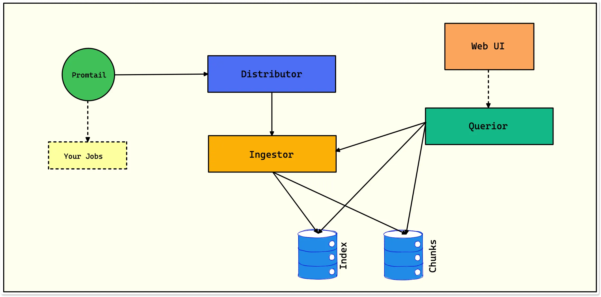

---
title: "Loki"
discription: :oki 
date: 2023-08-01T21:29:01+08:00 
draft: false
type: post
tags: ["Linux","logging","Graphana","Loki"]
showTableOfContents: true
--- 

***The architecture of Loki***

A brief overview of components in Loki architecture:

- Promtail - It is the log collection agent that runs on each node of a Kubernetes cluster.

- Distributor - The first component to receive logs from promtail.

- Ingestor - It builds compressed chunks of log data and flushes them out as chunks.

- Querior - It handles the read path, scanning the index to figure out which chunks match