---
title: "MacOS"
discription: install all on macos
date: 2024-11-01T21:29:01+08:00 
draft: false
type: post
tags: ["Macos","VPN","Remote"]
showTableOfContents: true
--- 

## MacOS Sequoia

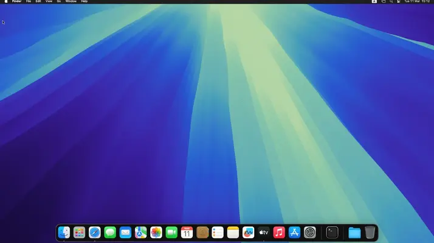

### Install Anydesk and Permission

1. Open  https://anydesk.com

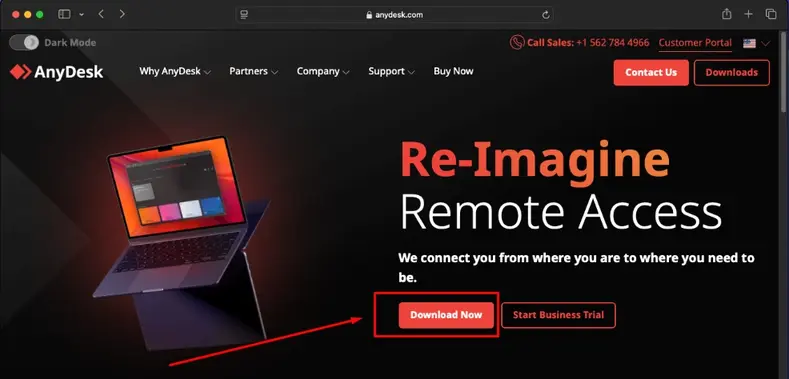

2. Click-on `Allow`

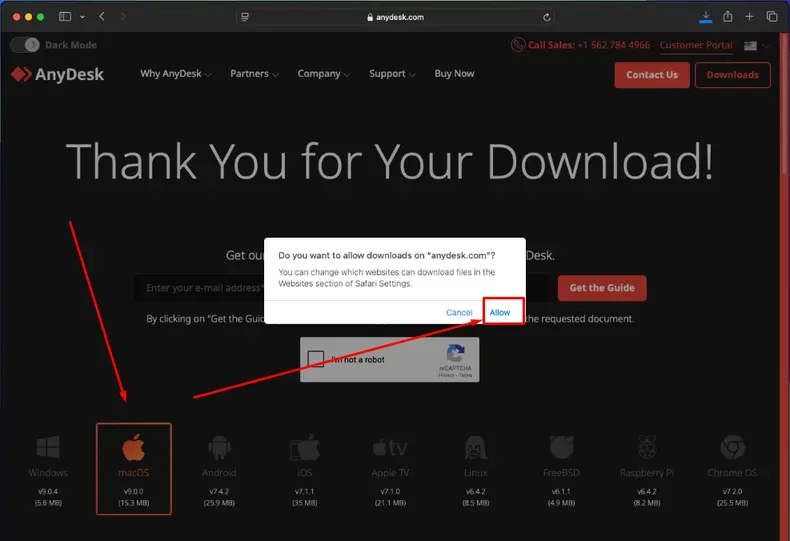

3. Double-click on icon

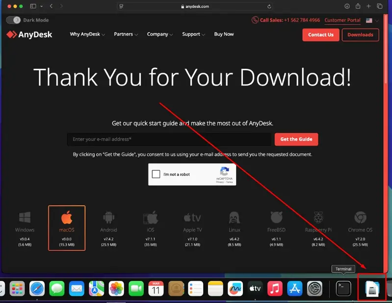

4. Double-click on `anydesk.dmg` and drag `Anydesk` on `Applications`

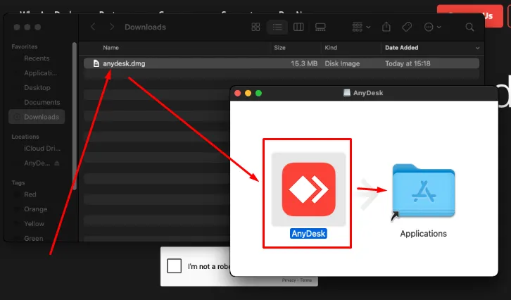

5. Double-click on icon `Applications` after double-click on icon `Anydesk`

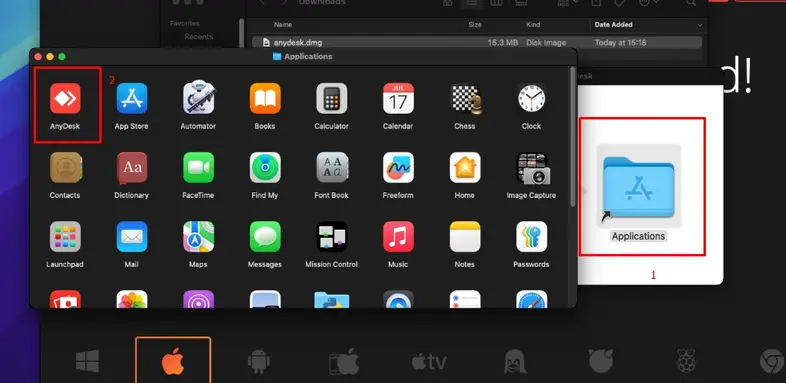

6. Click on `Open`

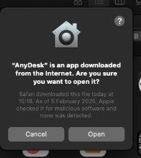

7. Click on `Allow`

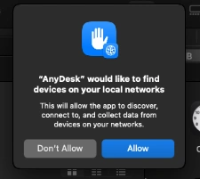

8. Now need give permission for `Screen Recording` and `Accessibility`

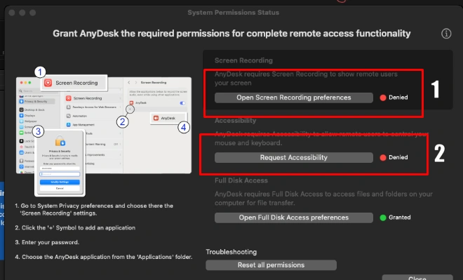

9. Switch it to ON and enter your password

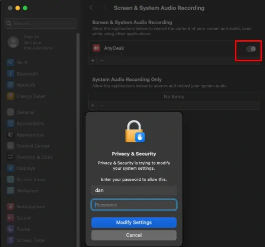

10. Click on `Ouit & Reopen` 

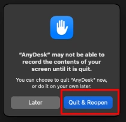

11. Now need give permission to Accessibility

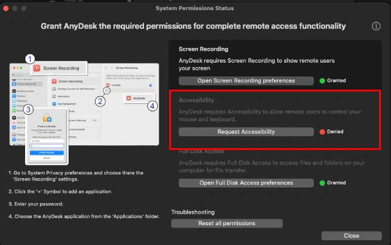

12. Switch it to ON

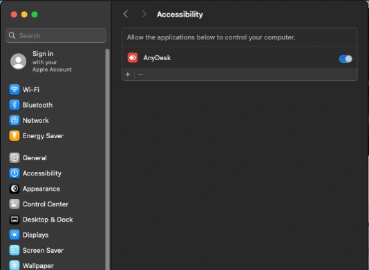

14. All now Granted!

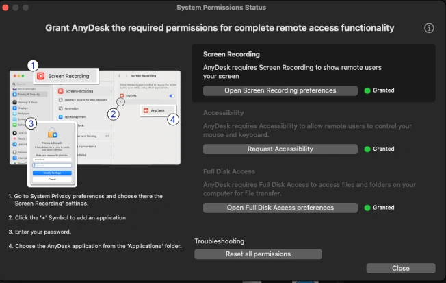

15. Now can give address number to connect 

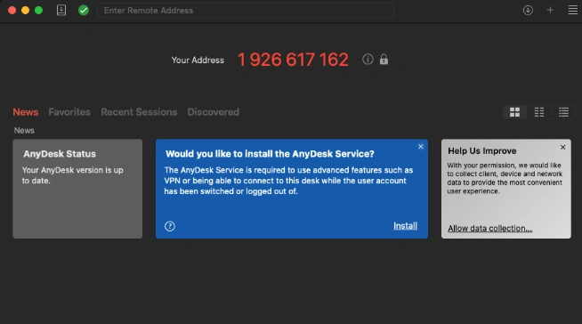

> DONE

### Install FortiClient VPN

1. Open https://www.fortinet.com and scroll down 

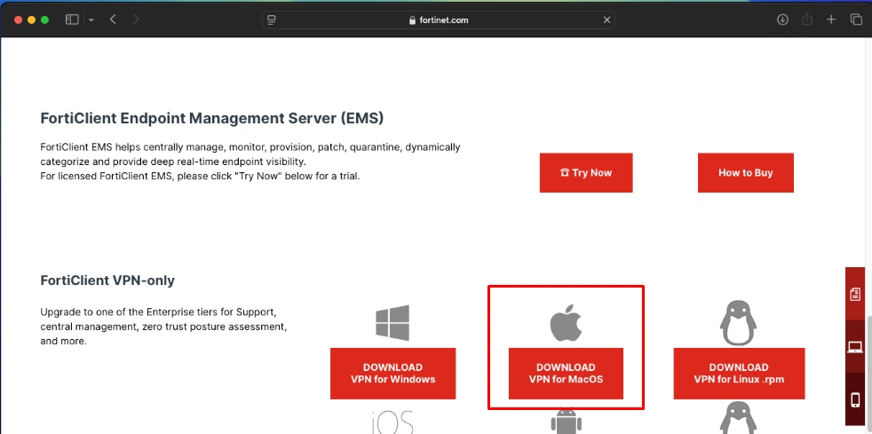

2. Fill in all for download  
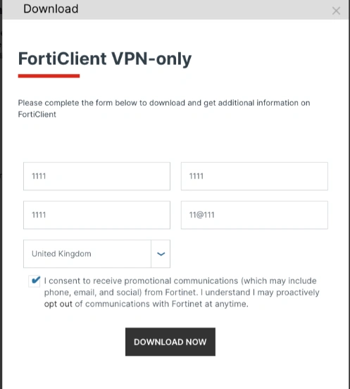

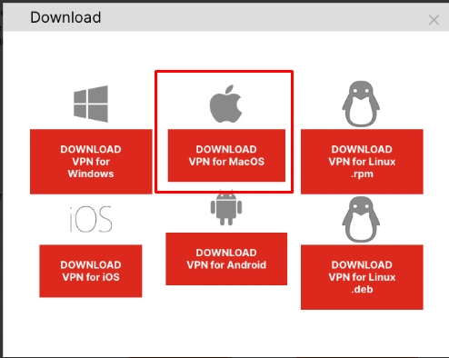

3. Allow it

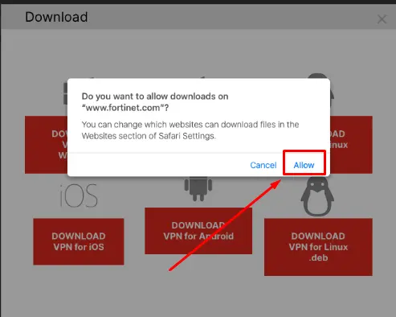

4.

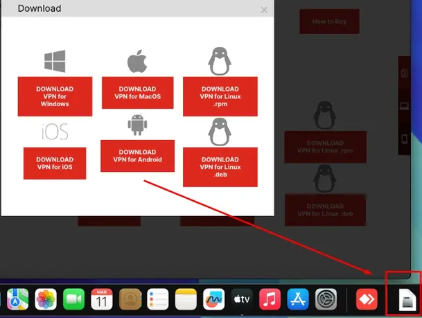

5.

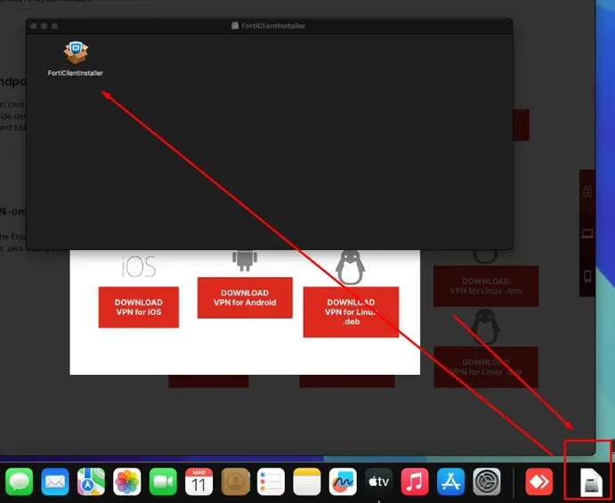

6.

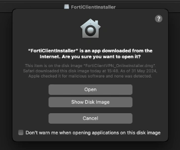

7.

8.

9.

10.

11.

