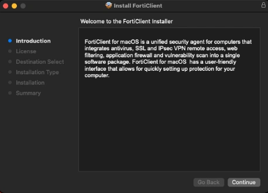
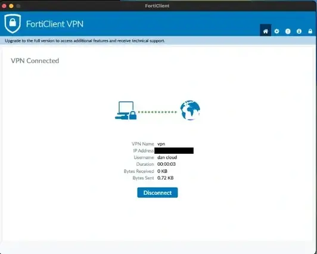

---
title: "MacOS"
discription: install all on macos
date: 2024-11-01T21:29:01+08:00 
draft: false
type: post
tags: ["Macos","VPN","Remote"]
showTableOfContents: true
--- 

## MacOS Sequoia

### Install Anydesk and Allow Permissions

1. Open  https://anydesk.com

2. Click-on `Allow`

3. Double-click on icon

4. Double-click on `anydesk.dmg` and drag `Anydesk` on `Applications`

5. Double-click on icon `Applications` after double-click on icon `Anydesk`

6. Click on `Open`

7. Click on `Allow`

8. Now need give permission for `Screen Recording` and `Accessibility`

9. Switch it to ON and enter your password

10. Click on `Ouit & Reopen` 

11. Now need give permission to Accessibility

12. Switch it to ON

14. All now Granted!

15. Now can give address number to connect 

> DONE

### Install FortiClient VPN and Allow Permissions

1. Open https://www.fortinet.com and scroll down 

2. Fill all and download  

3. Allow it

4. Click on it 

5. Double-click on `FortiClientInstaller`

6. Click on `Open`

7. Continue... Continue.. Agree.. Continue..

8. Click Install, full password and click install software

9. OK

10. Allow

11. Close

12. Double-clik on icon FortiClient (upper corner)

13. Press [ x ] and access 

14. Fill all `12.12.12.12` change to your IP and Save 

15. Connect

16. Open Security & Privacy Settings

17. General > Login items & Extensions > Network Extensions

18. Fill your password 

19. Reconnect to VPN

> Done!

### Install Windows App 

1. Download and Install Windows App from Apple store https://apps.apple.com/us/app/windows-app/

2. Open Windows App and Allow it

3. Device > + > Add PC

4. target machine ip and save

5. Doble click on icon after add your credentials and connect

> Done !

