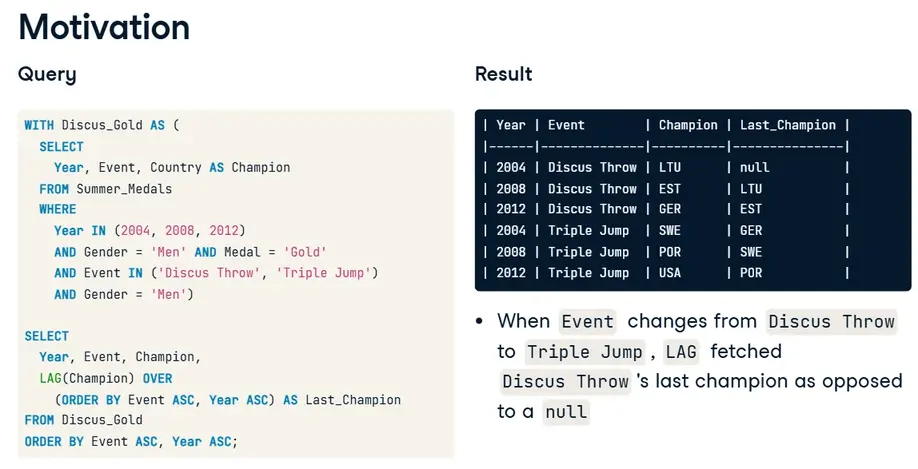
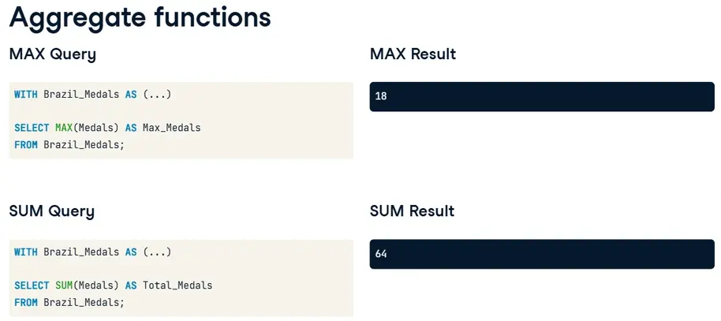
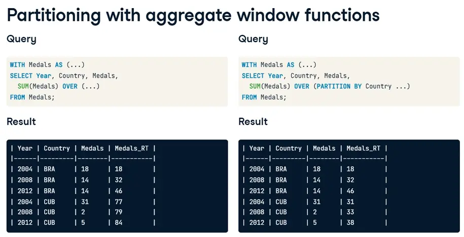
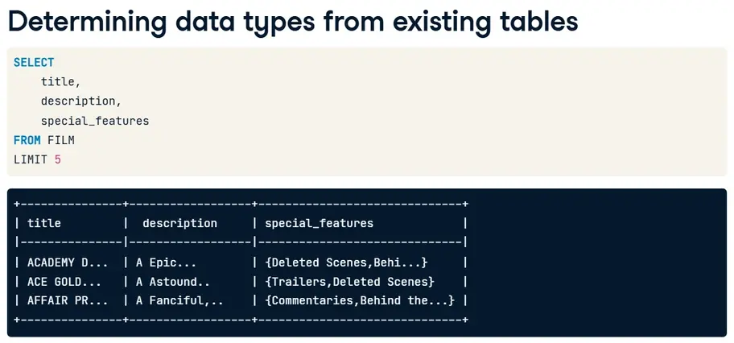
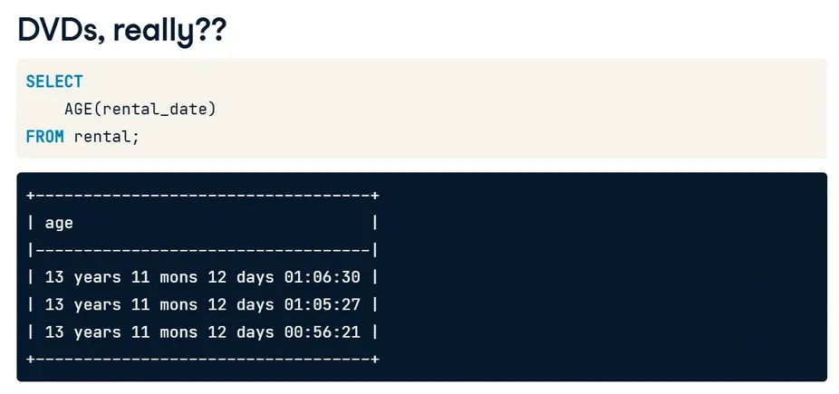

---
title: "PostgreSQL"
discription: PostgreSQL
date: 2025-10-09T21:29:01+08:00 
draft: false
type: post
tags: ["PostgreSQL","Database"]
showTableOfContents: true
--- 


&nbsp;&nbsp;&nbsp;

&nbsp;&nbsp;&nbsp;

## PostgreSQL Summary stats and window functions 

### Introduction to windows functions 


&nbsp;&nbsp;&nbsp;

&nbsp;&nbsp;&nbsp;

#### Window functions

- Perform calculations across a set of table rows that are somehow related to the current row

- Similar to `GROUP BY` aggregation, but all rows remain in the output (no grouping)

**Uses**

- Fetching values from preceding or following rows (e.g. fetching the previous row's value)

  - Determining reigning champion status

  - Calculating growth over time

- Assigning ordinal ranks (1st, 2nd, etc.) to rows based on their values' positions in a sorted list

- Running totals, moving averages

&nbsp;&nbsp;&nbsp;

&nbsp;&nbsp;&nbsp;


&nbsp;&nbsp;&nbsp;

####  FUNCTION_NAME()

- The specific operation to perform

- Examples: `ROW_NUMBER()`, `RANK()`, `SUM()`, `AVG()`, `LAG()`,` LEAD()`

&nbsp;&nbsp;&nbsp;

#### OVER()

- Defines the "window" - the set of rows to perform calculations on

- `OVER()` with empty parentheses means "all rows in the result set"

&nbsp;&nbsp;&nbsp;

&nbsp;&nbsp;&nbsp;

#### Key Clauses inside OVER():

#### PARTITION BY
- Divides the result set into groups/partitions (similar to GROUP BY but without collapsing rows)

- Example: `OVER (PARTITION BY Country)` - calculations are done separately for each country

&nbsp;&nbsp;&nbsp;

&nbsp;&nbsp;&nbsp;

#### ORDER BY

- Sorts the rows within each window/partition

- Example: `OVER (ORDER BY Year)` - orders rows by year

&nbsp;&nbsp;&nbsp;

&nbsp;&nbsp;&nbsp;

#### ROWS/RANGE PRECEDING/FOLLOWING/UNBOUNDED

- Defines the frame - which specific rows to include in the window:

  - **PRECEDING** - rows before the current row

  - **FOLLOWING** - rows after the current row

  - **UNBOUNDED** - all rows from the start/end

  - **CURRENT ROW** - the current row

&nbsp;&nbsp;&nbsp;

&nbsp;&nbsp;&nbsp;

```sql
-- Number all rows sequentially
ROW_NUMBER() OVER ()

-- Number rows within each country group
ROW_NUMBER() OVER (PARTITION BY Country)

-- Rank by year within each country
RANK() OVER (PARTITION BY Country ORDER BY Year)

-- Running total by year
SUM(Medals) OVER (ORDER BY Year ROWS UNBOUNDED PRECEDING)
```

Assign a number to each year in which Summer Olympic games were held.
```sql
SELECT
  Year,

  -- Assign numbers to each year
  ROW_NUMBER() OVER() AS Row_N
FROM (
  SELECT DISTINCT year
  FROM Summer_Medals
  ORDER BY Year ASC
) AS Years
ORDER BY Year ASC;
```
&nbsp;&nbsp;&nbsp;

&nbsp;&nbsp;&nbsp;

&nbsp;&nbsp;&nbsp;

### ORDER BY


&nbsp;&nbsp;&nbsp;

&nbsp;&nbsp;&nbsp;

#### Enter ORDER BY

`ORDER BY` in `OVER` orders the rows related to the current row

**Example:** Ordering by year in descending order in `ROW_NUMBER`'s `OVER` clause will assign 1 to the most recent year's rows


&nbsp;&nbsp;&nbsp;

#### Reigning champion

- A reigning champion is a champion who's won both the previous and current years' competitions

- The previous and current year's champions need to be in the same row (in two different columns)

&nbsp;&nbsp;&nbsp;

#### Enter LAG

- `LAG(column, n) OVER (...)` returns `column`'s value at the row `n` rows before the current row
  - `LAG(column, 1) OVER (...)` returns the previous row's value 

&nbsp;&nbsp;&nbsp;


&nbsp;&nbsp;&nbsp;

Assign a number to each year in which Summer Olympic games were held so that rows with the most recent years have lower row numbers.
```sql
SELECT
  Year,
  -- Assign the lowest numbers to the most recent years
  ROW_NUMBER() OVER (ORDER BY Year DESC) AS Row_N
FROM (
  SELECT DISTINCT Year
  FROM Summer_Medals
) AS Years
ORDER BY Year;
```
&nbsp;&nbsp;&nbsp;

For each athlete, count the number of medals he or she has earned.
```sql
SELECT
  -- Count the number of medals each athlete has earned
  athlete,
  COUNT(medal) AS Medals
FROM Summer_Medals
GROUP BY Athlete
ORDER BY Medals DESC;
```
&nbsp;&nbsp;&nbsp;
Having wrapped the previous query in the Athlete_Medals CTE, rank each athlete by the number of medals they've earned.
```sql
WITH Athlete_Medals AS (
  SELECT
    -- Count the number of medals each athlete has earned
    Athlete,
    COUNT(*) AS Medals
  FROM Summer_Medals
  GROUP BY Athlete)

SELECT
  -- Number each athlete by how many medals they've earned
  athlete,
  ROW_NUMBER() OVER (ORDER BY medals DESC) AS Row_N
FROM Athlete_Medals
ORDER BY Medals DESC;
```
&nbsp;&nbsp;&nbsp;

Return each year's gold medalists in the Men's 69KG weightlifting competition.
```sql
SELECT
  -- Return each year's champions' countries
  year,
  country AS champion
FROM Summer_Medals
WHERE
  Discipline = 'Weightlifting' AND
  Event = '69KG' AND
  Gender = 'Men' AND
  Medal = 'Gold';
```
Having wrapped the previous query in the Weightlifting_Gold CTE, get the previous year's champion for each year.
```sql
WITH Weightlifting_Gold AS (
  SELECT
    -- Return each year's champions' countries
    Year,
    Country AS champion
  FROM Summer_Medals
  WHERE
    Discipline = 'Weightlifting' AND
    Event = '69KG' AND
    Gender = 'Men' AND
    Medal = 'Gold')

SELECT
  Year, Champion,
  -- Fetch the previous year's champion
  LAG(Champion) OVER
    (ORDER BY YEAR ASC) AS Last_Champion
FROM Weightlifting_Gold
ORDER BY Year ASC;
```
&nbsp;&nbsp;&nbsp;

&nbsp;&nbsp;&nbsp;

&nbsp;&nbsp;&nbsp;

### PARTITION BY



&nbsp;&nbsp;&nbsp;

#### Enter PARTITION BY

- `PARTITION BY` splits the table into partitions based on a column's unique values

   - The results aren't rolled into one column

Operated on separately by the window function

   - `ROW_NUMBER` will reset for each partition

   - `LAG` will only fetch a row's previous value if its previous row is in the same partition


&nbsp;&nbsp;&nbsp;

Return the previous champions of each year's event by gender.
```sql
WITH Tennis_Gold AS (
  SELECT DISTINCT
    Gender, Year, Country
  FROM Summer_Medals
  WHERE
    Year >= 2000 AND
    Event = 'Javelin Throw' AND
    Medal = 'Gold')

SELECT
  Gender, Year,
  Country AS Champion,
  -- Fetch the previous year's champion by gender
  LAG(Country) OVER (PARTITION BY Gender
            ORDER BY Year ASC) AS Last_Champion
FROM Tennis_Gold
ORDER BY Gender ASC, Year ASC;
```
&nbsp;&nbsp;&nbsp;

Return the previous champions of each year's events by gender and event.
```sql
WITH Athletics_Gold AS (
  SELECT DISTINCT
    Gender, Year, Event, Country
  FROM Summer_Medals
  WHERE
    Year >= 2000 AND
    Discipline = 'Athletics' AND
    Event IN ('100M', '10000M') AND
    Medal = 'Gold')

SELECT
  Gender, Year, Event,
  Country AS Champion,
  -- Fetch the previous year's champion by gender and event
  LAG(Country) OVER (PARTITION BY Gender, Event
            ORDER BY Year ASC) AS Last_Champion
FROM Athletics_Gold
ORDER BY Event ASC, Gender ASC, Year ASC;
```
&nbsp;&nbsp;&nbsp;

&nbsp;&nbsp;&nbsp;

&nbsp;&nbsp;&nbsp;

### Fetching

#### The four functions

**Relative**

- `LAG(column, n)` returns `column`'s value at the row n rows before the current row

- `LEAD(column, n)` returns `column`'s value at the row n rows after the current row

**Absolute**

- `FIRST_VALUE(column)` returns the first value in the table or partition

- `LAST_VALUE(column)` returns the last value in the table or partition


&nbsp;&nbsp;&nbsp;

For each year, fetch the current gold medalist and the gold medalist 3 competitions ahead of the current row.
```sql
WITH Discus_Medalists AS (
  SELECT DISTINCT
    Year,
    Athlete
  FROM Summer_Medals
  WHERE Medal = 'Gold'
    AND Event = 'Discus Throw'
    AND Gender = 'Women'
    AND Year >= 2000)

SELECT
  -- For each year, fetch the current and future medalists
  year,
  Athlete,
  LEAD(Athlete, 3) OVER (ORDER BY Year ASC) AS Future_Champion
FROM Discus_Medalists
ORDER BY Year ASC;
```
&nbsp;&nbsp;&nbsp;

Return all athletes and the first athlete ordered by alphabetical order.
```sql
WITH All_Male_Medalists AS (
  SELECT DISTINCT
    Athlete
  FROM Summer_Medals
  WHERE Medal = 'Gold'
    AND Gender = 'Men')

SELECT
  -- Fetch all athletes and the first athlete alphabetically
  athlete,
  FIRST_VALUE(athlete) OVER(ORDER BY athlete ASC) AS First_Athlete
FROM All_Male_Medalists;
```
&nbsp;&nbsp;&nbsp;

- Return the year and the city in which each Olympic games were held.

- Fetch the last city in which the Olympic games were held.
```sql
WITH Hosts AS (
  SELECT DISTINCT Year, City
    FROM Summer_Medals)

SELECT
  Year,
  City,
  -- Get the last city in which the Olympic games were held
  LAST_VALUE(city) OVER (
   ORDER BY year ASC
   RANGE BETWEEN
     UNBOUNDED PRECEDING AND
     UNBOUNDED FOLLOWING
  ) AS Last_City
FROM Hosts
ORDER BY Year ASC;
```
&nbsp;&nbsp;&nbsp;

&nbsp;&nbsp;&nbsp;

&nbsp;&nbsp;&nbsp;

### Ranking

#### The ranking functions

- `ROW_NUMBER()` always assigns unique numbers, even if two rows' values are the same

- `RANK()` assigns the same number to rows with identical values, skipping over the next numbers in such cases

- `DENSE_RANK()` also assigns the same number to rows with identical values, but doesn't skip over the next numbers

&nbsp;&nbsp;&nbsp;


&nbsp;&nbsp;&nbsp;

&nbsp;&nbsp;&nbsp;


&nbsp;&nbsp;&nbsp;

&nbsp;&nbsp;&nbsp;

Rank each athlete by the number of medals they've earned -- the higher the count, the higher the rank -- with identical numbers in case of identical values.
```sql
WITH Athlete_Medals AS (
  SELECT
    Athlete,
    COUNT(*) AS Medals
  FROM Summer_Medals
  GROUP BY Athlete)

SELECT
  Athlete,
  Medals,
  -- Rank athletes by the medals they've won
  RANK() OVER (ORDER BY medals DESC) AS Rank_N
FROM Athlete_Medals
ORDER BY Medals DESC;
```
&nbsp;&nbsp;&nbsp;
Rank each country's athletes by the count of medals they've earned -- the higher the count, the higher the rank -- without skipping numbers in case of identical values.
```sql
WITH Athlete_Medals AS (
  SELECT
    Country, Athlete, COUNT(*) AS Medals
  FROM Summer_Medals
  WHERE
    Country IN ('JPN', 'KOR')
    AND Year >= 2000
  GROUP BY Country, Athlete
  HAVING COUNT(*) > 1)

SELECT
  Country,
  -- Rank athletes in each country by the medals they've won
  athlete,
  DENSE_RANK() OVER (PARTITION BY Country
                ORDER BY Medals DESC) AS Rank_N
FROM Athlete_Medals
ORDER BY Country ASC, RANK_N ASC;
```
&nbsp;&nbsp;&nbsp;

&nbsp;&nbsp;&nbsp;

&nbsp;&nbsp;&nbsp;

### Paging

#### What is paging?

- **Paging**: Splitting data into (approximately) equal chunks

- **Uses**
  - Many APIs return data in "pages" to reduce data being sent

  - Separating data into quartiles or thirds (top middle 33%, and bottom thirds) to judge performance

#### Enter NTILE

- `NTILE(n)` splits the data into `n` approximately equal pages


&nbsp;&nbsp;&nbsp;

&nbsp;&nbsp;&nbsp;

Split the distinct events into exactly 111 groups, ordered by event in alphabetical order.
```sql
WITH Events AS (
  SELECT DISTINCT Event
  FROM Summer_Medals)
  
SELECT
  --- Split up the distinct events into 111 unique groups
  Event,
  NTILE(111) OVER (ORDER BY event ASC) AS Page
FROM Events
ORDER BY Event ASC;
```
&nbsp;&nbsp;&nbsp;

Split the athletes into top, middle, and bottom thirds based on their count of medals.

```sql
WITH Athlete_Medals AS (
  SELECT Athlete, COUNT(*) AS Medals
  FROM Summer_Medals
  GROUP BY Athlete
  HAVING COUNT(*) > 1)
  
SELECT
  Athlete,
  Medals,
  -- Split athletes into thirds by their earned medals
  NTILE(3) OVER(ORDER BY Medals DESC) AS Third
FROM Athlete_Medals
ORDER BY Medals DESC, Athlete ASC;
```
Return the average of each third.
```sql
WITH Athlete_Medals AS (
  SELECT Athlete, COUNT(*) AS Medals
  FROM Summer_Medals
  GROUP BY Athlete
  HAVING COUNT(*) > 1),
  
  Thirds AS (
  SELECT
    Athlete,
    Medals,
    NTILE(3) OVER (ORDER BY Medals DESC) AS Third
  FROM Athlete_Medals)
  
SELECT
  -- Get the average medals earned in each third
  Third,
  AVG(Medals) AS Avg_Medals
FROM Thirds
GROUP BY Third
ORDER BY Third ASC;
```
&nbsp;&nbsp;&nbsp;

&nbsp;&nbsp;&nbsp;

&nbsp;&nbsp;&nbsp;

### Aggregate window functions







&nbsp;&nbsp;&nbsp;

Return the athletes, the number of medals they earned, and the medals running total, ordered by the athletes' names in alphabetical order.
```sql
WITH Athlete_Medals AS (
  SELECT
    Athlete, COUNT(*) AS Medals
  FROM Summer_Medals
  WHERE
    Country = 'USA' AND Medal = 'Gold'
    AND Year >= 2000
  GROUP BY Athlete)

SELECT
  -- Calculate the running total of athlete medals
  athlete,
  Medals,
  SUM(Medals) OVER (ORDER BY Athlete ASC) AS Max_Medals
FROM Athlete_Medals
ORDER BY Athlete ASC;
```
&nbsp;&nbsp;&nbsp;

Return the year, country, medals, and the maximum medals earned so far for each country, ordered by year in ascending order.
```sql
WITH Athlete_Medals AS (
  SELECT
    Athlete, COUNT(*) AS Medals
  FROM Summer_Medals
  WHERE
    Country = 'USA' AND Medal = 'Gold'
    AND Year >= 2000
  GROUP BY Athlete)

SELECT
  -- Calculate the running total of athlete medals
  athlete,
  Medals,
  SUM(Medals) OVER (ORDER BY Athlete ASC) AS Max_Medals
FROM Athlete_Medals
ORDER BY Athlete ASC;
```
&nbsp;&nbsp;&nbsp;

```sql
WITH France_Medals AS (
  SELECT
    Year, COUNT(*) AS Medals
  FROM Summer_Medals
  WHERE
    Country = 'FRA'
    AND Medal = 'Gold' AND Year >= 2000
  GROUP BY Year)

SELECT
  Year,
  Medals,
  MIN(Medals) OVER (ORDER BY year ASC) AS Min_Medals
FROM France_Medals
ORDER BY Year ASC;
```
&nbsp;&nbsp;&nbsp;

&nbsp;&nbsp;&nbsp;

&nbsp;&nbsp;&nbsp;

### Frames

#### ROWS BETWEEN


- `ROWS BETWEEN [START] AND [FINISH]`

   - `n PRECEDING` : `n` rows before the current row

   - `CURRENT ROW` : the current row

   - `n FOLLOWING` : `n` rows after the current row

#### Examples

- `ROWS BETWEEN 3 PRECEDING AND CURRENT ROW`

- `ROWS BETWEEN 1 PRECEDING AND 1 FOLLOWING`

- `ROWS BETWEEN 5 PRECEDING AND 1 PRECEDING`

&nbsp;&nbsp;&nbsp;

&nbsp;&nbsp;&nbsp;


&nbsp;&nbsp;&nbsp;

&nbsp;&nbsp;&nbsp;

Return the year, medals earned, and the maximum medals earned, comparing only the current year and the next year.
```sql
WITH Scandinavian_Medals AS (
  SELECT
    Year, COUNT(*) AS Medals
  FROM Summer_Medals
  WHERE
    Country IN ('DEN', 'NOR', 'FIN', 'SWE', 'ISL')
    AND Medal = 'Gold'
  GROUP BY Year)

SELECT
  -- Select each year's medals
  year,
  Medals,
  -- Get the max of the current and next years'  medals
  MAX(Medals) OVER (ORDER BY year ASC
             ROWS BETWEEN CURRENT ROW
             AND 1 FOLLOWING) AS Max_Medals
FROM Scandinavian_Medals
ORDER BY Year ASC;
```
&nbsp;&nbsp;&nbsp;

Return the athletes, medals earned, and the maximum medals earned, comparing only the last two and current athletes, ordering by athletes' names in alphabetical order.
```sql
WITH Chinese_Medals AS (
  SELECT
    Athlete, COUNT(*) AS Medals
  FROM Summer_Medals
  WHERE
    Country = 'CHN' AND Medal = 'Gold'
    AND Year >= 2000
  GROUP BY Athlete)

SELECT
  -- Select the athletes and the medals they've earned
  Athlete,
  Medals,
  -- Get the max of the last two and current rows' medals 
  MAX(Medals) OVER (ORDER BY Athlete ASC
            ROWS BETWEEN 2 PRECEDING
            AND CURRENT ROW) AS Max_Medals
FROM Chinese_Medals
ORDER BY Athlete ASC;
```
&nbsp;&nbsp;&nbsp;

&nbsp;&nbsp;&nbsp;

&nbsp;&nbsp;&nbsp;

### Moving averages and totals

#### Overview

- Moving average (MA): Average of last n periods
  -  **Example**: 10-day MA of units sold in sales is the average of the last 10 days' sold units

  - Used to indicate momentum/trends

  - Also useful in eliminating seasonality

- Moving total: Sum of last n periods
  -  **Example**: Sum of the last 3 Olympic games' medals

  -  Used to indicate performance; if the sum is going down, overall performance is going down


&nbsp;&nbsp;&nbsp;

Calculate the 3-year moving average of medals earned.
```sql
WITH Russian_Medals AS (
  SELECT
    Year, COUNT(*) AS Medals
  FROM Summer_Medals
  WHERE
    Country = 'RUS'
    AND Medal = 'Gold'
    AND Year >= 1980
  GROUP BY Year)

SELECT
  Year, Medals,
  --- Calculate the 3-year moving average of medals earned
  AVG(Medals) OVER
    (ORDER BY Year ASC
     ROWS BETWEEN
     2 PRECEDING AND CURRENT ROW) AS Medals_MA
FROM Russian_Medals
ORDER BY Year ASC;
```
&nbsp;&nbsp;&nbsp;

Calculate the 3-year moving sum of medals earned per country.
```sql
WITH Country_Medals AS (
  SELECT
    Year, Country, COUNT(*) AS Medals
  FROM Summer_Medals
  GROUP BY Year, Country)

SELECT
  Year, Country, Medals,
  -- Calculate each country's 3-game moving total
  SUM(Medals) OVER
    (PARTITION BY Country
     ORDER BY Year ASC
     ROWS BETWEEN
     2 PRECEDING AND CURRENT ROW) AS Medals_MA
FROM Country_Medals
ORDER BY Country ASC, Year ASC;
```
&nbsp;&nbsp;&nbsp;

&nbsp;&nbsp;&nbsp;

&nbsp;&nbsp;&nbsp;

### Pivoting


&nbsp;&nbsp;&nbsp;

Create the correct extension.
Fill in the column names of the pivoted table.
```sql
-- Create the correct extension to enable CROSSTAB
CREATE EXTENSION IF NOT EXISTS tablefunc;

SELECT * FROM CROSSTAB($$
  SELECT
    Gender, Year, Country
  FROM Summer_Medals
  WHERE
    Year IN (2008, 2012)
    AND Medal = 'Gold'
    AND Event = 'Pole Vault'
  ORDER By Gender ASC, Year ASC;
-- Fill in the correct column names for the pivoted table
$$) AS ct (Gender VARCHAR,
           "2008" VARCHAR,
           "2012" VARCHAR)

ORDER BY Gender ASC;
```

&nbsp;&nbsp;&nbsp;
Count the gold medals that France (FRA), the UK (GBR), and Germany (GER) have earned per country and year.
```sql
-- Count the gold medals per country and year
SELECT
  Country,
  year,
  Count(*) AS Awards
FROM Summer_Medals
WHERE
  Country IN ('FRA', 'GBR', 'GER')
  AND Year IN (2004, 2008, 2012)
  AND Medal = 'Gold'
GROUP BY Country, year
ORDER BY Country ASC, Year ASC
```

&nbsp;&nbsp;&nbsp;

Select the country and year columns, then rank the three countries by how many gold medals they earned per year.
```sql
WITH Country_Awards AS (
  SELECT
    Country,
    Year,
    COUNT(*) AS Awards
  FROM Summer_Medals
  WHERE
    Country IN ('FRA', 'GBR', 'GER')
    AND Year IN (2004, 2008, 2012)
    AND Medal = 'Gold'
  GROUP BY Country, Year)

SELECT
  -- Select Country and Year
  Country,
  Year,
  -- Rank by gold medals earned per year
  RANK() OVER(PARTITION BY Awards) :: INTEGER AS rank
FROM Country_Awards
ORDER BY Country ASC, Year ASC;
```


&nbsp;&nbsp;&nbsp;

Pivot the query's results by Year by filling in the new table's correct column names.

```sql
CREATE EXTENSION IF NOT EXISTS tablefunc;

SELECT * FROM CROSSTAB($$
  WITH Country_Awards AS (
    SELECT
      Country,
      Year,
      COUNT(*) AS Awards
    FROM Summer_Medals
    WHERE
      Country IN ('FRA', 'GBR', 'GER')
      AND Year IN (2004, 2008, 2012)
      AND Medal = 'Gold'
    GROUP BY Country, Year)

  SELECT
    Country,
    Year,
    RANK() OVER
      (PARTITION BY Year
       ORDER BY Awards DESC) :: INTEGER AS rank
  FROM Country_Awards
  ORDER BY Country ASC, Year ASC;
-- Fill in the correct column names for the pivoted table
$$) AS ct (Country VARCHAR,
           "2004" INTEGER,
           "2008" INTEGER,
           "2012" INTEGER)

Order by Country ASC;
```

&nbsp;&nbsp;&nbsp;

&nbsp;&nbsp;&nbsp;

&nbsp;&nbsp;&nbsp;

### ROLLUP and CUBE


&nbsp;&nbsp;&nbsp;

Count the gold medals awarded per country and gender.
Generate Country-level gold award counts.
```sql
-- Count the gold medals per country and gender
SELECT
  Country,
  Gender,
  COUNT(*) AS Gold_Awards
FROM Summer_Medals
WHERE
  Year = 2004
  AND Medal = 'Gold'
  AND Country IN ('DEN', 'NOR', 'SWE')
-- Generate Country-level subtotals
GROUP BY Country, ROLLUP(Gender)
ORDER BY Country ASC, Gender ASC;
```

&nbsp;&nbsp;&nbsp;

Count the medals awarded per gender and medal type.
Generate all possible group-level counts (per gender and medal type subtotals and the grand total).
```sql
-- Count the medals per gender and medal type
SELECT
  Gender,
  Medal,
  COUNT(*) AS Awards
FROM Summer_Medals
WHERE
  Year = 2012
  AND Country = 'RUS'
-- Get all possible group-level subtotals
GROUP BY CUBE(Gender, Medal)
ORDER BY Gender ASC, Medal ASC;
```
&nbsp;&nbsp;&nbsp;

&nbsp;&nbsp;&nbsp;

&nbsp;&nbsp;&nbsp;


### A survey of useful functions


#### Enter COALESCE

- `COALESCE()` takes a list of values and returns the first non-null value, going from left to right

- `COALESCE(null, null, 1, null, 2) ? 1`

- Useful when using SQL operations that return `nulls`

  - `ROLLUP` and `CUBE`

  - Pivoting

  - `LAG` and `LEAD`


&nbsp;&nbsp;&nbsp;

&nbsp;&nbsp;&nbsp;

#### Enter STRING_AGG 


&nbsp;&nbsp;&nbsp;


Turn the nulls in the Country column to All countries, and the nulls in the Gender column to All genders
```sql
SELECT
  -- Replace the nulls in the columns with meaningful text
  COALESCE(Country, 'All countries') AS Country,
  COALESCE(Gender, 'All genders') AS Gender,
  COUNT(*) AS Awards
FROM Summer_Medals
WHERE
  Year = 2004
  AND Medal = 'Gold'
  AND Country IN ('DEN', 'NOR', 'SWE')
GROUP BY ROLLUP(Country, Gender)
ORDER BY Country ASC, Gender ASC;
```


&nbsp;&nbsp;&nbsp;

Rank countries by the medals they've been awarded.
```sql
SELECT
  -- Replace the nulls in the columns with meaningful text
  COALESCE(Country, 'All countries') AS Country,
  COALESCE(Gender, 'All genders') AS Gender,
  COUNT(*) AS Awards
FROM Summer_Medals
WHERE
  Year = 2004
  AND Medal = 'Gold'
  AND Country IN ('DEN', 'NOR', 'SWE')
GROUP BY ROLLUP(Country, Gender)
ORDER BY Country ASC, Gender ASC;
```

&nbsp;&nbsp;&nbsp;

Return the top 3 countries by medals awarded as one comma-separated string.
```sql
WITH Country_Medals AS (
  SELECT
    Country,
    COUNT(*) AS Medals
  FROM Summer_Medals
  WHERE Year = 2000
    AND Medal = 'Gold'
  GROUP BY Country),

  Country_Ranks AS (
  SELECT
    Country,
    RANK() OVER (ORDER BY Medals DESC) AS Rank
  FROM Country_Medals
  ORDER BY Rank ASC)

-- Compress the countries column
SELECT STRING_AGG(Country, ', ')
FROM Country_Ranks
-- Select only the top three ranks
WHERE Rank <= 3;
```
&nbsp;&nbsp;&nbsp;

&nbsp;&nbsp;&nbsp;

&nbsp;&nbsp;&nbsp;

&nbsp;&nbsp;&nbsp;

&nbsp;&nbsp;&nbsp;

## Functions for Manipulating Data in Postgresql


##### Topics

- Common data types in PostgreSQL

- Date and time functions and operators

- Parsing and manipulating text

- Full-text search and PostgreSQL Extensions

### Common data types in PostgreSQL

**Common data types**

* Text data types

  * `CHAR`, `VARCHAR` and `TEXT`
* Numeric data types

  * `INT` and `DECIMAL`
* Date / time data types

  * `DATE`, `TIME`, `TIMESTAMP`, `INTERVAL`
* Arrays

&nbsp;&nbsp;&nbsp;

&nbsp;&nbsp;&nbsp;





Select all columns from the INFORMATION_SCHEMA.TABLES system database. Limit results that have a public table_schema
```sql
 -- Select all columns from the TABLES system database
 SELECT * 
 FROM INFORMATION_SCHEMA.TABLES
 -- Filter by schema
 WHERE table_schema = 'public';
```

&nbsp;&nbsp;&nbsp;

Select all columns from the INFORMATION_SCHEMA.COLUMNS system database. Limit by table_name to actor

```sql
 -- Select all columns from the COLUMNS system database
 SELECT * 
 FROM INFORMATION_SCHEMA.COLUMNS
 WHERE table_name = 'actor';
```
&nbsp;&nbsp;&nbsp;

Select the column name and data type from the INFORMATION_SCHEMA.COLUMNS system database.
Limit results to only include the customer table.
```sql
-- Get the column name and data type
SELECT
 	column_name, 
    data_type
-- From the system database information schema
FROM INFORMATION_SCHEMA.COLUMNS 
-- For the customer table
WHERE table_name = 'customer';
```
&nbsp;&nbsp;&nbsp;

&nbsp;&nbsp;&nbsp;

&nbsp;&nbsp;&nbsp;

### Date and time data types


&nbsp;&nbsp;&nbsp;

Select the rental date and return date from the rental table.
Add an INTERVAL of 3 days to the rental_date to calculate the expected return date`
```sql
SELECT
 	-- Select the rental and return dates
	rental_date,
	return_date,
 	-- Calculate the expected_return_date
	rental_date + INTERVAL '3 days' AS expected_return_date
FROM rental;
```
&nbsp;&nbsp;&nbsp;

&nbsp;&nbsp;&nbsp;

&nbsp;&nbsp;&nbsp;

&nbsp;&nbsp;&nbsp;

### Working with ARRAYs


&nbsp;&nbsp;&nbsp;

&nbsp;&nbsp;&nbsp;

Select all films that have a special feature Trailers by filtering on the first index of the special_features ARRAY.
```sql
-- Select the title and special features column 
SELECT 
  title, 
  special_features 
FROM film
-- Use the array index of the special_features column
WHERE special_features[1] ='Trailers';
```
Now let's select all films that have Deleted Scenes in the second index of the special_features ARRAY.
```sql
-- Select the title and special features column 
SELECT 
  title, 
  special_features 
FROM film
-- Use the array index of the special_features column
WHERE special_features[2] = 'Deleted Scenes';
```
&nbsp;&nbsp;&nbsp;

Match 'Trailers' in any index of the special_features ARRAY regardless of position.
```sql
SELECT
  title, 
  special_features 
FROM film 
-- Modify the query to use the ANY function 
WHERE 'Trailers' = ANY (special_features);
```

&nbsp;&nbsp;&nbsp;

&nbsp;&nbsp;&nbsp;

The contains operator `@>` operator is alternative syntax to the `ANY` function and matches data in an `ARRAY` using the following syntax.
```
WHERE array_name @> ARRAY['search text'] :: type[]
```

Use the contains operator to match the text Deleted Scenes in the special_features column.
```sql
SELECT 
  title, 
  special_features 
FROM film 
-- Filter where special_features contains 'Deleted Scenes'
WHERE special_features @> ARRAY['Deleted Scenes'];
```
&nbsp;&nbsp;&nbsp;

&nbsp;&nbsp;&nbsp;

&nbsp;&nbsp;&nbsp;

&nbsp;&nbsp;&nbsp;

### Overview of basic arithmetic operators

Topics

- Overview of basic arithmetic operators

- The `CURRENT_DATE`, C`URRENT_TIMESTAMP`, `NOW()` functions

- The `AGE()` function

- The `EXTRACT()`, `DATE_PART()`, and `DATE_TRUNC()` functions





&nbsp;&nbsp;&nbsp;

&nbsp;&nbsp;&nbsp;

Subtract the rental_date from the return_date to calculate the number of days_rented.
```sql
SELECT f.title, f.rental_duration,
    -- Calculate the number of days rented
    r.return_date - r.rental_date AS days_rented
FROM film AS f
     INNER JOIN inventory AS i ON f.film_id = i.film_id
     INNER JOIN rental AS r ON i.inventory_id = r.inventory_id
ORDER BY f.title;
```
Now use the AGE() function to calculate the days_rented.
```sql
SELECT f.title, f.rental_duration,
    -- Calculate the number of days rented
	AGE(r.return_date, r.rental_date) AS days_rented
FROM film AS f
	INNER JOIN inventory AS i ON f.film_id = i.film_id
	INNER JOIN rental AS r ON i.inventory_id = r.inventory_id
ORDER BY f.title;
```


Convert rental_duration by multiplying it with a 1 day INTERVAL
Subtract the rental_date from the return_date to calculate the number of days_rented.
Exclude rentals with a NULL value for return_date.
```sql
SELECT
	f.title,
 	-- Convert the rental_duration to an interval
    INTERVAL '1' day * f.rental_duration,
 	-- Calculate the days rented as we did previously
    r.return_date - r.rental_date AS days_rented
FROM film AS f
    INNER JOIN inventory AS i ON f.film_id = i.film_id
    INNER JOIN rental AS r ON i.inventory_id = r.inventory_id
-- Filter the query to exclude outstanding rentals
WHERE r.return_date IS NOT NULL
ORDER BY f.title;
```
&nbsp;&nbsp;&nbsp;

```sql
SELECT
    f.title,
	r.rental_date,
    f.rental_duration,
    -- Add the rental duration to the rental date
    INTERVAL '1' day * f.rental_duration + r.rental_date AS expected_return_date,
    r.return_date
FROM film AS f
    INNER JOIN inventory AS i ON f.film_id = i.film_id
    INNER JOIN rental AS r ON i.inventory_id = r.inventory_id
ORDER BY f.title;
```
&nbsp;&nbsp;&nbsp;

&nbsp;&nbsp;&nbsp;

&nbsp;&nbsp;&nbsp;

### Functions for retrieving current date/time

&nbsp;&nbsp;&nbsp;

#### Retrieving the current timestamp

```sql
SELECT NOW();
```

```
+-------------------------------+
| now()                         |
+-------------------------------+
| 2019-04-19 02:51:18.448641+00 |
+-------------------------------+
```
&nbsp;&nbsp;&nbsp;

#### Retrieving the current timestamp (without timezone)

```sql
SELECT NOW()::timestamp;
```

```
+----------------------------+
| now()                      |
+----------------------------+
| 2019-04-19 02:51:18.448641 |
+----------------------------+
```
&nbsp;&nbsp;&nbsp;

#### Retrieving the current timestamp

#### PostgreSQL specific casting
```sql
SELECT NOW()::timestamp;
```
#### CAST() function (alternative)
```
SELECT CAST(NOW() as timestamp);
```

&nbsp;&nbsp;&nbsp;


#### Retrieving the current timestamp (alternative)

```sql
SELECT CURRENT_TIMESTAMP;
```
```
+-------------------------------+
| current_timestamp             |
+-------------------------------+
| 2019-04-19 02:51:18.448641+00 |
+-------------------------------+
```
&nbsp;&nbsp;&nbsp;

#### Retrieving the current timestamp
```sql
SELECT CURRENT_TIMESTAMP(2);
```
```
+----------------------------+
| current_timestamp          |
+----------------------------+
| 2019-04-19 02:51:18.44+00  |
+----------------------------+
```
> One difference between CURRENT_TIMESTAMP and NOW() is that with CURRENT_TIMESTAMP you can specify a precision parameter as you see in the example which will cause the result to have the seconds rounded to the number of fractional digits specified.

&nbsp;&nbsp;&nbsp;

#### Current date and time (without time)
```sql
SELECT CURRENT_DATE;
```
```
+--------------+
| current_date |
+--------------+
| 2019-04-19   |
+--------------+
```

&nbsp;&nbsp;&nbsp;

#### Current date and time
```sql
SELECT CURRENT_TIME;
```
```
+-------------------------+
| current_time            |
+-------------------------+
| 04:06:30.929845+00:00   |
+-------------------------+
```
&nbsp;&nbsp;&nbsp;

&nbsp;&nbsp;&nbsp;

Use NOW() to select the current timestamp with timezone.
```sql
-- Select the current timestamp
SELECT NOW();
```
Select the current date without any time value.
```sql
-- Select the current date
SELECT CURRENT_DATE;
```
Now, let's use the CAST() function to eliminate the timezone from the current timestamp.
```sql
--Select the current timestamp without a timezone
SELECT CAST( NOW() AS timestamp );
```
Use CAST() to retrieve the same result from the NOW() function.
```sql
SELECT 
	-- Select the current date
	CURRENT_DATE,
    -- CAST the result of the NOW() function to a date
    CAST( NOW() AS date );
```
&nbsp;&nbsp;&nbsp;

&nbsp;&nbsp;&nbsp;

Select the current timestamp without timezone and alias it as right_now.
```sql
--Select the current timestamp without timezone
SELECT CURRENT_TIMESTAMP::timestamp AS right_now;
```
Now select a timestamp five days from now and alias it as five_days_from_now.
```sql
SELECT
	CURRENT_TIMESTAMP::timestamp AS right_now,
  INTERVAL '5 days' + CURRENT_TIMESTAMP AS five_days_from_now;
```
Finally, let's use a second-level precision with no fractional digits for both the right_now and five_days_from_now fields.
```sql
SELECT
	CURRENT_TIMESTAMP(2)::timestamp AS right_now,
    interval '5 days' + CURRENT_TIMESTAMP(2) AS five_days_from_now;
```
&nbsp;&nbsp;&nbsp;

&nbsp;&nbsp;&nbsp;

&nbsp;&nbsp;&nbsp;

&nbsp;&nbsp;&nbsp;

### Extracting and transforming date and time data

Exploring the `EXTRACT()`, `DATE_PART(`) and `DATE_TRUNC()` functions

- Transactional timestamp precision not useful for analysis
```
2005-05-13 08:53:53
```
- Often need to extract parts of timestamps
```
2005 or 5 or 2 or Friday
```
- Or convert / truncate timestamp precision to standardize
```
2005-05-13 00:00:00
```
&nbsp;&nbsp;&nbsp;

&nbsp;&nbsp;&nbsp;

### Extracting and transforming date / time data

- EXTRACT( field ***FROM*** source )
```sql
  SELECT EXTRACT(quarter FROM timestamp '2005-01-24 05:12:00') AS quarter;
```
- DATE_PART(**'field', source**)
```sql
  SELECT DATE_PART('quarter', timestamp '2005-01-24 05:12:00') AS quarter;
```
```
+----------+
| quarter  |
+----------+
| 1        |
+----------+
```
&nbsp;&nbsp;&nbsp;

&nbsp;&nbsp;&nbsp;

### Extracting sub-fields from timestamp data

Transactional data from DVD Rentals *payment* table
```sql
SELECT * FROM payment;
```
```
| payment_id | customer_id | staff_id | rental_id | amount | payment_date          |
|------------|-------------|----------|-----------|--------|-----------------------|
| 1          | 1           | 1        | 76        | 2.99   | 2005-05-25 11:30:37   |
| 2          | 1           | 1        | 573       | 0.99   | 2005-05-28 10:35:23   |
| 3          | 1           | 1        | 1185      | 5.99   | 2005-06-15 00:54:12   |
```
&nbsp;&nbsp;&nbsp;

&nbsp;&nbsp;&nbsp;

#### Extracting sub-fields from timestamp data


# Truncating timestamps using DATE_TRUNC()

The `DATE_TRUNC()` function will truncate timestamp or interval data types.

- Truncate timestamp '2005-05-21 15:30:30' by year

```sql
SELECT DATE_TRUNC('year', TIMESTAMP '2005-05-21 15:30:30');
```
```
Result: 2005-01-01 00:00:00
```
- Truncate timestamp '2005-05-21 15:30:30' by month
```
SELECT DATE_TRUNC('month', TIMESTAMP '2005-05-21 15:30:30');
```
```
Result: 2005-05-01 00:00:00
```

&nbsp;&nbsp;&nbsp;

Get the day of the week from the rental_date column.
```sql
SELECT 
  -- Extract day of week from rental_date
  EXTRACT(dow FROM rental_date) AS dayofweek 
FROM rental 
LIMIT 100;
```
> `dow` = day of week  return (0-6 Sunday, Monday, Tuesday, Wednesday, Thursday, Friday, Saturday)

&nbsp;&nbsp;&nbsp;

Count the total number of rentals by day of the week.
```sql
-- Extract day of week from rental_date
SELECT 
  EXTRACT(dow FROM rental_date) AS dayofweek, 
  -- Count the number of rentals
  Count(*) as rentals 
FROM rental 
GROUP BY 1;
```

&nbsp;&nbsp;&nbsp;

Truncate the rental_date field by year.
```sql
-- Truncate rental_date by year
SELECT DATE_TRUNC('year', rental_date) AS rental_year
FROM rental;
```
Now modify the previous query to truncate the rental_date by month.
```sql
-- Truncate rental_date by month
SELECT DATE_TRUNC('month', rental_date) AS rental_month
FROM rental;
```
Let's see what happens when we truncate by day of the month.
```sql
-- Truncate rental_date by day of the month 
SELECT DATE_TRUNC('day', rental_date) AS rental_day 
FROM rental;
```
Finally, count the total number of rentals by rental_day and alias it as rentals.
```sql
SELECT 
  DATE_TRUNC('day', rental_date) AS rental_day,
  -- Count total number of rentals 
  Count(*) AS rentals 
FROM rental
GROUP BY 1;
```

&nbsp;&nbsp;&nbsp;

Extract the day of the week from the rental_date column using the alias dayofweek.
Use an INTERVAL in the WHERE clause to select records for the 90 day period starting on 5/1/2005.
```sql
SELECT 
  -- Extract the day of week date part from the rental_date
  EXTRACT(dow FROM rental_date) AS dayofweek,
  AGE(return_date, rental_date) AS rental_days
FROM rental AS r 
WHERE 
  -- Use an INTERVAL for the upper bound of the rental_date 
  rental_date BETWEEN CAST('2005-05-01' AS DATE)
   AND CAST('2005-05-01' AS DATE) + INTERVAL '90 day';
```
Finally, use a CASE statement and DATE_TRUNC() to create a new column called past_due which will be TRUE if the rental_days is greater than the rental_duration otherwise, it will be FALSE.
```sql
SELECT 
  c.first_name || ' ' || c.last_name AS customer_name,
  f.title,
  r.rental_date,
  -- Extract the day of week date part from the rental_date
  EXTRACT(dow FROM r.rental_date) AS dayofweek,
  AGE(r.return_date, r.rental_date) AS rental_days,
  -- Use DATE_TRUNC to get days from the AGE function
  CASE WHEN DATE_TRUNC('day', AGE(r.return_date, r.rental_date)) > 
  -- Calculate number of d
    f.rental_duration * INTERVAL '1' day 
  THEN TRUE 
  ELSE FALSE END AS past_due 
FROM 
  film AS f 
  INNER JOIN inventory AS i 
  	ON f.film_id = i.film_id 
  INNER JOIN rental AS r 
  	ON i.inventory_id = r.inventory_id 
  INNER JOIN customer AS c 
  	ON c.customer_id = r.customer_id 
WHERE 
  -- Use an INTERVAL for the upper bound of the rental_date 
  r.rental_date BETWEEN CAST('2005-05-01' AS DATE) 
  AND CAST('2005-05-01' AS DATE) + INTERVAL '90 day';
```
&nbsp;&nbsp;&nbsp;

&nbsp;&nbsp;&nbsp;

&nbsp;&nbsp;&nbsp;

&nbsp;&nbsp;&nbsp;

### Reformatting string and character data

#### Topics

- Reformatting string and character data

- Parsing string and character data

- Determining string length and character position

- Truncating and padding string data

&nbsp;&nbsp;&nbsp;

&nbsp;&nbsp;&nbsp;

#### The string concatenation operator
```sql
SELECT  
    first_name,  
    last_name,  
    first_name || ' ' || last_name AS full_name  
FROM customer;
```
```
+------------+-----------+----------------+
| first_name | last_name | full_name      |
+------------+-----------+----------------+
| MARY       | SMITH     | MARY SMITH     |
| LINDA      | WILLIAMS  | LINDA WILLIAMS |
+------------+-----------+----------------+
```
> `|| ' ' ||` is the concatenation operator in SQL that joins strings with a space between them.


&nbsp;&nbsp;&nbsp;

#### String CONCATenation with functions
```sql
SELECT
    CONCAT(first_name, ' ', last_name) AS full_name
FROM customer;
```
```
+----------------+
| full_name      |
+----------------+
| MARY SMITH     |
| LINDA WILLIAMS |
+----------------+
```
> `CONCAT()` automatically handles NULL values (treats them as empty strings)

&nbsp;&nbsp;&nbsp;

#### String concatenation with a non-string input
```sql
SELECT
    customer_id || ': '
    || first_name || ' '
    || last_name AS full_name
FROM customer;
```
```
+-------------------+
| full_name         |
+-------------------+
| 1: MARY SMITH     |
| 2: LINDA WILLIAMS |
+-------------------+
```

&nbsp;&nbsp;&nbsp;

#### Changing the case of string
```sql
SELECT  
    UPPER(email)  
FROM customer;
```
```
+-------------------------------------+
| UPPER(email)                        |
+-------------------------------------+
| MARY.SMITH@SAKILACUSTOMER.ORG       |
| PATRICIA.JOHNSON@SAKILACUSTOMER.ORG |
| LINDA.WILLIAMS@SAKILACUSTOMER.ORG   |
+-------------------------------------+
```
> `UPPER` is a function in SQL that converts all characters in a string to UPPERCASE.

&nbsp;&nbsp;&nbsp;

#### Changing the case of string
```sql
SELECT
    LOWER(title)
FROM film;
```
```
+-------------------+
| LOWER(title)      |
+-------------------+
| academy dinosaur  |
| ace goldfinger    |
| adaptation holes  |
+-------------------+
```
> `LOWER` is a function in SQL that converts all characters in a string to lowercase.

&nbsp;&nbsp;&nbsp;

#### Changing the case of string
```sql
SELECT  
    INITCAP(title)  
FROM film;
```
```
+-------------------+
| INITCAP(title)    |
+-------------------+
| Academy Dinosaur  |
| Ace Goldfinger    |
| Adaptation Holes  |
+-------------------+
```
> `INITCAP` is a function in SQL that converts the first character of each word to uppercase and all other characters to lowercase.

&nbsp;&nbsp;&nbsp;

#### Replacing characters in a string
```sql
SELECT description FROM film;
```
```
+---------------------------------------------------------+
| description                                             |
+---------------------------------------------------------+
| A Epic Drama of a Feminist And a Mad Scientist...       |
| A Astounding Epistle of a Database Administrator...     |
| A Astounding Reflection of a Lumberjack And a Car...    |
| A Fanciful Documentary of a Frisbee And a Lumberjack... |
| A Fast-Paced Documentary of a Pastry Chef And a...      |
+---------------------------------------------------------+
```
```sql
SELECT
    REPLACE(description, 'A Astounding',
    'An Astounding') as description
FROM film;
```
```
+-------------------------------------------------------+
| description                                           |
+-------------------------------------------------------+
| A Epic Drama of a Feminist And a Mad Scientist...     |
| An Astounding Epistle of a Database Administrator...  |
| An Astounding Reflection of a Lumberjack And a Car... |
+-------------------------------------------------------+
```
> `REPLACE()` is a function in SQL that replaces all occurrences of a specified substring with another substring in a string.

&nbsp;&nbsp;&nbsp;

#### Manipulating string data with REVERSE
```sql
SELECT  
    title,  
    REVERSE(title)  
FROM  
    film AS f;
```
```
+------------------+------------------+
| title            | reverse(title)   |
+------------------+------------------+
| ACADEMY DINOSAUR | RUASONID YMEDACA |
| ACE GOLDFINGER   | REGNIFDLOG ECA   |
+------------------+------------------+
```

&nbsp;&nbsp;&nbsp;

Concatenate the first_name and last_name columns separated by a single space followed by email surrounded by < and >.
```sql
-- Concatenate the first_name and last_name and email 
SELECT first_name || ' ' || last_name || ' <' || email || '>' AS full_email 
FROM customer
```
Now use the CONCAT() function to do the same operation as the previous step.
```sql
-- Concatenate the first_name and last_name and email
SELECT CONCAT(first_name, ' ', last_name,  ' <', email, '>') AS full_email 
FROM customer
```

&nbsp;&nbsp;&nbsp;

Convert the film category name to uppercase.
Convert the first letter of each word in the film's title to upper case.
Concatenate the converted category name and film title separated by a colon.
Convert the description column to lowercase.
```sql
SELECT 
  -- Concatenate the category name to coverted to uppercase
  -- to the film title converted to title case
  UPPER(c.name)  || ': ' || INITCAP(f.title) AS film_category, 
  -- Convert the description column to lowercase
  LOWER(f.description) AS description
FROM 
  film AS f 
  INNER JOIN film_category AS fc 
  	ON f.film_id = fc.film_id 
  INNER JOIN category AS c 
  	ON fc.category_id = c.category_id;
```
&nbsp;&nbsp;&nbsp;


Replace all whitespace with an underscore.
```sql
SELECT 
  -- Replace whitespace in the film title with an underscore
  REPLACE(title, ' ', '_') AS title
FROM film; 
```
&nbsp;&nbsp;&nbsp;

&nbsp;&nbsp;&nbsp;

&nbsp;&nbsp;&nbsp;

&nbsp;&nbsp;&nbsp;


### Parsing string and character data

&nbsp;&nbsp;&nbsp;

#### Determining the length of a string
```sql
SELECT
    title,
    CHAR_LENGTH(title)
FROM film;
```
```
+-------------------+--------------------+
| title             | CHAR_LENGTH(title) |
+-------------------+--------------------+
| ACADEMY DINOSAUR  | 16                 |
| ACE GOLDFINGER    | 14                 |
| ADAPTATION HOLES  | 16                 |
+-------------------+--------------------+
```
> `CHAR_LENGTH()` is a function in SQL that returns the number of characters in a string.

&nbsp;&nbsp;&nbsp;

&nbsp;&nbsp;&nbsp;

#### Determining the length of a string

```sql
SELECT
    title,
    LENGTH(title)
FROM film;
```
```
+-------------------+---------------+
| title             | LENGTH(title) |
+-------------------+---------------+
| ACADEMY DINOSAUR  | 16            |
| ACE GOLDFINGER    | 14            |
| ADAPTATION HOLES  | 16            |
+-------------------+---------------+
```
> LENGTH() is a function in SQL that returns the length of a string.

&nbsp;&nbsp;&nbsp;

&nbsp;&nbsp;&nbsp;

#### Finding the position of a character in a string
```sql
SELECT  
    email,  
    POSITION('@' IN email)  
FROM customer;
```
```
+-------------------------------------+------------------------+
| email                               | POSITION('@' IN email) |
+-------------------------------------+------------------------+
| MARY.SMITH@sakilacustomer.org       | 11                     |
| PATRICIA.JOHNSON@sakilacustomer.org | 17                     |
| LINDA.WILLIAMS@sakilacustomer.org   | 15                     |
+-------------------------------------+------------------------+
```
> `POSITION()` is a function in SQL that returns the position of the first occurrence of a substring within a string.

&nbsp;&nbsp;&nbsp;

&nbsp;&nbsp;&nbsp;

#### Finding the position of a character in a string
```sql
SELECT
    email,
    STRPOS(email, '@')
FROM customer;
```
```
+-------------------------------------+--------------------+
| email                               | STRPOS(email, '@') |
+-------------------------------------+--------------------+
| MARY.SMITH@sakilacustomer.org       | 11                 |
| PATRICIA.JOHNSON@sakilacustomer.org | 17                 |
| LINDA.WILLIAMS@sakilacustomer.org   | 15                 |
+-------------------------------------+--------------------+
```
> `STRPOS()` is a function in PostgreSQL that returns the position of the first occurrence of a substring within a string.

&nbsp;&nbsp;&nbsp;

&nbsp;&nbsp;&nbsp;

#### Parsing string data
```sql
SELECT  
    LEFT(description, 50)  
FROM film;
```
```
+----------------------------------------------------+
| description                                        |
+----------------------------------------------------+
| A Epic Drama of a Feminist And a Mad Scientist who |
| A Astounding Epistle of a Database Administrator A |
| A Astounding Reflection of a Lumberjack And a Car  |
+----------------------------------------------------+
```
> `LEFT()` is a function in SQL that returns a specified number of characters from the beginning of a string.

&nbsp;&nbsp;&nbsp;

```sql
SELECT  
    RIGHT(description, 50)  
FROM film;
```
```
+----------------------------------------------------+
| description                                        |
+----------------------------------------------------+
| who must Battle a Teacher in The Canadian Rockies  |
| nd a Explorer who must Find a Car in Ancient China |
| Car who must Sink a Lumberjack in A Baloon Factory |
+----------------------------------------------------+
```
> `RIGHT()` is a function in SQL that returns a specified number of characters from the end of a string.

&nbsp;&nbsp;&nbsp;

&nbsp;&nbsp;&nbsp;

#### Extracting substrings of character data

```sql
SELECT
    SUBSTRING(description, 10, 50)
FROM
    film AS f;
```
```
+----------------------------------------------------+
| description                                        |
+----------------------------------------------------+
| ama of a Feminist And a Mad Scientist who must Bat |
| ing Epistle of a Database Administrator And a Expl |
| ing Reflection of a Lumberjack And a Car who must  |
+----------------------------------------------------+
```

&nbsp;&nbsp;&nbsp;

#### Extracting substrings of character data

```sql
SELECT  
    SUBSTRING(email FROM 0 FOR POSITION('@' IN email))  
FROM  
    customer;
```
```
+----------------------------------------------------+
| SUBSTRING(email FROM 0 FOR POSITION('@' IN email)) |
+----------------------------------------------------+
| MARY.SMITH                                         |
| PATRICIA.JOHNSON                                   |
| LINDA.WILLIAMS                                     |
+----------------------------------------------------+
```
> `SUBSTRING()` is a function in SQL that extracts a substring from a string (extracts part of a string).


&nbsp;&nbsp;&nbsp;

```sql
SELECT
    SUBSTRING(email FROM POSITION('@' IN email)+1 FOR CHAR_LENGTH(email))
FROM
    customer;
```
```
+-----------------------------------------------------------------------+
| SUBSTRING(email FROM POSITION('@' IN email)+1 FOR CHAR_LENGTH(email)) |
+-----------------------------------------------------------------------+
| sakilacustomer.org                                                    |
| sakilacustomer.org                                                    |
| sakilacustomer.org                                                    |
+-----------------------------------------------------------------------+
```
&nbsp;&nbsp;&nbsp;

&nbsp;&nbsp;&nbsp;

```sql
SELECT
    SUBSTR(description, 10, 50)
FROM
    film AS f;
```
```
+----------------------------------------------------+
| description                                        |
+----------------------------------------------------+
| ama of a Feminist And a Mad Scientist who must Bat |
| ing Epistle of a Database Administrator And a Expl |
| ing Reflection of a Lumberjack And a Car who must  |
+----------------------------------------------------+
```
>`SUBSTR()` is a function in SQL that extracts a substring from a string (similar to SUBSTRING).

&nbsp;&nbsp;&nbsp;

&nbsp;&nbsp;&nbsp;

Select the title and description columns from the film table.
Find the number of characters in the description column with the alias desc_len.
```sql
SELECT 
  -- Select the title and description columns
  title,
  description,
  -- Determine the length of the description column
  LENGTH(description) AS desc_len
FROM film;
```
&nbsp;&nbsp;&nbsp;

&nbsp;&nbsp;&nbsp;

Select the first 50 characters of the description column with the alias short_desc
```sql
SELECT 
  -- Select the first 50 characters of description
  LEFT(description, 50) AS short_desc
FROM 
  film AS f; 
```
&nbsp;&nbsp;&nbsp;

&nbsp;&nbsp;&nbsp;

Extract only the street address without the street number from the address column.
Use functions to determine the starting and ending position parameters.
```sql
SELECT 
  -- Select only the street name from the address table
  SUBSTRING(address FROM POSITION(' ' IN address)+1 FOR CHAR_LENGTH(address))
FROM 
  address;
```

&nbsp;&nbsp;&nbsp;

&nbsp;&nbsp;&nbsp;

Extract the characters to the left of the @ of the email column in the customer table and alias it as username.
Now use SUBSTRING to extract the characters after the @ of the email column and alias the new derived field as domain.
```sql
SELECT
  -- Extract the characters to the left of the '@'
  LEFT(email, POSITION('@' IN email)-1) AS username,
  -- Extract the characters to the right of the '@'
  SUBSTRING(email FROM POSITION('@' IN email)+1 FOR LENGTH(email)) AS domain
FROM customer;
```
> `+1` because we don't need to take `@` only domain name


&nbsp;&nbsp;&nbsp;

&nbsp;&nbsp;&nbsp;

&nbsp;&nbsp;&nbsp;

&nbsp;&nbsp;&nbsp;

### Truncating and padding string data

&nbsp;&nbsp;&nbsp;

#### Removing whitespace from strings

```sql
TRIM([leading | trailing | both] [characters] from string)
```
- First parameter: [leading | trailing | both]

  - **LEADING**  removes characters only from the start of the string

  - **TRAILING**  removes characters only from the end of the string

  - **BOTH**  removes characters from both ends (default) 


- Second parameter: [characters]
  
  - **characters**  which characters to remove (default is a space `' '`)

- Third parameter: from string

  - **string**  the string to trim

&nbsp;&nbsp;&nbsp;

&nbsp;&nbsp;&nbsp;

#### Removing whitespace from strings

```sql
SELECT TRIM(' padded ');
```
```
+---------+
|  TRIM   |
+---------+
| padded  |
+---------+
```
> This default behavior will remove all whitespace from the beginning and end

&nbsp;&nbsp;&nbsp;

```sql
SELECT LTRIM('  padded  ');
```
```
+-----------------+
|      LTRIM      |
+-----------------+
| padded          |
+-----------------+
```
> The LTRIM and RTRIM functions are analogous to TRIM but only remove characters from either the beginning OR the end

&nbsp;&nbsp;&nbsp;

```sql
SELECT RTRIM('  padded  ');
```
```
+-----------------+
|      LTRIM      |
+-----------------+
|          padded |
+-----------------+
```
> The LTRIM and RTRIM functions are analogous to TRIM but only remove characters from either the beginning OR the end

&nbsp;&nbsp;&nbsp;

&nbsp;&nbsp;&nbsp;

#### Padding strings with character data

```sql
SELECT LPAD('padded', 10);
```
```
+------------+
| LPAD       |
|------------|
|     padded |
+------------+

```
> LPAD() left pad - add characters (to the left 6 letter + 4 spaces) the string will be padded with a space character by default. 

&nbsp;&nbsp;&nbsp;


```sql
SELECT LPAD('padded', 5);
```
```
+------------+
| LPAD       |
|------------|
|      padde |
+------------+
```
> Original string: `padded` (length = 6 characters) trims it on the right to the specified length

&nbsp;&nbsp;&nbsp;


```sql
SELECT RPAD('padded', 10, '#');
```
```
+-------------+
|    RPAD     |
+-------------+
| padded####  |
+-------------+
```
> `RPAD('padded', 10, '#')` - padded` (length = 6 characters) and add (4 x #)

&nbsp;&nbsp;&nbsp;

Add a single space to the end or right of the first_name column using a padding function.
Use the || operator to concatenate the padded first_name to the last_name column.
```sql
-- Concatenate the padded first_name and last_name 
SELECT 
	RPAD(first_name, LENGTH(first_name)+1) || last_name AS full_name
FROM customer;
```
Now add a single space to the left or beginning of the last_name column using a different padding function than the first step.
Use the || operator to concatenate the first_name column to the padded last_name.
```sql
-- Concatenate the first_name and last_name 
SELECT 
	first_name || LPAD(last_name, LENGTH(last_name)+1) AS full_name
FROM customer; 
```
Add a single space to the right or end of the first_name column.
Add the characters < to the right or end of last_name column.
Finally, add the characters > to the right or end of the email column.
```sql
-- Concatenate the first_name and last_name 
SELECT 
	RPAD(first_name, LENGTH(first_name)+1) 
    || RPAD(last_name, LENGTH(last_name)+2, ' <') 
    || RPAD(email, LENGTH(email)+1, '>') AS full_email
FROM customer; 
```
&nbsp;&nbsp;&nbsp;
Convert the film category name to uppercase and use the CONCAT() concatenate it with the title.
Truncate the description to the first 50 characters and make sure there is no leading or trailing whitespace after truncating.
```sql
-- Concatenate the uppercase category name and film title
SELECT 
  CONCAT(UPPER(name), ': ', title) AS film_category, 
  -- Truncate the description remove trailing whitespace
  TRIM(LEFT(description, 50)) AS film_desc
FROM 
  film AS f 
  INNER JOIN film_category AS fc 
  	ON f.film_id = fc.film_id 
  INNER JOIN category AS c 
  	ON fc.category_id = c.category_id;
```
&nbsp;&nbsp;&nbsp;

Get the first 50 characters of the description column
Determine the position of the last whitespace character of the truncated description column and subtract it from the number 50 as the second parameter in the first function above.
```sql
SELECT 
  UPPER(c.name) || ': ' || f.title AS film_category, 
  -- Truncate the description without cutting off a word
  LEFT(description, 50 - 
    -- Subtract the position of the first whitespace character
    POSITION(
      ' ' IN REVERSE(LEFT(description, 50))
    )
  ) 
FROM 
  film AS f 
  INNER JOIN film_category AS fc 
  	ON f.film_id = fc.film_id 
  INNER JOIN category AS c 
  	ON fc.category_id = c.category_id;
```
> The text is truncated to the last complete word before the 50th character so that words are not cut off in the middle.

&nbsp;&nbsp;&nbsp;

&nbsp;&nbsp;&nbsp;

&nbsp;&nbsp;&nbsp;

&nbsp;&nbsp;&nbsp;

### Introduction to full-text search

#### Topics

- Full Text search

- Extending PostgreSQL

- Improving full text search with extensions

&nbsp;&nbsp;&nbsp;

&nbsp;&nbsp;&nbsp;

#### The LIKE operator

**_ wildcard: Used to match exactly one character**.

**% wildcard: Used to match zero or more characters**.

```sql
SELECT title
FROM film
WHERE title LIKE 'ELF%';
```
```
+-----------------------+
| title                 |
+-----------------------+
| ELF PARTY             |
+-----------------------+
```
> `ELF` - exact match of these three characters `%` - any number of any characters after (including 0 characters)

&nbsp;&nbsp;&nbsp;

```sql
SELECT title
FROM film
WHERE title LIKE '%ELF';
```
```
+----------------------+
| title                |
+----------------------+
| ENCINO ELF           |
| GHOSTBUSTERS ELF     |
+----------------------+
```
> `ELF` - exact match of these three characters `%` - any number of any characters after (including 0 characters)

&nbsp;&nbsp;&nbsp;

```sql
SELECT title
FROM film
WHERE title LIKE '%elf%';
```
```
+---------------------+
| title               |
+---------------------+
```
> using LIKE to search the title column for any string that contains the word elf in all lowercase will return zero results. This may be counterintuitive to what you would expect because the LIKE operator matches the exact characters in the query and is case sensitive.

&nbsp;&nbsp;&nbsp;

&nbsp;&nbsp;&nbsp;

#### LIKE versus full-text search

```sql
SELECT title, description
FROM film
WHERE to_tsvector(title) @@ to_tsquery('elf');
```
```
+---------------------+
| title               |
+---------------------+
| ELF PARTY           |
| ENCINO ELF          |
| GHOSTBUSTERS ELF    |
+---------------------+
```
> the functions to_tsvector and to_tsquery and the match operator to search the title column. Because full text search accounts for variations of the search string and is case insensitive you will notice that you get the expected results.

&nbsp;&nbsp;&nbsp;

&nbsp;&nbsp;&nbsp;

#### What is full-text search?

Full-text search provides a means for performing natural language 
queries of text data in your database.

- Stemming

- Spelling mistakes  

- Ranking

&nbsp;&nbsp;&nbsp;

```sql
SELECT title, description
FROM film
WHERE to_tsvector(title) @@ to_tsquery('elf');
```
> These functions convert text and string data to a tsvector data type which is a sorted list of words that have been normalized into variants of the same word. These variants are called `lexemes`.

&nbsp;&nbsp;&nbsp;

&nbsp;&nbsp;&nbsp;

Select all columns for all records that begin with the word GOLD.
```sql
-- Select all columns
SELECT *
FROM film
-- Select only records that begin with the word 'GOLD'
WHERE title LIKE 'GOLD%';
```
Now select all records that end with the word GOLD.

```sql
SELECT *
FROM film
-- Select only records that end with the word 'GOLD'
WHERE title LIKE '%GOLD';
```
Finally, select all records that contain the word 'GOLD'.
```sql
SELECT *
FROM film
-- Select only records that contain the word 'GOLD'
WHERE title LIKE '%GOLD%';
```

&nbsp;&nbsp;&nbsp;

Select the film description and convert it to a tsvector data type.
```sql
-- Select the film description as a tsvector
SELECT to_tsvector(description)
FROM film;
```

&nbsp;&nbsp;&nbsp;

Select the title and description columns from the film table.
Perform a full-text search on the title column for the word elf.
```sql
-- Select the title and description
SELECT title, description
FROM film
-- Convert the title to a tsvector and match it against the tsquery 
WHERE to_tsvector(title) @@ to_tsquery('elf');
```

&nbsp;&nbsp;&nbsp;

&nbsp;&nbsp;&nbsp;

&nbsp;&nbsp;&nbsp;

&nbsp;&nbsp;&nbsp;

### Extending PostgreSQL

#### User-defined data types

Enumerated data types 
```sql
CREATE TYPE dayofweek AS ENUM (
    'Monday',
    'Tuesday',
    'Wednesday',
    'Thursday',
    'Friday',
    'Saturday',
    'Sunday'
);
```
> `ENUM` = a list of predefined text values. You cant insert anything that isnt in this list.

> Its useful when values repeat and must be strictly limited (for example, days of the week, order statuses, user roles).

> It works faster and takes up less space than a regular TEXT field.

&nbsp;&nbsp;&nbsp;

#### Getting information about user-defined data types
```sql
SELECT typname, typcategory  
FROM pg_type  
WHERE typname = 'dayofweek';
```
```
+-----------+-------------+
| typname   | typcategory |
+-----------+-------------+
| dayofweek | E           |
+-----------+-------------+
```

&nbsp;&nbsp;&nbsp;

#### Getting information about user-defined data types

```sql
SELECT column_name, data_type, udt_name
FROM INFORMATION_SCHEMA.COLUMNS
WHERE table_name = 'film';
```
```
+-----------------+-------------------+-------------+
| column_name     | data_type         | udt_name    |
+-----------------+-------------------+-------------+
| title           | character varying | varchar     |
| rating          | USER-DEFINED      | mpaa_rating |
+-----------------+-------------------+-------------+
```

&nbsp;&nbsp;&nbsp;


#### User-defined functions

```sql
CREATE FUNCTION squared(i integer) RETURNS integer AS $$
    BEGIN
        RETURN i * i;
    END;
$$ LANGUAGE plpgsql;

SELECT squared(10);
```
```
+---------+
| squared |
+---------+
|     100 |
+---------+
```
> - `CREATE FUNCTION` squared(i integer)  creates a function named `squared` that takes one parameter `i` of type integer.
> - `RETURNS integer`  specifies that the function returns a number (type `integer`).
> - `AS $$ ... $$`  the functions body (code) is written inside the `$$` symbols.
> - `BEGIN ... END`;  a block where the functions actions are executed.
> - `RETURN i * i`;  returns the result, the square of the number `i`.
> - `LANGUAGE plpgsql`  indicates that the function is written in the PostgreSQL procedural language PL/pgSQL (built-in SQL programming language).


&nbsp;&nbsp;&nbsp;

#### User-defined functions in the Sakila database

- **get_customer_balance(customer_id, effective_data):** calculates the current outstanding balance for a given customer.

- **inventory_held_by_customer(inventory_id):** returns the customer_id that is currently renting an inventory item or null if it's currently available.

- **inventory_in_stock(inventory_id):** returns a boolean value of whether an inventory item is currently in stock.

&nbsp;&nbsp;&nbsp;

&nbsp;&nbsp;&nbsp;


Create a new enumerated data type called compass_position.
Use the four positions of a compass as the values.
```sql
-- Create an enumerated data type, compass_position
CREATE TYPE compass_position AS ENUM (
  	-- Use the four cardinal directions
  	'North', 
  	'South',
  	'East', 
  	'West'
);
```
Verify that the new data type has been created by looking in the pg_type system table.
```sql
-- Create an enumerated data type, compass_position
CREATE TYPE compass_position AS ENUM (
  	-- Use the four cardinal directions
  	'North', 
  	'South',
  	'East', 
  	'West'
);
-- Confirm the new data type is in the pg_type system table
SELECT typname, typcategory  
FROM pg_type
WHERE typname='compass_position';
```
&nbsp;&nbsp;&nbsp;

&nbsp;&nbsp;&nbsp;

Select the column_name, data_type, udt_name.
Filter for the rating column in the film table.
```sql
-- Select the column name, data type and udt name columns
SELECT column_name, data_type, udt_name
FROM INFORMATION_SCHEMA.COLUMNS 
-- Filter by the rating column in the film table
WHERE table_name ='film' AND column_name='rating';
```
Select all columns from the pg_type table where the type name is equal to mpaa_rating.
```sql
SELECT *
FROM pg_type
WHERE typname ='mpaa_rating';
```
&nbsp;&nbsp;&nbsp;

&nbsp;&nbsp;&nbsp;

Select the title and inventory_id columns from the film and inventory tables in the database.
```sql
-- Select the film title and inventory ids
SELECT 
	f.title, 
    i.inventory_id
FROM film AS f 
	-- Join the film table to the inventory table
	INNER JOIN inventory AS i ON f.film_Id=i.film_Id;
```
inventory_id is currently held by a customer and alias the column as held_by_cust
```sql
-- Select the film title, rental and inventory ids
SELECT 
	f.title, 
    i.inventory_id,
    -- Determine whether the inventory is held by a customer
    inventory_held_by_customer(i.inventory_id) AS held_by_cust 
FROM film as f 
	-- Join the film table to the inventory table
	INNER JOIN inventory AS i ON f.film_id=i.film_id;
```
Now filter your query to only return records where the inventory_held_by_customer() function returns a non-null value.
```sql
-- Select the film title and inventory ids
SELECT 
	f.title, 
    i.inventory_id,
    -- Determine whether the inventory is held by a customer
    inventory_held_by_customer(i.inventory_id) as held_by_cust
FROM film as f 
	INNER JOIN inventory AS i ON f.film_id=i.film_id 
WHERE
	-- Only include results where the held_by_cust is not null
    inventory_held_by_customer(i.inventory_id) IS NOT NULL
```
&nbsp;&nbsp;&nbsp;

&nbsp;&nbsp;&nbsp;

&nbsp;&nbsp;&nbsp;

&nbsp;&nbsp;&nbsp;

### Intro to PostgreSQL extensions

#### Commonly Used Extensions

- `PostGIS` - Adds support for geographic objects, enabling location queries and geospatial analysis.

- `PostPic` - Provides functions for image processing and manipulation directly within the database.

- `fuzzystrmatch` - Offers functions for determining similarities and distances between strings, useful for fuzzy string matching.

- `pg_trgm` - Supports efficient text searches using trigram matching, which is ideal for features like "did you mean?" suggestions and full-text search.

&nbsp;&nbsp;&nbsp;

#### Querying PostgreSQL Extension Metadata

#### Available Extensions

To view all extensions available for installation in your PostgreSQL system, use this query:
```sql
SELECT name 
FROM pg_available_extensions;
```
```
+-----------------------+
| name                  |
+-----------------------+
| dblink                |
| pg_stat_statements    |
+-----------------------+
```

#### Installed Extensions

To check which extensions are currently installed in your database, run:
```sql
SELECT extname 
FROM pg_extension;
```
```
+-----------+
| extname   |
+-----------+
| plpgsql   |
+-----------+
```
> The `plpgsql` extension is typically installed by default as it's required for procedural functions.

&nbsp;&nbsp;&nbsp;

&nbsp;&nbsp;&nbsp;

-- Enable the fuzzystrmatch extension
```sql
CREATE EXTENSION IF NOT EXISTS fuzzystrmatch;
```
-- Confirm that fuzzystrmatch has been enabled
```sql
SELECT extname FROM pg_extension;
```
```
+----------------+
| extname        |
+----------------+
| plpgsql        |
| fuzzystrmatch  |
+----------------+
```
> This shows the successful installation of the fuzzystrmatch extension alongside the default plpgsql extension. The CREATE EXTENSION IF NOT EXISTS command safely installs the extension only if it doesn't already exist in the database.

&nbsp;&nbsp;&nbsp;

#### Using fuzzystrmatch for Fuzzy Searching

The `levenshtein` function calculates the edit distance between two strings - the number of single-character edits (insertions, deletions, or substitutions) required to change one string into the other.
```sql
SELECT levenshtein('GUMBO', 'GAMBOL');
```
```
+--------------+
| levenshtein  |
+--------------+
|      2       |
+--------------+
```
In this example, the distance is 2 because:

- Change 'U' to 'A' in "GUMBO"  "GAMBO"

- Add 'L' at the end  "GAMBOL"

The smaller the Levenshtein distance, the more similar the two strings are.

&nbsp;&nbsp;&nbsp;

#### Comparing Strings with pg_trgm

The similarity function from the `pg_trgm` extension calculates how similar two strings are based on trigram matching (sequences of three consecutive characters).

```sql
SELECT similarity('GUMBO', 'GAMBOL');
```
```
+-------------+
| similarity  |
+-------------+
|  0.18181818 |
+-------------+
```
> The similarity score ranges from 0 (completely different) to 1 (identical). In this case, the score of approximately 0.18 indicates a low level of similarity between "GUMBO" and "GAMBOL".

&nbsp;&nbsp;&nbsp;

&nbsp;&nbsp;&nbsp;

Enable the pg_trgm extension
```sql
-- Enable the pg_trgm extension
CREATE EXTENSION IF NOT EXISTS pg_trgm;
```
Now confirm that both fuzzystrmatch and pg_trgm are enabled by selecting all rows from the appropriate system table.
```sql
-- Select all rows extensions
SELECT *
FROM pg_extension;
```

Select the film title and description.
Calculate the similarity between the title and description.
```sql
-- Select the title and description columns
SELECT 
  title, 
  description, 
  -- Calculate the similarity
  similarity(title, description)
FROM 
  film
```
&nbsp;&nbsp;&nbsp;

Select the film title and film description.
Calculate the levenshtein distance for the film title with the string JET NEIGHBOR.
```sql
-- Select the title and description columns
SELECT  
  title, 
  description, 
  -- Calculate the levenshtein distance
  levenshtein(title, 'JET NEIGHBOR') AS distance
FROM 
  film
ORDER BY 3
```
&nbsp;&nbsp;&nbsp;

Select the title and description for all DVDs from the film table.
Perform a full-text search by converting the description to a tsvector and match it to the phrase 'Astounding & Drama' using a tsquery in the WHERE clause.
```sql
-- Select the title and description columns
SELECT  
  title, 
  description 
FROM 
  film
WHERE 
  -- Match "Astounding Drama" in the description
  to_tsvector(description) @@ 
  to_tsquery('Astounding & Drama');
```
Add a new column that calculates the similarity of the description with the phrase 'Astounding Drama'.
Sort the results by the new similarity column in descending order.
```sql
SELECT 
  title, 
  description, 
  -- Calculate the similarity
  similarity(description, 'Astounding & Drama')
FROM 
  film 
WHERE 
  to_tsvector(description) @@ 
  to_tsquery('Astounding & Drama') 
ORDER BY 
	similarity(description, 'Astounding & Drama') DESC;
```