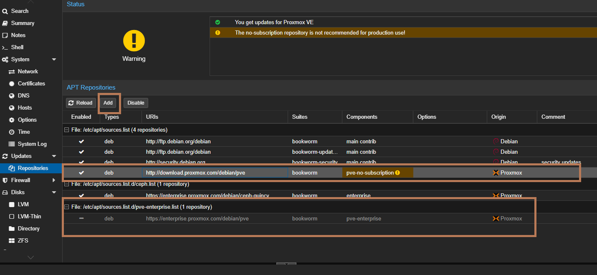
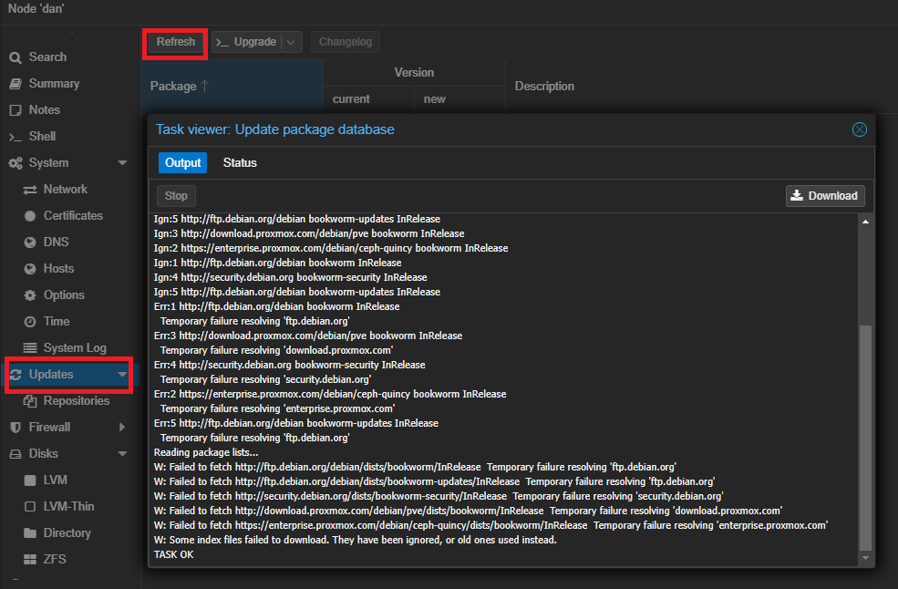
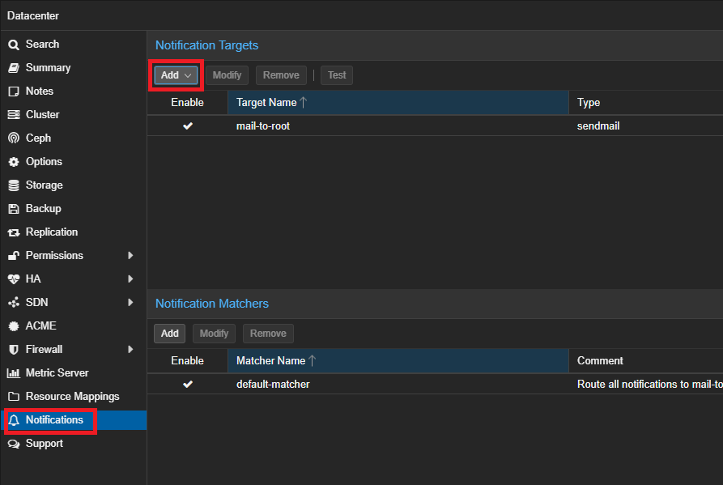

**Node3** 

connect to ssh 
```
ssh root@192.168.1.130
```

```bash
nano /etc/hosts 
```

```
192.168.1.128 pve1.local pve1
192.168.1.129 pve2.local pve2
192.168.1.130 pve3.local pve3
```
> test for ping  `ping pve1` and `ping pve2` 


**Wrong Repository**

```bash

nano /etc/apt/sources.list
```
```
# deb https://enterprise.proxmox.com/debian/pve stretch pve-enterprise

dev https://download.proxmox.com/debian/pve stretch no-subscription 
```
Install `htop` and `mc`
```bash
apt install htop mc 
````
```bash
apt update
```
---
## Create Cluster


**On Node1**

on Website:

Datacenter > Create Cluster > 
```
Cluster Name : cluster1
Ring 0 Address: 
```

Datacenter > Cluster > Join Information > Copy information (copy)

---

**On Node2**

Datacenter > Cluster > Join Cluster > Past (ctrl+V) > 
```
password: *******  # from Node1 
```
---

**On Node3**

Datacenter > Cluster > Join Cluster > Past (ctrl+V) > 
```
password: *******  # from Node1 
```
---


## CLI Command

Status node
```bash
pvecm status
```
if you only want a list of all nodes, use:
```
pvecm nodes
```

```
qm list
```
migrate machine from node1 (101 = id of machine), to (pve2 = name of node2)
```
qm migrate 101 --online pve2 --with-local-disks
```

## Root

```bash
# PermitRootLogin yes
PermitRootLogin without-password
```
### Repository non-subscription






### Notifications



### Trusted TLS Certifications Requirements


### Windows VirtIO Drivers

after install windows need install `virtio.iso` last versions:
```
https://fedorapeople.org/groups/virt/virtio-win/direct-downloads/archive-virtio/?C=M;O=D
```


### Ventoy Install of Proxmox 8.1 halts at "Loading initial ramdisk"

I ran into the exact same problem.
(installed `proxmox-ve_8.1-2.iso` using `ventoy-1.0.97-linux.tar.gz`)

The file `/etc/default/grub.d/installer.cfg` introduces the `rdinit=/vtoy/vtoy` option:
```
GRUB_CMDLINE_LINUX="$GRUB_CMDLINE_LINUX    rdinit=/vtoy/vtoy"
```
In order to remove the vtoy grub leftovers permanently, change it to:
```
GRUB_CMDLINE_LINUX="$GRUB_CMDLINE_LINUX"
```
Then run `update-grub` and reboot.


Edit the sources list:
```
nano /etc/apt/sources.list

```
Add these lines at the bottom:
```
# Proxmox VE pve-no-subscription repository provided by proxmox.com
# NOT recommended for production use
deb http://download.proxmox.com/debian/pve bookworm pve-no-subscription

# Security updates
deb http://security.debian.org/debian-security bookworm-security main contrib
```

Disable the Production Repository

Next, disable the production repository by commenting out these lines in pve-enterprise.list:
```
#deb https://enterprise.proxmox.com/debian/pve bookworm pve-enterprise
```
Configure Ceph for No-Subscription
```
nano /etc/apt/sources.list.d/ceph.list
```
Comment out the enterprise repository: by adding this # in front of the next line
```
#deb https://enterprise.proxmox.com/debian/ceph-quincy bookworm enterprise
```
Add the no-subscription repository:
```
deb http://download.proxmox.com/debian/ceph-quincy bookworm no-subscription

```
```
apt-get update && apt-get upgrade -y
```

How to determing if you are using grub or cmdline use `efibootmgr -v`

If you see something like “File(\EFI\SYSTEMD\SYSTEMD-BOOTX64.EFI)” then you are using systemd, not GRUB.

If you have GRUB edit config file:
```
nano /etc/default/grub
```
For Intel CPUs Intel CPUs add quiet intel_iommu=on:
```
GRUB_CMDLINE_LINUX_DEFAULT="quiet intel_iommu=on pt=on"
```
For AMD CPUs add quiet amd_iommu=on:
```
GRUB_CMDLINE_LINUX_DEFAULT="quiet amd_iommu=on pt=on"
```
Then update GRUB
```
update-grub
```
If you have cmdline edit config file
```
nano /etc/kernel/cmdline

```
insert in the end of the line `quiet amd_iommu=on iommu=pt`

Then refresh boot tool
```
proxmox-boot-tool refresh
```
Then reboot

Add Modules
```
vfio
vfio_iommu_type1
vfio_pci
vfio_virqfd #not necessary if kernel 6.2
```
Update modules
```
update-initramfs -u -k all
```
Reboot

Verify

`dmesg | grep -e DMAR -e IOMMU` or `dmesg | grep -e DMAR -e IOMMU -e AMD-Vi`

GPU Isolation From the Host (amend the below to include the IDs of the device you want to isolate)

Get device IDs: `lspci -nn`
```
echo "options vfio-pci ids=10de:____,10de:____ disable_vga=1" > /etc/modprobe.d/vfio.conf
```
Blacklist GPU drivers
```
echo "blacklist radeon" >> /etc/modprobe.d/blacklist.conf 
echo "blacklist nouveau" >> /etc/modprobe.d/blacklist.conf 
echo "blacklist nvidia" >> /etc/modprobe.d/blacklist.conf 
echo "blacklist nvidiafb" >> /etc/modprobe.d/blacklist.conf
echo "blacklist nvidia_drm" >> /etc/modprobe.d/blacklist.conf
echo "blacklist i915" >> /etc/modprobe.d/blacklist.conf
```
Passing HDD
```
ls -n /dev/disk/by-id/

```
then
```
/sbin/qm set [VM-ID] -virtio2 /dev/disk/by-id/[DISK-ID]
```
Disable No-Subscription Pop-Up
```
sed -Ezi.bak "s/(Ext.Msg.show\(\{\s+title: gettext\('No valid sub)/void\(\{ \/\/\1/g" /usr/share/javascript/proxmox-widget-toolkit/proxmoxlib.js
```