---
title: "Rclone Gdrive Windows 10"
discription: Rclone Gdrive Windows 10 
date: 2024-04-01T21:29:01+08:00 
draft: false
type: post
tags: ["rclone","drive"]
showTableOfContents: true
--- 


## Create API for Google Drive

go to 
```
https://console.cloud.google.com/
```
api & services
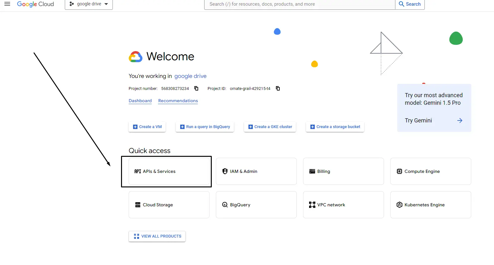

open new project 
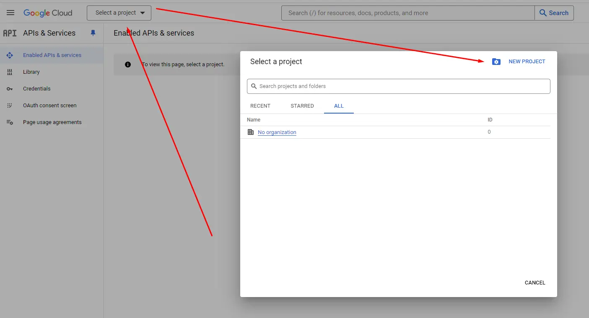

Create new project `Google Drive`
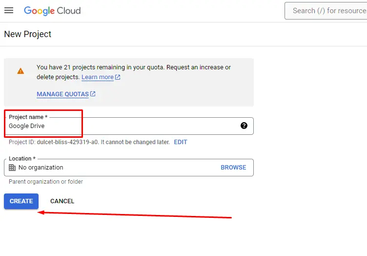

Open `Enable Apis and Services`
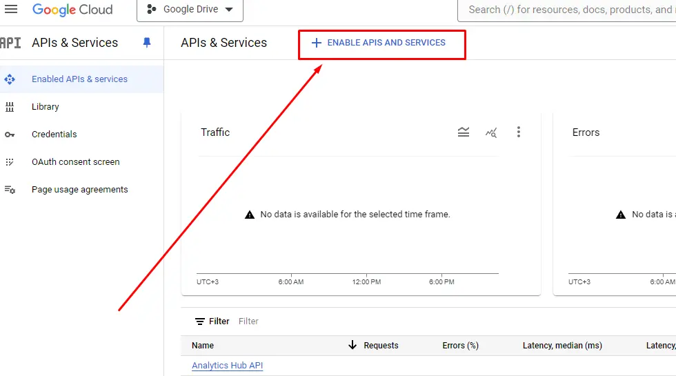


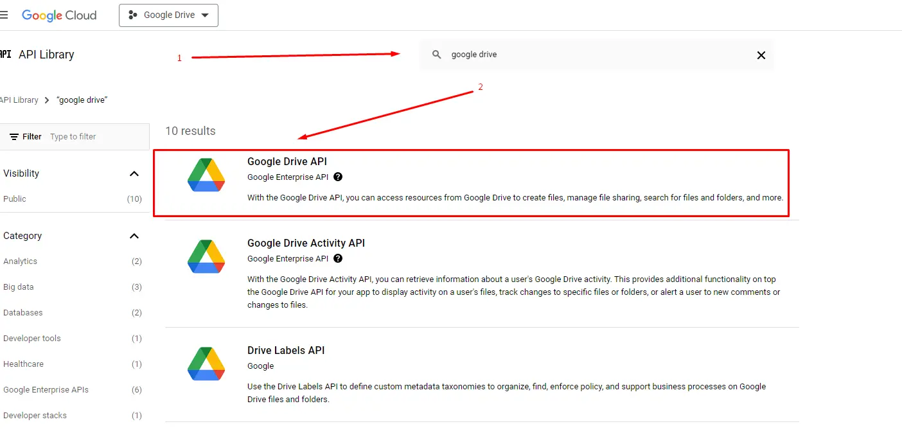

Enable Google Drive
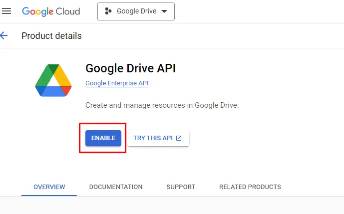


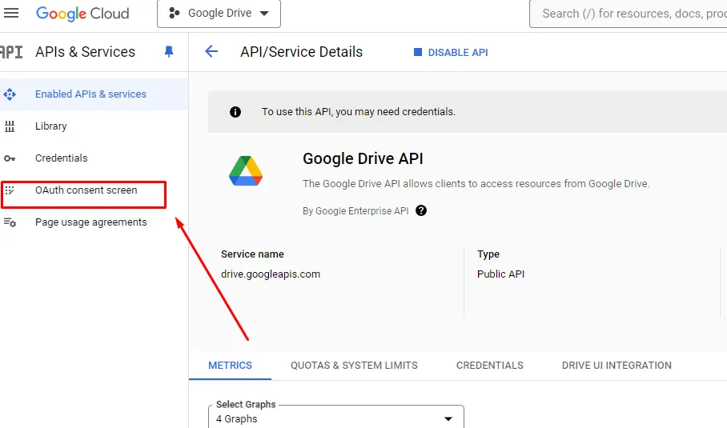

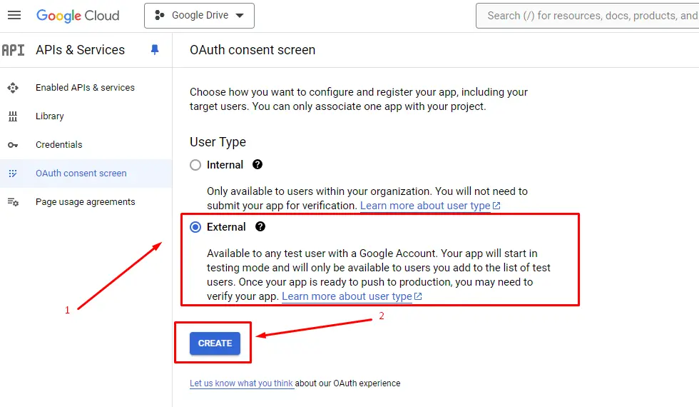

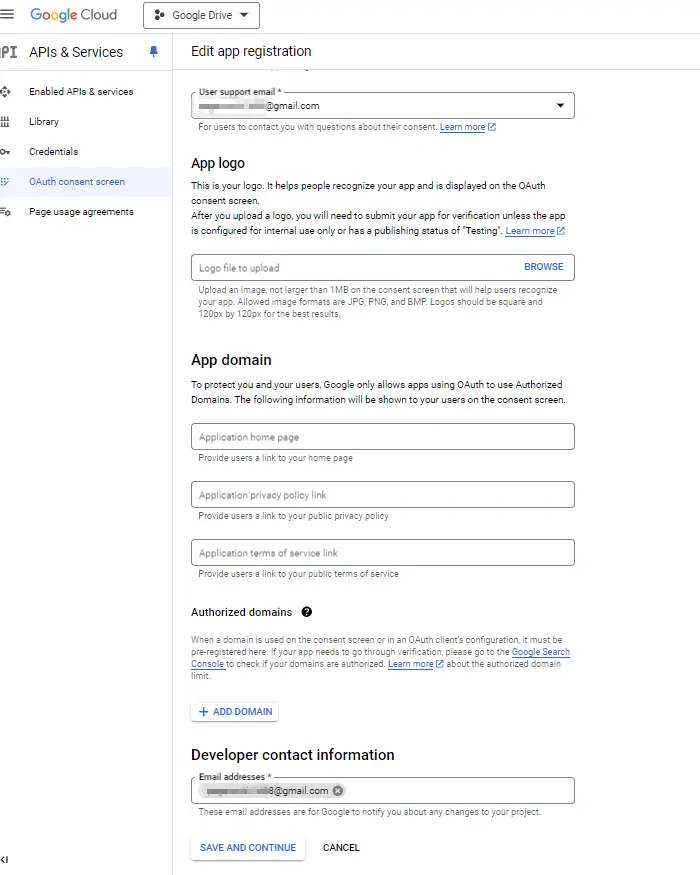

Next
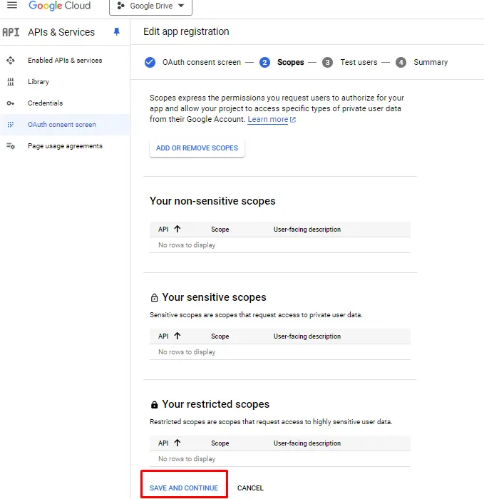

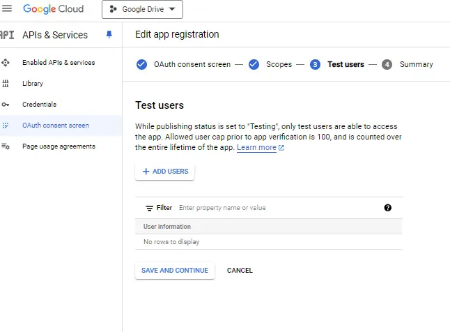

> Don`t forget add test accaunt
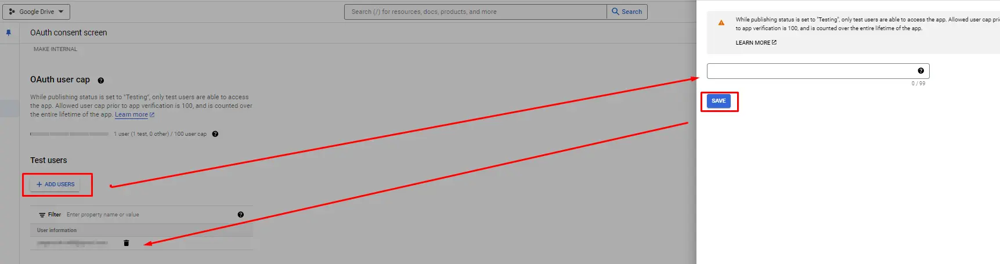

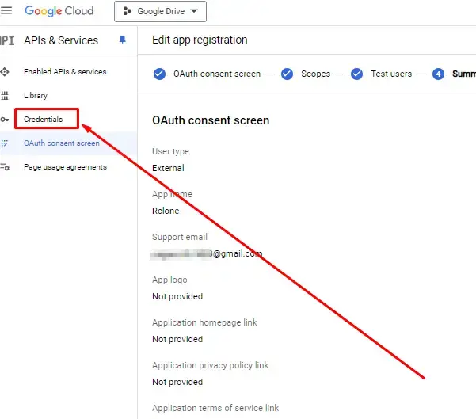

Create new credentials
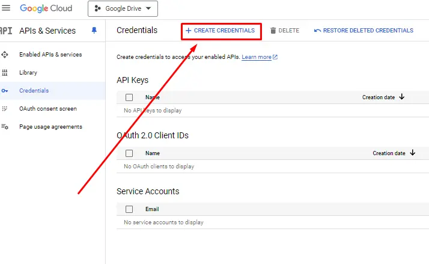

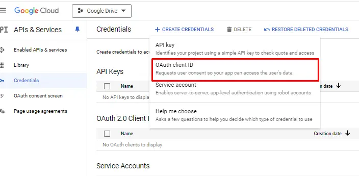

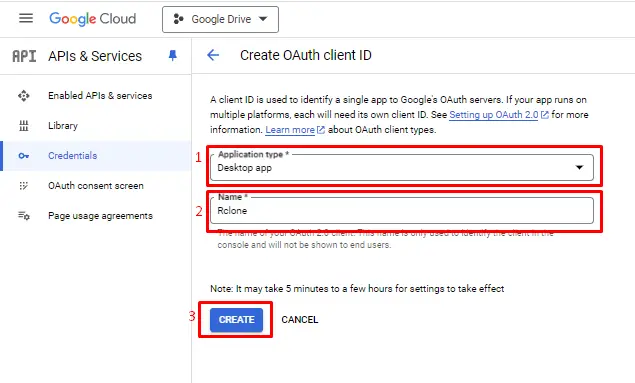

Save password
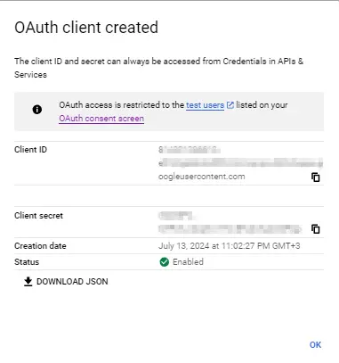


### Download RClone
```
https://rclone.org/downloads/
```
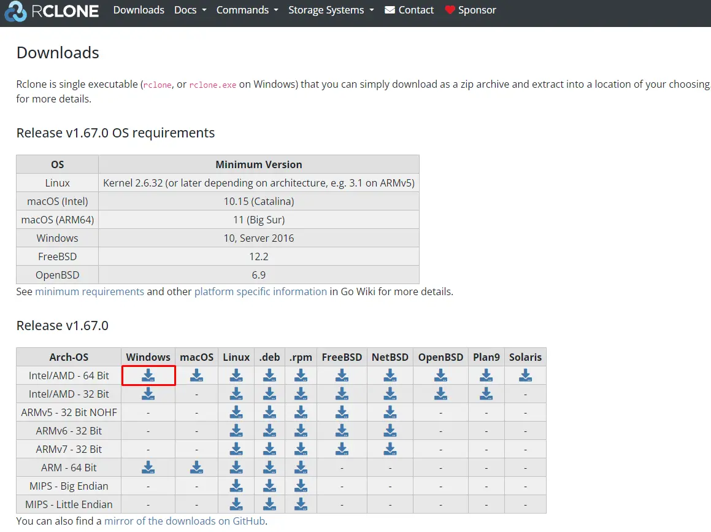

### Download NSSM
```
https://nssm.cc/download
```
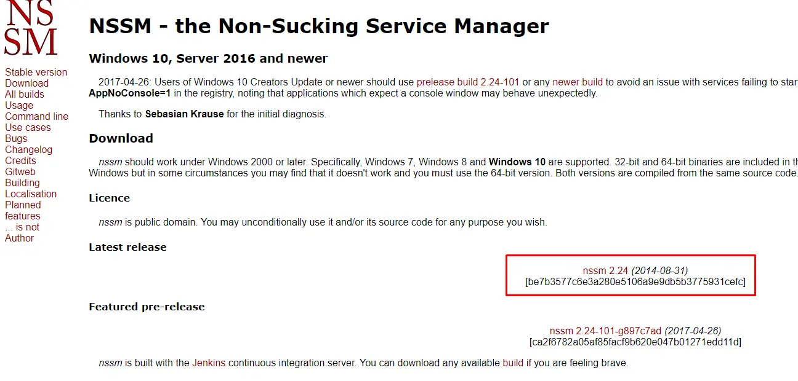

copy `nssm.exe` to rclone folder
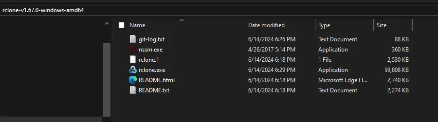


### Configuration RClone

open `cmd` 
```
C:\Users\Burzum>cd Downloads

C:\Users\Burzum\Downloads>cd rclone-v1.67.0-windows-amd64

C:\Users\Burzum\Downloads\rclone-v1.67.0-windows-amd64>rclone config
```
No remotes found, make a new one?
```
n) New remote
s) Set configuration password
q) Quit config

n/s/q> n
```
Enter name for new remote.
```
name> Google Drive
```
Option Storage.
```
Type of storage to configure.
Choose a number from below, or type in your own value.
 1 / 1Fichier
   \ (fichier)
 2 / Akamai NetStorage
   \ (netstorage)
 3 / Alias for an existing remote
   \ (alias)
 4 / Amazon S3 Compliant Storage Providers including AWS, Alibaba, ArvanCloud, Ceph, ChinaMobile, Cloudflare, DigitalOcean, Dreamhost, GCS, HuaweiOBS, IBMCOS, IDrive, IONOS, LyveCloud, Leviia, Liara, Linode, Magalu, Minio, Netease, Petabox, RackCorp, Rclone, Scaleway, SeaweedFS, StackPath, Storj, Synology, TencentCOS, Wasabi, Qiniu and others
   \ (s3)
 5 / Backblaze B2
   \ (b2)
 6 / Better checksums for other remotes
   \ (hasher)
 7 / Box
   \ (box)
 8 / Cache a remote
   \ (cache)
 9 / Citrix Sharefile
   \ (sharefile)
10 / Combine several remotes into one
   \ (combine)
11 / Compress a remote
   \ (compress)
12 / Dropbox
   \ (dropbox)
13 / Encrypt/Decrypt a remote
   \ (crypt)
14 / Enterprise File Fabric
   \ (filefabric)
15 / FTP
   \ (ftp)
16 / Google Cloud Storage (this is not Google Drive)
   \ (google cloud storage)
17 / Google Drive
   \ (drive)
18 / Google Photos
   \ (google photos)
19 / HTTP
   \ (http)
20 / Hadoop distributed file system
   \ (hdfs)
21 / HiDrive
   \ (hidrive)
22 / ImageKit.io
   \ (imagekit)
23 / In memory object storage system.
   \ (memory)
24 / Internet Archive
   \ (internetarchive)
25 / Jottacloud
   \ (jottacloud)
26 / Koofr, Digi Storage and other Koofr-compatible storage providers
   \ (koofr)
27 / Linkbox
   \ (linkbox)
28 / Local Disk
   \ (local)
29 / Mail.ru Cloud
   \ (mailru)
30 / Mega
   \ (mega)
31 / Microsoft Azure Blob Storage
   \ (azureblob)
32 / Microsoft Azure Files
   \ (azurefiles)
33 / Microsoft OneDrive
   \ (onedrive)
34 / OpenDrive
   \ (opendrive)
35 / OpenStack Swift (Rackspace Cloud Files, Blomp Cloud Storage, Memset Memstore, OVH)
   \ (swift)
36 / Oracle Cloud Infrastructure Object Storage
   \ (oracleobjectstorage)
37 / Pcloud
   \ (pcloud)
38 / PikPak
   \ (pikpak)
39 / Proton Drive
   \ (protondrive)
40 / Put.io
   \ (putio)
41 / QingCloud Object Storage
   \ (qingstor)
42 / Quatrix by Maytech
   \ (quatrix)
43 / SMB / CIFS
   \ (smb)
44 / SSH/SFTP
   \ (sftp)
45 / Sia Decentralized Cloud
   \ (sia)
46 / Storj Decentralized Cloud Storage
   \ (storj)
47 / Sugarsync
   \ (sugarsync)
48 / Transparently chunk/split large files
   \ (chunker)
49 / Uloz.to
   \ (ulozto)
50 / Union merges the contents of several upstream fs
   \ (union)
51 / Uptobox
   \ (uptobox)
52 / WebDAV
   \ (webdav)
53 / Yandex Disk
   \ (yandex)
54 / Zoho
   \ (zoho)
55 / premiumize.me
   \ (premiumizeme)
56 / seafile
   \ (seafile)

Storage> 17
```
```
Option client_id.
Google Application Client Id
Setting your own is recommended.
See https://rclone.org/drive/#making-your-own-client-id for how to create your own.
If you leave this blank, it will use an internal key which is low performance.
Enter a value. Press Enter to leave empty.
```
Enter id from google api
```
client_id> ************************************.apps.googleusercontent.com
```
```
Option client_secret.
OAuth Client Secret.
Leave blank normally.
Enter a value. Press Enter to leave empty.
```
Enter password from google api
```
client_secret> GOCSPX-**********************
```
Enter `1`
```
Option scope.
Comma separated list of scopes that rclone should use when requesting access from drive.
Choose a number from below, or type in your own value.
Press Enter to leave empty.
 1 / Full access all files, excluding Application Data Folder.
   \ (drive)
 2 / Read-only access to file metadata and file contents.
   \ (drive.readonly)
   / Access to files created by rclone only.
 3 | These are visible in the drive website.
   | File authorization is revoked when the user deauthorizes the app.
   \ (drive.file)
   / Allows read and write access to the Application Data folder.
 4 | This is not visible in the drive website.
   \ (drive.appfolder)
   / Allows read-only access to file metadata but
 5 | does not allow any access to read or download file content.
   \ (drive.metadata.readonly)
scope> 1
```
Option service_account_file.
Service Account Credentials JSON file path.
Leave blank normally.
Needed only if you want use SA instead of interactive login.
Leading `~` will be expanded in the file name as will environment variables such as `${RCLONE_CONFIG_DIR}`.
Enter a value. Press Enter to leave empty.
service_account_file>

Edit advanced config?
y) Yes
n) No (default)
y/n>

Use web browser to automatically authenticate rclone with remote?
 * Say Y if the machine running rclone has a web browser you can use
 * Say N if running rclone on a (remote) machine without web browser access
If not sure try Y. If Y failed, try N.

y) Yes (default)
n) No
y/n>

2024/07/12 18:50:20 NOTICE: Make sure your Redirect URL is set to "http://127.0.0.1:53682/" in your custom config.
2024/07/12 18:50:20 NOTICE: If your browser doesn't open automatically go to the following link: http://127.0.0.1:53682/auth?state=wjDtvZ_b4OGR04blYulRpQ
2024/07/12 18:50:20 NOTICE: Log in and authorize rclone for access
2024/07/12 18:50:20 NOTICE: Waiting for code...
2024/07/12 18:51:00 NOTICE: Got code
Configure this as a Shared Drive (Team Drive)?

y) Yes
n) No (default)
y/n>

```


`C:\Users\Burzum\AppData\Roaming\rclone\rclone.conf`

```


```
mount Gdrive: Z: --config "C:\Users\Burzum\AppData\Roaming\rclone\rclone.conf"
```


rclone rcd --rc-web-gui