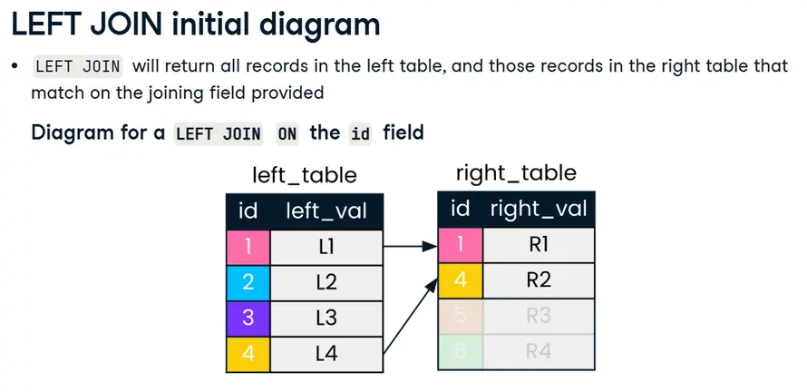

---
title: "SQL"
discription: All on sql
date: 2025-10-01T21:29:01+08:00 
draft: false
type: post
tags: ["SQL","PostSQL"]
showTableOfContents: true
--- 


&nbsp;&nbsp;&nbsp;

&nbsp;&nbsp;&nbsp;

&nbsp;&nbsp;&nbsp;

&nbsp;&nbsp;&nbsp;


## Inner JOINs


```sql
SELECT *
FROM cities
-- Inner join to countries
INNER JOIN countries
-- Match on country codes
ON cities.country_code = countries.code;
```

```sql 
-- Select name fields (with alias) and region 
SELECT city.name, country.name, region
FROM cities AS city
INNER JOIN countries AS country
ON city.country_code = country.code;

```

```sql
-- Select fields with aliases
SELECT c.code AS country_code, c.name, e.year, e.inflation_rate 
FROM countries AS c
-- Join to economies (alias e)
INNER JOIN economies AS e 
-- Match on code field using table aliases
ON c.code = e.code;
```

```sql
SELECT c.name AS country, l.name AS language, official
FROM countries AS c
INNER JOIN languages AS l
-- Match using the code column
USING (code);
```
&nbsp;&nbsp;&nbsp;

&nbsp;&nbsp;&nbsp;

&nbsp;&nbsp;&nbsp;


### Defining Relationships


```sql
-- Select country and language names (aliased)
SELECT c.name AS country, l.name AS language
-- From countries (aliased)
FROM countries AS c
-- Join to languages (aliased)
INNER JOIN languages AS l 
-- Use code as the joining field with the USING keyword
USING (code);
```

```sql
-- Select country and language name (aliased)
SELECT c.name AS country, l.name AS language
-- From countries (aliased)
FROM countries AS c
-- Join to languages (aliased)
INNER JOIN languages AS l
-- Use code as the joining field with the USING keyword
USING(code)
-- Filter for the Bhojpuri language
WHERE l.name = 'Bhojpuri';
```
&nbsp;&nbsp;&nbsp;

&nbsp;&nbsp;&nbsp;

&nbsp;&nbsp;&nbsp;

### Multiple Joins


```sql
-- Select relevant fields
SELECT c.name, p.fertility_rate
-- Inner join countries and populations, aliased, on code
FROM countries AS c 
INNER JOIN populations AS p
ON c.code = p.country_code;
```

```sql
-- Select fields
SELECT name, e.year, p.fertility_rate, e.unemployment_rate
FROM countries AS c
INNER JOIN populations AS p
ON c.code = p.country_code
-- Join to economies (as e)
INNER JOIN economies AS e
-- Match on country code
ON c.code = e.code;
```

```sql
SELECT name, e.year, fertility_rate, unemployment_rate
FROM countries AS c
INNER JOIN populations AS p
ON c.code = p.country_code
INNER JOIN economies AS e
ON c.code = e.code
-- Add an additional joining condition such that you are also joining on year
	AND e.year = p.year;
```
&nbsp;&nbsp;&nbsp;

&nbsp;&nbsp;&nbsp;

&nbsp;&nbsp;&nbsp;

### LEFT and RIGHT JOINs




### Right Join


- `RIGHT JOIN` is less commonly used than `LEFT JOIN`

- Any `RIGHT JOIN` can be re-written as a `LEFT JOIN`

&nbsp;&nbsp;&nbsp;

&nbsp;&nbsp;&nbsp;

```sql 
SELECT 
	c1.name AS city, 
    code, 
    c2.name AS country,
    region, 
    city_proper_pop
FROM cities AS c1
-- Join right table (with alias)
LEFT JOIN countries AS c2
ON c1.country_code = c2.code
ORDER BY code DESC;
```

```sql
SELECT name, region, gdp_percapita
FROM countries AS c
LEFT JOIN economies AS e
-- Match on code fields
USING(code)
-- Filter for the year 2010
WHERE year = 2010;
```

```sql
SELECT region, AVG(gdp_percapita) AS avg_gdp
FROM countries AS c
LEFT JOIN economies AS e
USING(code)
WHERE year = 2010
GROUP BY region
-- Order by descending avg_gdp
ORDER BY avg_gdp DESC
-- Return only first 10 records
LIMIT 10;
```
&nbsp;&nbsp;&nbsp;

&nbsp;&nbsp;&nbsp;

### Full JOIN


```sql
SELECT name AS country, code, region, basic_unit
FROM countries
-- Join to currencies
FULL JOIN currencies
USING (code)
-- Where region is North America or name is null
WHERE region = 'North America' OR name IS NULL
ORDER BY region ;
```

```sql
SELECT 
	c1.name AS country, 
    region, 
    l.name AS language,
	basic_unit, 
    frac_unit
FROM countries as c1 
-- Full join with languages (alias as l)
FULL JOIN languages AS l
ON c1.code = l.code
-- Full join with currencies (alias as c2)
FULL JOIN currencies AS c2
ON c1.code = c2.code
WHERE region LIKE 'M%esia';
```
&nbsp;&nbsp;&nbsp;

&nbsp;&nbsp;&nbsp;

### Crossing into CROSS JOIN


```bash
SELECT c.name AS country, l.name AS language
FROM countries AS c        
-- Perform a cross join to languages (alias as l)
CROSS JOIN languages AS l
WHERE c.code in ('PAK','IND')
	AND l.code in ('PAK','IND');
```
```sql
SELECT 
	c.name AS country,
    region,
    life_expectancy AS life_exp
FROM countries AS c
-- Join to populations (alias as p) using an appropriate join
LEFT JOIN populations AS p
ON c.code = p.country_code
-- Filter for only results in the year 2010
WHERE year = '2010'
-- Sort by life_exp
ORDER BY life_exp
-- Limit to five records
LIMIT 5;
```
&nbsp;&nbsp;&nbsp;

&nbsp;&nbsp;&nbsp;


### Self Joins


```sql
-- Select aliased fields from populations as p1
Select p1.country_code, p1.size AS size2010, p2.country_code, p2.size AS size2015

FROM populations AS p1
-- Join populations as p1 to itself, alias as p2, on country code
INNER JOIN  populations AS p2
ON p1.country_code = p2.country_code;
```
```sql
SELECT 
	p1.country_code, 
    p1.size AS size2010, 
    p2.size AS size2015
FROM populations AS p1
INNER JOIN populations AS p2
ON p1.country_code = p2.country_code
WHERE p1.year = 2010
-- Filter such that p1.year is always five years before p2.year
    AND p1.year = p2.year - 5
```
&nbsp;&nbsp;&nbsp;

&nbsp;&nbsp;&nbsp;

### Set theory for SQL Joins


