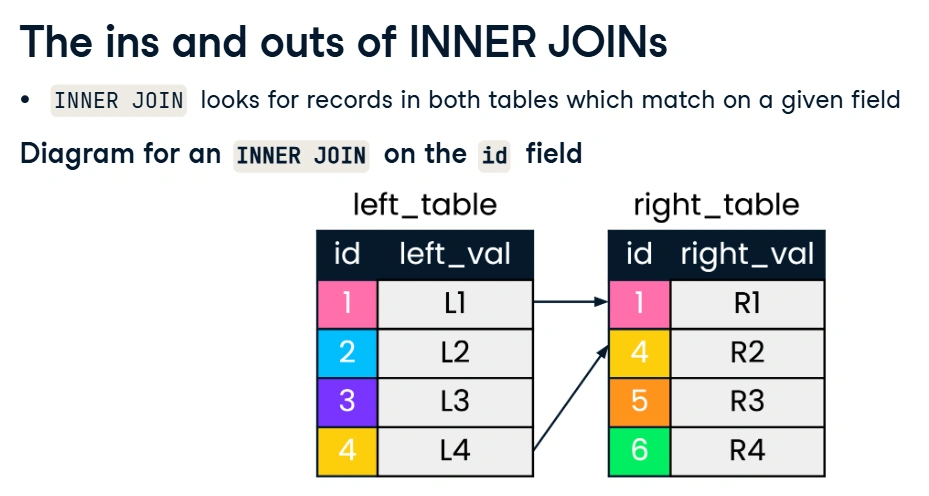
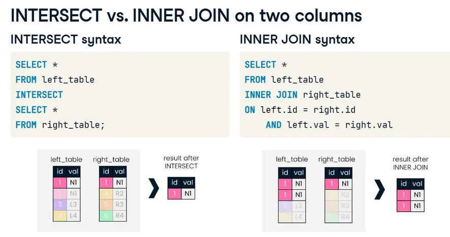
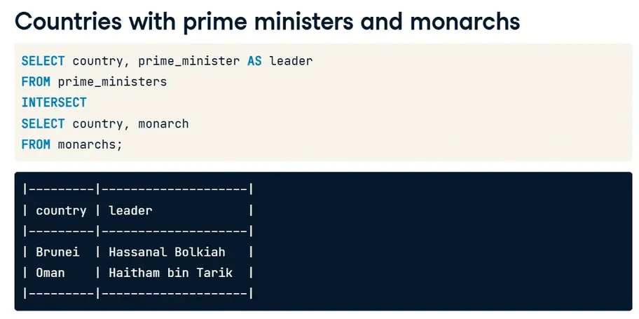
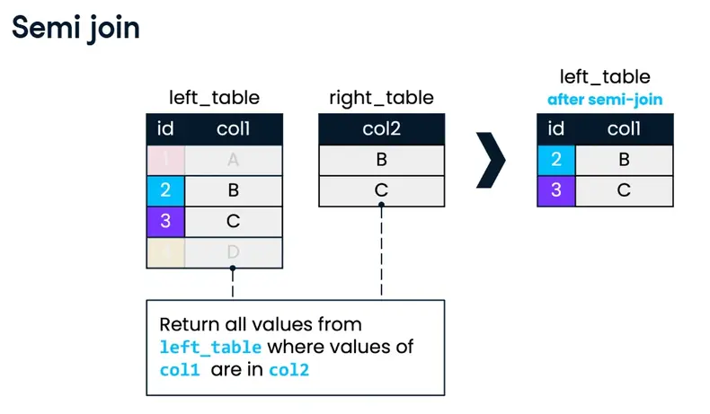
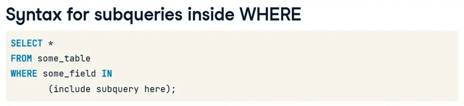
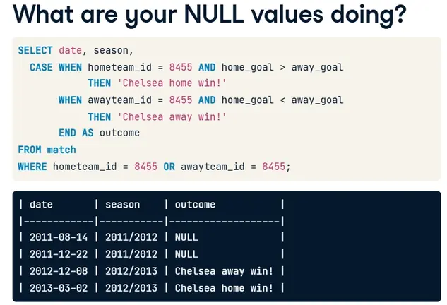
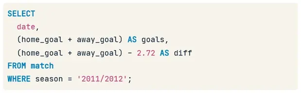
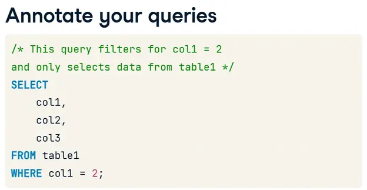

---
title: "SQL"
discription: All on sql
date: 2025-10-01T21:29:01+08:00 
draft: false
type: post
tags: ["SQL","PostSQL"]
showTableOfContents: true
--- 


&nbsp;&nbsp;&nbsp;

&nbsp;&nbsp;&nbsp;

&nbsp;&nbsp;&nbsp;

&nbsp;&nbsp;&nbsp;


## Joining Data in SQL


### Inner JOINs





```sql
SELECT *
FROM cities
-- Inner join to countries
INNER JOIN countries
-- Match on country codes
ON cities.country_code = countries.code;
```

```sql 
-- Select name fields (with alias) and region 
SELECT city.name, country.name, region
FROM cities AS city
INNER JOIN countries AS country
ON city.country_code = country.code;

```

```sql
-- Select fields with aliases
SELECT c.code AS country_code, c.name, e.year, e.inflation_rate 
FROM countries AS c
-- Join to economies (alias e)
INNER JOIN economies AS e 
-- Match on code field using table aliases
ON c.code = e.code;
```

```sql
SELECT c.name AS country, l.name AS language, official
FROM countries AS c
INNER JOIN languages AS l
-- Match using the code column
USING (code);
```
&nbsp;&nbsp;&nbsp;

&nbsp;&nbsp;&nbsp;

&nbsp;&nbsp;&nbsp;


### Defining Relationships


```sql
-- Select country and language names (aliased)
SELECT c.name AS country, l.name AS language
-- From countries (aliased)
FROM countries AS c
-- Join to languages (aliased)
INNER JOIN languages AS l 
-- Use code as the joining field with the USING keyword
USING (code);
```

```sql
-- Select country and language name (aliased)
SELECT c.name AS country, l.name AS language
-- From countries (aliased)
FROM countries AS c
-- Join to languages (aliased)
INNER JOIN languages AS l
-- Use code as the joining field with the USING keyword
USING(code)
-- Filter for the Bhojpuri language
WHERE l.name = 'Bhojpuri';
```
&nbsp;&nbsp;&nbsp;

&nbsp;&nbsp;&nbsp;

&nbsp;&nbsp;&nbsp;

### Multiple Joins


```sql
-- Select relevant fields
SELECT c.name, p.fertility_rate
-- Inner join countries and populations, aliased, on code
FROM countries AS c 
INNER JOIN populations AS p
ON c.code = p.country_code;
```

```sql
-- Select fields
SELECT name, e.year, p.fertility_rate, e.unemployment_rate
FROM countries AS c
INNER JOIN populations AS p
ON c.code = p.country_code
-- Join to economies (as e)
INNER JOIN economies AS e
-- Match on country code
ON c.code = e.code;
```

```sql
SELECT name, e.year, fertility_rate, unemployment_rate
FROM countries AS c
INNER JOIN populations AS p
ON c.code = p.country_code
INNER JOIN economies AS e
ON c.code = e.code
-- Add an additional joining condition such that you are also joining on year
	AND e.year = p.year;
```
&nbsp;&nbsp;&nbsp;

&nbsp;&nbsp;&nbsp;

&nbsp;&nbsp;&nbsp;

### LEFT and RIGHT JOINs


### Right Join


- `RIGHT JOIN` is less commonly used than `LEFT JOIN`

- Any `RIGHT JOIN` can be re-written as a `LEFT JOIN`

&nbsp;&nbsp;&nbsp;

&nbsp;&nbsp;&nbsp;

```sql 
SELECT 
	c1.name AS city, 
    code, 
    c2.name AS country,
    region, 
    city_proper_pop
FROM cities AS c1
-- Join right table (with alias)
LEFT JOIN countries AS c2
ON c1.country_code = c2.code
ORDER BY code DESC;
```

```sql
SELECT name, region, gdp_percapita
FROM countries AS c
LEFT JOIN economies AS e
-- Match on code fields
USING(code)
-- Filter for the year 2010
WHERE year = 2010;
```

```sql
SELECT region, AVG(gdp_percapita) AS avg_gdp
FROM countries AS c
LEFT JOIN economies AS e
USING(code)
WHERE year = 2010
GROUP BY region
-- Order by descending avg_gdp
ORDER BY avg_gdp DESC
-- Return only first 10 records
LIMIT 10;
```
&nbsp;&nbsp;&nbsp;

&nbsp;&nbsp;&nbsp;

### Full JOIN


```sql
SELECT name AS country, code, region, basic_unit
FROM countries
-- Join to currencies
FULL JOIN currencies
USING (code)
-- Where region is North America or name is null
WHERE region = 'North America' OR name IS NULL
ORDER BY region ;
```

```sql
SELECT 
	c1.name AS country, 
    region, 
    l.name AS language,
	basic_unit, 
    frac_unit
FROM countries as c1 
-- Full join with languages (alias as l)
FULL JOIN languages AS l
ON c1.code = l.code
-- Full join with currencies (alias as c2)
FULL JOIN currencies AS c2
ON c1.code = c2.code
WHERE region LIKE 'M%esia';
```
&nbsp;&nbsp;&nbsp;

&nbsp;&nbsp;&nbsp;

### Crossing into CROSS JOIN


```bash
SELECT c.name AS country, l.name AS language
FROM countries AS c        
-- Perform a cross join to languages (alias as l)
CROSS JOIN languages AS l
WHERE c.code in ('PAK','IND')
	AND l.code in ('PAK','IND');
```
```sql
SELECT 
	c.name AS country,
    region,
    life_expectancy AS life_exp
FROM countries AS c
-- Join to populations (alias as p) using an appropriate join
LEFT JOIN populations AS p
ON c.code = p.country_code
-- Filter for only results in the year 2010
WHERE year = '2010'
-- Sort by life_exp
ORDER BY life_exp
-- Limit to five records
LIMIT 5;
```
&nbsp;&nbsp;&nbsp;

&nbsp;&nbsp;&nbsp;


### Self Joins


```sql
-- Select aliased fields from populations as p1
Select p1.country_code, p1.size AS size2010, p2.country_code, p2.size AS size2015

FROM populations AS p1
-- Join populations as p1 to itself, alias as p2, on country code
INNER JOIN  populations AS p2
ON p1.country_code = p2.country_code;
```
```sql
SELECT 
	p1.country_code, 
    p1.size AS size2010, 
    p2.size AS size2015
FROM populations AS p1
INNER JOIN populations AS p2
ON p1.country_code = p2.country_code
WHERE p1.year = 2010
-- Filter such that p1.year is always five years before p2.year
    AND p1.year = p2.year - 5
```
&nbsp;&nbsp;&nbsp;

&nbsp;&nbsp;&nbsp;

### Set theory for SQL Joins

#### UNION
Difference between UNION and UNION ALL

In short:

- `UNION` — combines results and removes duplicates.

- `UNION ALL` — combines results and keeps duplicates.


Difference between UNION and UNION ALL

In short:

- `UNION` — combines results and removes duplicates.

- `UNION ALL` — combines results and keeps duplicates.

```sql
-- Select all fields from economies2015
SELECT *
-- Set operation
FROM economies2015
UNION
-- Select all fields from economies2019
SELECT *
FROM economies2019
ORDER BY code, year;
```
```sql
SELECT code, year
FROM economies
-- Set theory clause
UNION ALL
SELECT country_code, year
FROM populations
ORDER BY code, year;
```
&nbsp;&nbsp;&nbsp;

&nbsp;&nbsp;&nbsp;

&nbsp;&nbsp;&nbsp;

&nbsp;&nbsp;&nbsp;

#### INTERSECT








```sql
-- Return all cities with the same name as a country
SELECT name
FROM cities
INTERSECT
SELECT name
FROM countries;
```
&nbsp;&nbsp;&nbsp;

&nbsp;&nbsp;&nbsp;

&nbsp;&nbsp;&nbsp;

&nbsp;&nbsp;&nbsp;


#### EXCEPT


```sql
-- Return all cities that do not have the same name as a country
SELECT name 
FROM cities
EXCEPT
SELECT name
FROM countries
ORDER BY name;
```
&nbsp;&nbsp;&nbsp;

&nbsp;&nbsp;&nbsp;

&nbsp;&nbsp;&nbsp;

&nbsp;&nbsp;&nbsp;

### Subquerying with semi joins and anti joins

A semi-join (semi-join) is a special type of join in SQL that returns rows from only one table, but only those for which there are matches in the second table.





&nbsp;&nbsp;&nbsp;

&nbsp;&nbsp;&nbsp;

&nbsp;&nbsp;&nbsp;

#### ANTI JOIN

ANTI JOIN - is a type of logical table join that selects only those rows from the first table
for which there are no matches in the second table.


```sql
SELECT DISTINCT name
FROM languages
-- Add syntax to use bracketed subquery below as a filter
WHERE code IN
    (SELECT code
    FROM countries
    WHERE region = 'Middle East')
ORDER BY name;
```

```sql
SELECT code, name
FROM countries
WHERE continent = 'Oceania'
-- Filter for countries not included in the bracketed subquery
  AND code NOT IN
    (SELECT code
    FROM currencies);
```
&nbsp;&nbsp;&nbsp;

&nbsp;&nbsp;&nbsp;

&nbsp;&nbsp;&nbsp;

&nbsp;&nbsp;&nbsp;


### Subqueries inside WHERE and SELECT





```sql
SELECT *
FROM populations
WHERE year = 2015
-- Filter for only those populations where life expectancy is 1.15 times higher than average
  AND life_expectancy > 1.15 *
  (SELECT AVG(life_expectancy)
   FROM populations
   WHERE year = 2015);
```

```sql
-- Select relevant fields from cities table
SELECT name, country_code, urbanarea_pop
FROM cities
-- Filter using a subquery on the countries table
WHERE name IN (SELECT capital FROM countries)
ORDER BY urbanarea_pop DESC;
```
```sql
-- Find top nine countries with the most cities
SELECT countries.name AS country, COUNT(*) AS cities_num
FROM countries
LEFT JOIN cities
ON countries.code = cities.country_code
GROUP BY country
-- Order by count of cities as cities_num
ORDER BY cities_num DESC, country
LIMIT 9;
```

Let's break down the solution to understand how it addresses the exercise requirements:

SELECT Clause:

SELECT countries.name AS country: This part selects the name column from the countries table and aliases it as country. This means that in the result set, the column will be labeled as country.
COUNT(*) AS cities_num: This counts the number of rows in the cities table that match each country and aliases the result as cities_num. This gives us the number of cities associated with each country.
FROM Clause:

FROM countries: This specifies that the countries table is the primary table from which we are selecting data.
LEFT JOIN Clause:

LEFT JOIN cities ON countries.code = cities.country_code: This performs a LEFT JOIN between the countries table and the cities table. The join condition is that the code column in the countries table should match the country_code column in the cities table. A LEFT JOIN ensures that all countries are included in the result, even if they have no corresponding cities in the cities table.
GROUP BY Clause:

GROUP BY country: This groups the results by the country column, which is necessary for the COUNT(*) function to work correctly. It ensures that the count of cities is calculated for each country separately.
ORDER BY Clause:

ORDER BY cities_num DESC, country: This orders the results first by cities_num in descending order, so countries with more cities appear first. If two countries have the same number of cities, they are then ordered alphabetically by country in ascending order.
LIMIT Clause:

LIMIT 9: This limits the result set to the first nine records, as required by the exercise.
By following these steps, the solution effectively retrieves the top nine countries with the most cities, sorted as specified, and meets all the exercise requirements.

```sql
SELECT countries.name AS country,
-- Subquery that provides the count of cities   
  (SELECT COUNT(*)
   FROM cities
   WHERE cities.country_code = countries.code) AS cities_num
FROM countries
ORDER BY cities_num DESC, country
LIMIT 9;
```
&nbsp;&nbsp;&nbsp;

&nbsp;&nbsp;&nbsp;

&nbsp;&nbsp;&nbsp;

&nbsp;&nbsp;&nbsp;

### Subqueries inside FROM


```sql
-- Select code, and language count as lang_num
SELECT code, COUNT(*) AS lang_num
FROM languages
GROUP BY code;
```

```sql
-- Select local_name and lang_num from appropriate tables
SELECT local_name, sub.lang_num
FROM countries,
    (SELECT code, COUNT(*) AS lang_num
     FROM languages
     GROUP BY code) AS sub
-- Where codes match    
WHERE countries.code = sub.code
ORDER BY lang_num DESC;
```

```sql
-- Select relevant fields
SELECT code, inflation_rate, unemployment_rate
FROM economies
WHERE year = 2015 
  AND code IN
-- Subquery returning country codes filtered on gov_form
	(SELECT code
   FROM countries
   WHERE gov_form LIKE '%Republic%' OR gov_form LIKE '%Monarchy%')
ORDER BY inflation_rate;
```

```sql
-- Select fields from cities
SELECT name, country_code, city_proper_pop, metroarea_pop, (city_proper_pop / metroarea_pop * 100) AS city_perc
FROM cities
-- Use subquery to filter city name
WHERE name IN (SELECT capital 
       FROM countries
       WHERE continent = 'Europe'
       OR continent LIKE '%America') 
-- Add filter condition such that metroarea_pop does not have null values
        AND metroarea_pop is NOT NULL
-- Sort and limit the result
ORDER BY city_perc DESC
LIMIT 10;
```
&nbsp;&nbsp;&nbsp;

&nbsp;&nbsp;&nbsp;

&nbsp;&nbsp;&nbsp;

&nbsp;&nbsp;&nbsp;


## Data Manipulation in SQL


### We'll take the CASE


#### CASE statements

- Contains a `WHEN`, `THEN`. and `ELSE` statment, finished with `END`


```sql
-- Identify the home team as Bayern Munich, Schalke 04, or neither
SELECT 
	CASE WHEN hometeam_id = 10189 THEN 'FC Schalke 04'
        WHEN hometeam_id = 9823 THEN 'FC Bayern Munich'
         ELSE 'Other' END AS home_team,
	COUNT(id) AS total_matches
FROM matches_germany
GROUP BY home_team;
```

```sql
SELECT 
	date,
	-- Identify home wins, losses, or ties
	CASE WHEN home_goal > away_goal THEN 'Home win!'
        WHEN home_goal < away_goal THEN 'Home loss :(' 
        ELSE 'Tie' END AS outcome
FROM matches_spain;
```

```sql
-- Select matches where Barcelona was the away team
SELECT  
	m.date,
	t.team_long_name AS opponent,
	CASE WHEN home_goal < away_goal THEN 'Barcelona win!'
        WHEN home_goal > away_goal THEN 'Barcelona loss :(' 
        ELSE 'Tie' END AS outcome
FROM matches_spain AS m
LEFT JOIN teams_spain AS t 
ON m.hometeam_id = t.team_api_id
-- Filter for Barcelona
WHERE m.awayteam_id = 8634;
```
&nbsp;&nbsp;&nbsp;

&nbsp;&nbsp;&nbsp;

&nbsp;&nbsp;&nbsp;

&nbsp;&nbsp;&nbsp;

### In CASE things get more complex


no else 



```sql
SELECT 
	date,
	CASE WHEN hometeam_id = 8634 THEN 'FC Barcelona' 
         ELSE 'Real Madrid CF' END as home,
	CASE WHEN awayteam_id = 8634 THEN 'FC Barcelona' 
         ELSE 'Real Madrid CF' END as away,
	-- Identify possible home match outcomes
	CASE WHEN home_goal > away_goal AND hometeam_id = 8634 THEN 'Barcelona win!'
        WHEN home_goal < away_goal AND awayteam_id = 8633 THEN 'Real Madrid win!'
        ELSE 'Tie!' END AS outcome
FROM matches_spain
WHERE hometeam_id = 8634 AND awayteam_id = 8633;
```

```sql
SELECT 
	season,
    date,
	home_goal,
	away_goal
FROM matches_italy
WHERE 
	-- Find games where home_goal is more than away_goal
	CASE WHEN hometeam_id = 9857 AND home_goal > away_goal THEN 'Bologna Win'
		-- Find games where away_goal is more than home_goal
        WHEN awayteam_id = 9857 AND away_goal > home_goal THEN 'Bologna Win' 
        -- Exclude games not won by Bologna
		END IS NOT NULL;
```
&nbsp;&nbsp;&nbsp;

&nbsp;&nbsp;&nbsp;

&nbsp;&nbsp;&nbsp;

&nbsp;&nbsp;&nbsp;

### CASE WHEN with aggregate functions

#### In CASE you need to aggregate

`CASE` statements are great for

- Categorizing data

- Filtering data

- Aggregating data


```sql
SELECT 
	c.name AS country,
    -- Count matches in 2012/13
	COUNT(CASE WHEN m.season = '2012/2013' THEN m.id END) AS matches_2012_2013,
    -- Count matches in 2013/14
	COUNT(CASE WHEN m.season = '2013/2014' THEN m.id END) AS matches_2013_2014
FROM country AS c
LEFT JOIN match AS m
ON c.id = m.country_id
GROUP BY country;
```

```sql
SELECT season,
	-- SUM the home goals
    SUM(CASE WHEN hometeam_id = '8560' THEN home_goal END) AS home_goals,
    -- SUM the away goals
    SUM(CASE WHEN awayteam_id = '8560' THEN away_goal END) AS away_goals
FROM match
-- Group the results by season
GROUP BY season;
```

```sql
SELECT 
	c.name AS country,
    -- Calculate the percentage of tied games in each season
	AVG(CASE WHEN m.season='2013/2014' AND m.home_goal = m.away_goal THEN 1
			WHEN m.season='2013/2014' AND m.home_goal != m.away_goal THEN 0
			END) AS ties_2013_2014,
	AVG(CASE WHEN m.season='2014/2015' AND m.home_goal = m.away_goal THEN 1
			WHEN m.season='2014/2015' AND m.home_goal != m.away_goal THEN 0
			END) AS ties_2014_2015
FROM country AS c
LEFT JOIN matches AS m
ON c.id = m.country_id
GROUP BY country;
```
&nbsp;&nbsp;&nbsp;

&nbsp;&nbsp;&nbsp;

&nbsp;&nbsp;&nbsp;

&nbsp;&nbsp;&nbsp;

### WHERE are the Subqueries?

what is subquery ?

- A query  ***nested*** <br> inside another query


&nbsp;&nbsp;&nbsp;


What do you with subqueries?

- Can be in ***any*** part of a query
  - SELECT, FROM, WHERE, GROUP BY

- Can return a variety of information 
  - Scalar quantities (3.14159, -2, 0.001)
  
  - A list (id = (12, 25, 392, 401, 939) )

  - A table

&nbsp;&nbsp;&nbsp;

&nbsp;&nbsp;&nbsp;


#### Why subqueries ?
 
- Comparing groups to summarized values
  - How did Liverpool compare to the English Premier League's
    average performance for that years ?

- Reshaping data
  - What is the highest monthly average of goals cored in the Bundesliga?

- Combining data that cannot be joined
  - How do you get both the home and away team names into a table of match results?


&nbsp;&nbsp;&nbsp;

&nbsp;&nbsp;&nbsp;

#### Simple subqueries 


```sql
SELECT 
	-- Select the date, home goals, and away goals scored
    date,
	home_goal,
	away_goal
FROM matches_2013_2014
-- Filter for matches where total goals exceeds 3x the average
WHERE (home_goal + away_goal) > 
       (SELECT 3 * AVG(home_goal + away_goal)
        FROM matches_2013_2014); 
```

```sql
SELECT 
	-- Select the team long and short names
	team_long_name,
	team_short_name
FROM team 
-- Exclude all values from the subquery
WHERE team_api_id NOT IN
     (SELECT DISTINCT hometeam_id  FROM match);
```

```sql 
SELECT
	-- Select the team long and short names
	team_long_name,
	team_short_name
FROM team
-- Filter for teams with 8 or more home goals
WHERE team_api_id IN
	  (SELECT hometeam_id 
       FROM match 
       WHERE home_goal >= 8);
```

&nbsp;&nbsp;&nbsp;

&nbsp;&nbsp;&nbsp;

### Subqueries in the FROM statement

Subqueries in FROM

- Restructure and transform your data
  - Transforming data from long to wide before selecting

  - Prefiltering data

- Calculating aggregates of aggregates
  - Which 3 teams has the highest average of home goals scored?
    
    1. Calculate the `AVG` from each team

    2. Get the 3 highest of the AVG values

&nbsp;&nbsp;&nbsp;

&nbsp;&nbsp;&nbsp;


#### Things to remember

- You can create multiple subqueries in one `FROM` statement
  - Alies them!
  
  - Join them!

- You can join subquery to  table in `FROM`
  
  - include a joining columns in both tables!


```sql 
SELECT 
	-- Select the country ID and match ID
	country_id, 
    id
FROM match
-- Filter for matches with 10 or more goals in total
WHERE (home_goal + away_goal) >= 10;
```

```sql
SELECT
	-- Select country name and the count match IDs
    name AS country_name,
    COUNT(*) AS matches
FROM country AS c
-- Inner join the subquery onto country
-- Select the country id and match id columns
INNER JOIN (SELECT match.country_id, id 
           FROM match
           -- Filter the subquery by matches with 10+ goals
           WHERE (home_goal + away_goal) >= 10) AS sub
ON c.id = sub.country_id
GROUP BY country_name;
```

```sql
SELECT
	-- Select country, date, home, and away goals from the subquery
    country,
    date,
    home_goal,
    away_goal
FROM 
	-- Select country name, date, home_goal, away_goal, and total goals in the subquery
	(SELECT c.name AS country, 
     	    m.date, 
     		m.home_goal, 
     		m.away_goal,
           (m.home_goal + m.away_goal) AS total_goals
    FROM match AS m
    LEFT JOIN country AS c
    ON m.country_id = c.id) AS subq
-- Filter by total goals scored in the main query
WHERE total_goals >= 10;
```

&nbsp;&nbsp;&nbsp;

&nbsp;&nbsp;&nbsp;

&nbsp;&nbsp;&nbsp;

&nbsp;&nbsp;&nbsp;


### Subqueries in SELECT

#### SELECTing what?

- Returns a **single value**
  - Include aggregate values to compare to individual values

- Used in mathematical calculations
  - Deviation from the average
  





&nbsp;&nbsp;&nbsp;

#### SELECT subqueries ---- things to keep in mind

- Need to return a Single value 
  - Will generate an error otherwise

- Make sure you have all filters in the right places
  - Properly filter **both** the main and the subquery!


```sql
SELECT 
	l.name AS league,
    -- Select and round the league's total goals
    ROUND(AVG(m.home_goal + m.away_goal), 2) AS avg_goals,
    -- Select & round the average total goals for the season
    (SELECT ROUND(AVG(home_goal + away_goal), 2) 
     FROM match
     WHERE season = '2013/2014') AS overall_avg
FROM league AS l
LEFT JOIN match AS m
ON l.country_id = m.country_id
-- Filter for the 2013/2014 season
WHERE season = '2013/2014'
GROUP BY l.name;
```

```sql
SELECT
	-- Select the league name and average goals scored
	l.name AS league,
	ROUND(AVG(m.home_goal + m.away_goal), 2) AS avg_goals,
    -- Subtract the overall average from the league average
	ROUND(AVG(m.home_goal + m.away_goal) -
		(SELECT AVG(home_goal + away_goal)
		 FROM match 
         WHERE season = '2013/2014'), 2) AS diff
FROM league AS l
LEFT JOIN match AS m
ON l.country_id = m.country_id
-- Only include 2013/2014 results
WHERE season = '2013/2014'
GROUP BY l.name;
```
&nbsp;&nbsp;&nbsp;

&nbsp;&nbsp;&nbsp;


### Subqueries everywhere! And best practices!

#### As many subqueries as you want...





#### Is that subquery necessary?

- Subqueries require computing power
  - How big is your database?
  
  - How big is the table you're querying from?

- Is the subquery ***actually*** necessary?

#### Properly filter each subquery!

- Watch your filters!

```sql
SELECT 
	-- Select the stage and average goals for each stage
	m.stage,
    ROUND(AVG(m.home_goal + m.away_goal),2) AS avg_goals,
    -- Select the average overall goals for the 2012/2013 season
    ROUND((SELECT AVG(home_goal + away_goal) 
           FROM match 
           WHERE season =
  '2012/2013'),2) AS overall
FROM match AS m
-- Filter for the 2012/2013 season
WHERE season = '2012/2013'
-- Group by stage
GROUP BY m.stage;
```

```sql 
SELECT 
	-- Select the stage and average goals from the subquery
	stage,
	ROUND(s.avg_goals, 2) AS avg_goals
FROM 
	-- Select the stage and average goals in 2012/2013
	(SELECT
		 stage,
         AVG(home_goal + away_goal) AS avg_goals
	 FROM match
	 WHERE season = '2012/2013'
	 GROUP BY stage) AS s
WHERE 
	-- Filter the main query using the subquery
	s.avg_goals > (SELECT AVG(home_goal + away_goal) 
                    FROM match WHERE season = '2012/2013');
```
```sql
SELECT 
	-- Select the stage and average goals from s
	s.stage,
    ROUND(s.avg_goals,2) AS avg_goal,
    -- Select the overall average for 2012/2013
    (SELECT AVG(home_goal + away_goal) FROM match WHERE season = '2012/2013') AS overall_avg
FROM 
	-- Select the stage and average goals in 2012/2013 from match
	(SELECT
		 stage,
         AVG(home_goal + away_goal) AS avg_goals
	 FROM match
	 WHERE season = '2012/2013'
	 GROUP BY stage) AS s
WHERE 
	-- Filter the main query using the subquery
	s.avg_goals > (SELECT AVG(home_goal + away_goal) 
                    FROM match WHERE season = '2012/2013');
```
&nbsp;&nbsp;&nbsp;

&nbsp;&nbsp;&nbsp;

### Correlated subqueries

#### Correlated subquery

- Uses values from ther ***outer*** query to generate a result

- Re-run for every row generated in the final data set

- Used for advanced joining, filtering and evaluating data


#### Simple vs correlated subqueries

| Simple subquery | Correlated Subquery |
|-----------------|---------------------|
| - Can be run ***independently*** from the main query | - Dependent on the main query to execute |
| - Evaluated one in the whole query | - Evaluated in loops |
|                                    |   **- Significantly slows down query runtime** |


```sql
SELECT 
	main.country_id,
    main.date,
    main.home_goal,
    main.away_goal
FROM match AS main
WHERE 
	-- Filter the main query by the subquery
	(home_goal + away_goal) > 
        (SELECT AVG((sub.home_goal + sub.away_goal) * 3)
         FROM match AS sub
         -- Join the main query to the subquery in WHERE
         WHERE sub.country_id = main.country_id);
```

```sql
SELECT 
SELECT 
	main.country_id,
    main.date,
    main.home_goal,
    main.away_goal
FROM match AS main
WHERE 
	-- Filter for matches with the highest number of total goals scored
	(home_goal + away_goal) = 
        (SELECT MAX(sub.home_goal + sub.away_goal)
         FROM match AS sub
         -- Join the main query to the subquery in WHERE
         WHERE main.country_id = sub.country_id
               AND main.season = sub.season);
```
&nbsp;&nbsp;&nbsp;

&nbsp;&nbsp;&nbsp;

### Nested subqueries

Nested subqueries ?

- Subquery inside another subquery

- Perform multiple layers of transformation 


#### Correlated nested subqueries

- Nested subqueries can be correlated or uncorrelated
  - Or... a combination of the two 

  - Can reference information from the ***outer subquery*** or main query


```sql
SELECT 
    season,
    MAX(home_goal + away_goal) AS max_goals,
    (SELECT MAX(home_goal + away_goal) 
     FROM match 
     WHERE season = main.season
     -- Subquery to get the max goals in a Premier League match for the same season
     AND country_id IN ( SELECT country_id FROM League WHERE name = 'England Premier League')
    ) AS pl_max_goals
FROM match AS main
GROUP BY season;
```

```sql
-- Select matches where a team scored 5+ goals
SELECT
	country_id,
    season,
	id
FROM match
WHERE home_goal >= 5 OR away_goal >= 5;
```
```sql
-- Count match ids
SELECT
    country_id,
    season,
    COUNT(subquery) AS matches
-- Set up and alias the subquery
FROM (
	SELECT
    	country_id,
    	season,
    	id
	FROM match
	WHERE home_goal >= 5 OR away_goal >= 5)
    AS subquery
GROUP BY country_id, season;
````


```sql
SELECT
	c.name AS country,
    -- Calculate the average matches per season
	AVG(outer_s.matches) AS avg_seasonal_high_scores
FROM country AS c
-- Left join outer_s to country
LEFT JOIN (
  SELECT country_id, season,
         COUNT(id) AS matches
  FROM (
    SELECT country_id, season, id
	FROM match
	WHERE home_goal >= 5 OR away_goal >= 5) AS inner_s
  -- Close parentheses and alias the subquery
  GROUP BY country_id, season) AS outer_s
ON c.id = outer_s.country_id
GROUP BY country;
```
&nbsp;&nbsp;&nbsp;

&nbsp;&nbsp;&nbsp;

### Common Table Expressions

#### When adding subqueries...

- Query complexy increases quickly!
  - Information can be difficult to keep track of 

Solution : **Common Table Expressions!**


Why use CTEs ?

- Executed once
  - CTE in then stored in memory

  - Improves query performance

- Improving organization of queries

- Referencing other CTEs

- Referencing itself (SELF JOIN)


```sql
-- Set up your CTE
WITH match_list AS (
    SELECT 
  		country_id, 
  		id
    FROM match
    WHERE (home_goal + away_goal) >= 10)
-- Select league and count of matches from the CTE
SELECT
    l.name AS league,
    COUNT(match_list.id) AS matches
FROM league AS l
-- Join the CTE to the league table
LEFT JOIN match_list ON l.id = match_list.country_id
GROUP BY l.name;
```

```sql
-- Set up your CTE
WITH match_list AS (
  -- Select the league, date, home, and away goals
    SELECT 
  		l.name AS league, 
     	m.date, 
  		m.home_goal, 
  		m.away_goal,
      (m.home_goal + m.away_goal) AS total_goals
    FROM match AS m
    LEFT JOIN league as l ON m.country_id = l.country_id)
-- Select the league, date, home, and away goals from the CTE
SELECT league, date, home_goal, away_goal
FROM match_list
-- Filter by total goals
WHERE total_goals >= 10;
```


```sql
-- Set up your CTE
WITH match_list AS (
    SELECT 
  		country_id,
  	   (home_goal + away_goal) AS goals
    FROM match
  	-- Create a list of match IDs to filter data in the CTE
    WHERE id IN (
       SELECT id
       FROM match
       WHERE season = '2013/2014' AND EXTRACT(MONTH FROM date) = 8))
-- Select the league name and average of goals in the CTE
SELECT 
	l.name,
    AVG(match_list.goals)
FROM league AS l
-- Join the CTE onto the league table
LEFT JOIN match_list ON l.id = match_list.country_id
GROUP BY l.name;
```

&nbsp;&nbsp;&nbsp;

&nbsp;&nbsp;&nbsp;

&nbsp;&nbsp;&nbsp;

### Deciding on techniques to use


&nbsp;&nbsp;&nbsp;

- Depends on your database/question

- The technique that best allows you to:
  - Use and reuse your queries

  - Generate clear and accurate results

&nbsp;&nbsp;&nbsp;

#### Different use cases

| Joins | Correlated Subqueries | 
| ----- | ----------------------|
| 2+ tables (What is the total sales per employee?) | - Who does each employee report to in a company? |

| Multiple/Nested Subqueries | Common Table Expressions |
|----------------------------|------------|
| What is the average deal size closed by each sales representative in the quarter? | - How did the marketing, sales, growth, & engineering teams perform on key metrics? |

&nbsp;&nbsp;&nbsp;

&nbsp;&nbsp;&nbsp;


```sql
SELECT
	m.date,
    -- Get the home and away team names
    home.hometeam,
    away.awayteam,
    m.home_goal,
    m.away_goal
FROM match AS m

-- Join the home subquery to the match table
LEFT JOIN (
  SELECT match.id, team.team_long_name AS hometeam
  FROM match
  LEFT JOIN team
  ON match.hometeam_id = team.team_api_id) AS home
ON home.id = m.id

-- Join the away subquery to the match table
LEFT JOIN (
  SELECT match.id, team.team_long_name AS awayteam
  FROM match
  LEFT JOIN team
  -- Get the away team ID in the subquery
  ON match.awayteam_id = team.team_api_id) AS away
ON away.id = m.id;
```

```sql
SELECT
	m.date,
    -- Get the home and away team names
    home.hometeam,
    away.awayteam,
    m.home_goal,
    m.away_goal
FROM match AS m

-- Join the home subquery to the match table
LEFT JOIN (
  SELECT match.id, team.team_long_name AS hometeam
  FROM match
  LEFT JOIN team
  ON match.hometeam_id = team.team_api_id) AS home
ON home.id = m.id

-- Join the away subquery to the match table
LEFT JOIN (
  SELECT match.id, team.team_long_name AS awayteam
  FROM match
  LEFT JOIN team
  -- Get the away team ID in the subquery
  ON match.awayteam_id = team.team_api_id) AS away
ON away.id = m.id;
```


```sql
WITH home AS (
  SELECT m.id, m.date, 
  		 t.team_long_name AS hometeam, m.home_goal
  FROM match AS m
  LEFT JOIN team AS t 
  ON m.hometeam_id = t.team_api_id),
-- Declare and set up the away CTE
away AS (
  SELECT m.id, m.date, 
  		 t.team_long_name AS awayteam, m.away_goal
  FROM match AS m
  LEFT JOIN team AS t 
  ON m.awayteam_id = t.team_api_id)
-- Select date, home_goal, and away_goal
SELECT 
	home.date,
    home.hometeam,
    away.awayteam,
    home.home_goal,
    away.away_goal
-- Join away and home on the id column
FROM home
INNER JOIN away
ON home.id = away.id;
```
&nbsp;&nbsp;&nbsp;

&nbsp;&nbsp;&nbsp;

### Window Functions


#### IntroductionIntroducing window functions!

- Perform calculations on an already generated result set (a window)

- Aggregate calculations
  - Similar to subqueries in `SELECT`

  - Running totals, rankings, moving averages

&nbsp;&nbsp;&nbsp;


RANK()

DESC


#### Key differences

- Processed after every part of query except `ORDER BY`
  - Uses information in result set rather than database

- Available in PostgreSQL, Oracle, MySQL, SQL Server...
  - ...but NOT SQLite


```sql
SELECT 
	-- Select the id, country name, season, home, and away goals
	m.id, 
    c.name AS country, 
    m.season,
	m.home_goal,
	m.away_goal,
    -- Use a window to include the aggregate average in each row
	AVG(m.home_goal + m.away_goal) OVER() AS overall_avg
FROM match AS m
LEFT JOIN country AS c ON m.country_id = c.id;
```

```sql
SELECT 
	-- Select the league name and average goals scored
	l.name AS league,
    AVG(m.home_goal + m.away_goal) AS avg_goals,
    -- Rank each league according to the average goals
    RANK() OVER(ORDER BY AVG(m.home_goal + m.away_goal)) AS league_rank
FROM league AS l
LEFT JOIN match AS m 
ON l.id = m.country_id
WHERE m.season = '2011/2012'
GROUP BY l.name
-- Order the query by the rank you created
ORDER BY league_rank;
```
```sql
SELECT 
	-- Select the league name and average goals scored
	l.name AS league,
    AVG(m.home_goal + m.away_goal) AS avg_goals,
    -- Rank leagues in descending order by average goals
    RANK() OVER(ORDER BY AVG(m.home_goal + m.away_goal) DESC) AS league_rank
FROM league AS l
LEFT JOIN match AS m 
ON l.id = m.country_id
WHERE m.season = '2011/2012'
GROUP BY l.name
-- Order the query by the rank you created
ORDER BY league_rank;
```
&nbsp;&nbsp;&nbsp;

&nbsp;&nbsp;&nbsp;

### OVER with a PARTITION

#### OVER and PARTITION BY 

- Calculate separate values for different categories 

- Calculate ***different*** calculations in the same column
```
AVG(home_goal) OVER(PARTITION BY season)
```


#### PARTITION BY considerations 

- Can partition data by 1 or more columns

- Can partition aggregate calculations, ranks, etc 


```sql
SELECT
	date,
	season,
	home_goal,
	away_goal,
	CASE WHEN hometeam_id = 8673 THEN 'home' 
		 ELSE 'away' END AS warsaw_location,
    -- Calculate the average goals scored partitioned by season
    AVG(home_goal) OVER(PARTITION BY season) AS season_homeavg,
    AVG(away_goal) OVER(PARTITION BY season) AS season_awayavg
FROM match
-- Filter the data set for Legia Warszawa matches only
WHERE 
	hometeam_id = 8673 
    OR awayteam_id = 8673
ORDER BY (home_goal + away_goal) DESC;
```

```sql
SELECT
	date,
	season,
	home_goal,
	away_goal,
	CASE WHEN hometeam_id = 8673 THEN 'home' 
		 ELSE 'away' END AS warsaw_location,
    -- Calculate the average goals scored partitioned by season
    AVG(home_goal) OVER(PARTITION BY season) AS season_homeavg,
    AVG(away_goal) OVER(PARTITION BY season) AS season_awayavg
FROM match
-- Filter the data set for Legia Warszawa matches only
WHERE 
	hometeam_id = 8673 
    OR awayteam_id = 8673
ORDER BY (home_goal + away_goal) DESC;
```

&nbsp;&nbsp;&nbsp;

&nbsp;&nbsp;&nbsp;

### Sliding windows

#### Sliding windows

- Perform calculations relative to the current row

- Can be used to calculate running totals, sums, averages, etc

- Can be partitioned by one or more columns

&nbsp;&nbsp;&nbsp;

&nbsp;&nbsp;&nbsp;


#### Sliding window keywords
```sql
ROWS BETWEEN <start> AND <finish>
```
```pgsql 
PRECEDING  
FOLLOWING  
UNBOUNDED PRECEDING  
UNBOUNDED FOLLOWING  
CURRENT ROW
```

| Keyword                 | Meaning                                                                                                       | Example                                                            |
| ----------------------- | ------------------------------------------------------------------------------------------------------------- | ------------------------------------------------------------------ |
| **PRECEDING**           | Refers to rows **before the current row** in the window. For example, `2 PRECEDING` means the two rows above. | `ROWS BETWEEN 2 PRECEDING AND CURRENT ROW`                         |
| **FOLLOWING**           | Refers to rows **after the current row** in the window. For example, `1 FOLLOWING` means the next row below.  | `ROWS BETWEEN CURRENT ROW AND 1 FOLLOWING`                         |
| **UNBOUNDED PRECEDING** | Includes **all rows from the start** of the partition or result set.                                          | `ROWS BETWEEN UNBOUNDED PRECEDING AND CURRENT ROW` — running total |
| **UNBOUNDED FOLLOWING** | Includes **all rows to the end** of the partition or result set.                                              | `ROWS BETWEEN CURRENT ROW AND UNBOUNDED FOLLOWING`                 |
| **CURRENT ROW**         | Refers to **only the current row**.                                                                           | `ROWS BETWEEN CURRENT ROW AND CURRENT ROW`                         |


```sql
SELECT 
	date,
	home_goal,
	away_goal,
    -- Create a running total and running average of home goals
    SUM(home_goal) OVER(ORDER BY date 
         ROWS BETWEEN UNBOUNDED PRECEDING AND CURRENT ROW) AS running_total,
    AVG(home_goal) OVER(ORDER BY date 
         ROWS BETWEEN UNBOUNDED PRECEDING AND CURRENT ROW) AS running_avg
FROM match
WHERE 
	hometeam_id = 9908 
	AND season = '2011/2012';
```
&nbsp;&nbsp;&nbsp;

&nbsp;&nbsp;&nbsp;

&nbsp;&nbsp;&nbsp;

&nbsp;&nbsp;&nbsp;


### Bringing it all together


```sql
SELECT 
	m.id, 
    t.team_long_name,
    -- Identify matches as home/away wins or ties
	CASE WHEN m.home_goal > m.away_goal THEN 'MU Win'
		WHEN m.home_goal < m.away_goal THEN 'MU Loss'
        ELSE 'Tie' END AS outcome
FROM match AS m
-- Left join team on the home team ID and team API id
LEFT JOIN team AS t 
ON m.hometeam_id = t.team_api_id
WHERE 
	-- Filter for 2014/2015 and Manchester United as the home team
	m.season = '2014/2015'
	AND t.team_long_name = 'Manchester United';
```

```sql
SELECT 
	m.id, 
    t.team_long_name,
    -- Identify matches as home/away wins or ties
	CASE WHEN m.home_goal > m.away_goal THEN 'MU Loss'
		WHEN m.home_goal < m.away_goal THEN 'MU Win'
        ELSE 'Tie' END AS outcome
-- Join team table to the match table
FROM match AS m
LEFT JOIN team AS t 
ON m.awayteam_id = t.team_api_id
WHERE 
	-- Filter for 2014/2015 and Manchester United as the away team
	m.season = '2014/2015'
	AND t.team_long_name = 'Manchester United';
```

```sql
-- Set up the home team CTE
WITH home AS (
  SELECT m.id, t.team_long_name,
	  CASE WHEN m.home_goal > m.away_goal THEN 'MU Win'
		     WHEN m.home_goal < m.away_goal THEN 'MU Loss' 
  		   ELSE 'Tie' END AS outcome
    FROM match AS m
  LEFT JOIN team AS t ON m.hometeam_id = t.team_api_id),
-- Set up the away team CTE
  away AS (
  SELECT m.id, t.team_long_name,
	  CASE WHEN m.home_goal > m.away_goal THEN 'MU Loss'
		     WHEN m.home_goal < m.away_goal THEN 'MU Win' 
  		   ELSE 'Tie' END AS outcome
  FROM match AS m
  LEFT JOIN team AS t ON m.awayteam_id = t.team_api_id)
-- Select team names, the date and goals
SELECT DISTINCT
    m.date,
    home.team_long_name AS home_team,
    away.team_long_name AS away_team,
    m.home_goal,
    m.away_goal
-- Join the CTEs onto the match table
FROM match AS m
LEFT JOIN home ON m.id = home.id
LEFT JOIN away ON m.id = away.id
WHERE m.season = '2014/2015'
      AND (home.team_long_name = 'Manchester United' 
           OR away.team_long_name = 'Manchester United');
```

```sql
-- Set up the home team CTE
WITH home AS (
  SELECT m.id, t.team_long_name,
	  CASE WHEN m.home_goal > m.away_goal THEN 'MU Win'
		   WHEN m.home_goal < m.away_goal THEN 'MU Loss' 
  		   ELSE 'Tie' END AS outcome
  FROM match AS m
  LEFT JOIN team AS t ON m.hometeam_id = t.team_api_id),
-- Set up the away team CTE
  away AS (
  SELECT m.id, t.team_long_name,
	  CASE WHEN m.home_goal > m.away_goal THEN 'MU Loss'
		   WHEN m.home_goal < m.away_goal THEN 'MU Win' 
  		   ELSE 'Tie' END AS outcome
  FROM match AS m
  LEFT JOIN team AS t ON m.awayteam_id = t.team_api_id)
-- Select columns and and rank the matches by goal difference
SELECT DISTINCT
    m.date,
    home.team_long_name AS home_team,
    away.team_long_name AS away_team,
    m.home_goal, m.away_goal,
    RANK() OVER(ORDER BY ABS(home_goal - away_goal) DESC) as match_rank
-- Join the CTEs onto the match table
FROM match AS m
LEFT JOIN home ON m.id = home.id
LEFT JOIN away ON m.id = away.id
WHERE m.season = '2014/2015'
      AND ((home.team_long_name = 'Manchester United' AND home.outcome = 'MU Loss')
      OR (away.team_long_name = 'Manchester United' AND away.outcome = 'MU Loss'));
```


