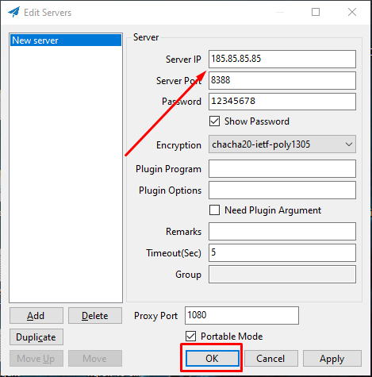
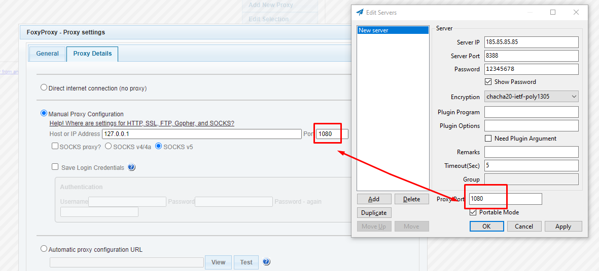
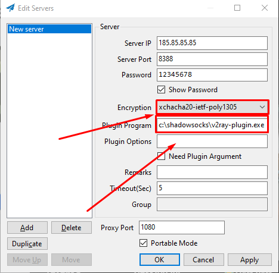

---
title: "Shadowsock + V2Ray"
discription: 
date: 2022-09-06T21:29:01+08:00 
draft: false
type: post
tags: ["VPN","Linux"]
showTableOfContents: true
--- 


## Server Shadowsocks Classic 

first uprgade system

`apt update && apt uprgade -y`
 
install need packets

`apt install shadowsocks-libev -y`

see what your ip address

`ip -br a`


edit options parametrs you can change port and all ip `"::1", "127.0.0.1"` for example "185.85.85.85"

`nano /etc/shodowsocks-libev/config.json`

```json
{
"server":["::1", "127.0.0.1"],
"mode":"tcp_and_udp",
"server_port":"8388",
"local_port":"1080",
"password":"12345678 ",
"timeout":"60",
"method":"chacha20-ietf-poly1305"
}
```
```json
{
"server":["185.85.85.85"],
"mode":"tcp_and_udp",
"server_port":"8388",
"local_port":"1080",
"password":"12345678 ",
"timeout":"60",
"method":"chacha20-ietf-poly1305"
}
```

after change restart service:

`service shadowsocks-libev restart `

and see status:

`service shadowsocks-libev status `


after status active add shadowsocks to autorun after restart:

`systemctl enable shadowsocks-libev`


### V2Ray Plugin

Download plugin for VPS
`https://github.com/shadowsocks/v2ray-plugin/releases`


need togo to shadowsocks folder

`cd /etc/shadowsocks-libev/ `

`wget https://github.com/shadowsocks/v2ray-plugin/releases/download/v1.3.2/v2ray-plugin-linux-amd64-v1.3.2.tar.gz`

repacket him

`tar -xvf v2ray-plugin-linux-amd64-v1.3.2.tar.gz`

remove zip file 

`rm v2ray-plugin-linux-amd64-v1.3.2.tar.gz`

rename 

`mv v2ray_plugin-linux_amd64 v2ray-plugin`

and edit 

`nano /etc/shodowsocks-libev/config.json`

```json
{
"server":["185.85.85.85"],
"mode":"tcp_and_udp",
"server_port":"8388",
"local_port":"1080",
"password":"12345678 ",
"timeout":"60",
"method":"xchacha20-ietf-poly1305",
"nameserver":"1.1.1.1",
"no_delay": true,
"fast_open": true,
"reuse_port": true,
"plugin":"/etc/shadowsocks-libev/v2ray-plugin",
"plugin_opt":"server"
}
```


after change restart service:

`service shadowsocks-libev restart `


## Client Shadowsocks Classic

Download and unzip

`https:github.com/shadowsocks/shadowsocks-windows/releases`

add ip server, port and password




If you want you can add to proxy for web-browser

Download Foxy Proxy from Chrome Extensions




### Client to V2Ray for Windows

`https://github.com/shadowsocks/v2ray-plugin/releases`


Download and unzip rename to `v2ray-plugin.exe`
`https://github.com/shadowsocks/v2ray-plugin/releases/download/v1.3.2/v2ray-plugin-windows-amd64-v1.3.2.tar.gz`

and replace to shadowsocks folder `c:\shadowsocks\v2ray-plugin.exe`




### Client For Android Shadowsocks+V2Ray

shadowsocks can download from GooglePlay


plugin
`https://f-droid.org/en/packages/com.github.shadowsocks.plugin.v2ray/` 