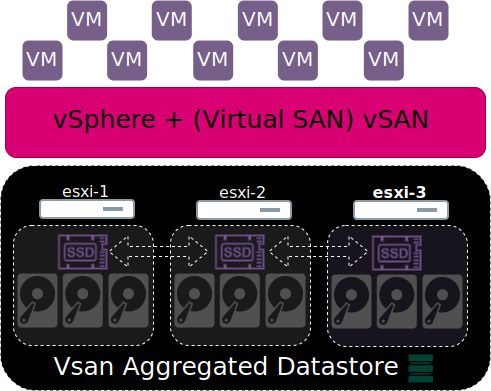

---
title: "VMware"
discription: VMware 
date: 2022-05-01T21:29:01+08:00 
draft: false
type: post
tags: ["Virtualization"]
showTableOfContents: true
--- 


## Compobility

https://www.vmware.com/resources/compatibility/search.php


## vSAN


vSAN Calculator

https://vsan.virtualappliances.eu/




> * 10TB HDD neeed 1TB SSD cache

> * Resistance formula (N = Dead Disk) N x 2 + 1

## ESXi Shell CLI

Troubleshooting Mode Options > Enable ESXI Shell

to enter to shell `Alt` + `F1` 

to exit from Shell `Alt` + `F2`

List Commands
```
esxcli
````

List of adapters
```
esxcli nic list
```

List of vSwitch
```
esxcli network vswitch list
```
List of standard vSwitch
```
esxcli network vswitch standard list
```
List of distributed vSwitch
```
esxcli network vswitch dvs vmware list
```
terminal ASHII graphic console
```
dcui
```