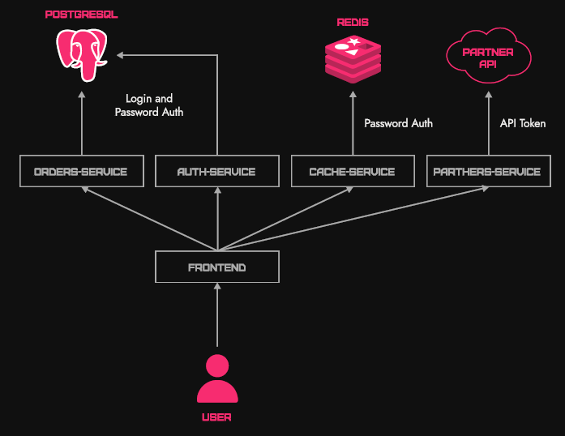
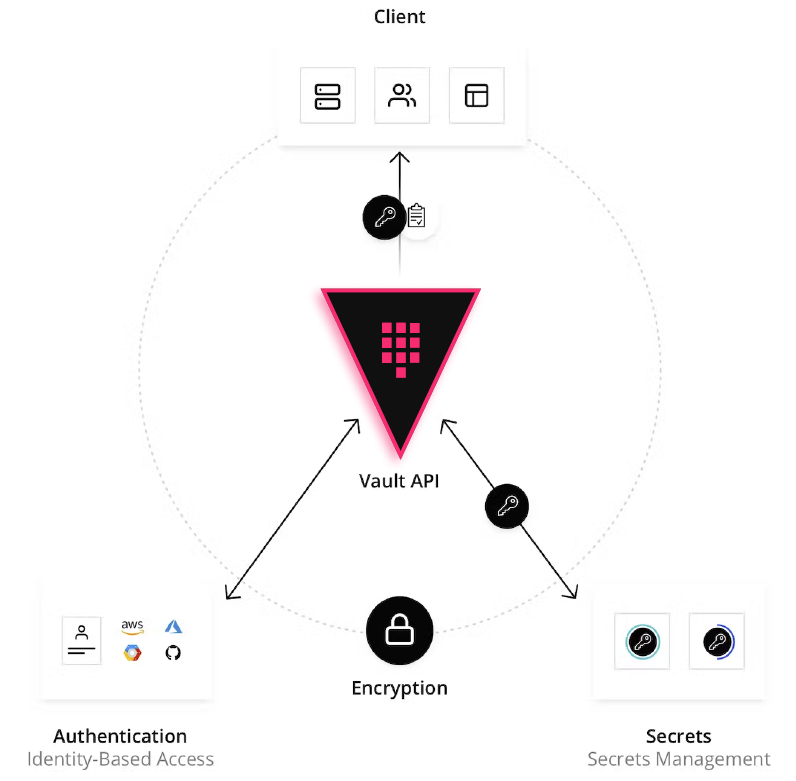
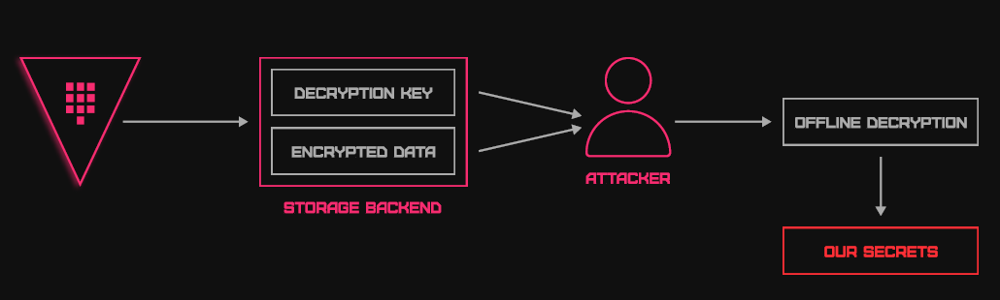
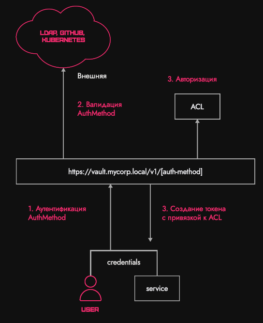
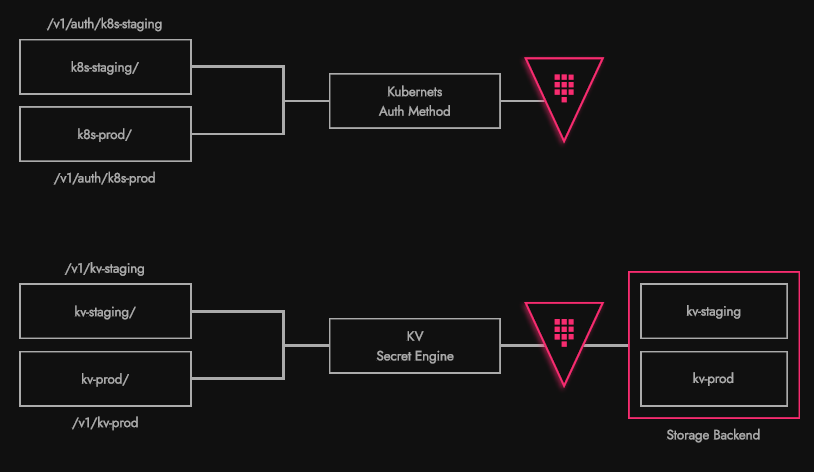
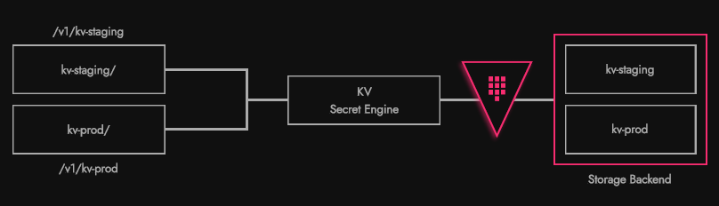
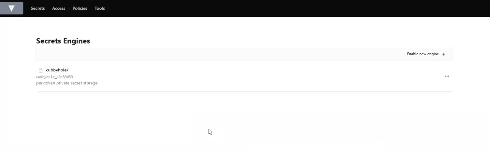
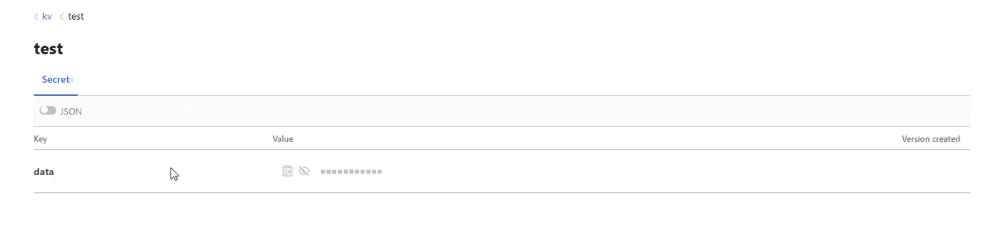

---
title: "Vault"
discription: Vault
date: 2023-05-01T21:29:01+08:00 
draft: false
type: post
tags: ["Vault"]
showTableOfContents: true
--- 

## VLT 01: Vault Overview. Use-cases. Architecture Basics

### **Description**

We are glad to welcome you to the first task of the mini-workshop on HashiCorp Vault.

Today we will look at:

- What are secrets and why keep them? What is Vault and what problems does it solve?

- Vault Architecture Basics (Seal/Unseal, Tokens, Secret Engines, ACLs, etc.)

- What are the analogues of Vault?

- Practice: install Vault on a Linux virtual machine and configure the KV Secret engine there

**What are secrets and why keep them?**

In a broad sense, classified information refers to logins/passwords, private corporate information (documents, etc.).

Vault is designed to store technical secrets that are used by applications.

**What is a secret?**

- Restricted information that should be received by the service at startup and updated as needed
- Example: database login/password, API token, PKI private key, etc.

Below is a microservice architecture, where each of the services uses some other services (for example, their databases).


In each of the services you must log in using a password or token. All this information is stored securely using Vault.

**Problems when working with secrets**

- How to securely deliver a secret for an application?

- How to restrict access to a secret?

- How to make secrets with a limited validity period?

- How to log requests for secrets?

**Vault Architecture Basics**

***Getting to know Vault***

- Vault is part of the HashiCorp “stack” (Terraform, Consul, Nomad). Positioned as an Identify-based secrets and encryption management system ( a system for working with secrets based on some Identify and encryption management )

- Safe concept: all information is encrypted on the fly and recorded in the vault

- Access any secret via a temporary API token. Each token is bound to policies (ACL)



Vault can be divided into three parts:

- frontend (HTTP/S API).

- core (in the picture below). Also called a barrier. All data that comes to the API passes this barrier, is encrypted and recorded in the backend.

- backend (storage backend).


The first thing we need to do after installing Vault is to initialize.

**Initialization**

- It is necessary to write the initial Vault configuration to the selected storage backend

- Vault supports many storage backends (pictured below)


**Еncryption Key&Root Key**

After initialization, Vault generates two keys - Root Key and Encryption Key.

Encryption key deals with encryption of secrets. This is the encryption key of the symmetric algorithm.



To securely store the Encryption Key, a two-key concept is used.

Vault, simultaneously with the Encryption Key, generates a Root Key, which encrypts the Encryption Key. Next, the Root Key is issued to the user and deleted from the memory of everything where it could be.


Vault writes the encrypted Encryption Key to the storage.

Now, if an attacker gains access to the storage and takes out the Encryption Key, it will be useless. The attacker will not recognize the Root Key.

This is the first level of security.


### Shamira Scheme

Maintaining Shamir's scheme is the second level of security.

Root Key is divided into several parts. To open Vault, you will need several people to simultaneously enter N parts of the Root Key.


### API

You should always run Vault with certificates, because if the API runs over HTTP, then in the process of transmitting a secret over the network, traffic can easily be intercepted.

```
$ curl \
    -H "X-Vault-Token: f3b09679-3001-009d-2b80-9c306ab81aa6" \
    -X GET \
    http://127.0.0.1:8200/v1/secret/foo
```
```
$ curl \
    -H "X-Vault-Token: f3b09679-3001-009d-2b80-9c306ab81aa6" \
    -X GET \
    http://127.0.0.1:8200/v1/secret/foo
```
```
$ curl \
    -H "X-Vault-Token: f3b09679-3001-009d-2b80-9c306ab81aa6" \
    -H "Content-Type: application/json" \
    -X POST \
    -d `{"data":{"value":"bar"}}` \
    http://127.0.0.1:8200/v1/secret/baz
```
After initializing the API, you must be authorized in Vault.

### Seal\Unseal
This is a sealing procedure that allows you to close the Vault as needed. Safe concept (seal\unseal) - you can block access to the API for everyone by removing the Encryption Key from RAM

When we decrypt the Encryption Key during initialization, it is placed in RAM.

If we suspect that security may be compromised, with just one command we can remove the Encryption Key from memory.


After each Vault restart, you need to re-enter the Root Key.

### AuthMethod

AuthMethod has two groups of methods:

- “external” (GitHub, LDAP, etc.). Already configured providers with accounts.

- “internal” (AppRole, UserPass). Login: Password.

The diagram below shows that after setting up the authentication process, the user transfers his account information to Vault upon login. In Vault, the administrator pre-configures work with an external provider (for example, GitHub). Thus, the validity of the token or user account will be checked on an external resource




After confirming the user's validity, the authorization process takes place. Vault assigns a policy to the token it issues to a specific user. Vault then gives the token to the user.

### Token

Token is the main authentication method in Vault (AuthMethod creates a token).

The essence of a token is that all authentication methods ultimately come down to it. Once Vault verifies the validity of the credentials passed to it, it issues a token.

Tokens can create other tokens (parent-child).

A token has a time to live (TTL) during which it can be used
```
$ vault token create -policy="default" -period=24h

Key                  Value
---                  -----
token                hvs.CAESIIG_PILmULFY0sEyWHxkZ2mF2a8VPKNLE8eHqd4autYGGh4KHGh2cy5aeTYONFNSaUp3ZnpWbDF1RUNjUkNTZEg
token_accessor       kfhjoayUCHo1yjdbTOYWvlJ1
token_duration       24h
token_renewable      true
token_policies       ["default"]
indentity_policies   []
policies             ["default"]
```
### File System Concept

Auth Method and Secret Egine (the part of Vault that is responsible for data) support the “file system concept”.

You can mount the same AuthMethod\SecretEngine with different configurations.



Policy
ACL - Access Control List. Access control list.

The principle of the policy is that “Everything that is not expressly permitted by the policy is prohibited.”

The policy is written in HCL - HashiCorp Language.

```
# List existing policies
path "sys/policies/acl"
{
  capabilities = ["list"]
}

# Create and manage ACL policies
path "sys/policies/acl*"
{
  capabilities = ["create", "read", "update", "delete", "List", "sudo"]
}
```

Capabilities are actions that are allowed. The example above lists all possible ones, but in practice the maximum number of specified rights is 5.

Sudo allows you to access some system settings. If we want to grant access to a second administrator, we must grant him access to configure certain system settings.

### Secret Engine

Secret Engine is the code that deals with working with secrets. Contains the logic for working with secrets (generation, recording, encryption).



### Dynamic secrets

Dynamic secrets are secrets created by Vault on the fly.

- They are created at the time of the first request to them and for a certain period of time

- Can only be read once upon creation

- Example: secret engine PKI.

### Subtotal

![vault13/13.png]

1.Vault initialization and partition key.

2.Configuration of some authentication method. Users enter their credentials, Vault will check them (in the “external” or “internal” system).

3.Vault issues a token tied to some policy.

4.All actions performed by the user are logged. Vault has auditing.

5.Once Vault has generated the token, it is returned to the user. The user now interacts with the API using this token.

### Security model
- Vault only protects your data, not your entire infrastructure.

- Protect your hosts (Vault won't do it for you)

- Configure access policies correctly (the fewer privileges, the better)


## Install Vault 


Vault immediately prompts you to start an HTTP server. By default, we run HTTPS on port 8200.

To carry out initialization from the console, write the following:

```
export VAULT_ADDR=http://127.0.0.1:8200
vault operator init -key-shares=3 -key-threshold=2 tls-skip-verify
```
`Key-shares` is the number of parts into which the Root Key will be divided, and  `key-threshold` is the key threshold (the minimum number of keys that can be used to open the Vault).

> The Initial Root Token has an unlimited lifespan and comes with all rights. You need to store such a token somewhere secret, since the Initial Root Token gives access to your account.


Our safe's Seal Type is Shamir, because it is divided into several keys.

We copy three keys (Unseal Key) so as not to lose them.

Next, we use these keys to print Vault.

```
vault operator unseal -tls-skip-verify # open terminal Unseal Key (will be hidden)

export VAUL^C
ls
cd tls/
openssl x509 -in tls.crt -text -noout

export VAULT_SKIP_VERIFY=true
vault operator unseal
```

It is assumed that the command  `vault operator unseal` is run by each of those people to whom you gave part of your key. Together, the keys open Vault.

We enter all three keys - now Vault tells us that it has been printed.

We go to the admin panel, where Vault prompts you to log in:


For now, only Method Token is available for login.

After authorization, the following window will open (in the image below). Here will be a list of our Secret Engines. While only cubbyhole (Secret Engine for a specific token) is available, it is enabled by default.



We turn on the KV Secret Engine:
```
vault secrets enable -version 1 kv
```
We can enable KV using other mount points:
```
vault secrets enable -version 1 -path kv-staging kv
vault secrets enable -version 1 -path kv-prod kv
```
Thus, there will be separate secrets, each in its own engine.

Next, let's write down some secret:
```
vault write kv/test data=123
```
It appears in Vault:



This secret is also available in JSON:
```
{
  "data": "123"
}
```
Now let's write down another secret:
```
vault write kv/prod-db login=user password=pass
```
Let's make some kind of token with a policy for this secret. To do this, we will use an automatic policy generator:
```
vault read -output-policy kv/prod-db
```
Vault generated a ready-made policy for us, which we need to perform an action if we want to record something.

Vault will automatically substitute the actions required to complete the recording.

Next, let's issue a token:
```
vault token create -policy=kv-prod-read #default ttl token 32 days
```
Vault returned us token, token_accessor, token_duration, token_renewable, etc. What interests us most here is that he created a policy  `kv-prod-read` and  `default`... They will allow the token to view information about itself. If this policy were not in place, the owner of the token would not know the expiration date.

Let's change the token:
```
export VAULT_TOKEN="hvs.CAESIAmAPizsKwEwsvaAPzxnIm7gosICUUle9Xj64G5FELyoGh4KHGh2cy5qQnJvSmp1eG94YmNIVklMcjZlTnFINkk"
vault read kv/prod-db
```
If we try to read something else, Vault tells us that we do not have permission to do so.


Total

Thus, today we learned that:

A secret is restricted information that must be acquired by the service at startup and updated as needed;

- Vault is needed to store secrets;

- Vault generates two keys - Encryption key (for encrypting secrets) and Root key (for encrypting Encryption key);

- The Root key is divided into several parts, distributed to different owners and deleted from memory;

- Vault has two authentication methods - internal and external;

- Token is the main authentication method in Vault;

- In Vault, anything that is not explicitly allowed by policy is prohibited;

- Secret Engine is the code that deals with working with secrets. Contains the logic for working with secrets (generation, recording, encryption).


To run Vault in TLS mode with self-signed certificates, you must do the following:

Create file `cert.conf`
```
[req]
distinguished_name = req_distinguished_name
x509_extensions = v3_req
prompt = no
[req_distinguished_name]
C = US
ST = Ba
L = Mu
O = sh
CN = *
[v3_req]
subjectKeyIdentifier = hash
authorityKeyIdentifier = keyid,issuer
basicConstraints = CA:TRUE
subjectAltName = @alt_names
[alt_names]
DNS.1 = *
DNS.2 = *.*
DNS.3 = *.*.*
DNS.4 = *.*.*.*
DNS.5 = *.*.*.*.*
DNS.6 = *.*.*.*.*.*
DNS.7 = *.*.*.*.*.*.*
IP.1 = 127.0.0.1
```

Generate key and certificate
```bash
openssl req -x509 -batch -nodes -newkey rsa:2048 -keyout selfsigned.key -out selfsigned.crt -config cert.conf -days 365
```
Add a certificate to the list of trusted ones
```bash
sudo cp selfsigned.crt /usr/local/share/ca-certificates
sudo update-ca-certificates
```
Copy the selfsigned.crt and selfsigned.key files to the folder /opt/vault/tls/
```bash
sudo cp selfsigned.crt /opt/vault/tls
sudo cp selfsigned.key /opt/vault/tls
```
Change owner and group of copied files
```bash
sudo chown -R vault:vault /opt/vault/tls/
```
Change the path to the certificate and key in the file /etc/vault.d/vault.hcl
```bash

listener "tcp" {
  address       = "0.0.0.0:8200"
  tls_cert_file = "/opt/vault/tls/selfsigned.crt"
  tls_key_file  = "/opt/vault/tls/selfsigned.key"
}
```
Start the vault service
```bash
sudo systemctl start vault
```
You will need to perform this procedure only in the first task; in the future, a ready-made infrastructure will be provided, unless the task requires otherwise.


### Install from package Ubuntu

 wget -O- https://apt.releases.hashicorp.com/gpg | sudo gpg --dearmor -o /usr/share/keyrings/hashicorp-archive-keyring.gpg
 echo "deb [signed-by=/usr/share/keyrings/hashicorp-archive-keyring.gpg] https://apt.releases.hashicorp.com $(lsb_release -cs) main" | sudo tee /etc/apt/sources.list.d/hashicorp.list
 sudo apt update && sudo apt install vault


 ### Install Binary


Systemd

 ```ini
 [Unit]
Description=Vault Agent
Requires=consul-online.target
After=consul-online.target

[Service]
Restart=on-failure
EnvironmentFile=/etc/vault.d/vault.conf
PermissionsStartOnly=true
ExecStartPre=/sbin/setcap 'cap_ipc_lock=+ep' /usr/local/bin/vault
ExecStart=/usr/local/bin/vault server -config /etc/vault.d $FLAGS
ExecReload=/bin/kill -HUP $MAINPID
KillSignal=SIGTERM
User=vault
Group=vault
LimitMEMLOCK=infinity

[Install]
WantedBy=multi-user.target
```