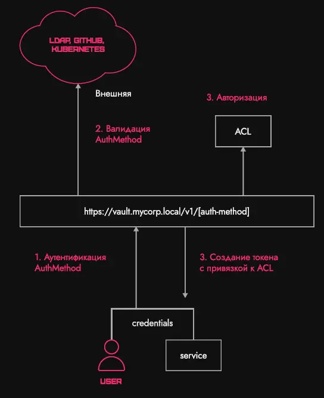

---
title: "Vault"
discription: Vault
date: 2023-05-01T21:29:01+08:00 
draft: false
type: post
tags: ["Vault"]
showTableOfContents: true
--- 

## Vault Overview. Use-cases. Architecture Basics

### **Description**

We are glad to welcome you to the first task of the mini-workshop on HashiCorp Vault.

Today we will look at:

- What are secrets and why keep them? What is Vault and what problems does it solve?

- Vault Architecture Basics (Seal/Unseal, Tokens, Secret Engines, ACLs, etc.)

- What are the analogues of Vault?

- Practice: install Vault on a Linux virtual machine and configure the KV Secret engine there

**What are secrets and why keep them?**

In a broad sense, classified information refers to logins/passwords, private corporate information (documents, etc.).

Vault is designed to store technical secrets that are used by applications.

**What is a secret?**

- Restricted information that should be received by the service at startup and updated as needed
- Example: database login/password, API token, PKI private key, etc.

Below is a microservice architecture, where each of the services uses some other services (for example, their databases).


In each of the services you must log in using a password or token. All this information is stored securely using Vault.

**Problems when working with secrets**

- How to securely deliver a secret for an application?

- How to restrict access to a secret?

- How to make secrets with a limited validity period?

- How to log requests for secrets?

**Vault Architecture Basics**

***Getting to know Vault***

- Vault is part of the HashiCorp “stack” (Terraform, Consul, Nomad). Positioned as an Identify-based secrets and encryption management system ( a system for working with secrets based on some Identify and encryption management )

- Safe concept: all information is encrypted on the fly and recorded in the vault

- Access any secret via a temporary API token. Each token is bound to policies (ACL)


Vault can be divided into three parts:

- frontend (HTTP/S API).

- core (in the picture below). Also called a barrier. All data that comes to the API passes this barrier, is encrypted and recorded in the backend.

- backend (storage backend).


The first thing we need to do after installing Vault is to initialize.

**Initialization**

- It is necessary to write the initial Vault configuration to the selected storage backend

- Vault supports many storage backends (pictured below)


**Еncryption Key&Root Key**

After initialization, Vault generates two keys - Root Key and Encryption Key.

Encryption key deals with encryption of secrets. This is the encryption key of the symmetric algorithm.


To securely store the Encryption Key, a two-key concept is used.

Vault, simultaneously with the Encryption Key, generates a Root Key, which encrypts the Encryption Key. Next, the Root Key is issued to the user and deleted from the memory of everything where it could be.


Vault writes the encrypted Encryption Key to the storage.

Now, if an attacker gains access to the storage and takes out the Encryption Key, it will be useless. The attacker will not recognize the Root Key.

This is the first level of security.


### Shamira Scheme

Maintaining Shamir's scheme is the second level of security.

Root Key is divided into several parts. To open Vault, you will need several people to simultaneously enter N parts of the Root Key.


### API

You should always run Vault with certificates, because if the API runs over HTTP, then in the process of transmitting a secret over the network, traffic can easily be intercepted.

```
$ curl \
    -H "X-Vault-Token: f3b09679-3001-009d-2b80-9c306ab81aa6" \
    -X GET \
    http://127.0.0.1:8200/v1/secret/foo
```
```
$ curl \
    -H "X-Vault-Token: f3b09679-3001-009d-2b80-9c306ab81aa6" \
    -X GET \
    http://127.0.0.1:8200/v1/secret/foo
```
```
$ curl \
    -H "X-Vault-Token: f3b09679-3001-009d-2b80-9c306ab81aa6" \
    -H "Content-Type: application/json" \
    -X POST \
    -d `{"data":{"value":"bar"}}` \
    http://127.0.0.1:8200/v1/secret/baz
```
After initializing the API, you must be authorized in Vault.

### Seal\Unseal
This is a sealing procedure that allows you to close the Vault as needed. Safe concept (seal\unseal) - you can block access to the API for everyone by removing the Encryption Key from RAM

When we decrypt the Encryption Key during initialization, it is placed in RAM.

If we suspect that security may be compromised, with just one command we can remove the Encryption Key from memory.


After each Vault restart, you need to re-enter the Root Key.

### AuthMethod

AuthMethod has two groups of methods:

- “external” (GitHub, LDAP, etc.). Already configured providers with accounts.

- “internal” (AppRole, UserPass). Login: Password.

The diagram below shows that after setting up the authentication process, the user transfers his account information to Vault upon login. In Vault, the administrator pre-configures work with an external provider (for example, GitHub). Thus, the validity of the token or user account will be checked on an external resource




After confirming the user's validity, the authorization process takes place. Vault assigns a policy to the token it issues to a specific user. Vault then gives the token to the user.

### Token

Token is the main authentication method in Vault (AuthMethod creates a token).

The essence of a token is that all authentication methods ultimately come down to it. Once Vault verifies the validity of the credentials passed to it, it issues a token.

Tokens can create other tokens (parent-child).

A token has a time to live (TTL) during which it can be used
```
$ vault token create -policy="default" -period=24h

Key                  Value
---                  -----
token                hvs.CAESIIG_PILmULFY0sEyWHxkZ2mF2a8VPKNLE8eHqd4autYGGh4KHGh2cy5aeTYONFNSaUp3ZnpWbDF1RUNjUkNTZEg
token_accessor       kfhjoayUCHo1yjdbTOYWvlJ1
token_duration       24h
token_renewable      true
token_policies       ["default"]
indentity_policies   []
policies             ["default"]
```
### File System Concept

Auth Method and Secret Egine (the part of Vault that is responsible for data) support the “file system concept”.

You can mount the same AuthMethod\SecretEngine with different configurations.


Policy
ACL - Access Control List. Access control list.

The principle of the policy is that “Everything that is not expressly permitted by the policy is prohibited.”

The policy is written in HCL - HashiCorp Language.

```
# List existing policies
path "sys/policies/acl"
{
  capabilities = ["list"]
}

# Create and manage ACL policies
path "sys/policies/acl*"
{
  capabilities = ["create", "read", "update", "delete", "List", "sudo"]
}
```

Capabilities are actions that are allowed. The example above lists all possible ones, but in practice the maximum number of specified rights is 5.

Sudo allows you to access some system settings. If we want to grant access to a second administrator, we must grant him access to configure certain system settings.

### Secret Engine

Secret Engine is the code that deals with working with secrets. Contains the logic for working with secrets (generation, recording, encryption).


### Dynamic secrets

Dynamic secrets are secrets created by Vault on the fly.

- They are created at the time of the first request to them and for a certain period of time

- Can only be read once upon creation

- Example: secret engine PKI.

### Subtotal


1.Vault initialization and partition key.

2.Configuration of some authentication method. Users enter their credentials, Vault will check them (in the “external” or “internal” system).

3.Vault issues a token tied to some policy.

4.All actions performed by the user are logged. Vault has auditing.

5.Once Vault has generated the token, it is returned to the user. The user now interacts with the API using this token.

### Security model
- Vault only protects your data, not your entire infrastructure.

- Protect your hosts (Vault won't do it for you)

- Configure access policies correctly (the fewer privileges, the better)


## Install Vault 


Vault immediately prompts you to start an HTTP server. By default, we run HTTPS on port 8200.

To carry out initialization from the console, write the following:

```
export VAULT_ADDR=http://127.0.0.1:8200
vault operator init -key-shares=3 -key-threshold=2 tls-skip-verify
```
`Key-shares` is the number of parts into which the Root Key will be divided, and  `key-threshold` is the key threshold (the minimum number of keys that can be used to open the Vault).

> The Initial Root Token has an unlimited lifespan and comes with all rights. You need to store such a token somewhere secret, since the Initial Root Token gives access to your account.


Our safe's Seal Type is Shamir, because it is divided into several keys.

We copy three keys (Unseal Key) so as not to lose them.

Next, we use these keys to print Vault.

```
vault operator unseal -tls-skip-verify # open terminal Unseal Key (will be hidden)

export VAUL^C
ls
cd tls/
openssl x509 -in tls.crt -text -noout

export VAULT_SKIP_VERIFY=true
vault operator unseal
```

It is assumed that the command  `vault operator unseal` is run by each of those people to whom you gave part of your key. Together, the keys open Vault.

We enter all three keys - now Vault tells us that it has been printed.

We go to the admin panel, where Vault prompts you to log in:


For now, only Method Token is available for login.

After authorization, the following window will open (in the image below). Here will be a list of our Secret Engines. While only cubbyhole (Secret Engine for a specific token) is available, it is enabled by default.


We turn on the KV Secret Engine:
```
vault secrets enable -version 1 kv
```
We can enable KV using other mount points:
```
vault secrets enable -version 1 -path kv-staging kv
vault secrets enable -version 1 -path kv-prod kv
```
Thus, there will be separate secrets, each in its own engine.

Next, let's write down some secret:
```
vault write kv/test data=123
```
It appears in Vault:


This secret is also available in JSON:
```
{
  "data": "123"
}
```
Now let's write down another secret:
```
vault write kv/prod-db login=user password=pass
```
Let's make some kind of token with a policy for this secret. To do this, we will use an automatic policy generator:
```
vault read -output-policy kv/prod-db
```
Vault generated a ready-made policy for us, which we need to perform an action if we want to record something.

Vault will automatically substitute the actions required to complete the recording.

Next, let's issue a token:
```
vault token create -policy=kv-prod-read #default ttl token 32 days
```
Vault returned us token, token_accessor, token_duration, token_renewable, etc. What interests us most here is that he created a policy  `kv-prod-read` and  `default`... They will allow the token to view information about itself. If this policy were not in place, the owner of the token would not know the expiration date.

Let's change the token:
```
export VAULT_TOKEN="hvs.CAESIAmAPizsKwEwsvaAPzxnIm7gosICUUle9Xj64G5FELyoGh4KHGh2cy5qQnJvSmp1eG94YmNIVklMcjZlTnFINkk"
vault read kv/prod-db
```
If we try to read something else, Vault tells us that we do not have permission to do so.


Total

Thus, today we learned that:

A secret is restricted information that must be acquired by the service at startup and updated as needed;

- Vault is needed to store secrets;

- Vault generates two keys - Encryption key (for encrypting secrets) and Root key (for encrypting Encryption key);

- The Root key is divided into several parts, distributed to different owners and deleted from memory;

- Vault has two authentication methods - internal and external;

- Token is the main authentication method in Vault;

- In Vault, anything that is not explicitly allowed by policy is prohibited;

- Secret Engine is the code that deals with working with secrets. Contains the logic for working with secrets (generation, recording, encryption).


To run Vault in TLS mode with self-signed certificates, you must do the following:

Create file `cert.conf`
```
[req]
distinguished_name = req_distinguished_name
x509_extensions = v3_req
prompt = no
[req_distinguished_name]
C = US
ST = Ba
L = Mu
O = sh
CN = *
[v3_req]
subjectKeyIdentifier = hash
authorityKeyIdentifier = keyid,issuer
basicConstraints = CA:TRUE
subjectAltName = @alt_names
[alt_names]
DNS.1 = *
DNS.2 = *.*
DNS.3 = *.*.*
DNS.4 = *.*.*.*
DNS.5 = *.*.*.*.*
DNS.6 = *.*.*.*.*.*
DNS.7 = *.*.*.*.*.*.*
IP.1 = 127.0.0.1
```

Generate key and certificate
```bash
openssl req -x509 -batch -nodes -newkey rsa:2048 -keyout selfsigned.key -out selfsigned.crt -config cert.conf -days 365
```
Add a certificate to the list of trusted ones
```bash
sudo cp selfsigned.crt /usr/local/share/ca-certificates
sudo update-ca-certificates
```
Copy the selfsigned.crt and selfsigned.key files to the folder /opt/vault/tls/
```bash
sudo cp selfsigned.crt /opt/vault/tls
sudo cp selfsigned.key /opt/vault/tls
```
Change owner and group of copied files
```bash
sudo chown -R vault:vault /opt/vault/tls/
```
Change the path to the certificate and key in the file /etc/vault.d/vault.hcl
```bash

listener "tcp" {
  address       = "0.0.0.0:8200"
  tls_cert_file = "/opt/vault/tls/selfsigned.crt"
  tls_key_file  = "/opt/vault/tls/selfsigned.key"
}
```
Start the vault service
```bash
sudo systemctl start vault
```
You will need to perform this procedure only in the first task; in the future, a ready-made infrastructure will be provided, unless the task requires otherwise.


### Install from package Ubuntu
```
wget -O- https://apt.releases.hashicorp.com/gpg | sudo gpg --dearmor -o /usr/share/keyrings/hashicorp-archive-keyring.gpg

echo "deb [signed-by=/usr/share/keyrings/hashicorp-archive-keyring.gpg] https://apt.releases.hashicorp.com $(lsb_release -cs) main" | sudo tee /etc/apt/sources.list.d/hashicorp.list

sudo apt update && sudo apt install vault
```

 ### Install Binary


Systemd

```ini
[Unit]
Description=Vault Agent
Requires=consul-online.target
After=consul-online.target

[Service]
Restart=on-failure
EnvironmentFile=/etc/vault.d/vault.conf
PermissionsStartOnly=true
ExecStartPre=/sbin/setcap 'cap_ipc_lock=+ep' /usr/local/bin/vault
ExecStart=/usr/local/bin/vault server -config /etc/vault.d $FLAGS
ExecReload=/bin/kill -HUP $MAINPID
KillSignal=SIGTERM
User=vault
Group=vault
LimitMEMLOCK=infinity

[Install]
WantedBy=multi-user.target
```


## KV Secret Engine

Vault in developer mode

By running the command  `vault server -dev`, you can quickly set up a test server for “playing around”

> It cannot be used in production! (data is stored in RAM)

 launch it `vault server -dev`, and the server automatically starts up. One **Unseal Key** and **Root Token** are generated.

 > If you already have some kind of configured production cluster in Vault, but you don’t want to experiment with it, you don’t need to deploy a separate instance. You can install Vault on your local machine, run this command and check the operation of the program, experiment with it.


 ### Key-Value Secret Engine

 More about KV

 There are two versions of KV:

- v1 Can be used if passwords and tokens rarely change.

- v2 If everything is actively rotating, there are many secrets, then you need to download the second version.


An important feature of v2 is versioning. As shown in the diagram below, if you write something in the first version and then add a new one, the first version will not be deleted - Vault saves both versions. If you need to remove something, you can do it on purpose.


> The path to the secret data in v2 is different, now it is accessible through: /[mount_point]/data/[secret_name]

### KV v2: metadata
Metadata is:

Service (main):
- `cas_required` (bool) - Check-and-Set operation flag.

- `delete_version_after` (string) - time (hours, minutes, seconds) after which the secret version will be deleted. This is useful for self-destructing secrets. You can use Vault as a temporary exchange for secret data.

- `max_versions` (integer) - the maximum number of versions that will be stored.

Custom Custom fields that can be added if necessary:

`custom_metadata` - key-value map for metadata. For example, created_by: `my-python-app`


KV v2: Check-and-Set

When multiple services work with the Secret Engine, there is a risk that the secrets will not match the versions. To prevent this from happening, you need to enable the option  `cas`.

- The cas parameter is a pointer to the current version that you specify in the write request.

- If cas is not equal to the current version in Vault, then writing will be denied.
```
------- Metadata -------
Key                Value
---                -----
created_time       2022-07-31T13:28:09.673358251Z
custom_metadata    <nil>
deletion_time      n/a
destruyed          false
version            8
oem@virtual-ubuntu:~$ vault kv put -mount=kv-v2 -cas 6 users/student id=123 password=qwerty1237
Error writing data to kv-v2/data/users/student: Error making API request.

URL: PUT http://127.0.0.1:8200/v1/kv-v2/data/users/student
Code: 400. Errors:

*** check-and-set parameter did not match the current version**
```

You need to first read the number of versions from the metadata and write this number to a parameter when executing the request. If you specify an incorrect parameter, Vault will not complete the request.

### Practice: enabling KV v2

see keys:
```bash
cat vaults-keys
```
Print out Vault ( `vault operator unseal`) and turn on the engine:  

`vault secrets enable -path=kv-v2 -version=2 kv`

To work with the secrets engine in KV v2, Vault has a separate KV command space.

Adding a secret: 
```bash
vault kv put -mount=kv-v2 users/student id=123 passwird=qwerty
```
In the second version, all main actions will be performed with  kv.
```bash
vault kv put -mount kv-v2 test login=user
```
The secret has been recorded. We will get back its metadata, which was not present in the first version of Key-Value.

If we write another request, the version counter will be updated.
```bash
vault kv put -mount kv-v2 test login=user2 
```

You can view all versions using the get command.
```bash
vault kv metadata get -mount kv-v2 test
```
This way we can get all the metadata and all the versions that we recorded at once.

Now let's look at the operation of the flag `cas`, which should limit overwriting the current version without specifying.

- Add metadata: `vault kv metadata put -mount=kv-v2 -custom-metadata=created-by=cli -custom-metadata comment=”temp user” users/student`

We update the metadata and write a request with cas:
```bash
vault kv metadata put -cas-required=true -mount kv-v2 test
```
We wrote metadata to the test secret.

Now the flag  `cas_required` is enabled (equal to true).


If you write something down, Vault will remind you of the current version so you don’t mindlessly write extra versions.

Before you write something down, you should always indicate  `cas` the current version number. This makes it easy to synchronize the entry if multiple services have the same key in their secrets.


## ACL Tokens

### Basic parameters of tokens

There are two types:

- **Service Token** - is a state full token. When it is issued, Vault creates a list (lease) and stores some meta information about this token.

- **Batch Token** -  is a state list token. It is a binary object in which all the information necessary for Vault is already encoded. Batch Token is usually used for replication because it is much easier to replicate a state list token between clusters than a Service Token.

All tokens have a time to live (TTL), after which they can no longer be used.

> There is an exception: Root Service Token lives forever.

You can create as many Root Service Tokens as you like.
```bash
vault token create
```
And after creation it is clear that  `token_duration` it is equal to infinity.


This is bad practice. This should be used only in the most extreme cases, when you cannot get into the cluster. In all other cases, it is better to configure some normal authentication method.

### Token Accessor

Accessor can be compared to a unique token identifier.

The accessor of the token allows you to perform some "secure" operations with this token:

- lookup (view information)

- renew (extend the validity period of the token)

- revoke (recall)

```
Key                   Value
---                   -----
token                 hvs.CAESII7KQaA6tTz30uRBhcbCuhppjOiYerg0dAm2hMBrpZ0bGh4KHGh2cy52dm5zSTVNTTRzUG1FMmFnYkcxYnVFVms
token_accessor        7Dgc4Tr0IeTtyIyI71xp9kI0fp
token_duration        1h
token_renewable       true
token_policies        ["default"
indentufy_policies    []
policies              ["default"]
```

```
vault token renew -accessor 7Dgc4Tr0IeTtyIyI71xp9kI0fp
Key                   Value
---                   -----
token                 n/a
token_accessor        7Dgc4Tr0IeTtyIyI71xp9kI0fp
token_duration        1h
token_renewable       true
token_policies        ["default"]
indentufy_policies    []
policies              ["default"]
```

```
vault token renew
Key                   Value
---                   -----
token                 hvs.CAESII7KQaA6tTz30uRBhcbCuhppjOiYerg0dAm2hMBrpZ0bGh4KHGh2cy52dm5zSTVNTTRzUG1FMmFnYkcxYnVFVms
token_accessor        7Dgc4Tr0IeTtyIyI71xp9kI0fp
token_duration        1h
token_renewable       true
token_policies        ["default"]
indentufy_policies    []
policies              ["default"]
```
The Accessor is needed to avoid revealing the secret token, for example, when we set up an audit. When setting up, all actions with the token will be logged not with the secret token, but with the accessor value.


### Token hierarchy


You can delegate the rights to issue tokens to someone and revoke at any time all the tokens issued to them with one command.

If your Kubernetes cluster is temporary, you won't need to separately revoke all of the child tokens that were created to shut it down. It is enough to revoke only the parent one.

If you want to create tokens that do not support this mechanism, specify orphaned. Then each service will have its own independent token.


### TTL

- TTL is the time during which the token can be used.

- During this time, the token can be renewed (but not an infinite number of times).

- If the TTL is expired, the token is revoked (it can no longer be renewed).

- Real life example - Dead Man Switch. During operation, the system needs to understand that the operator is alive and active by periodically pressing the button. You also need to do something with the token to show that it is in use. If a token is not used, Vault considers it abandoned, so it can revoke it.

- You won't be able to log into Vault with an expired token (error 403 - access denied).

### Max TTL

The maximum TTL extension time depends on the following factors:

`system max ttl` - is set in the config of Vault itself on the server. Default: 32 days.

`mount max ttl` - max ttl, which is set when mounting AuthMethod\SecretEngine. You can make the period more or less than 32 days.

`AuthMethod entity max ttl` - for example, in the userpass method we can assign max TTL for each user ( but not more than mount max TTL! )

You can set max ttl for a specific token -  `explicit max ttl`. Explicit max ttl does not depend on either system max ttl or mount max ttl.

In the config, max ttl is set by default (default list token ttl parameter) to 32 days.

#### Practice

Let's see how this is set in the config:
```
cd /etc/vault.d
ls
nano vault.hcl
```
There is a parameter here  `default_lease_ttl`.

> Let's set this parameter for 24 hours (24h):  `default_lease_ttl = "24h"`. Now all tokens will have this ttl by default.


Create a token:
```bash
vault token create
```

To change the token policy, use the key  -policy:
```bash
vault token create -policy=user
```
The policy we specify does not have to exist; it can be defined later.

Let's set it  `max_lease_ttl` for 48 hours:  `max_lease_ttl = "48h"`.

Extend the ttl of a token, you can run the following command:
```bash
vault token renew *hvs.CAESIJ5BkedKr8zoHf0vXOv83BxUsEd7d-ddJlbLlxQoTA-zGh4KHGh2cy5vbVBNcUJqMFF0UTZ3aHBjU2l1cTlBU3k*
```

Now let's look at max ttl and how the user/pass engine is turned on.
```bash
vault auth method enable -path userlogin userpass
vault write auth/userlogin/user password=12345
vault login -path userlogin -method userpass username=user
```
If you log in with the command  `vault login`, you can see that the token will be received for 24 hours. However there should now be a max ttl since this token was created via  `-method`.

If we try to renew the token for more than 48 hours, an error will appear, since it is impossible to set an expiration date greater than max ttl.

Let's try to set max ttl for a shorter period:

```bash
vault auth disable=userlogin
vault auth enable -max-lease-ttl 10h -path userlogin userpass
```

Max ttl changed to 10 hours.


Now it turns out that the default ttl is 24 hours, and the maximum is 10.

Let's try to renew the token, but only within the max ttl. If we want to set the TTL of a token for a specific user, we can set it to a period of 1 hour.

```bash
vault write auth/userlogin/users/user password=12345 token_max_ttl=1h
vault login -path userlogin -method userpass username=user
```
It is no longer possible to update this period, because the priority of max ttl for this user is much higher than for mount max ttl, and even more so system max ttl.

This is how you can view the policy for a user.
```bash
vault write auth/userlogin/users/user password=12345 token_max_ttl=1h policies=users

vault login -path userlogin -method userpass username=user policies=user-policy
```

In addition to the default one, there is also a users policy for the user. Moreover, policies do not depend on tokens.

Let's say the user will have a ttl of 30 minutes and a max ttl of 1 hour. When we log in, by default Vault will issue a token for 30 minutes. During these 30 minutes we must confirm our activity. If we write  vault token renew, then ttl will reach the limit (1 hour). Thus, within an hour we can renew the token. If we forget to update it after 30 minutes, Vault will revoke this token.

***Periodic tokens***

Periodic Token (periodic) - a token created for a time, but with the ability to extend it indefinitely. It is released for some service. Periodic token does not have a max ttl. The service itself will update this token, indicating activity.


Create a token with a period of 30 seconds:
```bash
vault token create -period=30s -policy=policy
```
You need to have time to write  `renew` for this token so that it is not deleted. If you fail to do so, the token is automatically revoked and information about it is deleted

For periodic token, you can execute the command  `renew` an infinite number of times.

When we deploy a service that cannot be rebooted, it makes sense to issue a periodic token for it.

It is believed that one of the safest ways to work with sensitive information is to change passwords frequently. This leaves a very small window for attackers to attack. Even if a token with a 1-minute lifetime is stolen, the attacker will have virtually no time left to do anything malicious. If the hacker does not have access to the system that issues the tokens, then the stolen token will be useless.

***Token with a limited number of uses***

In addition to TTL, you can limit the number of API calls with a specific token. The parameter is responsible for this  `num_uses`.  `num_uses` does not replace TTL. This feature can provide a new level of system security.
```bash
vault token create -period=30s -use-limit 3 -policy=policy
```
After three operations are completed, the token will be considered invalid.

**Token role**

You can also group common parameters for tokens into a role, which is useful for services

For example:
```bash
vault write auth/token/roles/my-role \
allowed_policies="policy1, policy2, policy3" \
period=8h
```
To issue tokens with an already defined set of policies, you need to include the parameters necessary for the token in the role.

The Token Role settings have allowed and denied policies.

We are interested in the limit on the number of uses ( `token_num_uses`).

Let's create a simple role that will issue tokens with a period of 1 hour:
```bash
vault write auth/token/roles/test-role period=1h policies="policy1","policy2"
```
Now we can create a token from this role:
```bash
vault token create -role test-role -policy=1
```
Moreover, the role should prohibit the creation of tokens with policies that are not specified in  `allowed_policies`.

**Batch Tokens**

Batch Tokens are “lightweight” tokens. When creating a token, Vault does not create an accessor for it. The token contains all the information “in itself” (encrypted blob). Used in the Enterprice version due to support for cross-cluster replication.
```
Key                   Value
---                   -----
token                 hvb.AAAAAQIvMowYqAH_YHAeuOBdxm3U4jkQInC2ktGHA29-RHr2L0r7iIx
Wmv2Z3_LjE7b5ty-pCfJcZ_yXLsNYq65FDV5bhvjqg8TnFeAuth3_AZy7qORMbvXKoGr3DQLumB5ba9h
-5D32HrJU9JLJt4Ryz8NbElUKOE6hFxDKBgFKOJ6Jl4-hSZbJ2_3omtBQANXJ
token_accessor        n/a
token_duration        1m
token_renewable       false
```

When creating such a token, we write the following:
```bash
vault token create -type=batch -policy=1234
```
At the beginning of the Batch token name is written  `hvb`, not  `hvs`.

You can use Batch Token if Vault works with very heavy loads.

Examples of cases

Case 1

The developer needs to perform some operation on the database. ETA - 2 hours. The maximum time is 8 hours (we assume that if a task takes more than a working day, then something is wrong).

The DBA issues a token with token_ttl=2h token_max_tl=8h
If the developer does it in 2 hours - no problem
If the developer understands that after 1.5 hours of work there is no way he can meet 2 hours, he renews his token for some more time
If the developer does not meet the deadline within 8 hours, the token is revoked and no renew is accepted.
This allows you to give access to some very secret systems for a specified time.

Case 2

The developers have made a new service that works with the database. The service is not critical, it allows interruptions of up to 10 minutes.

The DBA issues a token with  token_period_ttl <= token_max_ttl, for example, 20 minutes. The business policy of the service is to update the token every minute
If the service has fallen, then it must be raised within a time that does not exceed 20 minutes
If the service is “deprecated”, then after 20 minutes the token will be revoked, because it is not updated in a timely manner


### ACL policies
Tokens are useless without policies. A policy in Vault is an ACL (access control list) like:
```bash
# Allow tokens to look up their own properties
path "auth/token/lookup-self" { Путь API
    capabilities = ["read"] Список разрешенных действий
}

# Allow tokens to renew themselves
path "auth/token/renew-self" {
    capabilities = ["update"]
}

# Allow tokens to revoke themselves
path "auth/token/revoke-self" {
    capabilities = ["update"]
}
```

The token only helps with authentication. For authorization, some kind of policy is already needed. A policy in Vault consists of blocks that contain the API path.

Capabilities are capabilities, permitted actions.

The policy is written in HCL (HasiCorp's own development) or JSON (useful for auto-configuring policies).

List of actions:

- Standard CRUD (create, read, update, delete)

- list - display a list of something (roles, users, etc.)

- patch - partial update of the config (for example, individual AuthMethod fields)

- sudo - access to "admin" things (mainly sys/)

- deny - deny access. Always takes precedence over resolution.

### Advanced ACL capabilities

Advanced ACL features:

- glob. Allows you to assign allowed actions for all nesting levels, starting from some (*)

- template
```bash
# Permit reading only "secret/foo". An attached token cannot read "secret/fod"
# or "secret/foo/bar".
path "secret/foo" {
  capabilities = ["read"]
}

# Permit reading everything under "secret/bar". An attached token could read
# "secret/bar/zip", "secret/bar/zip/zap", but not "secret/bars/zip".
path "secret/bar/*" {
  capabilities = ["read"]
}

# Permit reading everything prefixed with "zip". An attsched token could read
# "secret/zip-zap" or "secret/zip-zap/zong", but not "secret/zip-zap
path "secret/zip-*" {
  capabilities = ["read"]
}
```

Glob(*) is useful when we want to allow an action for all secrets in some directory.

- An asterisk (*) is only allowed at the very end

- If you need to grant rights to the entire nesting level somewhere in the middle, use plus (+)
```bash
# Permit reading the "teamb" path under any top-level path under secret/
path "secret/+/teamb" {
  capabilities = ["read"]
}

# Permit reading secret/foo/bar/teamb, secret/bar/foo/teamb, etc.
path "secret/+/+/teamb" {
  capabilities = ["read"]
}
```
Plus allows actions at one nesting level, as in the example.

**Policy connection rules**

- If one policy has narrower rights and another has broader rights, then the broader ones apply

- deny always wins

- Additional rules for glob

When several policies are issued for one token, they partially overlap each other. Vault always takes broader rights into account.

- template - runtime value substitution

- For example, we want to allow each user access to only the secrets in their "directory" (entity.id will be assigned to the token when creating it via AuthMethod)

```
path "secret/data/{{indentity.entity.id}}/*" {
  capabilities = ["create", "update", "patch", "read", "delete"]
}
```
When a token is issued with some AuthMethod, it is appended with the name of the user for whom the token was issued.

#### Practice. We write policies

Let's write a policy.

```bash
vault -output-policy
vault kv get -output-policy kv-v2/test
```
After this command, Vault will tell you which policy is needed.

To apply it, you need to copy it.

```bash
path "kv-v2/data/test" {
  capabilities = ["read"]
}
```
After copying, paste into the desired file.

Next, in the command, specify the name of the copied policy.
```bash
vault policy write test-policy ./test-policy.hcl
```
After recording the policy, you can view it in the ACL Policies section:


You can edit it there.

Next, we create a token with a written policy:

```bash
vault token create -policy=test-policy
```
This policy will already work and reveal permitted secrets.

We will also make a more complex policy that will template our user’s name. This will be a case in which each user needs to be given access to some kind of KV directory.

Let's create a user and log in with him.
```bash
vault login -path user -auth -method=userpass username=test-user
```
Let's write a policy that will give access to the engine. Let's make a template by name. Let's call the policy user-policy.
```bash
path "kv-v2/data/{{indentity.entity.metadata.username}}/*" {
  capabilities = ["read", "create", "update", "delete"]
}
```
All the secrets that are in the directory, this user will be able to read, change, etc.

```bash
vault kv put -mount kv-v2 test-user/secret data=123
```
We were able to record the secret along the path that corresponds to the login.

This policy is universal. If we change the user, he will also be able to write secrets to his directory.


