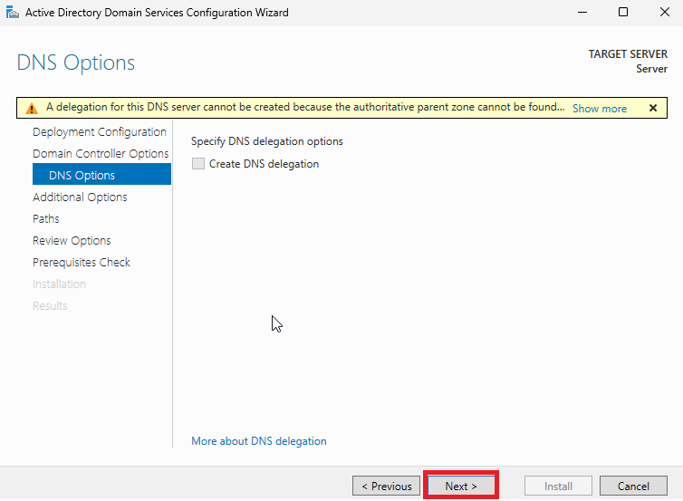
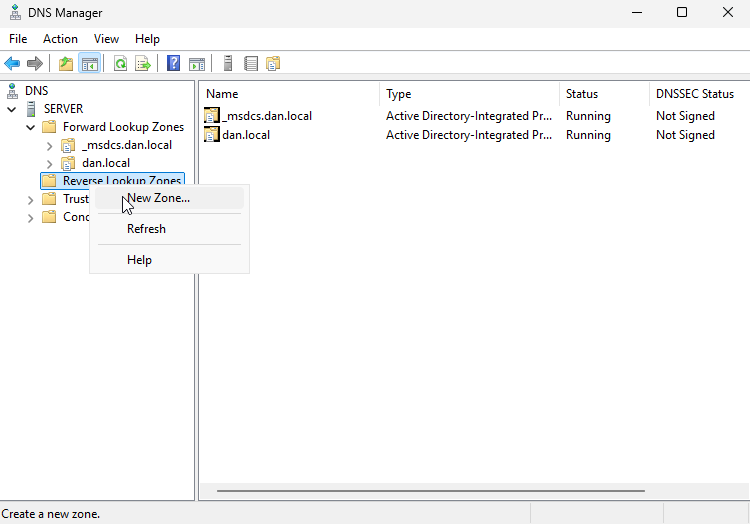
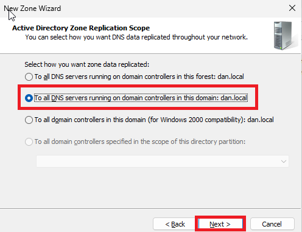
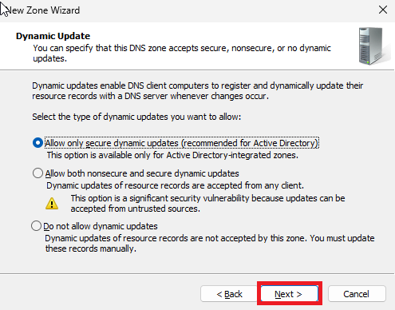

---
title: "Windows Server"
discription: Windows Server 
date: 2024-12-13T21:29:01+08:00 
draft: false
type: post
tags: ["Windows Server"]
showTableOfContents: true
--- 

First i need change on server dns on localhost

After change the name of server and restart

## Add DC 

Next

Next

Next

Next 

Next

Next

Next 

Install

Wait

Promote this server to a domain controller

dan.local name of my dc 

Next

Next

Next 

Next

Next

Install

Wait

Done !

### DNS Reverse IP

DNS > Reverse Lookup Zone > New Zone

Next

Next

Next

Enter Zone IP my its `192.168.1`

Next

Next

Finish

Done!

### Create AD User

Tools > Active Directory Users and Computers

Users > New > Users

Next

Next

Finish

Done

### Connect User to Domain Windows 11

dns of dc (dont forget disable dnsv6)

