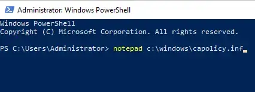
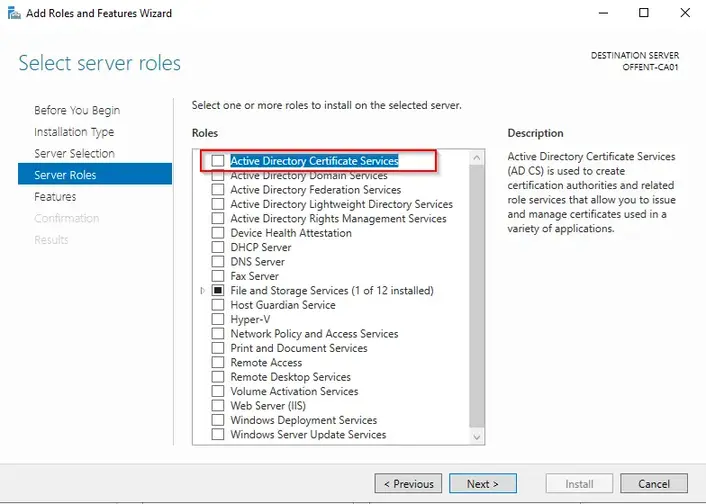
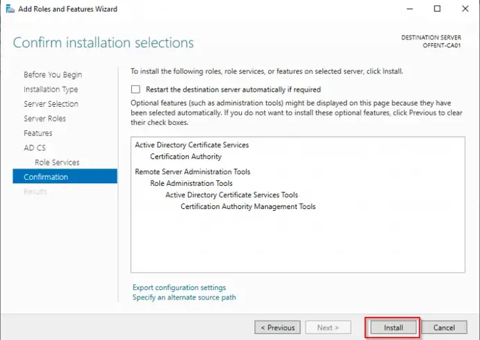
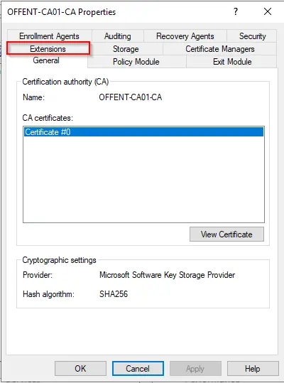
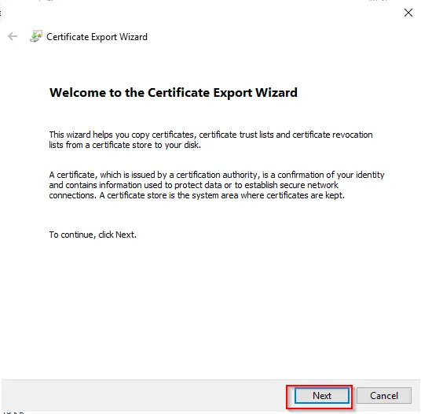

---
title: "Windows Server CA"
discription: Windows Server
date: 2022-05-01T21:29:01+08:00 
draft: false
type: post
tags: ["PKI","CA","Windows Server"]
showTableOfContents: true
--- 

In this Tutorial we’re going to configure a Two-Tier Enterprise PKI with Microsoft Server 2019 intended for Lab use. The advantage of a Two-Tier Enterprise PKI Hierarchy is that clients only trust the Root CA.  So if a Subordinate server gets compromised the Root CA does not have to be replaced. During normal operation the Root CA will be offline and Certificate requests are handled by the Subordinate CA. The Root CA is a non-domain joined device and will only be turned on issue a certificate for the Subordinate CA or to update the  Certificate Revocation List (CRL).


 - Overview

- Setup  Standalone Root CA

- Setup  Enterprise Subordinate CA

- Setup Group policy

- Deploy Policy Templates

In this setup we are going to build this Lab setup.


Before you start with this tutorial create the following servers and install them with Microsoft Server 2019. In this tutorial we are only configuring the servers.


| Servername | 	OS | Role |	Notes |
| ---------- | --- | ---- | ----- |
|  DC01      | 	MS Server 2019 | Domain Controller |
|  OFFENT-CA01 | MS Server 2019 | Offline Standalone Root CA | non-domain joined |
| SUBENT-CA02 | MS Server 2019 | Online Enterprise Subordinate CA | Domain joined |


### Offline Root CA


#### Setup Offline Root CA

First we will create the `CApolicy.inf`. This is a configuration file that defines multiple settings that are applied to the root CA certificate and all other certificates issued by the root CA. This file needs to be created before the ADCS is installed on the root CA. For more information about the Syntax go here.

1. Start Powershell and type the following line and press **Enter**:
```
notepad c:\windows\capolicy.inf
```


2. Select **yes** to create the new file


3.  Because this is a lab setup I will only setup some basic settings for the Root CA. I will configure the following settings:

- Renewalinformation for the CA certificate.

- The validity period for the base CRL.

- Disable the AlternateSignatureAlgorithm 

- Disable the DefaultTemplates, these are not used because this is an offline CA.

For this lab I will use a random generated OID which is based on the Microsoft OID. Because these generated OID may not be unique you should request a private enterprise number at IANA (link). This number can be added to the CAPolicy.inf.

```
[Version]
Signature="$Windows NT$"

[Certsrv_Server]
RenewalKeyLength=4096 
RenewalValidityPeriod=Years
RenewalValidityPeriodUnits=20
CRLPeriod=Years
CRLPeriodUnits=1
AlternateSignatureAlgorithm=0
LoadDefaultTemplates=0
```

4. Save the file as **capolicy.inf** using **All files** and **ANSI** Encoding.


5. Now we the role can be added and configured. Start the Server manager and select **Add roles and features**


6. The **Add Roles and Features Wizard** will start, press **Next** to continue.


7. Select **Role-based or feature-based installation** and press **Next**


8. Use the default settings and press **Next** to continue.


9. Select **Active Directory Certificate Services**


10. A pop-up will appear, press **Add Features** to continue.


11. Press **Next** to continue


12. Press **Next** to continue.
 

13. Check if the Servername is correct and press **Next** to continue.
 

14. Check if the Servername is correct and press **Next** to continue.
 

15. Press **install** to add the Active Directory Certificate Services to the server.
 

16. When the installation has completed, press the link **Configure Active Directory Certificate Services on the destination server**
 

17. Use the default settings and press **Next**
 

18. Select **Certification Authority** and press **Next**
 

19. Because this server is non-domain joined only Standalone CA can be selected. Press **Next** to continue.


20. As this server is the root of the PKI hierarchy select **Root CA** and press **Next**


21. Select **Create a new private key** and press **Next** to continue.


22. Because this is the Root CA Certificate I use a longer Key length of 4096. This will increase the security.


23. Use the default settings and press **Next** to continue.


24. Because this server will be used in a Test Environment I extend the validity period to 10 years. Press **Next** to continue.


25. Use the default settings and press **Next** to continue.


26. Press **Configure** to configure the server.


27. Press **Close** to continue.


28. Press **Tools** in the Server Manager and select **Certification Authority**


29. Right click the Servername and select **Properties**


30. Select the **Extensions** tab


31. In the **Extensions tab** select the extension **CRL Distribution Point (CDP)** and remove all locations except the `C:\*` Location.


32. Because this server will be offline it cannot be contacted, therefore a location needs to be added to the subordinate server. Press **Add** to add the CDP on the Subordinate Server.


33. Enter the following location and press **OK**
```
http://<ServerDNSName>/CertEnroll/<CaName><CRLNameSuffix><DeltaCRLAllowed>.crl
```
Replace <serverDNSName> with the dnsname of the Subordinateserver in this demo the location will be:
```
http://subent-ca02.vmlabblog.com/CertEnroll/%3CCaName%3E%3CCRLNameSuffix%3E%3CDeltaCRLAllowed%3E.crl
```


Check the boxes beginning with __Include in CRLs*__ and __Include in the CDP*__ and press **Apply**


35. Press **No** when asked to restart the service.


36. Select in **Select extension** the **Authority Information Access (AIA)** and remove all locations except the `C:\*` Location.


37. Press **Add** to add the AIA location on the Subordinate Server.


38. Enter the following location and press **OK** 

```
http://<ServerDNSName>/CertEnroll/<ServerDNSName>_<CaName><CertificateName>.crt
```
Replace <serverDNSName> with the dnsname of the Subordinateserver in this demo the location will be:
```
http://SUBENT-CA02.vmlabblog.com/CertEnroll/<ServerDNSName>_<CaName><CertificateName>.crt
```


39. Check the box **Include in the AIA extension of issued certificates** and press **Apply**


40. Press **Yes** when asked to restart the service.


41. Select the **General** and select the Root Certificate and press **View Certificate**.


42. Select the tab **Details** and press **Copy to File…**.


43. In the Certificate Export Wizard press **Next**.


44. Select **DER encoded binary X.509 (.CER)** and press **Next**.


45. In File name enter **C:\Windows\System32\CertSrv\CertEnroll\<CA-NAME>-CA.cer** and press **Next**.


46. Press **Finish** to export the RootCA Certificate.


47. A popup will appear when the export was successful, press **OK** to continue.


The setup of the Offline RootCA is now completed.

### Subordinate CA

With the Offline Root CA completed, we can now setup of the Subordinate CA server. This server is authorized by the Root CA to issue the certificates. During the setup the CA role will be added and configured. The server will also be authorized by the Root CA  The Subordinate CA Server is the SUBENT-CA02. Make sure that the server Subordinate server is domain joined before you start with the ADCS setup and that you have a domain account which is member of the Enterprise admins group.

**Setup Subordinate CA**

1. Start the Server manager and select **Add roles and features**


2. The **Add Roles and Features Wizard** will start, press **Next** to continue.


3. Select **Role-based or feature-based installation** and press **Next**


4. Use the default settings and press **Next** to continue.


5. Select **Active Directory Certificate Services**


6. A pop-up will appear, press **Add Features** to continue.


7. Select **Web Server (IIS)**


8. A pop-up will appear, press **Add Features** to continue.


9. Press **Next** to continue


10. Press **Next** to continue.


11. Check if the Servername before you start, this cannot be changed after the AD CS role has been installed and press **Next** to continue


12. Keep the default role services **Certication Authority** and press **Next**


13. On the Web Server Role (IIS) page press **Next**


14. On the Role Services page select **Basic Authentication** and **Windows Authentication**. Press **Next** to continue.


15. In the confirmation screen press **Install** to start the installation.


16. When the installation has completed, press the link **Configure Active Directory Certificate Services on the destination server**


17. Make sure your Domain credentials have been entered and not your local admin credentials. Otherwise you will not be able to configure a Enterprise CA. Press **Next** to continue.


18. Select the box **Certification Authority** and press **Next** to continue.


19. Select **Enterprise CA** and press **Next** to continue. (if Enterprise CA is not available check if the server is domain joined and the credentials entered in step 17)


20. Select **Subordinate CA** and press **Next** to continue.


21. Select **Create a new private key** and press **Next**.


22. Use the default settings and press **Next** to continue.


23. Use the default settings and press **Next** to continue


24. Select the folder to save the Certificate Request and press **Next** to continue. (default is **c:\**)


25. Use the default settings and press **Next** to continue.


26. Press **Configure** to apply the configuration.


27. When the configuration has succeeded a warning is shown. This is just a notification that the untill a certificate of the RootCA has been obtained and applied to the subordinate ca the Configuration is not completed.


28. Switch over to the Offline Root CA (OFFENT-CA01) and browse to the folder `c:\windows\system32\certsrv\certenroll`. There should be three files, select and copy all files


29. Switch back to the Subordinate CA (SUBENT-CA02) and browse to the folder `c:\windows\system32\certsrv\certenroll`. Paste all the files copied in the previous step.


30. Rightclick the Root CA certificate which you just copied and select **Install Certificate**


31. Select **Local Machine** and press **Next**


32. Press **Browse** and select the **Trusted Root Certification Authorities** store. Press **Next** to continue.


33. Press **Finish** to continue.


34. After some time a popup will appear when the import has finished. Press **OK** to continue


35. Create a new folder in `C:\inetpub\wwwroot` with the name `CertEnroll`


36. Copy the RootCA Certificate and Certifate Revocation List from `C:\Windows\System32\CertSrv\CertEnroll` to `C:\inetpub\wwwroot\CertEnroll`


37. Browse to the location entered in step 20 (default `c:\`) and copy the __*.Req__ file to the C: Drive on RootCA server.


38. On the Root CA Server open **Certification Authority** rightclick the servername and select **All Tasks -> Submit new request…**


39. Browse to the request file on the C: driver and press **Open**


40. Select **Pending Requests**. Rightclick the pending request and select **All Tasks** -> **Issue**


41. Select **Issued Certificates**. Rightclick the issued certificate and select **Open**


42. Select **Details** and press **Copy to file…**


43. Press **Next** to continue


44. Select **Cryptographic Message Syntax Standard – PKCS #7 Certificates (.P7B)** and check the box **Include all certificates in the certification path if possible**. Press **Next** to continue


45. Press **Browse…**


46. Enter a name for the certificate and press **Save** (the default location is the Documents folder)


47. Press **Next** to continue.


48. Press **Finish** to export the CA Certificate.


49. After some time a popup will appear when the export has finished. Press **OK** to continue.


50. Copy the CA Certificate from the RootCA ( step 46) and switch to the subordinate server to paste the file.


51. On the Subordinate CA open the Certification Authority. Rightclick the Servername and select **All Tasks** -> **Install CA Certificate**


52. Select the copied CA Certificate and press **Open**


53. Rightclick the Servername and select **All Tasks** -> **Start Service**


### Setup Group Policy

The CA Servers are now configured. Now the domain computers/servers need to trust the certificates which are created by the Subordinate Server. This is done by adding the Root CA certificate to the “Trusted Root Certification Authorities” store.  The certificate can be added in multiple ways, but the easiest way is by adding it with a Group Policy. In this example a separate policy is created on the Domain Controller in the root of the domain. This is not required but just an example on how it’s possible.


### Deploy Policy Templates

After Setting up an Enterprise CA some Certificate policies are available without additional configuration. In this post I will demonstrate how to add Certificate Template and publish it.

Deploy Policy Templates