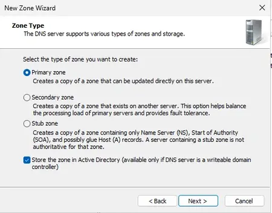

---
title: "Windows Server Domain Change"
discription: Windows Server 2025
date: 2024-12-13T21:29:01+08:00 
draft: false
type: post
tags: ["Windows Server"]
showTableOfContents: true
--- 

## DNS

### Add New Name

Add new name my name its `mynewzone.local`

### Add new _msdcs 

Add new name my name its `_msdcs.mynewzone.local`

