## MDT

### Installing MDT​

All done with your break? I did encourage you to take one. Now we are going to install MDT. MDT is the toolkit we will use to control and add and modify our images remember? The link is below under the link section. The same place you grabbed the server ISO. For this we will want to make sure we download the 64bit version.

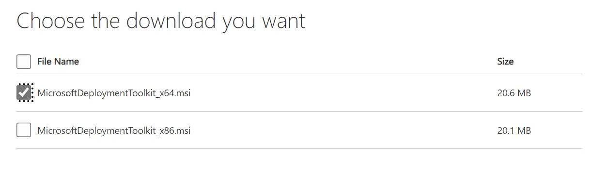

Lets get started.

Once you have it downloaded go ahead and open it up to start the installer. It is more or less a "Next" fest but I will let you know if you need to do anything else. So click "Next" to begin.

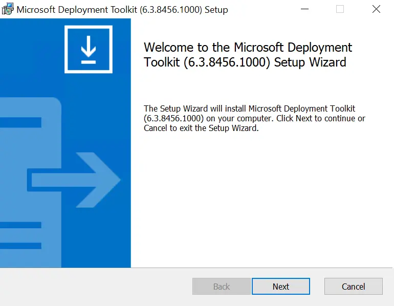

It's ok for this to go to the `C:\` drive so don't worry about that quite yet. Go ahead and click "Next".

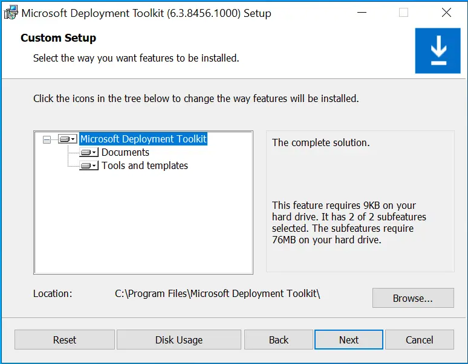

You will get one more notice about the customer experience program. Simply click "Install" and finally when its done, "Finish".

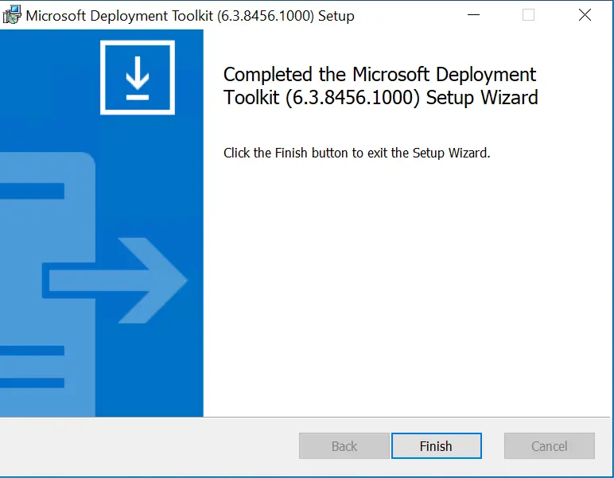

Nice! Now for fun lets go ahead and open it, you guessed it. So we can pin it to our taskbar. It will be called "Deployment Workbench".
h
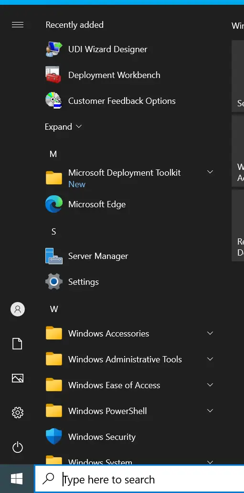

## ADK

### Installing the ADK

Once you have the ADK lets begin the install. Again we will let this install to "C:\".

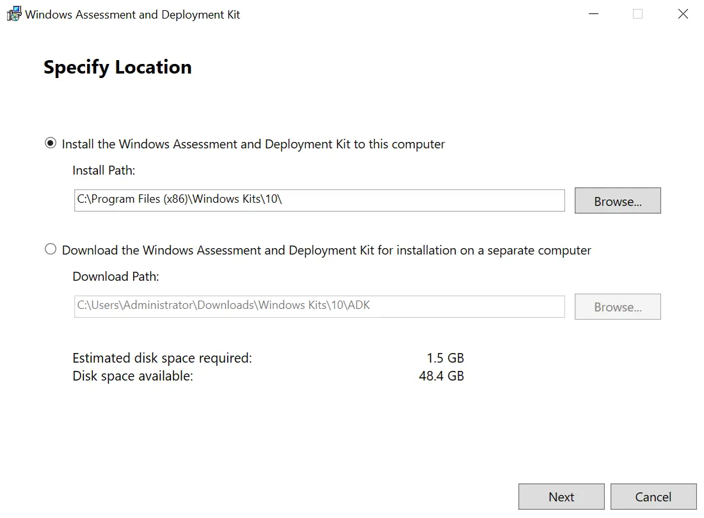

After a few EULA windows we are given the selection menu. It is ok to leave it default. Simply press "Install".
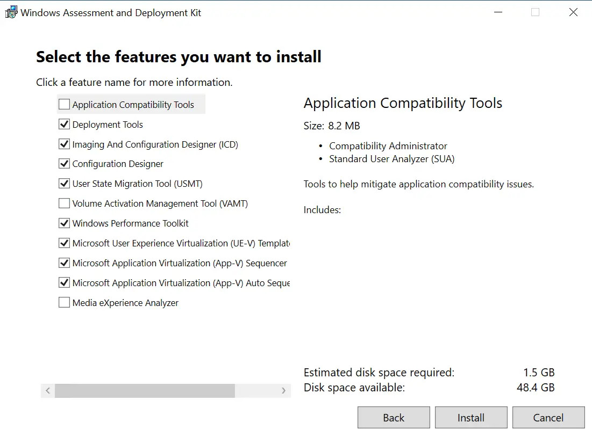

The ADK installed!

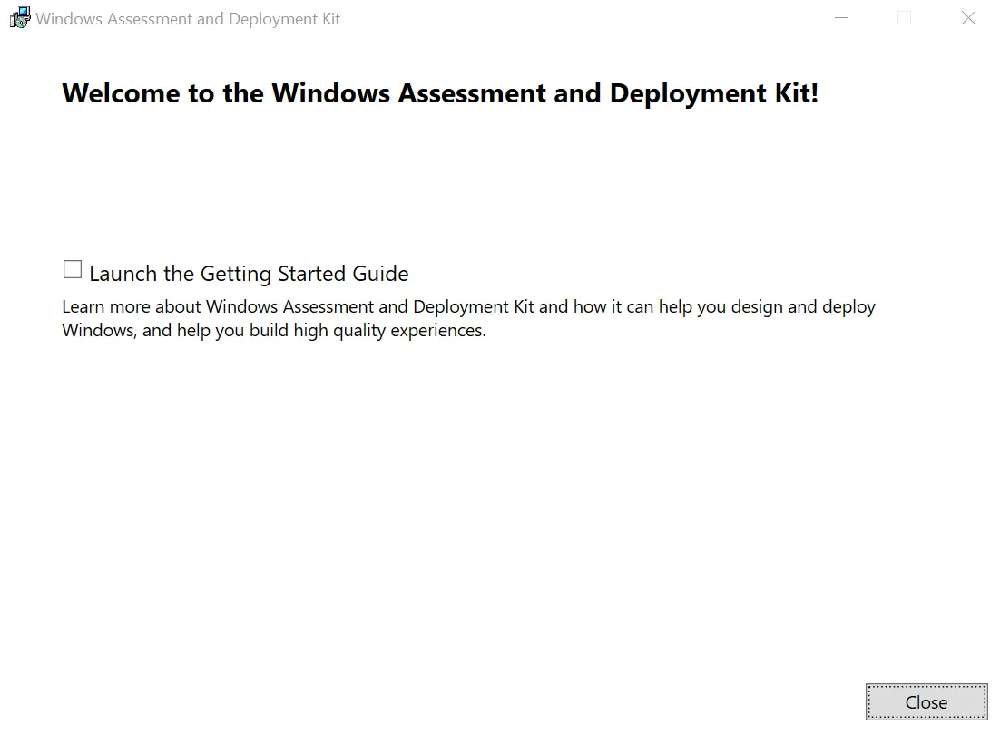

Now that the main ADK is installed, lets install the PE add-on. Again like before, it is more or less a next fest. don't worry about the paths.

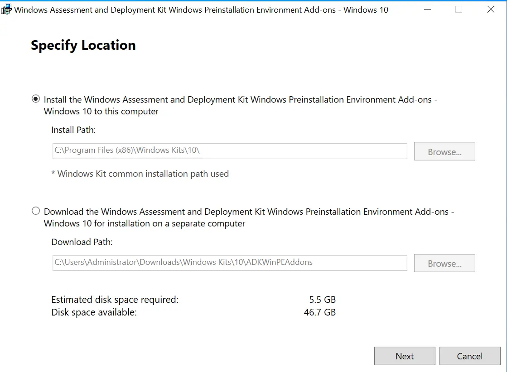

"Wait doesn't this say Windows 10?" Yes! The Windows 11 ADK PE dropped support for x86. This is because Windows is going x64 only. However their is a bug in the control panel that still attempts to read the x86 directory, so we are working around it by installing the 10 ADK PE. Which is fine for our use case. You can read more about it here: https://learn.microsoft.com/en-us/a...oyment-workbench-crashes-when-opening-the-win

Nice! the PE finished installing!

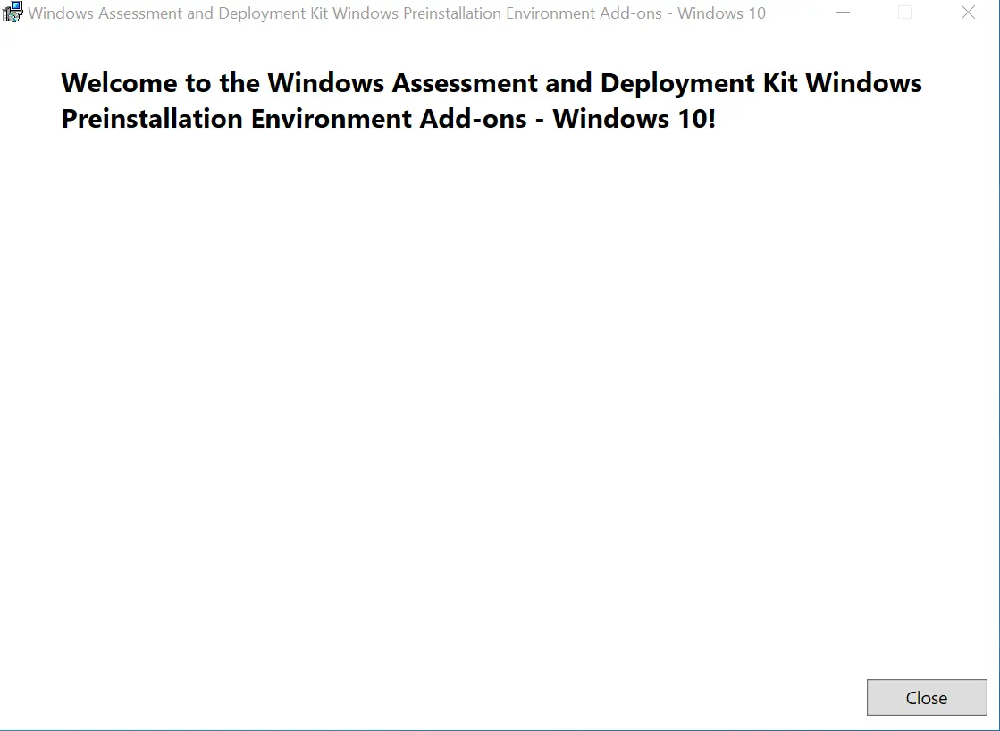


Finally, with the x86 issue taken care of. We need to fix one last bug with this specific build. The errata is here: https://learn.microsoft.com/en-us/mem/configmgr/mdt/known-issues

Run this command in an admin terminal:
```
reg.exe add "HKLM\Software\Microsoft\Internet Explorer\Main" /t REG_DWORD /v JscriptReplacement /d 0 /f
```
Then navigate too and edit.

```
C:\Program Files\Microsoft Deployment Toolkit\Templates\Unattend_PE_x64.xml
```
and replace the entire contents with the following:
```
<unattend xmlns="urn:schemas-microsoft-com:unattend">
    <settings pass="windowsPE">
        <component name="Microsoft-Windows-Setup" processorArchitecture="amd64" publicKeyToken="31bf3856ad364e35" language="neutral" versionScope="nonSxS" xmlns:wcm="http://schemas.microsoft.com/WMIConfig/2002/State">
            <Display>
                <ColorDepth>32</ColorDepth>
                <HorizontalResolution>1024</HorizontalResolution>
                <RefreshRate>60</RefreshRate>
                <VerticalResolution>768</VerticalResolution>
            </Display>
            <RunSynchronous>
                <RunSynchronousCommand wcm:action="add">
                    <Description>Lite Touch PE</Description>
                    <Order>1</Order>
                    <Path>reg.exe add "HKLM\Software\Microsoft\Internet Explorer\Main" /t REG_DWORD /v JscriptReplacement /d 0 /f</Path>
                </RunSynchronousCommand>
                <RunSynchronousCommand wcm:action="add">
                    <Description>Lite Touch PE</Description>
                    <Order>2</Order>
                    <Path>wscript.exe X:\Deploy\Scripts\LiteTouch.wsf</Path>
                </RunSynchronousCommand>
            </RunSynchronous>
        </component>
    </settings>
</unattend>
```

### Configure MDT


Now that we have everything installed grab the script from my repo or the attachment on this post. We need to configure MDT and then create our first image!

To get started lets open MDT.

Once open right click on "Deployment Shares" and select "New Deployment Share".


The first thing we are asked is important! Just like WDS we will change the drive letter. We want to keep the path but we want to send anything we put here to our data drive. In my case, it is "E:\"

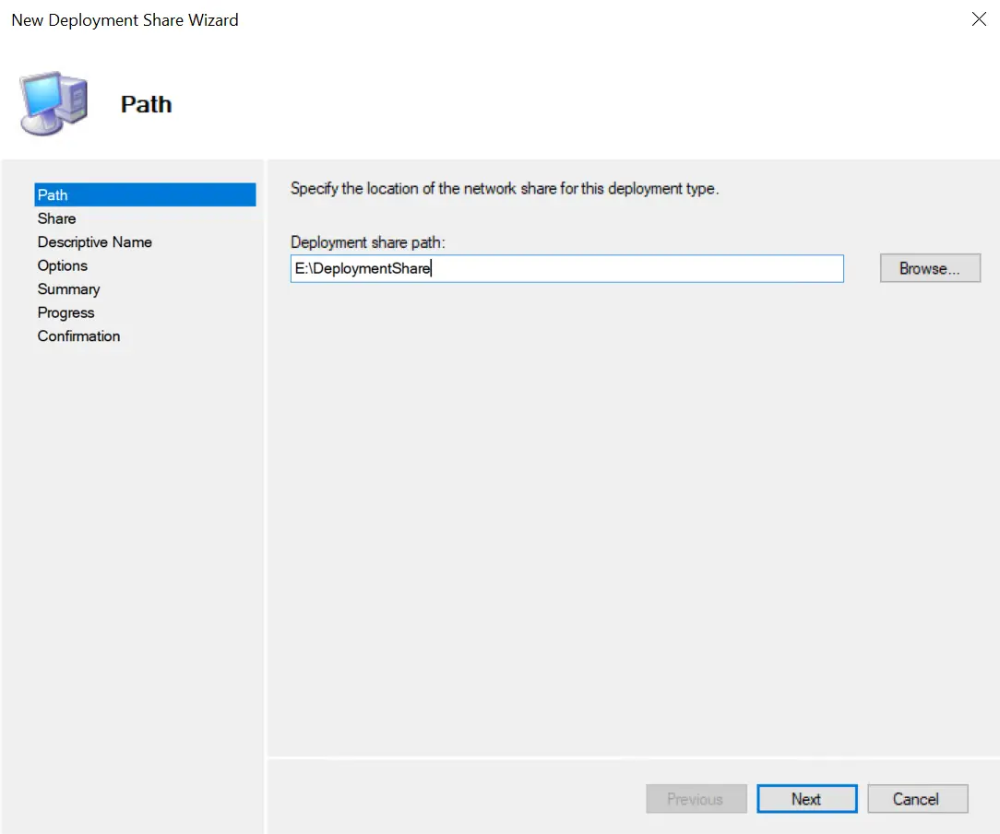

We will be asked some other default questions. We can leave the share name as is.

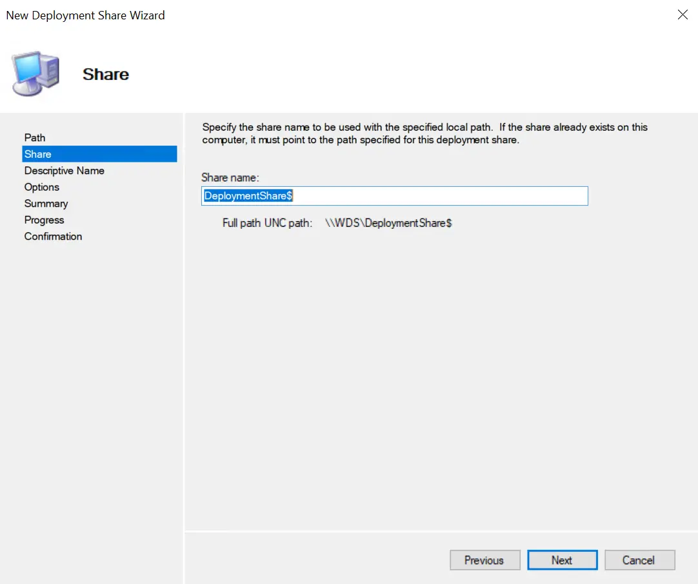

The share description can also be left default.

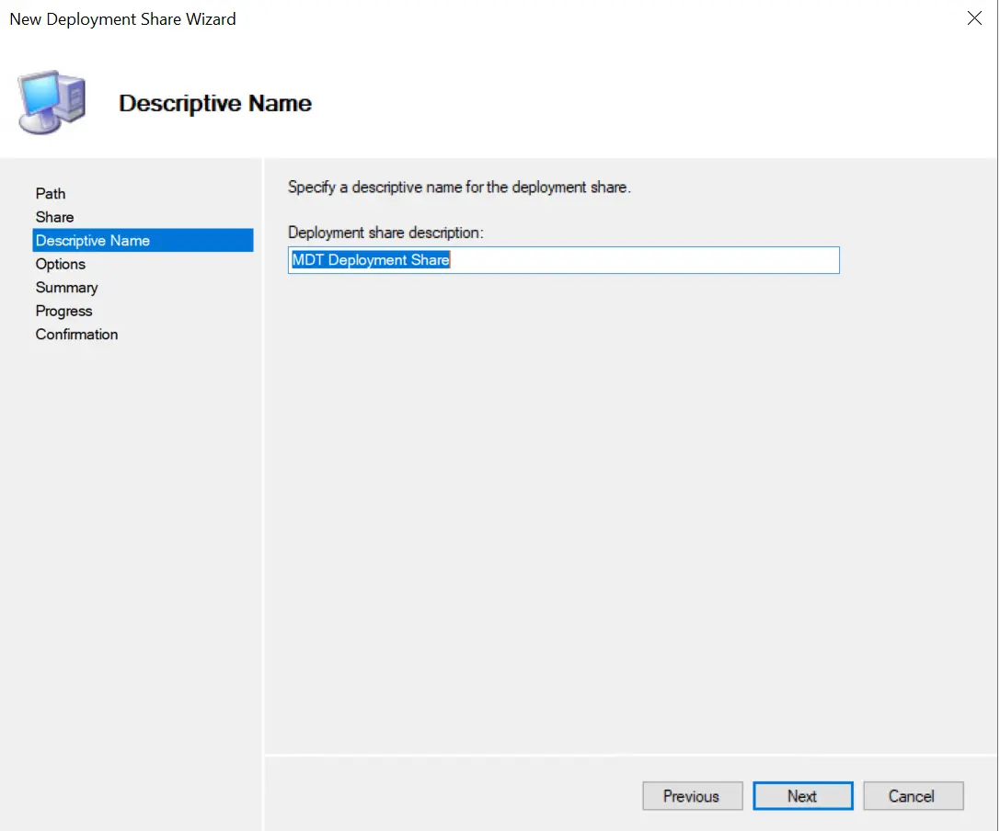

The next screen gives us some default options for the actual deployment. Remember we can be as hands on or hands off as we want. These boxes check configuration options that we will be changing later. They can be changed at any time, so for now lets leave them as is. Click "Next".

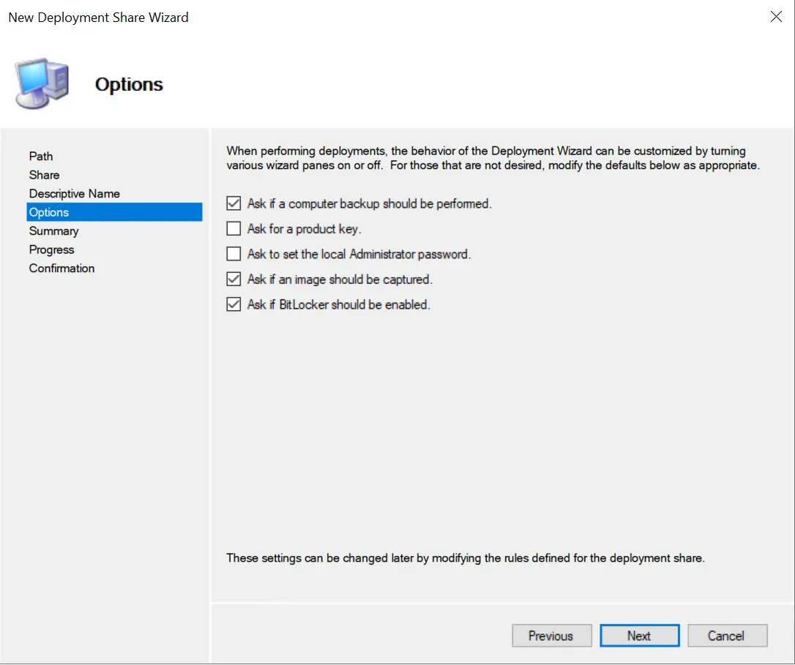

We are now presented with a summary screen, click "Next" to move forward.

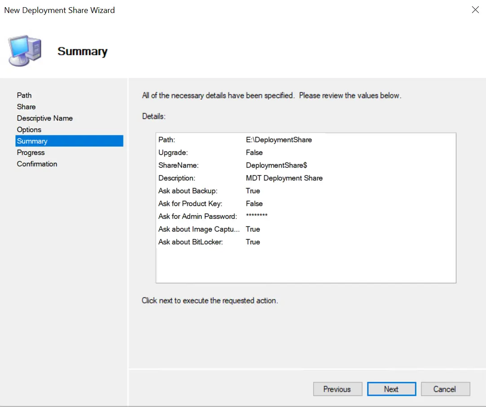

The configuration will now begin and build the share that WDS/MDT will use when deploying images.
