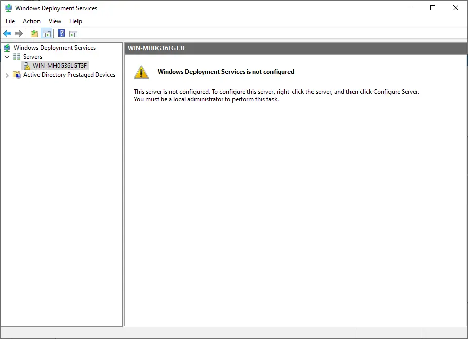

---
title: "Windows Server WDS"
discription: Windows Server
date: 2022-05-01T21:29:01+08:00 
draft: false
type: post
tags: ["WDS","PXE","Windows Server"]
showTableOfContents: true
--- 

## Windows Server WDS

### Create Automatically Install Images

1. First download "ADK download for Windows 10" from Microsoft


2. Install `adksetup.exe`

3. Select the features you want change 

- [X] - Deployment Tools


4. Need Take `install.wim` from windows_10.iso but we have only in ... source\install.esd

5. Mount windows.iso go to folder "souces" and copy install.esd to c:\

We need cover from `install.esd` to `install.wim` and we need know index of windows version

6. open Deployment and Images Tools Environment 
```
dism /get-wiminfo /wimfile:c:\install.esd
```
7. after take your nember of index  what you want  and cover from  `.esd` format to `.vim`
```
dism /export image /sourceimagefile:c:\install.esd /sourceindex:3 /destinationimagefile:c:\install.wim /compress:mix /checkintegrity
```

8. now we need create file config for it go to [site1](https://www.windowsafg.com/) or [site2](https://schneegans.de/windows/unattend-generator/) after generate file config and download with name  "Autounattend.xml" 

9. after create new folder `windows_10` Copy all files from windows10.iso and past in the folder 

10. and copy from **c:\install.wim**  and file **Autounattend.xml** to `windows_10`

11. Now create new ISO 
```
oscdimg -u2 -m -o -lWIN10PROX64 -b "c:\Program Files (x86)\Windows Kits\Assessment and Deployment Kit\Deployment Tools\amd64\Oscimg\etfsboot.com" c:\windows_10 c:\Windows_10.iso
```
12. GUI


## Install WDS


1. Open **Manage > Add Roles and Features**


2. Next.. 


3. Next...


4. Next...


5. Select **Windows Deployment Services**


6. Select **Add Features**


7. Next..


8. Next.. 


9. Next.. 


10. Next.. 


11. Install..


12. Install and Yes..


13. Close


#### Config WDS

1. **Server Manager > WDS**


2. Left Click on the Server and Right Click on the **Configure Server**
