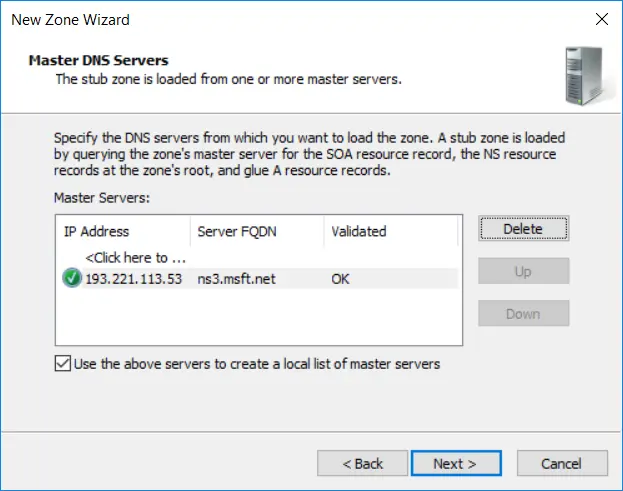
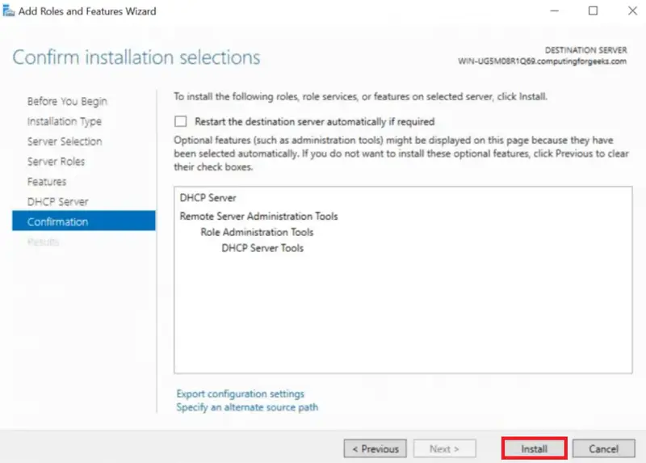
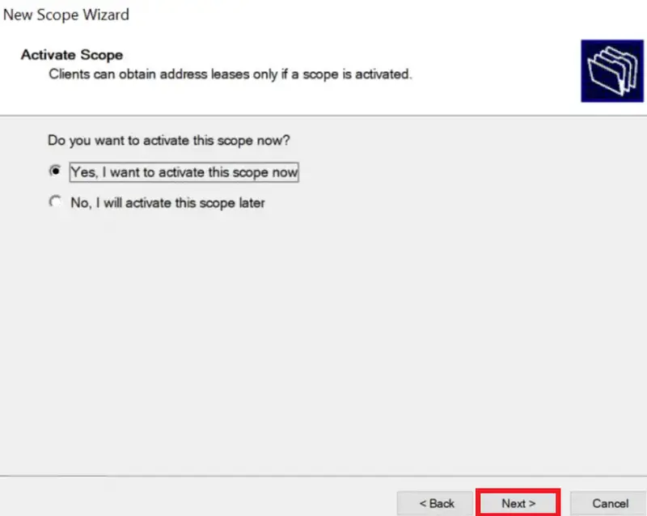
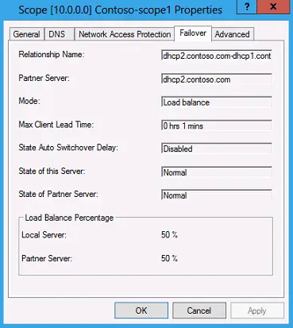

## DNS

display dns in cache 
```powershell
ipcofig /displaydns
```

clear dns cache
```powershell
ipconfig /flusdns
```

### DNS Server Role

DNS Forwarders

DNS Manager > Properties > Forwarders > Edit > (MY_DNS_ADDRESS) > OK > OK

To configure DNS forwarders on Windows using the graphical user interface:

Click Start and then **Administrative Tools**. Click **DNS**.

Right-click the **DNS** server that you want to configure as a forwarder.

In the Action menu, select **Properties**.

Click the Forwarders tab.

Click **Edit**.

In the Edit Forwarders dialog, enter the primary IP address of the ​SIA​ recursive DNS server and press **Enter**.

Enter the secondary IP address of the ​SIA​ recursive DNS server and press **Enter**.

If other servers are listed as forwarders, delete this information. The primary and secondary recursive DNS servers should be the only forwarders listed.

To change the number of seconds that a DNS server waits for a response before it tries the IP address of the other DNS server, enter a new value in the **Number of seconds before forward queries times out** field.

Click **OK**.

Enable the Use **roots hints if no forwarders are available option**. This option ensures that DNS servers in a root hints file resolve the name locally.

In the properties dialog, click OK.

Powershell command CLI ADD DNS ROLE on dns server
```powershell
add-windowsfeature dns -includemanagementtools
```

 Display DNS in cache on Server DNS 
```powershell
show-dnsservercache
```

Clear DNS cache on Server DNS
```powershell
clear-dnsservercache
```

### DNS Conditional Forwarder

Open **DNS Manager**

Open the Run box using **Win+R**, type **dnsmgmt.msc**, and click **OK**


**Open the New Conditional Forwarder Window**

Right click **Conditional Forwarders** under the server of your choosing, then select **New Conditional Forwarder…**


**Configure the new conditional forwarder**

Enter the domain for which you would like queries forwarded in the **DNS Domain** box

Under IP addresses of the master servers, enter the IP Address(es) or FQDN(s) of the server(s) you will be forwarding these queries to


You will see a check mark or X next to the servers you enter. Do not worry about an X if you know the IP is correct. This just means it could not do a reverse lookup on that IP.

If you entered a FQDN and it shows an X then you have a problem. You will need to do some DNS troubleshooting to determine why this will not resolve or enter the IP address instead.

When you done, simply click **OK** and you will now see this under the list of conditional forwarders.


add Conditional Forwarder in powershell
```powershell
Add-DnsServerConditionalForwardZone pdan.dev 8.8.8.8
```

### DNS Configure Root Hints


**Open the DNS server properties**

Right click the DNS Server you would like to change the select **Properties**


**Configure the new conditional forwarder**

**Open the New Name Server window**

Click the **Root Hints** tab and click and **Add** button


**Add a new root server**

Type in a FQDN and click **Resolve**

OR

Type in a FQDN and enter an IP address or multiple IP addresses


The IP address(es) should validate (green check mark) and then you can click **OK**


All  cache dns save in file :
```
MyPc > local Disk (C:) > Windows > System32 > dns > CACHE.dns
```

Add Root hint in powershell 
```powershell
Add-DnsServerRootHint server1.test.com 8.8.8.8
```

### DNS Records Overview


|Record type |	Description                                                      |
| ---------- | ---------------------------------------------------------------- |
|A	          | Address record, which maps host names to their IPv4 address. dnc |
|AAAA	       |IPv6 address record, which maps host names to their IPv6 address. |
|CNAME	    |Canonical name record, which specifies alias names. |
| NS	| Name server record, which delegates a DNS zone to an authoritative server. |
| PTR | Pointer record, which is often used for reverse DNS lookups |
| MX	| Mail exchange record, which routes requests to mail servers. |
| SRV	| Service locator record, which is used by some voice over IP (VoIP), instant messaging protocols, and other applications. |
|  TXT | Text record, which can contain arbitrary text and can also be used to define machine-readable data, such as security or abuse prevention information. |
| SOA	| Start of authority record, which specifies authoritative information about a DNS zone. An SOA resource record is created for you when you create your managed zone. You can modify the record as needed (for example, you can change the serial number to an arbitrary number to support date-based versioning). |


**Powershell commands:**
```powershell
nslookup www.google.com
```
A Record command
```powershell
nslookup -type=A www.google.com
```
AAAA Record command
```powershell
nslookup -type=AAAA www.google.com
```
NS Record command
```powershell
nslookup -type=NS www.google.com
```
PTR Record command (test my site reverse ip)
```powershell
nslookup -type=ptr 96.96.136.185.in-addr.arpa
```
MX Record command 
```powershell
nslookup -type=mx pdan.dev
```
SOA Record command 
```powershell
nslookup -type=soa pdan.dev
```
TXT Record command (for trust servers)
```powershell
nslookup -type=txt pdan.dev
```

Powershell command to show all dns recorders
```powershell
Resolve-DnsName www.pdev.dev
```

### DNS Stub Zones

To configure a stub zone:

 Create a new zone:

 

 Click next on the wizard welcome screen:


Choose to create a stub zone:


Select the replication scope of the stub zone:


Select the domain name for this stub zone:


Insert one or more name servers from where to load the zone info. Notice that zone transfer must be allowed:



Review settings and complete the wizard:


The stub zone has been created:


### DNS Zone Transfer

### Stub Zone on Master Server

Here's how to create a stub zone up zone using DNS Manager.

1.From the Windows desktop, open the Start menu, select **Windows Administrative Tools** > **DNS**.

2.In the console tree, expand a DNS server then right-click, then select **New Zone**.

3.On the New Zone Wizard page, select **Next**.

4.On the Zone Type page, select Stub zone. If the DNS server is also an AD DS domain controller, you can store the zone information in Active Directory.

5.If you have chosen to store the zone data in AD DS, choose one of the following options:

- All DNS servers running on AD DS domain controllers in the forest.'

- All DNS servers running on AD DS domain in the domain.

- All domain controllers in this domain (for Windows 2000 compatibility).

- All domain controllers enrolled in a specific directory partition.

Specify the zone name. For example, `west.contoso.com`

7.On the Master DNS Servers page, provide the IP address of a DNS server that is authoritative for the target zone. For example, `172.23.90.124`.

8. Select Finish on the Completing the New Zone Wizard.

in powershell cli 
```powershell
Add-DnsServerStubZone -Name "west.contoso.com" -MasterServers "172.23.90.124" -PassThru -ZoneFile "west.contoso.com.dns"
```
---

### Create duplicate on Slave Zone

Here's how to create a secondary look up zone using DNS Manager.

1. From the **Windows desktop**, open the **Start** menu, select **Windows Administrative Tools** > **DNS**.

2. In the console tree, expand a DNS server then right-click, then select **New Zone**.

3. On the New Zone Wizard page, select **Next**.

4. On the Zone Type page, select Secondary zone.

5. On the Zone Name page, specify the name of the secondary zone. The name of the zone must match the name of the primary zone to replicate from. For example, `south.contoso.com`.

6. On the Master DNS Servers page, specify the IP addresses of one or more DNS servers that host copies of the primary zone. You need to ensure that the primary zone allows transfers to the DNS server hosting the secondary zone. For example, `172.23.90.124`.

Select Finish on the Completing the New Zone Wizard.

Here's how to create a secondary DNS zone using the Add-DnsServerSecondaryZone PowerShell command.

Add the secondary zone `western.contoso.com` using the zone file name `south.contoso.dns` and using the primary zone server at IP address `172.23.90.124` use the following command:
```PowerShell
Add-DnsServerSecondaryZone -Name "south.contoso.com" -ZoneFile "south.contoso.com.dns" -MasterServers 172.23.90.124
```
### Allow Configure Slave Server Zone on Master


**Configure the source DNS server to allow for zone transfers**

These steps will be accomplished on both DNS Servers.

To forward lookup zone properties,

1. From the Windows desktop, open the **Start** menu, select **Windows Administrative Tools** > **DNS**.

2. Click on the **Forward Look Zone** that you desire so configure.

3. Click on **Properties**.

4. Select the **Zone Transfers tab**.


5. Select **Only to the following servers**.


6. Click on **Automatically notify** and add the IP of the Forest B. Make sure the IP is resolved and the green check mark appears.

7. Click **OK**.


in powershell command:
```powershell
Set-DnsServerPrimaryZone -name "west.contoso.com" -SecureSecondaries "TransferToZoneNameServer" -PassThru
```

### DNS PTR Records

Create Reverse Lookup Zone

1. Open the DNS Management Console

On your Windows Server type DNS in the search box to quickly find the DNS console.


2. Create New Reverse Lookup Zone

In the DNS console right click on **Reverse Lookup Zones** and Select **New Zone**.


3. Choose Zone Type (New Zone Wizard)

On the Zone Type page select Primary Zone.


Choose to replicate to all DNS servers running on domain controllers in this domain.


Choose IPv4 or IPv6, for this demo I’m setting up IPv4.


Now, type in the start of the subnet range of your network.

For this demo, I’m creating a zone for subnet 192.168.0.0/24.


Choose the dynamic update option.

I recommend picking the first option **Allow only secure dynamic updates**.


That completes the wizard, click finish.


**Verify Reverse Lookup Zone**

Back in the DNS console click on **Reverse Lookup Zone**

I can now see the new zone listed. The subnet will display backwards which is normal.


Now I’ll click the 0.168.192.in.addr.arpa zone to view the DNS records.


So far I have only the SOA and NS resource records, no PTR records.

Once clients start dynamically updating their DNS the PTR records should start populating. You can also manually create PTR records for systems that are not configured to dynamically update.


**How to Create PTR Records**

Let’s walk through manually creating a PTR record. This is only needed if a system is not configured to dynamically update. This may be the case for systems with static IP addresses like servers.

Right click the zone and select **New Pointer (PTR)**.


Enter the Host IP Address and Host name fields and click **OK**.

I’m creating a record for IP, 192.168.0.206 with the hostname of `pc1`.


Back in the DNS console, I can see the PTR record listed.


How to Verify PTR Record Is Working (the answer must come `Name: pc1`) 
```powershell
nslookup 192.168.0.200
```

### Configure Round Robin 

Installing the DNS service role:

1. Open Server Manager

Click Manage in the top right corner and select **Add Roles and Features**.
Go through the installation wizard, select "DNS Service" (DNS Server) in the list of roles and install it

2.Create a zone:

Start > Server Manager > Tools > DNS Manager

Right click on **Forward Lookup Zones** and select **New Zone**

Go through the zone creation wizard, select a zone type (usually **Primary Zone**) and enter (for example, example.com).

In **DNS Manager** open the created zone.

To create an entry, right-click on the zone and select **New Host (A or AAAA)** for IPv4 or IPv6 addresses respectively.
Enter the entry name and IP addresses. _Create multiple entries with the same name but different IP addresses_. This will be your Round Robin.

```
Name Server:
name1.server.local
name2.server.local
```
### Configure DNS caching 

(optional, but recommended for improved performance):

Open the **DNS Manager**.

Right-click on your DNS server and select **Properties**.

Navigate to the **Advanced** tab.

Uncheck the **Enable round robin** option.

Click **OK** to save the changes.


### DNS Delegation

1. From the Windows desktop, open the **Start menu**, select **Windows Administrative Tools** > **DNS**.

2. In the console tree, expand a DNS server, right-click the DNS zone to delegate, then select **New Delegation**.

3. On the Delegated Domain Name page, enter the delegated domain name. For example, to delegate the subdomain `south.west.contoso.com``, enter south. The fully qualified domain name (FQDN) name is automatically be appended.

4. Select Add to specify the names and IP addresses of the DNS server to host the delegated zone.

Enter either:

The FQDN of the DNS server that is authoritative for the delegated zone, then select **Resolve**. Add other DNS servers if necessary, when validated select **OK**.

Or

Manually enter the IP address of the DNS server that is authoritative for the delegated zone. Add other DNS servers if necessary, when validated select **OK**.

Select Finish to complete the New Delegation Wizard.

Powershell command:
```powershell
Add-DnsServerZoneDelegation -Name "west.contoso.com" -ChildZoneName "south" -NameServer "west-ns01.contoso.com" -IPAddress 172.23.90.136 -PassThru -Verbose
```


### DNS Global Zone (CName)

```powershell
Set-DnsServerGlobalNameZone -AlwaysQueryServer $True
```


```powershell
Set-DnsServerGlobalNameZone -Enable $True -PassThru
```

```powershell
AddDnsServerPrimaryZone -name GlobalNames -ReplicationScope Domain
```
```powershell
AddDnsServerResourceRecordCName -HostNameAlias srv.test.local -name testhost -ZoneName GlobalNames 
```

### DNS Configure Recursion (anti DDOS DNS  )

disable recursion (also disables forwarders)
```powershell
Add-DnsServerRecusionScope -name . -EnableRecusion $false
```

Clear DNS cache
```powershell
Clear-DnsServerCache
```

Add scope 
```powershell
Add-DnsServerRecursionScope -name "OurScope" -EnableRecursion $true
```

Add Policy 
```powershell
Add-DnsServerQueryResolutionPolicy -name "OurRecursionPolicy" -action ALLOW -ApplyOnRecursion -RecursionScope "OurScope" -ServerInterfaceIP "EQ,192.168.1.10"
```
next example
```powershell
Add-DnsServerQueryResolutionPolicy -name "Allow anly facebook" -action ALLOW -ApplyOnRecursion -RecursionScope "OurScope" -Fqdn "EQ,*.facebook"
```


Delete my policy  `OurRecursionPolicy`
```powershell
Remove-DnsServerQueryResolutionPolicy -name "OurRecursionPolicy"
```

Delete my scope `QutScope`
```powershell
Remove-DnsServerRecursionScope -name "OurScope"
```


### DNS Security (DNSSEC)

Digital signatures (using public/private key pairs)

Trust Anchors (Trust Points, storing public keys)

Name Resolution Policy Table (NRPT, to force clients)

KSK - Key Signing key (public/private)

ZKS - Zone Signing Key (public/private)


**Step to configure DNSSEC**

1 – Open **Server Manager**,  click Tools and open **DNS Manager**.

2 – In the **DNS Manager**, browse to your Domain name, then right click domain name, click **DNSSEC** and then click **Sign the Zone**.


2 - In the **Zone Signing Wizard** interface, click **Next**.


3 - On the Signing options interface, click **Customize zone signing parameters**, and then click **Next**.


4 – On the Key Master interface, ensure that **The DNS server CLOUD-SERVER is selected as the Key Master**, and then click **Next**.


5 – On the **Key Signing Key (KSK) interface**, click **Next**.


6 – On the **Key Signing Key (KSK) interface**, click **Add**.


7 – **On the New Key Signing Key (KSK) interface**, click **OK**.

~*~ please spend some time to go through about key properties on the New Key Signing Key (KSK) interface.


8 – On the **Key Signing Key (KSK) interface**, click Next.


9 – On the **Zone Signing Key (ZSK) interface**, click **Next**.


10 – On the **Zone Signing Key (ZSK) interface**, click **Add**.


11 – On the **New Zone Signing Key (ZSK) interface**, click **OK**.


12 – On the **Zone Signing Key (ZSK) interface**, click **Next**.


13 – On the **Next Secure (NSEC) interface**, click **Next**.

~*~ NSEC is when the DNS response has no data to provide to the client, this record authenticates that the host does not exist.


14 – On the **Trust Anchors** (TAs) interface, **check the Enable the distribution* of trust anchors for this zone check box**, and then click **Next**.

~*~ A trust anchor is an authoritative entity that is represented by a public key. The TrustAnchors zone stores preconfigured public keys that are associated with a specific zone.


15 – On the **Signing and Polling Parameters interface**, click **Next**.


16 – On the **DNS Security Extensions (DNSSEC) interface**, click **Next**, and then click **Finish**.


17 – In the DNS console, expand **Trust Points**, expand ae, and then click your domain name.

Ensure that the **DNSKEY resource records display**, and that their status is valid.


18 – Open **Server Manager**, click Tools and open **Group Policy Management**.

19 – Next, open **Group Policy Management**, expand Forest: `Windows.ae`, expand Domains, expand `Windows.ae`, right-click **Default Domain Policy**, and then click **Edit**.


20 – In the **Group Policy Management Editor interface**, under **Computer Configuration**, expand **Policies**, expand **Windows Settings**, and then click **Name Resolution Policy**.

~*~ In the right pane, under Create Rules, in the **Suffix box**, type `Windows.ae` to apply the rule to the suffix of the namespace.

~*~ Select both the `Enable DNSSEC in this rule check box` and the `Require DNS clients` to check that the name and address data has been validated by the DNS server check box, and then click Create.


Update Groups Policy
```powershell
gpupdate /force
```

see information about Groups Policy
```powershell
gpresult /r
```
show information about Groups Policy
```powershell 
netsh namespace show policy
```
See information about TrustAnchor 
```powershell
Get-DnsServerTrustAnchor -name test.local
```

See information about Zone Settings
```powershell
Get-DnsServerDnsSecZoneSettings -zonename test.local
```
See all Zone Settings
```powershell
Get-DnsServerDnsSecZone
```
 
```powershell
Clear-DnsServerCache
Clear-DnsClientCache
```
 

**Configure the DNS Socket Pool**

- 2500 ports for use dns connection

1 – In domain Server, open **Windows PowerShell** and type : `Get-DNSServer`

~*~ This command displays the current size of the DNS socket pool (on the fourth line in the ServerSetting section). Note that the current size is 2,500.

~*~ Please take note that the default DNS socket pool size is 2,500. When you configure the DNS socket pool, you can choose a size value from 0 to 10,000. The larger the value, the greater the protection you will have against DNS spoofing attacks.

2 – Now lets change the socket pool size to 3,000.
```powershell
dnscmd /config /socketpoolsize 3000
```
3 – **Restart your DNS Server** for the changes to take effect.

~*~ confirm that the new socket pool size now is 3000

**Configure the DNS Cache Locking**

- 300 second Time to Live = 100 percent (%)

In Windows PowerShell, type `Get-Dnsserver`

~*~ This command will displays the current percentage value of the DNS cache lock.

~*~ Note that the current value is 100 percent.

This changes the cache lock value to 70 percent
```powershell
Set-DnsServerCache –LockingPercent 70
```
~*~ Please take note that you configure cache locking as a percentage value.

3 – Looking your DNS Manager Verify.


### DNS Response Rate Limiting (RRL)

See information about Resonse time
```powershell
GEt-DnsServerResponseRateLimiting
```

- `WindowInSec`: This parameter specifies the time window, in seconds, during which the DNS server collects statistics about how many requests have been received. For example, if you set WindowInSec to 7 seconds, the DNS server will collect statistics for the last 7 seconds.

- `LeakRate`: This parameter specifies the rate of leakage or "leakage" in DNS server queries over a specified period of time. If the number of queries exceeds the set value, they will be filtered out or restricted.

- `TruncateRate`: This parameter specifies the rate at which DNS server responses are truncated or "pruned" over a specified period of time. If the number of responses exceeds the set value, they will be truncated or limited.

- `ErrorsPerSec`: This parameter specifies the maximum number of DNS errors that the server can handle per second. If the number of errors exceeds this value, they can be filtered or limited.

- `ResponsesPerSec`: This setting specifies the maximum number of DNS responses that the server can send per second. If the number of responses exceeds this value, they may be filtered or limited.

```powershell
Set-DnsServerResponseRateLimiting -WindowInSec 7 -LeakRate 4 -TruncateRate 3 -ErrorsPerSec 8 -ResponsesPerSec 8
```
Reset RRL settings to default values
```powershell
Set-DnsServerResponseRateLimiting -ResetToDefault -force
```

Set RRL to LogOnly mode
```Powershell
Set-DnsServerRRL -Mode LogOnly
```

Disable RRL 
```powershell
Set-DnsServerResponseRateLimiting -mode Disable -force
```

---

### DNS Policy based Load Balancing


Create in domain scope 
```powershell
Add-DnsServerPrimaryZone -name "loadbalance.com" -ReplicationScope Domain
```
```powershell
Add-DnsServerPrimaryZone -ZoneName "loadbalance.com" -name "Scope-Heavy"
```
```powershell
Add-DnsServerPrimaryZone -ZoneName "loadbalance.com" -name "Scope-Light"
```
see status of Zonescope
```powershell
Add-DnsServerPrimaryZone -ZoneName "loadbalance.com"
```

```powershell
Add-DnsServerResourceRecord -ZoneName "loadbalance.com" -A -name "LB-WWW" -IPv4Address "192.168.1.10"
```
```powershell
Add-DnsServerResourceRecord -ZoneName "loadbalance.com" -A -name "LB-WWW" -IPv4Address "192.168.1.20" -ZoneScope "Scope-Light"
```
```powershell
Add-DnsServerResourceRecord -ZoneName "loadbalance.com" -A -name "LB-WWW" -IPv4Address "192.168.1.30" -ZoneScope "Scope-Heavy"
```


Create Policy 
 ```powershell
 Add-DnsServerQueryResolutionPolicy -name "Our-LB-Policy" -Action ALLOW -Fqdn "EQ,*" -ZoneScope "loadbalance.com,1;Scope-Light,1;Scope-Heavy,9" -ZoneName "loadbalance.com"

 See Status Zone Policy
 ```poweshell
 Add-DnsServerQueryResolutionPolicy -ZoneScope "loadbalance.com"
 ```

 On Client test :
```powershell
Clear-DnsClientCache
nslookup LB-WWW.loadbalance.com
Resolve-DnsName LB-WWW.loadbalance.com
ipconfig /displaydns
```


### DNS Time Policy

```Powershell
Add-DnsServerPrimaryZone -name "time.com" -ReplicationScope Domain
```

add subname test
```Powershell
Add-DnsServerResourceRecord -ZoneName "Time.com" -A -name test  -IPv4Address "10.10.10.10."
```
See time on server
```Powershell
 Get-Date -DisplayHint Time
```
 See Status Zone Policy
 ```poweshell
 Add-DnsServerQueryResolutionPolicy -ZoneScope "time.com"
 ```

Block site from 4:00 to 23:00
 ```poweshell
 Add-DnsServerQueryResolutionPolicy -ZoneScope "time.com" -name "Time-Policy" -Action DENY -TimeofDay "eq,04:00-23:00"
 ```
 Ignore site from 4:00 to 23:00 (not be work)
 ```poweshell
 Add-DnsServerQueryResolutionPolicy -ZoneScope "time.com" -name "Time-Policy" -Action DENY -TimeofDay "eq,04:00-23:00"
 ``` 
Test on Client
```powershell
Resolve-DnsName test.time.com
```


### DNS Tools

DNS Manager > Ser2016 > Properties > Monitoring 


### DNS Scaveging

How does DNS Scavenging work?

Before we can configure DNS Scavenging correctly, we need to understand how it works. Scavenging removes stale (old) DNS records from your DNS server, but how does it know which records are old? This is where DNS aging comes in. DNS Aging determines when a DNS record is marked as old (stale).

But to configure the DNS aging correctly, we need to know how our DHCP Lease time. A common DHCP lease time is 8 days. This means that a client gets an IP Address assigned for a period of 8 days. It can only renew the lease after 4 days. This means that the client won’t renew the IP Address for at least 4 days.

**DHCP Lease Time**


**DNS Aging**

With the lease time given, let’s take a look at DNS Aging. Aging is a feature that identifies stale DNS records. It uses the DNS record timestamp to calculate the record age and uses two intervals to determine if a record is stale:

- **Non-Refresh interval** – A period in which a DNS record cannot be refreshed.

- **Refresh interval** – A period in which a record could be refreshed.

When we talk about refreshing the record, we don’t mean changing the DNS name or IP Address but refreshing the record timestamp. The timestamp can’t be updated during the non-refresh interval. This reduces the replication traffic on the network because a Windows client will try to update the timestamp every 24 hours.

Given that DHCP records won’t be renewed during the first 50% of the lease time (4 days in our example), we can set the **Non-Refresh interval** to 4 days. If you have a DHCP lease time of 7 days for example, then set the non-refresh interval to 3 days.

During the renewal period of the DHCP lease time, we can also want to allow the DNS record timestamp to be refreshed, so the **Refresh Interval** should match the remaining days of the DHCP lease time:

DNS Aging


**DNS Scavenging**

DNS Scavenging is used to actually clean up the stale DNS records. Scavenging is configured for the whole DNS server but also needs to be enabled per DNS zone. The scavenging interval is independent of the Non-refresh and refresh intervals.

This means that if you set the scavenging period to 7 days, then the scavenging service will run every 7 days. It will not delete a stale record after 7 days exactly. To know when the next scavenging cycle will run we can use the PowerShell cmdlet `Get-DnsServerScavenging`:
```
Get-DnsServerScavenging

# Result
NoRefreshInterval  : 7.00:00:00
RefreshInterval    : 7.00:00:00
ScavengingInterval : 7.00:00:00
ScavengingState    : True
LastScavengeTime   : 4/11/2023 4:27:43 AM

# Or let PowerShell calculate the next day:
$scavange = Get-DnsServerScavenging
(Get-Date($scavange.LastScavengeTime)).AddDays($scavange.ScavengingInterval.days)

# Result
Tuesday, April 18, 2023 4:27:43 AM
```
We can see in the results that the interval is set to 7 days, and the Last Scavenge Time was the 11th of April. So on April 18th, it will run again.

In the example below I have set the scavenging interval to 4 days. What we can see here is that a stale record is deleted on day 11, and not exactly after 8 days (Non-Refresh Interval + Refresh Interval).


**Step 1 – Preparing your DNS Records**

Before we can enable DNS Aging and Scavenging on our server we first need to prepare our DNS records. Because aging and scavenging are done based on the timestamp of DNS records. And especially in older environments you sometimes see DNS records that should be static but have timestamps.

If those records were deleted by the scavenging service, then it’s possible that an application or server won’t be reachable. Besides checking for static records, we also should make a backup/export of the DNS records. This way you can always look up the old records in case they are accidentally deleted.

1. Open the **DNS Manager**
2. Navigate to your **DNS zone**
3. Look for any records that should be static, but have timestamps, for example, servers or applications


4. Right-click on the record and choose **Properties**

5. **Remove** the checkbox “Delete this record when it becomes stale”

>Tip
>
>If you **don’t see** the option **Delete this record when it becomes stale** then you 
need to **enable Advanced View** in the **DNS Manager**: Click on **View** > **Advanced**


**Export DNS Records**

Next, we are going to export the DNS records to a CSV file. There is an export function in the DNS manager, but that exports the records to a TXT file which is harder to read. So we are going to use PowerShell to export the DNS zone to a CSV file:
```
Get-DnsServerResourceRecord -ZoneName 'lazyadmin.nl' | ForEach {
    [pscustomobject]@{
        HostName   = $_.hostname
        TimeStamp  = $_.timestamp
        RecordType = $_.recordtype
        RecordData = $_.RecordData.IPv4Address.IPAddressToString}
} | Export-Csv "c:\DNSRecords.csv" -NoTypeInformation
```
I you have multiple DNS zones, then you will need to run this for each zone.

**Step 2 – Enable DNS Aging per Zone**

With the DNS records checked, we can configure the DNS Aging. We will need to do this per DNS zone. In most environments, you will have only one zone where this is required, and that is your **primary domain** name under the **Forward Lookup Zones**.

1. Right-Click on your DNS zone and choose **properties**

2. On the general tab, click on **Aging**

DNS aging


We can now configure the No-refresh interval and refresh interval. I have a DHCP lease time of 8 days, so configured both intervals to 4 days. If you have an uneven number for the DHCP lease time, then make sure that the refresh interval is higher than the no-refresh. So for example, with a DHCP lease time of 7 days, set the No-refresh to 3, and refresh to 4.

>Note

> The No-Refresh Interval + Refresh interval should be equal or less then your DHCP lease time. Where No-Refresh Interval is equal or smaller then the Refresh interval.

3. Enable **Scavenge stale resource records**

4. Set the **No-refresh interval** and **refresh interval**

Enable Zone Aging and Scavenging


**Step 3 – Enable DNS Scavenging**

With aging configured for the DNS zone, we can now enable DNS Scavenging on the server. Keep the scavenging period lower than the DHCP Lease time. You could set it even to 1 day, but that could cause a lot of replication traffic depending on your environment.

1. Right-Click on your **DNS server** and choose **properties**

2. Open the **Advanced** tab

3. **Enable automatic scavenging of stale records**

4. Set the **scavenging period to 3 days** for example

Enable DNS scavenging


---

### DNS based Authentication of Named Entities (DANE)


**What is DANE?**
DNS-based Authentication of Named Entities (DANE) is an Internet security protocol to allow Public Key Infrastructure X.509 (PKIX) digital certificates, commonly used for Transport Layer Security (TLS), to be bound to domain names using Domain Name System Security Extensions (DNSSEC). It is also an option to secure the DNS infrastructure to store generic verifiable information for multi-factor verification. The most common use of DANE today is the TLSA record type (Transport Layer Security Authentication), which allows users to verify the PKIX certificate received from a website by querying for its information in DNS. 

**Why is DANE important?**
DANE offers the option for clients to seek a second source of verification, in the case of TLSA, certificate information. Leveraging the authentication inherently in DNSSEC, organisations can publish the legitimate TLS certificate information in DNS, allowing clients to verify that the certificate information published over HTTPS matches the one published over DNS.

**How does DANE work?**
The client first initiates the connection to a web server, which replies with its PKIX certificate. The client then requests the corresponding TSLA record for the web server from its local recursive DNS server. The TSLA record response received from the DNS server is validated with DNSSEC. The client then computes and compares the details of the TLSA record with the PKIX certificate. A match of the two values will load the target page. A mismatch will result in a page warning and will not load the target page.

High-Level Explanation

1. Client initiates connection to the web server.

2. Client receives PKIX certificate from the web server.

3. Client requests for web server’s TLSA Record.

4. Local Recursive Server validates the TSLA Record with DNSSEC.

5. Local Recursive Server returns the TSLA Record to client.

6. Client compares the PKIX certificate with the TSLA Record.

6a. The page will load for records that match.

6b. The page will not load and display a warning for a record mismatch.


### DNS DANE Generate Certificate

1. you need buy one or generate from openssl


2. put your .cert to Generate TLSA Certificate
https://www.huque.com/bin/gen_tlsa


3. Add to DNS Manager 
```Powershell
Add-DnsServerResourceRecord -CertificateAssociationData <hash_from_Generator> -CertificateUsage DomainIssuedCertificate -MatchingType Sha256Hash -Selector SubjectPublicKeyInfo -TLSA -ZoneName test.local -Name _443._tcp.ww1
```


---

### DNS STATS 

clear all statistics
```Powershell
Clear-DnsServerStatistics -force
```
Clear statistics about only zone `test.local`
```Powershell
Clear-DnsServerStatistics -ZoneName test.local -force
```
see all statistics
```Powershell
Get-DnsServerStatistics 
```
see statistic only zone `test.local`
```Powershell
Get-DnsServerStatistics -ZoneName test.local 
```

```Powershell
$stats_all - Get-DnsServerStatistics 
```
```Powershell
$stats_all.PacketStatistics
```
```Powershell
$stats_zone_test - Get-DnsServerStatistics -ZoneName test.local
```
```Powershell
$stats_zone_test.zonetrasferstatistics
```
```Powershell
$stats_zone_test.zonequerystatistics
```

### DNS Powershell CLI


```Powershell
Remove-DnsServerZone -name practice.com -force
```
Create new zone 
```Powershell
Add-DnsServerPrimeryZone -name practice.com -ReplicationScope Domain 
```
Create reverse zone to `practice.com`
```Powershell
Add-DnsServerPrimeryZone -Networkid '21.22.23.0/24' -Replication Domain
```
Create subdomain A - `srv5.practice.com` and create ptr (reverse dns)
```Powershell
Add-DnsServerResourceRecord -A -Name srv5 -IPv4Address 21.22.23.5 -ZoneName practice.com -TimeToLive 01:00:00 -CreatePtr
```
other method
```Powershell
Add-DnsServerResourceRecordA -Name srv4 -IPv4Address 21.22.23.6 -ZoneName practice.com
```
```Powershell
Add-DnsServerResourceRecordPtr -Name 6 -PtrDomainName srv6.practice.com -ZoneName 23.22.21.in-addr.arpa 
```
```Powershell
Add-DnsServerResourceRecordCName -name wwww -ZoneName practice.com -HostNameAlias srv6.practice.com
```
```Powershell
Add-DnsServerResourceRecordAAAA -name srv7 -IPv6Address 2001:db:6783::7 -ZoneName practice.com
```
```Powershell
Add-DnsServerResourceRecordMx -name smtp-mail -ZoneName practice.com -MailExchange srv5.practice.com -Preference 10
```
```Powershell
Add-DnsServerResourceRecord -Srv -DomainName www.practice.com -Name web -port 80 -Priority 20 -Weight 30 -ZoneName practice.com
```Powershell
Add-DnsServerResourceRecord -Srv -ZoneName practice.com -Name Our_txt -DescriptiveText "Hello" 
```
Sea about zone 
```Powershell
Add-DnsServerResourceRecord -ZoneName practice.com
```
Sea about zone 
```Powershell
Add-DnsServerResourceRecord -ZoneName practice.com | Sort-Object RecordType 
```
see about subdomain 
```Powershell
Add-DnsServerResourceRecord -ZoneName practice.com -RRType A
```
See Aging
```Powershell
Get-DnsServerZoneAging practice.com -Aging $true -ScavengeServers 192.168.1.100
```
start Scavenging
```Powershell
Start-DnsServerScavenging -Force 
```

## DHCP

DORA


### DHCP Install

Install on Powershell CLI
```Powershell
Get-WindwosFeature "dhcp"
```

```Powershell
Add-WindowsFeature dhcp -IncludeManagementTools
```


**1. Using Server Manager**

To start the installation process, you need to open Server Manager. From the Start Menu, open the Server Manager console.

Then, click **Add Roles and Features** in the **Server Manager** window. This will cause a pop-up window to appear. On the pop-up, click **Next**


**2. Select Installation Type**
Once the below page is displayed, choose the **Role-Based** or **Feature-based** installation radio option and click on the **Next** button.


**3. Choose a Server to Install DHCP Role On**

Select the server you want to install the DHCP Server on from the list on the page below. After choosing the Server machine that **hosts your DHCP server**, click **Next**.


**4. Select Server Roles**
In this step of Configuring DHCP Server in Windows, you need to Select Server Roles.


A pop-up window will appear when you choose the option, requesting that you add features needed by the DHCP server. If you want to add the DHCP management tools along with the DHCP role, keep the Include Management Tools checked selected. Then, click on **Add Features** and then click on the **Next** button to move on.


**5. DHCP Server**
On the DHCP Server, click on **Next** and continue.


**6. Confirm Installation Selections**

You are so close to finishing Configuring DHCP Server in Windows. In this step, verify that DHCP Server and other names are on the list by looking at it. Click **Install** after that. Click **Close** once everything has been installed successfully, and your DHCP server will be up and running.

Let’s start the DHCP post-deployment configuration process.




**Step 7. Post-deployment Config**

By now, you must complete the installation process. You are ready to start Configuring DHCP Server in Windows. The option **DHCP** should now be shown on the left pane of the window when you open Server Manager. A yellow-marked warning with the words **Configuration required for DHCP Server at…** and the link **More** should appear, as seen in the picture below.


The phrase **All Server Task Details and Notifications** will appear in a new window. You will see the **Post-deployment Configuration** line underneath it. As illustrated below, click on **Complete DHCP Configuration** at the end of that line. There will be an installation wizard. Choose **Next**.


Three choices are offered to you on this Wizard page. You can move forward using the Administrator’s credentials, the credentials of a different user, and AD Authorization. Select the **Skip AD authorization** radio option if your server is standalone and is not a member of any Active Directory domain. If so, you should log in using the credentials listed in your AD. Click **Commit** once you’ve made a decision that works with your surroundings. Allow it to complete its task, and if it is successful, click **Close** with satisfaction.


**8. Configure DHCP Server**

To continue Configuring DHCP Server in Windows, return to Server Manager and select **DHCP** from the **Tools** menu. The DHCP Configuration Window will then open as displayed below.


**9. Select New Scope**

Click the drop-down arrow as indicated above, then right-click **IPv4** in the window’s left pane and select **New Scope**. As seen below, a new window for the scope wizard will open. Choose **Next**


**10. Name your Scope**

Select **Next** after entering the new scope’s name and description.


**11. Insert your IP Address Range**

In this step, you need to input the preferred IP address range. To do this, input your start and End IPs, Length, and Subnet Mask. When you are finished, click on **Next**.


**12. Set any IPs you Consider excluding here**

At this point, you can enter any IP addresses you want to reserve for possible future use with equipment like a printer and other devices.


**13. Lease Duration**

A computer or client will receive an IP address for the lease length until the DHCP server changes it or assigns a new one when the user logs in again. Hit **Next** after setting yours.


**14. DHCP Options**

If you agree with the DHCP Options as they are shown on the page, simply click **Next** on this page.


**15. Default Gateway**

In this step of Configuring DHCP Server in Windows, you must enter the Default Gateway that will be given to the clients during the leasing period on this page. Enter it in and select **Add** next to it. Click **Next** after that.


**16. Domain Name and DNS Servers**

Previously, you got familiar with DNS Records and you know the DNS is crucial since it makes it easier to resolve FQDNs to IP Addresses. So, enter it and press **Next**


**17. Wins Servers**

This step is optional. If you want to use WINS Server in your environment, enter the information below and click **Next** to continue.


**18. Activate Scope**

Simply click **Next** to activate the scope we have set for this Step. Pick the second radio option if you want to activate it later.



**19. Complete Scope Configuration**

Configuring DHCP Server in Windows is now complete. Create additional scopes as shown above for the VLANS you have segmented in your LAN/Network, then set up your router so that it requests IP addresses from the DHCP server in accordance if you have done so.


**20. Verify that your Scope is active and Set up**

Check to see if your configs are present by opening your DHCP Configuration as in Step 9 and opening it as shown below.


**21. Configure DHCP Client on Windows**

The next step is to set up DHCP Client so that a Windows machine can request an IP address from DHCP Server after DHCP Server has been configured on our Windows server.


### DHCP Reservation

1. Expand the **Address Leases** section;

2. Find the DHCP client you need in the list (currently issued dynamic IP addresses have a lease expiration date);

3. Right-click on the item and select **Add to Reservation**.


4. The current IP address will be reserved for this device’s MAC address;

5. In n the **Reservations** section, a new entry will be created for your device.

You can also create a DHCP reservation manually. To do this, you will need to get the hardware (MAC) address of the device’s network adapter. On Windows you can find your MAC address with the command:

```
Ipconfig /all
```
In this example, the Physical Address is `08-3E-8E-AA-F3-0D`. Copy this value.


Right-click on the Reservations section in the DHCP console and select **New Reservation**.


Specify the new reservation settings:

- **Reservation name**: type the network name of the device;

- **IP address**: set the device’s IP address from your DHCP scope;

- **MAC address**: paste the physical adapter address you just got;

- **Descriptions**: provide a device (optional).

Click the **Add** button to create a new reservation.


If you entered the MAC address in the wrong format, an error will appear “The Unique Identifier you have entered may not be correct. Do you want to use this Identifier anyway?”. Double-check the MAC address in this case.


You will need to reboot your device to obtain a reserved IP address. Or run the following commands to release the old IP and get a new one from DHCP server.

```
ipconfig /release

ipconfig /renew
```

You can manage your reserved IP addresses from in **Reservation** section. This is where you can delete or change any of the DHCP reservation settings.


**Managing DHCP Reservations with PowerShell**

ou can also create, modify, and delete reservations on the DHCP server from the PowerShell command line.

The `Add-DhcpServerv4Reservation` cmdlet is used to create DHCP reservations.

The following command will reserve the leased IP address for a device that has already received an IP address from your DHCP server:

```powershell
Get-DhcpServerv4Lease -IPAddress 192.168.1.50| Add-DhcpServerv4Reservation
```
If you need to create a new DHCP reservation for a specific MAC address, use the command:

```powershell
Add-DhcpServerv4Reservation -ScopeId 192.168.1.0 -IPAddress 192.168.1.51 - ClientId "00-0C-29-05-8B-7E" -Description "Boss_laptop"
```
> Hint. You can find out the MAC address on a Windows computer using the command:

> Get-NetIPConfiguration | select @{n=’ipv4address’;e={$_.ipv4address[0]}}, @{n=’macaddress’; e={$_.netadapter.macaddress}}


to remove the specific DHCP reservation, run the command:
```powershell
Get-DhcpServerv4Reservation -IPAddress 192.168.50.56| Remove-DhcpServerv4Reservation
```

### DHCP Option

if you create on `Server Options` all be copy to Scope level and Reservations

Server Options => High level

if you create on `Scope level` and `Reservations` but not copy on `Server Options`

Scope Options => Medium level

if you create on `Reservations` not copy on `Server Options` and `Server Options`

Reservations => Low Level

### DHCP Relay


To work :
Create Scope 
Add Routing and Remote Access 
Enabling DHCP relay
The DHCP relay function is enabled by default on an routing switch. However, if DHCP has been disabled, you can re-enable it by entering the following command at the global configuration level:
```
HP Switch(config)# dhcp-relay
```

**Install a DHCP relay agent on Windows Server**


This article shows you how to install and configure a Dynamic Host Configuration Protocol (DHCP) Relay Agent on a computer running Windows Server. A DHCP relay agent works as an intermediary between DHCP clients and DHCP servers that aren't on the same subnet or local network. The DHCP Relay Agent forwards DHCP broadcast messages from clients to remote server, letting clients obtain IP addresses and other network configuration information from a DHCP server located on a different subnet.

To install the DHCP relay agent on Windows Server, you need to deploy the Remote Access server role. The DHCP relay agent is a feature of Remote Access and isn't included in the DHCP server role.

Prerequisites
Before you can install your DHCP relay agent, you must have the following prerequisites:

- A computer running Windows Server in the remote subnet where you want to install the DHCP relay agent.

- A DHCP server with a DHCP scope configured for the remote subnet.

nstall and configure the server role
Here's how to install and configure LAN routing as part of the Remote Access server role from the Windows desktop.

1. Sign into the computer where you want to install the DHCP relay agent, then open the **Server Manager**.

2. In the **Server Manager console**, select **Add roles and features**.

3. In the **Add Roles and Features** menu, select **Next** until you reach the **Server Roles** page.

4. Expand the **Remote Access** role by selecting the accompanying checkbox or arrow.

5. In **Role Services**, select **Routing**, then **Add Features** when prompted.

6. Select **Next** until you reach the **Confirm installation selections** page.

7. Select **Install** to begin the installation. After the installation completes, select **Open the Getting Started Wizard**.

8. In the Routing and Remote Access Microsoft Management Console (MMC), right-click the server, then select ***Configure and Enable Routing and Remote Access*** to open the Routing and Remote Access Server Setup Wizard.

9. In the Welcome to the Routing and Remote Access Server Setup Wizard, select **Next**.

10. In **Configuration**, select LAN routing, and then select **Next**.

11. In **Custom Configuration**, select VPN access, and then select **Next** to open the Completing the Routing and Remote Access Server Setup Wizard.

Select **Finish** to close the wizard, then **Start service** when prompted.


**Configure DHCP Relay Agent**

Here's how to install the DHCP Relay Agent role from the Routing and Remote Access MMC.

1. In the left pane, expand the server name, then right-click **General** under **IPv4** or **IPv6**, then select **New Routing Protocol**.

2. In the left pane, then right-click **DHCP Relay Agent** under **IPv4** or **IPv6**, then select **New Interface**.

3. Select the network interface you want to use for the DHCP relay agent. Select **OK**.

4. In the left pane, then right-click **DHCP Relay Agent** under **IPv4** or **IPv6**, then select **Properties**.

5. Enter the IP address of the DHCP server you want to relay DHCP requests to, then select **Add**.

6. Select **OK** to save your settings.

Now the DHCP Relay Agent is installed and configured on your Windows Server.

> Dont forget create scope

> Dont forget confige reverse routing for DHCP to Client

* DHCP Know about clients message using this line `GIADDR field` (Gateway IP Address)

```
route print
```

add route to gateway 192.168.1.11 
```
route add 192.168.2.0 mask 255.255.255.0 192.168.1.11 -p
```


### DHCP Updates to DNS Records

Set for not AD account 

View current A records in `test.local`

```powershell
Get-DnsServerResourceRecord -computer -srv2016 -ZoneName test.local -RRType A
```
Create reverse lookup zone for 192.168.2.0/24
```powershell
Add-DnsServerPrimaryZone -computer srv2016 -NetworkId '192.168.2.0/24' -ReplicationScope Domain
```
View current A and PTR records in specific zones 
```powershell
Get-DnsServerResourceRecord -computer srv2016 -ZoneName test.local -RRType A
Get-DnsServerResourceRecord -computer srv2016 -ZoneName 2.168.192.in-addr.arpa -RRType Ptr
```

Set DHCP IPv4 propeties regarding dynamic updates to dns
```powershell
Set-DhcpServerv4DnsSetting -computer srv2016 -DynamicUpdates Always -UpdateDnsRRForOlderClients $true -DeleteDnsRRForOlderClients $true -DeleteDnsRROnLeaseExpiry $true
```


### DHCP PXE Support

Scope Option > Right-click Configuure Options 

- [X] 66 = Boot Server Host Name

- [X] 67 = BootFile NameWhen the initial DHCP offer from the DHCP server contains these boot options, an attempt is made to connect to port 4011 on the DHCP server. This offer fails if the PXE server is on another computer.


**Configuring the DHCP server for WDS**

First in the line of duty is the DHCP server. Here we need to add two more scope options to tell clients where our WDS server is located, and by located I mean its IP address, and what is the boot image file name the clients need to download in order to be able to boot from network.

Open your DHCP server console, locate your scope for the clients pool, and drill down to **cope Options**. Right-click this folder and choose **Configure Options**.


What interest us here, are options **66** and **67**. Check the box next to 66 then in the **String value** box, type the IP address of your WDS server. Once you’re done with this, go and check the box next to option **67**. Here, we need to put the path for the boot file name, and we have two options: one for the x86 architecture and the other one for the x64 one. Unfortunately we cannot put both, but since most of the systems are now x64, I will just use this one.

For the x64 architecture type **bootx64wdsnbp.com**
For the x86 architecture type **bootx86wdsnbp.com**


### DHCP Superscopes and Multicast Scopes

Create Scope 1 and Scope 2
```powershell
Add-DhcpServerv4Scope -name Network1 -StartRange 10.0.1.1 -EndRange 10.0.1.254 -Status Active -SubnetMask 255.255.255.0
```
```powershell
Add-DhcpServerv4Scope -name Network1 -StartRange 10.0.2.1 -EndRange 10.0.2.254 -Status Active -SubnetMask 255.255.255.0
```

Exclusion ip from ...1.1 to ...1.10 and ...2.1 to ...2.10
```powershell
Add-DhcpServerExclusionRange -Scopeid 10.0.1.0 -StartRange 10.0.1.1 -EndRange 10.0.1.10
```
```powershell
Add-DhcpServerExclusionRange -Scopeid 10.0.2.0 -StartRange 10.0.2.1 -EndRange 10.0.2.10
```

add information about default gateway to scope 1 and scope 2
```powershell
Set-DhcpServerv4OptionValue -Scopeid 10.0.1.0 -Router 10.0.1.1
```

Super Scope union scope 1 and scope 2
```powershell
Add-DhcpServerv4Superscope -SuperscopeName Our_Superscope -ScopeId 10.0.1.0,10.0.2.0
```


### DHCP Policies

DHCP policy based assignment overview
With a DHCP server running Windows Server 2012 or Windows Server 2012 R2, administrators can define an address assignment policy at the server level or scope level. A policy contains a set of conditions to evaluate when processing client requests. Policy based assignment enables flexibility for some common scenarios, including:

1.**Multiple device types**: A network includes many different DHCP client devices, such as printers, IP phones, and desktops. Administrators need the ability to classify these devices using different IP address ranges. This enables router policies and quality of service (QoS) based on IP address range policies to control network access or traffic. For example, you can add a vendor class of “Hewlett-Packard JetDirect” or Cisco Systems, Inc. IP Phone CP-7940G and configure printer and IP-phone policies to assign a specific IP address range to these devices.

2.**Multiple roles**: A network includes different types of computers, such as laptops, desktops, and servers in the same subnet. Depending on the type of client, the administrator might wish to provide different lease duration settings. All the wireless clients that connect via a specific relay agent can be assigned a four-hour lease duration. DNS dynamic update protocol can be disabled for clients matching this policy. Similarly, a server policy can be created using a list of server MAC addresses. Servers can be assigned a 12-day lease duration

3.**Virtualization**: A data center network employs virtualization for different workloads and applications. Virtual machines are added and removed dynamically depending upon load requirements at a given time. An administrator wishing to route traffic on the network differently for VMs can create a policy based on MAC address prefix to assign a short lease duration, specific IP address range, and different default gateway.

The following fields in the DHCP client request are available when defining policies.

- Vendor Class

- User Class

- MAC address

- Client Identifier

- Relay Agent Information


**To create policies**

1. In the DHCP console, under Scope, right-click Policies and then click New Policy.

> Important

> Ensure that you select the Policy folder under the Scope folder. This is the scope-level folder. The other Policies folder is for server-level policies and if you create a policy there you will not be able to create the IP address range policy for this exercise.

2. Next to **Policy Name**, type **Client1 Policy**, and then click **Next**.

3. On the **Configure Conditions** for the policy page, click **Add**.

4. In the **Add/Edit Condition** dialog box, choose **MAC Address** next to **Criteria**, type the MAC address for Client1 next to **Value** (001DB7A63D in this example), and then click **Add**, then click **OK**.


5. Click **Next**, and then in **Configure settings for the policy**, type **10.0.0.100** next to **Start IP address** and type **10.0.0.199** next to **End IP address**.


6. Click **Next**, and then under **Available Options**, select **03 Router**, type **10.0.0.7** under **IP address**, and click **Add**.

7. Click **Next**, and then click **Finish**.

8. Repeat the previous steps for Client2 using the following conditions, IP address ranges, and options:

a. **Policy Name**: Client2 Policy

b. **Condition**: MAC Address equals (in this example) 00155DB7A63E.

c. **Start IP address**: 10.0.0.200

d. **End IP address**: 10.0.0.254

e. **003 Router**: 10.0.0.8

###  DHCP Policies and Vendor Classes

I often need to add a Vendor Class (Option 066) to define vendor specific settings to be sent to the endpoints in question. Typically this used to be rather a pain and often a little confusing, especially since you don’t set this up every day.

Finally with the release of Windows 2016, DHCP has matured to the extent that you are able to define policies dependent on other criteria. In this case I will explain how you can send specific option settings based on a vendor class.

My scenario includes two IP Phone variants, Yealink and V-Tech.

First I will define the Vendor Classes. The I will create a policy. The policy will look for Vendor Class matches, if a match is found then specific options will be sent to the IP phone.


From the DHCP Server, right click **IP-V4** (of course you can do IP-V6 if that’s what you are running). Select Vefine Vendor `ClassesVendor Classes` Click **Add**


Give your new Vendor Class a Display Name. In this example I am adding Yealink IP Phones. It is important to note that the ASCII value needs to be the Vendor Class as specified by the device vendor, in the case on Yealink IP Phones its simply `yealink` (lower case)


You will now see Yealink appear as a new vendor class (I have also added V-Tech which is another IP Phone brand I will be using, vendor class for the V-Tech phones)


Next, we will define a Policy that simply matches the vendor classes we want as a condition, then applying specific class options to the matched vendor classes.


For the Scope in question, right click on **Policies** and select **New Policy**


Give your Policy a Name and Description if needed, Click **Next**


Give your Policy a Name and Description if needed, Click **Next**


Since I plan to have 2 vendor classes as conditions, I will set this as an OR condition (so it matched Yealink OR V-Tech) by selecting the OR Radio button, then click **Add**


Select the criteria as **Vendor Class**, **Operator** as **Equals** and choose the required vendor class. Click **Add** and **Ok**


You should now see the selected Vendor class as in the image below


We now add the second vendor class to our criteria, same as we just did before. This time I am selecting V-Tech (my other IP Phone variant)


We should now see both selected Vendor classes as per the screenshot. Click **Next** to proceed.


I won’t be handing out any specific IP addressing for my IP Phones recognized by the vendor classes, so I select the No radio button followed by **Next**


The DHCP Scope option I’d like to associate with my Vendor Classes is **Option 066 – Boot Server Host Name**, this is a Standard Option. Specify the **String Value** and Click **Next**.


NOTE: ***The String Value is the TFTP Boot Server and will depend on the location and platform you are working with.***

Complete the Policy by clicking **Finish**


If you now navigate to the DHCP Options for Scope you have just created the Policy for, you should see the Option with associated policy Name like the screen shot.


You should now be good to go.

---

**Change on Client computer Class ID**

add client computer to class "IT"
```powershell
ipconfig /setclassid Ethernet IT
```
Change back to default
```poweshell
ipconfig /SetClassid Ethernet
```
---


### DHCP Split Scopes


1. **Install DHCP Role**: Ensure that the DHCP role is installed on both servers.

2. **Authorize DHCP Servers**: Make sure both DHCP servers are authorized in Active Directory if they're not already.

3. **Open DHCP Management Console**: 
  - Go to **Start** > **Administrative Tools** > **DHCP**.

4. **Create DHCP Scope:**

  - Expand your DHCP server in the DHCP Management Console.

  - Right-click on **IPv4** and select **New Scope**.

  - Follow the wizard to create a new DHCP scope on the first DHCP server. Specify the IP address range, subnet mask, default gateway, DNS servers, lease duration, and any exclusions as needed.

5. **Configure Split Scope:**

  - After creating the scope on the first DHCP server, right-click on the scope and select **Advanced** > **Split-scope.**

  - Follow the wizard to configure the split scope.

  - Specify the percentage of IP addresses you want to allocate to each server. Typically, this is 50% for each server, but you can adjust it based on your requirements.

6. **Authorize Second DHCP Server:**

  - Ensure that the second DHCP server is authorized in Active Directory.

  - If it's not authorized, right-click on **IPv4** in the DHCP Management Console, select **Authorize**, and provide appropriate credentials to authorize the server.

7. Create DHCP Scope on Second Server:

  - Once the split scope is configured, create an identical DHCP scope on the second DHCP server, but with a non-overlapping IP address range. This ensures redundancy and load balancing.

  - Make sure to exclude the IP address range that is already assigned to the first server.

8. **Test the Configuration:**

 - Ensure that both DHCP servers are responding to client requests.

 - Test the failover by shutting down one DHCP server and confirming that the other server is still able to provide IP addresses to clients.

**Monitoring and Maintenance:**
 
 - Regularly monitor the DHCP servers to ensure they're functioning correctly.

 - Perform maintenance tasks like updating lease durations, adjusting IP address ranges, or adding exclusions as needed.


### DHCP Failover 

Replication parthners


#### Configure a failover relationship

First, configure a failover relationship using DHCP1 and DHCP2.

**To configure a failover relationship**

1. On DHCP2, open the DHCP console, right-click the Contoso-scope1 DHCP scope and then click **Configure failover**.


2. In the **Configure Failover wizard**, click **Next**.

3. In **Specify the partner server to use for failover**, next to **Partner Server**, type `dhcp1.contoso.com` and then click Next.

4. In **Create a new failover relationship**, type a name next to **Relationship Name**, or accept the default name that is displayed (dhcp2.contoso.com-dhcp1.contoso.com).

5. Type a shared secret for this failover relationship next to **Shared Secret** (ex: secret).

6. Change the value next to **Maximum Client Lead Time** to **0** hours and **1** minute.

7. Review the options available in the drop-down menu next to **Mode**. You can choose **Load balance** or **Hot standby**. By default, Load balance mode is chosen.


8. Click **Next** and then click **Finish**.

9. Verify that failover configuration was successful, and then click **Close**.


10. On DHCP1, refresh the DHCP console and verify that the same DHCP scope configuration that is present on DHCP2 is now present on DHCP1.


#### View or edit properties of the failover configuration

After you configure a failover relationship on a DHCP server, details for the failover relationship are displayed in the DHCP console.

**To view or edit properties of the failover relationship**

1. On DHCP1 or DHCP2, in the DHCP console, right-click the Contoso-scope1 DHCP scope and then click **Properties**.

2. Click the **Failover** tab and review the information displayed. Verify that **Normal** is displayed next to **State of this Server** and also next to **State of Partner Server**.



3. Note that you can edit or delete the failover relationship.


4. Click **Edit** and review properties of the failover relationship that are available to edit.

5. Leave the dialog box open for the following procedure.

#### Edit properties of the failover relationship and demonstrate load balancing

To demonstrate dynamic load balancing properties of the failover relationship, the load balancing percentage will be changed for an active DHCP scope.

**To edit properties of the failover relationship and demonstrate load balancing**

1. On Client1, click **Windows PowerShell** and type the following command.

2. In the command output, note the DHCP server that is currently supplying an IP address configuration to Client1. The IP address of the DHCP server is displayed next to **DHCP Server**.

3. In the **View/Edit Failover Relationship** dialog box DHCP1 or DHCP2 that was opened in the previous procedure, change the values under **Load Balance Mode** next to **Local Server** and **Partner Server** so that **100%** is assigned to the DHCP server that is currently not supplying an IP address to Client1. The server that is currently supplying an IP address to Client1 will have a value assigned of **0%**.


4. Click **OK** twice, wait until the current DHCP lease is expired on Client1, and then type `ipconfig /all` again at the **Windows PowerShell** prompt.

5. Note that the DHCP server that is supplying an IP address configuration to Client1 has changed to the server that you assigned 100% weight in load balancing mode.

#### Edit properties of the failover relationship and demonstrate hot standby mode

o demonstrate hot standby mode, the DHCP Server service on one of the failover partners will be stopped.

**To edit properties of the failover relationship and demonstrate hot standby mode**

1. On DHCP1 or DHCP2, in the DHCP console, right-click the Contoso-scope1 DHCP scope and then click **Properties**.

2. Click the **Failover** tab.

3. Click **Edit** and then choose **Hot Standby Mode**.

4. Depending on which DHCP server you are configuring, the local server will be assigned either **Active** or **Standby** status. The status is displayed next to **Role of this server**.


> Tip

> The server that is designated to be Active in hot standby mode is the server that you used to create the failover relationship.

5. Click **OK** twice and then wait 2 minutes for the DHCP lease on Client1 to renew.

6. On Client1, type `ipconfig /all` at the Windows PowerShell prompt and verify that the server that is assigned as Active is supplying an IP addresses configuration to Client1

7. In the DHCP console on the DHCP server that is marked as Active for the hot standby failover relationship and is currently supplying an IP address to Client1, right-click the server name, point to All Tasks, and then click Stop.

8. Verify that the DHCP service is stopped on the active DHCP server.


9. Wait for the DHCP lease to renew on Client1, type `ipconfig /all` at the Windows PowerShell prompt, and verify that the standby DHCP server is supplying an IP address to Client1.

### DHCP Backup & Restore

Default backup folder in `C:\Windows\system32\dhcp\backup`

#### Manual DHCP Backup Using DHCP Console


In this example, I’ll be backing up the DHCP configuration on server DHCP1. Later in this tutorial, I’ll be restoring this backup to server DHCP2.

#### Step 1: Create a Backup Folder

I’ve created a folder on the server desktop called DHCPBackup


#### Step 2: Open the DHCP Administration Console

The DHCP console is located in **Start** > **Windows Administrative Tools** > **DHCP**

#### Step 3: Right Click the Server and Select Backup


**Select** the folder that was created in step 1. In my case, this was the **DHCPBackup folder** on the Desktop. Then click **OK**


Unfortunately, there is no confirmation that the backup was completed.

You can go open the folder and verify data was backed up.


I can see that files were written to the folder, looks like the backup was completed successfully.

That is it for manually backing up the DHCP server. Now, let’s move on to the restore process.

#### Restore DHCP Server Using DHCP Console

> **Important Tip**: You must copy the backup folder from the steps above to %SystemRoot%System32\DHCP\backup or you will get the following error saying the database was not restored correctly.


#### Step 1: Log into the server you want to restore the DHCP backup to

I’m logging into my 2nd DHCP server with the hostname of DHCP2.


#### Step 2: Copy the backup to the correct location

Now I will copy the DHCPBackup folder to `%SystemRoot%System32\DHCP\backup`


#### Step 3: Open The DHCP Console and Select Restore

On the DHCP Console, right click the server and select **Restore**


Now select the DHCPBackup folder


You will get a message that says the service must be stopped and restarted.

Click **Yes**

Restore complete


You can go browse the scopes to verify everything restored correctly.

I have a small lab but I can see the two scopes, leases, and reservations all restored.


#### Backup DHCP Server Using PowerShell

n this example, I’ll be logged in locally to the server.

Use the following command to backup the DHCP configuration using PowerShell.
```powershell
Backup-DhcpServer -path c:\DHCPBackup
```
If you want to backup the DHCP server from a remote computer use this command
```powershell
Backup-DhcpServer -ComputerName "dhcp1" -Path "C:\DHCPBackup"
```

#### Restore DHCP Server Using PowerShell

Step 1: Copy the backup folder to the correct path

Remember the backup has to be copied to `C:Window\ssystem32\dhcp\backup` or you will get permission errors.

Step 2: Run the following command
```powershell
PS C:> Restore-DhcpServer -ComputerName "dhcp2" -Path "C:Windows\system32\dhcp\backup"
```

or 

```powershell
Export-DchpServer -leases -file D:\DHCP\DHCP_Export\DHCP_Export.xml
Import-DchpServer -leases -file D:\DHCP\DHCP_Export\DHCP_Export.xml all
```


### DHCP IPv4 Link Layer Filter

**Configure Filters in DHCP Server**

In the DHCP console, expand the server and IPv4 objects and go to the **Filters** object. Here, you’ll see two sub-folders (lists), **Allow** and **Deny**. By default, the two lists are deactivated and you can see this from the red down arrow, as shown in the figure below.


To add a DHCP Client to the Allow list, right-click and then click **New Filter**. Next, type the client’s MAC address and a description (optional) and click the **Add** button to complete the process.


The MAC address you type can be dashed (eg AA-BB-CC-DD-EE-FF) or without (eg AABBCCDDEEFF). You can also use the asterisk (*) as a wildcard to declare a range of MAC addresses. For example, AA-BB-*-DD-EE-FF, AA-BB-CC-*-*-*, AA-BB-*.

Respectively, follow the same procedure to add clients to the Deny list.

What is important to know is that the Deny list is superior to any other setting. So, if a client does not receive an IP address from a DHCP Server and the Filters are enabled, then your first action will be to check if it is in the Deny and then in Allow lists.

Additionally, you can move one or more clients from one list to another by right-clicking and then choose the corresponding option.


You can do the same for clients already in Address Leases, of course not having to type the MAC address.


Finally, do not forget to enable or disable the Allow and Deny lists by right-clicking and then choosing the corresponding option.


### DHCP Troubleshooting


Reconcile on Scope (repair beetwin dhcp and reqestry)
```powershell
Reconcile-DhcpServerv4IPRecord -ScopeId 192.168.2.0
```
Fix dhcp scope
```powershell
Repair-DhcpServerv4IPRecord -ScopeId 192.168.2.0
```

## DHCPv6

More about DHCPv6 : [link](https://blog.pdan.dev/posts/dhcpv6)


### DHCP Preparing for IPv6 Scopes

Set IPv6 on Powershell
```powershell
New-IPAddress -InterfaceAlias "ethernet" -IPAddress 2001:db8:6783::102 -PrefixLenght 64 -DefaultGateway 2001:db8:6783::100
```

ping for ipv6
```powershell
ping -6 2001:db8:6783::102 
```
Enable Advartising Enabled
```powershell
Set-NetIPInterface -AddressFamily IPv6 InterfaceAlias "ethernet" -Advertising Enabled
```
View Route V6
```powershell
Get-NetRoute -InterfaceAlias "ethernet" -AddressFamily IPv6
````
Create network v6
```powershell
new-NetRoute -DestinationPrefix 2001:db:6783::/64 -InterfaceAlias "ethernet" -Publish Yes
```

Add DHCPv6 Scope
```powershell
Add-DhcpServerv6Scope -name second-ipv6-scope -Prefix 3000:beef::
```


## IPAM 

IP Address Manager


#### Install and Configure IPAM in Windows Server


**What is IP Address Management (IPAM)?**

IPAM provides highly customizable administrative and monitoring capabilities for the IP address infrastructure on a corporate network. You can monitor, audit, and manage servers running the Dynamic Host Configuration Protocol (DHCP) and Domain Name System (DNS).


# WDS

Install from powershell cli
```powershell
Get-WindowsFeature wds*
```

Install moduls
```powershell
Install-WindowsFeature wds -IncludeAllSubFeature -IncludeManagementTools
```
 