## DNS

display dns in cache 
```powershell
ipcofig /displaydns
```

clear dns cache
```powershell
ipconfig /flusdns
```

### DNS Server Role

DNS Forwarders

DNS Manager > Properties > Forwarders > Edit > (MY_DNS_ADDRESS) > OK > OK

To configure DNS forwarders on Windows using the graphical user interface:

Click Start and then **Administrative Tools**. Click **DNS**.

Right-click the **DNS** server that you want to configure as a forwarder.

In the Action menu, select **Properties**.

Click the Forwarders tab.

Click **Edit**.

In the Edit Forwarders dialog, enter the primary IP address of the ​SIA​ recursive DNS server and press **Enter**.

Enter the secondary IP address of the ​SIA​ recursive DNS server and press **Enter**.

If other servers are listed as forwarders, delete this information. The primary and secondary recursive DNS servers should be the only forwarders listed.

To change the number of seconds that a DNS server waits for a response before it tries the IP address of the other DNS server, enter a new value in the **Number of seconds before forward queries times out** field.

Click **OK**.

Enable the Use **roots hints if no forwarders are available option**. This option ensures that DNS servers in a root hints file resolve the name locally.

In the properties dialog, click OK.

Powershell command CLI ADD DNS ROLE on dns server
```powershell
add-windowsfeature dns -includemanagementtools
```

 Display DNS in cache on Server DNS 
```powershell
show-dnsservercache
```

Clear DNS cache on Server DNS
```powershell
clear-dnsservercache
```

### DNS Conditional Forwarder

Open **DNS Manager**

Open the Run box using **Win+R**, type **dnsmgmt.msc**, and click **OK**


**Open the New Conditional Forwarder Window**

Right click **Conditional Forwarders** under the server of your choosing, then select **New Conditional Forwarder…**


**Configure the new conditional forwarder**

Enter the domain for which you would like queries forwarded in the **DNS Domain** box

Under IP addresses of the master servers, enter the IP Address(es) or FQDN(s) of the server(s) you will be forwarding these queries to


You will see a check mark or X next to the servers you enter. Do not worry about an X if you know the IP is correct. This just means it could not do a reverse lookup on that IP.

If you entered a FQDN and it shows an X then you have a problem. You will need to do some DNS troubleshooting to determine why this will not resolve or enter the IP address instead.

When you done, simply click **OK** and you will now see this under the list of conditional forwarders.


add Conditional Forwarder in powershell
```powershell
Add-DnsServerConditionalForwardZone pdan.dev 8.8.8.8
```

### DNS Configure Root Hints


**Open the DNS server properties**

Right click the DNS Server you would like to change the select **Properties**


**Configure the new conditional forwarder**

**Open the New Name Server window**

Click the **Root Hints** tab and click and **Add** button


**Add a new root server**

Type in a FQDN and click **Resolve**

OR

Type in a FQDN and enter an IP address or multiple IP addresses


The IP address(es) should validate (green check mark) and then you can click **OK**


All  cache dns save in file :
```
MyPc > local Disk (C:) > Windows > System32 > dns > CACHE.dns
```

Add Root hint in powershell 
```powershell
Add-DnsServerRootHint server1.test.com 8.8.8.8
```

### DNS Records Overview


|Record type |	Description                                                      |
| ---------- | ---------------------------------------------------------------- |
|A	          | Address record, which maps host names to their IPv4 address. dnc |
|AAAA	       |IPv6 address record, which maps host names to their IPv6 address. |
|CNAME	    |Canonical name record, which specifies alias names. |
| NS	| Name server record, which delegates a DNS zone to an authoritative server. |
| PTR | Pointer record, which is often used for reverse DNS lookups |
| MX	| Mail exchange record, which routes requests to mail servers. |
| SRV	| Service locator record, which is used by some voice over IP (VoIP), instant messaging protocols, and other applications. |
|  TXT | Text record, which can contain arbitrary text and can also be used to define machine-readable data, such as security or abuse prevention information. |
| SOA	| Start of authority record, which specifies authoritative information about a DNS zone. An SOA resource record is created for you when you create your managed zone. You can modify the record as needed (for example, you can change the serial number to an arbitrary number to support date-based versioning). |


**Powershell commands:**
```powershell
nslookup www.google.com
```
A Record command
```powershell
nslookup -type=A www.google.com
```
AAAA Record command
```powershell
nslookup -type=AAAA www.google.com
```
NS Record command
```powershell
nslookup -type=NS www.google.com
```
PTR Record command (test my site reverse ip)
```powershell
nslookup -type=ptr 96.96.136.185.in-addr.arpa
```
MX Record command 
```powershell
nslookup -type=mx pdan.dev
```
SOA Record command 
```powershell
nslookup -type=soa pdan.dev
```
TXT Record command (for trust servers)
```powershell
nslookup -type=txt pdan.dev
```

Powershell command to show all dns recorders
```powershell
Resolve-DnsName www.pdev.dev
```

### DNS Stub Zones

To configure a stub zone:

 Create a new zone:

 

 Click next on the wizard welcome screen:


Choose to create a stub zone:


Select the replication scope of the stub zone:


Select the domain name for this stub zone:


Insert one or more name servers from where to load the zone info. Notice that zone transfer must be allowed:


Review settings and complete the wizard:


The stub zone has been created:


### DNS Zone Transfer

### Stub Zone on Master Server

Here's how to create a stub zone up zone using DNS Manager.

1.From the Windows desktop, open the Start menu, select **Windows Administrative Tools** > **DNS**.

2.In the console tree, expand a DNS server then right-click, then select **New Zone**.

3.On the New Zone Wizard page, select **Next**.

4.On the Zone Type page, select Stub zone. If the DNS server is also an AD DS domain controller, you can store the zone information in Active Directory.

5.If you have chosen to store the zone data in AD DS, choose one of the following options:

- All DNS servers running on AD DS domain controllers in the forest.'

- All DNS servers running on AD DS domain in the domain.

- All domain controllers in this domain (for Windows 2000 compatibility).

- All domain controllers enrolled in a specific directory partition.

Specify the zone name. For example, `west.contoso.com`

7.On the Master DNS Servers page, provide the IP address of a DNS server that is authoritative for the target zone. For example, `172.23.90.124`.

8. Select Finish on the Completing the New Zone Wizard.

in powershell cli 
```powershell
Add-DnsServerStubZone -Name "west.contoso.com" -MasterServers "172.23.90.124" -PassThru -ZoneFile "west.contoso.com.dns"
```
---

### Create duplicate on Slave Zone

Here's how to create a secondary look up zone using DNS Manager.

1. From the **Windows desktop**, open the **Start** menu, select **Windows Administrative Tools** > **DNS**.

2. In the console tree, expand a DNS server then right-click, then select **New Zone**.

3. On the New Zone Wizard page, select **Next**.

4. On the Zone Type page, select Secondary zone.

5. On the Zone Name page, specify the name of the secondary zone. The name of the zone must match the name of the primary zone to replicate from. For example, `south.contoso.com`.

6. On the Master DNS Servers page, specify the IP addresses of one or more DNS servers that host copies of the primary zone. You need to ensure that the primary zone allows transfers to the DNS server hosting the secondary zone. For example, `172.23.90.124`.

Select Finish on the Completing the New Zone Wizard.

Here's how to create a secondary DNS zone using the Add-DnsServerSecondaryZone PowerShell command.

Add the secondary zone `western.contoso.com` using the zone file name `south.contoso.dns` and using the primary zone server at IP address `172.23.90.124` use the following command:
```PowerShell
Add-DnsServerSecondaryZone -Name "south.contoso.com" -ZoneFile "south.contoso.com.dns" -MasterServers 172.23.90.124
```
### Allow Configure Slave Server Zone on Master


**Configure the source DNS server to allow for zone transfers**

These steps will be accomplished on both DNS Servers.

To forward lookup zone properties,

1. From the Windows desktop, open the **Start** menu, select **Windows Administrative Tools** > **DNS**.

2. Click on the **Forward Look Zone** that you desire so configure.

3. Click on **Properties**.

4. Select the **Zone Transfers tab**.


5. Select **Only to the following servers**.


6. Click on **Automatically notify** and add the IP of the Forest B. Make sure the IP is resolved and the green check mark appears.

7. Click **OK**.


in powershell command:
```powershell
Set-DnsServerPrimaryZone -name "west.contoso.com" -SecureSecondaries "TransferToZoneNameServer" -PassThru
```

### DNS PTR Records

Create Reverse Lookup Zone

1. Open the DNS Management Console

On your Windows Server type DNS in the search box to quickly find the DNS console.


2. Create New Reverse Lookup Zone

In the DNS console right click on **Reverse Lookup Zones** and Select **New Zone**.


3. Choose Zone Type (New Zone Wizard)

On the Zone Type page select Primary Zone.


Choose to replicate to all DNS servers running on domain controllers in this domain.


Choose IPv4 or IPv6, for this demo I’m setting up IPv4.


Now, type in the start of the subnet range of your network.

For this demo, I’m creating a zone for subnet 192.168.0.0/24.


Choose the dynamic update option.

I recommend picking the first option **Allow only secure dynamic updates**.


That completes the wizard, click finish.


**Verify Reverse Lookup Zone**

Back in the DNS console click on **Reverse Lookup Zone**

I can now see the new zone listed. The subnet will display backwards which is normal.


Now I’ll click the 0.168.192.in.addr.arpa zone to view the DNS records.


So far I have only the SOA and NS resource records, no PTR records.

Once clients start dynamically updating their DNS the PTR records should start populating. You can also manually create PTR records for systems that are not configured to dynamically update.


**How to Create PTR Records**

Let’s walk through manually creating a PTR record. This is only needed if a system is not configured to dynamically update. This may be the case for systems with static IP addresses like servers.

Right click the zone and select **New Pointer (PTR)**.


Enter the Host IP Address and Host name fields and click **OK**.

I’m creating a record for IP, 192.168.0.206 with the hostname of `pc1`.


Back in the DNS console, I can see the PTR record listed.


How to Verify PTR Record Is Working (the answer must come `Name: pc1`) 
```powershell
nslookup 192.168.0.200
```

### Configure Round Robin 

Installing the DNS service role:

1. Open Server Manager

Click Manage in the top right corner and select **Add Roles and Features**.
Go through the installation wizard, select "DNS Service" (DNS Server) in the list of roles and install it

2.Create a zone:

Start > Server Manager > Tools > DNS Manager

Right click on **Forward Lookup Zones** and select **New Zone**

Go through the zone creation wizard, select a zone type (usually **Primary Zone**) and enter (for example, example.com).

In **DNS Manager** open the created zone.

To create an entry, right-click on the zone and select **New Host (A or AAAA)** for IPv4 or IPv6 addresses respectively.
Enter the entry name and IP addresses. _Create multiple entries with the same name but different IP addresses_. This will be your Round Robin.

```
Name Server:
name1.server.local
name2.server.local
```
### Configure DNS caching 

(optional, but recommended for improved performance):

Open the **DNS Manager**.

Right-click on your DNS server and select **Properties**.

Navigate to the **Advanced** tab.

Uncheck the **Enable round robin** option.

Click **OK** to save the changes.


### DNS Delegation

1. From the Windows desktop, open the **Start menu**, select **Windows Administrative Tools** > **DNS**.

2. In the console tree, expand a DNS server, right-click the DNS zone to delegate, then select **New Delegation**.

3. On the Delegated Domain Name page, enter the delegated domain name. For example, to delegate the subdomain `south.west.contoso.com``, enter south. The fully qualified domain name (FQDN) name is automatically be appended.

4. Select Add to specify the names and IP addresses of the DNS server to host the delegated zone.

Enter either:

The FQDN of the DNS server that is authoritative for the delegated zone, then select **Resolve**. Add other DNS servers if necessary, when validated select **OK**.

Or

Manually enter the IP address of the DNS server that is authoritative for the delegated zone. Add other DNS servers if necessary, when validated select **OK**.

Select Finish to complete the New Delegation Wizard.

Powershell command:
```powershell
Add-DnsServerZoneDelegation -Name "west.contoso.com" -ChildZoneName "south" -NameServer "west-ns01.contoso.com" -IPAddress 172.23.90.136 -PassThru -Verbose
```


### DNS Global Zone (CName)

```powershell
Set-DnsServerGlobalNameZone -AlwaysQueryServer $True
```


```powershell
Set-DnsServerGlobalNameZone -Enable $True -PassThru
```

```powershell
AddDnsServerPrimaryZone -name GlobalNames -ReplicationScope Domain
```
```powershell
AddDnsServerResourceRecordCName -HostNameAlias srv.test.local -name testhost -ZoneName GlobalNames 
```

### DNS Configure Recursion (anti DDOS DNS  )

disable recursion (also disables forwarders)
```powershell
Add-DnsServerRecusionScope -name . -EnableRecusion $false
```

Clear DNS cache
```powershell
Clear-DnsServerCache
```

Add scope 
```powershell
Add-DnsServerRecursionScope -name "OurScope" -EnableRecursion $true
```

Add Policy 
```powershell
Add-DnsServerQueryResolutionPolicy -name "OurRecursionPolicy" -action ALLOW -ApplyOnRecursion -RecursionScope "OurScope" -ServerInterfaceIP "EQ,192.168.1.10"
```
next example
```powershell
Add-DnsServerQueryResolutionPolicy -name "Allow anly facebook" -action ALLOW -ApplyOnRecursion -RecursionScope "OurScope" -Fqdn "EQ,*.facebook"
```


Delete my policy  `OurRecursionPolicy`
```powershell
Remove-DnsServerQueryResolutionPolicy -name "OurRecursionPolicy"
```

Delete my scope `QutScope`
```powershell
Remove-DnsServerRecursionScope -name "OurScope"
```


### DNS Security (DNSSEC)

Digital signatures (using public/private key pairs)

Trust Anchors (Trust Points, storing public keys)

Name Resolution Policy Table (NRPT, to force clients)

KSK - Key Signing key (public/private)

ZKS - Zone Signing Key (public/private)


**Step to configure DNSSEC**

1 – Open **Server Manager**,  click Tools and open **DNS Manager**.

2 – In the **DNS Manager**, browse to your Domain name, then right click domain name, click **DNSSEC** and then click **Sign the Zone**.


2 - In the **Zone Signing Wizard** interface, click **Next**.


3 - On the Signing options interface, click **Customize zone signing parameters**, and then click **Next**.


4 – On the Key Master interface, ensure that **The DNS server CLOUD-SERVER is selected as the Key Master**, and then click **Next**.


5 – On the **Key Signing Key (KSK) interface**, click **Next**.


6 – On the **Key Signing Key (KSK) interface**, click **Add**.


7 – **On the New Key Signing Key (KSK) interface**, click **OK**.

~*~ please spend some time to go through about key properties on the New Key Signing Key (KSK) interface.


8 – On the **Key Signing Key (KSK) interface**, click Next.


9 – On the **Zone Signing Key (ZSK) interface**, click **Next**.


10 – On the **Zone Signing Key (ZSK) interface**, click **Add**.


11 – On the **New Zone Signing Key (ZSK) interface**, click **OK**.


12 – On the **Zone Signing Key (ZSK) interface**, click **Next**.


13 – On the **Next Secure (NSEC) interface**, click **Next**.

~*~ NSEC is when the DNS response has no data to provide to the client, this record authenticates that the host does not exist.


14 – On the **Trust Anchors** (TAs) interface, **check the Enable the distribution* of trust anchors for this zone check box**, and then click **Next**.

~*~ A trust anchor is an authoritative entity that is represented by a public key. The TrustAnchors zone stores preconfigured public keys that are associated with a specific zone.

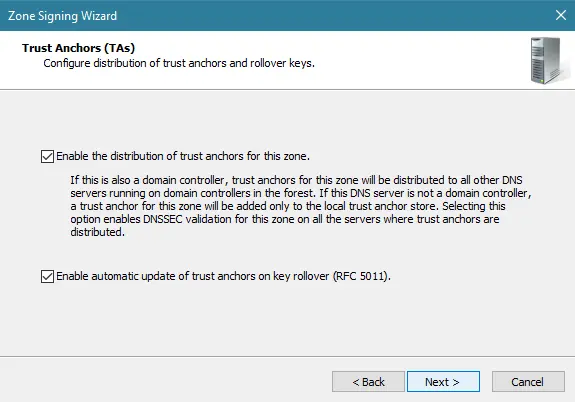

15 – On the **Signing and Polling Parameters interface**, click **Next**.


16 – On the **DNS Security Extensions (DNSSEC) interface**, click **Next**, and then click **Finish**.


17 – In the DNS console, expand **Trust Points**, expand ae, and then click your domain name.

Ensure that the **DNSKEY resource records display**, and that their status is valid.


18 – Open **Server Manager**, click Tools and open **Group Policy Management**.

19 – Next, open **Group Policy Management**, expand Forest: `Windows.ae`, expand Domains, expand `Windows.ae`, right-click **Default Domain Policy**, and then click **Edit**.


20 – In the **Group Policy Management Editor interface**, under **Computer Configuration**, expand **Policies**, expand **Windows Settings**, and then click **Name Resolution Policy**.

~*~ In the right pane, under Create Rules, in the **Suffix box**, type `Windows.ae` to apply the rule to the suffix of the namespace.

~*~ Select both the `Enable DNSSEC in this rule check box` and the `Require DNS clients` to check that the name and address data has been validated by the DNS server check box, and then click Create.


Update Groups Policy
```powershell
gpupdate /force
```

see information about Groups Policy
```powershell
gpresult /r
```
show information about Groups Policy
```powershell 
netsh namespace show policy
```
See information about TrustAnchor 
```powershell
Get-DnsServerTrustAnchor -name test.local
```

See information about Zone Settings
```powershell
Get-DnsServerDnsSecZoneSettings -zonename test.local
```
See all Zone Settings
```powershell
Get-DnsServerDnsSecZone
```
 
```powershell
Clear-DnsServerCache
Clear-DnsClientCache
```
 

**Configure the DNS Socket Pool**

- 2500 ports for use dns connection

1 – In domain Server, open **Windows PowerShell** and type : `Get-DNSServer`

~*~ This command displays the current size of the DNS socket pool (on the fourth line in the ServerSetting section). Note that the current size is 2,500.

~*~ Please take note that the default DNS socket pool size is 2,500. When you configure the DNS socket pool, you can choose a size value from 0 to 10,000. The larger the value, the greater the protection you will have against DNS spoofing attacks.

2 – Now lets change the socket pool size to 3,000.
```powershell
dnscmd /config /socketpoolsize 3000
```
3 – **Restart your DNS Server** for the changes to take effect.

~*~ confirm that the new socket pool size now is 3000

**Configure the DNS Cache Locking**

- 300 second Time to Live = 100 percent (%)

In Windows PowerShell, type `Get-Dnsserver`

~*~ This command will displays the current percentage value of the DNS cache lock.

~*~ Note that the current value is 100 percent.

This changes the cache lock value to 70 percent
```powershell
Set-DnsServerCache –LockingPercent 70
```
~*~ Please take note that you configure cache locking as a percentage value.

3 – Looking your DNS Manager Verify.


### DNS Response Rate Limiting (RRL)

See information about Resonse time
```powershell
GEt-DnsServerResponseRateLimiting
```

- `WindowInSec`: This parameter specifies the time window, in seconds, during which the DNS server collects statistics about how many requests have been received. For example, if you set WindowInSec to 7 seconds, the DNS server will collect statistics for the last 7 seconds.

- `LeakRate`: This parameter specifies the rate of leakage or "leakage" in DNS server queries over a specified period of time. If the number of queries exceeds the set value, they will be filtered out or restricted.

- `TruncateRate`: This parameter specifies the rate at which DNS server responses are truncated or "pruned" over a specified period of time. If the number of responses exceeds the set value, they will be truncated or limited.

- `ErrorsPerSec`: This parameter specifies the maximum number of DNS errors that the server can handle per second. If the number of errors exceeds this value, they can be filtered or limited.

- `ResponsesPerSec`: This setting specifies the maximum number of DNS responses that the server can send per second. If the number of responses exceeds this value, they may be filtered or limited.

```powershell
Set-DnsServerResponseRateLimiting -WindowInSec 7 -LeakRate 4 -TruncateRate 3 -ErrorsPerSec 8 -ResponsesPerSec 8
```
Reset RRL settings to default values
```powershell
Set-DnsServerResponseRateLimiting -ResetToDefault -force
```

Set RRL to LogOnly mode
```Powershell
Set-DnsServerRRL -Mode LogOnly
```

Disable RRL 
```powershell
Set-DnsServerResponseRateLimiting -mode Disable -force
```

---

### DNS Policy based Load Balancing


Create in domain scope 
```powershell
Add-DnsServerPrimaryZone -name "loadbalance.com" -ReplicationScope Domain
```
```powershell
Add-DnsServerPrimaryZone -ZoneName "loadbalance.com" -name "Scope-Heavy"
```
```powershell
Add-DnsServerPrimaryZone -ZoneName "loadbalance.com" -name "Scope-Light"
```
see status of Zonescope
```powershell
Add-DnsServerPrimaryZone -ZoneName "loadbalance.com"
```

```powershell
Add-DnsServerResourceRecord -ZoneName "loadbalance.com" -A -name "LB-WWW" -IPv4Address "192.168.1.10"
```
```powershell
Add-DnsServerResourceRecord -ZoneName "loadbalance.com" -A -name "LB-WWW" -IPv4Address "192.168.1.20" -ZoneScope "Scope-Light"
```
```powershell
Add-DnsServerResourceRecord -ZoneName "loadbalance.com" -A -name "LB-WWW" -IPv4Address "192.168.1.30" -ZoneScope "Scope-Heavy"
```


Create Policy 
 ```powershell
 Add-DnsServerQueryResolutionPolicy -name "Our-LB-Policy" -Action ALLOW -Fqdn "EQ,*" -ZoneScope "loadbalance.com,1;Scope-Light,1;Scope-Heavy,9" -ZoneName "loadbalance.com"

 See Status Zone Policy
 ```poweshell
 Add-DnsServerQueryResolutionPolicy -ZoneScope "loadbalance.com"
 ```

 On Client test :
```powershell
Clear-DnsClientCache
nslookup LB-WWW.loadbalance.com
Resolve-DnsName LB-WWW.loadbalance.com
ipconfig /displaydns
```


### DNS Time Policy

```Powershell
Add-DnsServerPrimaryZone -name "time.com" -ReplicationScope Domain
```

add subname test
```Powershell
Add-DnsServerResourceRecord -ZoneName "Time.com" -A -name test  -IPv4Address "10.10.10.10."
```
See time on server
```Powershell
 Get-Date -DisplayHint Time
```
 See Status Zone Policy
 ```poweshell
 Add-DnsServerQueryResolutionPolicy -ZoneScope "time.com"
 ```

Block site from 4:00 to 23:00
 ```poweshell
 Add-DnsServerQueryResolutionPolicy -ZoneScope "time.com" -name "Time-Policy" -Action DENY -TimeofDay "eq,04:00-23:00"
 ```
 Ignore site from 4:00 to 23:00 (not be work)
 ```poweshell
 Add-DnsServerQueryResolutionPolicy -ZoneScope "time.com" -name "Time-Policy" -Action DENY -TimeofDay "eq,04:00-23:00"
 ``` 
Test on Client
```powershell
Resolve-DnsName test.time.com
```


### DNS Tools

DNS Manager > Ser2016 > Properties > Monitoring 


### DNS Scaveging

How does DNS Scavenging work?

Before we can configure DNS Scavenging correctly, we need to understand how it works. Scavenging removes stale (old) DNS records from your DNS server, but how does it know which records are old? This is where DNS aging comes in. DNS Aging determines when a DNS record is marked as old (stale).

But to configure the DNS aging correctly, we need to know how our DHCP Lease time. A common DHCP lease time is 8 days. This means that a client gets an IP Address assigned for a period of 8 days. It can only renew the lease after 4 days. This means that the client won’t renew the IP Address for at least 4 days.

**DHCP Lease Time**


**DNS Aging**

With the lease time given, let’s take a look at DNS Aging. Aging is a feature that identifies stale DNS records. It uses the DNS record timestamp to calculate the record age and uses two intervals to determine if a record is stale:

- **Non-Refresh interval** – A period in which a DNS record cannot be refreshed.

- **Refresh interval** – A period in which a record could be refreshed.

When we talk about refreshing the record, we don’t mean changing the DNS name or IP Address but refreshing the record timestamp. The timestamp can’t be updated during the non-refresh interval. This reduces the replication traffic on the network because a Windows client will try to update the timestamp every 24 hours.

Given that DHCP records won’t be renewed during the first 50% of the lease time (4 days in our example), we can set the **Non-Refresh interval** to 4 days. If you have a DHCP lease time of 7 days for example, then set the non-refresh interval to 3 days.

During the renewal period of the DHCP lease time, we can also want to allow the DNS record timestamp to be refreshed, so the **Refresh Interval** should match the remaining days of the DHCP lease time:

DNS Aging


**DNS Scavenging**

DNS Scavenging is used to actually clean up the stale DNS records. Scavenging is configured for the whole DNS server but also needs to be enabled per DNS zone. The scavenging interval is independent of the Non-refresh and refresh intervals.

This means that if you set the scavenging period to 7 days, then the scavenging service will run every 7 days. It will not delete a stale record after 7 days exactly. To know when the next scavenging cycle will run we can use the PowerShell cmdlet `Get-DnsServerScavenging`:
```
Get-DnsServerScavenging

# Result
NoRefreshInterval  : 7.00:00:00
RefreshInterval    : 7.00:00:00
ScavengingInterval : 7.00:00:00
ScavengingState    : True
LastScavengeTime   : 4/11/2023 4:27:43 AM

# Or let PowerShell calculate the next day:
$scavange = Get-DnsServerScavenging
(Get-Date($scavange.LastScavengeTime)).AddDays($scavange.ScavengingInterval.days)

# Result
Tuesday, April 18, 2023 4:27:43 AM
```
We can see in the results that the interval is set to 7 days, and the Last Scavenge Time was the 11th of April. So on April 18th, it will run again.

In the example below I have set the scavenging interval to 4 days. What we can see here is that a stale record is deleted on day 11, and not exactly after 8 days (Non-Refresh Interval + Refresh Interval).


**Step 1 – Preparing your DNS Records**

Before we can enable DNS Aging and Scavenging on our server we first need to prepare our DNS records. Because aging and scavenging are done based on the timestamp of DNS records. And especially in older environments you sometimes see DNS records that should be static but have timestamps.

If those records were deleted by the scavenging service, then it’s possible that an application or server won’t be reachable. Besides checking for static records, we also should make a backup/export of the DNS records. This way you can always look up the old records in case they are accidentally deleted.

1. Open the **DNS Manager**
2. Navigate to your **DNS zone**
3. Look for any records that should be static, but have timestamps, for example, servers or applications


4. Right-click on the record and choose **Properties**

5. **Remove** the checkbox “Delete this record when it becomes stale”

>Tip
>
>If you **don’t see** the option **Delete this record when it becomes stale** then you 
need to **enable Advanced View** in the **DNS Manager**: Click on **View** > **Advanced**


**Export DNS Records**

Next, we are going to export the DNS records to a CSV file. There is an export function in the DNS manager, but that exports the records to a TXT file which is harder to read. So we are going to use PowerShell to export the DNS zone to a CSV file:
```
Get-DnsServerResourceRecord -ZoneName 'lazyadmin.nl' | ForEach {
    [pscustomobject]@{
        HostName   = $_.hostname
        TimeStamp  = $_.timestamp
        RecordType = $_.recordtype
        RecordData = $_.RecordData.IPv4Address.IPAddressToString}
} | Export-Csv "c:\DNSRecords.csv" -NoTypeInformation
```
I you have multiple DNS zones, then you will need to run this for each zone.

**Step 2 – Enable DNS Aging per Zone**

With the DNS records checked, we can configure the DNS Aging. We will need to do this per DNS zone. In most environments, you will have only one zone where this is required, and that is your **primary domain** name under the **Forward Lookup Zones**.

1. Right-Click on your DNS zone and choose **properties**

2. On the general tab, click on **Aging**

DNS aging


We can now configure the No-refresh interval and refresh interval. I have a DHCP lease time of 8 days, so configured both intervals to 4 days. If you have an uneven number for the DHCP lease time, then make sure that the refresh interval is higher than the no-refresh. So for example, with a DHCP lease time of 7 days, set the No-refresh to 3, and refresh to 4.

>Note

> The No-Refresh Interval + Refresh interval should be equal or less then your DHCP lease time. Where No-Refresh Interval is equal or smaller then the Refresh interval.

3. Enable **Scavenge stale resource records**

4. Set the **No-refresh interval** and **refresh interval**

Enable Zone Aging and Scavenging


**Step 3 – Enable DNS Scavenging**

With aging configured for the DNS zone, we can now enable DNS Scavenging on the server. Keep the scavenging period lower than the DHCP Lease time. You could set it even to 1 day, but that could cause a lot of replication traffic depending on your environment.

1. Right-Click on your **DNS server** and choose **properties**

2. Open the **Advanced** tab

3. **Enable automatic scavenging of stale records**

4. Set the **scavenging period to 3 days** for example

Enable DNS scavenging


---

### DNS based Authentication of Named Entities (DANE)


**What is DANE?**
DNS-based Authentication of Named Entities (DANE) is an Internet security protocol to allow Public Key Infrastructure X.509 (PKIX) digital certificates, commonly used for Transport Layer Security (TLS), to be bound to domain names using Domain Name System Security Extensions (DNSSEC). It is also an option to secure the DNS infrastructure to store generic verifiable information for multi-factor verification. The most common use of DANE today is the TLSA record type (Transport Layer Security Authentication), which allows users to verify the PKIX certificate received from a website by querying for its information in DNS. 

**Why is DANE important?**
DANE offers the option for clients to seek a second source of verification, in the case of TLSA, certificate information. Leveraging the authentication inherently in DNSSEC, organisations can publish the legitimate TLS certificate information in DNS, allowing clients to verify that the certificate information published over HTTPS matches the one published over DNS.

**How does DANE work?**
The client first initiates the connection to a web server, which replies with its PKIX certificate. The client then requests the corresponding TSLA record for the web server from its local recursive DNS server. The TSLA record response received from the DNS server is validated with DNSSEC. The client then computes and compares the details of the TLSA record with the PKIX certificate. A match of the two values will load the target page. A mismatch will result in a page warning and will not load the target page.

High-Level Explanation

1. Client initiates connection to the web server.

2. Client receives PKIX certificate from the web server.

3. Client requests for web server’s TLSA Record.

4. Local Recursive Server validates the TSLA Record with DNSSEC.

5. Local Recursive Server returns the TSLA Record to client.

6. Client compares the PKIX certificate with the TSLA Record.

6a. The page will load for records that match.

6b. The page will not load and display a warning for a record mismatch.


### DNS DANE Generate Certificate

1. you need buy one or generate from openssl


2. put your .cert to Generate TLSA Certificate
https://www.huque.com/bin/gen_tlsa


3. Add to DNS Manager 
```Powershell
Add-DnsServerResourceRecord -CertificateAssociationData <hash_from_Generator> -CertificateUsage DomainIssuedCertificate -MatchingType Sha256Hash -Selector SubjectPublicKeyInfo -TLSA -ZoneName test.local -Name _443._tcp.ww1
```


---

### DNS STATS 

clear all statistics
```Powershell
Clear-DnsServerStatistics -force
```
Clear statistics about only zone `test.local`
```Powershell
Clear-DnsServerStatistics -ZoneName test.local -force
```
see all statistics
```Powershell
Get-DnsServerStatistics 
```
see statistic only zone `test.local`
```Powershell
Get-DnsServerStatistics -ZoneName test.local 
```

```Powershell
$stats_all - Get-DnsServerStatistics 
```
```Powershell
$stats_all.PacketStatistics
```
```Powershell
$stats_zone_test - Get-DnsServerStatistics -ZoneName test.local
```
```Powershell
$stats_zone_test.zonetrasferstatistics
```
```Powershell
$stats_zone_test.zonequerystatistics
```

### DNS Powershell CLI


```Powershell
Remove-DnsServerZone -name practice.com -force
```
Create new zone 
```Powershell
Add-DnsServerPrimeryZone -name practice.com -ReplicationScope Domain 
```
Create reverse zone to `practice.com`
```Powershell
Add-DnsServerPrimeryZone -Networkid '21.22.23.0/24' -Replication Domain
```
Create subdomain A - `srv5.practice.com` and create ptr (reverse dns)
```Powershell
Add-DnsServerResourceRecord -A -Name srv5 -IPv4Address 21.22.23.5 -ZoneName practice.com -TimeToLive 01:00:00 -CreatePtr
```
other method
```Powershell
Add-DnsServerResourceRecordA -Name srv4 -IPv4Address 21.22.23.6 -ZoneName practice.com
```
```Powershell
Add-DnsServerResourceRecordPtr -Name 6 -PtrDomainName srv6.practice.com -ZoneName 23.22.21.in-addr.arpa 
```
```Powershell
Add-DnsServerResourceRecordCName -name wwww -ZoneName practice.com -HostNameAlias srv6.practice.com
```
```Powershell
Add-DnsServerResourceRecordAAAA -name srv7 -IPv6Address 2001:db:6783::7 -ZoneName practice.com
```
```Powershell
Add-DnsServerResourceRecordMx -name smtp-mail -ZoneName practice.com -MailExchange srv5.practice.com -Preference 10
```
```Powershell
Add-DnsServerResourceRecord -Srv -DomainName www.practice.com -Name web -port 80 -Priority 20 -Weight 30 -ZoneName practice.com
```Powershell
Add-DnsServerResourceRecord -Srv -ZoneName practice.com -Name Our_txt -DescriptiveText "Hello" 
```
Sea about zone 
```Powershell
Add-DnsServerResourceRecord -ZoneName practice.com
```
Sea about zone 
```Powershell
Add-DnsServerResourceRecord -ZoneName practice.com | Sort-Object RecordType 
```
see about subdomain 
```Powershell
Add-DnsServerResourceRecord -ZoneName practice.com -RRType A
```
See Aging
```Powershell
Get-DnsServerZoneAging practice.com -Aging $true -ScavengeServers 192.168.1.100
```
start Scavenging
```Powershell
Start-DnsServerScavenging -Force 
```

## DHCP

DORA


### DHCP Install

Install on Powershell CLI
```Powershell
Get-WindwosFeature "dhcp"
```

```Powershell
Add-WindowsFeature dhcp -IncludeManagementTools
```


**1. Using Server Manager**

To start the installation process, you need to open Server Manager. From the Start Menu, open the Server Manager console.

Then, click **Add Roles and Features** in the **Server Manager** window. This will cause a pop-up window to appear. On the pop-up, click **Next**


**2. Select Installation Type**
Once the below page is displayed, choose the **Role-Based** or **Feature-based** installation radio option and click on the **Next** button.


**3. Choose a Server to Install DHCP Role On**

Select the server you want to install the DHCP Server on from the list on the page below. After choosing the Server machine that **hosts your DHCP server**, click **Next**.


**4. Select Server Roles**
In this step of Configuring DHCP Server in Windows, you need to Select Server Roles.


A pop-up window will appear when you choose the option, requesting that you add features needed by the DHCP server. If you want to add the DHCP management tools along with the DHCP role, keep the Include Management Tools checked selected. Then, click on **Add Features** and then click on the **Next** button to move on.


**5. DHCP Server**
On the DHCP Server, click on **Next** and continue.


**6. Confirm Installation Selections**

You are so close to finishing Configuring DHCP Server in Windows. In this step, verify that DHCP Server and other names are on the list by looking at it. Click **Install** after that. Click **Close** once everything has been installed successfully, and your DHCP server will be up and running.

Let’s start the DHCP post-deployment configuration process.


**Step 7. Post-deployment Config**

By now, you must complete the installation process. You are ready to start Configuring DHCP Server in Windows. The option **DHCP** should now be shown on the left pane of the window when you open Server Manager. A yellow-marked warning with the words **Configuration required for DHCP Server at…** and the link **More** should appear, as seen in the picture below.


The phrase **All Server Task Details and Notifications** will appear in a new window. You will see the **Post-deployment Configuration** line underneath it. As illustrated below, click on **Complete DHCP Configuration** at the end of that line. There will be an installation wizard. Choose **Next**.


Three choices are offered to you on this Wizard page. You can move forward using the Administrator’s credentials, the credentials of a different user, and AD Authorization. Select the **Skip AD authorization** radio option if your server is standalone and is not a member of any Active Directory domain. If so, you should log in using the credentials listed in your AD. Click **Commit** once you’ve made a decision that works with your surroundings. Allow it to complete its task, and if it is successful, click **Close** with satisfaction.


**8. Configure DHCP Server**

To continue Configuring DHCP Server in Windows, return to Server Manager and select **DHCP** from the **Tools** menu. The DHCP Configuration Window will then open as displayed below.


**9. Select New Scope**

Click the drop-down arrow as indicated above, then right-click **IPv4** in the window’s left pane and select **New Scope**. As seen below, a new window for the scope wizard will open. Choose **Next**


**10. Name your Scope**

Select **Next** after entering the new scope’s name and description.


**11. Insert your IP Address Range**

In this step, you need to input the preferred IP address range. To do this, input your start and End IPs, Length, and Subnet Mask. When you are finished, click on **Next**.


**12. Set any IPs you Consider excluding here**

At this point, you can enter any IP addresses you want to reserve for possible future use with equipment like a printer and other devices.


**13. Lease Duration**

A computer or client will receive an IP address for the lease length until the DHCP server changes it or assigns a new one when the user logs in again. Hit **Next** after setting yours.


**14. DHCP Options**

If you agree with the DHCP Options as they are shown on the page, simply click **Next** on this page.


**15. Default Gateway**

In this step of Configuring DHCP Server in Windows, you must enter the Default Gateway that will be given to the clients during the leasing period on this page. Enter it in and select **Add** next to it. Click **Next** after that.


**16. Domain Name and DNS Servers**

Previously, you got familiar with DNS Records and you know the DNS is crucial since it makes it easier to resolve FQDNs to IP Addresses. So, enter it and press **Next**


**17. Wins Servers**

This step is optional. If you want to use WINS Server in your environment, enter the information below and click **Next** to continue.


**18. Activate Scope**

Simply click **Next** to activate the scope we have set for this Step. Pick the second radio option if you want to activate it later.


**19. Complete Scope Configuration**

Configuring DHCP Server in Windows is now complete. Create additional scopes as shown above for the VLANS you have segmented in your LAN/Network, then set up your router so that it requests IP addresses from the DHCP server in accordance if you have done so.


**20. Verify that your Scope is active and Set up**

Check to see if your configs are present by opening your DHCP Configuration as in Step 9 and opening it as shown below.


**21. Configure DHCP Client on Windows**

The next step is to set up DHCP Client so that a Windows machine can request an IP address from DHCP Server after DHCP Server has been configured on our Windows server.


### DHCP Reservation

1. Expand the **Address Leases** section;

2. Find the DHCP client you need in the list (currently issued dynamic IP addresses have a lease expiration date);

3. Right-click on the item and select **Add to Reservation**.


4. The current IP address will be reserved for this device’s MAC address;

5. In n the **Reservations** section, a new entry will be created for your device.

You can also create a DHCP reservation manually. To do this, you will need to get the hardware (MAC) address of the device’s network adapter. On Windows you can find your MAC address with the command:

```
Ipconfig /all
```
In this example, the Physical Address is `08-3E-8E-AA-F3-0D`. Copy this value.


Right-click on the Reservations section in the DHCP console and select **New Reservation**.


Specify the new reservation settings:

- **Reservation name**: type the network name of the device;

- **IP address**: set the device’s IP address from your DHCP scope;

- **MAC address**: paste the physical adapter address you just got;

- **Descriptions**: provide a device (optional).

Click the **Add** button to create a new reservation.


If you entered the MAC address in the wrong format, an error will appear “The Unique Identifier you have entered may not be correct. Do you want to use this Identifier anyway?”. Double-check the MAC address in this case.


You will need to reboot your device to obtain a reserved IP address. Or run the following commands to release the old IP and get a new one from DHCP server.

```
ipconfig /release

ipconfig /renew
```

You can manage your reserved IP addresses from in **Reservation** section. This is where you can delete or change any of the DHCP reservation settings.


**Managing DHCP Reservations with PowerShell**

ou can also create, modify, and delete reservations on the DHCP server from the PowerShell command line.

The `Add-DhcpServerv4Reservation` cmdlet is used to create DHCP reservations.

The following command will reserve the leased IP address for a device that has already received an IP address from your DHCP server:

```powershell
Get-DhcpServerv4Lease -IPAddress 192.168.1.50| Add-DhcpServerv4Reservation
```
If you need to create a new DHCP reservation for a specific MAC address, use the command:

```powershell
Add-DhcpServerv4Reservation -ScopeId 192.168.1.0 -IPAddress 192.168.1.51 - ClientId "00-0C-29-05-8B-7E" -Description "Boss_laptop"
```
> Hint. You can find out the MAC address on a Windows computer using the command:

> Get-NetIPConfiguration | select @{n=’ipv4address’;e={$_.ipv4address[0]}}, @{n=’macaddress’; e={$_.netadapter.macaddress}}


to remove the specific DHCP reservation, run the command:
```powershell
Get-DhcpServerv4Reservation -IPAddress 192.168.50.56| Remove-DhcpServerv4Reservation
```

### DHCP Option

if you create on `Server Options` all be copy to Scope level and Reservations

Server Options => High level

if you create on `Scope level` and `Reservations` but not copy on `Server Options`

Scope Options => Medium level

if you create on `Reservations` not copy on `Server Options` and `Server Options`

Reservations => Low Level

### DHCP Relay


To work :
Create Scope 
Add Routing and Remote Access 
Enabling DHCP relay
The DHCP relay function is enabled by default on an routing switch. However, if DHCP has been disabled, you can re-enable it by entering the following command at the global configuration level:
```
HP Switch(config)# dhcp-relay
```

**Install a DHCP relay agent on Windows Server**


This article shows you how to install and configure a Dynamic Host Configuration Protocol (DHCP) Relay Agent on a computer running Windows Server. A DHCP relay agent works as an intermediary between DHCP clients and DHCP servers that aren't on the same subnet or local network. The DHCP Relay Agent forwards DHCP broadcast messages from clients to remote server, letting clients obtain IP addresses and other network configuration information from a DHCP server located on a different subnet.

To install the DHCP relay agent on Windows Server, you need to deploy the Remote Access server role. The DHCP relay agent is a feature of Remote Access and isn't included in the DHCP server role.

Prerequisites
Before you can install your DHCP relay agent, you must have the following prerequisites:

- A computer running Windows Server in the remote subnet where you want to install the DHCP relay agent.

- A DHCP server with a DHCP scope configured for the remote subnet.

nstall and configure the server role
Here's how to install and configure LAN routing as part of the Remote Access server role from the Windows desktop.

1. Sign into the computer where you want to install the DHCP relay agent, then open the **Server Manager**.

2. In the **Server Manager console**, select **Add roles and features**.

3. In the **Add Roles and Features** menu, select **Next** until you reach the **Server Roles** page.

4. Expand the **Remote Access** role by selecting the accompanying checkbox or arrow.

5. In **Role Services**, select **Routing**, then **Add Features** when prompted.

6. Select **Next** until you reach the **Confirm installation selections** page.

7. Select **Install** to begin the installation. After the installation completes, select **Open the Getting Started Wizard**.

8. In the Routing and Remote Access Microsoft Management Console (MMC), right-click the server, then select ***Configure and Enable Routing and Remote Access*** to open the Routing and Remote Access Server Setup Wizard.

9. In the Welcome to the Routing and Remote Access Server Setup Wizard, select **Next**.

10. In **Configuration**, select LAN routing, and then select **Next**.

11. In **Custom Configuration**, select VPN access, and then select **Next** to open the Completing the Routing and Remote Access Server Setup Wizard.

Select **Finish** to close the wizard, then **Start service** when prompted.


**Configure DHCP Relay Agent**

Here's how to install the DHCP Relay Agent role from the Routing and Remote Access MMC.

1. In the left pane, expand the server name, then right-click **General** under **IPv4** or **IPv6**, then select **New Routing Protocol**.

2. In the left pane, then right-click **DHCP Relay Agent** under **IPv4** or **IPv6**, then select **New Interface**.

3. Select the network interface you want to use for the DHCP relay agent. Select **OK**.

4. In the left pane, then right-click **DHCP Relay Agent** under **IPv4** or **IPv6**, then select **Properties**.

5. Enter the IP address of the DHCP server you want to relay DHCP requests to, then select **Add**.

6. Select **OK** to save your settings.

Now the DHCP Relay Agent is installed and configured on your Windows Server.

> Dont forget create scope

> Dont forget confige reverse routing for DHCP to Client

* DHCP Know about clients message using this line `GIADDR field` (Gateway IP Address)

```
route print
```

add route to gateway 192.168.1.11 
```
route add 192.168.2.0 mask 255.255.255.0 192.168.1.11 -p
```


### DHCP Updates to DNS Records

Set for not AD account 

View current A records in `test.local`

```powershell
Get-DnsServerResourceRecord -computer -srv2016 -ZoneName test.local -RRType A
```
Create reverse lookup zone for 192.168.2.0/24
```powershell
Add-DnsServerPrimaryZone -computer srv2016 -NetworkId '192.168.2.0/24' -ReplicationScope Domain
```
View current A and PTR records in specific zones 
```powershell
Get-DnsServerResourceRecord -computer srv2016 -ZoneName test.local -RRType A
Get-DnsServerResourceRecord -computer srv2016 -ZoneName 2.168.192.in-addr.arpa -RRType Ptr
```

Set DHCP IPv4 propeties regarding dynamic updates to dns
```powershell
Set-DhcpServerv4DnsSetting -computer srv2016 -DynamicUpdates Always -UpdateDnsRRForOlderClients $true -DeleteDnsRRForOlderClients $true -DeleteDnsRROnLeaseExpiry $true
```


### DHCP PXE Support

Scope Option > Right-click Configuure Options 

- [X] 66 = Boot Server Host Name

- [X] 67 = BootFile NameWhen the initial DHCP offer from the DHCP server contains these boot options, an attempt is made to connect to port 4011 on the DHCP server. This offer fails if the PXE server is on another computer.


**Configuring the DHCP server for WDS**

First in the line of duty is the DHCP server. Here we need to add two more scope options to tell clients where our WDS server is located, and by located I mean its IP address, and what is the boot image file name the clients need to download in order to be able to boot from network.

Open your DHCP server console, locate your scope for the clients pool, and drill down to **cope Options**. Right-click this folder and choose **Configure Options**.


What interest us here, are options **66** and **67**. Check the box next to 66 then in the **String value** box, type the IP address of your WDS server. Once you’re done with this, go and check the box next to option **67**. Here, we need to put the path for the boot file name, and we have two options: one for the x86 architecture and the other one for the x64 one. Unfortunately we cannot put both, but since most of the systems are now x64, I will just use this one.

For the x64 architecture type **bootx64wdsnbp.com**
For the x86 architecture type **bootx86wdsnbp.com**


### DHCP Superscopes and Multicast Scopes

Create Scope 1 and Scope 2
```powershell
Add-DhcpServerv4Scope -name Network1 -StartRange 10.0.1.1 -EndRange 10.0.1.254 -Status Active -SubnetMask 255.255.255.0
```
```powershell
Add-DhcpServerv4Scope -name Network1 -StartRange 10.0.2.1 -EndRange 10.0.2.254 -Status Active -SubnetMask 255.255.255.0
```

Exclusion ip from ...1.1 to ...1.10 and ...2.1 to ...2.10
```powershell
Add-DhcpServerExclusionRange -Scopeid 10.0.1.0 -StartRange 10.0.1.1 -EndRange 10.0.1.10
```
```powershell
Add-DhcpServerExclusionRange -Scopeid 10.0.2.0 -StartRange 10.0.2.1 -EndRange 10.0.2.10
```

add information about default gateway to scope 1 and scope 2
```powershell
Set-DhcpServerv4OptionValue -Scopeid 10.0.1.0 -Router 10.0.1.1
```

Super Scope union scope 1 and scope 2
```powershell
Add-DhcpServerv4Superscope -SuperscopeName Our_Superscope -ScopeId 10.0.1.0,10.0.2.0
```


### DHCP Policies

DHCP policy based assignment overview
With a DHCP server running Windows Server 2012 or Windows Server 2012 R2, administrators can define an address assignment policy at the server level or scope level. A policy contains a set of conditions to evaluate when processing client requests. Policy based assignment enables flexibility for some common scenarios, including:

1.**Multiple device types**: A network includes many different DHCP client devices, such as printers, IP phones, and desktops. Administrators need the ability to classify these devices using different IP address ranges. This enables router policies and quality of service (QoS) based on IP address range policies to control network access or traffic. For example, you can add a vendor class of “Hewlett-Packard JetDirect” or Cisco Systems, Inc. IP Phone CP-7940G and configure printer and IP-phone policies to assign a specific IP address range to these devices.

2.**Multiple roles**: A network includes different types of computers, such as laptops, desktops, and servers in the same subnet. Depending on the type of client, the administrator might wish to provide different lease duration settings. All the wireless clients that connect via a specific relay agent can be assigned a four-hour lease duration. DNS dynamic update protocol can be disabled for clients matching this policy. Similarly, a server policy can be created using a list of server MAC addresses. Servers can be assigned a 12-day lease duration

3.**Virtualization**: A data center network employs virtualization for different workloads and applications. Virtual machines are added and removed dynamically depending upon load requirements at a given time. An administrator wishing to route traffic on the network differently for VMs can create a policy based on MAC address prefix to assign a short lease duration, specific IP address range, and different default gateway.

The following fields in the DHCP client request are available when defining policies.

- Vendor Class

- User Class

- MAC address

- Client Identifier

- Relay Agent Information


**To create policies**

1. In the DHCP console, under Scope, right-click Policies and then click New Policy.

> Important

> Ensure that you select the Policy folder under the Scope folder. This is the scope-level folder. The other Policies folder is for server-level policies and if you create a policy there you will not be able to create the IP address range policy for this exercise.

2. Next to **Policy Name**, type **Client1 Policy**, and then click **Next**.

3. On the **Configure Conditions** for the policy page, click **Add**.

4. In the **Add/Edit Condition** dialog box, choose **MAC Address** next to **Criteria**, type the MAC address for Client1 next to **Value** (001DB7A63D in this example), and then click **Add**, then click **OK**.


5. Click **Next**, and then in **Configure settings for the policy**, type **10.0.0.100** next to **Start IP address** and type **10.0.0.199** next to **End IP address**.


6. Click **Next**, and then under **Available Options**, select **03 Router**, type **10.0.0.7** under **IP address**, and click **Add**.

7. Click **Next**, and then click **Finish**.

8. Repeat the previous steps for Client2 using the following conditions, IP address ranges, and options:

a. **Policy Name**: Client2 Policy

b. **Condition**: MAC Address equals (in this example) 00155DB7A63E.

c. **Start IP address**: 10.0.0.200

d. **End IP address**: 10.0.0.254

e. **003 Router**: 10.0.0.8

###  DHCP Policies and Vendor Classes

I often need to add a Vendor Class (Option 066) to define vendor specific settings to be sent to the endpoints in question. Typically this used to be rather a pain and often a little confusing, especially since you don’t set this up every day.

Finally with the release of Windows 2016, DHCP has matured to the extent that you are able to define policies dependent on other criteria. In this case I will explain how you can send specific option settings based on a vendor class.

My scenario includes two IP Phone variants, Yealink and V-Tech.

First I will define the Vendor Classes. The I will create a policy. The policy will look for Vendor Class matches, if a match is found then specific options will be sent to the IP phone.

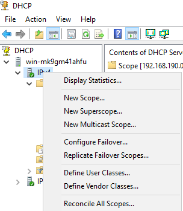

From the DHCP Server, right click **IP-V4** (of course you can do IP-V6 if that’s what you are running). Select Vefine Vendor `ClassesVendor Classes` Click **Add**


Give your new Vendor Class a Display Name. In this example I am adding Yealink IP Phones. It is important to note that the ASCII value needs to be the Vendor Class as specified by the device vendor, in the case on Yealink IP Phones its simply `yealink` (lower case)

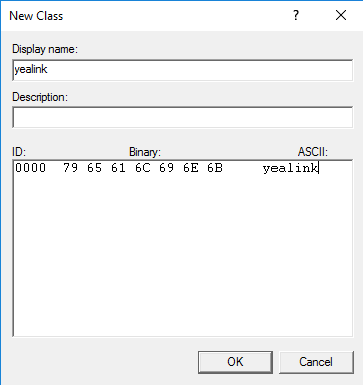

You will now see Yealink appear as a new vendor class (I have also added V-Tech which is another IP Phone brand I will be using, vendor class for the V-Tech phones)


Next, we will define a Policy that simply matches the vendor classes we want as a condition, then applying specific class options to the matched vendor classes.


For the Scope in question, right click on **Policies** and select **New Policy**


Give your Policy a Name and Description if needed, Click **Next**


Give your Policy a Name and Description if needed, Click **Next**


Since I plan to have 2 vendor classes as conditions, I will set this as an OR condition (so it matched Yealink OR V-Tech) by selecting the OR Radio button, then click **Add**


Select the criteria as **Vendor Class**, **Operator** as **Equals** and choose the required vendor class. Click **Add** and **Ok**


You should now see the selected Vendor class as in the image below


We now add the second vendor class to our criteria, same as we just did before. This time I am selecting V-Tech (my other IP Phone variant)


We should now see both selected Vendor classes as per the screenshot. Click **Next** to proceed.


I won’t be handing out any specific IP addressing for my IP Phones recognized by the vendor classes, so I select the No radio button followed by **Next**


The DHCP Scope option I’d like to associate with my Vendor Classes is **Option 066 – Boot Server Host Name**, this is a Standard Option. Specify the **String Value** and Click **Next**.


NOTE: ***The String Value is the TFTP Boot Server and will depend on the location and platform you are working with.***

Complete the Policy by clicking **Finish**


If you now navigate to the DHCP Options for Scope you have just created the Policy for, you should see the Option with associated policy Name like the screen shot.


You should now be good to go.

---

**Change on Client computer Class ID**

add client computer to class "IT"
```powershell
ipconfig /setclassid Ethernet IT
```
Change back to default
```poweshell
ipconfig /SetClassid Ethernet
```
---


### DHCP Split Scopes


1. **Install DHCP Role**: Ensure that the DHCP role is installed on both servers.

2. **Authorize DHCP Servers**: Make sure both DHCP servers are authorized in Active Directory if they're not already.

3. **Open DHCP Management Console**: 
  - Go to **Start** > **Administrative Tools** > **DHCP**.

4. **Create DHCP Scope:**

  - Expand your DHCP server in the DHCP Management Console.

  - Right-click on **IPv4** and select **New Scope**.

  - Follow the wizard to create a new DHCP scope on the first DHCP server. Specify the IP address range, subnet mask, default gateway, DNS servers, lease duration, and any exclusions as needed.

5. **Configure Split Scope:**

  - After creating the scope on the first DHCP server, right-click on the scope and select **Advanced** > **Split-scope.**

  - Follow the wizard to configure the split scope.

  - Specify the percentage of IP addresses you want to allocate to each server. Typically, this is 50% for each server, but you can adjust it based on your requirements.

6. **Authorize Second DHCP Server:**

  - Ensure that the second DHCP server is authorized in Active Directory.

  - If it's not authorized, right-click on **IPv4** in the DHCP Management Console, select **Authorize**, and provide appropriate credentials to authorize the server.

7. Create DHCP Scope on Second Server:

  - Once the split scope is configured, create an identical DHCP scope on the second DHCP server, but with a non-overlapping IP address range. This ensures redundancy and load balancing.

  - Make sure to exclude the IP address range that is already assigned to the first server.

8. **Test the Configuration:**

 - Ensure that both DHCP servers are responding to client requests.

 - Test the failover by shutting down one DHCP server and confirming that the other server is still able to provide IP addresses to clients.

**Monitoring and Maintenance:**
 
 - Regularly monitor the DHCP servers to ensure they're functioning correctly.

 - Perform maintenance tasks like updating lease durations, adjusting IP address ranges, or adding exclusions as needed.


### DHCP Failover 

Replication parthners


#### Configure a failover relationship

First, configure a failover relationship using DHCP1 and DHCP2.

**To configure a failover relationship**

1. On DHCP2, open the DHCP console, right-click the Contoso-scope1 DHCP scope and then click **Configure failover**.


2. In the **Configure Failover wizard**, click **Next**.

3. In **Specify the partner server to use for failover**, next to **Partner Server**, type `dhcp1.contoso.com` and then click Next.

4. In **Create a new failover relationship**, type a name next to **Relationship Name**, or accept the default name that is displayed (dhcp2.contoso.com-dhcp1.contoso.com).

5. Type a shared secret for this failover relationship next to **Shared Secret** (ex: secret).

6. Change the value next to **Maximum Client Lead Time** to **0** hours and **1** minute.

7. Review the options available in the drop-down menu next to **Mode**. You can choose **Load balance** or **Hot standby**. By default, Load balance mode is chosen.


8. Click **Next** and then click **Finish**.

9. Verify that failover configuration was successful, and then click **Close**.


10. On DHCP1, refresh the DHCP console and verify that the same DHCP scope configuration that is present on DHCP2 is now present on DHCP1.


#### View or edit properties of the failover configuration

After you configure a failover relationship on a DHCP server, details for the failover relationship are displayed in the DHCP console.

**To view or edit properties of the failover relationship**

1. On DHCP1 or DHCP2, in the DHCP console, right-click the Contoso-scope1 DHCP scope and then click **Properties**.

2. Click the **Failover** tab and review the information displayed. Verify that **Normal** is displayed next to **State of this Server** and also next to **State of Partner Server**.


3. Note that you can edit or delete the failover relationship.


4. Click **Edit** and review properties of the failover relationship that are available to edit.

5. Leave the dialog box open for the following procedure.

#### Edit properties of the failover relationship and demonstrate load balancing

To demonstrate dynamic load balancing properties of the failover relationship, the load balancing percentage will be changed for an active DHCP scope.

**To edit properties of the failover relationship and demonstrate load balancing**

1. On Client1, click **Windows PowerShell** and type the following command.

2. In the command output, note the DHCP server that is currently supplying an IP address configuration to Client1. The IP address of the DHCP server is displayed next to **DHCP Server**.

3. In the **View/Edit Failover Relationship** dialog box DHCP1 or DHCP2 that was opened in the previous procedure, change the values under **Load Balance Mode** next to **Local Server** and **Partner Server** so that **100%** is assigned to the DHCP server that is currently not supplying an IP address to Client1. The server that is currently supplying an IP address to Client1 will have a value assigned of **0%**.


4. Click **OK** twice, wait until the current DHCP lease is expired on Client1, and then type `ipconfig /all` again at the **Windows PowerShell** prompt.

5. Note that the DHCP server that is supplying an IP address configuration to Client1 has changed to the server that you assigned 100% weight in load balancing mode.

#### Edit properties of the failover relationship and demonstrate hot standby mode

o demonstrate hot standby mode, the DHCP Server service on one of the failover partners will be stopped.

**To edit properties of the failover relationship and demonstrate hot standby mode**

1. On DHCP1 or DHCP2, in the DHCP console, right-click the Contoso-scope1 DHCP scope and then click **Properties**.

2. Click the **Failover** tab.

3. Click **Edit** and then choose **Hot Standby Mode**.

4. Depending on which DHCP server you are configuring, the local server will be assigned either **Active** or **Standby** status. The status is displayed next to **Role of this server**.


> Tip

> The server that is designated to be Active in hot standby mode is the server that you used to create the failover relationship.

5. Click **OK** twice and then wait 2 minutes for the DHCP lease on Client1 to renew.

6. On Client1, type `ipconfig /all` at the Windows PowerShell prompt and verify that the server that is assigned as Active is supplying an IP addresses configuration to Client1

7. In the DHCP console on the DHCP server that is marked as Active for the hot standby failover relationship and is currently supplying an IP address to Client1, right-click the server name, point to All Tasks, and then click Stop.

8. Verify that the DHCP service is stopped on the active DHCP server.


9. Wait for the DHCP lease to renew on Client1, type `ipconfig /all` at the Windows PowerShell prompt, and verify that the standby DHCP server is supplying an IP address to Client1.

### DHCP Backup & Restore

Default backup folder in `C:\Windows\system32\dhcp\backup`

#### Manual DHCP Backup Using DHCP Console


In this example, I’ll be backing up the DHCP configuration on server DHCP1. Later in this tutorial, I’ll be restoring this backup to server DHCP2.

#### Step 1: Create a Backup Folder

I’ve created a folder on the server desktop called DHCPBackup


#### Step 2: Open the DHCP Administration Console

The DHCP console is located in **Start** > **Windows Administrative Tools** > **DHCP**

#### Step 3: Right Click the Server and Select Backup


**Select** the folder that was created in step 1. In my case, this was the **DHCPBackup folder** on the Desktop. Then click **OK**


Unfortunately, there is no confirmation that the backup was completed.

You can go open the folder and verify data was backed up.


I can see that files were written to the folder, looks like the backup was completed successfully.

That is it for manually backing up the DHCP server. Now, let’s move on to the restore process.

#### Restore DHCP Server Using DHCP Console

> **Important Tip**: You must copy the backup folder from the steps above to %SystemRoot%System32\DHCP\backup or you will get the following error saying the database was not restored correctly.


#### Step 1: Log into the server you want to restore the DHCP backup to

I’m logging into my 2nd DHCP server with the hostname of DHCP2.


#### Step 2: Copy the backup to the correct location

Now I will copy the DHCPBackup folder to `%SystemRoot%System32\DHCP\backup`


#### Step 3: Open The DHCP Console and Select Restore

On the DHCP Console, right click the server and select **Restore**
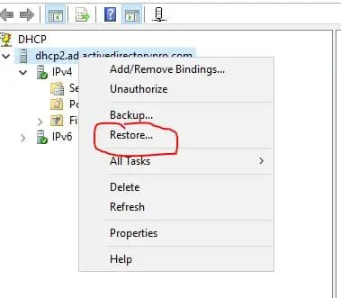

Now select the DHCPBackup folder


You will get a message that says the service must be stopped and restarted.

Click **Yes**

Restore complete


You can go browse the scopes to verify everything restored correctly.

I have a small lab but I can see the two scopes, leases, and reservations all restored.


#### Backup DHCP Server Using PowerShell

n this example, I’ll be logged in locally to the server.

Use the following command to backup the DHCP configuration using PowerShell.
```powershell
Backup-DhcpServer -path c:\DHCPBackup
```
If you want to backup the DHCP server from a remote computer use this command
```powershell
Backup-DhcpServer -ComputerName "dhcp1" -Path "C:\DHCPBackup"
```

#### Restore DHCP Server Using PowerShell

Step 1: Copy the backup folder to the correct path

Remember the backup has to be copied to `C:Window\ssystem32\dhcp\backup` or you will get permission errors.

Step 2: Run the following command
```powershell
PS C:> Restore-DhcpServer -ComputerName "dhcp2" -Path "C:Windows\system32\dhcp\backup"
```

or 

```powershell
Export-DchpServer -leases -file D:\DHCP\DHCP_Export\DHCP_Export.xml
Import-DchpServer -leases -file D:\DHCP\DHCP_Export\DHCP_Export.xml all
```


### DHCP IPv4 Link Layer Filter

**Configure Filters in DHCP Server**

In the DHCP console, expand the server and IPv4 objects and go to the **Filters** object. Here, you’ll see two sub-folders (lists), **Allow** and **Deny**. By default, the two lists are deactivated and you can see this from the red down arrow, as shown in the figure below.


To add a DHCP Client to the Allow list, right-click and then click **New Filter**. Next, type the client’s MAC address and a description (optional) and click the **Add** button to complete the process.


The MAC address you type can be dashed (eg AA-BB-CC-DD-EE-FF) or without (eg AABBCCDDEEFF). You can also use the asterisk (*) as a wildcard to declare a range of MAC addresses. For example, AA-BB-*-DD-EE-FF, AA-BB-CC-*-*-*, AA-BB-*.

Respectively, follow the same procedure to add clients to the Deny list.

What is important to know is that the Deny list is superior to any other setting. So, if a client does not receive an IP address from a DHCP Server and the Filters are enabled, then your first action will be to check if it is in the Deny and then in Allow lists.

Additionally, you can move one or more clients from one list to another by right-clicking and then choose the corresponding option.


You can do the same for clients already in Address Leases, of course not having to type the MAC address.


Finally, do not forget to enable or disable the Allow and Deny lists by right-clicking and then choosing the corresponding option.


### DHCP Troubleshooting


Reconcile on Scope (repair beetwin dhcp and reqestry)
```powershell
Reconcile-DhcpServerv4IPRecord -ScopeId 192.168.2.0
```
Fix dhcp scope
```powershell
Repair-DhcpServerv4IPRecord -ScopeId 192.168.2.0
```

## DHCPv6

More about DHCPv6 : [link](https://blog.pdan.dev/posts/dhcpv6)


### DHCP Preparing for IPv6 Scopes

Set IPv6 on Powershell
```powershell
New-IPAddress -InterfaceAlias "ethernet" -IPAddress 2001:db8:6783::102 -PrefixLenght 64 -DefaultGateway 2001:db8:6783::100
```

ping for ipv6
```powershell
ping -6 2001:db8:6783::102 
```
Enable Advartising Enabled
```powershell
Set-NetIPInterface -AddressFamily IPv6 InterfaceAlias "ethernet" -Advertising Enabled
```
View Route V6
```powershell
Get-NetRoute -InterfaceAlias "ethernet" -AddressFamily IPv6
````
Create network v6
```powershell
new-NetRoute -DestinationPrefix 2001:db:6783::/64 -InterfaceAlias "ethernet" -Publish Yes
```

Add DHCPv6 Scope
```powershell
Add-DhcpServerv6Scope -name second-ipv6-scope -Prefix 3000:beef::
```


## IPAM 

IP Address Manager


#### Install and Configure IPAM in Windows Server


**What is IP Address Management (IPAM)?**

IPAM provides highly customizable administrative and monitoring capabilities for the IP address infrastructure on a corporate network. You can monitor, audit, and manage servers running the Dynamic Host Configuration Protocol (DHCP) and Domain Name System (DNS).

Understanding Test Lab:

- **WS2K19-DC01**: Active Directory Domain Controller with DNS and DHCP server role.

- **WS2K19-SRV02**: Member Server for mylab.local domain.


Install IPAM Feature in Windows Server:

1. On WS2K19-SRV02, **Open Server Manager** Console.


2. At the top of the **Server Manager**, click on **Manage** and select Add **Roles and Features**.


3. On the Before you begin page, click **Next**.


4. Select **Role-based or feature-based** installation and then click **Next**.


5. **Select a server from the server pool** on which you want to install the IPAM feature, click **Next**.


6. On select server roles page, click **Next**.


7. On select features page, scroll down and **select IP Address Management (IPAM) Server** feature.


8. A new window will pop up, click on **Add Features** to include required features and management tools for IPAM.


9. Make sure that the IPAM feature is selected. Click **Next**.


10. **Click on the Install** button to start the installation process.


11. When the installation is complete, click the **Close** button.


After installing the IPAM feature on windows server 2019, the next step is to configure the IPAM server. The IPAM server can manage DHCP, DNS, and Domain Controllers.

#### Configure IPAM Server in Windows Server:

**Step:1 Choose an IPAM Provisioning Method:**

12. On the Server Manager Dashboard page, click on **IPAM** from the left pane.


13. On the IPAM Overview page, click on **Provision the IPAM server** link to start the Provision IPAM wizard.


14. Read the information about IPAM server at the start of the Wizard and click **Next**.


15. Choose the database to store IPAM server data. You can use either the WID or SQL database. For testing purposes, **I will go with the Windows Internal Database (WID)**. Click **Next**.


> Note: The provisioning method is the process of enabling required permissions, files shares, and access settings on managed servers so that the IPAM server can communicate with them.

16. On select provisioning method page, **choose** either the Manual or **Group Policy Based** radio button. If you select Group Policy Based method, type a GPO prefix next to **GPO name prefix** to identify the GPOs. Click **Next**.


17. Review your selection. When you are ready, click on **Apply**.


18. Verify that IPAM provisioning completed successfully message is displayed, and then click **Close**.


**Step:2 Configure Server Discovery**

19. On the IPAM Overview page, click on **Configure Server Discovery** link to start server discovery wizard.


20. Click on the **Get Forests** button and wait for the background task to finish. A message will appear, click on **OK** to close it.


21. Choose each domain that you will manage with the current IPAM server by selecting it from the drop-down list and then click on the **Add** button to add it. Click on **OK**.


**Step:3 Start Server Discovery**

22. On the IPAM Overview page, click on the **Start server discovery** link to start the task to discover the server in the selected domain. It will take some time to **Complete**.


**Step:4 Select or add servers to manage and verify the IPAM access**

23. After the discovery process, click on the **Select or add servers to manage and verify the IPAM access** link to add servers that you want to manage using the IPAM.


24. Notice that IPAM Access Status is **Blocked** for the server.


To fix this, we need to run the `Invoke-IpamGpoProvisioning` cmdlet at an elevated Windows PowerShell prompt.

25. On the IPAM server, open **Windows PowerShell** as administrator.


26. Run the below cmdlet at the PowerShell.
```powershell
Invoke-IpamGpoProvisioning –Domain mylab.local –GpoPrefixName MYLAB_IPAM –IpamServerFqdn WS2K19-SRV02.mylab.local -DelegatedGpoUser Administrator@mylab.local
```


27. On Domain Controller, check the IPAM GPO’s.


28. We need to update the group policy on our domain controller. Open a command prompt and run command `gpupdate /force`.


**Step:5 Managed Server Access Settings:**

29. Right-click on the server and then click on **Edit Server**.


30. Select Managed from the drop-down list to manage the server by the IPAM server. Click on **OK**.


**Step:6 Retrieve Data from Managed Servers**

31. Right-click the servers that are selected, and then click **Refresh Server Access** Status. This action also will take a few minutes to complete.


32. Verify the IPAM server access status to **Unblocked**.


33. Right-click the servers that are selected, and then click **Retrieve All Server Data**.


34. Wait for the data collection tasks to complete. Verify All the DHCP and DNS Data in IPAM Console.


### IPAM Role Based Access Control (RBAC)


The core concept of RBAC is what you can do and where you can do it. With RBAC you can do certain stuff but you can only do it in a specific backyard. For example we can grant permissions to only create and delete DNS records in one specific DNS zone or to only create scopes or maybe to only create specific DNS records.

RBAC consists of three related components.

- **ROLES** –> are collections of privileges. They specify the tasks that can be performed, in another words what user will be able to do. For example: Manage specific DNS zone, record, DHCP scope etc.
 

 - **ACCESS SCOPES** –> determine how far and wide a particular role can go in the server. Can they go just with DNS, just with NPS, just with DHCP? Can they only do auditing? It gives you more flexibility than when just we use the local administrative groups. So if the Role is the what, the Access Scope is the where. For example: dns servers, zones dhcp server etc.
 

- **ACCESS POLICIES** –> are the combination of roles and access scopes.


#### Configure Role Based Access Control for IPAM on Windows Server 

|TYPE |	NAME |	DESCRIPTION |
| --- | ---- | ------------ |
| Role |	DNS record administrator | Manages DNS resource records |
| Role |	IP address record administrator |	Manages IP addresses but not IP address spaces, ranges, blocks, or subnets. |
| Role	| IPAM administrator | Manages all settings and objects in IPAM |
| Role | IPAM ASM administrator | Completely manages IP addresses |
| Role | IPAM DHCP administrator	 | Completely manages DHCP servers |
| Role | IPAM DHCP reservations administrator	Manages DHCP reservations |
| Role | IPAM DHCP scope administrator | Manages DHCP scopes |
| Role | IPAM MSM administrator | Completely manages DHCP and DNS servers |
| Access scope | Global	| By default, all objects in IPAM are included in the global access scope. All additional scopes that are configured are subsets of the global access |


**Adding custom role**

sometimes,built-in roles won’t meet our requirements,in that case we can create custom role.

Click Access Control-Right click **Add User Role**


Enter role name and define what action can be done within that role,in this example user can create zone and invoke zone transfer and configure preferred DNS server.


**Creating Access policy**

Now map user to IPAM role:

Right click **Access Policies** > **Add Access Policy**


Click Add-select domain and add user (in my example this user is standard domain user with no specific privileges)


In Access Settings click **New** and choose role


Click **Add Settings**


Optionally,we can specify **Access Scope**.

An access scope determines the objects that a user has access to. You can use access scopes to define administrative domains in IPAM. For example, you might create access scopes based on geographical location. By default, IPAM includes an access scope of Global. All other access scopes are subsets of the Global access scope. Users or groups that are assigned to the Global access scope have access to all objects in IPAM that are permitted by their assigned role.

In this example i didn’t create any access scope

Testing

Log in to IMAP server with user,according to role setting,user can create DNS zone,but can’t delete it

 


### IPAM Find And Allocate Available IP Addresses

To manage our IPAM collections, there is a variety of different tasks that are just context menu items that exist off of the individual ranges you’ve created. So let’s say, for example, that I need to go in and grab a new address for a machine that I’m putting into my server net. Well, in the old days, I’d have to take a look at spreadsheet, but now that I have my IPAM database, the process to request, and actually receive a new address, happens very simply by right clicking on the range, and choosing to find and allocate an available IP address.


Now you’ll notice what happens here. We are taking a look at the next available address 10.52.99.61. We can see that there’s no Ping Reply, in other words, that there’s nobody using this address, and there’s no DNS record so that IP address will be good.

If you see the ping reply or the DNS record, click on Find Next to check second address and this process gives us the ability to continue marching down the path to find the addresses that is available for you to use.

You might be saying to yourself, well wait a minute, why do I have to go through just clicking the Find Next button over and over again until I get the next available address? If you think about the range that we’ve created, the whole point behind this range is that the addresses in that range are probably best when they’re actually managed by IPAM, and so the idea here is that with all of those addresses already managed by IPAM, you’ll need to continuously click the Find Next button won’t happen that often because IPAM will simply find the next available address according to its view of the world, and see if that address is not otherwise consumed by some other machine. The fact that you need to do this twice, or maybe three times, indicates that you have got some machines that perhaps are not managed by IPAM, and maybe don’t belong in particular subnet.


With 10.52.99.61 I can continue by just adding in all the other information just like I did before, the MAC address, who it’s managed by, the name, the client ID, the DNS record synchronization, and all the other stuff that I would need in order to create an additional record here in my IPAM database.


Every so often you’ll find yourself just needing to reclaim some addresses. There actually is a reclamation ability in IPAM by right clicking on range and choosing to reclaim IP addresses.


This process allows us to go through and reclaim the IP addresses we’re no longer using, and even delete the resource records and any DHCP reservations that exist associated with those records as well.


### Manage DHCP  With IPAM

As I said before, one of the great things about IPAM is that you can use it as a meta management solution for all of your DHCP servers.  I will not go too much in detail, I just want to show you that you can configure everything from one pane of glass.

Click on DNS and DHCP Servers.


If I right click on the role here for example DC02 (DHCP), you’ll see there are a variety of additional configurations for DHCP, and a much smaller set of configurations for my DNS server,  that allows me to just tell that DHCP server to accomplish certain things, like configuring server properties, creating a scope, user class, or a policy, or whatever.


If I’m experiencing a problem, I can come down to the bottom area, and do some troubleshooting by looking at the Event Catalog. These are, again, the specific events that have to do with DHCP, or DNS, so to give us a better idea of what actual activities are going on for the servers, and something that’s available that can be done here as well.


Let’s click now on DHCP Scopes and right-click on one scope. You will see Duplicate DHCP Scope. With this option we can duplicate scope and put in on another server and this is a great way of migrating dhcp scope. Imagine that you need to decommission the dhcp server and you need to move all the scopes of that server, IPAM is a really good tool to do it.


Let’s duplicate one of our scopes. Right-Click on the scope you would like to duplicate and select duplicate dhcp scope. I will choose Scope 4 which is on my DC02.


In the General Proporties, I will choose my second server DC01 and type in start and end IP address.


Scroll down and modify settings if needed and click ok.


Here it is. Now we have Scope for on second DHCP server.


Let’s configure DHCP failover. Right click on the scope and select Configure DHCP Failover


Select Partner Server for the scope, give the relationship a name and create a secret


Scroll down and choose the mode. In my case it will be Load Balance 50-50. Once done click OK


That’s it.


If you would like to configure Superscope you would need to mark 2 scopes and right-click on one of them and select Add to DHCP Superscope


It is important that you play with this so that you get familiar with different options you can configure through IPAM.

### Manage DNS with IPAM

In a previous versions of IPAM there was not much DNS functionality. The version that comes with Windows Server 2016 builds on that. In terms of limitations there is a very limited amount you can do in terms of configuring DNS Server properties. You are very much managing things at the node level and at the record level.

One of the first things you can do with IPAM which is realy useful is you can see properties of each DNS server in your organization. You can see how they are configured from a single pane of glass.

Remember that IPAM can manage DNS and DHCP servers only if they are members of a domain. If you have a DNS server in a perimiter network then you will not be able to manage it with IPAM.


Let’s see for example how we can create a new zone. Click on DNS and DHCP servers node, right-click on your DNS server and select Create **DNS Zone**


Create **DNS Zone** wizard will pop-up. In the Zone Category and Zone Type I will leave the defaults and under Zone name I will type in carrera.mehic.se. We have the Advanced Properties as well and I will leave the defaults there as well. It is very easy to configure this in IPAM. Once done, click ok


You will notice that Zone Status will show No Data and you will see Unknown as well. That means that zone is not updated yet.

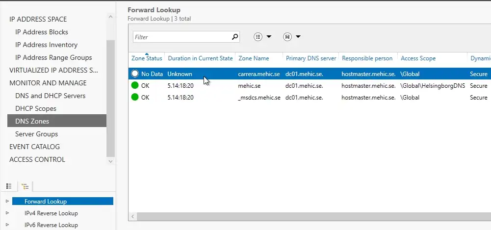

Click on DNS and DHCP Servers, right-click on your DNS server and select Retreive Server Data.


Go back to DNS Zones and refresh the page and you will see that the zone is updated now.


Now we can go and configure the zone, add records, edit the zone etc. I will not go much in detail here. It is important to play with this and configure zones and records to get use to it.


That’s it. In our last part (Part 4) we will take a look at IPAM Auditing, IPAM Database Storage and Management, IPAM Backup, Migration to SQL server etc.


## NAT

### Install Routing and Remote Access on Server

1. Click on **Manage** and select **Add Role** and **Features**.


2. On the Before you begin page, click **Next**.


3. Select **Role-based or feature-based installation** and click **Next**.


4. **Select a server** from the server pool on which you want to install the Remote Access Service role, click Next.


5. On select server roles page, select the **Remote Access** Services checkbox. Click **Next**.


6. On select **Features**, click **Next**.


7. Read overview information about Remote Access Services and click **Next**.


8. On Select **Role Service** console, select the **Routing** checkbox to install the LAN Routing role service.


9. Click the **Add Features** button to add the required feature for LAN Routing. Click **Next** to continue.


10. Click **Next** on Web Server role services page.

11. Click **Install** and complete the installation process.

12. Click **Close** to finish the installation.

### Configure NAT and LAN Routing on Windows Server 2019:

13. To configure NAT and LAN routing, open the Remote and Routing Access console using the Server Manager console.

14. Click on **Tools** and select **Remote and Routing Access**.


15. Select and right-click on the local server name and then select **Configure and Enable Routing and Remote Access**.


16. On the welcome page, read the description, and click **Next**.


17. On the Configuration page, select the **Network Address Translation (NAT)**. Click **Next**.


18. On the **NAT Internet Connection** page, select the network interface your users will use to connect to the internet. Click **Next**.


> Select the interface with connected to the internet

19. Click **Finish**.


### Verify NAT Configuration Settings:

20. On **Routing and Remote Access** console, expand the local server name, expand **IPv4**. Click and Expand **NAT**.

21. Double-click on the **LAN** interface. Verify Interface type is a Private interface connected to the private network.


22. Double-click on the **INTERNET** interface. Verify Interface type is a **Public interface connected to the Internet**. Make sure that **Enable NAT on this interface** checkbox is selected.


---

### NAT PAT Port Forwarding

Port forwarding with powershell
```powershell
net-netnat -name ournat -InternalIPInterfaceAdressPrefix 192.168.1.0/24
```
```powershell
Add-NetNatStaticMapping -NatName ournat -Protocol TCP -ExternalIPAdress 0.0.0.0 InternalIPAddress 192.168.1.0 -InternalPort 80 -ExternalPort 5666  
```

```powershell
Get-NetNat
```
```powershell
Get-NetNatStaticMapping
```
```powershell
Get-NetNatSession 
```

## VPN

### Install VPN 

Configuration of the VPN protocols
Supported protocols

 - PPTP (Point-to-Point Tunneling Protocol) the first implementation was in Windows NT 4.0. Communication takes place via port 1723 TCP and the protocol 47 GRE. PPTP is widely used, but is no longer secure enough today, see also Microsoft security recommendation 2743314.

 - L2TP (Layer 2 Tunneling Protocol) which is used by Microsoft together with IPsec. Communication takes place via port 1701 TCP and 500 UDP.

 - IKEv2 (actually “Internet Key Exchange V 2”, but here a synonym for IPsec, IP Security). Communication takes place via port 500 and 4500 UDP.

 - SSTP (Secure Socket Tunneling Protocol), a Microsoft own protocol based on port 443 TCP. Thus, it gets through all firewalls as long as the 
 
 - HTTPS tunnel is not broken. The protocol requires a functional SSL tunnel. Disadvantage: only available on Microsoft devices.
Protocol selection


#### 1. Install Remote Access Role in Your Windows Server

Launch a new Windows Powershell window in the administrative mode and enter the following commands to install the following:

- Remote Access feature

- Direct Access and VPN (RAS)

- Routing along with management tools.

```powershell
Install-WindowsFeature RemoteAccess
```
```powershell
Install-WindowsFeature DirectAccess-VPN -IncludeManagementTools
```
```powershell
Install-WindowsFeature Routing -IncludeManagementTools
```

#### 2. Set Up Routing and Remote Access

Open the Windows Server Manager through the start menu.

Go to **Routing and Remote access** from the **Tools** dropdown menu in navigation.


Right-click on your local server in the left pane and hit the **Configure and Enable Routing and Remote Access** option. The Routing and Remote Access Server Setup Wizard will open.


In the Routing and Remote Access Server Setup Wizard, select the **Custom Configuration** radio button. We do this since we are going to configure the routing and access manually. Hit Next.

Now, check the **VPN Access** and **NAT**  boxes when the wizard asks for the services you want to enable on the server. Click on the Next Button to see the summary of your selection.


Lastly, after you click the Finish button, you will see a prompt that shows, ***The Routing and Remote Access service is ready to use.*** Run the service by clicking on the **Start Service** button.


#### 4: Configure the VPN Properties

Your VPN server will be running on your system after Step 3. It is now time to configure it. Right-click on your local server, under the left pane of the Routing and Remote Access window, and navigate to **Properties**.


Go to the Security tab and check the ***Allow custom IPSec policy for L2TP/IKEv2 connection*** box. Enter a very long PSK(Pre-shared key) under it. You can generate a random key using any tool. You can also use Google Cloud Random key generator.

> Note: Make sure to store the PSK securely with your as it will be needed when a user wants to connect to your VPN server.


Thereon, navigate to the IPv4 tab and select static address pool under IPv4 address assignment. Then, hit the **Add** button and you will get a pop-up window to enter IP address ranges. In the pop-up window, enter the starting address and ending address of the IP address range you want the users to assign to.


Click on the **OK** button to save the IP address ranges and finally click on the **OK** button on the Properties window. You may see a message that you need to restart the Routing and Remote Access service to apply changes successfully. You can ignore it and click on **OK** as we’re going to restart the service after the next step anyway.


#### 5: Configuring NAT Properties

Your local server is listed on the left pane of the Routing and Remote Access window. Expand it by clicking on the arrow aside it or double-clicking. Similarly, expand IPv4 listed under your local server. You will find the NAT object there. Right-click on NAT and select the ***New Interface*** option.

Choose ***Ethernet*** and hit OK to proceed. On the NAT tab, go with the “Public interface connected to Internet” radio button and check the &&***Enable NAT on this interface*** box.


Further, navigate to the **Services and Ports** tab and check the **VPN Gateway(L2TP/IPSec – running on this server)** box. You will see a new interface for editing the settings of the service.

Now, change the private address from **0.0.0.0** to **127.0.0.1** and save by hitting OK.

Finally, save the configuration of the NAT interface by clicking OK.

#### 6: Restart Routing and Remote Access

Right-click on your local server under the left-pane of the Routing and Remote Access window. Click on **Restart** under **All Tasks**.


This will restart all services and tasks under the Routing and Remote Access service. This will also ensure that our changes and configurations have been applied.

#### 7: Configure Windows Firewall

Open the Windows Defender Firewall through the start menu and navigate to **Inbound Rules**.


On the **Inbound Rules** in the left pane and select **New Rule** on the right pane. The New Inbound Rule Wizard will open.

Windows Server 2022 already has predefined rules for running the VPN server. We just need to enable them. In the New Inbound Rule Wizard, select the “Predefined” radio button and select the ***Routing and Remote Access*** option from the drop-down menu.


In the **Predefined Rules** section, check the **Routing and Remote Access(L2TP-In)** box and hit Next.

In the **Action** section, select the **Allow the connection** option and click Finish.

We have successfully configured the Windows Firewall to allow inbound traffic on UDP port 1701.

#### 8: Create VPN User

Open **Computer Management** from the start menu. You will see “Local Users and Groups” in the left pane of the Computer Management window. Expand it and right-click on **Users**. Click on **New Users** to create a new user.


A New User prompt will open. Enter a username, full name, and strong password in the New User prompt. Unselect the **User must change the password on next login** checkbox. Hit Create to create a new user.


You will find the newly created user listed in the Computer Management window. Right-click on the user and click the on the Properties option.

Go to the Dial-in tab of the VPN user’s properties. Select the **Allow Access** radio button for the **Network Access Permissions setting**. Hit OK to save properties.


You have successfully set up an L2TP/IPSec VPN server on Windows Server 2022 and it is now ready to accept connections.

#### 9: Connecting VPN Clients

Once your VPN server is successfully set up, you can now easily connect to the remote VPN server with other devices. All you need to do is to share the PSK and Windows credentials with the users who wish to connect to the VPN server.

#### 10: Monitor your VPN Server

Open the Remote Access Management Console by searching for it in the start menu. In the console, you should be able to see the status of your VPN server in the dashboard. If you have installed the VPN server on your Windows Server 2022 successfully by following the tutorial, you will see a green check on all the services. The Remote Access Management Console can also be used to see the details of connected clients.


---


### VPN Configure Connection Manager Administration Kit (CMAK)


In the fast-paced world of networking, the ability to connect remotely to different networks is no longer a luxury but a necessity. For years, Microsoft’s Connection Manager Administration Kit (CMAK) has been a vital tool in this arena. Although deprecated after Windows Server 2012 and Windows 8, this tool remains an essential part of networking history and still holds relevance for certain use-cases today. This article will provide a deep dive into CMAK, focusing mainly on its more recent versions while giving a nod to its historical background.


**What is the Connection Manager Administration Kit (CMAK)?**

First off, let’s tackle the basics. The Connection Manager Administration Kit, commonly known as CMAK, is a Microsoft tool. It focuses on creating customizable network connectivity solutions. Specifically, it allows users to connect remotely to various types of networks. These can be anything from Internet service providers (ISPs) to corporate networks safeguarded by VPN servers.

The Connection Manager Administration Kit (CMAK) is a tool that you can use to customize the remote connection experience for users on your network by creating pre-defined connections to remote servers and networks. To create and customize a connection for your users, you use the CMAK wizard.

Lastly, let’s break it down. CMAK consists of multiple components. One main component is the Connection Manager (CM).


History

Now, a quick journey back in time. Believe it or not, CMAK has been around since the days of Windows 2000. However, it gained more features and became more refined with each new version of Windows. By the time we reached Windows Server 2012 and Windows 8, the tool was comprehensive but eventually deprecated.


**Installing CMAK**

To check the use of SMAK, go to **Windows Server**, launch Server Manager, then select **Add roles and features**:


The **Add Roles and Components Wizard** opens and click **Next**:


At the **Installation type** step, leave the **Installing roles or components** option selected:
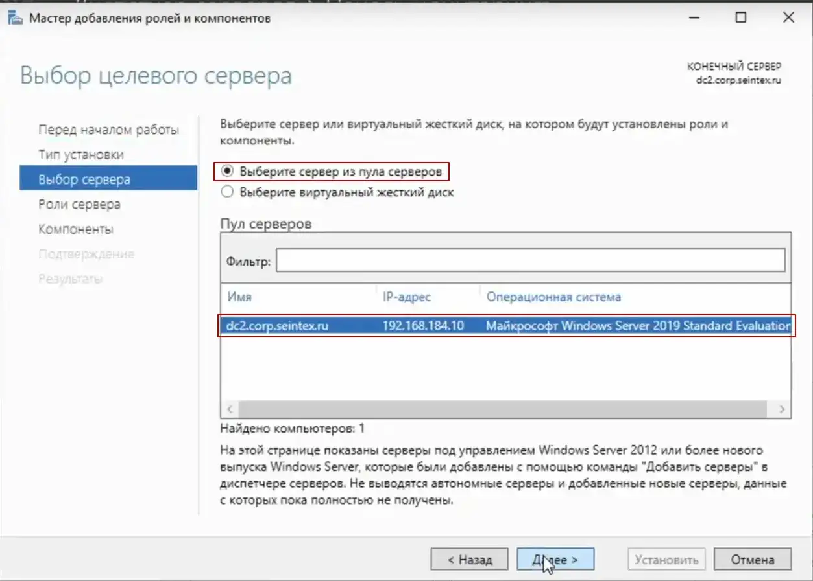

In the list for selecting components to install, check for the presence of the **RAS Connection Administration Package (SMAC)**:


**Next**, go to the **Connection Manager Administration Package**:


The **Connection Manager Administration Wizard** opens:


Next, following the instructions of the wizard, we select options for our task, choosing for which OS family the package will be created.

> It is important to create a SMAK package on an OS of the same bit depth as the end user's system


The package is being created for the first time, so select **New Profile**:


Next, enter the **Service Name** and **File Name**, for example, vpn:


We do not add the sphere name (this is the domain name):


There are no other profiles, so there’s nothing to combine with yet:


Next, you need to specify the IP address of the VPN server, in our case this is the external address of our router `198.51.100.254/24`:

We indicate it in the **Name or IP address of VPN server** field:


At the **Create or edit VPN entry** step, you need to configure TCP-IP properties, default route, etc.:


Click the change button, we can disable the use of IPv6:
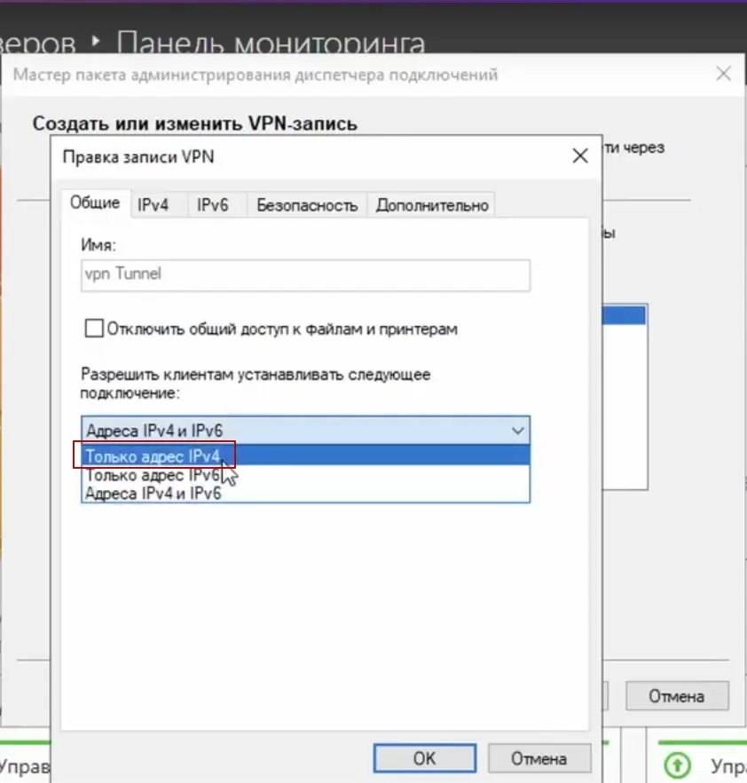

On the IPv4 tab, disable the use of a VPN connection as the default gateway, so that only the traffic we need passes through the VPN, the **IP header compression can be left on** option:


On the **Security** tab, we must specify the protocol, for example L2TP:


For it you also need to specify **Use a shared key** in the **Advanced parameters**:


Next, we use the EAP-MSCHAPv2 verification methods:


To confirm the settings, click **OK** and when the wizard warns, also click **Yes**:


Next, we indicate the **Shared Key for IPSec**, to increase security, you can also specify a PIN code so that no one recognizes our **Shared Key**:


In the next steps of the wizard, you can specify the phone book number update server; we don’t need this for now:


We also skip adding the specified phone book:


In the remote network access entries, we disable insecure protocols; to do this, click edit:


And on the **Security** tab, uncheck the **Password Verification Protocol (CHAP)** checkbox:


Adding a route is done by adding a local file (1); for a large network, routes can be added by specifying a link to a file on the server (2):


An example of the `route.txt` file:


After specifying the file with the route, click **Next**:


In the next step, you can specify proxy settings; leave everything unchanged:


Additional actions are also not required:


The functionality of the **Connection Manager Administration Pack Wizard** allows you to add your own picture for the connection window:


For phone book:


Show support information, such as contact information:


Upload a file with the text of the license agreement:


Add files that can be installed with the connection manager:


Before assembling the program, you can make additional changes to the files included in the connection profile, but leave everything unchanged:


After clicking the **Next** button, we get the finished SMAC file, which is located at:


We will transfer the **vpn.exe** file to the remote client’s computer, for example, via Google disk:

**VPN Client**

When you run this file on a Windows client, it displays a warning about an unknown publisher, click Run anyway:

---

### Site to Site VPN


The **Routing and RAS** console opens, which has not changed since Windows Server 2008.


Right-click on the server and select **Configure and activate routing and RAS**.


Click on **Next** in the setup wizard


In the next step you have to specify more precisely which scenario you want to set up. Next, I choose the **Custom Configuration** because **RAS (Dial-up or VPN)** expects certain requirements that we do not need.


In the next step, select **VPN access**

Confirm the message to start the service.

Afterwards, the VPN protocols can be configured.

Assigning rights for users

It is also important that the users have the necessary rights for remote access.


### SSTP VPN with Let’s Encrypt certificates

Advertisements

SSTP requires an SSL certificate accepted by the client. If you have an internal certificate authority, you can use this. The only thing that must be ensured is that the client can also reach the blacklist on the Internet. Many fail with this requirement. So why not use another certificate, for example a free one from Let’s encrypt.

This article requires a Microsoft Windows Routing and RAS Server with configured SSTP VPN. If you don’t have it installed yet, I recommend you have a look at the article: VPN Server with Windows Server 2022.

Installing Let’s Encrypt certificates

To control Let’s Encrypt I use the appropriate PowerShell module [Posh-ACME](https://github.com/rmbolger/Posh-ACME/). The easiest way to install it is via the PowerShell Gallery. To do this, execute the following commands in a PowerShell session with administrative privileges:

```powershell
Install-PackageProvider -Name NuGet -Force
```
```powershell
Install-Module -Name Posh-ACME -Scope AllUsers
```
Now the certificate is requested. During this process, a corresponding check entry must be entered in the DNS. The required entry is displayed by the PowerShell script. So make sure you have access to the configuration of the DNS zone you want to use. And watch out for typos. Also remember that changes in the DNS sometimes take a little longer, so better have a coffee after the change. The commands are:

```powershell
Set-PAServer LE_Prod
```
```powershell
New-PACertificate -Domain "vpn.mydomain.com" -Contact "mail@mydomain.com" -CertKeyLength ec-256 -AcceptTOS -Install
```
> Now you can also see the corresponding certificate in the certificate management for computers. As usual with Let’s Encrypt, the duration is only 3 months.


To make sure that the VPN server uses the right certificate, we need some PowerShell again:
```powershell
$cert = Get-ChildItem -Path Cert:\LocalMachine\My | Where-Object {$_.Subject -match "vpn.mydomain.com"}
Import-Module RemoteAccess
Stop-Service RemoteAccess
Set-RemoteAccess -SslCertificate $cert
Start-Service RemoteAccess
```
Renewing Certificates
The renewal can be done easily with the command “Submit-Renewal”, but only 5 weeks before expiration. But also here the configuration for the certificate assignment has to be done again. The background is that Let Encrypt issues new certificates instead of renewing the existing ones

The script to be created must be executed as a scheduled task in the same user context (including administrative rights!) as the request. Otherwise, the ACME profile with the required information is missing. A sample script could look like this:

```powershell
Import-Module RemoteAccess
Stop-Service RemoteAccess
Submit-Renewal
$cert = Get-ChildItem -Path Cert:\LocalMachine\My | Where-Object {$_.Subject -match "vpn.mydomain.com" -and $_.NotBefore -lt $(Get-Date) -and $_.NotAfter -gt $(Get-Date) }
Set-RemoteAccess -SslCertificate $cert
Start-Service RemoteAccess
```


## Network Policy Server (NPS) 

is Microsoft’s application for enforcing company-wide access policies through a Remote Authentication Dial-In User Service (RADIUS) server and comes with centralized authentication, authorization and accounting abilities.


## Radius 

**RADIUS** (Remote Authentication in Dial-In User Service) is a network protocol that provides centralized management of authentication, authorization, and accounting (AAA), and designed to exchange of information between a central platform and client devices. RADIUS server can communicate with a central server for example, Active Directory domain controller) to authenticate remote dial-in clients and authorize them to access specific network services or resources.

The **Network Policy Server (NPS)** role implements the RADIUS server function in the Windows environment and allows you to authenticate remote clients against Active Directory. In this article, we’ll show how to configure a RADIUS server on Windows Server 2022/2019/2016, and how to configure RADIUS authentication on Cisco and MikroTic network devices (RADIUS clients) under AD user accounts.

### Install the RADIUS Server Role

So first I will install the **Network Policy and Access Services (NPAS)** server role either on a domain controller or member server.


### Configure Firewall
Open **Windows Defender Firewall with Advanced Security** and create a New rule for the incoming port **1812** and **1813**:


### Configure RADIUS server

Open the **Network Policy Server** console and select the **RADIUS server for 802.1X Wireless or Wired Connections** template to configure **NPS** by using the **wizard**.


Note: Also, you can install NPS role and management tools from an elevated PowerShell console:
```
Install-WindowsFeature NPAS –IncludeManagementTools
```

Check if the NPAS role is installed on your Windows Server host:
```
Get-WindowsFeature -Name NPAS
```

After the role installation is completed, open the Network Policy Server (nps.msc) in the Tools menu.


Right-click on a root node of the NPS console and click **Register server in Active Directory**.
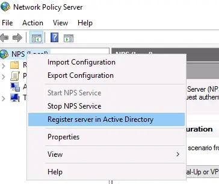

Confirm the new NPS server registration in Active Directory.


Also, you can register your NPS server in Active Directory with a command:
```
netsh ras add registeredserver
```
The AD machine account on the NPS server is given permission to read the properties Active Directory user accounts to authenticate users. Your NPS host computer account will be added to the built-in domain group **RAS and IAS Servers**.


Next, create a new security group in the Active Directory domain (for example, ***RemoteCiscoUsers***) and add all users who will be allowed to authenticate on Cisco routers and switches to this group.

The next step is to add the Radius client. Radius client is the device from which your server can receive authentication requests. This could be a Cisco router, switch, Wi-Fi access point, etc.

Expand the **RADIUS Clients and Servers** > **RADIUS Clients**, select **New**.

On the Settings tab, fill the fields **Friendly name**, client **Address** (you can specify IP address or DNS name), and **Shared Secret + Confirm shared** password (you will use this password in the configuration of the Cisco switch/router).

> **Note.** The shared secret password is rarely used in large corporate networks due to the problems with the distribution of shared secrets. It is recommended to use certificates instead of shared passwords. If you have a corporate Certification Authority (CA) deployed to implement PKI infrastructure, you can request a *.p12 certificate for the Radius/NPS server. Just import the certificate to the personal certification store of the Local Machine.


In the **Advanced** tab, select Vendor name – **Cisco**.


You can use the PowerShell command instead of the NPS GUI to add a new RADIUS client. In this case, you can use the **New-NpsRadiusClient** PowerShell cmdlet:
```
New-NpsRadiusClient –Address "192.168.31.1" –Name "cisco2960" –SharedSecret "Zb+kp^JUy]v\ePb-h.Q*d=weya2AY?hn+npRRp[/J7d"
```
> **Note**. On Windows Server Datacenter edition you can add RADIUS clients to NPS by IP address range. This allows to add a large number of RADIUS clients (such as wireless access points) rather than adding them individually. You can specify the IP range using the format 10.1.0.0/22.

By default, NPS uses the following UDP ports to send and receive RADIUS traffic: 1812, 1813, 1645, and 1646. When you install the NPS role on Windows Server, rules for these ports are automatically created and enabled in Windows Defender Firewall. You can list these Windows Firewall rules using PowerShell:
```
Get-NetFirewallRule -DisplayGroup "Network Policy Server"
```
If your RADIUS client is located in a DMZ network or an external security perimeter, you must create the appropriate firewall rules on your network firewall.

### Configure NPS Policies on the RADIUS Server

NPS policies allow you to authenticate remote users and grant them access permissions configured in the NPS role. NPS access policies allow you to associate the RADIUS client to the domain security group that determines the user privileges on CISCO devices.

There are two types of policy on a RADIUS server:

- **Connection request policies** — determine which RADIUS servers should authenticate and authorize connection requests received from RADIUS clients;

- **Network policies** — allow you to specify who is authorized to connect to your network and a list of assigned privileges.

In our case, we will use only the NPS Network policies. Expand the **Policies > Network Policies** branch and select New:


Specify the Policy name, the type of network access server should remain unchanged (Unspecified).


In the **Specify conditions** step, you need to add the conditions under which this RADIUS policy will be applied. Let’s add two conditions — the authorized user must be a member of a specific domain security group, and the device you want to access has a specific name. Use the **Add** option to create a new condition by selecting the **Windows Group** type (add the RemoteCiscoUsers group) and specifying the **Client Friendly Name** (Cisco_*).

> Note. The Client Friendly Name field may differ from the DNS name of your device. We will need it in the further steps to identify a specific network device when creating a Remote Access Policy. For example, you can use this name to specify a mask through which several different RADIUS clients are processed by a single access policy.


On the next screen, select **Access Granted**.


My Cisco switch only supports Unencrypted authentication methods (PAP, SPAP), so I’ve disabled all other options.


Skip the next configuration Constraints step.

In the **Configure Settings** section, go to the **RADIUS Attributes > Standard** section. Delete the existing attributes there and click the **Add** button.

Select **Access type** > All, then **Service-Type** > Add. Specify **Others** = Login.


Now add a new attribute in the RADIUS Attributes > Vendor Specific section. Under Vendor, select Cisco, and click Add. Here you need to add information about the attribute. Click Add and specify the following value:
```
shell: priv-lvl = 15
```
This value means that the user authorized by this policy will be granted a maximum (15) administrative access privileges on the Cisco device.


The last screen displays all selected NPS policy settings. Click Finish.


If you have created several network policies in the NPS console, please note that they are processed from top to bottom, so the order of the policies is important. Further processing will stop if all conditions in the next policy are met. You can change the priority of policies in the NPS console using the Processing Order value.


By default, all AD accounts can be used to authenticate using RADIUS. You can check this using the Active Directory Users and Computers snap-in (dsa.msc). Open any user properties, go to the Dial-In tab, and check that the **Control access through NPS Network Policy** option in enabled in the **Network Access Permission** section.


Or you can reset msNPAllowDialin attribute for all users in the specific Active Directory OU using the LDAP filter:
```
Get-ADUser -SearchBase "ou=Users,ou=Paris,dc=theitbros,dc=com" -LDAPFilter "(msNPAllowDialin=*)" | % {Set-ADUser $_ -Clear msNPAllowDialin}
```

### Radius Proxy

**RADIUS Server Groups**

A RADIUS server group is a group of RADIUS servers that are similar. When you configure a device as a RADIUS proxy to forward connection requests to RADIUS servers, process the requests, authenticate and authorize the users or computer accounts located in the database, it allows you to group existing server hosts that have different operational characteristics.

When multiple RADIUS servers exist in your network, you can configure RADIUS clients to either use a primary RADIUS server or an alternate RADIUS server. This means that, if the primary RADIUS server becomes unavailable, the request is sent to the alternate RADIUS server.


**Configuring RADIUS Servers for a group**

A remote RADIUS server group, as the name suggests, contains one or more RADIUS servers. To configure more than one server, it is important to specify the load balancing settings of each RADIUS Server. This is to avoid one or more servers getting overloaded with too many connection requests. The solution is to decide the order in which the servers are used by the proxy or by allotting the flow of RADIUS messages across all servers in the group.

In some cases, RADIUS Server groups comprise of multiple host entries for the same server. Under such circumstances, each host entry would have a unique name/address. The unique identifier can be the combination of an IP address or a name resolved to the IP address, such as a UDP port number.

The unique identifier authorizes different UDP ports, providing a specific AAA service, and allows RADIUS requests to be sent to different UDP ports on a server at the same IP address


**Adding a new remote RADIUS server group in Windows NPS Server**

When the NPS is configured as a RADIUS proxy, a new connection request policy is created. The NPS uses this policy to determine which connection requests need to be forwarded to other RADIUS servers. The NPS also uses this policy to specify the precise remote RADIUS server group where the connection requests that match the connection request policy need to be sent and to decide which RADIUS servers will perform the authentication and authorization of connection requests that the NPS server receives from RADIUS clients.


- Login to your Windows Radius Server and click on the **Server Manager**. On the Server Manager tab, click **Tools** and select **Network Policy Server**. Then click **Network Policy Server**. The NPS console opens.

- Expand the NPS console tree, select **RADIUS Clients and Servers** and double-click. You’ll be moved to the **Remote RADIUS Server Groups** where you should right-click, and then click **New**.

- On the New Remote RADIUS Server Group dialog box **type in the name** assigned for the **remote RADIUS server group**.

- In **RADIUS Servers**, click **Add**. The Add RADIUS Servers dialog box opens. Type the **IP address** of the **RADIUS server** that you **want to add** to the group, or type the **Fully Qualified Domain Name (FQDN)** of the RADIUS server, and then click **Verify**.

- In the Add **RADIUS Servers, click the Authentication/Accounting tab**. In **Shared secret** and **Confirm shared secret**, type the shared secret. Make sure to **use the same shared secret** when you configure the local computer as a **RADIUS client** on the remote RADIUS server.

- Please note that **EAP** uses the **Message-Authenticator attribute** by default. So, in case you are not using Extensible Authentication Protocol (EAP) for authentication, click **Request** must contain the message authenticator attribute.

- **Check** the authentication and accounting **port** numbers and see whether they are correct.

- In case the shared secret for accounting is different, go to the **Accounting tab** and clear the Use the same shared secret for authentication and accounting check box. Then type the accounting shared secret in **Shared secret** and **Confirm shared secret**.

- If you do not want to forward network access server start and stop messages to the remote RADIUS server, clear the **Forward network access server start and stop notifications** to this server **check box**.

- Select the **Load Balancing** tab.

- Specify how often requests are sent to a specific server in a group by specifying the **weight assigned** to the server.

- Click **OK** to close the Add RADIUS Server dialog box.

- Click **OK** to close the New Remote RADIUS Server group.


## ISATAP

‘ISATAP (Intra-Site Automatic Tunnel Addressing Protocol) is an IPv6 transition mechanism that allows IPv6-in-IPv4 tunnels to be created automatically within a site. Each host queries an ISATAP router within the site to obtain the address and routing information. Packets sent to the IPv6 Internet are routed via the ISATAP router, and packets destined for other hosts within the same site are tunneled directly to the destination.’ - IEEE, ‘The implementation of ISATAP router’


View interfaces
```
Get-NetIPInterface
```
Name of index 11 interface of isatap and enable
```
Get-NetIPInterface -InterfaceIndex 11 -AddressFamily IPv6 -Forwarding enabled -Advertising enabled
```

```
new-NetRoute -DestinationPrefix 2001:db8:6783:f00d::/64 interfaceIndex 11 AddressFamily IPv6 -Publish Yes
```

```
Set-NetIsatapConfiguration -Router 10.2.2.102
```

***ISATAP For Client**

Test connection 
```
Test-NetConnection 2001:db8:6783:f00d:0:5efe:10.2.2.102
```

set gateway route server
```
Set-NetIsatapConfiguration -route 10.2.2.102
```
get status of isatap if status default its not enabled
```
Get-NetIsatapConfiguration
```
enable istap command
```cmd
netsh
```
```cmd
inteface
```
```cmd
isatap
```
```
set state enabled
```

---

## Teredo Tunnels

### How to Enable Teredo in Windows
Enable Teredo in Windows 10 and 11

Windows 10 version 1803 and later disable Teredo by default, so we need to enable it in order to get IPv6 behind NAT using Teredo.

Choose Teredo server

Teredo servers:
iks-jena.de: `teredo.iks-jena.de`

August Internet: `teredo.august.tw`

Microsoft servers:

These servers allow only to connect to other Teredo addresses on the same server for the purpose of NAT traversal.

`win10.ipv6.microsoft.com`

`win1910.ipv6.microsoft.com`

Open an elevated command prompt.

- Type `netsh interface teredo show state` to show the status of Teredo tunnel.

- Type `netsh interface teredo set state client example.com` replacing example.com with your chosen Teredo server.

- Type `netsh interface teredo show state` to show the status of Teredo tunnel.
  - If state says offline and error says “client is in a managed network”, type `netsh interface teredo set state enterpriseclient`.

  - If state says dormant, Teredo has been enabled.

- Try to ping an IPv6 server or use test-ipv6.com.

- Type `netsh interface teredo show state` to show the status of Teredo tunnel. If state says qualified, then your Teredo tunnel is working.


On client

Press **Windows key + R** to open **Run** dialog.

Type `hdwwiz.cpl`, and then press **Enter** to open **Device Manager**.
Click on **Network Adapters** from the list.

Click on **Actions** tab at the top.

Select **Add Legacy Hardware**.

Click on **Next** button.

**Make sure that Search for and install the hardware automatically (Recommended)** option is selected, and then click on **Next** button.

Click on **Next** button again.

Under Common hardware types selection, look for **Network Adapters** and click on it.

Click on **Next** button.

Under **Manufacturer** column, select **Microsoft**.

Under **Network Adapter** column, select **Microsoft Teredo Tunneling Adapter**

Click on **Next** button.

Click on **Next** button again.

Click on **Finish**.


```
netsh
int  teredo
set  state  disabled
int  ipv6
set  teredo  client
exit
```

## 6to4 Tunnels


## Distributed File System (DFS) Namespace

```
Get-WindowsFeature -Computername srv2016 FS-DFS*
```
connect to remote server and install dfs
```
invoke-Command -ComputerName srv2016 -command (Install-WindowsFeature FS-DFS-Namespace -IncludeManagementTools)
```
connect to remote server and install dfs
```
invoke-Command -ComputerName srv2016-2 srv2016-3 -command {Install-WindowsFeature FS-DFS-Replication}
```
---

## What Is DFS and How It Works

A Distributed File System (DFS) is a logical organization that transparently groups existing file shares on multiple servers into a structured hierarchy. This hierarchy can be accessed using a single share on a DFS server.

A DFS file share can be replicated across multiple file servers in different locations to optimize server load and increase access speed to shared files. In this case, a user can access a file share on a server that is closest to them. DFS is intended to simplify access to shared files.


DFS uses the Server Message Block (SMB) protocol, which is also known as the Common Internet File System (CIFS). Microsoft’s implementation of DFS doesn’t work with other file sharing protocols like NFS or HDFS. However, you can connect multiple SMB shares configured on NAS devices and Linux machines using Samba to your DFS server running on Windows Server. DFS consists of server and client components.

You can configure one DFS share that includes multiple file shares and connect users to this single file share using a unified namespace. When users connect to this file share using a single path, they see a tree structure of shared folders (as they are subfolders of the main share) and can access all needed file shares transparently. Underlying physical file servers hosting file shares are abstracted from the namespace used to access shares. DFS namespaces and DFS replication are the two main components used for DFS functioning.

### What is a DFS namespace?

A DFS namespace is a virtual folder that contains links to shared folders stored on different file servers. DFS namespaces can be organized in different ways depending on business needs. They can be organized by geographical location, organization units, a combination of multiple parameters, etc. You can configure multiple namespaces on a DFS server. A DFS namespace can be standalone or domain-based.


A **standalone DFS namespace** stores configuration information and metadata locally on a root server in the system registry. A path to access the root namespace is started with the root server name. A standalone DFS namespace is located only on one server and is not fault-tolerant. If a root server is unavailable, the entire DFS namespace is unavailable. You can use this option if you don’t have an Active Directory domain configured (when using a Workgroup).

A **domain-based DFS namespace** stores configuration in Active Directory. A path to access a root namespace starts with the domain name. You can store a domain-based DFS namespace on multiple servers to increase the namespace availability. This approach allows you to provide fault tolerance and load balancing across servers. Using domain-based DFS namespaces is recommended.

A namespace consists of the root, links (folders), and folder targets.

- A **namespace root** is a starting point of a DFS namespace tree. Depending on the type, a namespace can look like this:

***\\\ServerName\RootName*** (a standalone namespace)

***\\\DomainName\RootName*** (a domain-based namespace)

- A **namespace** server is a physical server (or a VM) that hosts a DFS namespace. A namespace server can be a regular server with the DFS role installed or a domain controller.

- A **folder** is a link in a DFS namespace that points to a target folder containing content for user access. There are also folders without targets used for organizing the structure.

- A **folder target** is a link to a shared file resource located on a particular file server and available via the UNC path (Universal Naming Convention). A folder target is associated with the folder in a DFS namespace, for example, \\FS2\TestShare on the FS2 server. A folder target is what users need to access files.

One folder target can be a link to a single folder or multiple folders (if these folders are located on two different servers and are synchronized/replicated with each other). For example, a user needs to access \\DFS-server01\TestShare\Doc but depending on the user’s location, the user is redirected to a shared folder \\FS01\Doc or \\FS02\Doc.

The DFS tree structure includes the following components:

- DFS root, which is a DFS server on which the DFS service is running

- DFS links, which are links pointing to network shares used in DFS

- DFS targets, which are real network shares to which DFS links point

What is DFS replication?

**DFS replication** is a feature used to duplicate existing data by replicating copies of that data to multiple locations. Physical file shares can be synchronized with each other at two or more locations.

An important feature of DFS replication is that the replication of a file starts only after that file has been closed. For this reason, DFS replication is not suitable for replicating databases, given that databases have files opened during the operation of a database management system. DFS replication supports multi-master replication technology, and any member of a replication group can change data that is then replicated.

A **DFS replication group** is a group of servers participating in the replication of one or multiple replication folders. A replicated folder is synchronized between all members of the replication group.


DFS replication uses a special Remote Differential Compression algorithm that allows DFS to detect changes and copy only changed blocks of files instead of copying all data. This approach allows you to save time and reduce replication traffic over the network.

DFS replication is performed asynchronously. There can be a delay between writing changes to the source location and replicating those changes to the target location.


**DFS Replication topologies***

There are two main DFS replication topologies:

- **Hub and spoke**. This topology requires at least three replication members: one which acts as a hub and two others act as spokes. This technique is useful if you have a central source originating data (hub) and you need to replicate this data to multiple locations (spokes).

- **Full mesh**. Each member of a replication group replicates data to each group member. Use this technique if you have 10 members or less in a replication group.

**What are the requirements for DFS?**

The main requirement is using Windows Server 2008 DataCenter or Enterprise editions, Windows Server 2012, or a newer Windows Server version. It is better to use Windows Server 2016 or Windows Server 2019 nowadays.

NTFS must be a file system to store shared files on Windows Server hosts.

If you use domain-based namespaces, all servers of a DFS replication group must belong to one Active Directory forest.

**How to Set Up DFS in Your Windows Environment**

You need to prepare at least two servers. In this example, we use two machines running Windows Server 2019, one of which is an Active Directory domain controller:

- Server01-dc.domain1.local is a domain controller.

- Server02.domain1.local is a domain member.

This is because configuring DFS in a domain environment has advantages compared to Workgroup, as explained above. The domain name is domain1.local in our case. If you use a domain, don’t forget to configure Active Directory backup.

Enable the DFS roles

First of all, you need to enable the DFS roles in Windows Server 2019.

1. Open **Server Manager**.

2. Click **Add Roles and Features** in Server Manager.

3. Select **Role-based or featured-based installation** in the Installation type screen of the Add Roles and Features wizard

4. In the Server Selection screen, make sure your current server (which is a domain controller in our case) is selected. Click **Next** at each step of the wizard to continue.

5. Select server roles. Select **DFS Namespaces** and **DFS Replication**, as explained in the screenshot below.


6. In the Features screen, you can leave settings as is.

7. Check your configuration in the confirmation screen and if everything is correct, click **Install**.

8. Wait for a while until the installation process is finished and then close the window.

### DFS Namespace Setup

Create at least one shared folder on any server that is a domain member. In this example, we create a shared folder on our domain controller. The folder name is shared01 (D:\DATA\shared01).

**Creating a shared folder**

1. Right-click a folder and, in the context menu, hit **Properties**.

2. On the Sharing tab of the folder properties window, click **Share**.

3. Share the folder with Domain users and set permissions. We use Read/Write permissions in this example.

4. Click **Share** to finish. Then you can close the network sharing options window.


Now the share is available at this address:

\\\server01-dc\shared01

**Creating a DFS namespace**

Let’s create a DFS namespace to link shared folders in a namespace.

Press **Win+R** and run `dfsmgmt.msc` to open the DFS Management window. You can also run this command in the Windows command line (CMD).

As an alternative, you can click **Start > Windows Administrative Tools > DFS Management**.

- In the DFS Management section, click **New Namespace**.


- The New Namespace Wizard opens in a new window.

1. **Namespace Server**. Enter a server name. If you are not sure that the name is correct, click **Browse**, enter a server name and click Check **Names**. In this example, we enter the name of our domain controller (server01-dc). Click **Next** at each step of the wizard to continue.


2. **Namespace Name and Settings**. Enter a name for a namespace, for example, DFS-01. Click **Edit Settings**.


Pay attention to the local path of a shared folder. Change this path if needed. We use the default path in our example (C:\DFSRoots\DFS-01).

3. You need to configure access permissions for network users. Click **Use custom permissions** and hit **Customize**.


4. We grant all permissions for domain users (Full Control). Click **Add**, select **Domain Users**, select the appropriate checkboxes, and hit **OK** to save settings.


5. **Namespace type**. Select the type of namespace to create. We select **Domain-based namespace** and select the **Enable Windows Server 2008** mode checkbox. Select this checkbox if the functional level of your domain is Windows Server 2008 when you use Windows Server 2016 or Windows Server 2019 for better compatibility.

It is recommended that you use a Domain-based namespace due to advantages such as high DFS namespace availability by using multiple namespace servers and transferring namespaces to other servers.


6. **Review Settings**. Review settings and, if everything is correct, click **Create**.


7. **Confirmation**. The window view in case of success is displayed in the screenshot below. The namespace creation has finished. Click **Close**


**Adding a new folder to a namespace**

Now we need to add a new folder into the existing namespace. We are adding a folder on the same server, which is a domain controller, but this method is applicable for all servers within a domain.

1. Open the DFS management window by running `dfsmgmt.msc` as we did before. Perform the following actions in the DFS management window.

2. In the left pane, expand a namespace tree and select a namespace (\\domain1.local\DFS-01\ in our case).

3. In the right pane (the Actions pane), click **New Folder**.

4. In the New Folder window, enter a folder name, for example, Test-Folder to link the DFS folder and a shared folder created before. Click **Add**.


5. Enter the path to the existing folder. We use `\\server01-dc\shared01` in this example. You can click Browse and select a folder. Click **OK** to save the path to the folder target


The folder target has been added.

6. Click **OK** to save settings and close the New Folder window.


Now you can access the shared folder by entering the network address in the address bar of Windows Explorer:

\\\server01-dc\dfs-01\Test-Folder

You should enter a path in the format:

\\\DomainName\DFS-NameSpace\


### How to Configure DFS Replication

We need to configure the second server to replicate data. The name of the second server is Server02 and this server is added to the domain1.local domain in this example. Add your second server to a domain if you have not done this operation before.
Install the DFS roles, as we did for the first server. As an alternative method, you can use PowerShell instead of the Add Roles wizard. Run these two commands in PowerShell to install DFS replication and DFS namespace roles.

```
Install-WindowsFeature -name “FS-DFS-Replication” -IncludeManagementTools
```
```
Install-WindowsFeature -name “FS-DFS-Namespace” -IncludeManagementTools
```

First of all, we need to install the DFS Replication role on the second server.


Create a folder for replicated data, for example, D:\Replication

We are going to use this folder to replicate data from the first folder created on the first server before.

Share this folder (D:\Replication) on the second server and configure access permissions the same way as for the previous shared folder. In this example, we share the folder with Domain Users and grant Read/Write permissions.


The network path is \\server02\replication in this example after sharing this folder. To check the network path to the folder, you can right-click the folder name and open the Sharing tab.


Let’s go back to the domain controller (server01-dc) and open the DFS Management window.

In the left pane of the DFS Management window, expand the tree and select the namespace created before (Test-Folder in this case).

Click **Add Folder Target** in the Actions pane located in the top right corner of the window.

The New Folder Target window appears. Enter the network path of the folder that was created on the second server before:

\\\Server02\Replication

Click **OK** to save settings and close the window.


A notification message is displayed:

A replication group can be used to keep these folder targets synchronized. Do you want to create a replication group?

Click **Yes**.


Wait until the configuration process is finished.

As a result, you should see the Replicate Folder Wizard window. Perform the next steps in the wizard window.

Check the replication group name and replicated folder name. Click **Next** to continue.


Check folder paths in the Replication Eligibility screen.


Select the primary member from the drop-down list. In this example, the primary member is Server01-dc. Data from the primary member is replicated to other folders that are a part of the DFS namespace


Select the topology of connections for replication.

**Full mesh** is the recommended option when using a DFS replication group with less than ten servers. We use Full mesh to replicate changes made on one server to other servers.

The No Topology option can be used if you want to create a custom topology after finishing the wizard.

The Hub and spoke option is inactive (grayed out) because we use less than three servers.


Configure replication group schedule and bandwidth. There are two options:

- ***Replicate continuously using the specified bandwidth***. Replication is performed as soon as possible. You can allocate bandwidth. Continuous replication of data that changes extensively can consume a lot of network bandwidth. To avoid a negative impact on other processes using the network, you can limit bandwidth for DFS replication. Keep in mind that hard disk load can be high.

- ***Replicate during the specified days and times***. You can configure the schedule to perform DFS replication at the custom date and time. You can use this option if you don’t need to always have the last version of replicated data in target folders.

We select the first option in our example.


Review settings for your DFS replication group. If everything is correct, click **Create**.


View the DFS replication configuration status on the Confirmation screen. You should see the **Success** status for all tasks as displayed on the screenshot below. Click **Close** to close the wizard window.


A notification message about the replication delay is displayed. Read the message and hit **OK**.


DFS replication has been configured. Open a shared folder from which data must be replicated initially. Write a file to that network folder and check whether the new data is replicated to the second folder on another server. Don’t forget that opened files are not replicated until they are closed after saving changes to a disk. In a few moments, you should see a file-replica in the target folder.

### Using filters for DFS Replication

Use file filters to select the file types you don’t want to replicate. Some applications can create temporary files and replicating them wastes network bandwidth, loads hard disk drives, consumes additional storage space in the target folder, and increases overall time to replicate data. You can exclude the appropriate file types from DFS replication by using filters.

To configure filters, perform the following steps in the DFS Management window:

1. Expand the Replication tree in the navigation pane and select the needed DFS replication group folder name (domain1.local\dfs-01\Test-folder in our case).

2. Select the **Replicated Folders** tab.

3. Select the needed folder, right-click the folder name and hit **Properties**. Alternatively, you can select the folder and click Properties in the Actions pane

4. Set the filtered file types by using masks in the folder properties window. In this example, files matching the rule are excluded from replication:

~*, *.bak, *.tmp

You can also filter subfolders, for example, exclude Temp subfolders from DFS replication.

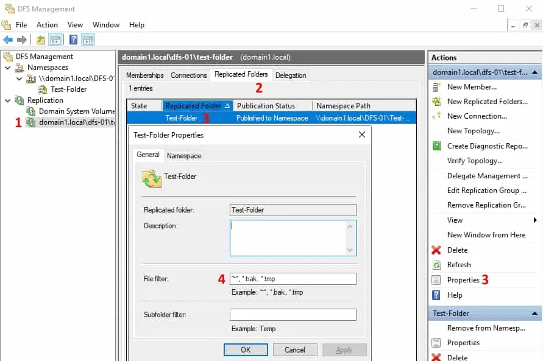

**Staging location**

There can be a conflict when two or more users save changes to a file before these changes are replicated. The most recent changes have precedence for replication. Older versions of changed files are moved to the Conflict or Deleted folder. This issue can happen when replication speed is low and the file size is large (amount of changes is high) when the amount of time to transfer changed data is lower than the interval between writing changes to the file by users.

Staging folders act as a cache for new and changed files that are ready to be replicated from source folders to target folders. The staging location is intended for files that exceed a certain file size. Staging is used as a queue to store files that must be replicated and ensure that changes can be replicated without worrying about changes to them during the transfer process.

Another aspect of configuring staging folders is performance optimization. DFS replication can consume additional CPU and disk resources, slow down and even stop if the staging quota is too small for your tasks. The recommended size of the staging quota is equal to the size of the 32 largest files in the replication folder.

You can edit staging folder properties for DFS Replication in the DFS Management window:

1. Select a replication group in the left pane of the DFS Management window.

2. Select the **Memberships** tab.

3. Select the needed replication folder, right-click the folder, and hit **Properties**.

4. Select the **Staging** tab in the Properties window.

5. Edit the staging path and quota according to your needs.


Saved changes are not applied immediately. New staging settings must be replicated across all DFS servers within a domain. Time depends on Active Directory Domain Services replication latency and the polling interval of servers (5 minutes or more). Server reboot is not required.

### DFS Replication vs. Backup
Don’t confuse DFS Replication of data in shared folders and data backup. DFS replication makes copies of data on different servers, but if unwanted changes are written to a file on one server, these changes are replicated to other servers. As a result, you don’t have a recovery point because the file has been overwritten with unwanted changes on all servers and you can use it for recovery in case of failure. This threat is present in case of a ransomware attack.


## BranchCache

The Branch offices have unique management challenges. The BranchCache is a WAN optimization technology that is built into Server 2016. It enables remote offices to access centralized file-shares, over the wide area network at faster speeds and using less bandwidth. This type of solution to remote office WAN optimization is collectivity known as “wide area files services” or WAFS solutions. They are traditionally expensive. so, it is great to have a solution included in the box with Windows Server. Therefore, the challenge is to provide efficient access to network resources for users in branch offices. BranchCache helps you overcome these problems by caching files so they do not have to be transferred repeatedly over the network. BranchCache improves the responsiveness of common network applications that access intranet servers across slow WAN links.


### How to Install and Configure BranchCache in Windows Server 2016


**Configure Domain Server to use Windows BranchCache**
1. On the **DC_SERVER01** server, open **Server Manager**, click **Add roles** and **features** and proceed installation until you reach Select server roles interface, click **File and Storage** Services and click **File and iSCSI Services** then select **BranchCache for Network File**, then proceed with **Next**


2. On the Select features interface, click **Next**


3. On the Confirm installation selections interface, click **Install**


4. Once the installation complete, click **Close**


5. Next, on the **Domain Server** open **Gpedit.msc**

#_# In the **Local Group Policy Editor console**, under **Computer Configuration**, expand **Administrative Templates**, expand **Network**, and then click **Lanman Server**.

#_# On the **Lanman Server** result pane, double-click **Hash Publication for BranchCache**


6. In the Hash Publication for BranchCache box, click **Enabled**, in the Hash **publication actions list**, select the **Allow hash publication only for shared folders on which BranchCache is enabled**, and then click **OK**


### Simulate a slow link to the branch office

1. Still in the **Local Group Policy Editor console** in Domain Server, in the navigation pane, under **Computer Configuration**, expand **Windows Settings**, right-click **Policy-based QoS**, and then click **Create new policy**


2. In the Policy-based QoS Wizard, on the Create a QoS policy interface, in the Policy name text box, type **Limit to 100 Kbps**, and then select the Specify Outbound Throttle Rate check box. In the Specify Outbound Throttle Rate text box, type **100**, and then click **Next**


3. On the This QoS policy applies to interface, click **Next**


4. On the Specify the source and destination IP addresses interface, click **Next**


5. On the Specify the protocol and port numbers interface, click **Finish and close Local Group Policy Editor console**


### Enable a File Share for BranchCache

1. On the Domain Server DC_Server01, **create 01 folder** called  **BC Head_Share**, and then **share this folder**


2. On the **BC Head_Share properties**, click **Advanced Sharing**


3. Click **Share this folder box**, and click **Caching**

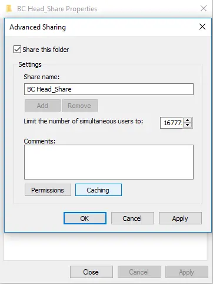

4. In the Offline Settings box, click **Enable BranchCache box**, and then click **OK**


5. On the Specify the protocol and port numbers interface, click **Finish and close Local Group Policy Editor console**


### Configure client firewall rules for BranchCache

1. In the Domain Server DC_Server01, open **Group Policy Management**, then right-click **Default Domain Policy**, and then click **Edit**


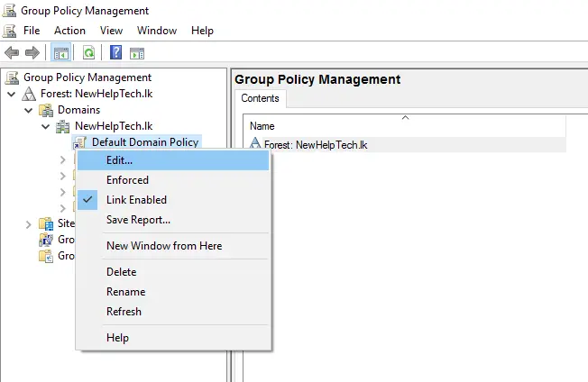


2. In the Group Policy Management Editor, under **Computer Configuration**, expand **Policies**, expand **Windows Settings**, expand **Security Settings**, and then expand **Windows Firewall with Advanced Security**

#_# extend Windows Firewall with Advanced Security, right-click **Inbound Rules**, and then click **New Rule**


3. In the New Inbound Rule Wizard, on the Rule Type page, click Predefined, click **BranchCache – Content Retrieval (Uses HTTP)**, and then click **Next** and Predefined Rules interface, click **Next**


4. On the Action page, click **Finish** to create the firewall **inbound rule**


5. Repeat the same step, and this time click **Predefined**, click **BranchCache – Peer Discovery (Uses WSD)**, and then click **Next** and proceed to **Finish**


6. Next, run `gpupdate /force` command to activate the policy

### Install BranchCache for Network Files role and the BranchCache feature on Member Server

1. On the **SUB_SERVER02** server, open **Server Manager**, click **Add roles and features** and proceed installation until you reach Select server roles interface, click **File and Storage Services** and click **File and iSCSI Services** then select **BranchCache for Network File**, then proceed with **Next**


2. On the Select features interface, click **BranchCache**, and then click **Next**


3. On the Confirm installation selections interface, click **Install**, and then click **Close**


4. Next, we need to start the BranchCache host server, in the **SUB_SERVER02** server open Windows PowerShell and type:
```
Enable-BCHostedServer -RegisterSCP
Get-BCStatus
```

5. Scroll down to the **DataCache section**, notice the **current active cache size** is **zero**


6. Lastly run the `gpupdate /force`


### Configure client PC to use BranchCache in hosted cache mode

1. On Domain Server **DC_SERVER01** open **Group Policy Management**, then right-click **NewHelptech.lk**, and then click **New Organizational Unit**


2. On the Select features interface, click **BranchCache**, and then click **Next**


3. Right-click the **HelpTech Branch OU** and click **Create a GPO in this domain, and link it here**


4. In the New GPO box, type **BranchCache**, and then click **OK**


5. Next, right-click the **BranchCache GPO** and click **Edit**


6. In the Group Policy Management Editor, under **Computer Configuration**, expand **Policies**, expand **Administrative Templates**, expand **Network**, and then click **BranchCache**

#_# in the Setting list, double click **BranchCache**


7. In the **Turn on BranchCache** box, click **Enabled**, and then click **OK**


8. In the BranchCache results pane, double-click **Enable Automatic Hosted Cache Discovery by Service Connection** and then click **Edit**


9. In the Enable Automatic Hosted Cache Discovery by Service Connection Point box, click **Enabled** and then click **OK**


10. In the BranchCache results pane, double-click Configure BranchCache for network files, and then click **Edit**


11. In the Configure BranchCache for network files box, click **Enabled**, in the Type the maximum round-trip network latency (milliseconds) after which caching begins text box, type **0**, and then click **OK**


“This setting is required to simulate access from a branch office and is not typically required”

12. Next, open **Active Directory Users and Computers**, and **move** any **clients PC** that you have in **Computer OU** to **HelpTech Branch OU**


13. Next, switch to Client PC, open CMD, and type
```
netsh branchcache show status all
```

#_# Verify that the BranchCache Current Status is Running. If the status is Stopped, restart the client machines.


14. Now lets the BranchCache, on the client PC, access to **\\DC_SERVER01\BC Head_Share folder**


15. **Copy** the whole file in the **BC Head_Share folder** and then **paste to your client PC desktop**


### Monitoring BranchCache

1. Switch to **SUB_SERVER02** Server and open **Performance Monitor**

#_# under Monitoring Tools, click **Performance Monitor**, then click the **Add icon**

#_# In the **Add Counters box**, under Select **counters from computer**, click **BranchCache**, click **Add**


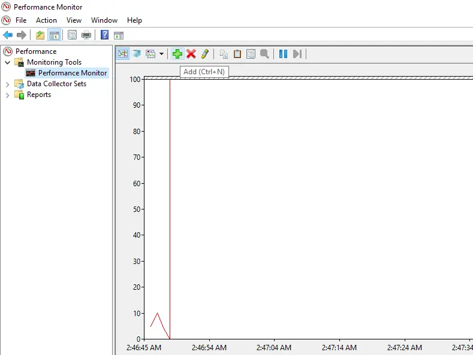


2. and then click **OK**


3. On the **Change Graph type button**, select **Report**


4. Switch to Client PC, and repeat the step previously for **Performance Monitor** & add **BranchCache**


---
```
Get-BCStatus
```
```
Enable-BCHostedServer -registerSCP
```
```
gpupdate /force
```

---

## NIC Teaming

NIC Teaming is disabled by default. If you want to enable it, you need to have at least two physical or virtual network cards. If you decide to enable NIC Teaming in guest operating systems using virtual network cards, some options will not be available.


In this article, I will show you which options are available and how to configure NIC Teaming in Windows Server 2022 using Server Manager.


### How to set up NIC Teaming

All your network cards need to be connected to the network and have a valid IP address.

1. Open **Server Manager**.

2. Select **Local Server**.

3. Under NIC Teaming, click **Disabled**.


1. Click Tasks and then **New Team**.


2. **Define the name** of the NIC Team and select the relevant network adapters.


Under **Additional properties**, you can configure **Teaming mode, Load balancing mode**, and **Standby adapter**.

There are three teaming modes available: Switch Independent, Static Teaming, and LACP. Both Static Teaming and LACP are switch dependen


- **Switch independent** mode doesn't require network cards that are members of NIC Teaming to be connected with the same switch. They may be attached to different switches; however, that doesn't matter in this case.

- **Switch dependent** mode requires all network cards that are members of NIC Teaming to be connected to the same switch. If you select this mode, it will offer you two operation modes, including:

  - **Static teaming** - This requires the same configuration on the host and switches to identify which links are from the NIC Teaming mode.
  
  - **Link Aggregation Control Protocol (LACP)** - This dynamically identifies the links between the host and the switch.

In addition, you can configure the load balancing mode and choose one of the three available options: **Address Hash**, **Hyper-V Port**, and **Dynamic**.


**Address Hash** mode helps to create a balance between network adapters that are members of NIC Teaming. It creates a hash based on the address component of the packet and then assigns the value to one of the adapters.

**Hyper-V Port** helps distribute traffic from switches to hosts on multiple links based on the MAC of the virtual machines.

**Dynamic** combines the address hash and Hyper-V port into a single mode. Outbound traffic is distributed based on a hash of TCP ports and IP addresses. Inbound traffic is distributed based on MAC.


You can combine different teaming modes with load-balancing modes.

Under the **Standby adapter**, you can choose whether you want to have all network cards active or put one of them in standby mode. Standby mode means that if one NIC fails, the second will take over network traffic.


1. Once configured, click **OK**.

2. Navigate to your **network sharing center**. You can do this by opening Run and typing ncpa.cpl. You will see that three network cards are joined to NIC Teaming. In my case, it's called 4sysops.


This NIC Team shares a single IP address.


## Switch Embedded Teaming (SET)

With the release of Windows Server 2016, Microsoft introduced a new type of teaming approach called Switch Embedded Teaming (SET) which is a virtualization-aware, how is that different from NIC Teaming, the first part is embedded into the Hyper-V virtual switch, which means a couple of things, the first one you don’t have any team interfaces anymore, you won’t be able to build anything extra on top of it, you can’t set a property on the team because it’s part of the virtual switch, you set all the properties directly on the vSwitch.

SET is targeted to support Software Defined Networking (SDN) switch capabilities, it’s not a general-purpose use everywhere teaming solution that NIC Teaming was intended to be. So this is specifically integrated with Packet Direct, Converged RDMA vNIC, and SDN-QoS. It’s only supported when using the SDN Extension. Packet Direct provides a high network traffic throughput and low-latency packet processing infrastructure.


**SET is compatible with:**

- Datacenter bridging (DCB).

- Hyper-V Network Virtualization – NV-GRE and VxLAN are both supported in Windows Server 2016 Technical Preview.

- Receive-side Checksum offloads (IPv4, IPv6, TCP) – These are supported if any of the SET team members support them.

- Remote Direct Memory Access (RDMA).

- SDN Quality of Service (QoS).

- Transmit-side Checksum offloads (IPv4, IPv6, TCP) – These are supported if all of the SET team members support them.

- Virtual Machine Queues (VMQ).

- Virtual Receive Side Scaling (RSS).

**SET is not compatible with:**

- 802.1X authentication.

- IPsec Task Offload (IPsecTO).

- QoS in the host or native OSs.

- Receive side coalescing (RSC).

- Receive side scaling (RSS).

- Single root I/O virtualization (SR-IOV).

- TCP Chimney Offload.

- Virtual Machine QoS (VM-QoS).

**SET Modes and Settings:**

- Switch independent teaming mode only.

- Dynamic and Hyper-V port mode load distributions only.

- Managed by SCVMM or PowerShell, no GUI.

- Only team’s identical ports (same manufacturer, same driver, same capabilities) (e.g., dual or quad-port NIC).

- The switch must be created in SET mode. (SET can’t be added to the existing switch; you cannot change it later).

- Up to eight physical NICs maximum into one or more software-based virtual network adapters.

- The use of SET is only supported in Hyper-V Virtual Switch in Windows Server 2016 or later releases. You cannot deploy SET in Windows Server 2012 R2.

How you turn on this new Switch, it’s very simple:
```
New-VMSwitch -Name SETswitch -NetAdapterName "Ethernet1","Ethernet2" -EnableEmbeddedTeaming $true
```
One tip, you do not necessarily need to specify **–EnableEmbeddedTeaming $true**, if the **–NetAdapter** parameter is followed by an array instead of a single NIC, it automatically creates the vSwitch and put it in embedded teaming mode. However, if the **–NetAdapter** parameter has a single NIC, you can then set it up and enable embedded teaming mode by including the flag and then later adding another NIC to it. It’s a one-time decision you want to make at the switch creation time.


In Windows Server 2012 R2, it was not possible to configure RDMA (Remote Direct Memory Access) on network adapters that are bound to a NIC Team or to a Hyper-V Virtual Switch. This increases the number of physical network adapters that are required to be installed in the Hyper-V host. In Windows Server 2016, you can use fewer network adapters and enable RDMA on network adapters that are bound to a Hyper-V Virtual Switch with or without Switch Embedded Teaming (SET).

The diagram below illustrates the software architecture changes between Windows Server 2012 R2 and Windows Server 2016:


The goal of moving to Windows Server 2016 is to cut the cost of networking in half, we now have the Hyper-V switch with embedded teaming, we are doing SMB with RDMA directly to a NIC that is bound to the Hyper-V switch, and is managed by the Hyper-V switch, by the way, you can have another channel from SMB to the other physical NIC (light green line in the diagram above), so they teamed the RDMA NICs which allow the sessions to be failover by SMB in the event if we lose a NIC. We will have multiple RDMA clients bound to the same NIC (Live Migration, Cluster, Management, etc.).

The Converged NIC with RDMA allows:

- Host vNICs to expose RDMA capabilities to kernel processes (e.g., SMB-Direct).

- Switch Embedded Teaming (SET), allows multiple RDMA NICs to expose RDMA to multiple vNICs (SMB Multichannel over SMB-Direct).

- Switch Embedded Teaming (SET), allows RDMA fail-over for SMB-Direct when two RDMA-capable vNICs are exposed.

- Operates at full speed with the same performance as native RDMA.

How you turn on RDMA on vNICs, it’s very simple with PowerShell:
```
Add-VMNetworkAdapter -SwitchName SETswitch -Name SMB_01
Add-VMNetworkAdapter -SwitchName SETswitch -Name SMB_02

Enable-NetAdapterRDMA "vEthernet (SMB_01)", "vEthernet (SMB_02)"

Get-NetadapterRdma
```
> As noted earlier, SET supports only switch-independent configuration by using either Dynamic or Hyper-V Port load-balancing algorithms. For best performance, Hyper-V Port is recommended for use on all NICs that operate at or above 10 Gbps.

### Deploy Switch Embedded Teaming with DSC

So without further ado, let’s jump into the demo.

We have here four Hyper-V nodes deployed up and running, but without any configuration yet:


If I query the Virtual Switch for each node, I don’t see any:


We will query all network adapters that are available on each host.

As you can see, each node has 3 NICs, one for Management and two RDMA NICs.


Next, I will install the custom DSC **cHyper-V** resource module on each node by running the following:
```
# Install cHyper-V Custom DSC Module on all Nodes

Invoke-Command HVNODE1,HVNODE2,HVNODE3,HVNODE4 -ScriptBlock {
Save-Module -Name cHyper-V -Path C:\
Install-Module -Name cHyper-V
}
```
Last but not least, I will push the DSC Configuration across all nodes and let the fun begins!
```
# Applying DSC Configuration
.\SET-NICTeaming.ps1 -targetNode HVNODE1,HVNODE2,HVNODE3,HVNODE4

# Credit to my fellow MVP - Ravikanth
# https://www.powershellgallery.com/packages/cHyper-V/
# PowerShell DSC Resources to Configure SET and NAT Switch in Windows Server 2016

Param
(
[String[]]$targetNode
)

Configuration SETSwitchTeam
{
# Importing the resource from custom DSC Module
Import-DscResource -ModuleName cHyper-V -Name cSwitchEmbeddedTeam

# List of Hyper-V Nodes which needs to be configured
node $targetNode
{
# Create Switch Embedded Team for given interfaces
     cSwitchEmbeddedTeam DemoSETteam
{
        Name = "SET-TEAM01"
        NetAdapterName = "RDMA_01","RDMA_02"
        AllowManagementOS = $false
        Ensure = "Present"
     }
} 
}

SETSwitchTeam

Start-DscConfiguration -Path SETSwitchTeam -Verbose -Wait -ComputerName $targetNode -credential $DomainCred -Force
```

And here you go:
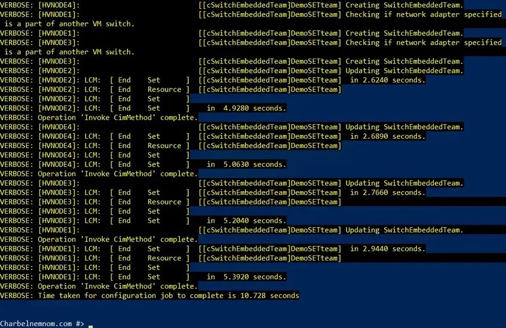


Let’s validate the new **SET-TEAM01** vSwitch gets created on all Hyper-V nodes using PowerShell:


### Deploying Switch Embedded Teaming on a VM

Open an elevated command (cmd) prompt window and type the following, this command will also restart the virtual machine.
```
# Install the Hyper-V role in silent mode
dism.exe /Online /Enable-feature /All /FeatureName:Microsoft-Hyper-V /FeatureName:Microsoft-Hyper-V-Management-PowerShell /quiet
```
Once the virtual machine is restarted, open PowerShell in administrative mode and run the following command:
```
# Create Switch Embedded Teaming (SET) on a VM
New-VMSwitch -Name "SET-VMSwitch" -NetAdapterName "Ethernet 2","Ethernet 3" -EnableEmbeddedTeaming $true
Get-VMSwitch | FL Name, EmbeddedTeamingEnabled, NetAdapterInterfaceDescriptions, SwitchType
```


---

## AD


### Installing and Configuring Active Directory – Windows Server 2016

This is a guide for installing Active Directory using Server Manger. To install Active Directory on Server Core, and/or install using PowerShell, please see Installing Active Directory with PowerShell – Windows Server Core 2016.

1. Open Server Manager

Open the Run box using Win+R, type servermanager.exe, and click

or

Search Server Manager in the Start Menu and click it


2. Choose either **Add Roles and Features** Option


3. Click **Next**


4. Click **Next**


5. Select the server

If installing to the local machine, simply click **Next**


6. Check **Active Directory Domain Services** and click **Next**


7. Click **Add Features**


8. Click **Next**


9. Click **Next**


10. Click **Install**


11. Wait for the install to finish and click **Promote this server to a domain controller**


12. Choose **Add a new forest**, enter a Domain Name, and Click **Next**

This is assuming that the server is not going to be part of a pre-existing domain and the new domain is not going to be added to a pre-existing forest


13. **Enter** a password for **DSRM** and click **Next**

Again, this is assuming that the server is a new, stand-alone, Domain Controller. If it will be joining a pre-existing forest and/or domain, the functional levels may need to be changed to match the function levels currently in place


14) Click **Next**

This is assuming you do not have existing DNS servers for which delegation may be required.


15. Click **Next**


16. Click **Next**


17. Click **Next**


18. Click **Next**


19. Wait for Install to Finish


20. The Active Directory and DNS roles are now installed

See Windows Administrative Tools to find the management applications


---

### Install on Windows Server Core

```
sconfig
```
Type 8 **Network Settings**

Type 1 **Select Network addapter**

Type 4 **Return to Menu**

Type 15 Exit to Command Line

Type **powershell** 

```
install-WindowsFeature -name ad-domain-services -IncludeManagemenTools
```
Install forest and add safe password
```
install-addsforest -domainname test.local
```
```
get-adforest
```
---
### What is Read-Only Domain Controller (RODC)?

A Read-Only Domain Controller (RODC) is a domain controller in the Windows Server environment that stores a read-only replica of the Active Directory database. Unlike a writable domain controller, an RODC does not allow any changes to the Active Directory database from that particular domain controller.

This limitation makes it an ideal choice for scenarios where security is a significant concern, such as remote offices, branch locations, or sites with lower physical security.

The main advantages of an RODC are:

- **Reduced Attack Surface**: Since the RODC is read-only, even if it is compromised, an attacker cannot make changes to the Active Directory database, minimizing the potential damage.

-**Credential Caching**: RODCs can cache credentials of previously authenticated users, which reduces the need for users to contact a writable domain controller for authentication, thus improving logon times.

- **Better Bandwidth Utilization**: An RODC can help optimize the replication traffic in locations with limited bandwidth since it only receives updates but doesn’t send them out.

### Method 1: Install Read-Only Domain Controller (Direct)

Installing the RODC using this method is performed by an administrator on the target server. The installation can be done using the Server Manager (GUI) and PowerShell.

#### Requirements

- The functional level of your domain is Windows Server 2008 or higher.

- The administrator who will install the RODC must be a member of the Domain Admins group.

- The target RODC server must meet the following:

- A configured computer name.

- Have a static IP address.
- Must be pointed to the nearest Read-Writable Domain Controller (RWDC) as its DNS server.

- Must be joined to the domain.

#### Using the Server Manager

In this section, we’ll install a read-only domain controller on a target server called **RODC1** using the Server Manager GUI.

1. Open the **Server Manager** on the target RODC server.

2. Click **Manage → Add Roles and Features.**


3. Select the **Role-based or feature-based installation** option, and click **Next**.


4. Select the target RODC server and click **Next**.


5. Check the **Active Directory Domain Services** role, click **Add Features** and **Next**.


6. Click **Next** on the following pages until you reach the **Confirmation** step.

7. Click **Install** and wait for the ADDS role installation to complete.


8. Once the ADDS installation is finished, click the **Promote this server to a domain controller** link.


9. Select the **Add a domain controller to an existing domain** option, select the correct domain, and click **Next**.


10. Check the **Read only domain controller (RODC)** option, type the **DSRM password**, and click **Next**.


11. Select the **Delegated administrator account** on the RODC options page. You can choose a user or group. In this example, I’m selecting a pre-created security group called **RODC Delegated Admins**. The members of this group will have **local administrator-equivalent** access to the RODC server.

Leave other fields as default and click **Next**.


12. Choose whether to replicate from a specific domain controller or any domain controller and click **Next**.


13. Customize or leave the default database, log files, and SYSVOL paths and click **Next**.


14. Review the RODC installation options and click **Next**.


15. When the prerequisites check has been completed and passed, click **Install**.


16. Wait for the installation to complete. Once the installation is finished, the server will reboot automatically.

17. Open the Active Directory Users and Computers console **(dsa.msc)**, navigate to the **Domain Controllers** container, and see the new RODC.


---
### Install Using PowerShell

In this section, we’ll install a read-only domain controller on a target server called `RODC2` using PowerShell.

1. Open PowerShell as an administrator on the target RODC server.

2. Run the following commands to install the Active Directory Domain Services role:

```
# Install AD DS Role
```
```
Import-Module ServerManager

Install-WindowsFeature AD-Domain-Services -IncludeManagementTools
```


Run the following script to promote the domain controller. This PowerShell script installs an Active Directory Domain Controller with specific configurations, such as making it a global catalog server, setting the appropriate paths for the AD database and log files, installing DNS, setting the Safe Mode Administrator Password, making it a Read-Only Replica, specifying the Active Directory site, and forcing the installation to proceed.
The script guides the user to enter the password for DSRM at the beginning for added security.
```
# Install the RODC
```
```
$DSRMPassword = Read-Host -AsSecureString -Prompt "Enter the DSRM Password"

Import-Module ADDSDeployment

Install-ADDSDomainController `

-NoGlobalCatalog:$false `

-CriticalReplicationOnly:$false `

-DatabasePath "C:\Windows\NTDS" `

-DelegatedAdministratorAccountName "THEITBROS\RODC Delegated Admins" `

-DomainName "theitbros.com" `

-InstallDns:$true `

-LogPath "C:\Windows\NTDS" `

-SafeModeAdministratorPassword $DSRMPassword `

-NoRebootOnCompletion:$false `

-ReadOnlyReplica:$true `

-SiteName "BRANCH-01" `

-SysvolPath "C:\Windows\SYSVOL" `

-Force:$true
```
1. **$DSRMPassword = Read-Host -AsSecureString -Prompt “Enter the DSRM Password"**
  - This line prompts the user to enter a password for Directory Services Restore Mode (DSRM), a special boot mode in Active Directory used for restoring or repairing the AD database. The **AsSecureString** parameter ensures that the password is securely stored as a SecureString object, a more secure way to handle sensitive data like passwords.

2. **Import-Module ADDSDeployment**
  - This line imports the ADDSDeployment module, which provides cmdlets (commands) related to deploying Active Directory.

3. **Install-ADDSDomainController**
  - This is the cmdlet used to install the Active Directory Domain Controller.

Now, let’s go through the various parameters used with the **Install-ADDSDomainController** cmdlet:

1. **NoGlobalCatalog:$false:** Specifies that this domain controller will be a global catalog server. The value **$false** indicates that it will be a global catalog; otherwise, $true would mean it won’t be a global catalog.

2. **CriticalReplicationOnly:$false:** Indicates whether the new domain controller should perform critical-only replication during the installation. Setting this to **$false** means the domain controller replicates all domain partition information.

3. **DatabasePath “C:\Windows\NTDS”:** Specifies the path where the Active Directory database will be stored on the new domain controller. The path provided here is **C:\Windows\NTDS**.


4. **DelegatedAdministratorAccountName “THEITBROS\RODC Delegated Admins”:** Sets the account name for the Delegated Administrator. This is usually used for Read-Only Domain Controllers (RODCs) to specify which group can administer them
Install from powershell cli

5. **DomainName “theitbros.com”:** Specifies the name of the domain for which the new domain controller will be installed.

6. **InstallDns:$true:** Specifies whether to install the DNS server role on the domain controller. Setting $true means DNS will be installed.

7. **LogPath “C:\Windows\NTDS”:** Specifies the path where the Active Directory log files will be stored. The path provided here is **C:\Windows\NTDS**.
 
8. **SafeModeAdministratorPassword $DSRMPassword:** Provides the password entered by the user at the beginning of the script for Directory Services Restore Mode.

9. **NoRebootOnCompletion:$false:** Specifies whether the domain controller should automatically restart after the installation is completed. Setting **$false** means it will not automatically reboot.

10. **ReadOnlyReplica:$true:** Indicates that the domain controller being installed is a Read-Only Replica. RODCs are used in branch offices and have limited functionality to enhance security.

11. **SiteName “BRANCH-01”:** Specifies the name of the Active Directory site where the new domain controller will be located.

12. **SysvolPath “C:\Windows\SYSVOL”:** Sets the path where the Sysvol folder (containing the domain’s public files like policies and scripts) will be stored. The path provided here is **C:\Windows\SYSVOL**.

13. **Force:$true:** Forces the installation even if there might be warnings or errors. Setting $true means the cmdlet will proceed regardless of any potential issues.

Once the installation is finished, the RODC server will restart automatically.

Run the following command in PowerShell to display the new RODC.
```
Get-ADDomainController <RODC SERVER> | Select-Object Hostname,IsReadOnly,IsGlobalCatalog,Site
```


---

### Method 2: Install Read-Only Domain Controller (Staged)

A staged RODC installation is useful when a Domain Admin must delegate the completion of the RODC deployment. This method is done in two stages.

#### Stage 1:

This step is typically done in the same location as the RWDC. The Domain Admin pre-creates the domain controller computer account, which includes:

- Specifying the RODC name and site.

- Adding delegated administrators who can deploy the RODC on the new server.
 
#### Stage 2 

The delegated administrator then installs the ADDS role and promotes it to a read-only domain controller. This method avoids assigning a highly privileged account to deploy the RODC.

#### Requirements

- The functional level of your domain is Windows Server 2008 or higher.

- The administrator who will pre-create the RODC computer account must be a Domain Administrator.

- A delegated user or group must be prepared prior to the RODC deployment.

- The target RODC server must meet the following:

- A configured computer name.

- Have a static IP address.

- Must be pointed to the nearest Read-Writable Domain Controller (RWDC) as its DNS server.

- Must NOT be joined to the domain.

#### Preparation: Allow computer account re-use during domain join (GPO)

Starting with the March 14, 2023 Security update, a security restriction disallows re-using an existing computer account. In a scenario when you deploy a pre-created RODC, you’ll get the following error.


> Reference: KB5020276—Netjoin: Domain join hardening changes

The solution is to update the domain controller GPO to allow your delegated admin user or group to re-use an existing computer account. Here’s how.

1. On the domain controller, open the Group Policy Management console.
```
gpmc.msc
```

2. Navigate to an existing GPO or create a new one. In this example, let’s create a new GPO.


3. Next, type the name of the new GPO and click OK. This example uses the GPO name **Allow Pre-Created RODC Computer Name Re-Use.**


4. Right-click the new GPO and click **Edit**.


5. Navigate to **Computer ConfigurationSettingsSettingsPoliciesOptions,** and double-click the **Domain controller: Allow computer account re-use during domain join** policy.


6. Check the **Define this policy** box, click Edit Security, and add the delegated user or group.

The policy is now defined. This means that the delegate user or group members are allowed to join existing computer accounts to the domain, such as the pre-created RODC.


7.Wait for the group policy update interval, or run **gpupdate /force** on the domain controllers.

8. Run the **gpresult /r** command on the domain controller and confirm that the policy has been applied.


#### Using the Server Manager (GUI)

In this example, we’ll install the read-only domain controller on a server named **RODC3** using the Server Manager GUI.


#### Stage 1: Pre-Create the RODC Account

1. Open the **Active Directory Users and Computers** console using your Domain Admin account.

2. Right click the **Domain Controllers** container and click the **Pre-create Read-only Domain Controller account** item.


3. Check the **Use advanced mode installation** box and click **Next**.


4. On the **Network Credentials** step, specify whether to use the current logged-on credentials or set alternate credentials for whom will install the ADDS role on the RODC. Let’s choose the **My current logged on credentials** option, assuming it is a domain admin.


5. Type the target RODC computer name and click **Next**. In this example, the server name is **RODC3**.


6. Select the AD Site for the new RODC and click **Next**.


7. In this example, the wizard calculated that the DNS server must be installed on the new server and make it a Global catalog. Leave the additional domain controller options as-is and click **Next**.


8. In this step, you can customize the password replication policy ACL. You can add or remove the users or groups whose passwords can be replicated to the new RODC.
The **BUILTIN** and **Denied RODC Password Replication Group** groups are blocked by default. While only the **AllowedRODC Password Replication Group** is allowed.
Let’s leave the password replication policy ACL as-is in this example and click **Next**.


9. In the **Delegation of RODC Installation and Administration**, set the user or group who will be delegated to install the RODC installation. In this example, I’m setting the **THEITBROSDelegated Admins** group I created previously.


10. Review the RODC installation options and click **Next**.


11. Lastly, click Finish.


12. Check back in the ADUC, and confirm that the new RODC has been added and is disabled.


#### Stage 2: Install the Read Only Domain Controller

In this stage, the delegated admin account can continue installing the ADDS role and promote the server as an RODC.

1. Log in to the target RODC server using a local account (because it is not yet joined to the domain).

2. Open PowerShell or CMD as an administrator and run the following command. This command ensures that the domain-join part of the RODC deployment succeeds.

```
reg add HKLM\System\CurrentControlSet\Control\Lsa /v NetJoinLegacyAccountReuse /t REG_DWORD /d 1 /f
```


3. Open the **Server Manager**, click **Manage → Add Roles and Features.**


4. Select the **Role-based or feature-based installation** option, and click **Next**.


5. Select the target RODC server and click **Next**.


6. Check the **Active Directory Domain Services** role, click Add Features and **Next**.


7. Click **Next** on the following pages until you reach the **Confirmation** step.

8. Click **Install** and wait for the ADDS role installation to complete.


9. Once the ADDS installation is finished, click the **Promote this server to a domain controller** link.


10. Select the **Add a domain controller to an existing domain** option and type the domain name. Click the Change button and enter the credentials of your delegated administrator.
In this example, the delegated administrator is **djohnson**, a member of the **RODC Delegated Admins** group.


11. On the next page, you’ll see a banner saying, **A pre-created RODC account that matches the name of the target server exists in the directory.** This message means that the wizard detected the pre-created RODC computer account.
Select the “Use existing RODC account” option, type the **DSRM password**, and click **Next**.


12. Choose whether to replicate from a specific domain controller or any domain controller and click **Next**.


13. Customize or leave the default database, log files, and SYSVOL paths and click **Next**.


14. Review the RODC installation options and click **Next**.


15. When the prerequisites check has been completed and passed, click **Install**.


16. Wait for the installation to complete. Once the installation is finished, the server will reboot automatically.

17. Open the Active Directory Users and Computers console, navigate to the Domain Controllers container, and see that the new RODC is now enabled.


18. Remove the **NetJoinLegacyAccountReuse** registry entry you added in Step 2:
```
reg delete HKLM\System\CurrentControlSet\Control\Lsa /v NetJoinLegacyAccountReuse /f
```

### install with PowerShell

In this example, we’ll install the read-only domain controller on a server named **RODC4** using PowerShell.

#### Stage 1: Pre-Create the RODC Account

1. Log in to the existing RWDC and open PowerShell as admin.

2. Run the following command to pre-create the RODC account. In this example, the RODC computer name is RODC4 in the theitbros.com domain. The delegated admin group is **THEITBROS\RODC Delegated Admins**, and the AD site is **BRANCH-01**.
```
Add-ADDSReadOnlyDomainControllerAccount `
```
```
-DomainControllerAccountName 'RODC4' `

-DomainName theitbros.com `

-DelegatedAdministratorAccountName 'THEITBROS\RODC Delegated Admins' `

-SiteName 'BRANCH-01'
```


3. Confirm the new RODC computer account has been created by running this command.
```
Get-ADDomainController -Filter {Name -eq 'RODC4'} | `
```
```
Format-List Hostname,Enabled,Site,IsReadOnly,IsGlobalCatalog
```
As you can see, the new computer account is read-only and in a disabled state.


#### Stage 2: Install the Read Only Domain Controller

In this stage, the delegated admin account can continue installing the ADDS role and promote the server as an RODC.

1. Log in to the target RODC server using a local account (because it is not yet joined to the domain).

2. Open PowerShell as an administrator. Run the following command to install the AD DS role.

```
Import-Module ServerManager
```
```
Install-WindowsFeature AD-Domain-Services -IncludeManagementTools
```


3.Run the following command. This command adds the **NetJoinLegacyAccountReuse** registry entry, ensuring that the RODC deployment’s domain-join part succeeds.
```
reg add HKLM\System\CurrentControlSet\Control\Lsa /v NetJoinLegacyAccountReuse /t REG_DWORD /d 1 /f
```


4. Run the following commands to save the delegated administrator credentials and the DSRM password.
```
$DelegatedAdminCredential = Get-Credential -Message 'Enter the delegated administrator credential'
```
```
$DSRMPassword = Read-Host -AsSecureString -Prompt 'Enter the DSRM Password'
```


5. Next, run the below command to promote the computer and install the RODC.
```
Import-Module ADDSDeployment
```
```
Install-ADDSDomainController `

-Credential $DelegatedAdminCredential `

-SafeModeAdministratorPassword $DSRMPassword `

-CriticalReplicationOnly:$false `

-DatabasePath "C:\Windows\NTDS" `

-DomainName "theitbros.com" `

-LogPath "C:\Windows\NTDS" `

-SysvolPath "C:\Windows\SYSVOL" `

-UseExistingAccount:$true `

-NoRebootOnCompletion:$false `

-Force:$true
```


6. Wait for the RODC deployment to finish, and the computer will reboot automatically.

7. Once restarted, run the following command in PowerShell to list all RODCs.
```
Get-ADDomainController -Filter {IsReadOnly -eq $true} | Format-List Hostname,Enabled,Site,IsReadOnly,IsGlobalCatalog
```
Confirm that the new RODC is on the list.


8. Remove the **NetJoinLegacyAccountReuse** registry entry you added in Step 3.
```
reg delete HKLM\System\CurrentControlSet\Control\Lsa /v NetJoinLegacyAccountReuse /f
```


---
### FSMO Roles

**What are FSMO Roles?**

Microsoft split the responsibilities of a DC into 5 separate roles that together make a full AD system.


**In Windows, the 5 FSMO roles are:**

- Schema Master – one per forest

- Domain Naming Master – one per forest

- Relative ID (RID) Master – one per domain

- Primary Domain Controller (PDC) Emulator – one per domain

- Infrastructure Master – one per domain

**FSMO Roles: What do They do?**

**Schema Master FSMO Role**

The Schema Master role manages the read-write copy of your Active Directory schema. The AD Schema defines all the attributes – things like employee ID, phone number, email address, and login name – that you can apply to an object in your AD database.

**Schema Master FSMO Role**

The Schema Master role manages the read-write copy of your Active Directory schema. The AD Schema defines all the attributes – things like employee ID, phone number, email address, and login name – that you can apply to an object in your AD database.

**RID Master FSMO Role**

The Relative ID Master assigns blocks of Security Identifiers (SID) to different DCs they can use for newly created objects. Each object in AD has an SID, and the last few digits of the SID are the Relative portion. In order to keep multiple objects from having the same SID, the RID Master grants each DC the privilege of assigning certain SIDs.

**PDC Emulator FSMO Role**

The DC with the Primary Domain Controller Emulator role is the authoritative DC in the domain. The PDC Emulator responds to authentication requests, changes passwords, and manages Group Policy Objects. And the PDC Emulator tells everyone else what time it is! It’s good to be the PDC.

**Infrastructure Master FSMO Role**

The Infrastructure Master role translates Globally Unique Identifiers (GUID), SIDs, and Distinguished Names (DN) between domains. If you have multiple domains in your forest, the Infrastructure Master is the Babelfish that lives between them. If the Infrastructure Master doesn’t do its job correctly you will see SIDs in place of resolved names in your Access Control Lists (ACL).

FSMO gives you confidence that your domain will be able to perform the primary function of authenticating users and permissions without interruption (with standard caveats, like the network staying up).

View Status FSMO
```
netdom /query fsmo
```


### Clone Domain Controller


1. Log in to the Source Domain controller as Domain admin or Enterprise administrator

2. Go to **Server Manager > Tools > Active Directory Users and Computers**


3. Then go to **Domain Controllers** OU. Select the DC needs to clone and right click to select properties.


4. Go to member of tab and click on **Add.**


5. Then add security group **Cloneable Domain Controllers** and click **ok.**


6. Close the mmc and load the windows PowerShell with admin rights. Then type and enter **Get-ADDCCloningExcludedApplicationList** . This will check the system if there is program which will not compatible with the clone process.
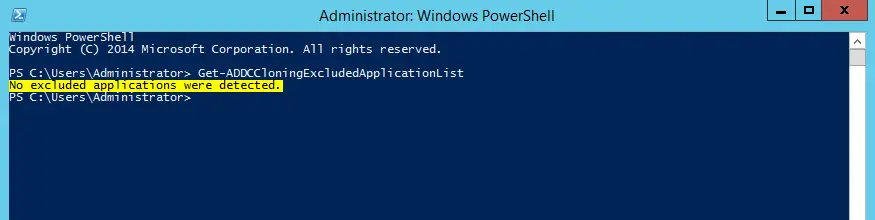

```
Get-ADDCCloningExcludedApplicationList -Generatexml -Force -Path C:\windows\ntds
```


7. If it’s comes up with list make sure those services are removed before clone.

8. After cleanup process type

```
New-ADDCCloneConfigFile –Static -IPv4Address “10.10.10.7” -IPv4DNSResolver “10.10.10.2” -IPv4SubnetMask “255.255.255.0” –CloneComputerName “DC2” -IPv4DefaultGateway “10.10.10.1” -SiteName “Default-First-Site-Name”
```
```
New-ADDCCloneConfigFile -Static -IPv4Address 192.168.1.14 -IPv4DNSResolver 192.168.1.10, 192.168.1.14 -IPv4SubnetMask 255.255.255.0 -CloneComputerName srv2016-3 -IPv4DefaultGateway 192.168.1.1 -SiteName Default-First-Site-Name Path C:windows\ntds
```


```
New-ADDCCloneConfigFile -Static -IPv4Address 192.168.1.14 -IPv4DefaultGateway 192.168.1.1 -IPv4DNSResolver 192.168.1.10, 192.168.1.14 -IPv4SubnetMask 255.255.255.0 -CloneComputerName srv2016-3
```
In here I specify the ip address information it (the clone server) will hold. Also the computer name and site name.


9. Once its pass and completed the process, exit from the console and the server.

10. For next steps we need to turn off the source domain controller. So before proceed make sure organization is aware about the downtime and the impact.

11. Load the Hyper-V manager and right click on the DC which needs cloning. Then select Turn-off.


12. Once its turn off, right click on DC and select export. Then select the path to save the export file.


13. Once export process is completed, right click on the source dc and click on start.

14. Then in Hyper-V go to **Action > Import Virtual Machine**


15. It will open up the import wizard and click next to continue.


16. In next window specify the folder path to the exported DC. Then click next.


17. Next window to select the DC and click next


18. In next window from the list select **Copy the virtual machine (create a new unique ID )** option can click next.


19. In next window it ask for the VM path. You can leave default or the different path based on your requirement. Once done click on next.


20. Next it’s ask for storage folder. Again it can change as per requirement. Once done click next.


21. Then it gives a summary page. Click on finish to start the import process.


22. Once import is completed, right click on the clone dc and click on start.

23. It will runs under several stages preparing the AD.


24. Once process is completed, l logged in to the server as domain admin. In Domain controller OU I can see the new clone dc. Also under site and services I can see the cloned dc located correctly.


---


### Join to Domain

**Before You Join Windows to an AD Domain**

irst, let’s look at the basic requirements and preparations that you need to make on your computer before you join an Active Directory domain:

- Only Pro, Education, Pro for Workstations, and Enterprise editions of Windows 10/11 can be joined to a domain. Note that the Active Directory domain is not supported in Home Editions;

- Your device needs to be connected to a local network and able to access at least one AD domain controller. We assume that your computer already has an IP address from the local subnet configured, with the IP addresses of the nearest domain controllers specified in the computer’s DNS settings (you can configure the network adapter settings manually or get them from the DHCP server);

- Make sure that your computer can resolve the domain name and can access the domain controller:`ping test.local`


- The computer’s local time must be within five minutes of the domain controller’s time. The proper time synchronization is required for Kerberos authentication;

- Set the name of your computer (`hostname`) to be used in a domain. By default, Windows generates a computer name during installation. However, it’s best to change it to something more meaningful. You can change the computer name using the classic Control Panel `sysdm.cpl`. Click **Change**, enter a new computer name, and press OK. As you can see, the computer is now a member of the default WORKGROUP);


You can also use the PowerShell command to change the computer name:
```
Rename-Computer -NewName "PC01" 
```
> After you change the hostname, you must restart Windows.


#### Add Windows to the Domain Using System Properties GUI

**Control Panel\Network and Internet\Network and Sharing Center** and Click on **Ethernet** and Go to **Properties**


Now IPV4 and Click on **Properties**.


Now add the Private IP address of the Domain Controller VM and close it.

Now Again try to add the Domain.

#### Add Windows to the Domain Using System Properties GUI

You can add your computer to the domain using the classic Control Panel in Windows:

1. Run `sysdm.cpl` and click Change;

2. Switch the **Member of** option to **Domain** and specify your domain’s name; 


3. You will be prompted to enter the name and password of a user with delegated administrative AD permissions to join computers to the domain. This may be a regular AD user (by default, any domain user can join up to 10 devices) or a privileged domain administrator account;


4. The next thing you should see is the message **Welcome to the test.local domain;**


5. Restart your computer

#### How to Join a Computer to a Domain with PowerShell

o join computers to an Active Directory domain, you can use the **Add-Computer** Powershell cmdlet. You can use this command to join a domain with a new hostname and immediately move the computer’s account to a specific OU.

For the simplest case, adding to a domain requires one command only:
```
Add-Computer -DomainName test.local
```
Then enter your username and password in the pop-up window.


#### Windows 11 Join in Domain (GUI)

Before setting, change DNS settings to refer to Active Directory Host.
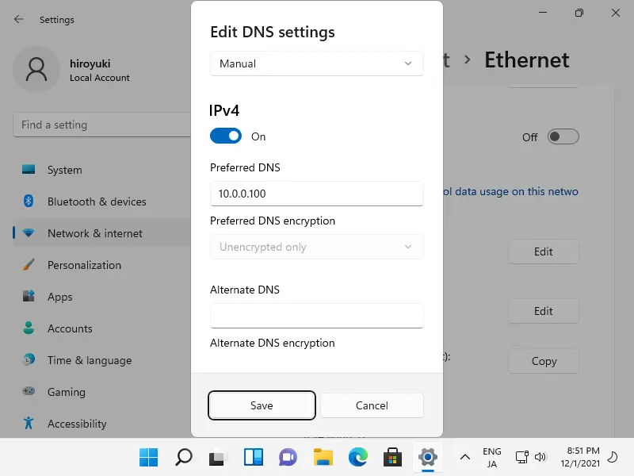

Right-Click the Windows icon and select [System], then Click [Domain or workgroup] link.


Move to [Computer Name] tab and click [Change] button.


Check a box [Domain] and input domain name and next, click [OK] button.


Authentication is required, authenticate with a domain User in Active Directory.


After successfully authenticated, Welcome message is shown like follows. Restart the Computer once.


On the logon screen after restarting Computer, click [Other user] to switch Domain user to logon.

---

## Account Lockout Policy: Configuration Guide


In this guide, you will learn about the three account lockout policy settings and how to properly configure each policy setting.

I’ll be referring to the recommended account lockout policy settings from both the Windows Security Baseline (aka Microsoft Security Toolkit) and the CIS benchmarks.

&nbsp;

### What are Account Lockout Policies?

An account lockout policy is a set of three group policy settings that control when and for how long a user account is to be locked out.

This policy is critical for security as it can help prevent malicious users or hackers from accessing your account and computer systems.

&nbsp;

### What is a lockout?

When you have an account lockout policy configured a user account will be locked out after so many failed login attempts.

For example, if a hacker entered the wrong password three times the account would be locked out if there is a properly configured lockout policy. This helps to prevent unauthorized access to your network. If no policy is configured or was incorrectly configured a hacker could keep guessing an account’s password.

By default, Active Directory has no account lockout policy.

In the next section, I’ll go over each policy setting, the default value, and the recommended settings.

&nbsp;

### Account Lockout Policy Settings and Best Practices

In group policy the lockout policy settings are located at:

Computer Configuration -> Policies -> Windows Settings -> Security Settings -> Account Policies -> Account Lockout Policy

Here is a screenshot of the default settings. By default, these policy settings are not defined.


It’s common for these settings to be configured using the Default Domain Policy GPO, but you can add them to a new or existing GPO. It’s up to you.

&nbsp;

#### Account Lockout Duration
The account lockout duration setting determines the number of minutes that an account is locked out before it automatically unlocks.

If you set this policy to 0 then the account will not automatically unlock and must be unlocked manually by an administrator.

For example, if the account lockout duration was set to 15 minutes and the user “joe.smith” became locked out. It would automatically unlock after 15 minutes.

Recommended settings:

- Windows Security Baseline: 15 minutes

- CIS Benchmarks: 15 or more minutes

&nbsp;

#### Account lockout threshold

The account lockout threshold setting determines the number of failed logon attempts that caused a user account to be locked out.

When an account is locked-out, it cannot be used until it is manually reset or automatically reset by the lockout duration policy.

For example, if the lockout threshold was set to 5 and the user “joe.smith” tried to logon 5 times with the wrong password, the account would be locked. And Joe would not be able to logon until the account was manually unlocked by an administrator or reset by the lockout duration policy.

Recommended settings:

- Windows Security Baseline: 10

- CIS Benchmarks: 5 or fewer but not 0

> Microsoft says:

> ***The threshold that you select is a balance between operational efficiency and security, and it depends on your organization’s risk level. To allow for user error and to thwart brute force attacks, Windows security baselines recommend a value of 10 could be an acceptable starting point for your organization.***

https://learn.microsoft.com/en-us/windows/security/threat-protection/security-policy-settings/account-lockout-threshold

In my opinion, I think 10 allows too many password attempts. I would instead recommend 5 or fewer for the lockout threshold.

&nbsp;

#### Reset Account Lockout Counter After

This policy setting determines the time in minutes that the failed logon attempt counter resets to 0 bad logon attempts.

For example, if the user “joe.smith” tries to logon and enters the wrong password, this will increment the failed logon attempt counter. This policy will reset that counter to 0.

It is recommended that this policy is set to less than or equal to the account lockout duration.

Recommended settings:

- Windows Security Baseline: 15 minutes

- CIS Benchmarks: 15 or more minutes

So now that you know what each setting does and its recommended settings, let’s walk through creating an account lockout policy.

&nbsp;

### How to Create an Account Lockout Policy

For these steps, I’ll use the CIS benchmark’s recommended settings.

&nbsp;

#### Step 1: Check Account Lockout Policy with PowerShell

It is a good idea to check your domain’s current lockout policy before modifying or creating a new one.

You can easily do this with the below PowerShell command.
```
Get-ADDefaultDomainPasswordPolicy | Select LockoutDuration,LockoutObservationWindow,LockoutThreshold | FL
```
The screenshot below is from my test lab.


&nbsp;

#### Step 2: Edit the Default Domain Policy

If you prefer, you can add these settings to another GPO or create a new one. Microsoft by default includes a password policy in the default domain policy, so I like to keep the lockout policy in the same GPO.


&nbsp;

#### Step 3: Modify the Account Lockout Policy

n the default domain policy navigate to the account lockout policy section.

Computer Configuration -> Policies -> Windows Settings -> Security Settings -> Account Policies -> Account Lockout Policy

To modify each policy setting just double-click the policy to edit its settings. For example, I opened the “Account lockout duration”, entered 30, and clicked ok.


Set the 3 policy settings to your requirements. Again, I’ll use the CIS benchmark recommended settings.

- **Account lockout duration:** 30 minutes

- **Account lockout threshold:** 5 invalid logon attempts

- **Reset account lockout counter after:** 30 minutes

Once completed, all 3 policy settings should then be defined.


&nbsp;

#### Step 4: Test the Account Lockout Policy

To test the policy attempt, logon and enter the wrong password 5 times (or whatever you set the lockout threshold to) and the account should become locked out.

Below is a screenshot of my account being locked out after 5 failed logon attempts.


I will now have to wait 30 minutes or have an administrator manually unlock my account before I can attempt to logon again.

That is it for this guide.

If you have questions or comments please post them below.

---

### Create Bulk Users in Active Directory

Method 1: Bulk Import AD Users With GUI Tool
This first method uses the [AD Pro Toolkit](https://activedirectorypro.com/ad-pro-toolkit). This tool makes it very easy to bulk import users and is a great alternative if you don’t want to deal with PowerShell scripts. Also, there are certain user fields that PowerShell does not support and a 3rd party import tool is needed.

#### Step 1: Download and Install

The bulk import tool is 1 of 13 tools included in the AD Pro Toolkit. You can download a free trial and try it for yourself.

[Click here to download a free trial](https://activedirectorypro.com/download-thank-you/)

#### Step 2: Open User Import Tool

Once installed open the toolkit and click on **Import Users**.


#### Step 3: Download CSV Template

Click the **Download CSV Template** button to generate a template file. This template includes the most common user attributes needed to create new user accounts. You can also add additional attributes if needed.


You will be prompted to save the CSV file. You can rename it and save it anywhere on your PC.


Now open the CSV template and fill out the fields you need. 

**At a minimum, I recommend setting the attributes below for all accounts.**

- **SamAccountName** (required) = This will be the users logon name.

- **password** (required) = users password. Make sure it meets your password requirements.

- **OU** = The organizational unit to add the user accounts into. This is the distinguished name of the OU. If you leave it blank it will import into the default users container.

- **GivenName** = First name

- **Surname** = Last name

- **DisplayName** = Display Name

- **Groups** = Groups to add the users to. Separate each group with a comma.


#### Step 4. Bulk Import from CSV file

Next, click the **Import Options** button and change any of the defaults that you need.


Now select your CSV template and click the run button to start the import process.


When the import is complete you can view the logs to verify the import status. You can see below the logs show imported 98 users out of 98.


It only took 30 seconds to import 98 user accounts.

Next, I’ll open an account and verify all properties were set.


Yes! It worked, it created the account and set all the user attributes from the CSV file.

I’ll check the Marketing folder to verify the accounts imported into the correct OU.


The GUI tool is a huge time saver and makes importing user accounts into Active Directory super easy. Plus you don’t have to modify any scripts or need PowerShell experience.

#### Method 2: How to Bulk Import AD Users With PowerShell from a CSV file

What you will need: 

- PowerShell Active Directory Module loaded – The script I provide will load the module you just need to run it from a computer that has RSAT tools installed or the AD role.

- Rights to create user accounts in Active Directory

- CSV File (See below)

- PowerShell Script (See below)

#### Step 1: Setup the CSV file

A basic CSV file should have the following headers. Technically you can import new accounts with just the SamAccountName, Name, and the password column but that is not recommended.

- **SamAccountName** = this will be the users logon name

- **password** = users password. Make sure it meets your password requirements.

- **path** = OU where you want to import users to. This is the distinguished name of the OU. If you leave it blank it will import into the default users container.

- **GivenName** = First name

- **Surname** = Last name

- **Name** = Name

- **DisplayName** = Display Name


Above is an example of my CSV file.

**How do you find the OU path?**

The OU path is the distinguishedName attribute, to find this open up Active Directory Users and Computers and browse to the OU you want to import to, then right click and select properties then select attribute editor.


Copy the path into the path column in the CSV file.

At this point the CSV file has the required fields,  you can jump to step 2 (setting up the PowerShell script) or keep reading to configure optional fields for user accounts.

**Add additional user fields to the CSV file.**

You may want to include some additional user fields in the CSV. Just know that whatever columns you add to the CSV you will also need to include them in the PowerShell script.

I’ve included several common user fields in the CSV template and PowerShell script.

- UserPrincipalName

- Department

- Description

- Office

- OfficePhone

- EmailAddress

- StreetAddress

- POBox

- City

- State

- PostalCode

- Title

- Company


To add more I recommend looking at the PowerShell [new-aduser](https://learn.microsoft.com/en-us/powershell/module/activedirectory/new-aduser?view=windowsserver2022-ps) cmdlet to see which parameters are supported.

I like to keep the name of the headers the same as the new-aduser parameters, it makes it easier to troubleshoot.

At this point, you should have a CSV file configured, and save the file to your local computer.

#### Step 2: Configure the PowerShell Script

Below is the script to bulk import new users.
```
#Import active directory module for running AD cmdlets
#Author: Robert Allen
#Website: activedirectrypro.com

Import-Module activedirectory

#Store the data from ADUsers.csv in the $ADUsers variable
$Users = Import-csv C:\it\bulk_import.csv

#Loop through each row containing user details in the CSV file 
foreach ($User in $Users) {
    # Read user data from each field in each row
    # the username is used more often, so to prevent typing, save that in a variable

        # create a hashtable for splatting the parameters
        $userProps = @{
            SamAccountName            = $User.SamAccountName                   
            Path                                   = $User.path
            GivenName                       = $User.GivenName 
            Surname                           = $User.Surname
            Initials                               = $User.Initials
            Name                               = $User.Name
            DisplayName                   = $User.DisplayName
            UserPrincipalName          = $user.UserPrincipalName 
            Department                     = $User.Department
            Description                     = $User.Description
            Office                              = $User.Office
            OfficePhone                   = $User.OfficePhone
            StreetAddress                = $User.StreetAddress
            POBox                            = $User.POBox
            City                               = $User.City
            State                            = $User.State
            PostalCode                 = $User.PostalCode
            Title                            = $User.Title
            Company                    = $User.Company
            Country                      = $User.Country
            EmailAddress               = $User.Email
            AccountPassword        = (ConvertTo-SecureString $User.Password -AsPlainText -Force) 
            Enabled                      = $true
            ChangePasswordAtLogon      = $true
        }   #end userprops   

         New-ADUser @userProps

    } #end else
   
```
You will need to modify the path to the CSV file you saved from step 1 (unless it matches what I have in the script)
```
$ADUsers = Import-csv C:\it\bulk_import.csv
```

By default, the script sets the accounts to enable. You can change this by setting Enabled to false
```
Enabled = $false
```

By default, the script sets the accounts to change password at the next logon. To change this set “ChangePasswordAtlogon to false.
```
ChangePasswordAtLogon = $false
```
That should do it for configuring the script. It’s pretty much ready to go as is.

#### Step 3: Run the PowerShell Script to import the accounts

At this point, the CSV file should be setup with the user’s information and the Powershell script should be modified (if needed)

Now it’s time to execute the script.

In PowerShell ISE just click the green button to run the script.


Now check Active Directory to verify the accounts imported.


Yes, it was a success.

That’s it for method 2. You can now use this script anytime to automate creating one or many AD user accounts.

---

BulkUser Script
```
import-csv -path d:\bulkuser\Userlist.csv | foreach {
 
$givenName = $_.name.split()[0] 
$surname = $_.name.split()[1]
 
new-aduser -name $_.name -enabled $true –givenName $givenName –surname $surname -accountpassword (convertto-securestring $_.password -asplaintext -force) -changepasswordatlogon $true -samaccountname $_.samaccountname –userprincipalname ($_.samaccountname+”@win.osi.local”) -city $_.city -department $_.department
```
---


### How to use offline Domain join (djoin.exe) Active Directory in Windows Server

**Offline domain join scenario overview**

Offline domain join is a new process that computers that run Windows® 10 or Windows Server® 2016 can use to join a domain without contacting a domain controller. This makes it possible to join computers to a domain in locations where there is no connectivity to a corporate network.

For example, an organization might need to deploy many virtual machines in a datacenter. Offline domain join makes it possible for the virtual machines to be joined to the domain when they initially start after the installation of the operating system. No additional restart is required to complete the domain join. This can significantly reduce the overall time that is required for wide-scale virtual-machine deployments.

A domain join establishes a trust relationship between a computer running a Windows operating system and an Active Directory® domain. This operation requires state changes to Active Directory Domain Services (AD DS) and state changes on the computer that is joining the domain. To complete a domain join in the past using previous Windows® operating systems, the computer that joined the domain had to be running and it had to have network connectivity to contact a domain controller. Offline domain join provides the following advantages over the previous requirements:

- The Active Directory state changes are completed without any network traffic to the computer.

- The computer state changes are completed without any network traffic to a domain controller.

- Each set of changes can be completed at a different time

There is a new tool included with **Windows Server 2012 R2 / Server 2016 and Windows 8 / 10 called Djoin.exe.**

There are any number of circumstances where you may want to have a client computer join to a domain when they have no access to a domain controller.

On example might be if you are creating a new branch office and the servers are not functional yet in that location, but you would like to begin rolling out the clients.

1. On the Windows Server, open **CMD** and **type**:

- **Windows** = your Domain name

- **CLIENT-10** = PC Client

```
djoin /provision /domain “Windows” /machine “CLIENT-10” /savefile win10blob.txt
```
> If the djoin /provision command completes **successfully**, you’ll see your **new Clients** PC account in the **Computers container in AD.** **(Please Refer to the Pictures)**


2. Browse to in **C:\Djoin**, and look for **Win10blob.txt** file.

Transfer Win10blob.txt file to **CLIENT-10** client PC.


3. On the **CLIENT-10 PC**, confirm that it still in **workgroup**.

Paste the **Win10blob.txt** that you copy previously from the server (**any domain member PC**) into **local admin profile** (for this Demo i copy into **Windows 10 System32** folder (not the best practice).


4. On the **client PC**, open **CMD** and type: and then **restart the PC**. **(Please Refer to the Pictures)**

```
djoin /requestodj /loadfile C:\Windows\System32\win10blob.txt /windowspath c:\windows /localos
```


5. Once your Client PC restarted, open System **Properties** and **confirm that your Client PC is now a member of your domain**.

> note : You’ll only be able to logon with a domain account for the first time if there’s connectivity to a DC.

---

### Create and Manage Users, Groups and Organizational units (OU)


So first up on our list is the remarkably uninteresting task of dealing with users and computers inside of the graphical tools that we have here in Windows Server. In a production world you’re probably not going to be performing these tasks on the domain controller itself. You will probably have management machine for this or if you are a powershell guy you can create new PSSession and import active directory module. On this way you don’t need to install RSAT tools on every machine you are using. I will show you later how this can be done.

There are actually a pair of different tools you can use for managing users and computers here in the operating system. The first of which is the old tool active directory users and computers (ADUC)


The second of which, which I’ll just open up here so we can see it, is the new tool called active directory administrative center. Now these two tools perform many of the same functions but the biggest difference here is that the adac, different from the aduc, runs on top of Windows PowerShell.


Now I’m going to use the old tool, because I’m old school, and old habits die hard. I will also show you how you can use powershell to accomplish the same tasks but much faster. If you need to create only one user you can use ADUC but if you need to create many from CSV file or if you need to copy many members from one AD group to another then performing those operations manually can take a lot of time.

Here on the left you can see the long list of organizational units and other containers that exist here in our domain nm.com. And over on the right, because we focused here on the list of users, are those users and then the groups that are available right out-of-the-box.


For us to create a new user is to right-click on the Users Container or any other OU if you have specific one that you want to use (I will create new one in Test Users) and select new user


and then we need to provide the first name and last name and then a user logon name for the individual. Under Full Name section you can see what we call the upn suffix for that user logon name. Here we have the ability to log on via either of these two approaches. The Pre-Windows 2000 approach, which is what many of us still use today, the domain name/a user logon name approach. Or the more new school method which is user name at domain name `nm.com.` Click **Next**


For any user that we many enter in; we’re going to have to punch in a password that supports whatever our password restrictions are going to be, those rules that we’ve applied. I will choose Pas never expires but you can choose any of these. In production you will probably uncheck Pass never expire. Next and finish


Now once I’ve created the user then there are a large number of different fields that we could potentially enter in that are associated with the user account. So a description of the user, their office, their telephone number, their email, their physical address information etc.


#### ACCOUNT TAB

1. If the account ends up getting locked for one reason or another, perhaps they’ve entered in their password incorrectly too many times, well I can unlock the account by choosing the checkbox here.

2. **Account Expires field** –> I can also set an expire on the account  at the bottom which is used most often when I have temporary accounts or perhaps consultants, external users that are coming in. That when I create that account I want to make sure that that account doesn’t inadvertently stick around past the point that that person should no longer be a part of the organization.

3. **LOG ON TO** –> This is very useful because we can restrict user access to a few servers in your Active Directory domain.

4. **Logon Hours** –> This will open an interface where you can restrict user login days and time by highlighting the appropriate area and clicking on Logon Denied


One more tab to mention before we move forward is the **Member Of**. (We will check few more later in these series).  Now anytime I create a new user, well that users going to be created with the domain users membership, you have to be in domain users in order to support attaching to and working with any of the objects that make up an active directory domain. In order to give additional access I would need to add that additional access by clicking on ADD.. and add user in additional AD groups which will give that user additional access to the resources.

**Set Primary Group** –> Is it not needed for every day Active Directory usage and can safely be ignored by almost everyone.


#### COPY USER 

There are always situations where we need to create a new user with a similar set of privileges. This can be done very easily by copying existing user account and creating new one from existing user account. To copy user account, right-click on it and select Copy


Give it a name and logon name and on the last page give it a new password.


and that’s it.


To delete a user account right-click on it and select delete


Now this is the user side of the equation. We also have the computer side of the equation as well. We can actually right-click to create a new computer object however you don’t find yourself doing that all too often, and the reason is that the process to add a computer into the active directory domain automatically creates the computer account as part of that process. One reason for pre-creating computer accounts would be offline domain join.


#### USER ACCOUNT TEMPLATES

We went through a very short explanation of the process to copy an account and we went to the Nedim Mehic account and attempted to copy it to some other user and in a world where you may have another user, who may be coming in and working in the same group as the Nedim person it makes sense then to just copy the account so that you can very easily replicate all the different configurations to what new user will need. But there comes a time also where when you’re creating new accounts you may have a certain minimum baseline set of configurations that every new account may require. You may have a set of baseline security groups that the users may need to be added. In this case we can create a user template. A template user account is essentially a non-functioning user account that you create in ADUC. That you can use as the container for all those baseline configurations. To create a user template right-click on Users container and select new user. In the new user window start it with an underbar for the only reason that when you go about sorting the active directory users and computers interface that the underbar will force this template account to the top of the list. And if I come down here to the user logon name, I’ll do the same thing and create it as underbar template. Click next


I’m going to leave the password as blank. Now here’s a really cool trick that you can do when you’re creating these template accounts. If I create this password as blank I’m not going to be able to actually create the user because in order to create the password as blank well I’m not going to meet the password complexity requirements for my active directory domain. So you can’t actually create a blank password on a user. But if I do create the password as blank and set the password so it cannot be changed, so the password never expires and so that the account is disabled. I’m then allowed to go about creating this new user. The neat part about this template user is that in no way can I ever enable the account because if I enable the account the blank password is not going to fit within those password complexity requirements. So this creates, as I said, kind of a nonfunctioning account. Click Next and finish


Now what you can do is to edit that template and configure it. When you need to create a new user just copy the template and create a new account.

#### ACTIVE DIRECTORY GROUPS

As you may know the reason why we have groups is to ensure that the right people have access to the right resources and conversely that the wrong people don’t have access to the resources they shouldn’t have access too. And so dealing with your groups requires a bit of strategy in ensuring that you create them and manage them correctly.

Managing your AD groups can at first blush seem like a really simple thing to do, but these groups and the sheer number of groups you will likely have and the nesting of one group into another can very quickly turn what would seem a simple active directory infrastructure into one that is far more complicated than you would ever expect. We will not just talk about how to put users in groups, but more specifically on the other things that you have to deal with when you’re talking about managing the groups themselves. Let’s get started.

Groups have multiple different types and they also have multiple different scopes so you’ll be creating different kinds of groups depending on what you actually need to use that group for. First up are the two different types of groups in active directory, security groups on one side and distribution groups on the other.


**SECURITY** –> In every case if you’re attempting to use a group to apply permissions to some folder or other object you’re going to use a security group to do that.

**DISTRIBUTION** –>The only case where you find yourself using distribution groups is when you’re dealing with email and the need to send out the email to a group of users for one reason or another.

Now when it comes to scopes this is where things get a little bit more challenging because the scopes can be a little confusing when you first start out.


**DOMAIN LOCAL** –> can include users, computers, universal groups, and global group, and groups from any domain in the forest and trusted domains. These groups are most often utilized to give permissions to resources and to provide access to resources in the domain where they’re located so in the same domain where you create domain local group.

**GLOBAL** –> can include users, computers and can include other global groups from the same domain. Most often you use global groups to organize users who have similar functions, so your finance group, your IT group, and so on. And so because of that these users will have similar requirements on the network. These groups are visible through-out the forest, but as I said they can only contain accounts and global groups from the same domain. Best practice is to not assign permissions directly to global groups.

**UNIVERSAL** –>  these are kind of a special group that you have to pay careful attention too, because the universal groups and the membership of universal groups is something that’s taken care of by any domain controllers that are also global catalogs. And so because of that any change to the membership of a universal group is going to require that membership to be replicated around every global catalog server in your active directory forest. They can contain accounts, global groups and other universal groups from any domain in the forest (they cannot contain domain local groups). Universal groups should be used to nest global groups. By doing that, the group can assign permissions to resources in multiple domains. I would recommend to use them only in multi-domain environments. We can use them when we are creating Distribution lists as well.

So one more time the **GLOBAL GROUPS** are generally for people and the **DOMAIN LOCAL GROUPS** are for the resources.


#### Configure Group Nesting

Best practice for group nesting is that you add users to global groups and then you add global groups to domain local groups. When that is done you then apply permissions to domain local groups. In a single forest, single domain environment you may not need to follow this and you will notice that there are not too many companies that follows this approach in the real-world scenarios.

To create a new group, right click on the OU and select New –> Group


Give it a name and select the scope and the type and click OK.


#### DOMAIN ADMINS VS ENTERPRISE ADMINS VS BUILTIN/ADMINISTRATORS GROUP

I have seen many times that enterprise and domain admin groups have too many member and that many organizations simply add every administrator and help desk technician to the enterprise admins group to make it easy for them to fix and configure the computers they need to administer. Now the big problem is that those employees use their enterprise admin accounts to manage the network, as well as to pick up email and surf the Web. Enterprise admin group should be empty and it should be used only when configuring things that need enterprise admin permisions. Domain admin group should not have too many admins and we should configure delegation instead of giving domain admin rights to every help desk member. Let’s see the difference between these groups.

**DOMAIN ADMINS** –> This group has complete and unrestricted access to the entire domain, DC’s and memebers are able to logon to any pc or server that is a member of the domain. Keep in mind that Domain Admins group is a Global group and it is limited to the domain it resides. Every domain in the forest have Domain Admins Group. Members of this group can add themselves in Enterprise/schema admin group.

With domain admin right you can for example administer Domain / DC Group Policy Management, Domain user and computer administration, Delegation of rights within Domain, FSMO Role Seizure (RID, PDC, Infrastructure), Domain Controller Installation (DCPROMO) etc…

**ENTERPRISE ADMINS** –> This group lives only in the forest root domain and has full AD rights to every domain in the forest. This group is a universal group which means that permission can be defined in any domain and user can be from any domain. This group should contain no permanent members. Use this group only when needed.

With Enterprise admin right you can for example: Administering the AD Schema,
Creating Certificate Authority, Managing Certificate Templates,
DHCP Authorization, Forest trust relationships, Forest Preparation and Functional Level management, Global Sites and Services Management and administration (for all domains), Creation of Sites & Site-Links, Creation of IP Subnets, Terminal Services Licensing, Creation and Destruction of Domains,FSMO Role Seizure (Domain Naming, Schema), take ownership of all forest and domain resources etc…

**BUILTIN ADMINISTRATORS** –> Members of this group have full control of all domain controllers in the domain. By default, the Domain Admins and Enterprise Admins groups are members of the Administrators group. The Administrator account is also a default member. The domain admins group, and the AD builtin\Adminstrators group (not the local admin group on clients) effectively grant users in them the same rights but the difference is that Builtin/Administrators is domain local group while Domain admins is domain global group.

 
#### ORGANIZATIONAL UNITS vs CONTAINERS

There is still misunderstanding when it comes to **OUs** and containers. They look almost the same but they are not the same. A generic Active Directory container is identifiable by its plain folder icon. The most common containers that appear in ADUC by default are the Computers and Users containers. By default, any workstation that is added to the domain will automatically be placed in the Computers container. Now problem with container is that you cannot apply group policy directly to it or delegate control. You can of course link a GPO to root domain and on that way apply policies to containers but if you do that all of your server objects will also get the same GPO applied to them.

**OUs** –> are here to make our job as IT admins easier. The icon for an organizational unit is similar, except that a small book is superimposed on the folder.  An OU is like a container, but OUs can be manipulated by IT administrators by applying GPOs, permissions, child OUs, and delegates. OU can be used to segregate/filter department bases on the region or type of users/groups/computers.

You can create a new OU by right-clicking on domain name or on another OU. In this case I will create new OU in root.


When I create that OU I have the abilities to protect the container from accidental deletion, this sets a flag on the permissions for that OU that eliminates the abilities to accidently click and delete the entire organizational unit at once.


notice how this OU now has the little box next to it. What you can do now is to create additional sub-OUs and move computers/servers to it. You can create one for users, computers, groups etc under the Helsingborg OU.


**Change default container when new computers get added into our active directory domain.**

As I said any server/computer that is added to our domain will automatically be placed in the Computers container. There is a way to change this so what you need to do is to get distinguished name of the OU you want to be the new default and then use the command redircmp. Run powershell as admin and run

```
redircmp “OU=Helsingborg,DC=nm,DC=com”
```
This becomes particularly handy when I start applying group policy to that Helsingborg OU. And it helps me ensure that every new computer is going to end up getting that group policy that I’ve applied.

#### Automate Groups and OUs with PowerShell 

Create a new OU
```
New-ADOrganizationalUnit -Name London -Path "DC=test, DC=local"
```
Create users in the new OU
```
New-ADUser -Name "User3" -SamAccountName USER3 -Path "OU=London,DC=test,DC=local"
```
```
New-ADUser -Name "User4" -SamAccountName USER4 -Path "OU=London,DC=test,DC=local"
```

Create a new group in the new OU
```
New-ADGroup -Name "SpecialGroup2" -SameAccountName SpecialGroup2 -GroupCatelogory Security -GroupScope DomainLocal -Path "OU=London,DC=test,DC=local"
```
Add users to the group
```
Add-ADGroupMember SpecialGroup2 User3,User4
```
Enumerate the group `ScecialGroup2`
```
Get-ADGroupMember ScecialGroup2
```

### Create Users in AD use CMD

redirect to myfolder after you can create users in myfolder group
```
redirect OU=MyFolder DC=test DC=local
```

Create user
```
netuser USER1 Pa$$w0rd /add /domain
```

redirect computer
```
redircmp
```

### Manage Local AD Groups using GPO Restricted Groups


The task of being an IT or system manager in a medium or large organization usually means that you may need to manage hundreds, thousands or even tens of thousands of client computers, and hundreds or thousands of servers. Some management tasks on many of these computers are related to the need to control local group members on those workstations and servers, which in such numbers, means an almost impossible task if you have to do it manually.

#### About Group Policy Restricted Groups

How do you control the membership of local groups on so many computers from a central location?
Luckily we have several options, such as built-in features of Group Policy Objects (GPOs) or startup scripts. We’ll first talk about a feature of Group Policy called Restricted Groups. Using this mechanism, GPOs lets you control the membership of domain and local groups on any computer that’s joined to the Active Directory domain.
**Important:** Restricted Groups affect only the computer account, not the user accounts. That means that you will need to use the GPOs that are linked to the organizational units (OUs) that contain the computer accounts. If you edit the default domain GPO, it will affect all the computers in the domain. If you edit the default domain controller GPO, it will affect all the domain controllers in the domain. Use with caution.
It’s worth mentioning that Restricted Groups are not configured by default in any pre-defined GPO, and by default, no new GPO has Restricted Groups configured initially. This means that if you want to use this feature, you must manually configure it, which is a good thing, as you’ll see in my next super important note.
**Warning:** Before touching any existing Restricted Groups setting or before adding new Restricted Groups settings, you must fully read and understand the possible consequences of using this feature. If you fail to do so, you may find yourself in deep trouble.

#### Tips for using Group Policy Restricted Groups to control group membership

How do we use Restricted Group? You can use these groups in several different ways. For example, you can add users to groups, and you can also use Restricted Groups to remove any user or group that is not on the list of allowed users or groups from groups. Finally, you can also use Restricted Groups to maintain the membership of the Domain Admins group in all the Local Administrators group.
With Restricted Groups, you can control the membership of critical groups, such as the Domain Admins, Enterprise Admins, and Schema Admins groups, for better security that ensures incorrect accounts are not added to these groups. Restricted Groups also lets you manage membership of local groups on file servers, adding global groups from the Active Directory domain to keep group membership consistent and persistent.
One nice feature of Restricted Groups is that you can manage groups that are non-existant at the time of configuration, where you can control those members. For example, you configure a group called “Future Local Group” by typing in the name and add a user called “Future User.” Because the group and user don’t exist at this point in time, it will have no effect. Once such is group is created on one of the computers that fall under the scope of that GPO, it will automatically be configured to only include “Future User” in it. If that user exists, it will be added. If not, the group will remain empty until such a user is created. Any attempt to add other members to that group will fail.

#### Creating a Restricted Group using Group Policy

To create a Restricted Group, you need to create or edit a GPO that is linked to the OU that contains the computer objects you want to be affected by the GPO.

1. In the GPO, browse and expand **Computer Configuration** > **Policies** > **Windows Settings** > **Security Settings**. Click on **Restricted Groups.** Right-click on **Restricted Groups** and select **Add Group**


2. Manually enter the group name. The name can be an existing group or a non-existing group that will be created in the future. If you want to control an existing Active Directory group, then you can browse for it, but this will only work for AD-based groups. Once you create the group, it will show up in the right-hand pane. In this example, we’re using a group called `Test Local Group` located on a member server.


3. Once the group is added to the Restricted Groups list, double-click the newly-added group to reveal the **Members of this group** option. This option lets you control the membership of the group that you’ve specified in the policy.
**Important:** When you configure the members of a group, the group’s existing membership is overwritten and replaced with the members that are specified in the GPO at the time of the GPO refresh. Any existing members in that group are immediately removed. Because of this, it is critical that you test these steps before applying these steps to a production environment.
**Important:** If you configure this setting and leave the “Members of this group” list blank, the group will be emptied and will not have any members after the GPO refresh.

4. To configure this option, double-click the group name that you created under Restricted Group node, then, click on the **Add** button for the **This group is a member of** on the upper part of the window. In this example we’re adding a user called `testuser1` located in AD.


5. If you look at the specific group on the target workstation or server, you will see that the group is empty. However, after you perform a GPO refresh by typing `gpupdate /force` in a command prompt window, you will see that the group now has a new member.


6. After you’ve refreshed the GPO, you will see that the member was re-added if you try to remove the member from the local group on the member server


7. If you edit the GPO and add a second user to the list, you will see that the new member was added to the group after you’ve performed a refresh. However, group memberships for the current user take effect during the next user logon.


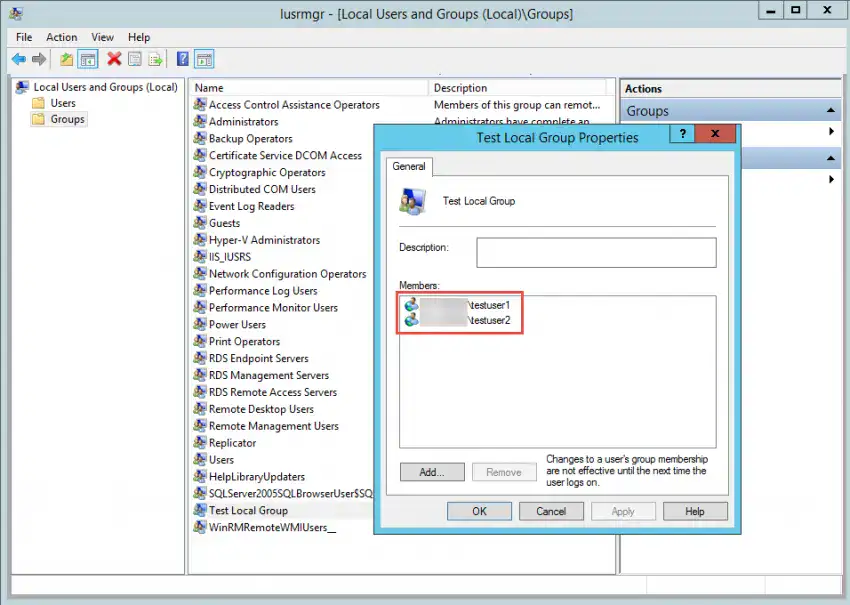

 

8. If you remove the previous two users from the group and instead insert a third user, you will see that the third user was added to the group, but also that the previous two users were removed.

Again, keep in mind that group memberships for the current user take effect during the next user logon.


9. Finally, if you empty the **Members of this group** list, you will see that group is now empty after a refresh.


10. Note that all manually added users to the specific group will be re-added once the GPO is deleted or edited to remove the Restricted Group from the list. In this case, it’s `testuser1` that was originally manually added to the group.


---

### AD nesting groups strategy and implementation

Microsoft recommends that you apply a nesting and role-based access control (RBAC), specifically the AGDLP for single-domain environments and AGUDLP for multi-domain/multi-forest environments. But implementing either arrangement in a legacy setup that lacks a clear strategy when it comes to RBAC and nesting can take time to clean up. The effort will be worthwhile, because the end result will make your environment more secure and dynamic.

#### Why should I use a nesting groups strategy?

A good nesting approach, such as AGDLP or AGUDLP, gives you a great overview of who has what permissions, which can help in certain situations such as audits. This setup is also useful because it eliminates the need for troubleshooting if something doesn't work. Lastly, it reduces administrative overhead by making the assignment of permissions to other domains straightforward

#### What is AGDLP?

- **A**ccounts (the user or computer)

- **G**lobal group (also called role group)

- **D**omain **L**ocal groups (also called access groups)

- **P**ermissions (the specific permission tied to the domain local group)

he acronym is the exact order used to nest the groups.

Accounts will be a member of a global group that, in turn, is a member of a domain local group. The domain local group holds the specific permission to resources we want the global group to have access to, such as files and printer queues.

We can see in the illustration below how this particular nesting group comes together:
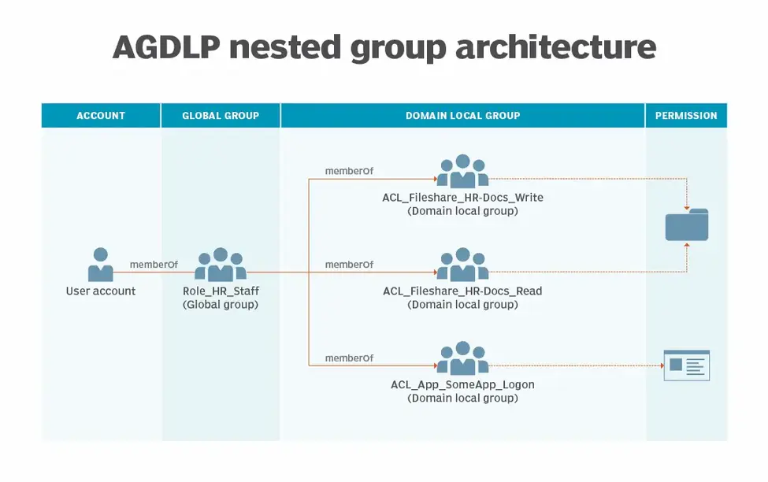

By using AGDLP nesting and RBAC principles, you get an overview of a role's specific permissions, which can be easily copied to other role groups if needed. With AGDLP, you only need to remember to always tie the permission to the domain local group at the end of the nesting chain and never to the global group.

#### What is AGUDLP?

AGUDLP is the multi-domain/multi-forest version of AGDLP, with the one difference being a universal group added to the nesting chain. You can use these universal groups to add role groups (global groups) from other domains without too much effort.

The universal group -- also called a resource group -- should have the same name as the corresponding role group, except for its prefix, as illustrated below:


#### What are the implementation concerns with AGDLP/AGUDLP?

There are four important rules related to the use of AGDLP or AGUDLP:

1. Decide on a naming convention of your groups.

2. One user can have multiple roles. Don't create more role groups than necessary.

3. Always use the correct group type: domain local, global, universal, etc.

4. Never assign permissions directly to the global or universal groups. This will break the nesting strategy and its corresponding permissions summary for the organization.

#### Should you use AGDLP or AGUDLP?

If you don't need to assign permissions across multiple domains, then always use AGDLP. Groups nested with AGDLP can be converted to AGUDLP if needed and require less work to operate. If you're in doubt, use AGDLP.

To convert an AGDLP nested group to AGUDLP, do the following:

1. Create a universal group.

2. Transfer the memberships of the global group to the universal group.

3. Add the universal group as a member of the global group.

4. Have all users and computers update their Kerberos ticket or log out and log in.

5. Remove all the domain local groups from the global group.

#### Why a naming convention is necessary with nesting groups

You should decide on a naming convention before you implement AGDLP or AGUDLP; it's not a requirement, but without one, you will quickly lose control of the organization you worked to build.

There are multiple naming schemes, but you can create a customized one that fits your organization. A good naming convention should have the following criteria:

- Be easy to read.

- Be simple enough to parse with scripts.

- Contain no whitespace characters, such as spaces.

- Contain no special characters -- characters that are not numbers or from the alphabet -- except for the underscore or minus sign.

--- 


## Configure Service Accounts

create new service
```
New-Service -name Test-service -BynaryPathName C:\windows\System32\notepad.exe
```


## Managed Service Account (MSA)

Create  a managed service account
```
New-ADServiceAccount -name Msa-test -RestrictToSingleComputer
```
```
Add-ADComputerServiceAccount -Indetify srv2016 -ServiceAccount Msa-test
```

Test
```
Add-ADServiceAccount -Indetify Msa-test
```

Install Msa on local srv2016
```
Install-ADServiceAccount Msa-test
```

Test
```
Add-ADServiceAccount -Indetify Msa-test
```

Create Dimmy service 
```
New-Service -name Test-service -BynaryPathName C:\windows\System32\notepad.exe
```

Group Managed Service Accounts (GMSA)

For test
```
Add-KdsRootKey -EffectiveTime ((Get-Date).AddHours(-10))
```
in reallife 
```
Add-KdsRootKey -EffectiveImmediately
```

```
New-ADServiceAccount -Name GMSA-test -DNSHostName GSMA-Test.test.local -PrincipalsAllowedToRetrieveManagedPassword "Domain Controllers"
```
install remote on other server
```
Invoke-Command -ComputerName srv2016-2 -ScriptBlock { Install-WindowsFeature Rsat-AD-Powershell }
```

On other server `srv2016-2`


```
Install-ADServiceAccount GMSA-test
```

Test him
```
Test-ADServiceAccount -Indetify GMSA-test
```

Install Dimmy service 
```
New-Service -name Test-service -BynaryPathName C:\windows\System32\notepad.exe
```

---

### How to Install the gMSA

After verify that fulfill all the requirements let's continue with the creation and installation of the gMSA(Group Manage Service Account.


#### Create the KDS Root Key

- As per requirements the first step is to create the **KDS Root Key**

- So let's open a **Powershell as Administrator** and run the following command.

- Note that with this command must take place 10 hours until key generation of the Domain Controller before create the **gMSA(Group Manage Service Account)**
```
Add-KdsRootKey -EffectiveImediately
```


- If try to create the **gMSA(Group Manage Service Account)** you will get an error that the Key doesn't exist

- If you want to use it immediately for your tests in your Lab you can run the following command that set the start time in the past 10 hours before
```
Add-KdsRootKey -EffectiveTime ((get-date).addhours(-10))
```


#### Delete the KDS Root Key

Deletion of the KDS Root Key it's not recommended if you have start already use the gMSA because Servers has cache the password.

However If for any reason you want to delete the KDS Root key then you can

- Open the **Active Directory Sites and Services**

- Click in **Active Directory Sites and Services** [your Domain]

- Click in **View** and Select **Show Service Node**

- Expand the **Group Key Distribution Service**

- Click on **Master Root Key** and find the Key in the right side

- From a Powershell command run the Get-KdsRootkey and verify the **Keyid**

- Right click in the Key and delete


#### Create the gMSA(Group Manage Service Account)

After we create the KDS Root Key we can proceed to create the gMSA.

- From the **Domain Controller** open the **Powershell** as **Administrator**

- Run the following command and change the **Name** and **DNSHostname** base on your requirements

- Note that this are the minimum just to run the command and create the gMSA. 
```
New-ADServiceAccount -Name "gsaccount" -DNSHostName "gsaccount.askme4tech.com"
```


- Now open the **Active Directory Computer** and **Services**

- Expand the **Manage Service Account** and you will see the **gMSA** which create


#### Where and How can use the gMSA

When i start to working with gMSA my first thought after created was How can use it?

Let's do some examples

Let's say that you have 2 Servers with Veeam and Backup Replication and one WSUS Server which use IIS and you want to use the gMSA

First of al you must create a **Group** in the **Active Directory** which include the **Computer Objects** that will use the gMSA

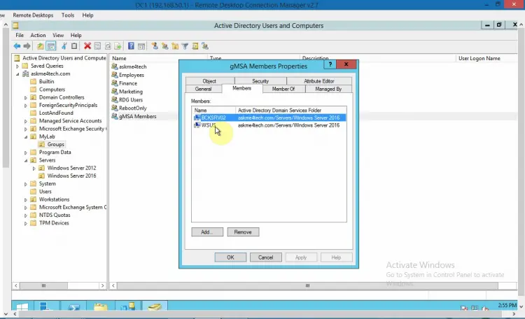

- Now run the following command to add members Hosts to gMSA 
```
Set-ADServiceAccount -Identity "gsaccount" -PrincipalsAllowedToRetrieveManagedPassword "gMSA Members"
```


- Login in your Server that you want to change the Service Account to **gMSA**

- Open the **Services**

- Select the **Service** and with **right click --- Properties**

- Click in Tab **Logon**

- Check the This account

- Type the account of the gMSA as the following format:
`askme4tech\gsaccount$`

- Clean any password that maybe has from previous account and click Apply. 


It will ask to **restart** the **Service** until take effect.


- Restart the Service to apply the **gMSA**

- Follow the above steps for the other Servers that you want to use the gMSA. In my example i will do the same for the 2 Servers with the Veeam and i will change all the service accounts related with the Veeam with the gMSA which create before

**gMSA** can you help you to eliminate passwords of Service Accounts and the most important secure your Service Account to be compromised.

---

## Kerberos Constrained Delegation (KCD)


Enabling KCD with Access Gateway#
Delegation is not enabled by default for any user account. You need to enable it manually by adding services in Active Directory User or computer's properties.

Perform the following steps to enable KCD with Access Gateway:

Open the Active Directory Users and Computers folder in your Domain Controller.

Select Computers > Access Gateway computer.

Right-click and select Properties > Delegation.

Select Trust this user for delegation specified services only and Use any authentication protocol options.

Specify the services in Services to which this account can present delegated credentials.

Click Add.

Click Users or Computers to select the computer hosting these services.


---

#### Allowing Non-Domain Admins to Configure Kerberos Constrained Delegation.

As you are probably aware of, configuring constrained delegation requires some steps that involve domain admin permissions.

In many larger organizations where there is a clear separation of duties this is can be problem since the engineers and developers need to specify what type of delegation need to be configured, and domain admins need to execute on that, not knowing what this is for and in many cases not knowing how and why Kerberos Constrained Delegation (KCD) operates.

Anyone that has tried to work with KCD knows what I am referring to.

This post is not about how to configure KCD but rather how to give a group of non-domain admin persons the ability to setup KCD without giving them other unnecessary domain-wide permissions.

This can be accomplished in a few steps, using an Organizational Unit (OU), a group for membership and a Global Policy applied to the OU.

Below is a description of how to achieve that.

For the sake of this article let us suppose that we have a group of DBAs that need to enable KCD for their BI developers so they can use row level security on their data sources (SSAS or SQL Server databases).

Let’s start by creating an OU where the servers we need to delegate can be placed. I name this OU **SQL Server Data Sources**


In that OU, let’s place the servers for which we need to be able to configure Kerberos Constrained Delegation. In my example I am placing my two database servers, SQL1 and SHP in the newly created OU.


The next step is to create a Security Group in which the users that need to be able to configure KCD for those servers will become member. I call this group **DBA** and it has one member called **regbac**.


Now we need to find the exact security settings that will allow members of this **DBA** group to configure Kerberos Constrained Delegation. For that purpose we need to view the advanced security properties of the newly created OU.

**Properties > Security > Advanced**


Next step is to Add a principal by clicking on Add and in the **select a principal** link, choosing the **DBA** security group.


The first thing to do now is to give this **DBA** group permissions to modify some properties on all the computer objects that we will put in the OU (our data sources).

Now, switch the **Applies to** setting to **All descendant objects** (This means all objects within the OU) and give DBA permissions to Write all properties. Click **OK**.


Now I need to add some special permissions to computer objects, so I click Add again. Once again, I’ll select the **DBA** group, then I need to switch to Descendant Computer objects. I click Write and then scroll down until I see **Validated write to service principal name**. I’ll click the box to enable it, and then OK, OK, and OK.

The end result looks like below :

2 permissions for **DBA** group,

- All descendants objects : Write all properties

- Descendant computer objects : Validate write to Service Principal Name


Now that we have managed the permission part, we need to create a group policy to enable thrust for delegation. This requires that I modify the Group Policy for the OU.


In group policy management, create a new Group Policy called **SQLDBAforKCD**.


Choose Edit (right-click), this brings up the Group Policy Management editor. The policy I need to change is under the Computer Configuration. I’ll expand Policies, Window Settings, Security Settings, and Local Policies. I’m looking for User Rights Assignments. Now I see a list of all the policies. I’m looking for **Enable computer and user accounts to be trusted for delegation**.


Add the **DBA** group to this policy.

Now back in Group Policy Manager, let’s find the OU. I’ll locate the **SQLDBAforKCD** policy and drag it to the OU. Yes, I do want to link it there, and I’ll also enforce it. Now the members of the **DBA** group have rights to set up Kerberos delegation.


Let’s test it by logging onto the server, running Active Directory Users and Computers as **regbac** and validate that the delegation is active for that user,
by trying to set or alter an active delegation:


Trying to do the same with an object placed in other OU doesn’t work, thus proving that we have successfully enabled KCD on that OU only.

---

### Manage Service Principal Names (SPNs)

#### Adding User Principal Name to Service Account

This section will guide you on how to add User Principal Name (UPN) to Service Account. You will need to follow the direction here if your AD FS is configured to run using a Service Account. You can check whether AD FS is using Service Account by using the **Services** Tool (open Start Menu and type services). If **Log On As** for Active Directory Federation

Services ends with '$' (dollar sign), this indicates that your AD FS is running using a Service Account.


UPN is required to identify the end entity of the issued certificate, but since Service Account does not have UPN by default, it is required that this information is filled out before issuing Enrollment Agent certificate to the Service Account.

To add UPN to Service Account:

1. Open **Active Directory Users and Computers** from **Windows Administrative Tools**.

2. Click **View** and enable **Advanced Features** by selecting the option. This will enable editing the attribute of the Service Account.


3. In the tree window at the left, collapse the domain in which the Service Account exists, and select **Managed Service Accounts**. Right-click the Service Account configured for AD FS and select **Properties**.


4. In the **Properties** dialog, select the **Attribute Editor** tab, scroll down and select **userPrincipalName**. Click **Edit**.


5. In the **String Attribute Editor** dialog, enter **userPrincipalName** of the Service Account. UPN will need to be in the format, <cn of the Service Account>$@<domain name>. For this example, the cn (or the shown name) of the Service Account is “gmsa_adfs”, and domain is “whfb.pkidev.bbtest.net”. Resulting UPN for this example will be `gmsa_adfs$@whfb.pkidev.bbest.net`


6. Click **OK** twice to apply the change and close the dialogs.
---

```
setspn -S MSSQLSvc/myhost.redmond.microsoft.com:instancename domain\accountname  
```
```
setspn -S MSSQLSvc/myhost.redmond.microsoft.com:1433 domain\accountname  
```

---


## Offline AD and Defragmentation


### Directory Services Restore Mode (DSRM)

```
bcdedit /set safeboot dsrepair
```

Restart Server 
```
shutdown -t 0 -r
```

To Normal Mode
```
bcdedit /deletevalue safeboot
```

Restart Server 
```
shutdown -t 0 -r
```

### Defragmentation AD

How we can do it?

In windows OS we uses the defragment tool to optimize the computer hard drive. There is similar procedure we can use to defrag active directory database.

There are two type of defragmentation use with active directory database. 

Online Defragmentation

With windows serer 2000 Microsoft introduced this method. It is runs in certain intervals (default is every 12 hours) automatically to defrag active directory database. It is part of active directory garbage collection process. It will optimize the data storage and reclaims the space for new active directory objects. But this will not reduce the size of the active directory database. The important thing is it not required to bring any service offline to do this.

Offline Defragmentation

As the name says to do this process we need stop the active directory service. To do this system will create compact version of the existing active directory database in different location. Once process is created the new defragmented database it will copy the compact version in to the original location.  Stats says it can shrink database in to 1/6th of its original size after offline fragmentation.

1. First you need to log in to the primary domain controller as Domain admin or Enterprise Admin.
2. Go to **Server Manager > Tools > Services**


3. In `Services.mmc` right click on **Active Directory Domain Services** and click **Stop**


4. Then it will ask if it’s okay to stop the associated services. Click yes to continue.


5. Once services stops, right click on Start button and click **Command Prompt (Admin)**

6. Type `ntdsutil` and enter
```
ntdsutil
active instance ntds
files
compact to c:\
```


view status
```
integrity
```


7. Copy compact file to original place
```
copy  c:\ntds.dit c:\windows\ntds\ntds.dit
```


8. Delete old Log files
```
del c:\windows\ntds\*.log
```


### AD Recycle Bin

#### Enable Recycle Bin Using Enable-ADOptionalFeature Cmdlet

Here are the steps user can use to enable the recycle bin:

- Click on the start menu and go to the Administrative tools option. Then right-click the Active Directory Module for Windows Powershell and 
click on **Run as administrator**.

- Type the following command at the Active Directory module for Windows Powershell Command prompt and then press Enter:
```
Enable-ADOptionalFeature –Identity ‘CN=Recycle Bin Feature,CN=Optional Features,CN=Directory Service,CN=Windows NT,CN=Services,CN=Configuration,DC=www,DC=domain,DC=com’ –Scope ForestOrConfigurationSet –Target ‘www.domain.com’
```

#### Enable the AD Recycle Bin on Windows Server 2016

To Enable the AD Recycle Bin on Windows Server, you need to follow the steps below. But once the AD Recycle Bin is enabled, you can not turn it off.

The steps are:

1. Open Server Manager

Open the Server Manager in your windows.


2. Open the Active Directory Administrative Center

Go to **tool** from the server manager and select Active Directory Administrative Center.


3. Enable Recycle Bin

Click on your local domain in the Active Directory Administrative Center and click on **Enable Recycle Bin**
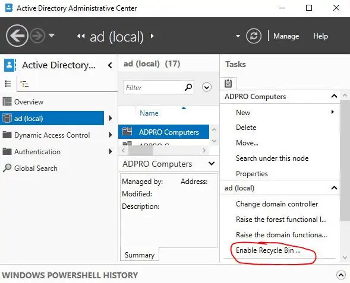

To confirm, click **OK** and again Click **OK** to the next pop-up.

Your AD recycles bin the now enabled.

---

### AD Snapshots

Create a Snapshot of AD DS by using NTDSUTIL in Windows Server 2016

what’s snapshot and what’s NTDSUTIL?
Manages snapshots of the volumes that contain the Active Directory database and log files, which you can view on a domain controller without starting in Directory Services Restore Mode (DSRM). You can also run the snapshot subcommand on an Active Directory Lightweight Directory Services (AD LDS) server.

In the command-line tool Ntdsutil.exe, you can use the snapshot subcommand to manage the snapshots, but you must use Dsamain.exe to expose the snapshot as a Lightweight Directory Access Protocol (LDAP) server. 

NTDSUtil in Windows Server 2016 can create and mount snapshots of AD DS.

**A snapshot is a form of historical backup that captures the exact state of the directory service at the time of the snapshot.**


1. On the Domain server, open **command prompt** and type **ntdsutil** and press **Enter**.


2. Next, type **snapshot** and press **Enter**.


3. Next, type **activate instance ntds** and press **Enter**.

> command "list all" for view all snapshot

4. Next, type **create** (this create command is to generate a snapshot of my AD) and press **Enter**.


5. Next, make sure you **copy the copy the GUID** somewhere (highlight the GUID and then copy).


6. Next, type **quit** 2 times to exit from snapshot.


7. Now, lets **make some change to my ADDS** by deleting 1 of my AD user, for this Demo, I choose my user from **Sales Department. (Refer to my Picture)**

Once you Deleted the user, you need to mount an Active Directory snapshot, and create a new instance so that later we can **retrieve back the Deleted user**

8. in CMD, type **ntdsutil**, then snapshot, then type **activate instance ntds**, then type **list all (Refer to my Picture)**.
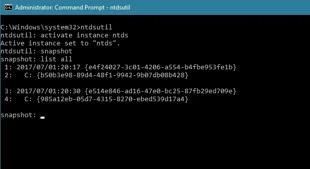

9. Next, you need to **mount GUID no** (please refer to my screen shot), type **mount <GUID>** no and press **Enter**.


10. once successful, exit the process by typing **quit** 2 times.


11. Next, on the CMD, type 
```
dsamain /dbpath C:\$SNAP_datetime_volumec$\windows\ntds\ntds.dit /ldapport 50000
```
> Leave `Dsamain.exe` running, and do not close the CMD.

***A message indicates that Active Directory Domain Services startup is complete***


12. Next, lets explore a snapshot with Active Directory Users and Computers, on the ADUC, right click **Windows.ae** and click **Change Domain Controller**.


13. type `DC-CLOUD:50000` on the **<Type a Directory Server name[:port] here>**, then click **OK**.


14. our last step is to unmount an Active Directory snapshot.


---

### Windows Server Backup and AD backup

#### Windows Server Backup – Brief Overview

Windows Server Backup (WSB) is a backup and recovery feature offered by Windows that makes a backup copy of the whole disk volume into another local disk. Once done, you can later use the backup to restore individual datasets or the entire disk. For example, if your system is crashed or Windows is not starting, you can use the backup file to restore the system volume and get your operating system back to operation in no time.


Windows Server Backup is an installable backup feature in Windows. Follow the below steps to install Windows Server Backup:

1. Launch **Server Manager** and click **Add roles and features** from the main dashboard.

2. Click **Next** multiple times until you reach the **Features** section. From there, look for **Windows Server Backup**, tick its checkbox, and click **Next**.


3. Wait till the installation process is completed. Once done, click **Close**.

This way, you have successfully installed and configured Windows Server Backup.


#### Perform One-Time Server Backup via Windows Server Backup

Follow the below steps to perform a one-time backup of Windows Server with WSB:

1. In the Windows Search bar, type **Run** and click the app shown in the **Best match** section.

2. In the Run pop-up window, type **wbadmin.msc** to launch the Windows Server Backup utility.


3. In the Windows Server Backup utility, click “Backup Once” from the right sidebar and then click **Next** to initiate the process.


4. You can perform multiple types of backups with WSB. So, now you have to choose either **Full server** or **Custom** backup. In a full server backup, all the Server data and applications will be backed up.

On the other hand, custom backup gives you the option to choose the data and applications you want to backup. If you are doing **WSB based backups** for the first time, then you can pick **Full server**. Afterward, click **Next**.


However, if you choose **Custom**, then you can also pick what nature of Volume Shadow Copy Service backup you want to have.

5. Now you have to choose where you want to store the backup. You can either pick **Local drives** or **Remote shared folder**. So, pick the choice that suits you and click **Next**.

If you select local drives, then you have to specify the drive where you want to store the backup. Similarly, if you select the Remote network share folder, then you have to provide the shared folder address.


6. Lastly, confirm all the settings and click **Backup**.


The tool will start creating the backup of the Windows Server. So, wait till the process is completed. Once done, you have successfully made a backup of **Server 2012** or whichever version you are using. This way, you can now **feel free** and satisfied that you have a backup in place that you can quickly restore in case of any data calamity.

##### Schedule Server Backups via Windows Server Backup
In the above steps, we have learned how to create a one-time Server backup. But you can also schedule backup with Windows Server Backup. Follow the below steps to do it:

1. In the Windows Search bar, type **Run** and click the app shown in the **Best match** section.

2. In the Run pop-up window, type **wbadmin.msc** to launch the Windows Server Backup utility.

3. In the Windows Server Backup utility, click **Backup Schedule** from the right sidebar.

4. Select either **Full server** or **Custom** backup configuration and click **Next**.

5. Choose how frequently you want to create backups. Finalize the settings as you like and then click **Next**.

6. Select the backup destination and click **Next**.

7. Lastly, confirm all the settings and click **Finish**.


This way, you have successfully created the backup schedule for your Windows Server. From now onwards, Windows Server Backup Restore will automatically create backups as per scheduled times without disturbing you.

#### Restore Server Backups via Windows Server Backup

We have learned how to create Server backups, but are you aware of how to restore backups after any data calamity, such as accidental deletion, malware attack, system crash, etc. Following are the steps you have to follow to restore Server backups with the WSB utility:

1. In the Windows Search bar, type **Run** and click the app shown in the **Best match** section.

2. In the Run pop-up window, type **wbadmin.msc** to launch the Windows Server Backup utility.

3. In the Windows Server Backup utility, click **Recovery Wizard** from the right sidebar.

4. Choose the backup that you want to restore and click **Next**. You have to select the backup based on the date and time.


5. Now select the recovery type. You can pick **Files and folders**, **Hyper-V**, **Volumes**, **Applications**, or **System state**. Afterward, click **Next**.


6. Select the items you want to recover and click **Next**.

7. Specify the recovery location. You can pick **Original location** or other options. Once done, click **Next**.


8. Lastly, confirm all the settings and click **Recover**.

The tool will start recovering the backed-up data into the desired destination. Wait till the process is completed and then you are all set to access the data.

---

### Replication of AD

```
rapadmin /syncall srv2016-2 dc=test,dc=local /d /e /a
```

d - use distinguished names in the login files

e - replicate everything

a - abort in case of any errors


Test dc 
```
dcdiag 
```

---

#### Types of Active Directory Replication

Replication in Active Directory can be broadly classified into two types. They are discussed as follows.


**Intra-site Replication**

Intra-site replication takes place between domain controllers within the same site. This process is quite simple and occurs by default in less than a minute. This replication is performed within a site by means of the ring topology. This need not be configured manually and occurs automatically within the site.
 
**Inter-site Replication**

In inter-site replication, changes made to a domain controller in one site are propagated to the domain controllers in different sites. This type of replication takes place by means of site links. However, this also utilizes the ring topology. Here, replication occurs between two domain controllers called bridgeheads. At least one domain controller within a site is assigned the role of bridgehead. In contrast to the intra-site replication, it has to be configured and does not occur manually.


#### Force Replication Of Domain Controller Through GUI
Windows servers make use of GUIs a lot, which is good for novice Systems Administrators. It’s easier to learn and sometimes helps you visualize what’s really happening. 

1. Log in to one of your DCs and open **Active Directory Sites and Services**.


2. Navigate to the site for which you’d like to replicate the domain controllers. Expand it by clicking the arrowhead next to the site name. Expand the **Servers**. Expand the DC which you’d like to replicate. Click on **NTDS Settings**.


3. In the right pane, right-click on the server and select **Replicate Now**.


4. Depending on how many DCs there are, this could take less than a second to a few minutes. When it is complete, you’ll see the notification, **Active Directory Domain Services has replicated the connections.**. Click **OK** to finish.

#### Force Replication of Domain Controllers Through CLI Command

If you’re familiar with the good old Windows CMD, then the **repadmin** command is for you. This is the quickest one-off way to force DC duplication. If you’re not familiar then this is a good time to learn about Windows CMD. 

1. Log in to one of your DCs and open the **Command Prompt**.


2. Enter the following command, and then press the **Enter** key.
```
repadmin /syncall /AdeP
```


3. A litany of information will scroll up the screen. If you see that the last line reads, **SyncAll terminated with no errors.**, and then the command prompt underneath it, your DCs are successfully replicated


### Force Domain Controller Replication With PowerShell

1. Log in to one of your DCs and open **PowerShell** or **PowerShell ISE**.


2. Before writing any script, save this with a descriptive name like force-DCReplication.ps1 so you can reuse it easier. Enter the following code and run it to see how it will get the names of all your DCs.
```
(Get-ADDomainController -Filter *).Name
```
See how it returns the names of the DCs? Now you can pipe that result into the next cmdlet. A pipe is the vertical line character ( | ), that’s usually found on the keyboard just above the **Enter** key.


3. At the end of the previous command, enter the following code:
```
| Foreach-Object { repadmin /syncall $_ (Get-ADDomain).DistinguishedName /AdeP }
```
The command should look like it does in the image below. Run it. It should return a message just like the one back in the Force Domain Controller Replication Through GUI section above. If it ends with, “SyncAll terminated with no errors.” then it worked. 
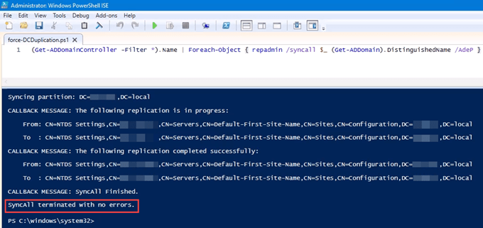
Did you see how it also uses the **repadmin** command?

4. Let’s add another line to help you make sure that the replication really did complete. The following code will return the date and time of when each of your DCs was last replicated. This command could be used on its own at another time if you’re just curious when your DCs last replicated. Enter the code and run it.
```
Get-ADReplicationPartnerMetadata -Target "$env:userdnsdomain" -Scope Domain | Select-Object Server, LastReplicationSuccess
```

The result should resemble the image below. You’ll see at the bottom the exact date and time the replication last took place.


5. To put some polish on this script, let’s make its output a little less verbose. Near the end of the first line, enter | **Out-Null** between the **/AdeP** and the end bracket. That tells it to not put out the results of that cmdlet. The end result will look like the following image.


---

### Controlling Password Replication on RODC

#### Cache credentials on an RODC

To perform the instructions below, you must have an existing AD domain with at least one RODC.

- Log in to any domain controller with an account that has permission to modify AD group membership.

- Open Server Manager from the Start screen.

- In Server Manager, select **Active Directory Users and Computers (ADUC)** from the **Tools** menu.


- In Active Directory Users and Computers, expand your AD forest and domain in the left pane, and click the **Users** container.

- In the right pane of (ADUC), double click Allowed **RODC Replication Group**.

- In the group dialog box, switch to the **Members** tab.

- Click **Add** at the bottom of the dialog, then enter the names of any users or groups you’d like to add to Allowed RODC Replication Group, and then click **Check Names**.

- Click Add at the bottom of the dialog, then enter the names of any users or groups you’d like to add to Allowed RODC Replication Group, and then click Check Names.

- Once you’re done adding accounts, click **OK**.

- Click **OK** in the group dialog box to complete the process.


Don’t forget that you can block credentials being cached by adding the relevant accounts to the Denied RODC Replication Group using the same process as above. And as with most permission scenarios, deny permissions override allow permissions. The Denied RODC Replication Group has the following members by default

- Enterprise Domain Controllers

- Enterprise Read-Only Domain Controllers

- Group Policy Creator Owners

- Domain Admins

- Cert Publishers

- Enterprise Admins

- Schema Admins

- Domain-wide krbtgt account

In this article I showed you how to configure which user and computer accounts can be cached on a RODC using built-in groups in Active Directory.

---

## WDS

```powershell
Get-WindowsFeature wds*
```

Install moduls
```powershell
Install-WindowsFeature wds -IncludeAllSubFeature -IncludeManagementTools
```
 

## IIS


## PKI

&nbsp;

### PKI Deployment Models 

&nbsp;

#### Single-Tier Model


This is also called as one-tier model and it is the simplest deployment model for PKI. This is NOT recommended to use in any production network as its single point of failure of entire PKI. 


In this model, single CA will act as root CA and Issuing CA. as I explain before the root CA is the highest trusted CA in PKI hierarchy. Any compromise to root CA will be compromise entire PKI. In this model its one server, so any compromise on server will easily compromise entire PKI as it doesn’t need to spread through different hierarchy levels. This is model is easy to implement and easy to manage. Because of that event it’s not recommended, this model exists in corporate networks. 

Some CA aware applications, required certificates in order to function. System center operation manager (SCOM) is one of the good example. It uses certificates on to secure web interfaces, to authenticate management servers and many more. If the organization doesn’t have internal CA, the options are to purchase certificates from vendor or to deploy a new CA. In similar situations engineers usually use this single-tier model as its only use for a specific application or task.

&nbsp;

| Advantages | Disadvantages |
| ---------- | ------------- |
| Less resources and Low Cost to manage as the its all running from single server. It also reduces the license cost for the operating systems. | Less resources and Low Cost to manage as the its all running from single server. It also reduces the license cost for the operating systems. |
| Faster deployment and it is possible to get CA running in short period of time. | Lack of redundancy as Certificate issuing and management all depend on single server and availability of it will decide the availability of PKI |
|            | It is not scalable and it will need restructure the hierarchy if need to add more role servers. |
|            | All the certificate issuing and management done by one server and all the work requests has to handle by it. it creates a performance bottleneck. |

#### Two-Tier Model 

This is the most commonly used PKI deployment model in corporate networks. By design the root CA need to keep offline and it will prevent private key of root certificate been compromised. root CA will issue certificates for subordinate CAs and Subordinate CAs are responsible for issuing certificates for objects and services. 


In event of Subordinate CAs certificate expire, Offline root CA will need to bring online to renew the certificate. Root CA doesn’t need to be a domain member and it should be operating in workgroup level (standalone CA). There for the certificate enrollment, approval and renew will be manual process. This is scalable solution and number of issuing CAs can be increase based on workloads. This allows to extend the CA boundaries to multiple sites too. In Single-Tier model if PKI got compromised, in order to recover all the issues certificates, need to be manually removed from the devices. In Two-Tier model, all need to do is revoke the certificates issued by CA and then publish CRL (Certificate Revocation List) and then reissue the certificates. 

&nbsp;

| Advantages | Disadvantages |
| ---------- | ------------- |
| mproved PKI security as root CA offline and it’s been protected by private key been compromised. | High Maintenance – Need to maintain multiple systems and need skills to process the manual certificates request/approval/renewal between root CA and subordinate CA |
| Flexible scalability – Can start small and expand by adding additional subordinate CAs when required. | Cost – Cost of resources and licenses are high compare to Single-Tier model |
| Restrict Issuing CA impact in CA hierarchy by controlling certificates scope. It will prevent issuing “rouge” certificates. | Manual certificate renewal process between root CA and subordinate CAs adds additional risks as if administrators forgot to renew it on time it can bring whole PKI down. |
| Improved performances as workloads can shared among multiple subordinate CAs. |     |
| Flexible maintenance capabilities as less dependencies. |    |

#### Three-Tier Model 

Three-Tier model is the highest in the model list which operates with greater security, scalability and control. Similar to two-tier model it also has offline root CA and online Issuing CAs. Addition to that there will be offline intermediate CAs which operates between root CA and subordinate CAs. Main reason for it is to operate intermediate CAs as Policy CAs. In larger organizations, different departments, different sites, different operation units can have different certificate requirements. As an example, a certificate issued to a perimeter network will required manual approval process while others users in corporate network prefer auto approval. IT team prefer to have advanced Cryptography provider for its certificates and large key while other users operates with default RSA algorithm. All these different requirements are defined by the Policy CA and it publish the relevant templates, procedures to the other CAs.


This model add another layer of security to the hierarchy. However, if you not using CA policies the intermediate tier will not use. It is just can be a waste of money and resources. there for most of the organizations prefer Two-tier model to start with and then expand as required. 
In this model both root CA and Intermediate CAs are operates as standalone CA. root CA only will issue certificates to intermediate CAs and those only will issue certificate to Issuing CAs. 

&nbsp;

| Advantages | Disadvantages |
| ---------- | ------------- |
| Improved security as it adds another layer of CAs to the certificate verification. | Cost – Cost of resources and licensee are high as its need to maintain three layers. It also increases the operation cost. |
| Greater scalability as each tier can span horizontally. | High Maintenance – When number of servers increases the efforts need to maintain those also increases. Both tiers which operates standalone CAs required additional maintenance as its not supported for automatic certificate request/approval/renewal. |
| In event of compromise of issuing CA, intermediate CA can revoke the compromised CA with minimum impact to existing setup | Implementation Complexity is high compare to other models. |
| High Performance setup as workloads are distributed and administrative boundaries are well defined by intermediate CAs. | |
| Improved control over certificate policies and allow enterprise to have tailored certificates. | |
| High availability as dependencies further reduced. | |

&nbsp;

---
