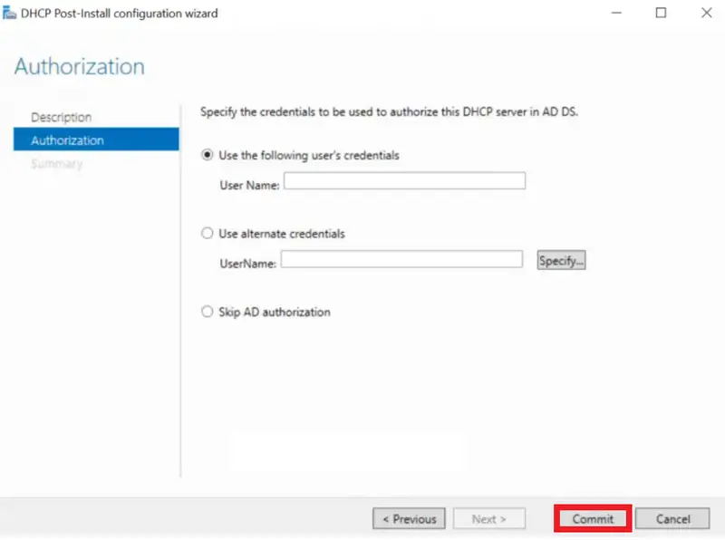
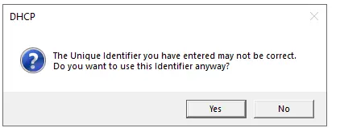
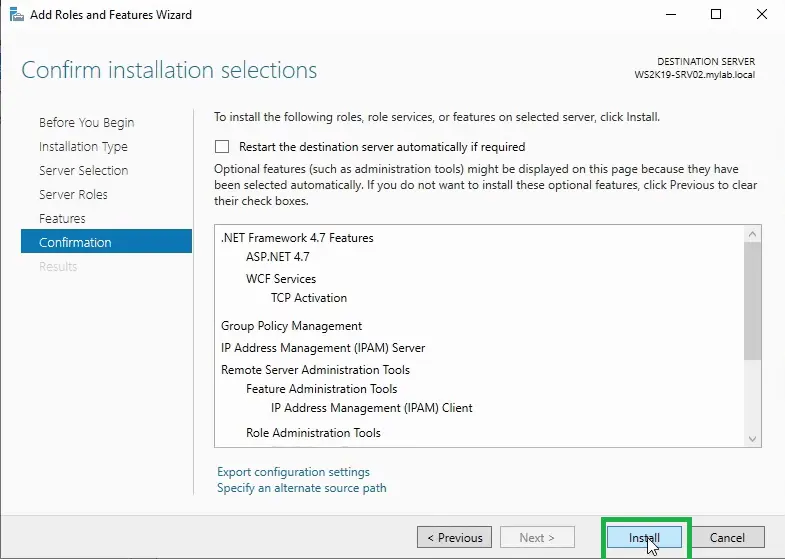
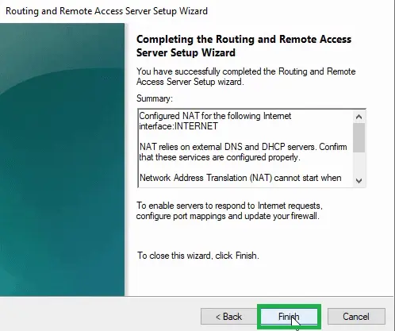
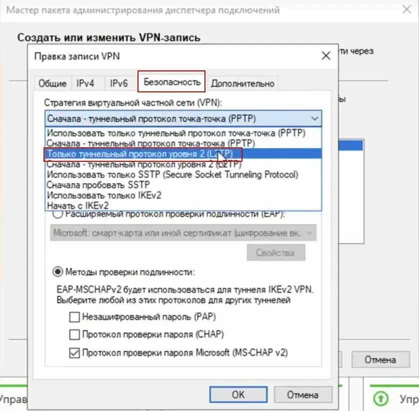
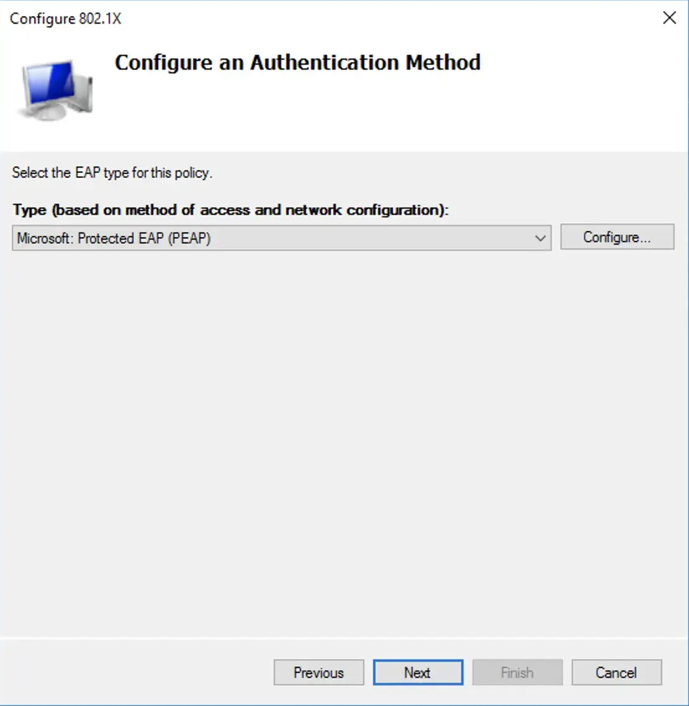

## DNS

display dns in cache 
```powershell
ipcofig /displaydns
```

clear dns cache
```powershell
ipconfig /flusdns
```

### DNS Server Role

DNS Forwarders

DNS Manager > Properties > Forwarders > Edit > (MY_DNS_ADDRESS) > OK > OK

To configure DNS forwarders on Windows using the graphical user interface:

Click Start and then **Administrative Tools**. Click **DNS**.

Right-click the **DNS** server that you want to configure as a forwarder.

In the Action menu, select **Properties**.

Click the Forwarders tab.

Click **Edit**.

In the Edit Forwarders dialog, enter the primary IP address of the ​SIA​ recursive DNS server and press **Enter**.

Enter the secondary IP address of the ​SIA​ recursive DNS server and press **Enter**.

If other servers are listed as forwarders, delete this information. The primary and secondary recursive DNS servers should be the only forwarders listed.

To change the number of seconds that a DNS server waits for a response before it tries the IP address of the other DNS server, enter a new value in the **Number of seconds before forward queries times out** field.

Click **OK**.

Enable the Use **roots hints if no forwarders are available option**. This option ensures that DNS servers in a root hints file resolve the name locally.

In the properties dialog, click OK.

Powershell command CLI ADD DNS ROLE on dns server
```powershell
add-windowsfeature dns -includemanagementtools
```

 Display DNS in cache on Server DNS 
```powershell
show-dnsservercache
```

Clear DNS cache on Server DNS
```powershell
clear-dnsservercache
```

### DNS Conditional Forwarder

Open **DNS Manager**

Open the Run box using **Win+R**, type **dnsmgmt.msc**, and click **OK**


**Open the New Conditional Forwarder Window**

Right click **Conditional Forwarders** under the server of your choosing, then select **New Conditional Forwarder…**


**Configure the new conditional forwarder**

Enter the domain for which you would like queries forwarded in the **DNS Domain** box

Under IP addresses of the master servers, enter the IP Address(es) or FQDN(s) of the server(s) you will be forwarding these queries to


You will see a check mark or X next to the servers you enter. Do not worry about an X if you know the IP is correct. This just means it could not do a reverse lookup on that IP.

If you entered a FQDN and it shows an X then you have a problem. You will need to do some DNS troubleshooting to determine why this will not resolve or enter the IP address instead.

When you done, simply click **OK** and you will now see this under the list of conditional forwarders.


add Conditional Forwarder in powershell
```powershell
Add-DnsServerConditionalForwardZone pdan.dev 8.8.8.8
```

### DNS Configure Root Hints


**Open the DNS server properties**

Right click the DNS Server you would like to change the select **Properties**


**Configure the new conditional forwarder**

**Open the New Name Server window**

Click the **Root Hints** tab and click and **Add** button


**Add a new root server**

Type in a FQDN and click **Resolve**

OR

Type in a FQDN and enter an IP address or multiple IP addresses


The IP address(es) should validate (green check mark) and then you can click **OK**


All  cache dns save in file :
```
MyPc > local Disk (C:) > Windows > System32 > dns > CACHE.dns
```

Add Root hint in powershell 
```powershell
Add-DnsServerRootHint server1.test.com 8.8.8.8
```

### DNS Records Overview


|Record type |	Description                                                      |
| ---------- | ---------------------------------------------------------------- |
|A	          | Address record, which maps host names to their IPv4 address. dnc |
|AAAA	       |IPv6 address record, which maps host names to their IPv6 address. |
|CNAME	    |Canonical name record, which specifies alias names. |
| NS	| Name server record, which delegates a DNS zone to an authoritative server. |
| PTR | Pointer record, which is often used for reverse DNS lookups |
| MX	| Mail exchange record, which routes requests to mail servers. |
| SRV	| Service locator record, which is used by some voice over IP (VoIP), instant messaging protocols, and other applications. |
|  TXT | Text record, which can contain arbitrary text and can also be used to define machine-readable data, such as security or abuse prevention information. |
| SOA	| Start of authority record, which specifies authoritative information about a DNS zone. An SOA resource record is created for you when you create your managed zone. You can modify the record as needed (for example, you can change the serial number to an arbitrary number to support date-based versioning). |


**Powershell commands:**
```powershell
nslookup www.google.com
```
A Record command
```powershell
nslookup -type=A www.google.com
```
AAAA Record command
```powershell
nslookup -type=AAAA www.google.com
```
NS Record command
```powershell
nslookup -type=NS www.google.com
```
PTR Record command (test my site reverse ip)
```powershell
nslookup -type=ptr 96.96.136.185.in-addr.arpa
```
MX Record command 
```powershell
nslookup -type=mx pdan.dev
```
SOA Record command 
```powershell
nslookup -type=soa pdan.dev
```
TXT Record command (for trust servers)
```powershell
nslookup -type=txt pdan.dev
```

Powershell command to show all dns recorders
```powershell
Resolve-DnsName www.pdev.dev
```

### DNS Stub Zones

To configure a stub zone:

 Create a new zone:

 

 Click next on the wizard welcome screen:


Choose to create a stub zone:


Select the replication scope of the stub zone:


Select the domain name for this stub zone:


Insert one or more name servers from where to load the zone info. Notice that zone transfer must be allowed:


Review settings and complete the wizard:


The stub zone has been created:


### DNS Zone Transfer

### Stub Zone on Master Server

Here's how to create a stub zone up zone using DNS Manager.

1.From the Windows desktop, open the Start menu, select **Windows Administrative Tools** > **DNS**.

2.In the console tree, expand a DNS server then right-click, then select **New Zone**.

3.On the New Zone Wizard page, select **Next**.

4.On the Zone Type page, select Stub zone. If the DNS server is also an AD DS domain controller, you can store the zone information in Active Directory.

5.If you have chosen to store the zone data in AD DS, choose one of the following options:

- All DNS servers running on AD DS domain controllers in the forest.'

- All DNS servers running on AD DS domain in the domain.

- All domain controllers in this domain (for Windows 2000 compatibility).

- All domain controllers enrolled in a specific directory partition.

Specify the zone name. For example, `west.contoso.com`

7.On the Master DNS Servers page, provide the IP address of a DNS server that is authoritative for the target zone. For example, `172.23.90.124`.

8. Select Finish on the Completing the New Zone Wizard.

in powershell cli 
```powershell
Add-DnsServerStubZone -Name "west.contoso.com" -MasterServers "172.23.90.124" -PassThru -ZoneFile "west.contoso.com.dns"
```
---

### Create duplicate on Slave Zone

Here's how to create a secondary look up zone using DNS Manager.

1. From the **Windows desktop**, open the **Start** menu, select **Windows Administrative Tools** > **DNS**.

2. In the console tree, expand a DNS server then right-click, then select **New Zone**.

3. On the New Zone Wizard page, select **Next**.

4. On the Zone Type page, select Secondary zone.

5. On the Zone Name page, specify the name of the secondary zone. The name of the zone must match the name of the primary zone to replicate from. For example, `south.contoso.com`.

6. On the Master DNS Servers page, specify the IP addresses of one or more DNS servers that host copies of the primary zone. You need to ensure that the primary zone allows transfers to the DNS server hosting the secondary zone. For example, `172.23.90.124`.

Select Finish on the Completing the New Zone Wizard.

Here's how to create a secondary DNS zone using the Add-DnsServerSecondaryZone PowerShell command.

Add the secondary zone `western.contoso.com` using the zone file name `south.contoso.dns` and using the primary zone server at IP address `172.23.90.124` use the following command:
```PowerShell
Add-DnsServerSecondaryZone -Name "south.contoso.com" -ZoneFile "south.contoso.com.dns" -MasterServers 172.23.90.124
```
### Allow Configure Slave Server Zone on Master


**Configure the source DNS server to allow for zone transfers**

These steps will be accomplished on both DNS Servers.

To forward lookup zone properties,

1. From the Windows desktop, open the **Start** menu, select **Windows Administrative Tools** > **DNS**.

2. Click on the **Forward Look Zone** that you desire so configure.

3. Click on **Properties**.

4. Select the **Zone Transfers tab**.


5. Select **Only to the following servers**.


6. Click on **Automatically notify** and add the IP of the Forest B. Make sure the IP is resolved and the green check mark appears.

7. Click **OK**.


in powershell command:
```powershell
Set-DnsServerPrimaryZone -name "west.contoso.com" -SecureSecondaries "TransferToZoneNameServer" -PassThru
```

### DNS PTR Records

Create Reverse Lookup Zone

1. Open the DNS Management Console

On your Windows Server type DNS in the search box to quickly find the DNS console.


2. Create New Reverse Lookup Zone

In the DNS console right click on **Reverse Lookup Zones** and Select **New Zone**.


3. Choose Zone Type (New Zone Wizard)

On the Zone Type page select Primary Zone.


Choose to replicate to all DNS servers running on domain controllers in this domain.


Choose IPv4 or IPv6, for this demo I’m setting up IPv4.


Now, type in the start of the subnet range of your network.

For this demo, I’m creating a zone for subnet 192.168.0.0/24.


Choose the dynamic update option.

I recommend picking the first option **Allow only secure dynamic updates**.


That completes the wizard, click finish.


**Verify Reverse Lookup Zone**

Back in the DNS console click on **Reverse Lookup Zone**

I can now see the new zone listed. The subnet will display backwards which is normal.


Now I’ll click the 0.168.192.in.addr.arpa zone to view the DNS records.


So far I have only the SOA and NS resource records, no PTR records.

Once clients start dynamically updating their DNS the PTR records should start populating. You can also manually create PTR records for systems that are not configured to dynamically update.


**How to Create PTR Records**

Let’s walk through manually creating a PTR record. This is only needed if a system is not configured to dynamically update. This may be the case for systems with static IP addresses like servers.

Right click the zone and select **New Pointer (PTR)**.


Enter the Host IP Address and Host name fields and click **OK**.

I’m creating a record for IP, 192.168.0.206 with the hostname of `pc1`.


Back in the DNS console, I can see the PTR record listed.


How to Verify PTR Record Is Working (the answer must come `Name: pc1`) 
```powershell
nslookup 192.168.0.200
```

### Configure Round Robin 

Installing the DNS service role:

1. Open Server Manager

Click Manage in the top right corner and select **Add Roles and Features**.
Go through the installation wizard, select "DNS Service" (DNS Server) in the list of roles and install it

2.Create a zone:

Start > Server Manager > Tools > DNS Manager

Right click on **Forward Lookup Zones** and select **New Zone**

Go through the zone creation wizard, select a zone type (usually **Primary Zone**) and enter (for example, example.com).

In **DNS Manager** open the created zone.

To create an entry, right-click on the zone and select **New Host (A or AAAA)** for IPv4 or IPv6 addresses respectively.
Enter the entry name and IP addresses. _Create multiple entries with the same name but different IP addresses_. This will be your Round Robin.

```
Name Server:
name1.server.local
name2.server.local
```
### Configure DNS caching 

(optional, but recommended for improved performance):

Open the **DNS Manager**.

Right-click on your DNS server and select **Properties**.

Navigate to the **Advanced** tab.

Uncheck the **Enable round robin** option.

Click **OK** to save the changes.


### DNS Delegation

1. From the Windows desktop, open the **Start menu**, select **Windows Administrative Tools** > **DNS**.

2. In the console tree, expand a DNS server, right-click the DNS zone to delegate, then select **New Delegation**.

3. On the Delegated Domain Name page, enter the delegated domain name. For example, to delegate the subdomain `south.west.contoso.com``, enter south. The fully qualified domain name (FQDN) name is automatically be appended.

4. Select Add to specify the names and IP addresses of the DNS server to host the delegated zone.

Enter either:

The FQDN of the DNS server that is authoritative for the delegated zone, then select **Resolve**. Add other DNS servers if necessary, when validated select **OK**.

Or

Manually enter the IP address of the DNS server that is authoritative for the delegated zone. Add other DNS servers if necessary, when validated select **OK**.

Select Finish to complete the New Delegation Wizard.

Powershell command:
```powershell
Add-DnsServerZoneDelegation -Name "west.contoso.com" -ChildZoneName "south" -NameServer "west-ns01.contoso.com" -IPAddress 172.23.90.136 -PassThru -Verbose
```


### DNS Global Zone (CName)

```powershell
Set-DnsServerGlobalNameZone -AlwaysQueryServer $True
```


```powershell
Set-DnsServerGlobalNameZone -Enable $True -PassThru
```

```powershell
AddDnsServerPrimaryZone -name GlobalNames -ReplicationScope Domain
```
```powershell
AddDnsServerResourceRecordCName -HostNameAlias srv.test.local -name testhost -ZoneName GlobalNames 
```

### DNS Configure Recursion (anti DDOS DNS  )

disable recursion (also disables forwarders)
```powershell
Add-DnsServerRecusionScope -name . -EnableRecusion $false
```

Clear DNS cache
```powershell
Clear-DnsServerCache
```

Add scope 
```powershell
Add-DnsServerRecursionScope -name "OurScope" -EnableRecursion $true
```

Add Policy 
```powershell
Add-DnsServerQueryResolutionPolicy -name "OurRecursionPolicy" -action ALLOW -ApplyOnRecursion -RecursionScope "OurScope" -ServerInterfaceIP "EQ,192.168.1.10"
```
next example
```powershell
Add-DnsServerQueryResolutionPolicy -name "Allow anly facebook" -action ALLOW -ApplyOnRecursion -RecursionScope "OurScope" -Fqdn "EQ,*.facebook"
```


Delete my policy  `OurRecursionPolicy`
```powershell
Remove-DnsServerQueryResolutionPolicy -name "OurRecursionPolicy"
```

Delete my scope `QutScope`
```powershell
Remove-DnsServerRecursionScope -name "OurScope"
```


### DNS Security (DNSSEC)

Digital signatures (using public/private key pairs)

Trust Anchors (Trust Points, storing public keys)

Name Resolution Policy Table (NRPT, to force clients)

KSK - Key Signing key (public/private)

ZKS - Zone Signing Key (public/private)


**Step to configure DNSSEC**

1 – Open **Server Manager**,  click Tools and open **DNS Manager**.

2 – In the **DNS Manager**, browse to your Domain name, then right click domain name, click **DNSSEC** and then click **Sign the Zone**.


2 - In the **Zone Signing Wizard** interface, click **Next**.


3 - On the Signing options interface, click **Customize zone signing parameters**, and then click **Next**.


4 – On the Key Master interface, ensure that **The DNS server CLOUD-SERVER is selected as the Key Master**, and then click **Next**.


5 – On the **Key Signing Key (KSK) interface**, click **Next**.


6 – On the **Key Signing Key (KSK) interface**, click **Add**.


7 – **On the New Key Signing Key (KSK) interface**, click **OK**.

~*~ please spend some time to go through about key properties on the New Key Signing Key (KSK) interface.


8 – On the **Key Signing Key (KSK) interface**, click Next.


9 – On the **Zone Signing Key (ZSK) interface**, click **Next**.


10 – On the **Zone Signing Key (ZSK) interface**, click **Add**.


11 – On the **New Zone Signing Key (ZSK) interface**, click **OK**.


12 – On the **Zone Signing Key (ZSK) interface**, click **Next**.


13 – On the **Next Secure (NSEC) interface**, click **Next**.

~*~ NSEC is when the DNS response has no data to provide to the client, this record authenticates that the host does not exist.


14 – On the **Trust Anchors** (TAs) interface, **check the Enable the distribution* of trust anchors for this zone check box**, and then click **Next**.

~*~ A trust anchor is an authoritative entity that is represented by a public key. The TrustAnchors zone stores preconfigured public keys that are associated with a specific zone.


15 – On the **Signing and Polling Parameters interface**, click **Next**.


16 – On the **DNS Security Extensions (DNSSEC) interface**, click **Next**, and then click **Finish**.


17 – In the DNS console, expand **Trust Points**, expand ae, and then click your domain name.

Ensure that the **DNSKEY resource records display**, and that their status is valid.


18 – Open **Server Manager**, click Tools and open **Group Policy Management**.

19 – Next, open **Group Policy Management**, expand Forest: `Windows.ae`, expand Domains, expand `Windows.ae`, right-click **Default Domain Policy**, and then click **Edit**.


20 – In the **Group Policy Management Editor interface**, under **Computer Configuration**, expand **Policies**, expand **Windows Settings**, and then click **Name Resolution Policy**.

~*~ In the right pane, under Create Rules, in the **Suffix box**, type `Windows.ae` to apply the rule to the suffix of the namespace.

~*~ Select both the `Enable DNSSEC in this rule check box` and the `Require DNS clients` to check that the name and address data has been validated by the DNS server check box, and then click Create.


Update Groups Policy
```powershell
gpupdate /force
```

see information about Groups Policy
```powershell
gpresult /r
```
show information about Groups Policy
```powershell 
netsh namespace show policy
```
See information about TrustAnchor 
```powershell
Get-DnsServerTrustAnchor -name test.local
```

See information about Zone Settings
```powershell
Get-DnsServerDnsSecZoneSettings -zonename test.local
```
See all Zone Settings
```powershell
Get-DnsServerDnsSecZone
```
 
```powershell
Clear-DnsServerCache
Clear-DnsClientCache
```
 

**Configure the DNS Socket Pool**

- 2500 ports for use dns connection

1 – In domain Server, open **Windows PowerShell** and type : `Get-DNSServer`

~*~ This command displays the current size of the DNS socket pool (on the fourth line in the ServerSetting section). Note that the current size is 2,500.

~*~ Please take note that the default DNS socket pool size is 2,500. When you configure the DNS socket pool, you can choose a size value from 0 to 10,000. The larger the value, the greater the protection you will have against DNS spoofing attacks.

2 – Now lets change the socket pool size to 3,000.
```powershell
dnscmd /config /socketpoolsize 3000
```
3 – **Restart your DNS Server** for the changes to take effect.

~*~ confirm that the new socket pool size now is 3000

**Configure the DNS Cache Locking**

- 300 second Time to Live = 100 percent (%)

In Windows PowerShell, type `Get-Dnsserver`

~*~ This command will displays the current percentage value of the DNS cache lock.

~*~ Note that the current value is 100 percent.

This changes the cache lock value to 70 percent
```powershell
Set-DnsServerCache –LockingPercent 70
```
~*~ Please take note that you configure cache locking as a percentage value.

3 – Looking your DNS Manager Verify.


### DNS Response Rate Limiting (RRL)

See information about Resonse time
```powershell
GEt-DnsServerResponseRateLimiting
```

- `WindowInSec`: This parameter specifies the time window, in seconds, during which the DNS server collects statistics about how many requests have been received. For example, if you set WindowInSec to 7 seconds, the DNS server will collect statistics for the last 7 seconds.

- `LeakRate`: This parameter specifies the rate of leakage or "leakage" in DNS server queries over a specified period of time. If the number of queries exceeds the set value, they will be filtered out or restricted.

- `TruncateRate`: This parameter specifies the rate at which DNS server responses are truncated or "pruned" over a specified period of time. If the number of responses exceeds the set value, they will be truncated or limited.

- `ErrorsPerSec`: This parameter specifies the maximum number of DNS errors that the server can handle per second. If the number of errors exceeds this value, they can be filtered or limited.

- `ResponsesPerSec`: This setting specifies the maximum number of DNS responses that the server can send per second. If the number of responses exceeds this value, they may be filtered or limited.

```powershell
Set-DnsServerResponseRateLimiting -WindowInSec 7 -LeakRate 4 -TruncateRate 3 -ErrorsPerSec 8 -ResponsesPerSec 8
```
Reset RRL settings to default values
```powershell
Set-DnsServerResponseRateLimiting -ResetToDefault -force
```

Set RRL to LogOnly mode
```Powershell
Set-DnsServerRRL -Mode LogOnly
```

Disable RRL 
```powershell
Set-DnsServerResponseRateLimiting -mode Disable -force
```

---

### DNS Policy based Load Balancing


Create in domain scope 
```powershell
Add-DnsServerPrimaryZone -name "loadbalance.com" -ReplicationScope Domain
```
```powershell
Add-DnsServerPrimaryZone -ZoneName "loadbalance.com" -name "Scope-Heavy"
```
```powershell
Add-DnsServerPrimaryZone -ZoneName "loadbalance.com" -name "Scope-Light"
```
see status of Zonescope
```powershell
Add-DnsServerPrimaryZone -ZoneName "loadbalance.com"
```

```powershell
Add-DnsServerResourceRecord -ZoneName "loadbalance.com" -A -name "LB-WWW" -IPv4Address "192.168.1.10"
```
```powershell
Add-DnsServerResourceRecord -ZoneName "loadbalance.com" -A -name "LB-WWW" -IPv4Address "192.168.1.20" -ZoneScope "Scope-Light"
```
```powershell
Add-DnsServerResourceRecord -ZoneName "loadbalance.com" -A -name "LB-WWW" -IPv4Address "192.168.1.30" -ZoneScope "Scope-Heavy"
```


Create Policy 
 ```powershell
 Add-DnsServerQueryResolutionPolicy -name "Our-LB-Policy" -Action ALLOW -Fqdn "EQ,*" -ZoneScope "loadbalance.com,1;Scope-Light,1;Scope-Heavy,9" -ZoneName "loadbalance.com"

 See Status Zone Policy
 ```poweshell
 Add-DnsServerQueryResolutionPolicy -ZoneScope "loadbalance.com"
 ```

 On Client test :
```powershell
Clear-DnsClientCache
nslookup LB-WWW.loadbalance.com
Resolve-DnsName LB-WWW.loadbalance.com
ipconfig /displaydns
```


### DNS Time Policy

```Powershell
Add-DnsServerPrimaryZone -name "time.com" -ReplicationScope Domain
```

add subname test
```Powershell
Add-DnsServerResourceRecord -ZoneName "Time.com" -A -name test  -IPv4Address "10.10.10.10."
```
See time on server
```Powershell
 Get-Date -DisplayHint Time
```
 See Status Zone Policy
 ```poweshell
 Add-DnsServerQueryResolutionPolicy -ZoneScope "time.com"
 ```

Block site from 4:00 to 23:00
 ```poweshell
 Add-DnsServerQueryResolutionPolicy -ZoneScope "time.com" -name "Time-Policy" -Action DENY -TimeofDay "eq,04:00-23:00"
 ```
 Ignore site from 4:00 to 23:00 (not be work)
 ```poweshell
 Add-DnsServerQueryResolutionPolicy -ZoneScope "time.com" -name "Time-Policy" -Action DENY -TimeofDay "eq,04:00-23:00"
 ``` 
Test on Client
```powershell
Resolve-DnsName test.time.com
```


### DNS Tools

DNS Manager > Ser2016 > Properties > Monitoring 


### DNS Scaveging

How does DNS Scavenging work?

Before we can configure DNS Scavenging correctly, we need to understand how it works. Scavenging removes stale (old) DNS records from your DNS server, but how does it know which records are old? This is where DNS aging comes in. DNS Aging determines when a DNS record is marked as old (stale).

But to configure the DNS aging correctly, we need to know how our DHCP Lease time. A common DHCP lease time is 8 days. This means that a client gets an IP Address assigned for a period of 8 days. It can only renew the lease after 4 days. This means that the client won’t renew the IP Address for at least 4 days.

**DHCP Lease Time**


**DNS Aging**

With the lease time given, let’s take a look at DNS Aging. Aging is a feature that identifies stale DNS records. It uses the DNS record timestamp to calculate the record age and uses two intervals to determine if a record is stale:

- **Non-Refresh interval** – A period in which a DNS record cannot be refreshed.

- **Refresh interval** – A period in which a record could be refreshed.

When we talk about refreshing the record, we don’t mean changing the DNS name or IP Address but refreshing the record timestamp. The timestamp can’t be updated during the non-refresh interval. This reduces the replication traffic on the network because a Windows client will try to update the timestamp every 24 hours.

Given that DHCP records won’t be renewed during the first 50% of the lease time (4 days in our example), we can set the **Non-Refresh interval** to 4 days. If you have a DHCP lease time of 7 days for example, then set the non-refresh interval to 3 days.

During the renewal period of the DHCP lease time, we can also want to allow the DNS record timestamp to be refreshed, so the **Refresh Interval** should match the remaining days of the DHCP lease time:

DNS Aging


**DNS Scavenging**

DNS Scavenging is used to actually clean up the stale DNS records. Scavenging is configured for the whole DNS server but also needs to be enabled per DNS zone. The scavenging interval is independent of the Non-refresh and refresh intervals.

This means that if you set the scavenging period to 7 days, then the scavenging service will run every 7 days. It will not delete a stale record after 7 days exactly. To know when the next scavenging cycle will run we can use the PowerShell cmdlet `Get-DnsServerScavenging`:
```
Get-DnsServerScavenging

# Result
NoRefreshInterval  : 7.00:00:00
RefreshInterval    : 7.00:00:00
ScavengingInterval : 7.00:00:00
ScavengingState    : True
LastScavengeTime   : 4/11/2023 4:27:43 AM

# Or let PowerShell calculate the next day:
$scavange = Get-DnsServerScavenging
(Get-Date($scavange.LastScavengeTime)).AddDays($scavange.ScavengingInterval.days)

# Result
Tuesday, April 18, 2023 4:27:43 AM
```
We can see in the results that the interval is set to 7 days, and the Last Scavenge Time was the 11th of April. So on April 18th, it will run again.

In the example below I have set the scavenging interval to 4 days. What we can see here is that a stale record is deleted on day 11, and not exactly after 8 days (Non-Refresh Interval + Refresh Interval).


**Step 1 – Preparing your DNS Records**

Before we can enable DNS Aging and Scavenging on our server we first need to prepare our DNS records. Because aging and scavenging are done based on the timestamp of DNS records. And especially in older environments you sometimes see DNS records that should be static but have timestamps.

If those records were deleted by the scavenging service, then it’s possible that an application or server won’t be reachable. Besides checking for static records, we also should make a backup/export of the DNS records. This way you can always look up the old records in case they are accidentally deleted.

1. Open the **DNS Manager**
2. Navigate to your **DNS zone**
3. Look for any records that should be static, but have timestamps, for example, servers or applications


4. Right-click on the record and choose **Properties**

5. **Remove** the checkbox “Delete this record when it becomes stale”

>Tip
>
>If you **don’t see** the option **Delete this record when it becomes stale** then you 
need to **enable Advanced View** in the **DNS Manager**: Click on **View** > **Advanced**


**Export DNS Records**

Next, we are going to export the DNS records to a CSV file. There is an export function in the DNS manager, but that exports the records to a TXT file which is harder to read. So we are going to use PowerShell to export the DNS zone to a CSV file:
```
Get-DnsServerResourceRecord -ZoneName 'lazyadmin.nl' | ForEach {
    [pscustomobject]@{
        HostName   = $_.hostname
        TimeStamp  = $_.timestamp
        RecordType = $_.recordtype
        RecordData = $_.RecordData.IPv4Address.IPAddressToString}
} | Export-Csv "c:\DNSRecords.csv" -NoTypeInformation
```
I you have multiple DNS zones, then you will need to run this for each zone.

**Step 2 – Enable DNS Aging per Zone**

With the DNS records checked, we can configure the DNS Aging. We will need to do this per DNS zone. In most environments, you will have only one zone where this is required, and that is your **primary domain** name under the **Forward Lookup Zones**.

1. Right-Click on your DNS zone and choose **properties**

2. On the general tab, click on **Aging**

DNS aging


We can now configure the No-refresh interval and refresh interval. I have a DHCP lease time of 8 days, so configured both intervals to 4 days. If you have an uneven number for the DHCP lease time, then make sure that the refresh interval is higher than the no-refresh. So for example, with a DHCP lease time of 7 days, set the No-refresh to 3, and refresh to 4.

>Note

> The No-Refresh Interval + Refresh interval should be equal or less then your DHCP lease time. Where No-Refresh Interval is equal or smaller then the Refresh interval.

3. Enable **Scavenge stale resource records**

4. Set the **No-refresh interval** and **refresh interval**

Enable Zone Aging and Scavenging


**Step 3 – Enable DNS Scavenging**

With aging configured for the DNS zone, we can now enable DNS Scavenging on the server. Keep the scavenging period lower than the DHCP Lease time. You could set it even to 1 day, but that could cause a lot of replication traffic depending on your environment.

1. Right-Click on your **DNS server** and choose **properties**

2. Open the **Advanced** tab

3. **Enable automatic scavenging of stale records**

4. Set the **scavenging period to 3 days** for example

Enable DNS scavenging


---

### DNS based Authentication of Named Entities (DANE)


**What is DANE?**
DNS-based Authentication of Named Entities (DANE) is an Internet security protocol to allow Public Key Infrastructure X.509 (PKIX) digital certificates, commonly used for Transport Layer Security (TLS), to be bound to domain names using Domain Name System Security Extensions (DNSSEC). It is also an option to secure the DNS infrastructure to store generic verifiable information for multi-factor verification. The most common use of DANE today is the TLSA record type (Transport Layer Security Authentication), which allows users to verify the PKIX certificate received from a website by querying for its information in DNS. 

**Why is DANE important?**
DANE offers the option for clients to seek a second source of verification, in the case of TLSA, certificate information. Leveraging the authentication inherently in DNSSEC, organisations can publish the legitimate TLS certificate information in DNS, allowing clients to verify that the certificate information published over HTTPS matches the one published over DNS.

**How does DANE work?**
The client first initiates the connection to a web server, which replies with its PKIX certificate. The client then requests the corresponding TSLA record for the web server from its local recursive DNS server. The TSLA record response received from the DNS server is validated with DNSSEC. The client then computes and compares the details of the TLSA record with the PKIX certificate. A match of the two values will load the target page. A mismatch will result in a page warning and will not load the target page.

High-Level Explanation

1. Client initiates connection to the web server.

2. Client receives PKIX certificate from the web server.

3. Client requests for web server’s TLSA Record.

4. Local Recursive Server validates the TSLA Record with DNSSEC.

5. Local Recursive Server returns the TSLA Record to client.

6. Client compares the PKIX certificate with the TSLA Record.

6a. The page will load for records that match.

6b. The page will not load and display a warning for a record mismatch.


### DNS DANE Generate Certificate

1. you need buy one or generate from openssl


2. put your .cert to Generate TLSA Certificate
https://www.huque.com/bin/gen_tlsa


3. Add to DNS Manager 
```Powershell
Add-DnsServerResourceRecord -CertificateAssociationData <hash_from_Generator> -CertificateUsage DomainIssuedCertificate -MatchingType Sha256Hash -Selector SubjectPublicKeyInfo -TLSA -ZoneName test.local -Name _443._tcp.ww1
```


---

### DNS STATS 

clear all statistics
```Powershell
Clear-DnsServerStatistics -force
```
Clear statistics about only zone `test.local`
```Powershell
Clear-DnsServerStatistics -ZoneName test.local -force
```
see all statistics
```Powershell
Get-DnsServerStatistics 
```
see statistic only zone `test.local`
```Powershell
Get-DnsServerStatistics -ZoneName test.local 
```

```Powershell
$stats_all - Get-DnsServerStatistics 
```
```Powershell
$stats_all.PacketStatistics
```
```Powershell
$stats_zone_test - Get-DnsServerStatistics -ZoneName test.local
```
```Powershell
$stats_zone_test.zonetrasferstatistics
```
```Powershell
$stats_zone_test.zonequerystatistics
```

### DNS Powershell CLI


```Powershell
Remove-DnsServerZone -name practice.com -force
```
Create new zone 
```Powershell
Add-DnsServerPrimeryZone -name practice.com -ReplicationScope Domain 
```
Create reverse zone to `practice.com`
```Powershell
Add-DnsServerPrimeryZone -Networkid '21.22.23.0/24' -Replication Domain
```
Create subdomain A - `srv5.practice.com` and create ptr (reverse dns)
```Powershell
Add-DnsServerResourceRecord -A -Name srv5 -IPv4Address 21.22.23.5 -ZoneName practice.com -TimeToLive 01:00:00 -CreatePtr
```
other method
```Powershell
Add-DnsServerResourceRecordA -Name srv4 -IPv4Address 21.22.23.6 -ZoneName practice.com
```
```Powershell
Add-DnsServerResourceRecordPtr -Name 6 -PtrDomainName srv6.practice.com -ZoneName 23.22.21.in-addr.arpa 
```
```Powershell
Add-DnsServerResourceRecordCName -name wwww -ZoneName practice.com -HostNameAlias srv6.practice.com
```
```Powershell
Add-DnsServerResourceRecordAAAA -name srv7 -IPv6Address 2001:db:6783::7 -ZoneName practice.com
```
```Powershell
Add-DnsServerResourceRecordMx -name smtp-mail -ZoneName practice.com -MailExchange srv5.practice.com -Preference 10
```
```Powershell
Add-DnsServerResourceRecord -Srv -DomainName www.practice.com -Name web -port 80 -Priority 20 -Weight 30 -ZoneName practice.com
```Powershell
Add-DnsServerResourceRecord -Srv -ZoneName practice.com -Name Our_txt -DescriptiveText "Hello" 
```
Sea about zone 
```Powershell
Add-DnsServerResourceRecord -ZoneName practice.com
```
Sea about zone 
```Powershell
Add-DnsServerResourceRecord -ZoneName practice.com | Sort-Object RecordType 
```
see about subdomain 
```Powershell
Add-DnsServerResourceRecord -ZoneName practice.com -RRType A
```
See Aging
```Powershell
Get-DnsServerZoneAging practice.com -Aging $true -ScavengeServers 192.168.1.100
```
start Scavenging
```Powershell
Start-DnsServerScavenging -Force 
```

## DHCP

DORA


### DHCP Install

Install on Powershell CLI
```Powershell
Get-WindwosFeature "dhcp"
```

```Powershell
Add-WindowsFeature dhcp -IncludeManagementTools
```


**1. Using Server Manager**

To start the installation process, you need to open Server Manager. From the Start Menu, open the Server Manager console.

Then, click **Add Roles and Features** in the **Server Manager** window. This will cause a pop-up window to appear. On the pop-up, click **Next**


**2. Select Installation Type**
Once the below page is displayed, choose the **Role-Based** or **Feature-based** installation radio option and click on the **Next** button.


**3. Choose a Server to Install DHCP Role On**

Select the server you want to install the DHCP Server on from the list on the page below. After choosing the Server machine that **hosts your DHCP server**, click **Next**.


**4. Select Server Roles**
In this step of Configuring DHCP Server in Windows, you need to Select Server Roles.


A pop-up window will appear when you choose the option, requesting that you add features needed by the DHCP server. If you want to add the DHCP management tools along with the DHCP role, keep the Include Management Tools checked selected. Then, click on **Add Features** and then click on the **Next** button to move on.


**5. DHCP Server**
On the DHCP Server, click on **Next** and continue.


**6. Confirm Installation Selections**

You are so close to finishing Configuring DHCP Server in Windows. In this step, verify that DHCP Server and other names are on the list by looking at it. Click **Install** after that. Click **Close** once everything has been installed successfully, and your DHCP server will be up and running.

Let’s start the DHCP post-deployment configuration process.


**Step 7. Post-deployment Config**

By now, you must complete the installation process. You are ready to start Configuring DHCP Server in Windows. The option **DHCP** should now be shown on the left pane of the window when you open Server Manager. A yellow-marked warning with the words **Configuration required for DHCP Server at…** and the link **More** should appear, as seen in the picture below.


The phrase **All Server Task Details and Notifications** will appear in a new window. You will see the **Post-deployment Configuration** line underneath it. As illustrated below, click on **Complete DHCP Configuration** at the end of that line. There will be an installation wizard. Choose **Next**.


Three choices are offered to you on this Wizard page. You can move forward using the Administrator’s credentials, the credentials of a different user, and AD Authorization. Select the **Skip AD authorization** radio option if your server is standalone and is not a member of any Active Directory domain. If so, you should log in using the credentials listed in your AD. Click **Commit** once you’ve made a decision that works with your surroundings. Allow it to complete its task, and if it is successful, click **Close** with satisfaction.




**8. Configure DHCP Server**

To continue Configuring DHCP Server in Windows, return to Server Manager and select **DHCP** from the **Tools** menu. The DHCP Configuration Window will then open as displayed below.


**9. Select New Scope**

Click the drop-down arrow as indicated above, then right-click **IPv4** in the window’s left pane and select **New Scope**. As seen below, a new window for the scope wizard will open. Choose **Next**


**10. Name your Scope**

Select **Next** after entering the new scope’s name and description.


**11. Insert your IP Address Range**

In this step, you need to input the preferred IP address range. To do this, input your start and End IPs, Length, and Subnet Mask. When you are finished, click on **Next**.


**12. Set any IPs you Consider excluding here**

At this point, you can enter any IP addresses you want to reserve for possible future use with equipment like a printer and other devices.


**13. Lease Duration**

A computer or client will receive an IP address for the lease length until the DHCP server changes it or assigns a new one when the user logs in again. Hit **Next** after setting yours.


**14. DHCP Options**

If you agree with the DHCP Options as they are shown on the page, simply click **Next** on this page.


**15. Default Gateway**

In this step of Configuring DHCP Server in Windows, you must enter the Default Gateway that will be given to the clients during the leasing period on this page. Enter it in and select **Add** next to it. Click **Next** after that.


**16. Domain Name and DNS Servers**

Previously, you got familiar with DNS Records and you know the DNS is crucial since it makes it easier to resolve FQDNs to IP Addresses. So, enter it and press **Next**


**17. Wins Servers**

This step is optional. If you want to use WINS Server in your environment, enter the information below and click **Next** to continue.


**18. Activate Scope**

Simply click **Next** to activate the scope we have set for this Step. Pick the second radio option if you want to activate it later.


**19. Complete Scope Configuration**

Configuring DHCP Server in Windows is now complete. Create additional scopes as shown above for the VLANS you have segmented in your LAN/Network, then set up your router so that it requests IP addresses from the DHCP server in accordance if you have done so.


**20. Verify that your Scope is active and Set up**

Check to see if your configs are present by opening your DHCP Configuration as in Step 9 and opening it as shown below.


**21. Configure DHCP Client on Windows**

The next step is to set up DHCP Client so that a Windows machine can request an IP address from DHCP Server after DHCP Server has been configured on our Windows server.


### DHCP Reservation

1. Expand the **Address Leases** section;

2. Find the DHCP client you need in the list (currently issued dynamic IP addresses have a lease expiration date);

3. Right-click on the item and select **Add to Reservation**.


4. The current IP address will be reserved for this device’s MAC address;

5. In n the **Reservations** section, a new entry will be created for your device.

You can also create a DHCP reservation manually. To do this, you will need to get the hardware (MAC) address of the device’s network adapter. On Windows you can find your MAC address with the command:

```
Ipconfig /all
```
In this example, the Physical Address is `08-3E-8E-AA-F3-0D`. Copy this value.


Right-click on the Reservations section in the DHCP console and select **New Reservation**.


Specify the new reservation settings:

- **Reservation name**: type the network name of the device;

- **IP address**: set the device’s IP address from your DHCP scope;

- **MAC address**: paste the physical adapter address you just got;

- **Descriptions**: provide a device (optional).

Click the **Add** button to create a new reservation.


If you entered the MAC address in the wrong format, an error will appear “The Unique Identifier you have entered may not be correct. Do you want to use this Identifier anyway?”. Double-check the MAC address in this case.



You will need to reboot your device to obtain a reserved IP address. Or run the following commands to release the old IP and get a new one from DHCP server.

```
ipconfig /release

ipconfig /renew
```

You can manage your reserved IP addresses from in **Reservation** section. This is where you can delete or change any of the DHCP reservation settings.


**Managing DHCP Reservations with PowerShell**

ou can also create, modify, and delete reservations on the DHCP server from the PowerShell command line.

The `Add-DhcpServerv4Reservation` cmdlet is used to create DHCP reservations.

The following command will reserve the leased IP address for a device that has already received an IP address from your DHCP server:

```powershell
Get-DhcpServerv4Lease -IPAddress 192.168.1.50| Add-DhcpServerv4Reservation
```
If you need to create a new DHCP reservation for a specific MAC address, use the command:

```powershell
Add-DhcpServerv4Reservation -ScopeId 192.168.1.0 -IPAddress 192.168.1.51 - ClientId "00-0C-29-05-8B-7E" -Description "Boss_laptop"
```
> Hint. You can find out the MAC address on a Windows computer using the command:

> Get-NetIPConfiguration | select @{n=’ipv4address’;e={$_.ipv4address[0]}}, @{n=’macaddress’; e={$_.netadapter.macaddress}}


to remove the specific DHCP reservation, run the command:
```powershell
Get-DhcpServerv4Reservation -IPAddress 192.168.50.56| Remove-DhcpServerv4Reservation
```

### DHCP Option

if you create on `Server Options` all be copy to Scope level and Reservations

Server Options => High level

if you create on `Scope level` and `Reservations` but not copy on `Server Options`

Scope Options => Medium level

if you create on `Reservations` not copy on `Server Options` and `Server Options`

Reservations => Low Level

### DHCP Relay


To work :
Create Scope 
Add Routing and Remote Access 
Enabling DHCP relay
The DHCP relay function is enabled by default on an routing switch. However, if DHCP has been disabled, you can re-enable it by entering the following command at the global configuration level:
```
HP Switch(config)# dhcp-relay
```

**Install a DHCP relay agent on Windows Server**


This article shows you how to install and configure a Dynamic Host Configuration Protocol (DHCP) Relay Agent on a computer running Windows Server. A DHCP relay agent works as an intermediary between DHCP clients and DHCP servers that aren't on the same subnet or local network. The DHCP Relay Agent forwards DHCP broadcast messages from clients to remote server, letting clients obtain IP addresses and other network configuration information from a DHCP server located on a different subnet.

To install the DHCP relay agent on Windows Server, you need to deploy the Remote Access server role. The DHCP relay agent is a feature of Remote Access and isn't included in the DHCP server role.

Prerequisites
Before you can install your DHCP relay agent, you must have the following prerequisites:

- A computer running Windows Server in the remote subnet where you want to install the DHCP relay agent.

- A DHCP server with a DHCP scope configured for the remote subnet.

nstall and configure the server role
Here's how to install and configure LAN routing as part of the Remote Access server role from the Windows desktop.

1. Sign into the computer where you want to install the DHCP relay agent, then open the **Server Manager**.

2. In the **Server Manager console**, select **Add roles and features**.

3. In the **Add Roles and Features** menu, select **Next** until you reach the **Server Roles** page.

4. Expand the **Remote Access** role by selecting the accompanying checkbox or arrow.

5. In **Role Services**, select **Routing**, then **Add Features** when prompted.

6. Select **Next** until you reach the **Confirm installation selections** page.

7. Select **Install** to begin the installation. After the installation completes, select **Open the Getting Started Wizard**.

8. In the Routing and Remote Access Microsoft Management Console (MMC), right-click the server, then select ***Configure and Enable Routing and Remote Access*** to open the Routing and Remote Access Server Setup Wizard.

9. In the Welcome to the Routing and Remote Access Server Setup Wizard, select **Next**.

10. In **Configuration**, select LAN routing, and then select **Next**.

11. In **Custom Configuration**, select VPN access, and then select **Next** to open the Completing the Routing and Remote Access Server Setup Wizard.

Select **Finish** to close the wizard, then **Start service** when prompted.


**Configure DHCP Relay Agent**

Here's how to install the DHCP Relay Agent role from the Routing and Remote Access MMC.

1. In the left pane, expand the server name, then right-click **General** under **IPv4** or **IPv6**, then select **New Routing Protocol**.

2. In the left pane, then right-click **DHCP Relay Agent** under **IPv4** or **IPv6**, then select **New Interface**.

3. Select the network interface you want to use for the DHCP relay agent. Select **OK**.

4. In the left pane, then right-click **DHCP Relay Agent** under **IPv4** or **IPv6**, then select **Properties**.

5. Enter the IP address of the DHCP server you want to relay DHCP requests to, then select **Add**.

6. Select **OK** to save your settings.

Now the DHCP Relay Agent is installed and configured on your Windows Server.

> Dont forget create scope

> Dont forget confige reverse routing for DHCP to Client

* DHCP Know about clients message using this line `GIADDR field` (Gateway IP Address)

```
route print
```

add route to gateway 192.168.1.11 
```
route add 192.168.2.0 mask 255.255.255.0 192.168.1.11 -p
```


### DHCP Updates to DNS Records

Set for not AD account 

View current A records in `test.local`

```powershell
Get-DnsServerResourceRecord -computer -srv2016 -ZoneName test.local -RRType A
```
Create reverse lookup zone for 192.168.2.0/24
```powershell
Add-DnsServerPrimaryZone -computer srv2016 -NetworkId '192.168.2.0/24' -ReplicationScope Domain
```
View current A and PTR records in specific zones 
```powershell
Get-DnsServerResourceRecord -computer srv2016 -ZoneName test.local -RRType A
Get-DnsServerResourceRecord -computer srv2016 -ZoneName 2.168.192.in-addr.arpa -RRType Ptr
```

Set DHCP IPv4 propeties regarding dynamic updates to dns
```powershell
Set-DhcpServerv4DnsSetting -computer srv2016 -DynamicUpdates Always -UpdateDnsRRForOlderClients $true -DeleteDnsRRForOlderClients $true -DeleteDnsRROnLeaseExpiry $true
```


### DHCP PXE Support

Scope Option > Right-click Configuure Options 

- [X] 66 = Boot Server Host Name

- [X] 67 = BootFile NameWhen the initial DHCP offer from the DHCP server contains these boot options, an attempt is made to connect to port 4011 on the DHCP server. This offer fails if the PXE server is on another computer.


**Configuring the DHCP server for WDS**

First in the line of duty is the DHCP server. Here we need to add two more scope options to tell clients where our WDS server is located, and by located I mean its IP address, and what is the boot image file name the clients need to download in order to be able to boot from network.

Open your DHCP server console, locate your scope for the clients pool, and drill down to **cope Options**. Right-click this folder and choose **Configure Options**.


What interest us here, are options **66** and **67**. Check the box next to 66 then in the **String value** box, type the IP address of your WDS server. Once you’re done with this, go and check the box next to option **67**. Here, we need to put the path for the boot file name, and we have two options: one for the x86 architecture and the other one for the x64 one. Unfortunately we cannot put both, but since most of the systems are now x64, I will just use this one.

For the x64 architecture type **bootx64wdsnbp.com**
For the x86 architecture type **bootx86wdsnbp.com**


### DHCP Superscopes and Multicast Scopes

Create Scope 1 and Scope 2
```powershell
Add-DhcpServerv4Scope -name Network1 -StartRange 10.0.1.1 -EndRange 10.0.1.254 -Status Active -SubnetMask 255.255.255.0
```
```powershell
Add-DhcpServerv4Scope -name Network1 -StartRange 10.0.2.1 -EndRange 10.0.2.254 -Status Active -SubnetMask 255.255.255.0
```

Exclusion ip from ...1.1 to ...1.10 and ...2.1 to ...2.10
```powershell
Add-DhcpServerExclusionRange -Scopeid 10.0.1.0 -StartRange 10.0.1.1 -EndRange 10.0.1.10
```
```powershell
Add-DhcpServerExclusionRange -Scopeid 10.0.2.0 -StartRange 10.0.2.1 -EndRange 10.0.2.10
```

add information about default gateway to scope 1 and scope 2
```powershell
Set-DhcpServerv4OptionValue -Scopeid 10.0.1.0 -Router 10.0.1.1
```

Super Scope union scope 1 and scope 2
```powershell
Add-DhcpServerv4Superscope -SuperscopeName Our_Superscope -ScopeId 10.0.1.0,10.0.2.0
```


### DHCP Policies

DHCP policy based assignment overview
With a DHCP server running Windows Server 2012 or Windows Server 2012 R2, administrators can define an address assignment policy at the server level or scope level. A policy contains a set of conditions to evaluate when processing client requests. Policy based assignment enables flexibility for some common scenarios, including:

1.**Multiple device types**: A network includes many different DHCP client devices, such as printers, IP phones, and desktops. Administrators need the ability to classify these devices using different IP address ranges. This enables router policies and quality of service (QoS) based on IP address range policies to control network access or traffic. For example, you can add a vendor class of “Hewlett-Packard JetDirect” or Cisco Systems, Inc. IP Phone CP-7940G and configure printer and IP-phone policies to assign a specific IP address range to these devices.

2.**Multiple roles**: A network includes different types of computers, such as laptops, desktops, and servers in the same subnet. Depending on the type of client, the administrator might wish to provide different lease duration settings. All the wireless clients that connect via a specific relay agent can be assigned a four-hour lease duration. DNS dynamic update protocol can be disabled for clients matching this policy. Similarly, a server policy can be created using a list of server MAC addresses. Servers can be assigned a 12-day lease duration

3.**Virtualization**: A data center network employs virtualization for different workloads and applications. Virtual machines are added and removed dynamically depending upon load requirements at a given time. An administrator wishing to route traffic on the network differently for VMs can create a policy based on MAC address prefix to assign a short lease duration, specific IP address range, and different default gateway.

The following fields in the DHCP client request are available when defining policies.

- Vendor Class

- User Class

- MAC address

- Client Identifier

- Relay Agent Information


**To create policies**

1. In the DHCP console, under Scope, right-click Policies and then click New Policy.

> Important

> Ensure that you select the Policy folder under the Scope folder. This is the scope-level folder. The other Policies folder is for server-level policies and if you create a policy there you will not be able to create the IP address range policy for this exercise.

2. Next to **Policy Name**, type **Client1 Policy**, and then click **Next**.

3. On the **Configure Conditions** for the policy page, click **Add**.

4. In the **Add/Edit Condition** dialog box, choose **MAC Address** next to **Criteria**, type the MAC address for Client1 next to **Value** (001DB7A63D in this example), and then click **Add**, then click **OK**.


5. Click **Next**, and then in **Configure settings for the policy**, type **10.0.0.100** next to **Start IP address** and type **10.0.0.199** next to **End IP address**.


6. Click **Next**, and then under **Available Options**, select **03 Router**, type **10.0.0.7** under **IP address**, and click **Add**.

7. Click **Next**, and then click **Finish**.

8. Repeat the previous steps for Client2 using the following conditions, IP address ranges, and options:

a. **Policy Name**: Client2 Policy

b. **Condition**: MAC Address equals (in this example) 00155DB7A63E.

c. **Start IP address**: 10.0.0.200

d. **End IP address**: 10.0.0.254

e. **003 Router**: 10.0.0.8

###  DHCP Policies and Vendor Classes

I often need to add a Vendor Class (Option 066) to define vendor specific settings to be sent to the endpoints in question. Typically this used to be rather a pain and often a little confusing, especially since you don’t set this up every day.

Finally with the release of Windows 2016, DHCP has matured to the extent that you are able to define policies dependent on other criteria. In this case I will explain how you can send specific option settings based on a vendor class.

My scenario includes two IP Phone variants, Yealink and V-Tech.

First I will define the Vendor Classes. The I will create a policy. The policy will look for Vendor Class matches, if a match is found then specific options will be sent to the IP phone.


From the DHCP Server, right click **IP-V4** (of course you can do IP-V6 if that’s what you are running). Select Vefine Vendor `ClassesVendor Classes` Click **Add**


Give your new Vendor Class a Display Name. In this example I am adding Yealink IP Phones. It is important to note that the ASCII value needs to be the Vendor Class as specified by the device vendor, in the case on Yealink IP Phones its simply `yealink` (lower case)


You will now see Yealink appear as a new vendor class (I have also added V-Tech which is another IP Phone brand I will be using, vendor class for the V-Tech phones)


Next, we will define a Policy that simply matches the vendor classes we want as a condition, then applying specific class options to the matched vendor classes.


For the Scope in question, right click on **Policies** and select **New Policy**


Give your Policy a Name and Description if needed, Click **Next**


Give your Policy a Name and Description if needed, Click **Next**


Since I plan to have 2 vendor classes as conditions, I will set this as an OR condition (so it matched Yealink OR V-Tech) by selecting the OR Radio button, then click **Add**


Select the criteria as **Vendor Class**, **Operator** as **Equals** and choose the required vendor class. Click **Add** and **Ok**


You should now see the selected Vendor class as in the image below


We now add the second vendor class to our criteria, same as we just did before. This time I am selecting V-Tech (my other IP Phone variant)


We should now see both selected Vendor classes as per the screenshot. Click **Next** to proceed.


I won’t be handing out any specific IP addressing for my IP Phones recognized by the vendor classes, so I select the No radio button followed by **Next**


The DHCP Scope option I’d like to associate with my Vendor Classes is **Option 066 – Boot Server Host Name**, this is a Standard Option. Specify the **String Value** and Click **Next**.


NOTE: ***The String Value is the TFTP Boot Server and will depend on the location and platform you are working with.***

Complete the Policy by clicking **Finish**


If you now navigate to the DHCP Options for Scope you have just created the Policy for, you should see the Option with associated policy Name like the screen shot.


You should now be good to go.

---

**Change on Client computer Class ID**

add client computer to class "IT"
```powershell
ipconfig /setclassid Ethernet IT
```
Change back to default
```poweshell
ipconfig /SetClassid Ethernet
```
---


### DHCP Split Scopes


1. **Install DHCP Role**: Ensure that the DHCP role is installed on both servers.

2. **Authorize DHCP Servers**: Make sure both DHCP servers are authorized in Active Directory if they're not already.

3. **Open DHCP Management Console**: 
  - Go to **Start** > **Administrative Tools** > **DHCP**.

4. **Create DHCP Scope:**

  - Expand your DHCP server in the DHCP Management Console.

  - Right-click on **IPv4** and select **New Scope**.

  - Follow the wizard to create a new DHCP scope on the first DHCP server. Specify the IP address range, subnet mask, default gateway, DNS servers, lease duration, and any exclusions as needed.

5. **Configure Split Scope:**

  - After creating the scope on the first DHCP server, right-click on the scope and select **Advanced** > **Split-scope.**

  - Follow the wizard to configure the split scope.

  - Specify the percentage of IP addresses you want to allocate to each server. Typically, this is 50% for each server, but you can adjust it based on your requirements.

6. **Authorize Second DHCP Server:**

  - Ensure that the second DHCP server is authorized in Active Directory.

  - If it's not authorized, right-click on **IPv4** in the DHCP Management Console, select **Authorize**, and provide appropriate credentials to authorize the server.

7. Create DHCP Scope on Second Server:

  - Once the split scope is configured, create an identical DHCP scope on the second DHCP server, but with a non-overlapping IP address range. This ensures redundancy and load balancing.

  - Make sure to exclude the IP address range that is already assigned to the first server.

8. **Test the Configuration:**

 - Ensure that both DHCP servers are responding to client requests.

 - Test the failover by shutting down one DHCP server and confirming that the other server is still able to provide IP addresses to clients.

**Monitoring and Maintenance:**
 
 - Regularly monitor the DHCP servers to ensure they're functioning correctly.

 - Perform maintenance tasks like updating lease durations, adjusting IP address ranges, or adding exclusions as needed.


### DHCP Failover 

Replication parthners


#### Configure a failover relationship

First, configure a failover relationship using DHCP1 and DHCP2.

**To configure a failover relationship**

1. On DHCP2, open the DHCP console, right-click the Contoso-scope1 DHCP scope and then click **Configure failover**.


2. In the **Configure Failover wizard**, click **Next**.

3. In **Specify the partner server to use for failover**, next to **Partner Server**, type `dhcp1.contoso.com` and then click Next.

4. In **Create a new failover relationship**, type a name next to **Relationship Name**, or accept the default name that is displayed (dhcp2.contoso.com-dhcp1.contoso.com).

5. Type a shared secret for this failover relationship next to **Shared Secret** (ex: secret).

6. Change the value next to **Maximum Client Lead Time** to **0** hours and **1** minute.

7. Review the options available in the drop-down menu next to **Mode**. You can choose **Load balance** or **Hot standby**. By default, Load balance mode is chosen.


8. Click **Next** and then click **Finish**.

9. Verify that failover configuration was successful, and then click **Close**.


10. On DHCP1, refresh the DHCP console and verify that the same DHCP scope configuration that is present on DHCP2 is now present on DHCP1.


#### View or edit properties of the failover configuration

After you configure a failover relationship on a DHCP server, details for the failover relationship are displayed in the DHCP console.

**To view or edit properties of the failover relationship**

1. On DHCP1 or DHCP2, in the DHCP console, right-click the Contoso-scope1 DHCP scope and then click **Properties**.

2. Click the **Failover** tab and review the information displayed. Verify that **Normal** is displayed next to **State of this Server** and also next to **State of Partner Server**.


3. Note that you can edit or delete the failover relationship.


4. Click **Edit** and review properties of the failover relationship that are available to edit.

5. Leave the dialog box open for the following procedure.

#### Edit properties of the failover relationship and demonstrate load balancing

To demonstrate dynamic load balancing properties of the failover relationship, the load balancing percentage will be changed for an active DHCP scope.

**To edit properties of the failover relationship and demonstrate load balancing**

1. On Client1, click **Windows PowerShell** and type the following command.

2. In the command output, note the DHCP server that is currently supplying an IP address configuration to Client1. The IP address of the DHCP server is displayed next to **DHCP Server**.

3. In the **View/Edit Failover Relationship** dialog box DHCP1 or DHCP2 that was opened in the previous procedure, change the values under **Load Balance Mode** next to **Local Server** and **Partner Server** so that **100%** is assigned to the DHCP server that is currently not supplying an IP address to Client1. The server that is currently supplying an IP address to Client1 will have a value assigned of **0%**.


4. Click **OK** twice, wait until the current DHCP lease is expired on Client1, and then type `ipconfig /all` again at the **Windows PowerShell** prompt.

5. Note that the DHCP server that is supplying an IP address configuration to Client1 has changed to the server that you assigned 100% weight in load balancing mode.

#### Edit properties of the failover relationship and demonstrate hot standby mode

o demonstrate hot standby mode, the DHCP Server service on one of the failover partners will be stopped.

**To edit properties of the failover relationship and demonstrate hot standby mode**

1. On DHCP1 or DHCP2, in the DHCP console, right-click the Contoso-scope1 DHCP scope and then click **Properties**.

2. Click the **Failover** tab.

3. Click **Edit** and then choose **Hot Standby Mode**.

4. Depending on which DHCP server you are configuring, the local server will be assigned either **Active** or **Standby** status. The status is displayed next to **Role of this server**.


> Tip

> The server that is designated to be Active in hot standby mode is the server that you used to create the failover relationship.

5. Click **OK** twice and then wait 2 minutes for the DHCP lease on Client1 to renew.

6. On Client1, type `ipconfig /all` at the Windows PowerShell prompt and verify that the server that is assigned as Active is supplying an IP addresses configuration to Client1

7. In the DHCP console on the DHCP server that is marked as Active for the hot standby failover relationship and is currently supplying an IP address to Client1, right-click the server name, point to All Tasks, and then click Stop.

8. Verify that the DHCP service is stopped on the active DHCP server.


9. Wait for the DHCP lease to renew on Client1, type `ipconfig /all` at the Windows PowerShell prompt, and verify that the standby DHCP server is supplying an IP address to Client1.

### DHCP Backup & Restore

Default backup folder in `C:\Windows\system32\dhcp\backup`

#### Manual DHCP Backup Using DHCP Console


In this example, I’ll be backing up the DHCP configuration on server DHCP1. Later in this tutorial, I’ll be restoring this backup to server DHCP2.

#### Step 1: Create a Backup Folder

I’ve created a folder on the server desktop called DHCPBackup


#### Step 2: Open the DHCP Administration Console

The DHCP console is located in **Start** > **Windows Administrative Tools** > **DHCP**

#### Step 3: Right Click the Server and Select Backup


**Select** the folder that was created in step 1. In my case, this was the **DHCPBackup folder** on the Desktop. Then click **OK**


Unfortunately, there is no confirmation that the backup was completed.

You can go open the folder and verify data was backed up.


I can see that files were written to the folder, looks like the backup was completed successfully.

That is it for manually backing up the DHCP server. Now, let’s move on to the restore process.

#### Restore DHCP Server Using DHCP Console

> **Important Tip**: You must copy the backup folder from the steps above to %SystemRoot%System32\DHCP\backup or you will get the following error saying the database was not restored correctly.


#### Step 1: Log into the server you want to restore the DHCP backup to

I’m logging into my 2nd DHCP server with the hostname of DHCP2.


#### Step 2: Copy the backup to the correct location

Now I will copy the DHCPBackup folder to `%SystemRoot%System32\DHCP\backup`


#### Step 3: Open The DHCP Console and Select Restore

On the DHCP Console, right click the server and select **Restore**


Now select the DHCPBackup folder


You will get a message that says the service must be stopped and restarted.

Click **Yes**

Restore complete


You can go browse the scopes to verify everything restored correctly.

I have a small lab but I can see the two scopes, leases, and reservations all restored.


#### Backup DHCP Server Using PowerShell

n this example, I’ll be logged in locally to the server.

Use the following command to backup the DHCP configuration using PowerShell.
```powershell
Backup-DhcpServer -path c:\DHCPBackup
```
If you want to backup the DHCP server from a remote computer use this command
```powershell
Backup-DhcpServer -ComputerName "dhcp1" -Path "C:\DHCPBackup"
```

#### Restore DHCP Server Using PowerShell

Step 1: Copy the backup folder to the correct path

Remember the backup has to be copied to `C:Window\ssystem32\dhcp\backup` or you will get permission errors.

Step 2: Run the following command
```powershell
PS C:> Restore-DhcpServer -ComputerName "dhcp2" -Path "C:Windows\system32\dhcp\backup"
```

or 

```powershell
Export-DchpServer -leases -file D:\DHCP\DHCP_Export\DHCP_Export.xml
Import-DchpServer -leases -file D:\DHCP\DHCP_Export\DHCP_Export.xml all
```


### DHCP IPv4 Link Layer Filter

**Configure Filters in DHCP Server**

In the DHCP console, expand the server and IPv4 objects and go to the **Filters** object. Here, you’ll see two sub-folders (lists), **Allow** and **Deny**. By default, the two lists are deactivated and you can see this from the red down arrow, as shown in the figure below.


To add a DHCP Client to the Allow list, right-click and then click **New Filter**. Next, type the client’s MAC address and a description (optional) and click the **Add** button to complete the process.


The MAC address you type can be dashed (eg AA-BB-CC-DD-EE-FF) or without (eg AABBCCDDEEFF). You can also use the asterisk (*) as a wildcard to declare a range of MAC addresses. For example, AA-BB-*-DD-EE-FF, AA-BB-CC-*-*-*, AA-BB-*.

Respectively, follow the same procedure to add clients to the Deny list.

What is important to know is that the Deny list is superior to any other setting. So, if a client does not receive an IP address from a DHCP Server and the Filters are enabled, then your first action will be to check if it is in the Deny and then in Allow lists.

Additionally, you can move one or more clients from one list to another by right-clicking and then choose the corresponding option.


You can do the same for clients already in Address Leases, of course not having to type the MAC address.


Finally, do not forget to enable or disable the Allow and Deny lists by right-clicking and then choosing the corresponding option.


### DHCP Troubleshooting


Reconcile on Scope (repair beetwin dhcp and reqestry)
```powershell
Reconcile-DhcpServerv4IPRecord -ScopeId 192.168.2.0
```
Fix dhcp scope
```powershell
Repair-DhcpServerv4IPRecord -ScopeId 192.168.2.0
```

## DHCPv6

More about DHCPv6 : [link](https://blog.pdan.dev/posts/dhcpv6)


### DHCP Preparing for IPv6 Scopes

Set IPv6 on Powershell
```powershell
New-IPAddress -InterfaceAlias "ethernet" -IPAddress 2001:db8:6783::102 -PrefixLenght 64 -DefaultGateway 2001:db8:6783::100
```

ping for ipv6
```powershell
ping -6 2001:db8:6783::102 
```
Enable Advartising Enabled
```powershell
Set-NetIPInterface -AddressFamily IPv6 InterfaceAlias "ethernet" -Advertising Enabled
```
View Route V6
```powershell
Get-NetRoute -InterfaceAlias "ethernet" -AddressFamily IPv6
````
Create network v6
```powershell
new-NetRoute -DestinationPrefix 2001:db:6783::/64 -InterfaceAlias "ethernet" -Publish Yes
```

Add DHCPv6 Scope
```powershell
Add-DhcpServerv6Scope -name second-ipv6-scope -Prefix 3000:beef::
```


## IPAM 

IP Address Manager


#### Install and Configure IPAM in Windows Server


**What is IP Address Management (IPAM)?**

IPAM provides highly customizable administrative and monitoring capabilities for the IP address infrastructure on a corporate network. You can monitor, audit, and manage servers running the Dynamic Host Configuration Protocol (DHCP) and Domain Name System (DNS).

Understanding Test Lab:

- **WS2K19-DC01**: Active Directory Domain Controller with DNS and DHCP server role.

- **WS2K19-SRV02**: Member Server for mylab.local domain.


Install IPAM Feature in Windows Server:

1. On WS2K19-SRV02, **Open Server Manager** Console.


2. At the top of the **Server Manager**, click on **Manage** and select Add **Roles and Features**.


3. On the Before you begin page, click **Next**.


4. Select **Role-based or feature-based** installation and then click **Next**.


5. **Select a server from the server pool** on which you want to install the IPAM feature, click **Next**.


6. On select server roles page, click **Next**.


7. On select features page, scroll down and **select IP Address Management (IPAM) Server** feature.


8. A new window will pop up, click on **Add Features** to include required features and management tools for IPAM.


9. Make sure that the IPAM feature is selected. Click **Next**.


10. **Click on the Install** button to start the installation process.



11. When the installation is complete, click the **Close** button.


After installing the IPAM feature on windows server 2019, the next step is to configure the IPAM server. The IPAM server can manage DHCP, DNS, and Domain Controllers.

#### Configure IPAM Server in Windows Server:

**Step:1 Choose an IPAM Provisioning Method:**

12. On the Server Manager Dashboard page, click on **IPAM** from the left pane.


13. On the IPAM Overview page, click on **Provision the IPAM server** link to start the Provision IPAM wizard.


14. Read the information about IPAM server at the start of the Wizard and click **Next**.


15. Choose the database to store IPAM server data. You can use either the WID or SQL database. For testing purposes, **I will go with the Windows Internal Database (WID)**. Click **Next**.


> Note: The provisioning method is the process of enabling required permissions, files shares, and access settings on managed servers so that the IPAM server can communicate with them.

16. On select provisioning method page, **choose** either the Manual or **Group Policy Based** radio button. If you select Group Policy Based method, type a GPO prefix next to **GPO name prefix** to identify the GPOs. Click **Next**.


17. Review your selection. When you are ready, click on **Apply**.


18. Verify that IPAM provisioning completed successfully message is displayed, and then click **Close**.


**Step:2 Configure Server Discovery**

19. On the IPAM Overview page, click on **Configure Server Discovery** link to start server discovery wizard.


20. Click on the **Get Forests** button and wait for the background task to finish. A message will appear, click on **OK** to close it.


21. Choose each domain that you will manage with the current IPAM server by selecting it from the drop-down list and then click on the **Add** button to add it. Click on **OK**.


**Step:3 Start Server Discovery**

22. On the IPAM Overview page, click on the **Start server discovery** link to start the task to discover the server in the selected domain. It will take some time to **Complete**.


**Step:4 Select or add servers to manage and verify the IPAM access**

23. After the discovery process, click on the **Select or add servers to manage and verify the IPAM access** link to add servers that you want to manage using the IPAM.


24. Notice that IPAM Access Status is **Blocked** for the server.


To fix this, we need to run the `Invoke-IpamGpoProvisioning` cmdlet at an elevated Windows PowerShell prompt.

25. On the IPAM server, open **Windows PowerShell** as administrator.


26. Run the below cmdlet at the PowerShell.
```powershell
Invoke-IpamGpoProvisioning –Domain mylab.local –GpoPrefixName MYLAB_IPAM –IpamServerFqdn WS2K19-SRV02.mylab.local -DelegatedGpoUser Administrator@mylab.local
```


27. On Domain Controller, check the IPAM GPO’s.


28. We need to update the group policy on our domain controller. Open a command prompt and run command `gpupdate /force`.


**Step:5 Managed Server Access Settings:**

29. Right-click on the server and then click on **Edit Server**.


30. Select Managed from the drop-down list to manage the server by the IPAM server. Click on **OK**.


**Step:6 Retrieve Data from Managed Servers**

31. Right-click the servers that are selected, and then click **Refresh Server Access** Status. This action also will take a few minutes to complete.


32. Verify the IPAM server access status to **Unblocked**.


33. Right-click the servers that are selected, and then click **Retrieve All Server Data**.


34. Wait for the data collection tasks to complete. Verify All the DHCP and DNS Data in IPAM Console.


### IPAM Role Based Access Control (RBAC)


The core concept of RBAC is what you can do and where you can do it. With RBAC you can do certain stuff but you can only do it in a specific backyard. For example we can grant permissions to only create and delete DNS records in one specific DNS zone or to only create scopes or maybe to only create specific DNS records.

RBAC consists of three related components.

- **ROLES** –> are collections of privileges. They specify the tasks that can be performed, in another words what user will be able to do. For example: Manage specific DNS zone, record, DHCP scope etc.
 

 - **ACCESS SCOPES** –> determine how far and wide a particular role can go in the server. Can they go just with DNS, just with NPS, just with DHCP? Can they only do auditing? It gives you more flexibility than when just we use the local administrative groups. So if the Role is the what, the Access Scope is the where. For example: dns servers, zones dhcp server etc.
 

- **ACCESS POLICIES** –> are the combination of roles and access scopes.


#### Configure Role Based Access Control for IPAM on Windows Server 

|TYPE |	NAME |	DESCRIPTION |
| --- | ---- | ------------ |
| Role |	DNS record administrator | Manages DNS resource records |
| Role |	IP address record administrator |	Manages IP addresses but not IP address spaces, ranges, blocks, or subnets. |
| Role	| IPAM administrator | Manages all settings and objects in IPAM |
| Role | IPAM ASM administrator | Completely manages IP addresses |
| Role | IPAM DHCP administrator	 | Completely manages DHCP servers |
| Role | IPAM DHCP reservations administrator	Manages DHCP reservations |
| Role | IPAM DHCP scope administrator | Manages DHCP scopes |
| Role | IPAM MSM administrator | Completely manages DHCP and DNS servers |
| Access scope | Global	| By default, all objects in IPAM are included in the global access scope. All additional scopes that are configured are subsets of the global access |


**Adding custom role**

sometimes,built-in roles won’t meet our requirements,in that case we can create custom role.

Click Access Control-Right click **Add User Role**


Enter role name and define what action can be done within that role,in this example user can create zone and invoke zone transfer and configure preferred DNS server.


**Creating Access policy**

Now map user to IPAM role:

Right click **Access Policies** > **Add Access Policy**


Click Add-select domain and add user (in my example this user is standard domain user with no specific privileges)


In Access Settings click **New** and choose role


Click **Add Settings**


Optionally,we can specify **Access Scope**.

An access scope determines the objects that a user has access to. You can use access scopes to define administrative domains in IPAM. For example, you might create access scopes based on geographical location. By default, IPAM includes an access scope of Global. All other access scopes are subsets of the Global access scope. Users or groups that are assigned to the Global access scope have access to all objects in IPAM that are permitted by their assigned role.

In this example i didn’t create any access scope

Testing

Log in to IMAP server with user,according to role setting,user can create DNS zone,but can’t delete it

 


### IPAM Find And Allocate Available IP Addresses

To manage our IPAM collections, there is a variety of different tasks that are just context menu items that exist off of the individual ranges you’ve created. So let’s say, for example, that I need to go in and grab a new address for a machine that I’m putting into my server net. Well, in the old days, I’d have to take a look at spreadsheet, but now that I have my IPAM database, the process to request, and actually receive a new address, happens very simply by right clicking on the range, and choosing to find and allocate an available IP address.


Now you’ll notice what happens here. We are taking a look at the next available address 10.52.99.61. We can see that there’s no Ping Reply, in other words, that there’s nobody using this address, and there’s no DNS record so that IP address will be good.

If you see the ping reply or the DNS record, click on Find Next to check second address and this process gives us the ability to continue marching down the path to find the addresses that is available for you to use.

You might be saying to yourself, well wait a minute, why do I have to go through just clicking the Find Next button over and over again until I get the next available address? If you think about the range that we’ve created, the whole point behind this range is that the addresses in that range are probably best when they’re actually managed by IPAM, and so the idea here is that with all of those addresses already managed by IPAM, you’ll need to continuously click the Find Next button won’t happen that often because IPAM will simply find the next available address according to its view of the world, and see if that address is not otherwise consumed by some other machine. The fact that you need to do this twice, or maybe three times, indicates that you have got some machines that perhaps are not managed by IPAM, and maybe don’t belong in particular subnet.


With 10.52.99.61 I can continue by just adding in all the other information just like I did before, the MAC address, who it’s managed by, the name, the client ID, the DNS record synchronization, and all the other stuff that I would need in order to create an additional record here in my IPAM database.


Every so often you’ll find yourself just needing to reclaim some addresses. There actually is a reclamation ability in IPAM by right clicking on range and choosing to reclaim IP addresses.


This process allows us to go through and reclaim the IP addresses we’re no longer using, and even delete the resource records and any DHCP reservations that exist associated with those records as well.


### Manage DHCP  With IPAM

As I said before, one of the great things about IPAM is that you can use it as a meta management solution for all of your DHCP servers.  I will not go too much in detail, I just want to show you that you can configure everything from one pane of glass.

Click on DNS and DHCP Servers.


If I right click on the role here for example DC02 (DHCP), you’ll see there are a variety of additional configurations for DHCP, and a much smaller set of configurations for my DNS server,  that allows me to just tell that DHCP server to accomplish certain things, like configuring server properties, creating a scope, user class, or a policy, or whatever.


If I’m experiencing a problem, I can come down to the bottom area, and do some troubleshooting by looking at the Event Catalog. These are, again, the specific events that have to do with DHCP, or DNS, so to give us a better idea of what actual activities are going on for the servers, and something that’s available that can be done here as well.


Let’s click now on DHCP Scopes and right-click on one scope. You will see Duplicate DHCP Scope. With this option we can duplicate scope and put in on another server and this is a great way of migrating dhcp scope. Imagine that you need to decommission the dhcp server and you need to move all the scopes of that server, IPAM is a really good tool to do it.


Let’s duplicate one of our scopes. Right-Click on the scope you would like to duplicate and select duplicate dhcp scope. I will choose Scope 4 which is on my DC02.


In the General Proporties, I will choose my second server DC01 and type in start and end IP address.


Scroll down and modify settings if needed and click ok.


Here it is. Now we have Scope for on second DHCP server.


Let’s configure DHCP failover. Right click on the scope and select Configure DHCP Failover


Select Partner Server for the scope, give the relationship a name and create a secret


Scroll down and choose the mode. In my case it will be Load Balance 50-50. Once done click OK


That’s it.


If you would like to configure Superscope you would need to mark 2 scopes and right-click on one of them and select Add to DHCP Superscope


It is important that you play with this so that you get familiar with different options you can configure through IPAM.

### Manage DNS with IPAM

In a previous versions of IPAM there was not much DNS functionality. The version that comes with Windows Server 2016 builds on that. In terms of limitations there is a very limited amount you can do in terms of configuring DNS Server properties. You are very much managing things at the node level and at the record level.

One of the first things you can do with IPAM which is realy useful is you can see properties of each DNS server in your organization. You can see how they are configured from a single pane of glass.

Remember that IPAM can manage DNS and DHCP servers only if they are members of a domain. If you have a DNS server in a perimiter network then you will not be able to manage it with IPAM.


Let’s see for example how we can create a new zone. Click on DNS and DHCP servers node, right-click on your DNS server and select Create **DNS Zone**


Create **DNS Zone** wizard will pop-up. In the Zone Category and Zone Type I will leave the defaults and under Zone name I will type in carrera.mehic.se. We have the Advanced Properties as well and I will leave the defaults there as well. It is very easy to configure this in IPAM. Once done, click ok


You will notice that Zone Status will show No Data and you will see Unknown as well. That means that zone is not updated yet.


Click on DNS and DHCP Servers, right-click on your DNS server and select Retreive Server Data.


Go back to DNS Zones and refresh the page and you will see that the zone is updated now.


Now we can go and configure the zone, add records, edit the zone etc. I will not go much in detail here. It is important to play with this and configure zones and records to get use to it.


That’s it. In our last part (Part 4) we will take a look at IPAM Auditing, IPAM Database Storage and Management, IPAM Backup, Migration to SQL server etc.


## NAT

### Install Routing and Remote Access on Server

1. Click on **Manage** and select **Add Role** and **Features**.


2. On the Before you begin page, click **Next**.


3. Select **Role-based or feature-based installation** and click **Next**.


4. **Select a server** from the server pool on which you want to install the Remote Access Service role, click Next.


5. On select server roles page, select the **Remote Access** Services checkbox. Click **Next**.


6. On select **Features**, click **Next**.


7. Read overview information about Remote Access Services and click **Next**.


8. On Select **Role Service** console, select the **Routing** checkbox to install the LAN Routing role service.


9. Click the **Add Features** button to add the required feature for LAN Routing. Click **Next** to continue.


10. Click **Next** on Web Server role services page.

11. Click **Install** and complete the installation process.

12. Click **Close** to finish the installation.

### Configure NAT and LAN Routing on Windows Server 2019:

13. To configure NAT and LAN routing, open the Remote and Routing Access console using the Server Manager console.

14. Click on **Tools** and select **Remote and Routing Access**.


15. Select and right-click on the local server name and then select **Configure and Enable Routing and Remote Access**.


16. On the welcome page, read the description, and click **Next**.


17. On the Configuration page, select the **Network Address Translation (NAT)**. Click **Next**.


18. On the **NAT Internet Connection** page, select the network interface your users will use to connect to the internet. Click **Next**.


> Select the interface with connected to the internet

19. Click **Finish**.



### Verify NAT Configuration Settings:

20. On **Routing and Remote Access** console, expand the local server name, expand **IPv4**. Click and Expand **NAT**.

21. Double-click on the **LAN** interface. Verify Interface type is a Private interface connected to the private network.


22. Double-click on the **INTERNET** interface. Verify Interface type is a **Public interface connected to the Internet**. Make sure that **Enable NAT on this interface** checkbox is selected.


---

### NAT PAT Port Forwarding

Port forwarding with powershell
```powershell
net-netnat -name ournat -InternalIPInterfaceAdressPrefix 192.168.1.0/24
```
```powershell
Add-NetNatStaticMapping -NatName ournat -Protocol TCP -ExternalIPAdress 0.0.0.0 InternalIPAddress 192.168.1.0 -InternalPort 80 -ExternalPort 5666  
```

```powershell
Get-NetNat
```
```powershell
Get-NetNatStaticMapping
```
```powershell
Get-NetNatSession 
```

## VPN

### Install VPN 

Configuration of the VPN protocols
Supported protocols

 - PPTP (Point-to-Point Tunneling Protocol) the first implementation was in Windows NT 4.0. Communication takes place via port 1723 TCP and the protocol 47 GRE. PPTP is widely used, but is no longer secure enough today, see also Microsoft security recommendation 2743314.

 - L2TP (Layer 2 Tunneling Protocol) which is used by Microsoft together with IPsec. Communication takes place via port 1701 TCP and 500 UDP.

 - IKEv2 (actually “Internet Key Exchange V 2”, but here a synonym for IPsec, IP Security). Communication takes place via port 500 and 4500 UDP.

 - SSTP (Secure Socket Tunneling Protocol), a Microsoft own protocol based on port 443 TCP. Thus, it gets through all firewalls as long as the 
 
 - HTTPS tunnel is not broken. The protocol requires a functional SSL tunnel. Disadvantage: only available on Microsoft devices.
Protocol selection


#### 1. Install Remote Access Role in Your Windows Server

Launch a new Windows Powershell window in the administrative mode and enter the following commands to install the following:

- Remote Access feature

- Direct Access and VPN (RAS)

- Routing along with management tools.

```powershell
Install-WindowsFeature RemoteAccess
```
```powershell
Install-WindowsFeature DirectAccess-VPN -IncludeManagementTools
```
```powershell
Install-WindowsFeature Routing -IncludeManagementTools
```

#### 2. Set Up Routing and Remote Access

Open the Windows Server Manager through the start menu.

Go to **Routing and Remote access** from the **Tools** dropdown menu in navigation.


Right-click on your local server in the left pane and hit the **Configure and Enable Routing and Remote Access** option. The Routing and Remote Access Server Setup Wizard will open.


In the Routing and Remote Access Server Setup Wizard, select the **Custom Configuration** radio button. We do this since we are going to configure the routing and access manually. Hit Next.

Now, check the **VPN Access** and **NAT**  boxes when the wizard asks for the services you want to enable on the server. Click on the Next Button to see the summary of your selection.


Lastly, after you click the Finish button, you will see a prompt that shows, ***The Routing and Remote Access service is ready to use.*** Run the service by clicking on the **Start Service** button.


#### 4: Configure the VPN Properties

Your VPN server will be running on your system after Step 3. It is now time to configure it. Right-click on your local server, under the left pane of the Routing and Remote Access window, and navigate to **Properties**.


Go to the Security tab and check the ***Allow custom IPSec policy for L2TP/IKEv2 connection*** box. Enter a very long PSK(Pre-shared key) under it. You can generate a random key using any tool. You can also use Google Cloud Random key generator.

> Note: Make sure to store the PSK securely with your as it will be needed when a user wants to connect to your VPN server.


Thereon, navigate to the IPv4 tab and select static address pool under IPv4 address assignment. Then, hit the **Add** button and you will get a pop-up window to enter IP address ranges. In the pop-up window, enter the starting address and ending address of the IP address range you want the users to assign to.


Click on the **OK** button to save the IP address ranges and finally click on the **OK** button on the Properties window. You may see a message that you need to restart the Routing and Remote Access service to apply changes successfully. You can ignore it and click on **OK** as we’re going to restart the service after the next step anyway.


#### 5: Configuring NAT Properties

Your local server is listed on the left pane of the Routing and Remote Access window. Expand it by clicking on the arrow aside it or double-clicking. Similarly, expand IPv4 listed under your local server. You will find the NAT object there. Right-click on NAT and select the ***New Interface*** option.

Choose ***Ethernet*** and hit OK to proceed. On the NAT tab, go with the “Public interface connected to Internet” radio button and check the &&***Enable NAT on this interface*** box.


Further, navigate to the **Services and Ports** tab and check the **VPN Gateway(L2TP/IPSec – running on this server)** box. You will see a new interface for editing the settings of the service.

Now, change the private address from **0.0.0.0** to **127.0.0.1** and save by hitting OK.

Finally, save the configuration of the NAT interface by clicking OK.

#### 6: Restart Routing and Remote Access

Right-click on your local server under the left-pane of the Routing and Remote Access window. Click on **Restart** under **All Tasks**.


This will restart all services and tasks under the Routing and Remote Access service. This will also ensure that our changes and configurations have been applied.

#### 7: Configure Windows Firewall

Open the Windows Defender Firewall through the start menu and navigate to **Inbound Rules**.


On the **Inbound Rules** in the left pane and select **New Rule** on the right pane. The New Inbound Rule Wizard will open.

Windows Server 2022 already has predefined rules for running the VPN server. We just need to enable them. In the New Inbound Rule Wizard, select the “Predefined” radio button and select the ***Routing and Remote Access*** option from the drop-down menu.


In the **Predefined Rules** section, check the **Routing and Remote Access(L2TP-In)** box and hit Next.

In the **Action** section, select the **Allow the connection** option and click Finish.

We have successfully configured the Windows Firewall to allow inbound traffic on UDP port 1701.

#### 8: Create VPN User

Open **Computer Management** from the start menu. You will see “Local Users and Groups” in the left pane of the Computer Management window. Expand it and right-click on **Users**. Click on **New Users** to create a new user.


A New User prompt will open. Enter a username, full name, and strong password in the New User prompt. Unselect the **User must change the password on next login** checkbox. Hit Create to create a new user.


You will find the newly created user listed in the Computer Management window. Right-click on the user and click the on the Properties option.

Go to the Dial-in tab of the VPN user’s properties. Select the **Allow Access** radio button for the **Network Access Permissions setting**. Hit OK to save properties.


You have successfully set up an L2TP/IPSec VPN server on Windows Server 2022 and it is now ready to accept connections.

#### 9: Connecting VPN Clients

Once your VPN server is successfully set up, you can now easily connect to the remote VPN server with other devices. All you need to do is to share the PSK and Windows credentials with the users who wish to connect to the VPN server.

#### 10: Monitor your VPN Server

Open the Remote Access Management Console by searching for it in the start menu. In the console, you should be able to see the status of your VPN server in the dashboard. If you have installed the VPN server on your Windows Server 2022 successfully by following the tutorial, you will see a green check on all the services. The Remote Access Management Console can also be used to see the details of connected clients.


---


### VPN Configure Connection Manager Administration Kit (CMAK)


In the fast-paced world of networking, the ability to connect remotely to different networks is no longer a luxury but a necessity. For years, Microsoft’s Connection Manager Administration Kit (CMAK) has been a vital tool in this arena. Although deprecated after Windows Server 2012 and Windows 8, this tool remains an essential part of networking history and still holds relevance for certain use-cases today. This article will provide a deep dive into CMAK, focusing mainly on its more recent versions while giving a nod to its historical background.


**What is the Connection Manager Administration Kit (CMAK)?**

First off, let’s tackle the basics. The Connection Manager Administration Kit, commonly known as CMAK, is a Microsoft tool. It focuses on creating customizable network connectivity solutions. Specifically, it allows users to connect remotely to various types of networks. These can be anything from Internet service providers (ISPs) to corporate networks safeguarded by VPN servers.

The Connection Manager Administration Kit (CMAK) is a tool that you can use to customize the remote connection experience for users on your network by creating pre-defined connections to remote servers and networks. To create and customize a connection for your users, you use the CMAK wizard.

Lastly, let’s break it down. CMAK consists of multiple components. One main component is the Connection Manager (CM).


History

Now, a quick journey back in time. Believe it or not, CMAK has been around since the days of Windows 2000. However, it gained more features and became more refined with each new version of Windows. By the time we reached Windows Server 2012 and Windows 8, the tool was comprehensive but eventually deprecated.


**Installing CMAK**

To check the use of SMAK, go to **Windows Server**, launch Server Manager, then select **Add roles and features**:


The **Add Roles and Components Wizard** opens and click **Next**:


At the **Installation type** step, leave the **Installing roles or components** option selected:


In the list for selecting components to install, check for the presence of the **RAS Connection Administration Package (SMAC)**:


**Next**, go to the **Connection Manager Administration Package**:


The **Connection Manager Administration Wizard** opens:


Next, following the instructions of the wizard, we select options for our task, choosing for which OS family the package will be created.

> It is important to create a SMAK package on an OS of the same bit depth as the end user's system


The package is being created for the first time, so select **New Profile**:


Next, enter the **Service Name** and **File Name**, for example, vpn:


We do not add the sphere name (this is the domain name):


There are no other profiles, so there’s nothing to combine with yet:


Next, you need to specify the IP address of the VPN server, in our case this is the external address of our router `198.51.100.254/24`:

We indicate it in the **Name or IP address of VPN server** field:


At the **Create or edit VPN entry** step, you need to configure TCP-IP properties, default route, etc.:


Click the change button, we can disable the use of IPv6:


On the IPv4 tab, disable the use of a VPN connection as the default gateway, so that only the traffic we need passes through the VPN, the **IP header compression can be left on** option:


On the **Security** tab, we must specify the protocol, for example L2TP:


For it you also need to specify **Use a shared key** in the **Advanced parameters**:


Next, we use the EAP-MSCHAPv2 verification methods:


To confirm the settings, click **OK** and when the wizard warns, also click **Yes**:


Next, we indicate the **Shared Key for IPSec**, to increase security, you can also specify a PIN code so that no one recognizes our **Shared Key**:


In the next steps of the wizard, you can specify the phone book number update server; we don’t need this for now:


We also skip adding the specified phone book:


In the remote network access entries, we disable insecure protocols; to do this, click edit:


And on the **Security** tab, uncheck the **Password Verification Protocol (CHAP)** checkbox:


Adding a route is done by adding a local file (1); for a large network, routes can be added by specifying a link to a file on the server (2):


An example of the `route.txt` file:


After specifying the file with the route, click **Next**:


In the next step, you can specify proxy settings; leave everything unchanged:


Additional actions are also not required:


The functionality of the **Connection Manager Administration Pack Wizard** allows you to add your own picture for the connection window:


For phone book:


Show support information, such as contact information:


Upload a file with the text of the license agreement:


Add files that can be installed with the connection manager:


Before assembling the program, you can make additional changes to the files included in the connection profile, but leave everything unchanged:


After clicking the **Next** button, we get the finished SMAC file, which is located at:


We will transfer the **vpn.exe** file to the remote client’s computer, for example, via Google disk:

**VPN Client**

When you run this file on a Windows client, it displays a warning about an unknown publisher, click Run anyway:

---

### Site to Site VPN


The **Routing and RAS** console opens, which has not changed since Windows Server 2008.


Right-click on the server and select **Configure and activate routing and RAS**.


Click on **Next** in the setup wizard


In the next step you have to specify more precisely which scenario you want to set up. Next, I choose the **Custom Configuration** because **RAS (Dial-up or VPN)** expects certain requirements that we do not need.


In the next step, select **VPN access**

Confirm the message to start the service.

Afterwards, the VPN protocols can be configured.

Assigning rights for users

It is also important that the users have the necessary rights for remote access.


### SSTP VPN with Let’s Encrypt certificates

Advertisements

SSTP requires an SSL certificate accepted by the client. If you have an internal certificate authority, you can use this. The only thing that must be ensured is that the client can also reach the blacklist on the Internet. Many fail with this requirement. So why not use another certificate, for example a free one from Let’s encrypt.

This article requires a Microsoft Windows Routing and RAS Server with configured SSTP VPN. If you don’t have it installed yet, I recommend you have a look at the article: VPN Server with Windows Server 2022.

Installing Let’s Encrypt certificates

To control Let’s Encrypt I use the appropriate PowerShell module [Posh-ACME](https://github.com/rmbolger/Posh-ACME/). The easiest way to install it is via the PowerShell Gallery. To do this, execute the following commands in a PowerShell session with administrative privileges:

```powershell
Install-PackageProvider -Name NuGet -Force
```
```powershell
Install-Module -Name Posh-ACME -Scope AllUsers
```
Now the certificate is requested. During this process, a corresponding check entry must be entered in the DNS. The required entry is displayed by the PowerShell script. So make sure you have access to the configuration of the DNS zone you want to use. And watch out for typos. Also remember that changes in the DNS sometimes take a little longer, so better have a coffee after the change. The commands are:

```powershell
Set-PAServer LE_Prod
```
```powershell
New-PACertificate -Domain "vpn.mydomain.com" -Contact "mail@mydomain.com" -CertKeyLength ec-256 -AcceptTOS -Install
```
> Now you can also see the corresponding certificate in the certificate management for computers. As usual with Let’s Encrypt, the duration is only 3 months.


To make sure that the VPN server uses the right certificate, we need some PowerShell again:
```powershell
$cert = Get-ChildItem -Path Cert:\LocalMachine\My | Where-Object {$_.Subject -match "vpn.mydomain.com"}
Import-Module RemoteAccess
Stop-Service RemoteAccess
Set-RemoteAccess -SslCertificate $cert
Start-Service RemoteAccess
```
Renewing Certificates
The renewal can be done easily with the command “Submit-Renewal”, but only 5 weeks before expiration. But also here the configuration for the certificate assignment has to be done again. The background is that Let Encrypt issues new certificates instead of renewing the existing ones

The script to be created must be executed as a scheduled task in the same user context (including administrative rights!) as the request. Otherwise, the ACME profile with the required information is missing. A sample script could look like this:

```powershell
Import-Module RemoteAccess
Stop-Service RemoteAccess
Submit-Renewal
$cert = Get-ChildItem -Path Cert:\LocalMachine\My | Where-Object {$_.Subject -match "vpn.mydomain.com" -and $_.NotBefore -lt $(Get-Date) -and $_.NotAfter -gt $(Get-Date) }
Set-RemoteAccess -SslCertificate $cert
Start-Service RemoteAccess
```


## Network Policy Server (NPS) 

is Microsoft’s application for enforcing company-wide access policies through a Remote Authentication Dial-In User Service (RADIUS) server and comes with centralized authentication, authorization and accounting abilities.


## Radius 

**RADIUS** (Remote Authentication in Dial-In User Service) is a network protocol that provides centralized management of authentication, authorization, and accounting (AAA), and designed to exchange of information between a central platform and client devices. RADIUS server can communicate with a central server for example, Active Directory domain controller) to authenticate remote dial-in clients and authorize them to access specific network services or resources.

The **Network Policy Server (NPS)** role implements the RADIUS server function in the Windows environment and allows you to authenticate remote clients against Active Directory. In this article, we’ll show how to configure a RADIUS server on Windows Server 2022/2019/2016, and how to configure RADIUS authentication on Cisco and MikroTic network devices (RADIUS clients) under AD user accounts.

### Install the RADIUS Server Role

So first I will install the **Network Policy and Access Services (NPAS)** server role either on a domain controller or member server.


### Configure Firewall
Open **Windows Defender Firewall with Advanced Security** and create a New rule for the incoming port **1812** and **1813**:


### Configure RADIUS server

Open the **Network Policy Server** console and select the **RADIUS server for 802.1X Wireless or Wired Connections** template to configure **NPS** by using the **wizard**.





Note: Also, you can install NPS role and management tools from an elevated PowerShell console:
```
Install-WindowsFeature NPAS –IncludeManagementTools
```

Check if the NPAS role is installed on your Windows Server host:
```
Get-WindowsFeature -Name NPAS
```

After the role installation is completed, open the Network Policy Server (nps.msc) in the Tools menu.


Right-click on a root node of the NPS console and click **Register server in Active Directory**.


Confirm the new NPS server registration in Active Directory.


Also, you can register your NPS server in Active Directory with a command:
```
netsh ras add registeredserver
```
The AD machine account on the NPS server is given permission to read the properties Active Directory user accounts to authenticate users. Your NPS host computer account will be added to the built-in domain group **RAS and IAS Servers**.


Next, create a new security group in the Active Directory domain (for example, ***RemoteCiscoUsers***) and add all users who will be allowed to authenticate on Cisco routers and switches to this group.

The next step is to add the Radius client. Radius client is the device from which your server can receive authentication requests. This could be a Cisco router, switch, Wi-Fi access point, etc.

Expand the **RADIUS Clients and Servers** > **RADIUS Clients**, select **New**.

On the Settings tab, fill the fields **Friendly name**, client **Address** (you can specify IP address or DNS name), and **Shared Secret + Confirm shared** password (you will use this password in the configuration of the Cisco switch/router).

> **Note.** The shared secret password is rarely used in large corporate networks due to the problems with the distribution of shared secrets. It is recommended to use certificates instead of shared passwords. If you have a corporate Certification Authority (CA) deployed to implement PKI infrastructure, you can request a *.p12 certificate for the Radius/NPS server. Just import the certificate to the personal certification store of the Local Machine.


In the **Advanced** tab, select Vendor name – **Cisco**.


You can use the PowerShell command instead of the NPS GUI to add a new RADIUS client. In this case, you can use the **New-NpsRadiusClient** PowerShell cmdlet:
```
New-NpsRadiusClient –Address "192.168.31.1" –Name "cisco2960" –SharedSecret "Zb+kp^JUy]v\ePb-h.Q*d=weya2AY?hn+npRRp[/J7d"
```
> **Note**. On Windows Server Datacenter edition you can add RADIUS clients to NPS by IP address range. This allows to add a large number of RADIUS clients (such as wireless access points) rather than adding them individually. You can specify the IP range using the format 10.1.0.0/22.

By default, NPS uses the following UDP ports to send and receive RADIUS traffic: 1812, 1813, 1645, and 1646. When you install the NPS role on Windows Server, rules for these ports are automatically created and enabled in Windows Defender Firewall. You can list these Windows Firewall rules using PowerShell:
```
Get-NetFirewallRule -DisplayGroup "Network Policy Server"
```
If your RADIUS client is located in a DMZ network or an external security perimeter, you must create the appropriate firewall rules on your network firewall.

### Configure NPS Policies on the RADIUS Server

NPS policies allow you to authenticate remote users and grant them access permissions configured in the NPS role. NPS access policies allow you to associate the RADIUS client to the domain security group that determines the user privileges on CISCO devices.

There are two types of policy on a RADIUS server:

- **Connection request policies** — determine which RADIUS servers should authenticate and authorize connection requests received from RADIUS clients;

- **Network policies** — allow you to specify who is authorized to connect to your network and a list of assigned privileges.

In our case, we will use only the NPS Network policies. Expand the **Policies > Network Policies** branch and select New:


Specify the Policy name, the type of network access server should remain unchanged (Unspecified).


In the **Specify conditions** step, you need to add the conditions under which this RADIUS policy will be applied. Let’s add two conditions — the authorized user must be a member of a specific domain security group, and the device you want to access has a specific name. Use the **Add** option to create a new condition by selecting the **Windows Group** type (add the RemoteCiscoUsers group) and specifying the **Client Friendly Name** (Cisco_*).

> Note. The Client Friendly Name field may differ from the DNS name of your device. We will need it in the further steps to identify a specific network device when creating a Remote Access Policy. For example, you can use this name to specify a mask through which several different RADIUS clients are processed by a single access policy.


On the next screen, select **Access Granted**.


My Cisco switch only supports Unencrypted authentication methods (PAP, SPAP), so I’ve disabled all other options.


Skip the next configuration Constraints step.

In the **Configure Settings** section, go to the **RADIUS Attributes > Standard** section. Delete the existing attributes there and click the **Add** button.

Select **Access type** > All, then **Service-Type** > Add. Specify **Others** = Login.


Now add a new attribute in the RADIUS Attributes > Vendor Specific section. Under Vendor, select Cisco, and click Add. Here you need to add information about the attribute. Click Add and specify the following value:
```
shell: priv-lvl = 15
```
This value means that the user authorized by this policy will be granted a maximum (15) administrative access privileges on the Cisco device.


The last screen displays all selected NPS policy settings. Click Finish.


If you have created several network policies in the NPS console, please note that they are processed from top to bottom, so the order of the policies is important. Further processing will stop if all conditions in the next policy are met. You can change the priority of policies in the NPS console using the Processing Order value.


By default, all AD accounts can be used to authenticate using RADIUS. You can check this using the Active Directory Users and Computers snap-in (dsa.msc). Open any user properties, go to the Dial-In tab, and check that the **Control access through NPS Network Policy** option in enabled in the **Network Access Permission** section.


Or you can reset msNPAllowDialin attribute for all users in the specific Active Directory OU using the LDAP filter:
```
Get-ADUser -SearchBase "ou=Users,ou=Paris,dc=theitbros,dc=com" -LDAPFilter "(msNPAllowDialin=*)" | % {Set-ADUser $_ -Clear msNPAllowDialin}
```

### Radius Proxy

**RADIUS Server Groups**

A RADIUS server group is a group of RADIUS servers that are similar. When you configure a device as a RADIUS proxy to forward connection requests to RADIUS servers, process the requests, authenticate and authorize the users or computer accounts located in the database, it allows you to group existing server hosts that have different operational characteristics.

When multiple RADIUS servers exist in your network, you can configure RADIUS clients to either use a primary RADIUS server or an alternate RADIUS server. This means that, if the primary RADIUS server becomes unavailable, the request is sent to the alternate RADIUS server.


**Configuring RADIUS Servers for a group**

A remote RADIUS server group, as the name suggests, contains one or more RADIUS servers. To configure more than one server, it is important to specify the load balancing settings of each RADIUS Server. This is to avoid one or more servers getting overloaded with too many connection requests. The solution is to decide the order in which the servers are used by the proxy or by allotting the flow of RADIUS messages across all servers in the group.

In some cases, RADIUS Server groups comprise of multiple host entries for the same server. Under such circumstances, each host entry would have a unique name/address. The unique identifier can be the combination of an IP address or a name resolved to the IP address, such as a UDP port number.

The unique identifier authorizes different UDP ports, providing a specific AAA service, and allows RADIUS requests to be sent to different UDP ports on a server at the same IP address


**Adding a new remote RADIUS server group in Windows NPS Server**

When the NPS is configured as a RADIUS proxy, a new connection request policy is created. The NPS uses this policy to determine which connection requests need to be forwarded to other RADIUS servers. The NPS also uses this policy to specify the precise remote RADIUS server group where the connection requests that match the connection request policy need to be sent and to decide which RADIUS servers will perform the authentication and authorization of connection requests that the NPS server receives from RADIUS clients.


- Login to your Windows Radius Server and click on the **Server Manager**. On the Server Manager tab, click **Tools** and select **Network Policy Server**. Then click **Network Policy Server**. The NPS console opens.

- Expand the NPS console tree, select **RADIUS Clients and Servers** and double-click. You’ll be moved to the **Remote RADIUS Server Groups** where you should right-click, and then click **New**.

- On the New Remote RADIUS Server Group dialog box **type in the name** assigned for the **remote RADIUS server group**.

- In **RADIUS Servers**, click **Add**. The Add RADIUS Servers dialog box opens. Type the **IP address** of the **RADIUS server** that you **want to add** to the group, or type the **Fully Qualified Domain Name (FQDN)** of the RADIUS server, and then click **Verify**.

- In the Add **RADIUS Servers, click the Authentication/Accounting tab**. In **Shared secret** and **Confirm shared secret**, type the shared secret. Make sure to **use the same shared secret** when you configure the local computer as a **RADIUS client** on the remote RADIUS server.

- Please note that **EAP** uses the **Message-Authenticator attribute** by default. So, in case you are not using Extensible Authentication Protocol (EAP) for authentication, click **Request** must contain the message authenticator attribute.

- **Check** the authentication and accounting **port** numbers and see whether they are correct.

- In case the shared secret for accounting is different, go to the **Accounting tab** and clear the Use the same shared secret for authentication and accounting check box. Then type the accounting shared secret in **Shared secret** and **Confirm shared secret**.

- If you do not want to forward network access server start and stop messages to the remote RADIUS server, clear the **Forward network access server start and stop notifications** to this server **check box**.

- Select the **Load Balancing** tab.

- Specify how often requests are sent to a specific server in a group by specifying the **weight assigned** to the server.

- Click **OK** to close the Add RADIUS Server dialog box.

- Click **OK** to close the New Remote RADIUS Server group.


## ISATAP

‘ISATAP (Intra-Site Automatic Tunnel Addressing Protocol) is an IPv6 transition mechanism that allows IPv6-in-IPv4 tunnels to be created automatically within a site. Each host queries an ISATAP router within the site to obtain the address and routing information. Packets sent to the IPv6 Internet are routed via the ISATAP router, and packets destined for other hosts within the same site are tunneled directly to the destination.’ - IEEE, ‘The implementation of ISATAP router’


View interfaces
```
Get-NetIPInterface
```
Name of index 11 interface of isatap and enable
```
Get-NetIPInterface -InterfaceIndex 11 -AddressFamily IPv6 -Forwarding enabled -Advertising enabled
```

```
new-NetRoute -DestinationPrefix 2001:db8:6783:f00d::/64 interfaceIndex 11 AddressFamily IPv6 -Publish Yes
```

```
Set-NetIsatapConfiguration -Router 10.2.2.102
```

***ISATAP For Client**

Test connection 
```
Test-NetConnection 2001:db8:6783:f00d:0:5efe:10.2.2.102
```

set gateway route server
```
Set-NetIsatapConfiguration -route 10.2.2.102
```
get status of isatap if status default its not enabled
```
Get-NetIsatapConfiguration
```
enable istap command
```cmd
netsh
```
```cmd
inteface
```
```cmd
isatap
```
```
set state enabled
```

---

## Teredo Tunnels

### How to Enable Teredo in Windows
Enable Teredo in Windows 10 and 11

Windows 10 version 1803 and later disable Teredo by default, so we need to enable it in order to get IPv6 behind NAT using Teredo.

Choose Teredo server

Teredo servers:
iks-jena.de: `teredo.iks-jena.de`

August Internet: `teredo.august.tw`

Microsoft servers:

These servers allow only to connect to other Teredo addresses on the same server for the purpose of NAT traversal.

`win10.ipv6.microsoft.com`

`win1910.ipv6.microsoft.com`

Open an elevated command prompt.

- Type `netsh interface teredo show state` to show the status of Teredo tunnel.

- Type `netsh interface teredo set state client example.com` replacing example.com with your chosen Teredo server.

- Type `netsh interface teredo show state` to show the status of Teredo tunnel.
  - If state says offline and error says “client is in a managed network”, type `netsh interface teredo set state enterpriseclient`.

  - If state says dormant, Teredo has been enabled.

- Try to ping an IPv6 server or use test-ipv6.com.

- Type `netsh interface teredo show state` to show the status of Teredo tunnel. If state says qualified, then your Teredo tunnel is working.


On client

Press **Windows key + R** to open **Run** dialog.

Type `hdwwiz.cpl`, and then press **Enter** to open **Device Manager**.
Click on **Network Adapters** from the list.

Click on **Actions** tab at the top.

Select **Add Legacy Hardware**.

Click on **Next** button.

**Make sure that Search for and install the hardware automatically (Recommended)** option is selected, and then click on **Next** button.

Click on **Next** button again.

Under Common hardware types selection, look for **Network Adapters** and click on it.

Click on **Next** button.

Under **Manufacturer** column, select **Microsoft**.

Under **Network Adapter** column, select **Microsoft Teredo Tunneling Adapter**

Click on **Next** button.

Click on **Next** button again.

Click on **Finish**.


```
netsh
int  teredo
set  state  disabled
int  ipv6
set  teredo  client
exit
```

## 6to4 Tunnels


## Distributed File System (DFS) Namespace

```
Get-WindowsFeature -Computername srv2016 FS-DFS*
```
connect to remote server and install dfs
```
invoke-Command -ComputerName srv2016 -command (Install-WindowsFeature FS-DFS-Namespace -IncludeManagementTools)
```
connect to remote server and install dfs
```
invoke-Command -ComputerName srv2016-2 srv2016-3 -command {Install-WindowsFeature FS-DFS-Replication}
```
---

## What Is DFS and How It Works

A Distributed File System (DFS) is a logical organization that transparently groups existing file shares on multiple servers into a structured hierarchy. This hierarchy can be accessed using a single share on a DFS server.

A DFS file share can be replicated across multiple file servers in different locations to optimize server load and increase access speed to shared files. In this case, a user can access a file share on a server that is closest to them. DFS is intended to simplify access to shared files.


DFS uses the Server Message Block (SMB) protocol, which is also known as the Common Internet File System (CIFS). Microsoft’s implementation of DFS doesn’t work with other file sharing protocols like NFS or HDFS. However, you can connect multiple SMB shares configured on NAS devices and Linux machines using Samba to your DFS server running on Windows Server. DFS consists of server and client components.

You can configure one DFS share that includes multiple file shares and connect users to this single file share using a unified namespace. When users connect to this file share using a single path, they see a tree structure of shared folders (as they are subfolders of the main share) and can access all needed file shares transparently. Underlying physical file servers hosting file shares are abstracted from the namespace used to access shares. DFS namespaces and DFS replication are the two main components used for DFS functioning.

### What is a DFS namespace?

A DFS namespace is a virtual folder that contains links to shared folders stored on different file servers. DFS namespaces can be organized in different ways depending on business needs. They can be organized by geographical location, organization units, a combination of multiple parameters, etc. You can configure multiple namespaces on a DFS server. A DFS namespace can be standalone or domain-based.


A **standalone DFS namespace** stores configuration information and metadata locally on a root server in the system registry. A path to access the root namespace is started with the root server name. A standalone DFS namespace is located only on one server and is not fault-tolerant. If a root server is unavailable, the entire DFS namespace is unavailable. You can use this option if you don’t have an Active Directory domain configured (when using a Workgroup).

A **domain-based DFS namespace** stores configuration in Active Directory. A path to access a root namespace starts with the domain name. You can store a domain-based DFS namespace on multiple servers to increase the namespace availability. This approach allows you to provide fault tolerance and load balancing across servers. Using domain-based DFS namespaces is recommended.

A namespace consists of the root, links (folders), and folder targets.

- A **namespace root** is a starting point of a DFS namespace tree. Depending on the type, a namespace can look like this:

***\\\ServerName\RootName*** (a standalone namespace)

***\\\DomainName\RootName*** (a domain-based namespace)

- A **namespace** server is a physical server (or a VM) that hosts a DFS namespace. A namespace server can be a regular server with the DFS role installed or a domain controller.

- A **folder** is a link in a DFS namespace that points to a target folder containing content for user access. There are also folders without targets used for organizing the structure.

- A **folder target** is a link to a shared file resource located on a particular file server and available via the UNC path (Universal Naming Convention). A folder target is associated with the folder in a DFS namespace, for example, \\FS2\TestShare on the FS2 server. A folder target is what users need to access files.

One folder target can be a link to a single folder or multiple folders (if these folders are located on two different servers and are synchronized/replicated with each other). For example, a user needs to access \\DFS-server01\TestShare\Doc but depending on the user’s location, the user is redirected to a shared folder \\FS01\Doc or \\FS02\Doc.

The DFS tree structure includes the following components:

- DFS root, which is a DFS server on which the DFS service is running

- DFS links, which are links pointing to network shares used in DFS

- DFS targets, which are real network shares to which DFS links point

What is DFS replication?

**DFS replication** is a feature used to duplicate existing data by replicating copies of that data to multiple locations. Physical file shares can be synchronized with each other at two or more locations.

An important feature of DFS replication is that the replication of a file starts only after that file has been closed. For this reason, DFS replication is not suitable for replicating databases, given that databases have files opened during the operation of a database management system. DFS replication supports multi-master replication technology, and any member of a replication group can change data that is then replicated.

A **DFS replication group** is a group of servers participating in the replication of one or multiple replication folders. A replicated folder is synchronized between all members of the replication group.


DFS replication uses a special Remote Differential Compression algorithm that allows DFS to detect changes and copy only changed blocks of files instead of copying all data. This approach allows you to save time and reduce replication traffic over the network.

DFS replication is performed asynchronously. There can be a delay between writing changes to the source location and replicating those changes to the target location.


**DFS Replication topologies***

There are two main DFS replication topologies:

- **Hub and spoke**. This topology requires at least three replication members: one which acts as a hub and two others act as spokes. This technique is useful if you have a central source originating data (hub) and you need to replicate this data to multiple locations (spokes).

- **Full mesh**. Each member of a replication group replicates data to each group member. Use this technique if you have 10 members or less in a replication group.

**What are the requirements for DFS?**

The main requirement is using Windows Server 2008 DataCenter or Enterprise editions, Windows Server 2012, or a newer Windows Server version. It is better to use Windows Server 2016 or Windows Server 2019 nowadays.

NTFS must be a file system to store shared files on Windows Server hosts.

If you use domain-based namespaces, all servers of a DFS replication group must belong to one Active Directory forest.

**How to Set Up DFS in Your Windows Environment**

You need to prepare at least two servers. In this example, we use two machines running Windows Server 2019, one of which is an Active Directory domain controller:

- Server01-dc.domain1.local is a domain controller.

- Server02.domain1.local is a domain member.

This is because configuring DFS in a domain environment has advantages compared to Workgroup, as explained above. The domain name is domain1.local in our case. If you use a domain, don’t forget to configure Active Directory backup.

Enable the DFS roles

First of all, you need to enable the DFS roles in Windows Server 2019.

1. Open **Server Manager**.

2. Click **Add Roles and Features** in Server Manager.

3. Select **Role-based or featured-based installation** in the Installation type screen of the Add Roles and Features wizard

4. In the Server Selection screen, make sure your current server (which is a domain controller in our case) is selected. Click **Next** at each step of the wizard to continue.

5. Select server roles. Select **DFS Namespaces** and **DFS Replication**, as explained in the screenshot below.


6. In the Features screen, you can leave settings as is.

7. Check your configuration in the confirmation screen and if everything is correct, click **Install**.

8. Wait for a while until the installation process is finished and then close the window.

### DFS Namespace Setup

Create at least one shared folder on any server that is a domain member. In this example, we create a shared folder on our domain controller. The folder name is shared01 (D:\DATA\shared01).

**Creating a shared folder**

1. Right-click a folder and, in the context menu, hit **Properties**.

2. On the Sharing tab of the folder properties window, click **Share**.

3. Share the folder with Domain users and set permissions. We use Read/Write permissions in this example.

4. Click **Share** to finish. Then you can close the network sharing options window.


Now the share is available at this address:

\\\server01-dc\shared01

**Creating a DFS namespace**

Let’s create a DFS namespace to link shared folders in a namespace.

Press **Win+R** and run `dfsmgmt.msc` to open the DFS Management window. You can also run this command in the Windows command line (CMD).

As an alternative, you can click **Start > Windows Administrative Tools > DFS Management**.

- In the DFS Management section, click **New Namespace**.


- The New Namespace Wizard opens in a new window.

1. **Namespace Server**. Enter a server name. If you are not sure that the name is correct, click **Browse**, enter a server name and click Check **Names**. In this example, we enter the name of our domain controller (server01-dc). Click **Next** at each step of the wizard to continue.


2. **Namespace Name and Settings**. Enter a name for a namespace, for example, DFS-01. Click **Edit Settings**.


Pay attention to the local path of a shared folder. Change this path if needed. We use the default path in our example (C:\DFSRoots\DFS-01).

3. You need to configure access permissions for network users. Click **Use custom permissions** and hit **Customize**.


4. We grant all permissions for domain users (Full Control). Click **Add**, select **Domain Users**, select the appropriate checkboxes, and hit **OK** to save settings.


5. **Namespace type**. Select the type of namespace to create. We select **Domain-based namespace** and select the **Enable Windows Server 2008** mode checkbox. Select this checkbox if the functional level of your domain is Windows Server 2008 when you use Windows Server 2016 or Windows Server 2019 for better compatibility.

It is recommended that you use a Domain-based namespace due to advantages such as high DFS namespace availability by using multiple namespace servers and transferring namespaces to other servers.


6. **Review Settings**. Review settings and, if everything is correct, click **Create**.


7. **Confirmation**. The window view in case of success is displayed in the screenshot below. The namespace creation has finished. Click **Close**


**Adding a new folder to a namespace**

Now we need to add a new folder into the existing namespace. We are adding a folder on the same server, which is a domain controller, but this method is applicable for all servers within a domain.

1. Open the DFS management window by running `dfsmgmt.msc` as we did before. Perform the following actions in the DFS management window.

2. In the left pane, expand a namespace tree and select a namespace (\\domain1.local\DFS-01\ in our case).

3. In the right pane (the Actions pane), click **New Folder**.

4. In the New Folder window, enter a folder name, for example, Test-Folder to link the DFS folder and a shared folder created before. Click **Add**.


5. Enter the path to the existing folder. We use `\\server01-dc\shared01` in this example. You can click Browse and select a folder. Click **OK** to save the path to the folder target


The folder target has been added.

6. Click **OK** to save settings and close the New Folder window.


Now you can access the shared folder by entering the network address in the address bar of Windows Explorer:

\\\server01-dc\dfs-01\Test-Folder

You should enter a path in the format:

\\\DomainName\DFS-NameSpace\


### How to Configure DFS Replication

We need to configure the second server to replicate data. The name of the second server is Server02 and this server is added to the domain1.local domain in this example. Add your second server to a domain if you have not done this operation before.
Install the DFS roles, as we did for the first server. As an alternative method, you can use PowerShell instead of the Add Roles wizard. Run these two commands in PowerShell to install DFS replication and DFS namespace roles.

```
Install-WindowsFeature -name “FS-DFS-Replication” -IncludeManagementTools
```
```
Install-WindowsFeature -name “FS-DFS-Namespace” -IncludeManagementTools
```

First of all, we need to install the DFS Replication role on the second server.


Create a folder for replicated data, for example, D:\Replication

We are going to use this folder to replicate data from the first folder created on the first server before.

Share this folder (D:\Replication) on the second server and configure access permissions the same way as for the previous shared folder. In this example, we share the folder with Domain Users and grant Read/Write permissions.


The network path is \\server02\replication in this example after sharing this folder. To check the network path to the folder, you can right-click the folder name and open the Sharing tab.


Let’s go back to the domain controller (server01-dc) and open the DFS Management window.

In the left pane of the DFS Management window, expand the tree and select the namespace created before (Test-Folder in this case).

Click **Add Folder Target** in the Actions pane located in the top right corner of the window.

The New Folder Target window appears. Enter the network path of the folder that was created on the second server before:

\\\Server02\Replication

Click **OK** to save settings and close the window.


A notification message is displayed:

A replication group can be used to keep these folder targets synchronized. Do you want to create a replication group?

Click **Yes**.


Wait until the configuration process is finished.

As a result, you should see the Replicate Folder Wizard window. Perform the next steps in the wizard window.

Check the replication group name and replicated folder name. Click **Next** to continue.


Check folder paths in the Replication Eligibility screen.


Select the primary member from the drop-down list. In this example, the primary member is Server01-dc. Data from the primary member is replicated to other folders that are a part of the DFS namespace


Select the topology of connections for replication.

**Full mesh** is the recommended option when using a DFS replication group with less than ten servers. We use Full mesh to replicate changes made on one server to other servers.

The No Topology option can be used if you want to create a custom topology after finishing the wizard.

The Hub and spoke option is inactive (grayed out) because we use less than three servers.


Configure replication group schedule and bandwidth. There are two options:

- ***Replicate continuously using the specified bandwidth***. Replication is performed as soon as possible. You can allocate bandwidth. Continuous replication of data that changes extensively can consume a lot of network bandwidth. To avoid a negative impact on other processes using the network, you can limit bandwidth for DFS replication. Keep in mind that hard disk load can be high.

- ***Replicate during the specified days and times***. You can configure the schedule to perform DFS replication at the custom date and time. You can use this option if you don’t need to always have the last version of replicated data in target folders.

We select the first option in our example.


Review settings for your DFS replication group. If everything is correct, click **Create**.


View the DFS replication configuration status on the Confirmation screen. You should see the **Success** status for all tasks as displayed on the screenshot below. Click **Close** to close the wizard window.


A notification message about the replication delay is displayed. Read the message and hit **OK**.


DFS replication has been configured. Open a shared folder from which data must be replicated initially. Write a file to that network folder and check whether the new data is replicated to the second folder on another server. Don’t forget that opened files are not replicated until they are closed after saving changes to a disk. In a few moments, you should see a file-replica in the target folder.

### Using filters for DFS Replication

Use file filters to select the file types you don’t want to replicate. Some applications can create temporary files and replicating them wastes network bandwidth, loads hard disk drives, consumes additional storage space in the target folder, and increases overall time to replicate data. You can exclude the appropriate file types from DFS replication by using filters.

To configure filters, perform the following steps in the DFS Management window:

1. Expand the Replication tree in the navigation pane and select the needed DFS replication group folder name (domain1.local\dfs-01\Test-folder in our case).

2. Select the **Replicated Folders** tab.

3. Select the needed folder, right-click the folder name and hit **Properties**. Alternatively, you can select the folder and click Properties in the Actions pane

4. Set the filtered file types by using masks in the folder properties window. In this example, files matching the rule are excluded from replication:

~*, *.bak, *.tmp

You can also filter subfolders, for example, exclude Temp subfolders from DFS replication.


**Staging location**

There can be a conflict when two or more users save changes to a file before these changes are replicated. The most recent changes have precedence for replication. Older versions of changed files are moved to the Conflict or Deleted folder. This issue can happen when replication speed is low and the file size is large (amount of changes is high) when the amount of time to transfer changed data is lower than the interval between writing changes to the file by users.

Staging folders act as a cache for new and changed files that are ready to be replicated from source folders to target folders. The staging location is intended for files that exceed a certain file size. Staging is used as a queue to store files that must be replicated and ensure that changes can be replicated without worrying about changes to them during the transfer process.

Another aspect of configuring staging folders is performance optimization. DFS replication can consume additional CPU and disk resources, slow down and even stop if the staging quota is too small for your tasks. The recommended size of the staging quota is equal to the size of the 32 largest files in the replication folder.

You can edit staging folder properties for DFS Replication in the DFS Management window:

1. Select a replication group in the left pane of the DFS Management window.

2. Select the **Memberships** tab.

3. Select the needed replication folder, right-click the folder, and hit **Properties**.

4. Select the **Staging** tab in the Properties window.

5. Edit the staging path and quota according to your needs.


Saved changes are not applied immediately. New staging settings must be replicated across all DFS servers within a domain. Time depends on Active Directory Domain Services replication latency and the polling interval of servers (5 minutes or more). Server reboot is not required.

### DFS Replication vs. Backup
Don’t confuse DFS Replication of data in shared folders and data backup. DFS replication makes copies of data on different servers, but if unwanted changes are written to a file on one server, these changes are replicated to other servers. As a result, you don’t have a recovery point because the file has been overwritten with unwanted changes on all servers and you can use it for recovery in case of failure. This threat is present in case of a ransomware attack.


## Branch Cache

The Branch offices have unique management challenges. The BranchCache is a WAN optimization technology that is built into Server 2016. It enables remote offices to access centralized file-shares, over the wide area network at faster speeds and using less bandwidth. This type of solution to remote office WAN optimization is collectivity known as “wide area files services” or WAFS solutions. They are traditionally expensive. so, it is great to have a solution included in the box with Windows Server. Therefore, the challenge is to provide efficient access to network resources for users in branch offices. BranchCache helps you overcome these problems by caching files so they do not have to be transferred repeatedly over the network. BranchCache improves the responsiveness of common network applications that access intranet servers across slow WAN links.


### How to Install and Configure BranchCache in Windows Server 2016

## WDS


Install from powershell cli
```powershell
Get-WindowsFeature wds*
```

Install moduls
```powershell
Install-WindowsFeature wds -IncludeAllSubFeature -IncludeManagementTools
```
 

## IIS