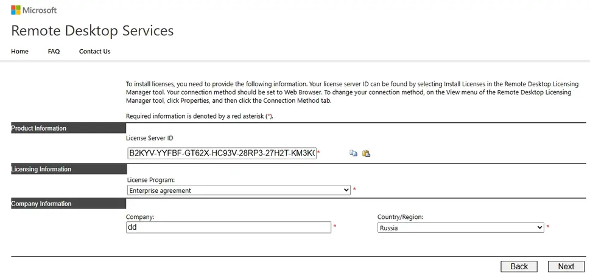

---
title: "Windows Server Terminal (RDS)"
discription: Windows Server
date: 2025-05-01T21:29:01+08:00 
draft: false
type: post
tags: ["Terminal","RDP","Windows Server","CAL"]
showTableOfContents: true
--- 

## Termenal for Free

### Add Terminal to  Domain

1. set DNS of DC server (if not work disable IPv6)

2. Change 

3. Choose domain my domain `dan.local`

4. Done !

### Troubleshooter Problems

1. If  doesn't connect to domain - disable ipv6

2. Network Level Authentication 

9. Run `sysdm.cpl` 

8. Disable NLA

### Create Terminal and Adds Roles 

10. Manage > Add Roles and Features

11. Next 

12. Select Role-based or feature-based installation and Next

13. Next 

14. [x] Remote Desktop Services , Next 

15. [x] NET. Framework 4.8 Features, Next

16. [x] Remote Desktop Licensing, Next 

17. Add Features

18. [x] Remote Desktop Licensing Diagnoser, Next 

19. Add Features

20. Install

21. After install Close

> Done !

### RD Licensing Activation for Free

1. Open RD Licensing Manager

2. Active Server, Next

3. Next

4. Open https://activate.microsoft.com/

5. Select Activate a license server > Next

6. Fill all and Next 

7. ID Product you can find here :

8. Next

9. Copy and save activatin key

10. Past Key here:

11. [x] and Next

12. Next

13. Open https://activate.microsoft.com/ and Choose `Install Client Access Licenses`

14. Past key and choose `Enterprise agreement` and Next

15. Choose per device or per user and Enterprise agreement Number (take random from google.com)

16. Difference:

17. Next

18. Copy New Licence Key

19. Past New Licence Key to Server

20. Finish

21. Done !

### Add GPO rules 

1. Run `gpedit.msc`

2. Go to Computer Configuration > Administrative Templates > Windows Components > Remote Desktop Services > Remote Desktop Session Host > Licensing and configure the following options:

3. **Use the specified Remote Desktop license servers** – specify the name or the IP address of the server where the RDS license is installed;

4. **Set the Remote Desktop licensing mode** – select the license type for RDS CALs.

