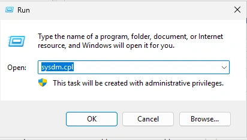

---
title: "Windows Server WDS"
discription: Windows Server
date: 2022-05-01T21:29:01+08:00 
draft: false
type: post
tags: ["Terminal","RDP","Windows Server"]
showTableOfContents: true
--- 


## Termenal for Free

[img0](images/0.webp)

### Add Terminal to  Domain

1. set dns of DC server


2. domain or workgroup


3. 


4.


5.


6.


7.


8


9.


10.


11.


12.


13.


14.


15


16.


17.


18.


19.


20.


```
```

```
```


```
```