---
title: "Simple Linux Routing"
discription: simple command to routing
date: 2020-05-06T21:29:01+08:00 
draft: false
type: post
tags: ["Network","Linux"]
showTableOfContents: true
--- 

to see all routing
## All Routing command 
```bash
ip route show
```
for see all routing for ip v6
### Routing for ip v6
```bash
ip -6 route show
```
### Old command to see routing 

Route - an obsolete utility included in the net-tools package. used to display the routing table and build static routes

you need install net-tools (apt install net-tools)
```bash
route -n
```
for v6 ip

```bash
route -n -6
```
routel - its utility for display routing its script for `ip route`

```bash
routel
```
### New utilities for networking
ip - is a linux command line utility from the iproute2 package. It allows configuration of the network subsystem and is a replacement for the `ifconfig`, `route`, `arp` utilities.

Usege:

ip [OPTIONS] OBJECT {COMMAND | help}

ip [-force] -batch filename
```bash
ip route list
```
```bash
ip -6 route 
```
```bash
ip -br -4 a
```

`-br`, `-brief` - display only basic information for easy reading

`-c`, `-color` - highlight with color

`-h`, `-human` - display data in a human-friendly way

`-o`, `-oneline` - output each entry on a new line

`-a`, `-all` - apply the command to all objects

`-r`, `-resolve` - display hostname with DNS

```bash
ip -br -6 -c -h -r -a  
```

```bash
ip -br -c neighbor 
```

Display links 
```bash
ip -br -link 
```

## IP Route
 

### Route add route before reboot via ip

Route add route BEFORE reboot via ip

ip route add default {NETWORK/MASK} via {GATEWAYIP} /{DEVICE}

```bash

ip route add 192.168.66.0/24 via 192.0.2.1

ip route add prohibit 10.1.1.1/32

ip -6 route add default via 2001:db8

ip -6 route add 2001:4860:4860::8888/128 via 2a05:4800:4:f200:: metric 100
```
for route delete

```bash
ip route del 192.168.66.0/24
```

### Route change route before reboot via ip

Route change route before reboot via ip

ip route add default {NETWORK/MASK} via {GATEWAYIP} /{DEVICE}

```bash
ip route change 192.168.25.0/24 dev ens3

ip route replace 192.192.25.0/24 dev ens3

ip route add unreachable 10.10.10.0/24

ip route add prohibit 10.1.1.1/32

ip route add throw 10.1.1.1/32
```

## NETPLAN
Netplan - to add routes permanently, it is necessary to write in the `netplan` configuration

modify file `/etc/netplan/00-installer-config.yaml` 

metric - metrics 
type - blackhole/unreachable/prohibit/trow
to - destination or default
via - gateway

try to connect if you not connected its return to config before change

```bash
netplan try 
```
after all good apply config 
```bash
netplan apply
```


## DHCP

### DORA

Discovery
```
src-mac=<client>, dst-mac=<broadcast>, protocol=udp,
src-ip=0.0.0.0:68, dst-ip=255.255.255.255:67
```
Offer 
```
src-mac=<DHCP-server>, dst-mac=<broadcast>, protocol=udp, 
src-ip=<DHCP-server>:67, dst-ip=255.255.255.255:67
```
Request
```
src-mac=<client>, dst-mac=<broadcast>, protocol=udp,
src-ip=0.0.0.0:68, dst-ip=255.255.255.255:67
```
Acknowledgement
```
src-mac=<DHCP-server>, dst-mac=<broadcast>, protocol=udp, 
src-ip=<DHCP-server>:67, dst-ip=255.255.255.255:67
```

DHCPNAK - is sent by the server instead of a final confirmation. Such
A denial may be sent to the client if the lease for the requested IP
has expired or the client has moved to a new subnet

### Renew DHCP
 
```bash
dhclient -r
```
DHCPRELEASE - The client sends this message to notify the server that the occupied IP has been released. In other words, this is an early termination of the lease.

DHCPINFORM - With this message, the client requests local settings from the server.
Dispatched when the client has already received an IP, but for proper operation
it needs a network configuration. The server informs the client
a response message indicating all the requested options


## DHCP CLIENT IDENTIFICATION

DHCP-сервер может отслеживать ассоциацию аренды с конкретным
клиентом на основе идентификации
A DHCP - server can track the association of a lease with a particular
client based on the identity


Identification can be achieved in two ways:

Based on the "caller-id" option (dhcp-client-identifier from RFC2132)

Based on the MAC address if the "caller-id" parameter is not specified


### Display stored pool of leased dhcp
Information about leased addresses is stored in:
```bash
cat /var/lib/dhcp/dhcp.leases
```

## DHCP Server Install


### Install DHCP
```bash
apt-get install isc-dhcp-server

```
for change minimal options in config
```bash
/etc/dhcp/dhcpd.conf

# minimal sample /etc/dhcp/dhcpd.conf
default-lease-time 600;
max-lease-time 7200;
subnet 192.168.1.0 netmask 255.255.255.0 {
range 192.168.1.150 192.168.1.200;
option routers 192.168.1.254;
option domain-name-servers 192.168.1.1, 192.168.1.2;
option domain-name "mydomain.example";
}
```
interface specification
```bash
/etc/default/isc-dhcp-server
INTERFACESv4="eth4”
```
restart dhcp service
```bash
systemctl restart isc-dhcp-server.service
```
for autorestart run
```bash
systemctl enable isc-dhcp-server.service
```

### DHCP Static leases

Binding of clients to permanent ip-addresses is configured in the file:
```bash
/etc/dhcp/dhcpd.conf
```
per host:
```bash
subnet 192.168.1.0 netmask 255.255.255.0 {
host server1 {
hardware ethernet DD:GH:DF:E5:F7:D7;
fixed-address 192.168.1.2;
}
host server2 {
hardware ethernet 00:JJ:YU:38:AC:45;
fixed-address 192.168.1.20;
}
```

## IPV6

### SLAAC

SLAAC - stands for Stateless Address Auto Configuration and the name pretty much explains what it does. It is a mechanism that enables each host on the network to auto-configure a unique IPv6 address without any device keeping track of which address is assigned to which node.

"workbench.editorAssociations": {
    "./slaac.svg": "hediet.vscode-drawio-text",
}


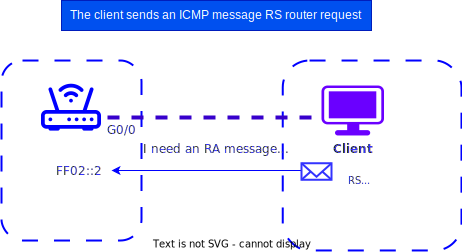 


- enabled on the router support IPv6. IPv6 forwarding 

- The router interfaces are assigned a network address (network prefix and prefix length, e.g. 2001:DB8:ACAD:D::1/64)

- If the client is configured to automatically get IPv6 address, it starts sending ICMP "Router Request" RS (Router Solicitation) on all
routers at address multicast address FF02::2


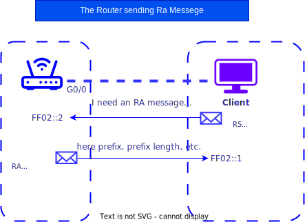

- The router receive RS message and sends back the message "Reply router" RA (Router Advertisement)

- AdvSendAdvert on

- Prefix included in RA message and network prefix length

- The RA message is sent to the IPv6 multicast address FF02::1. As an address source take local address link-local router channel address (FE80::/10 - FEBF::/ 10 )

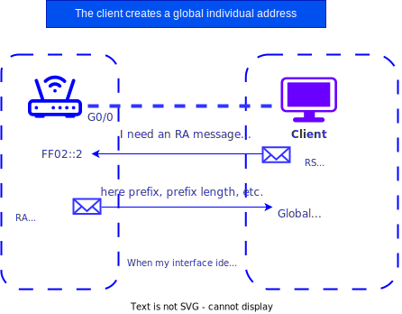

- Client, receiving in RA-message the prefixand a network prefix length, generates global individual IPv6 address by adding the node part in two methods:

- EUI-64 - using the EUI-64 process, using its 48-bit MAC address

- Generation of randomized - 64 bita random number generated by the client operating system

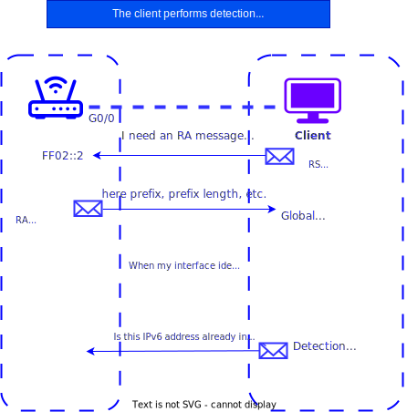

- SLAAC is a process without trackingstate. Therefore, before using a newly created IPv6 address, it is necessary to check its uniqueness 

- To do this, the client makes a request to thisaddress using the DAD (Duplicate Address Detection) protocol.(Dublicate Address Detection) - part of theICMPv6 protocol

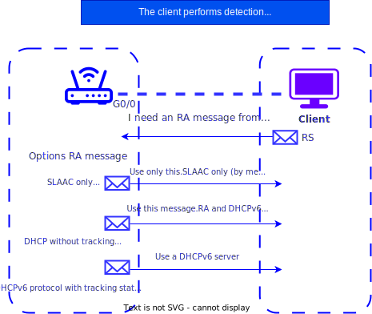

- Modes for configuring IPv6-client : SLAAC, DHCPv6 or SLAAC + DHCPv6 depends on the settings, contained in the ICMPv6 message RA "Router Response" message and are set on the router with special commands

- These commands set two flags.They are contained in RA messages and specify which of the options should be used by the client

Flags:
- Managed configuration flag addresses (M)
- Other configuration flag (O)

*The client operating system may ignore the RA message and use only the DHCPv6 server

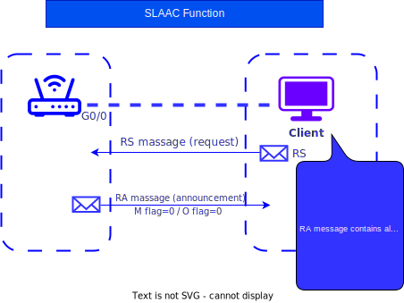

- The SLAAC function is a function ndefault on routers (M flag=0, O flag=0)
```
AdvManagedFlag: off
AdvOtherConfigFlag: on
```
- The client uses IPv6 for configuration addresses only information from the message RA is: 
"prefix, prefix length" 
default gateway (local address router channel) MTU DNS

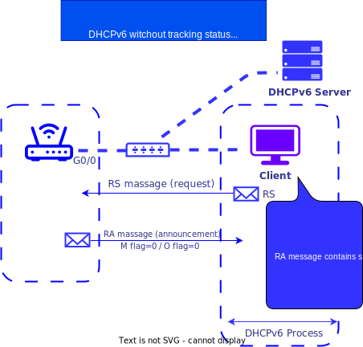

- SLAAC + DHCP enabled combination M flag =0, O flag=1
```bash
AdvManagedFlag: off
AdvOtherConfigFlag: on
```
Router(config-if)
```bash
# ipv6 nd other-config-flag 
```
The client uses IPv6 for configuration addresses:
- information from the RA message from the SLAAC server (prefix, prefix length, gateway by default - link-local address
router)
- 
information from the DHCPv6 server (list DNS servers)

### SLAAC Address Construction

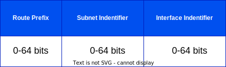

Routing prefix + subnet identifier = 64 bits

/64 is the minimum prefix that can be allocated to a user
Typically, the user is allocated a subnet / 48 - / 64

### SLAAC Subneting

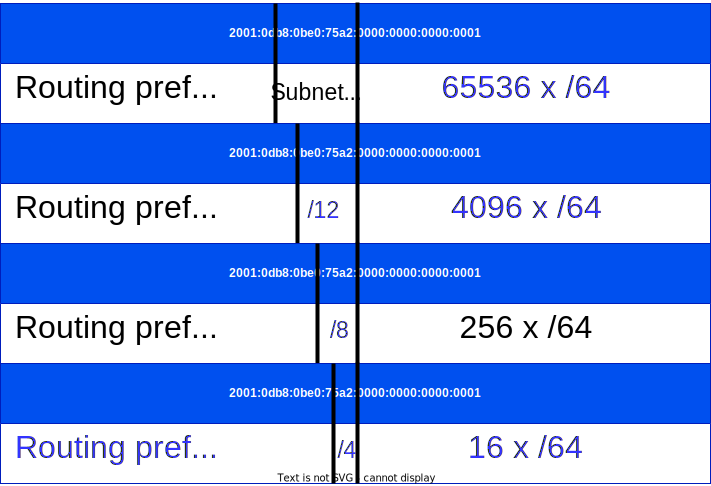

Multiple address types

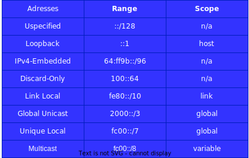


### Installation SLAAC on Ubuntu

Installation radvd
```bash
apt install radvd
```
Installing the debug utility
```bash
apt install radvdump
```
Configuration file
```bash
/etc/radvd.conf
```
run debug
```bash
radvdump
```

Set address in `/etc/netplan`

```yaml
network:
  version: 2
  ethernets:
    ens4:
    dhcp4: no
    dhcp6: no
    addresses:
    - 2a05:AB00:4:f201::1/64
```

/ETC/RADVD.CONF
```
interface ens4
{
      AdvSendAdvert on; ## (Sending advertisement messages to other hosts)
      AdvManagedFlag: off
      AdvOtherConfigFlag: off
      AdvLinkMTU 1500; ## (Fragmentation unwanted (tm))
      MaxRtrAdvInterval 300;
      RDNSS 2001:4860:4860::8888 2001:4860:4860::8844 # DNS
      {
      };
      prefix 2a05:AB00:4:f201::/64 ## (IPv6 subnet prefix assigned by our PoP)
      {
              AdvOnLink on;
              AdvAutonomous on;
      };
}

```
### NETPLAN on Client
```yaml
network:
  version: 2
  ethernets:
    ens4:
      dhcp6: true
      accept-ra: yes
```
Option to send route with highest priority
```bash
route ::/0
{
AdvRoutePreference high;
};
```
Sending DNS server addresses via SLAAC
```bash
RDNSS 2001:4860:4860::8888 2001:4860:4860::8844
```
MTU Correction
```bash
AdvLinkMTU 1500;
```

## Tools for working with MAC addresses

### ARP Tools

arp tables 
```bash
arp -n
```
anti arp spoofing

ip -4 neighbour add 192.168.2.1 lladdr 50:00:01:02:00:01 dev ens3
ip -4 neighbour change 192.168.2.1 lladdr 50:00:01:02:00:01 dev ens3

### ARPscan

arp install arp-scan
```bash
arp-scan --inteface=eth0 localnet

arp-scan --inteface=eth0 192.168.0.0/24
```

### ARP = NDP
NDP = Neighbor Discovery Protocol

NDP used 5 different types of packages:

type 133 - Router Solicitation - 
type 144 - Router Advartisement
type 135 - Neighbor Solicitation
type 135 - Neighbor Advartisement
type 137 - Redirect

Neighbor Discovery - uses several different specials addresses multicast :
- Link-local scope address for all nodes - FF02::01 (multicast)
- Link-local scope address for all routers - FF02::02 (multicast)


## ICMPv6

ICMPv6 is an integral part of IPv6

- used for error reporting, arising from packet processing and to perform other functions such as diagnosis

- there are 2 types of ICMPv6 message (error - type 0-127), (information type 128-255)  


Neighbor Solicitation - Nodes perform address resolution through multicast distribution neighbor solicitation which asks the target host to return a link layer address (MAC)

- to make sure that the neighbor is still a life 

- the target node returns its link layer address (MAC) (unicast) Router Advartisement


Neighbor Solicitation 

- one pair of request-response packets enough for both to allow data link layer addresses (MAC) one another

- is used for detection Dublicate Address Detection (DAD)


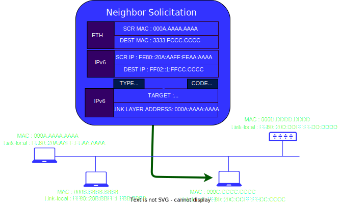

Source:
- address set on the interface from which the message is sent or (in DAD process) 

Destination:
- solicited-node multicast address or destination address


solicited-node multicast address calculates from unicast and anycast address host. 
all the hosts same prefix FF02:FF00:0/104. to prefix add 24 low-order bit address (unicast or anycast) as a result solicited-node multicast adress be range from FF02:0:0:0:0:1:FF00:0000 to FF02:0:0:0:0:1:FFFF:FFFF

the host must calculate and сonnected (on the respective inteface) to all solicited-node multicast adresses, who received from all unicast and anycast adresses who configured
on interface host (automaticly or manualy)

Solicited-node multicast address used by protocol - Neighbor Discovery or (ND or NDP)


Neighbor Advertisement 
- request on messege Neighbor Solicitation

node can messege unsolicited (no answer) Neighbor Advertisement for quickly distribution new information (unreliably) for exemple : announcement change link-layer adresses (MAC)

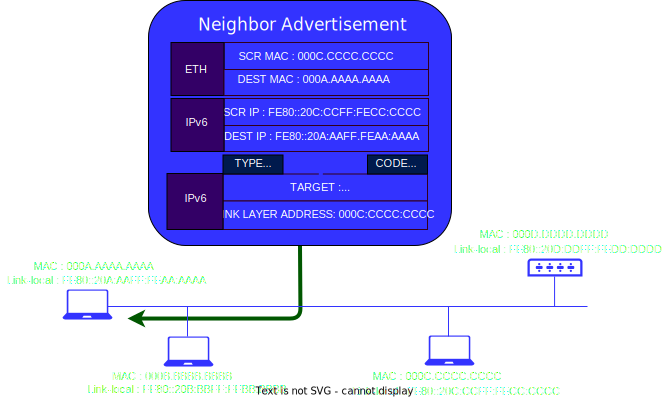

Source: 
- its address of interface from who send messege 

Destination:
- Source Address of Neighbor Solicitation or all-nodes multicast address
  


## MAC

01-00-5E-00-00-00 to 01-00-5E-7F-FF-FF IPv4 Multicast

33-33-00-00-00-00 to 33-33-FF-FF-FF-FF IPv6 Multicast

01-08-C2-XX-XX-XX service protocol STP, LLDP, EAPOL


### Know MAC

for know MAC address on inteface 
```bash
ifconfig ens3 | grep ether
```

```bash
ip –br link
```
* -br = tables

```bash
cat /sys/class/net/ens3/address
```
* /en3/ <= your interface

```bash
ifconfig ens3 | grep ether
```
### Change MAC


macchanger 
install 
```bash
apt-get install macchanger macchanger-gtk 
```
down interface
```bash
ip-link set dev ens4 down
```
Random MAC
```bash
nacchanger -r ens4
```
Don't change the vendor bytes of MAC
```bash
nacchanger -e ens4
```
Random MAC
```bash
nacchanger --mac = XX:XX:XX:XX:XX ens4
```
Reset MAC address to its original, permanent hardware value.
```bash
nacchanger -p ens4
```
up interface after changes
```bash
ip link set dev ens4 up
```

It is possible to change MAC address via NETPLAN
In the interface section of the `/etc/netplan/00-installer-config.yaml` file
Add fields
ens3:
  match:
    macaddress: 50:00:00:01:00:00 #(default MAC-address)
   macaddress: 50:11:22:33:44:55 #(MAC what you want)
```yaml
ens3:
  match:
    macaddress: 50:00:00:01:00:00
  macaddress: 50:11:22:33:44:55
  dhcp4: no 
  routes: no
   - to: default
   - via: 2a05:4800:4:f200::
   - to: default
   - via: 192.168.1.1
```
## VPN

## Wireguard

1. Updating the list of packages.

```bash
sudo apt-get update && sudo apt-get upgrade
sudo apt-get install wireguard
```
2. Firewall settings
On deb-based systems, by default, the firewall allows all packets. But if protection is configured in our system, then we need to open a UDP port for WireGuard. Different sources have different numbers, but the official website uses 51820:

```bash
iptables -I INPUT -p udp --dport 51820 -j ACCEPT
```
To save the setting, use the iptables-persistent package:
```bash
apt install iptables-persistent
```
```bash
netfilter-persistent save
```

You can proceed to install the VPN server.

### Installing and configuring the server

```bash
apt install wireguard
```
Create public and private keys to be used by our server:
```bash
wg genkey | tee /etc/wireguard/private.key | wg pubkey > /etc/wireguard/public.key
```

We display the contents of the private key on the screen:
```bash
cat /etc/wireguard/private.key
```
In my case it is:
```bash
2Hl2UlyD/xFrDyzIBEkfPa27yKllp0O+7e9023u8sHk=
```
We fix it. We need it to set up the server.

Create a configuration file for the server:
```bash
vi /etc/wireguard/server.conf

[Interface]
PrivateKey = 2Hl2UlyD/xFrDyzIBEkfPa27yKllp0O+7e9023u8sHk=
Address = 176.16.10.1/24
ListenPort = 51820
SaveConfig = false
```
* Where:

PrivateKey is the private key that we created and looked at with the cat command.
Address - address in the VPN network. You can use any subnet, but you should limit yourself to choosing from the reserved ranges for local networks. Also, this subnet should not overlap with the used ranges.
ListenPort is the port on which our server will run.
SaveConfig - whether or not to save the configuration from the current state upon shutdown. In fact, if set to true, then restarting the service does not accept new changes in the configuration file, but returns the old settings. To make changes, you will need to stop the service, make changes, start the service. It didn't seem very convenient to me.

Let's autostart the service:

```bash
systemctl enable wg-quick@server --now
```
* pay attention to what comes after the dog ( server ). This is the name of the configuration file. If desired, we can create many such files and run several VPN servers on different ports.

Let's make sure that our server has started listening on the specified port:
```bash
ss-tunlp | grep :51820
```
The server is ready to accept requests.

### Client connection

As an example, we will install and configure clients for Windows and Linux. The setup will be done in four steps:

We look at the key on the server.
Setting up the client.
Setting up the server.
We check the connection.

Key on the server
On the server, we look at the public key that we generated at the beginning of the instruction:
```bash
cat /etc/wireguard/public.key
```
In my case it was:
```bash
Z5E6sWmAX9JqSBpO2frcIZ9vkkm/V+8xgP7ZxWXnOCs=
```
### Client setup

 for Ubuntu or Debian:
 ```bash
 apt install wireguard
 ```
 ```bash
 wg genkey | tee /etc/wireguard/private.key | wg pubkey > /etc/wireguard/public.key
```
After installation, you need to generate keys and complete the configuration.

We create keys with the command:
```bash
cat /etc/wireguard/private.key
```
```bash
cat /etc/wireguard/public.key
```
We fix the values. To configure the client, we need the contents of the private key, to configure the server - the public key.

Create a configuration file for the server:

```bash
vi /etc/wireguard/client.conf
```
```bash
[Interface]
PrivateKey = <contents-of-client-privatekey>
Address = 176.16.10.10/24
 
[Peer]
PublicKey = <contents-of-server-publickey>
AllowedIPs = 176.16.1 0.0/24
Endpoint = 1.1.1.1:51820
PersistentKeepalive = 15
```
- [Interface] —  block of settings for the client.
- PrivateKey is  the client's private key. We generated it.
- Address -  The VPN IP address that will be assigned to the client.
- [Peer] -  settings for connecting to the server.
- PublicKey -  The public key of the server. We looked at it at the very beginning of this section.
- AllowedIPs -  route allowed for the client.
- Endpoint -  the address and port of the server to which we will connect as a client.
- PersistentKeepalive -  interval between connection availability checks.

Let's allow autostart of the service:
```bash
systemctl enable wg-quick@client
```
* as in the case of the server, what comes after the dog ( client ) is the name of the configuration file. If desired, we can create many such files and run several VPN connections to different servers.


### Adding a client on the server

Let's open the configuration file for our server:

```bash
vi /etc/wireguard/server.conf
```

```
[Peer]
PublicKey = 6sDdWDSdYcoBAC7EVKg+z8Gcd+F5OQDkKBELf9MEOTY=
AllowedIPs = 176.16.10.10/32
```
 where  PublicKey is the public key that we saw when setting up the client; AllowedIPs - allowed address for the client (which we gave him).
** for each client that will connect to the server, we must create our own  [Peer] settings block .

Restarting the service:

```bash
systemctl restart wg-quick@server
```

Routes through the VPN server
Typically, a VPN is used as a transit to other subnets. Consider now how to configure our server to act as a router. Settings are performed both on the server and the client.

We will assume that our server should let clients into the 192.168.100.0/24 network.

On server

Open `sysctl.conf` for editing:
```bash
vi /etc/sysctl.conf
```
```
net.ipv4.ip_forward=1
```
Apply sysctl settings:
```bash
sysctl -p /etc/sysctl.conf
```
Add a rule to the firewall:
```bash
iptables -t nat -I POSTROUTING -o ens18 -j MASQUERADE
```
* in this example, we are counting on the fact that our network 192.168.100.0/24 is available to the server via the  ens18 interface . You must replace the value with your own.

Our server is configured as a router to the 192.168.100.0/24 network. Let's go to the client

On the client
In the client configuration, edit the  AllowedIPs option in the  [Peer] block :
```bash
[Peer]

AllowedIPs = 176.16.10.0/24, 192.168.100.0/24

```
* note that we have added the  192.168.100.0/24 subnet - this will cause the client to connect to the server with a route to this subnet through the VPN server.

And if we want `all traffic` to go through the VPN, we set the value for  AllowedIPs :


```bash
[Peer]

AllowedIPs = AllowedIPs = 0.0.0.0/0
```
